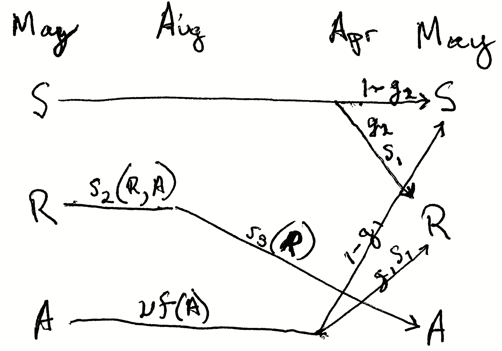

# Density-independent Demography {#DID}
In the preceding chapter, we listed Hastings' [@Hastings2011] key principles and assumptions of single species population growth. One of the key assumptions is that "all individuals in a population are identical." In this chapter, we elucidate an important violation of that assumption, population structure.

```{r human, echo=FALSE, fig.cap='Demography of human populations of Mexico and Sweden. Based on 1990 data from US Census Bureau, Population Division, International Programs Center.', out.width='30%', fig.show='hold'}
include_graphics(c("figs/AgeDistM.png","figs/AgeDistS.png","figs/AgeSpecFert.png"))
```


*Populations have structure.* Consider the human populations of Mexico and Sweden in 1990. Mexico had a much larger fraction of their population in child bearing age classes or younger (Fig. \@ref(fig:human)). In addition, the age-specific fertility rate was higher in Mexico, especially for younger women
(Fig. \@ref(fig:human)). How did this happen, and why did Mexico have so
many young people? What were the consequences of this for their
culture, their use of resources, their domestic and foreign policies,
and their future population growth? How about Sweden? 

Demography is the study of populations with special attention to their structure [@Lincoln:1998ta]. Originally, age-based human demography was the provenance of actuaries who helped governments keep track of the number citizens of different ages and thus, for instance, know how many would be available for conscription into the military.^[In his chapter entitled "Interesting Ways to Think about Death" G.E. Hutchinson @Hutchinson1978 cites C.~F. Trenerry, E.~L. Gover and A.~S. Paul (*The Origins and Early History of Insurance*, London, P.~S. King \& Sons, Ltd.) for description of early Roman actuarial tables.]

*The reason we model the structure of populations* is because various demographic rates vary markedly with these stages. Juveniles produce no offspring. Very few seeds survive an entire year, whereas some large adults survive very well. We use structure when that structure is associated with important differences in demographic rates: *survival*, *fecundity*, and *growth*. 

The *structure* to which we refer is simply the organization of populations by some character such as life history stage, age, or size. Sizes and ages are often reduced to categories such as we saw in human populations (e.g., 0--4.9\,y, 5--9.9\,y,...). Sizes may be based on any reliable and repeatable measure that relates to demographic rates and are similarly binned. Life history stages may include eggs, larvae, metamorphs, juveniles, and adults in amphibians, or seeds, rosettes, and reproductive stems in herbaceous plants. With a variable such as size, we don't need to use categories, but rather we can use size as a continuous variable; we address this briefly later in the chapter.

Structured population models allow us to intertwine species-specific natural history and quantitative methods. This makes the approach especially appealing for the conservation biology of threatened and endangered species. We use structured population models to improve our understanding of a population or improve predictions of its future dynamics, or guide the management of the population. We might learn a lot about what controls the abundance of a species if we can test ideas related to different stages, ages, or sizes. What limits the population growth of the Western toad -- is it egg survival, or overwintering survival of juveniles? Where should we invest our efforts to control garlic mustard (*Alliaria petiolata*) -- killing the first year rosettes, or the second year adults? Why are cacti generally endangered [@Goettsch2015]---is the smallest size or the largest size more important for long-term survival? We can use structured population models to address such questions.

## A two stage matrix model

```{r toadlh, echo=FALSE, fig.cap='Like all amphibians, the Western toad (*Anaxyrus boreas*) has a complex life cycle, with several life history stages. Adults breed in early spring, laying eggs in water. The larvae (tadpoles) hatch and develop over the spring and summer, and then metamorphose (become metamorphs), and then juveniles. Juveniles require more than a year to mature. Adults can live up to about a decade. American toads (*A. americanus*) do the same thing.', out.width='65%', fig.show='hold'}
include_graphics("figs/VoneshF1.png")
```

A matrix model of a structured population consists of *stages* and *transitions*.  @Vonesh:2002fr used matrix projection to assess the importance of egg mortality for declines in amphibian populations. Their model of the Western toad (*Anaxyrus boreas*, Fig. \@ref(fig:toadlh)) comprises two stages (juveniles and adults) and four transitions. 

In all structured popuation models^[Models comprise stages and transitions.], a transition is the annual contribution of an individual in stage $i$ at time $t$ to stage $j$ at $t+1$. In Fig. \@ref(fig:toadlh), the transition from juvenile to adult is the probability that a juvenile survives an entire year and also matures, becoming sexually viable.^[Practice these pronunciations: $\sigma$ is sigma $\phi$ is phi or phee; $\rho$ is rho.]  The transition from juvenile to juvenile is the probability that a juvenile survives a year and does not mature. The transition from adult to adult is the probability that an adult survives the year. These three transitions are probabilities. 

The transition from adult to juvenile (Fig. \@ref(fig:toadlh)) is typically referred to as *fecundity*, and it is the product of several events. Vonesh and De la Cruz assume that this transition depends on the population sex ratio, the average clutch size of a female, egg survival, larval survival and metamorphosis, and the overwintering survival of metamorphs. They also assume that larval survival depends on density. Thus what we refer to as "fecundity"^[In structured population models, fecundity includes survival.] is far more than just average clutch size because it must include all the processes that occur over the year associated with producing a clutch and the survival of that clutch.

Structured population models allow us to take advantage of the natural history of our study species. For our study population, at a minimum, we need to (i) identify stages that differ in their demographic rates, and (ii) when individuals tend to breed.

Consider the example of the Western toad (*Anaxyrus boreas*). As with all amphibians, survival and fecundity rates depend heavily or entirely on life history stages of egg, larvae (tadpole), juvenile, and adult. Breeding often occurs in early spring, depending on latitude and elevation. If we wanted to model juveniles and adults, we would typically sample a population prior to breeding when juveniles and adults are just starting to become active.

The design of a structured population model depends on the sampling or census schedule. These models are typically assume an annual census that occurs just before, and just after seed set, egg laying, or births. We refer to these as *pre-breeding* or *post-breeding* census models. @Vonesh:2002fr (Fig. \@ref(fig:toadlh)) use a pre-breeding census model. It is a pre-breeding census because only juveniles and adults are present in the population at the time of sampling. If the design assumed a post-breeding census (later in the year), it would include three stages, with larva (tadpoles) in addition to juveniles and adults.

The reasons for using a pre- *vs.* post-breeding census include our ability to actually identify stages, sample or census individuals in each stage, and whether we can estimate parameters. For example, it may be easy to accurately estimate the abundance of juvenile and adult toads, but very difficult to estimate larval density and larval survival. In such a case, we could represent the adult to juvenile transition as a black box, estimated as the total number of new juveniles in year $t+1$ divided by the number of adults in year $t$. 

We can draw two different types of life cycle graphs for this two-stage model in just such a population (Fig. \@ref(fig:vdlc1)). Some people find one more illuminating than the other. It is useful to be able to use both.

```{r vdlc1, echo=FALSE, fig.cap='Two types of life cycle graphs. These both represent an amphibian pre-breeding model.', out.width='65%', fig.show='hold'}

# names <- c("Juveniles", "Adults")
# M <- matrix(nrow=2, ncol=2, byrow=TRUE, data=c("p11", "p12", "p21", "p22"))

m2 <- matrix(c("Juv-Juv", "Juv-Adult", "Adult-(egg-larva-metamorph)-Juvenile", "Adult-Adult"), nr=2, dimnames=list(c("Juveniles","Adults"), c("Juveniles","Adults")) )
par(mar=c(0,0,0,0))
knitr::include_graphics("figs/vdlc2.JPG")
plotmat(m2, pos = c(2), curve = matrix(c(1, 0, .6,1), nr=2), lwd = 1, box.lwd = 2,
    cex.txt = 0.8, box.type = "circle", box.prop = 1.0, 
    self.shiftx=0, self.shifty=-.15, self.arrpos = 1.5*pi)
``` 

All the stages must be present during the annual census, and each arrow or
transition must represent everything that happens over the
entire year. Notice the transition from adult toad to juvenile toad
(Fig. \@ref(fig:vdlc1)) includes egg production, egg survival, tadpole or
larva survival and growth, and metamorphosis out of the aquatic
stage, and also overwintering of the juvenile. This are obviously important events. We make explicit only those stages that we count during our census; all other other events are implicit within the transitions.

Once we have a life cycle diagram (Fig. \@ref(fig:vdlc1)), we create a *transition* or *projection* matrix that represents mathematically all of the stages and transitions between stages \@ref(eq:m1). This matrix will have one row and one column for each stage, and the columns represent the stages in year $t$ and the rows represent the stages in year $t+1$.  We refer to a single row by *i* and a single column by *j*. Each column represents stage *j* in year $t$, and each row represents stage *i* in year $t+1$. For our amphibian example, the transition matrix will have two rows and two columns. It will be a "two by two", or $2 \times 2$ matrix. 
\begin{equation}
(\#eq:m1)
 \mathbf{A} =
\left(
\begin{array}{cc}
 p_{11}&F_{12} \\
p_{21}&p_{22} 
\end{array}
\right)
\end{equation}
If \@ref(eq:m1) represents the Western toad (Fig. \@ref(fig:vdlc1)), then transition

* $p_{11}$ is the probability that juveniles survive but fail to mature,
* $p_{21}$ is the probability that juveniles survive and also mature,
* $p_{22}$ is the probability that adults survive, and 
* $F_{12}$ is contribution of the average adult to the juvenile stage.

In addition to fecundity, survival, maturation or growth from one stage to the next, some organisms undergo *regression* (Fig. \@ref(fig:conceptualmatrix)). Regressing means to transition from a later stage to an earlier stage. For instance, and plant can shrink in size due to physical damage, disease or herbivory. A plant can also return temporarily to a non-reproductive stage after a large bout of reproduction. These are examples of regression (Fig. \@ref(fig:conceptualmatrix)). 

One assumption we make here is that individuals set seed, or give birth, all at once. Therefore, we refer to our model as a *birth-pulse model*. On the other hand, if we assume that we have continuous reproduction throughout the year, we do things differently, and would refer to this as a *birth-flow model*. Whether a population is breeding continuously over a year, or whether reproduction is seasonal, will influence how we estimate fecundities. Even for synchronously breeding populations, many models pool years into a single age class or stage. The interested reader should consult an authoritative text such as @Caswell:2001gu.

```{r conceptualmatrix, echo=FALSE, fig.cap='A transition matrix, in which each element in the matrix describes the probability that an individual of a given size $j$ at time $t$ appears as size $i$ and time $t+1$. Reproduction is typically a contribution to the minimum size, stage, or age. This matrix may comprise a small number of rows and columns (2-10), or, in the case of integral projection, an infinite number of rows and columns. The number of rows is equal to the number of columns.', out.width='100%', fig.width=6, fig.height=6}

par(mar=c(1,3,3,1), xaxs = "i", yaxs = "i", pty = "s")
plot(0:1, 0:1, type="n", axes=F, ylab=expression("Size at "*italic(t) + 1), xlab="" )
mtext(expression("Stage "*italic(j)*" at "*italic(t) ), line=2 )
mtext(expression("Stage "*italic(i)*" at "*italic(t) + 1), side=2, line=2 )

polygon(x = c(0, 0, .8, 1, 1, .2), y = c(1, .8, 0, 0, .2, 1), col="lightgrey", border = F)
text(.57, .57, "Regression", srt = -45)
text(.43, .43, "Growth", srt = -45)

polygon(x = c(0, 0, .92, 1, 1, .08), y = c(1, .92, 0, 0, .08, 1), col="darkgrey", border = F)
text(.5, .5, "Stasis", srt=-45)

polygon(x = c(0.4, 0.4, 1, 1), y = c(1, .9, .9, 1), col="lightgrey", border = F)
text(.8, .95, "Reproduction")

mtext("A", adj = c(.24), cex=.75)
arrows(.25, 1, .25, .61, length=.1)
arrows(.25, .61, 0.005, .61, length=.1)
mtext("A' (> A)", padj = 1, side=2, at=.62, las=2, cex=.75)

mtext("B", adj = c(.55), cex=.75)
arrows(.55, 1, .55, .95, length=.1)
arrows(.55, .95, 0.005, .95, length=.1)
mtext("B' (= 1)", side=2, at=.95, las=2, cex=.75)

mtext("C", adj = c(.76), cex=.75)
segments(.75, 1, .75, .9, lty=3)
arrows(.75, .9, .75, .25, length=.1)
arrows(.75, .25, 0.005, .25, length=.1)
mtext("C' (= C)", padj = 1, side=2, at=.25, las=2, cex=.75)

mtext("D", adj = c(.85), cex=.75)
segments(.83, 1, .83, .9, lty=3)
arrows(.83, .9, .83, .3, length=.1)
arrows(.83, .3, 0.005, .3, length=.1)
mtext("D' (< D)", padj = 1, side=2, at=.31, las=2, cex=.75)
box()

``` 


A life cycle graph (Figs. \@ref(fig:toadlh), \@ref(fig:vdlc1)) and the corresponding transition matrix \@ref(eq:m1) constitute our model. The matrix **A** for our structured population is directly analogous to $\lambda$ for our unstructured model of discrete population growth in the previous chapter.^[A is the analog of lambda.] 

Later, we will project the population in an analogous way, using 
$$\mathbf{ N_{t+1} = A N_t}$$
and to do that, we need a refresher on matrix multiplication. 
 
## A brief primer on matrices
We refer to matrices by their rows and columns. A matrix with three rows and one column is a $3 \times 1$ matrix (a "three by one" matrix); we *always* state the number of rows first. Matrices comprise *elements*; an element of a matrix is signified by its row and column. The element in the second row and first column is $a_{21}$. The *dimension* of a matrix is its number of rows and columns.

To add two matrices, they must have the same dimensions. Consider two matrices, **A** and **B** . To add these two matrices we simply add the elements in the same row and column of both matrices, as below.

\begin{align*}
\mathbf{A} &=
\left(
\begin{array}{cc}
a & b \\
c & d
\end{array} \right); \;
\mathbf{B} =
\left(\begin{array}{cc}
m & o\\
n & p
\end{array}\right)\\
\mathbf{A+B} &=
\left( \begin{array}{cc}
\left( a+m \right) & \left(b+o \right)\\
\left(c+n \right) & \left(d+p \right)
\end{array} \right) 
\end{align*}


Multiplying matrices is a little more complicated. To do so, we mutliply elements and then sum them:

* multiply each row element of the first matrix (**A**) times each column element of the second matrix (**B**),
* sum the element-wise products, and 
* place this sum in the respective element of the final matrix.  

This process is what we refer to as  a *dot product* or sometimes *inner product*. When we have two vectors of equal length $x$ and $y$ the dot product is
$$x \cdot y = x_1y_1 + x_2y_2 + \ldots + x_n y_n$$
A dot product begins with two equal length vectors and returns a single number (i.e. a scalar).

Consider the matrix multiplication in \@ref(eq:exM).  We first multiply each element of row 1 of **A** ($a\; b$), times the corresponding elements of column 1 of **B** ($m\; n$), sum these products, and place the sum in the first row, first column of the resulting matrix. We then repeat this for each row of **A** and each column of **B**.

\begin{align}
(\#eq:exM)
\mathbf{AB} &=
\left( \begin{array}{cc}
\left( am + bn \right) & \left(ao+bp \right)\\
\left(cm + dn \right) & \left(co + dp \right)
\end{array}\right) 
\end{align}

To do this, the number of columns in the first matrix must equal the number of rows in the second matrix. It also means that the resulting matrix will have the same number of rows as the first matrix, and the same number of columns as the second matrix. Multiplying a $2 \times 2$ matrix by a $2 \times 1$ results in a $2 \times 1$. Multiplying a $3 \times 3$ matrix by a $3 \times 1$ results in a $3 \times 1$. We cannot multiply a $2 \times 1$ matrix by a $2 \times 2$ because the number of columns in the first matrix (1) does not match the number of rows in the second matrix (2).

Let's define two $2 \times 2$ matrices, **M** and **N**, filling in one by rows, and the other by columns.
```{r}
(M <- matrix( 1:4 , nrow=2, byrow=TRUE))
(N <- matrix( c(10, 20, 30, 40), nrow=2)) # byrow=FALSE is the default.
```

Adding these matrices is simple. Here we do the first element by hand, and then sum the matrices all at once.
```{r}
# 1 + 10
M[1,1] + N[1,1]
M + N
```
To mulitply **M** and **N**, we multiply and then sum the first row of $M$ by the first column of $N$, and make this element $a_{11}$ of the resulting matrix product.
```{r}
# 1*10 + 2*20
M[1,1] * N[1,1] + M[1,2] * N[2,1] 
```
This is the dot product.

In R, we must use `%*%` to signify that we mean matrix multiplication.
```{r}
M %*% N
```

If we multiply **M** times a $2 \times 1$ matrix **D**, what should we get? 
```{r}
D <- matrix(c(100, 200), nrow=2)
M %*% D
# note that we cannot perform D %*% M
```
Make sure you could write out the multiplication and summation for each element in the resulting matrix.

The transpose of **M** is the same matrix, but where we flip it along the diagonal, switching rows and columns. We use $\mathbf{M^T}$ to represent the transpose operation. In R, we use `t()`.
```{r echo=TRUE}
M; t(M)
```
We use the transpose of **A** to calculate reproductive value, later in the chapter.


## Decomposing **A**
A slightly different way to conceptualize our transition matrix is to consider it the three separate matrices, one each for  growth, survival, and fecundity,
$$\mathbf{ A = GS + F }$$. 

Survival, **S**, and growth, **G**, have these elements: 

* each stage $j$ has its own probability of survival $s_j$, which describes survival of each stage from $t$ to $t+1$.
* each survivor in stage $j$ will grow or regress into a different stage, or remain in the same stage, with probability $g_{ij}$.

In a demographic context, fecundity, **F**, is the surviving number of offspring produced by the average individual in stage $i$. Sometimes this is a complete black box, in which we can only count the adults in year $t$ and the offspring in year $t+1$. Other times, we estimate of the probability that an individual in stage $i$ reproduces at all (yes/no), as well as the average number of offspring of an individual that does actually reproduce, and the survival and growth of the adults or the resulting offspring. It all depends on the detail we have of our study system. And, of course, it depends heavily on whether we census our population shortly before reproduction (pre-breeding census), or shortly after reproduction (post-breeding census).

For our Western Toad (Fig. \@ref(fig:toadlh)), this results in
\begin{equation*}
(\#eq:SGF)
 \mathbf{A = GS + F} = 
\left(
\begin{array}{cc}
1-\mathrm{P} & 0 \\
\mathrm{P} & 1
\end{array} \right)
\left(
 \begin{array}{cc}
 \sigma_j&0\\
0 & \sigma_a
 \end{array} \right)
+
\left(
\begin{array}{cc}
0 & \rho \phi \sigma_e \sigma_t \sigma_m \\
0 & 0
\end{array} \right)
\end{equation*}

Combining these we get,
\begin{equation*}
(\#eq:SGF)
 \mathbf{A = GS + F} = 
\left(
\begin{array}{cc}
\sigma_j (1-\mathrm{P}) & \rho \phi \sigma_e \sigma_t \sigma_m \\
\sigma_j \mathrm{P} & \sigma_a
\end{array} \right)
\end{equation*}

where $\sigma_j,\,\sigma_a$ are survival of juveniles and adults, and P is the probability of juvenile maturation ("growth"), given survival. If an adult survives it always remains an adult ($g_{22}=1$) and never regresses ($g_{12}=0$). Fecundity occurs only in adults, and it is the product of the sex ratio ($\rho$), average clutch size per female ($\phi$), egg survival ($\sigma_e$), survival of tadpoles ($\sigma_t$), and the overwintering survival of the metamorphs ($\sigma_m$).^[Survival, **S**, is really a vector, here ($\sigma_j,\,\sigma_a$). In order to multiply survivals and the growth matrix in the way we want, we need to multiply **S** by the identity matrix to get what we see above.]


Vonesh and de la Cruz went further and added *density-dependence* using a term for the negative effects of high tadpole density on tadpole survival and growth. We do not show that here, but regardless how complex the natural history gets, we can build natural history into our models.


## A three stage model

Now we describe a three-stage model of a plant population. Like our amphibian example, it is a *pre-breeding* model, relying on a pre-breeding census. Nonetheless, it includes a seed stage for the seed bank, where seeds may be more than one year old. Eleanor @Pardini:2009aa and colleagues modeled garlic mustard (*Alliaria petiolata*), a biennial plant species that is an exotic invasive species in the eastern deciduous forest of the U.S. The stages they choose to represent were those present in May: seeds in the soil seed bank, 1--2 month old immature rosettes, and adults (Fig. \@ref(fig:garlic1)).
```{r garlic1, echo=FALSE, fig.cap='The life cycle of garlic mustard using a pre-breeding census (Pardini et al. 2009). The census takes place in May of each year. Each arrow represents the transition from May to May. Seeds germinate in early spring and become rosettes (basal leaves near the soil surface). The rosettes experience mortality all summer, fall, and winter. Surviving rosettes become reproductive adults the following spring and summer. Adults flower and are pollinated in June, after which the fruits ripen and seeds mature. Seeds overwinter for at least six months before germinating in the spring. Not all seeds germinate, but they may remain viable in the seed bank for several years. Thus, the complete life cycle at least two years. Once the seeds germinate, the plant requires over a year to reach maturity, and produce flowers, fruits and seeds. Where parameters are functions of A or R (e.g., $s_2(R,A)$), they permit the effect of adult or rosette density on those parameters. Here we do not include that density dependence.', fig.show="hold"}



```

Let's work through these probability transitions. 

* $s_1$, a germinated seed survives as a rosette.
* $s_2$, surviving from May to August as a rosette.
* $s_3$, surviving from August to early May and becoming a reproductive plant.
* $v$, a seed is viable (survives and can germinate).
* $g_1$, a viable seed germinates in the first season, or $1-g_1$ remains ungerminated.
* $g_2$, a viable seed germinates in the second season or $1-g_2$ does not.

Fecundity, $f$, is the average number of seeds per reproductive plant. 

The transition matrix **A** would thus be

\begin{equation*}
(\#eq:pardini)
 \mathbf{A} = 
\left(
\begin{array}{ccc}
 1-g_2  & 0       & v(1-g_1)f \\
g_2 s_1 & 0       & v g_1 s_1 f \\
0       & s_2 s_3 & 0
\end{array} \right)
\end{equation*}


Put into your own words each of the transition elements.

What about the transition from adult to rosette? Did the plant shrink? While perennial plants can get smaller, or *regress*, that is not what happens here. In this transition, the adult in May gets pollinated, develops fruits, the seeds mature and are deposited on the soil late that summer or fall. Those seeds are survive overwinter, germinate in early spring, and grow into rosettes in April, and survive until the census in that May. Thus, stage 3 (adult) contributes to stage 2 (rosette) through reproduction plus survival and germination of the seeds and growth and survival of the young rosette. The transition from adult to seed, $p_{13}$, occurs only when the seeds do not germinate after the first winter, but spend another year in the seed bank in the soil.


Once we have the transition matrix, we can use it to characterize many features of the population, including the finite rate of increase ($\lambda$), the predicted relative abundances of the various stages, and the relative importance of each separate transition $p_{ij}$ for the long term population growth rate. We will do this in a later section, but first will explore projection. It is frequently useful to acutally project the population, one year at a time, into the future.

## Projection

*Projection* is the modeling of a population through time, for prediction under one or another set of assumptions. In practice, we use *matrix multiplication* to project stage- or age-structured populations. Matrix multiplication does all these calculations for us. We let **A** be our square demographic transition matrix, with one row and one column for each stage. Let $\mathbf{N}_t$  be a one-column matrix of stage sizes, with one row for each stage. Matrix multiplication allows us to project the population, 
$\mathbf{A}\mathbf{N}_t = \mathbf{N}_{t+1}$.

To project a population for multiple years, we use a *for-loop*. We used this in the previous chapter for an unstructured population. Here we multiply our transition matrix by the current year's abundances projecting next year's abundances. All we need to specify are the transition matrix, starting stage abundances for $t=0$, and the number of years through which we want to project. Here we define a transition matrix, $\mathbf{N}_0$, and the number of time steps to project.
```{r proj2, echo=TRUE} 
A <- matrix( c(.1, 2.0, 
        .3,.4), nrow=2, byrow=T)
N0 <- matrix(c(100, 1), nrow=1) 
years <- 6
```
To do the for-loop, we need a zero matrix to hold $n$ for each of the years of each of the stages, including for our first year. We start by filling our matrix with zeros and "binding" the rows in $\mathbf{N}_0$ onto the top of our zeroes matrix as the first row.
```{r echo=TRUE}
N.proj1 <- matrix( 0, nrow=years, ncol=nrow(A)) 
colnames(N.proj1) <- c("Juv", "Adult")
N.proj2 <- rbind(N0, N.proj1)
```

Now we perform the iteration with the for-loop and plot the result. Note how we do the multiplication for the current year $t$ and put the result in the next year $t+1$.
```{r projmat, fig.cap='Projection of a population showing transient dynamics.'}
# Project, then...
for(t in 1:years) {N.proj2[t+1,] <- A%*%N.proj2[t,]}
# ...rearrange and plot
N.proj.data <- data.frame(Year=0:years, N.proj2)
npd <- gather(N.proj.data, Stage, Abundance, -Year)
ggplot(npd, aes(Year, Abundance, linetype=Stage)) + geom_line()
```

In the first seven years, we see the abundances of the two stages bounce around. These are *transient* dynamics that, in our density-independent models, will fade away over time.

## Analyzing the transition matrix
Projection is very important for many reasons, especially for stochastic models or for very complicated models. However, we also get some of our best insights through direct analysis the transition matrix using *eigenanalysis* [@Caswell:2001gu]. 

The eigenanalysis of a population matrix can tell us about predictions, attractors, short term dynamics or long term averages, assuming that the transition elements don't change. This is a big assumption, but understanding it helps us interpret the analysis appropriately.

Once you have obtained the transition matrix, $\mathbf{A}$, we can analysis it using *eigenanalysis* to estimate

* $\lambda$, the finite rate of increase, 
* stable stage structure,
* reproductive value, and
* sensitivities and elasticities.

Below, we explain each of these quantities.

### Eigenanalysis

Eigenanalysis is a mathematical technique that summarizes multivariate data. Ecologists use \index{eigenanalysis!demographic matrix}eigenanalysis frequently, for (i) multivariate statistics such as ordination, (ii) local stability analyses with two or more species, and (iii) analyzing population transition matrices. Eigenanalysis is simply a method to transform a square matrix into independent, or orthogonal, pieces. These pieces are *eigenvectors* and their corresponding *eigenvalues.* There are the same number of eigenvalues (and eigenvectors) as there are columns in a matrix. In demography, the two of the most useful pieces are the *dominant right eigenvalue* and its *corresponding right eigenvector*. 

Eigenanalysis is a technique that finds all the solutions for $\lambda$ and $\mathbf{w}$ of 
\[
(\#eq:eigsol)
\mathbf{Aw}=\lambda \mathbf{w}
\]

where $\mathbf{w}$ is a column vector with the same number of rows as $\mathbf{A}$. If we write out eq. \@ref(eq:eigsol) for a $2 \times 2$ matrix, we would have

$$
 (\#eq:eigsollong)
 \left(
 \begin{array}{ccc}
  a_{11} & a_{12} \\
  a_{21} & a_{22}\\
 \end{array} 
 \right) 
 \left(
  \begin{array}[c]{c}
   w_{11}\\
   w_{21}
  \end{array}
  \right)
  =\lambda \left(
  \begin{array}[c]{c}
   w_{11}\\
   w_{21}
  \end{array}
  \right)
$$
For instance, we can perform eigenanalysis on this transition matrix.
```{r echo=TRUE}
(A <- matrix(c(0, .3, 2, .7), nrow=2))
(eA <- eigen(A))
```
This gives us one eigenvalue per column of our transition matrix (`values`). Each eigenvalue has a *corresponding eigenvector* that is the corresponding column of the `vectors` matrix. 

Let's use R to prove to ourselves that eq. \@ref(eq:eigsol) is what we say it is. Here we see for ourselves whether $\mathbf{A}\mathbf{w} = \lambda \mathbf{w}$ for 
$i = 1$. Below, we use the results of the previous eigenanalysis. 
```{r echo=TRUE}
(lambda1 <- eA$values[1])
(w1 <- eA$vectors[,1])
cbind(A %*% w1, lambda.w=lambda1 * w1)
```
The first column is $\mathbf{Aw}$ and the second column is $\lambda \mathbf{w}$. Sure enough, they look the same. Try doing the same exercise for the second eigenvalue and the second eigenvector, $i=2$.

Typically, the first eigenvalue and its corresponding eigenvector capture the most important features of the transition matrix. We call these the \index{eigenvalue!dominant}dominant eigenvalue, \index{$\lambda_1$|see{eigenvalue, dominant}}$\lambda_1$, and its corresponding eigenvector, $w_1$. While first solution does not capture all of the information about our transition matrix, it is the most useful.

There are an infinite number of solutions to this equation because solutions can just be simple multiples of the set found with eigenanalysis. Eigenanalysis finds a set in which the solutions are all independent of each other, and which capture all of the information in $\mathbf{A}$ in a particularly useful way. 

In this book, we will not delve into details of eigenanalysis beyond this. Here are some eigenanalysis takeaways:

* you can perform eigenanalysis only on square matrices (number of rows  = number of columns).
* there are the same number of eigenvalues of **A** as there are columns of **A**.
* eigenvalues are usually complex numbers, having a real part and an imaginary part.
* the largest eigenvalue is the one with the largest geometric mean of the real and the imaginary parts with the sign (+,-) respected.
* the "dominant" eigenvalue is the largest one; R will return this as the first one.
* each eigenvalue has a corresponding eigenvector.
* the number of elements in each eigenvector is the same as the number of rows in **A**.

What is important for us is how we use the results. Below, we describe how we use eigenanalysis to find (i) the long term asymptotic finite rate of increase $\lambda$, (ii) the *stable stage distribution*, and the *reproductive values* of each stage.

### Finite rate of increase 
The asymptotic annual growth rate or finite rate of increase\index{lambda!dominant eigenvalue} is the dominant eigenvalue of the transition matrix. It has the same meaning as in geometric growth of an unstructured population. 

Eigenvalues are always referred to with the Greek symbol $\lambda$, and provide a solution to \@ref(eq:eigsol). The dominant eigenvalue of any matrix, $\lambda_{1}$, is the eigenvalue with the largest magnitude, and it is frequently a complex number. When we perform eigenanalysis, it is common to get complex numbers, with real and imaginary parts. The magnitude is the sum of the squared parts. With population transition matrices, $\lambda_{1}$ will always be positive and real. This will not be the case with other types of matrices we examine in later chapters.

The dominant eigenvalue is the biggest one. We can find which one it is by asking R to tell us the index position $i$ of the largest absolute value (the modulus) of the eigenvalues. In most cases, it is the first eigenvalue, as it is here.
```{r echo=TRUE}
( dom.pos <- which.max( Mod(eA[["values"]]) )  )
``` 
We use that index to extract the largest eigenvalue. We keep the real part, using `Re()`, dropping the imaginary part. (Note that although the dominant eigenvalue of a real transition matrix will always be real, R will include an imaginary part equal to zero ($0i$) as a place holder if any of the eigenvalues has a non-zero imaginary part).
```{r echo=TRUE}
# extract the dominant eigenvalue and retain only its Real part
( L1 <- Re(eA[["values"]][dom.pos]) )
```
`L1` is $\lambda_1$, the asymptotic finite rate of increase. This finite rate of increase has the same biological meaning as $\lambda$ in the previous chapter.

### Stable stage distribution
The predicted long term average relative abundance of the different life history stages or ages is called the *stage distribution*, that is, the distribution of individuals among the stages. A property of a stage structured population is that, if all the demographic rates (elements of the transition matrix) remain constant, its stage structure will approach a \index{stage distribution!stable}*stable* stage distribution, a stage distribution in which the relative number of individuals in each stage is constant. Note that a population can grow, so that the absolute number of individuals increases, but the relative abundances of the stages is constant; this is the stable stage distribution. If the population is not actually growing (i.e. $\lambda=1$) and demographic parameters remain constant, then the population is *stationary* and will achieve a \index{stage distribution!stationary}*stationary stage distribution*, where neither absolute nor relative abundances change.

How do we find the stable stage distribution? It also turns out that $w_1$ provides the necessary information. We scale the eigenvector $w_1$ by the sum of its elements because we are interested in the *distribution*, which is defined by all stages summing to one. Therefore the stable stage distribution is 
\[
 (\#eq:ssd)
 \frac{w_1}{\sum_{i=1}^s{w_1}}
\]
where $s$ is the number of stages. 

Once a population reaches its stable stage distribution each of the stages grows or shrinks exponentially. You might believe that if you consider that we can represent $\mathbf{A}$ with $\lambda$.

### Calculating the stable stage distribution
The dominant eigenvector, $w_1$, is in the same position as the dominant eigenvalue. We extract $w_1$, keeping just the real part, and divide it by its sum to get the stable stage distribution.
```{r echo=TRUE}
# continuing from previous code...
w1 <- Re(eA[["vectors"]][,dom.pos])
ssd <- w1/sum(w1)
round(ssd, 3)
```
This shows us that if the transition matrix does not change over time, the population will eventually be composed of these relative abundances.

We have claimed, without evidence, that with a constant transition matrix, the projected population will eventually reach a stable stage distribution and grow exponentially with a finite rate of increase of $\lambda_1$. Here we show an example.
```{r poweriter, echo=TRUE, fig.cap="Dynamics over nine times steps, of relative abundances in a poplation with two stages. When we project a hypothetical population with a constant transition matrix, it will reach asymptotically the stable stage distribution. The $y$-axis is the projected relative abundance of the two stages." , fig.width=6, fig.height=6}
A <- matrix(c(0, .3, 2, .7), nrow=2) # our tran. matrix
N0 <- c(Juveniles=1,Adults=10) # initial population
steps <- 8 # number of time steps
# combine the stages of our initial population, and a zero matrix 
# with a column for each stage and a row for each time step
N <- rbind(N0, matrix(0, ncol=2, nrow=steps) )
# use a for-loop to project the population each year and store it.
for(t in 1:steps) {N[t+1,] <- A%*%N[t,]}
# Sum the stages to get the total N
N.total <- rowSums(N)
# For each year, divide each stage by the total to get 
# relative abundances and thus the distribution.
proportions <- N/N.total
SD <- data.frame(Year=0:steps, proportions)
sdg <- gather(SD, Stage, Proportion, -Year)

# plot the distributions for succeeding years.
ggplot(sdg, aes(Stage, Proportion)) + geom_col()  + 
  facet_wrap(~Year, nrow=3, ncol=3)
```

If we sum the abundances of the different stages, we calculate total population sizes. With that, we can calculate an annual rate of increase $N_{t+1}/N_t$. 
```{r echo=TRUE, fig.cap="Calculating an annual finite rate of increase from a projected population shows that the population will approach asymptotically a constant geometric rate of increase. Solid points are annual growth rate; the circular point is lambda(1) from eigenanalysis."}
# using "-" in an index removes that element
## N.total[-1] is the entire vector N.total EXCEPT the first element
## N.total[-(steps+1)] is the entire vector N.total EXCEPT the last element
lambda.t <- N.total[-1]/N.total[-(steps+1)] 
qplot(x=1:steps, y=lambda.t, geom=c("line", "point")) + 
  annotate("point", x = steps  , y=L1, pch=1, size=3) 
```

Iterating the transition matrix to approximate $\lambda_1$ and $w_1$ is actually called the *power iteration method* for eigenanalysis. 

### Reproductive value
\label{sec:repval}
If the stage structure gives us one measure of the importance of a stage (its relative abundance), then the *reproductive value* gives us one measure of the importance of an *individual* in each stage. Reproductive value is the expected contribution of each individual to future reproduction. We characterize all individuals in a stage using the same expected \index{reproductive value}reproductive value.

We calculate the reproductive value associated with each stage by solving for the dominant *left* eigenvector $\mathbf{v}$, where 
\[
 (\#eq:rv)
 \mathbf{vA}=\lambda\mathbf{v}.
\]
Like the relation between the dominant right eigenvector and the stable stage distribution, this vector is actually *proportional* to the reproductive values. Unlike the stable stage distribution, we scale it so that all reproductive values are relative to that of the first stage (e.g. juveniles or seeds). 
$$
 (\#eq:rv2)
  \frac{v_1}{v_{1[1]}}
$$
We find the left eigenvalues and -vectors by performing eigenanalysis on the *transpose* of the transition matrix. Transposition flips rows and columns, so that row 1 becomes column 1 and vice versa. We perform eigenanalysis, extracting just the dominant left eigenvector; we then scale it, so the stage 1 has a reproductive value of 1. 
```{r}
tA <- t(A) # transpose
etA <- eigen(tA)
dom.pos <- which.max(Mod(etA$values))
v1 <- Re(etA$vectors[,dom.pos])
( rv <- v1/v1[1] )
```
Here we see that reproductive value, `rv`, increases with age or stage. This means that the expected reproductive value of an individual in the second stage is ```r round(rv[2]/rv[1],1)``` times as great as that of an individual in the first stage. In general, reproductive value of individuals in a stage increases with increasing probability of reaching fecund stages. 

### Sensitivity and elasticity
\index{sensitivity}Sensitivity and elasticity tell us the relative importance of each transition (i.e. each arrow of the life cycle graph or element of the matrix) in determining $\lambda$. They do so by combining information on the stable stage structure and reproductive values. 

The stage structure and reproductive values each in their own way contribute to the importance of each stage in determining $\lambda$. The stable stage distribution provides the relative abundance of individuals in each stage. Reproductive value provides the expected contribution to future population growth of individuals in each stage. Sensitivity and elasticity combine these to tell us the relative importance of each transition in determining $\lambda_1$.

Sensitivities are the direct contributions of each transition to determining $\lambda_1$. The sensitivity for the element $a_{ij}$ of a transition matrix is the change in $\lambda_1$ that occurs when we change $a_{ij}$ a small amount, or 
$$\delta \lambda / \delta a_{ij}$$. 
It isn't surprising, then, these are derived from the stable stage distribution and the reproductive values. Specifically, the sensitivities are calculated as

$$
\frac{\delta \lambda}{\delta a_{ij}}=\frac{v_{1[i]}w_{1[j]}}{v_1\cdot w_1} 
(\#eq:sens)
$$
where $v_{i}w_{j}$ is the product of each pairwise combination of elements of the dominant left and right eigenvectors, $v$ and $w$. Specifically, the numerator is generated by the reproductive value of the target stage and the stable stage distribution of the source stage,
$$
\begin{pmatrix} v_1\\v_2 \end{pmatrix} \begin{pmatrix} w_1 & w_2 \end{pmatrix}=
\begin{pmatrix} 
v_1 w_1 & v_1 w_2 \\
v_2 w_1 & v_2 w_2
\end{pmatrix}
$$
In the denominator, the *dot product*, $\mathbf{v} \cdot \mathbf{w}$, is the sum of the pairwise products of each vector element,
$$v_{11}w_{11} + v_{12}w_{12} + \ldots + v_{1n}w_{1n}$$.
Dividing the numerator by this sum causes the sensitivities to be relative to the magnitudes of $v$ and $w$.

Let's calculate sensitivities now. Because the stable stage distribution and the reproductive values are merely scaled versions of the dominant right and left eigenvectors, it doesn't matter whether we use the unscaled eigenvectors, or the scaled stable stage distribution and reproductive values. 
```{r echo=TRUE}
vw <- matrix(rv, nr=2, nc=1) %*% matrix(ssd, nr=1, nc=2) # or vw <- v1 %*% t(w1); the numerator
dot.prod <- sum(rv*ssd) # or dot.prod <- sum(v1 * w1) denominator
(s <- vw/dot.prod)
```
These are the sensitivities, $\delta \lambda / \delta a_{ij}$, of each corresponding transition element. You will always get a sensitivity for every position in this matrix, even when the transition is zero, $a_{ij}=0$. We just ignore those, but by convention, usually include them. 
These sensitivities are the relative change in $\lambda_1$ for an absolute change in the element. For instance, it is the relative effect on lambda of increasing $a_{21}$ from 0.3 to 0.31, or $a_{22}$ from 0.7 to 0.71. 

The largest of the sensitivities we just calculated is that for $p_{21}$, surviving from the first stage to the second stage. This means that small changes to $p_{21}$ have larger effects on $\lambda_1$ than do small changes to $F_2$ or $p_{22}$.

As $\delta \lambda / \delta a_{ij}$, the sensitivities are the slope of the line relating the magnitude of $\lambda_1$ to the matrix element. 
```{r, echo=FALSE, fig.cap="Sensitivities of lambda to transition elements are slopes. The dotted line is the calculated sensitivity of lambda to A[2,1], because it is the slope evaluated at A[2,1].", out.width="75%"}
s21 <- seq(.01, .99, by=.01)
l.s21 <- sapply(s21, function(s21){
  A21 <- matrix(c(0,s21, 2,.7), nr=2)
  l <- eigen(A21)$values[1]
})
b <- L1 - s[2,1]*A[2,1]

qplot(x=s21, y=l.s21, geom="line") + 
  labs(y=bquote(lambda), x=bquote(a[21])) + 
  geom_abline(intercept=b, slope=s[2,1], lty=3) + 
  annotate("point", x=A[2,1], y=L1)
```

**Elasticities** are sensitivities that have been weighted by the transition probabilities. Recall that sensitivities are the effects on lambda of a small absolute change in transition matrix elements. In contrast, elasticities are the effects on lambda of a *proportional* change in a transition element influences $\lambda_1$---how does a 1\% increase in seed production, or a 1\% decline in juvenile survival influence $\lambda_1$? For these answers, we need to adjust sensitivities to account for the relative magnitudes of the transition elements, and this provides the elasticities, $e_{ij}$. Elasticities are *relative sensitivities*, and are defined as

$$
e_{ij}=\frac{\delta \lambda/\lambda}{\delta a_{ij}/a_{ij}} = \frac{a_{ij}}{\lambda}\frac{\delta \lambda}{\delta a_{ij}}.
$$
These are also equal to 
$$e_{ij}= \frac{\delta \log \lambda}{\delta \log a_{ij}}.$$
Like sensitivities, we can think of elasticities as slopes.

Calculating these in R is easy.
```{r echo=TRUE}
e <- (A/L1) * s
(round(e, 3))
```
Now we see that survival by adults ($p_{22}$) has the biggest effect on $\lambda_1$. Why the difference between sensitivities and elasticities? Because the elasticities reflect the effect of a *proportional change* (e.g., 1%) of the elements, whereas sensitivities reflect the effect of a change by a constant amount (e.g., 0.01) of each element. 

Note that elasticities are relative to each other, in that they sum to 1. This is an especially nice feature of elasticities because it makes it easier to compare elasticities among different matrices and different organisms.

Once we have the sensitivities and elasticities, we can really begin to see what is controlling the growth rate of a structured population. They provide us with the predicted effects on $\lambda_1$ of a proportional change in a demographic rate. This is particularly important in the management of invasive (or endangered) species where we seek to have the maximum impact for the minimum amount of effort and resources [@Caswell:2001gu; @Ellner:2006qe]. We can use these to help predict how a population might respond to natural phenomena or management practices that affect one stage or another. 

## Matrix models can be challenging

*All of these details can get very confusing*, and smart people don't always get it right. @Kendall2019 reviewed approximately 125 published, peer-reviewed studies of birth-pulse matrix population models of animal populations to assess them for errors. They found that a surprisingly large number of studies made errors in model construction. The three most common errors were: 

1. failing to include survival in the fertility coefficient; post-breeding models typically require adult survival, while pre-breeding models typically require seed/egg/larval transitions in fertility coefficients.
1. introducing a one-year delay in age at first reproduction; when juveniles transition to adult, this often creates a fertility coefficient for juveniles because they become adult and then breed within the year.
1. calculating incorrectly the growth rate out of a multi-age stage class; this can be tricky [@kendall2019].

Rely on expert advice [@Caswell:2001gu; @Ellner:2006qe; @Kendall2019], and remember that the stages of life cycle graph and matrix are the stages that you collect at one point in time, and an arrow or transition element has to include everything that happens from one census period to the next.

## Integral projection
What do we do if our stages seem like arbitrary categories along a continuous scale? What if size is easy to measure accurately and is a really good predictor of demographic rates, and these rates vary continuously with size? How do we decide on size classes? How do we draw seemingly arbitrary divisions between different sizes? 

One way to avoid arbitrary stages is to use *integral projection*. With integral projection models  [@Ellner:2016aa], as opposed to matrix projection models, we no longer have to worry about a particular number of stages or age classes. We select an individual-level state variable, such as body mass, that varies continuously and use that. We could also use length, stem diameter, or even location, if any of these provide a useful predictor of demographic rates. 

When we use a continuously varying state variable in place of stages or age classes, we can use statistical methods such as linear regression to describe the relations between the individual-level state variable and survival, growth, and fecundity. We then combine those relations to model how individuals in a population are likely to change from one generation to the next.

In many organisms, size is often a relatively good predictor of survival and fecundity. Within a population, size is often associated with age, learning, and resource acquisition. Size is also related to the onset of reproductive maturity and initiation of development of reproductive structures. Among reproductive individuals, size is often strongly correlated with per capita reproductive output. Integral projection can use size to model size-dependent demography. 

Integral projection models (IPMs) are based on the calculus of integration across continuous variables to combine information about size-dependent demographic rates and size distributions to project population abundances and sizes in the future. 

In practice, we rarely use the tools of integral calculus on which IPMs are so solidly grounded [@Metcalf:2014ab; @ Merow2014; @Ellner:2016aa]. Instead, we approximate integration using very large matrices. As a simple example of this approximation, consider plant height that we measure using a meter stick. We assume that plant height is, in principle, a continuous variable that could take any real value between 0 and infinity. However, imagine that we only measure height to the nearest centimeter, and thereby create 100 height categories. This measurement process chops up continuous variation into very small discrete categories. For instance, if we use height as our measure plant size, and we estimate height to the nearest centimeter, then we have turned a continuous variable into a discrete variable, and could make a matrix in which each row and column represents all individuals who are within 1 cm of each other.

You will see below that when we implement integral projection models, we typically combine different techniques that are associated with continuous variation (e.g., linear regression) and with discrete variation (e.g., matrix algebra).


The continuous probability density analog of a matrix is referred to as a "kernel". Regardless, the goal is the same -- we want to use our understanding of growth, survival, and fecundity to estimate a matrix or kernel **K** where,
$$\mathbf{K = GS + F}$$.

The details require some understanding of probability densities, rather than probabilities, per se, but they are conceptually analogous, and our IPMs will take care of the details, if we build them right.

### On probability density
Probabilities sum to 1:

* The probabilities of heads and tails on a two-sided coin are each 0.5.
* The probabilities of a 1, 2, 3, 4, 5, or 6 on a six-sided die are each 1/6.
* The area under a normal distribution is 1.

This is intuitive for discrete distributions like coins and dice. It gets confusing for continuous distributions, because the probability of getting a point value, such as precisely 1.00010101 goes to zero.
```{r probdens, fig.cap="With continuous variables, probabilities are calculated by calculating the area under the curve for the region of interest. According to this probability density, the probability of finding bee that weighs between 0.4 and 0.5 g is represented by the shaded area, or about 34%."}
ggplot(data.frame(x = c(0, 0.7)), aes(x)) +
  stat_function(fun = dnorm, args=list(m=.4, sd=.1)) + 
  stat_function(fun = dnorm, args=list(m=.4, sd=.1),
                xlim = c(.4, .5),
                geom = "area", fill="lightgrey") + 
  labs(y="Prob. density", x="grams",
       title="Hypothetical bumblebee mass")

## two ways to estimate the area under the curve
## with precision
area.under.curve.precise <- pnorm(0.5, m=.4, sd=.1) - pnorm(0.4, m=.4, sd=.1)
## approximation using the midpoint rule
midpoint <- (.5 + .4)/2
width <- .5 - .4
area.under.curve.midpoint <- dnorm(midpoint, m=.4, sd=.1) * width
```

Probability density functions give us the unimodal curves that we are used to visiualising (e.g., the bell-shaped normal distribution). Cumulative probability functions are the integrals of these and allow us to calculate probabilities that a value will be in a particular region.
```{r dnormpnrom, fig.cap="The solid line is the cumulative probabilility function, and tells us the area under the probability density function, from the lowest value up to a particular value of the variable $x$. You will notice that at the mean (0.4), the cumulative probability function equals 0.5, indicating that there would be a 50% chance of observing a value of $x$ that is less than the mean. At the right of the figure, the cumulative probability equals nearly 1, indicating that we have a near 100% chance of observing a value of $x$ that is less than 0.8."}
ggplot(data.frame(x = c(0, 0.7)), aes(x)) +
  stat_function(fun = dnorm, args=list(m=.4, sd=.1), linetype=2) + 
  stat_function(fun = pnorm, args=list(m=.4, sd=.1))  + 
  labs(y="Prob. density and cumulative prob.",
       x="grams", title="Hypothetical bumblebee mass")

```

R provides a suite of probability functions, abbreviated with d-, p-, q-, and r-. For the Gaussian distribution these are 

* `dnorm()`: the probability density function.
* `pnrom()`: the cumulative probability function.
* `qnorm()`: the normal quantile function.
* `rnorm()`: random draws from a normal distribution.

See `?dnorm` for details.

So,...probability densities are like probabilities, but you have to calculate the area under the curves to get probabilities. IPMs do that.

### A size-based IPM of smooth coneflower
Rachel Collins and colleagues have been studying populations of an endangered coneflower, *Echinecea laevigata*, in southwest Virginia, USA. Smooth coneflower is a perennial rhizomatous herbaceous plant that is sparsely distributed across mid-Atlantic and southeastern states ([https://plants.usda.gov/](https://plants.usda.gov/)). It requires open spaces with little canopy cover, such as meadows or early successional habitat.

Collins marked each individual in selected populations, measured size of individual coneflower plants using total leaf area, which ranged from 3-950 cm$^2$. Because she tagged individuals and tracked changes over time, she was able estimate survival and fecundity of different sized individuals. She also measured seed set (number of seeds per inflorescence) and recruitment. Recruitment is emergence from the seed, that is, germination, growth, and survival in the first year. 
```{r cflh, echo=FALSE, fig.cap='Smooth coneflower, *Echinecea laevigata*, is an endangered plant that lives in only a few places on poor soils. It enjoys open, sunny habitats, long walks in the rain, and reading a good book by the fire (prescribed or wild).', out.width='100%', fig.show='hold'}
include_graphics("figs/coneflowerLH.png")
```

In what follows, we graph empirical data on growth, survival, and fecundity (*y*-axis) as functions of log-size (*x*-axis). These continuous data will allow us to produce matrices with very narrow size classes. 

In IPMs, it is common to use the logarithm of size rather than the original linear scale. This is because many processes scale with log-size [@Ellner:2016aa]. That is what we do here - all sizes are the base 10 logarithm of leaf area.

```{r load_coneflower}
# vegetative coneflower data.
data(coneflower)
cf <- coneflower
# seed set
data(coneflowerseeds)
sf <- coneflowerseeds
# recruit sizes - not shown
data(coneflowerrecruits)
rs <- coneflowerrecruits
# recruit sizes - not shown
```

#### Graphing size-dependent transitions
Survival, **S**, from one year to the next depends on size.
```{r fig.cap="Survival is represented as surviving (1) or not surviving (0). The probability of surviving to the next year, given a size in the first year, is estimated using logistic regression. The fitted line gives us a point estimate for survival for any log-size. The grey band represents uncertainty.", out.width="67%" }
eda_s <- ggplot(cf, aes(logA, surv)) + lims(x=c(0.5, 2.75)) +
  geom_jitter(height=.02, alpha=0.5) + 
  geom_smooth(method="glm", method.args = list(family = "binomial")) + labs(title="Survival")
eda_s
```
Using logistic regression provides a straightforward way to estimate size-dependent survival and its uncertainty. We can use both the estimate and its uncertainty in our projections.

Growth, **G**, is how the size of a plant in one year depends on its size in the previous year. 
```{r growth, fig.cap="Growth is the relation between size at one time vs. size in another. The fitted estimate includes the 95% confidence interval. The dashed line is the 1:1 line; above this line is growth, while below it is regression to a smaller size. We include only those individuals that survive.", out.width="67%"}
# use (filter) only the plants alive in both years
cfs <- filter(cf, surv==1 & !is.na(logAp))
eda_g <- ggplot(cfs, aes(logA, logAp)) + geom_point() +
  geom_abline(intercept=0, slope=1, lty=2, col="blue") +
  labs(title="Growth, Stasis, Regr.") + 
  geom_smooth(method="lm",col="red", se=)
eda_g
```

Notice two features of this relation. First, the slope is less than 1:1. That means that smaller individuals tend to grow relatively more each year than large individuals. That is not surprising. Second, larger individuals actually tend to to regress to smaller sizes in a given year. This is not necessarily surprising either, but is useful to keep in mind. There might be some indication of a systematic tendancy to shrink after a year of flowering.

Next we tackle fecundity, **F**, which for us is estimated using

* the size-dependent probability of flowering,
* the size-dependent number of seeds produced by a flowering individual,
* the probability of a seed germinating and surviving to be a new recruit, and
* the size-distribution of new recruits.

Typically, bigger individuals have a greater chance of flowering, and smooth coneflower is no exception. We estimate that chance using logistic regression.
```{r flowering, fig.cap="Plants that are larger in the first year have a greater chance of flowering in the next year.", out.width="67%" }
cff <- filter(cf, surv==1 )
eda_f <- ggplot(cfs, aes(logA, flower_p)) + 
  geom_jitter(height=.02, alpha=0.5) + 
  geom_smooth(method="glm", method.args = list(family = "binomial")) + labs(title="Flowering")
eda_f
```

One feature of these data is that most individuals do no flower at all and the even large individuals do not necessarily flower.

We will also check whether bigger plants might produce more seeds.
```{r seed, fig.cap="No compelling evidence that size influences seed set. Nonetheless, we will use this approach in estiamting fecundity, F.", out.width="67%"}
eda_sd <- ggplot(sf, aes(logAs, seeds)) + geom_point() +
  geom_smooth(method="lm") + labs(title="Seed set")
eda_sd
```


These data don't provide strong evidence that larger plants produce more seeds. However, using this relation regardless will allow us to include the observation variation in seed production among those individuals to do flower.

We also need to estimate *establishment probability*, or the chance that a seed germinates and survives until the following summer. Collins estimated that using seed baskets. These are mesh baskets filled with soil into which she placed a known number of seeds. They are placed in the ground and seedlings or recruits are counted the following year.
```{r pr, fig.cap="Probability that seeds in one year establish as new recruits the following summer.", out.width="67%"}
# 50 seeds into each of baskets
N <- rep(50, 9)
# no. of seeds planted in the fall that popped up and
# survived into June
success <- c(5,8,11,10,1,0,4,5,5)
Y <- cbind(success, failure=N-success)
germ.est <- glm(Y ~ 1, family="binomial")
# the point estimate of establishment success
# backtransform from logistic regression.
pr <- 1/(1 + exp(-coef(germ.est)[1]))

# plot the probability distribution of establishment 
x <- sum(Y[,"success"])
nx <- sum(Y[,"failure"])
# Use the Jeffreys interval, which is based on the Beta distribution 
# with priors of (1/2, 1/2) being the conjugate prior for the binomial.
eda_pr <- ggplot(data = data.frame(x = c(0, 0.5)), aes(x)) +
  stat_function(fun = dbeta, n = 501, 
                args = list(shape1 = x+1/2, shape2=nx+1/2)) + 
    labs(y="Prob(recruiting)", title="Seed basket recruitment") +
  scale_y_continuous(breaks = NULL)
eda_pr
```

We can use other data (not shown) to characterize the size distribution of new recruits, which are approximately log-normally distributed.
```{r recruits, fig.cap="The size distribution of new recruits; we assume that this is independent of plant size in year t.", out.width="67%"}
m.log <- mean(log10(rs$area17)) # mean of log-area of new recruits
std.log <- sd(log10(rs$area17)) # st. dev. of log-area of new recruits
eda_C <- ggplot(data = data.frame(x = c(0.4, 1.4)), aes(x)) +
  stat_function(fun = dnorm, n = 101, 
                args = list(mean = m.log, sd = std.log)) +
  labs(y="Prob(recruit log-size x)", 
       title="Distr. of recruit sizes") + 
  scale_y_continuous(breaks = NULL)
eda_C
```

#### Statistical modeling of size-dependent transitions
First we estimate something from data, then we use it to build functions. I use code handed down on stone tablets from Ellner, Merow, and others.

We start with a data frame to hold summaries.
```{r params}
## this sets up a list of the model parameters. 
## These parameters will be estimated below and stored in 'params'.
params=data.frame(
    surv.int=NA, # y-intercept of the survival regresion
    surv.slope=NA, # slope of the survival regresion
    growth.int=NA,
    growth.slope=NA,
    growth.sd=NA,
    flowering.int=NA,
    flowering.slope=NA,
    seed.int=NA,
    seed.slope=NA,
    seed.sd=NA,
    recruit.size.mean=NA,
    recruit.size.sd=NA,
    establishment.prob=NA
)
```

Next, we perform the analyses from which we extract means, linear relationships, and variation, and put these values into the above data frame.

For survival probability, $s$, we use logistic regression, also known as a *general linearized model* with a binomial error distribution and a logit link function. Genaralized linear models are a broad class of models that allow the use of a wide variety of types of data and error distributions
$$\log \left( \frac{s}{1-s} \right) = b_0 + b_1 \mathrm{size} + \mathrm{error}$$
where $0 \le s \le 1$ because it is a probability. The data for a logistic regression are ones and zeroes, or successes and failures.
```{r}
#survival regression
## the model statement
surv.reg <- glm(surv~logA,data=cf,family=binomial())

## saving the intercept and slope of the line
params$surv.int <- coef(surv.reg)[1]
params$surv.slope <- coef(surv.reg)[2]
## the uncertainty is built into the model
```

We can model growth in a linear model, with a normal error distribution - the type of regression we are most familiar with,
$$ z^\prime = b_0 + b_1 z + \mathrm{error}$$
where $z$ and  $z^\prime$ are log-leaf area in one year and the next year.
```{r}
## Model statement
gr.reg <- lm(logAp ~ logA, data=cf)
## Saving the intercept and slope
params$growth.int <- coef(gr.reg)[1]
params$growth.slope <- coef(gr.reg)[2]
## Saving standard deviation, our estimate of uncertainty
## in a normal model
params$growth.sd <- sd(resid(gr.reg))
```

To estimate the probability that a plant flowers, we use survivors and the presence or absence of flowers to fit a logistic regression.
```{r}
# Flowering
## model statement
fl.reg <- glm(flower_p~logA, data=cf,family=binomial())
## saving the intercept and slope
params$flowering.int <- coef(fl.reg)[1]
params$flowering.slope <- coef(fl.reg)[2]
```

To estimate seed set, or the number of seeds per individual, we can once again rely on a linear model with normal errors.
```{r}
## Seed set
## model statement
seed.reg <- lm(seeds ~ logAs, data=sf)
## Saving the intercept and the slope
params$seed.int <- coef(seed.reg)[1]
params$seed.slope <- coef(seed.reg)[2]
## Our estimate of uncertainty, the standard deviation
params$seed.sd <- sd(resid(seed.reg))
```

We estimated the probability of recruitment and the recruit size distribution above, when we made graphs. See the code above for details. Here we save the estimates in our list called `params`.
```{r}
# recruitment - see above for details
params$establishment.prob <- pr

# recruit size distr.
params$recruit.size.mean <- m.log
params$recruit.size.sd <- std.log

```

#### Generating the projection kernel 
First, we make functions that will use the above relationships and the data frame to make the kernel. the variable `z` is size in the first year and `zp` is "z prime", size in the next year. Then we use those to fill out the kernel. The kernel is, in principle, continuous, but in practice is matrix with very narrow size stages.

We begin by creating a function to estimate the probability of surviving, $s$,  given a size $z$. This is a back transformation of the logistic function, where
$$s = \frac{\exp (\beta_0 + \beta_1 z)}{1 + \exp (\beta_0 + \beta_1 z)}$$

```{r sfunc}
s.z=function(z,params) {
  # calculate survival probability by
  # backtransforming glm regression params for the 
  # intercept and slope of the regression
    u <- exp(params$surv.int + params$surv.slope*z)
    s <- u/(1+u)
    return(s)
}
```

Next we create a function to estimate the probability of growing from size $z$ to size $z^\prime$. This could be an increase or a decrease in size. The regression we did relied on the normal distribution, and so requires an intercept, a slope, and a standard deviation. 
```{r}
g.zpz=function(zp,z,params) { 
  # describe the normal linear relation between size at t=0 vs. t=1.
  # size(t+1) = y.intercept + slope*size(t) + e; e~N(0,sigma^2)
  # dnorm returns the probability density, given those parameters
    dnorm(zp,
          mean=params$growth.int+params$growth.slope*z,
          sd=params$growth.sd)
  # 'mean' is the mean log-size, 
  # 'sd' is the standard deviation, and thus describes the 
  # variety of sizes that will occur
}
```

Next we create a function to estimate the probability of having a particular "fecundity", which in these models is far more than just offspring production because it encompasses an entire year. It includes a lot:

* size-dependent flowering probability
* seeds per flowering head (maybe size dependent)
* germination probability
* survival of new recruits from germination to first census
* size distribution of new recruits
```{r}
f.zpz=function(zp,z,params) {
  # size-dep prob of flowering times...
    exp(params$flowering.int + params$flowering.slope*z) / (1+exp(params$flowering.int + params$flowering.slope*z)) *
    # size-dep number of seeds times...
    (params$seed.int+params$seed.slope*z) *
    # p(r), prob of recruitment (germination and establishment) times...
    params$establishment.prob *
    # distribution of sizes in the first year
    dnorm(zp, mean=params$recruit.size.mean, sd=params$recruit.size.sd)
}
```

Finally, we begin to create our finite analogue of the continuous kernel: our discretized kernel, $K$.  We determine 

* the upper and lower size bounds on log-plant size, 
* the number of discrete cells or size intervals, 
* the bounds of each discrete size interval, and 
* the midpoints of each interval, and 
* the width of interval.
```{r }
# 1. boundary points b, mesh points y and step size h
# integration limits - these limits span the range of sizes observed in the data set, and then some.
min.size=.9*min(c(log10(rs$area17), cf$logA, cf$logAp),na.rm=T)
max.size=1.1*max(c(log10(rs$area19), cf$logA,cf$logAp),na.rm=T)
# number of cells or interval in the discretized kernel
n=100 
# boundary points (the edges of the cells defining the kernel)
b = min.size + c(0:n)*(max.size-min.size)/n 
# mesh points (midpoints of the cells)
y = ( b[1:n] + b[2:(n+1)] ) / 2
# width of the cells
h = y[2]-y[1]
```

Our discretized kernel, will be a 100 x 100 matrix (n=100). Thus we are dividing up a log-size range of 2.32 (0.629--2.949) into 100 equal size categories or size stages. That is more finely divided than Collins and her colleagues actually used in their sizes estimates and ensures that we are not simplifying their data.

Here we use the functions we made above to fill out growth, survival and fecundity elements of the full kernel, $K$.
```{r}
## Growth kernel
# 'outer()'  yields an outer matrix product where each element is can be an arbitrary function.
G=h*outer(y, y, FUN=g.zpz, params=params)   # 100 x 100 growth kernel

## Survival kernel
S=s.z(y,params=params)   # 100 x 100 survival kernel

## Growth X Survival kernel
P = G # placeholder;redefine P on the next line
for(i in 1:n) P[,i]=G[,i]*S[i]  # 100 x 100 growth*survival kernel

## Fecundity kernel
Fec=h*outer(y, y, f.zpz, params=params)  # 100 x 100 fecundity

## the full projection kernel
K=P+Fec # full 100 x 100 discretized kernel
```

Finally, we plot the component and full kernels so that we can visualize them and thereby better appreciate what the result is.
```{r kernels, fig.cap="The component kernels G, S, and F, that make up the full demographic projection kernel, K, for smooth cone flower. By convention and unlike projection matrices, kernels scale both axes to start at the smallest size in the lower left corner. The color scaling of the full kernel differs slightly so that we can see the contributions of G, S, and F."}
## create a 2 x 2 array of subfigures
par(mfrow=c(2,2))
## plot Growth
image(y,y,t(G),main='G')        # plot it
## Plot growth X survival
{image(y,y,t(P), main='GS')   # plot it
abline(0,1,lwd=3) }# plot 1:1, which represents stasis
## plot fecundity
image(y,y,t(Fec),main='F') # plot it
## We could just use image(y,y,t(K),main='full kernel')
# however, sometimes it's hard to see both because
# fecundity swamps the growth/survival part, 
# so here's a plotting trick to level out the kernel
image(y,y,t(K)^.33,main='K', 
      col=grey.colors(12, start=0, end=1, rev = TRUE))
```

So there we have it: a discretized projection kernel that allows us to start with reasonably intuitive data on size, and size-dependent life history and demography of survival, growth, and more, and arrive at a way to predict future status and understand the roles of different life history stages on population dynamics.

### Population summaries
Any question that we could answer using matrices, we can answer using discretized kernels (i.e., finely divided matrices).

We estimate the finite rate of increase, $\lambda$, the same way we did before.
```{r results='asis'}
(lambda=Re(eigen(K)$values[1]))
```

The same is true for the stable size distribution, reproductive value, and elasticity.
```{r Ksolutions, fig.cap="Descriptions of smooth coneflower demographics."}
w.eigen=Re(eigen(K)$vectors[,1])
stable.dist=w.eigen/sum(w.eigen) 
v.eigen=Re(eigen(t(K))$vectors[,1])
repro.val=v.eigen/v.eigen[1] 


# The eigen-things can be combined to obtain the sensitivity and elasticity matrices.
# 2. compute elasticity and sensitivity matrices
v.dot.w=sum(stable.dist*repro.val)*h
sens=outer(repro.val,stable.dist)/v.dot.w
elas=matrix(as.vector(sens)*as.vector(K)/lambda,nrow=n)

# 3. plot results 
par(mfrow=c(1,3)) 
plot(y,stable.dist,xlab="Size",type="l",main="Stable size distribution")
plot(y,repro.val,xlab="Size",type="l",main="Reproductive values") 
image(y,y,t(elas),xlab="Size (t)",ylab="Size (t+1)",main="Elasticity")
```
 
There is a ton more stuff we can do. Way more [@Ellner:2016aa].

## R packges for demography

@Caswell:2001gu is a definitive reference text for matrix models. @Ellner:2006qe provides an excellent introduction, and I am sure there are many other excellent texts as well.

@Stubben:2007 and @Stott:2018, and @delaCruz:2019 provide R packages for stage-based matrix models with methods that go well beyond this text. In addition, there are several other packages for analyzing life tables and human demography.

@Ellner:2016aa is probably the best source for understanding IPMs. The R package IPMpack [@Metcalf:2014ab] is an excellent package to implement and analyze IPMs.

## Loggerhead Sea Turtle: a classic example
@Crouse1987 performed a demographic analysis of an endangered sea turtle species, the loggerhead (*Caretta caretta*). Management of loggerhead populations seemed essential for their long term survival, and a popular management strategy had been and still is to protect nesting females, eggs, and hatchlings. The ground breaking work by Crouse^[Crouse was a graduate student at the time---graduate students are the life-blood of modern science, doing cutting edge work and pushing their fields forward.] and her colleagues compiled data to create a stage-based projection matrix to analyze quantitatively which stages are most important and least important in influencing long-term growth rate. This work led to US Federal laws requiring that US shrimp fishermen use nets that include Turtle Excluder Devices (TEDs, https://www.fisheries.noaa.gov/southeast/bycatch/turtle-excluder-device-regulations ). Crouse et al. determined a transition matrix, **A**, for their loggerhead population:

 

$$\begin{array}{c}
H\\J_s\\J_l \\sub \\ B_1 \\B_2 \\ M
\end{array}
 \left(
\begin{array}{cccccccc}
     0&      0&      0&      0&    127&      4& 80\\
0.6747& 0.7370&      0&      0&      0&      0& 0\\
     0& 0.0486& 0.6610&      0&      0&      0& 0\\
     0&      0& 0.0147& 0.6907&      0&      0& 0\\
     0&      0&      0& 0.0518&      0&      0& 0\\
      0&      0&      0&      0& 0.8091&      0& 0\\
      0&      0&      0&      0&      0& 0.8091& 0.8089
\end{array} 
\right)$$

```{r}
A <- matrix(
  c(0,      0,      0,      0,    127,      4,    80,
    0.6747, 0.7370, 0,      0,      0,      0,     0,
    0,      0.0486, 0.6610, 0,      0,      0,     0,
    0,      0,      0.0147, 0.6907, 0,      0,     0,
    0,      0,      0,      0.0518, 0,      0,      0,
    0,      0,      0,      0,      0.8091, 0,      0,
    0,      0,      0,      0,      0,      0.8091, 0.8089), 
nrow=7, ncol=7, byrow=TRUE)
eigen(A)$values
```


1. Draw by hand two different types of life cycle graphs for this loggerhead population. Include the matrix elements associated with each transition. 
2. Use eigenanalysis to determine $\lambda_1$.  Explain what this tells us about the population, including any assumptions regarding the stable stage distribution.
3. Use eigenanalysis to determine the stable stage distribution.
4. Use eigenanalysis to determine the elasticities. Which transition(s) are most influential in determining growth rate?
5. What is the predicted long-term relative abundance of all stages? What do we call this?
6. If your interest is to maximize long-term growth rate, in which stage(s) should you invest protection measures? Which stages are least likely to enhance long-term growth rate, regardless of protective measures?
7. Start with $\mathbf{N} = \left(1000\,10\,10\,10\,10\,10\,10\right)$ and graph dynamics for all stages for 20 years.
