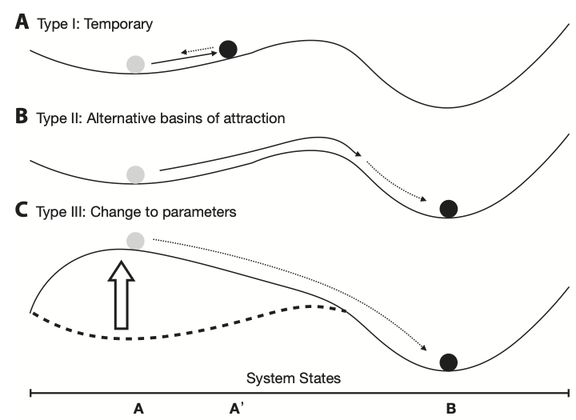

# Density-dependent growth {#DDgrowth}
Let's go back to our Song Sparrow (*Melospiza melodia*) data that we used to illustrate density-independent growth --- now we graph *all* the data.

```{r sparrowDD, echo=FALSE, out.width='50%', fig.cap="Song Sparrow *Melospiza melodia* counts, $N$, from 1966--2003 and the relation between observed counts ($N_t$) and annual growth rate ($r_t = N_{t+1}/N_t - 1$) determined from those counts, fit with ordinary least squares regression. See Chapter 3 for data source.", fig.show='hold'}
data(sparrows)
sparrows$Rt <- with(sparrows, log(c(Count[-1]/Count[-length(Count)],NA) ))
#<<MelospizaDDG1, fig=TRUE,echo=false, results=hide>>=
s1 <- ggplot(sparrows, aes(Year,Count)) + geom_point() + geom_line()
#<<MelospizaDDG2, fig=TRUE,echo=false, results=hide>>=
s2 <- ggplot(sparrows, aes(Count, Rt, label=substr(as.character(Year), 3, 4 ))) + geom_text() + 
geom_smooth(method="lm", se=FALSE) +
labs(y=bquote(italic(r[t])),
     x=expression("Sparrow Count ("*italic(N[t])*")"), type="n")
s1;s2
```

```{r secondorder, echo=FALSE, eval=FALSE}
m1 <- lm(Rt~Count, sparrows)
summary(m1)
Rt2 <- sparrows$Rt[2:35]
foN <- sparrows$Count[2:35]
soN <- sparrows$Count[1:34]
m12 <- lm(Rt2 ~ foN + soN)
summary(m12)
qplot(foN, Rt2,  geom=c("point"))
```

When we plot the annual per capita growth rate, $r_t = \log (N_{t+1}/N_t)$, as a function of $N$, we see a pattern emerge. At low $N$, $r>0$, whereas at high $N$, $r < 0$. The annual growth rate depends on the size or density of the population. This is the sort of thing we mean when we use the term *density-dependent growth*.

What might limit the population growth of these sparrows? Space available for male territories in their successional-scrub type habitat? Availability of seeds, fruits and invertebrates? We don't necessarily know precisely what limits it, but if it is something related to their own abundance, then we can treat density as a proxy for the amount of limitation.

Density-dependent population growth is the case where the per capita population growth rate depends statistically on the density of the population. When the slope of that relation is negative as it is in Fig. \@ref(fig:sparrowDD), we call this *negative density-dependence*. Negative density dependence a characteristic of a population undergoing *intraspecific competition*, where individuals of the same species compete for shared resources and have negative effects on their demographic rates. So, \ldots how would we represent this algebraically?^[root: Arabic. *Al-jabr*]

## Continuous logistic growth

When it was originally introduced to ecology by Verlhurst in the late 1800s, he described the limits to population growth in terms of an upper limit $K$, 
\begin{equation}
\frac{dN}{dt}= rN\left(1-\frac{N}{K}\right) (\#eq:logK)
\end{equation}
where $K$ is referred to as the *carrying capacity*. It is the population size where the negative effects of crowding prevent additional population growth. This happens in this equation because when $N=K$, population growth rate falls to zero, because $\left(1-K/K\right)=1-1=0$. 

Notice that the first part of this equation is exponential growth $rN$, which is then modified by a negative effect of a growing population. As $N$ grows, so does $(1-N/K)$ and causes $dN/dt$ to shrink. As $N$ approaches $K$, $dN/dt$ approaches zero, and the population stops changing and stays at $N=K$. 

We refer to $K$ as an *\index{attractor}attractor* because $N$ moves in a deterministic fashion toward $K$ -- $K$ attracts $N$. We explore the meanings of *attractor* and related terms throughout the book.

**Theory alert!** Recall that Alan @hastings2011 identified principles of macroscopic theory of population growth, that (i) populations grow exponentially, unless (ii) something prevents exponential growth. Here we see one of those somethings -- negative density dependence.

Another common representation of this model, the one we use here, is
\begin{equation}
\frac{dN}{dt}= rN\left(1-\alpha N\right) (\#eq:logalpha)
\end{equation}
where $\alpha=1/K$. In this manner, $\alpha$ represents the per capita effect of an individual on its population growth rate. More on that next.

Yet another representation is
\begin{equation} 
\frac{dN}{dt}= N\left(b - a N\right) (\#eq:logra)
\end{equation}
where $b = r$ and $a = r \alpha$. Notice now that $b$ or $r$ can be negative, and $b$ is independent of the the effect of the other species. 

The above three representations of the same model show us that we can rearrange the letters and symbols many ways and yet still be the same model. They just provide different perspectives on the same processes. 

## Dynamics around the equilibria
Features of our world are changing all the time. I'm getting older, my cat is getting fatter, and the seasons come an go. These changes through time are *dynamics*. Dynamics are changes through time. 

In spite of the dynamics of our lives, the world we experience shows some constancy over time --- I was here yesterday and the day before, and I am still here today. This constancy exists in spite of forces that work against it --- I eat to get the energy I need, and I don't play in traffic. Thus the world we experience reflects a sort of *stability*. That is, it lasts long enough for us to notice it in spite of processes that tend destroy it. The constant parts of our world often appear to be at an *equilibrium*, always on the verge of coming and going at the same time. As I type this sentence, I am at rest---at an equilibrium---because my attraction toward the ground due gravity is balanced by the repulsion of the floor in the opposite direction.

Ecological systems are constantly changing but often stay around long enough for us to notice. We tend to study the systems that stay around. For that reason, we are interested in *dynamics around equilibria*. The *stability* of a system^[A system might be nearly any set of interacting parts, such as a population, or an economy, or the internet.] is a quantitative measure of how much it tends to stay the same in spite of external disturbances or changes in the state of the system. 

The term *stability* is often an umbrella term for many related ideas such as resilience, resistance, reactivity, and permanence [@chen2001].^[Resistance refers to the tendency to resist change in the first place; resilience refers to the rate of return to an equilibrium; reactivity refers to the rate of change immediately following a perturbation [@neubert1997], and permanence is the degree to which a system does not simplify by entering one of its boundary equilibria.] In this book, we focus on resilience, the tendency for a system to return an equilibrium, or be *attracted toward* an equilibrium, if it is perturbed from it.

### A marble and a wok
Consider the stability of a marble inside a wok. If the wok doesn't move, then the marble just sits in the lowest spot on the bottom. If the wok is bumped, the marble jiggles and rolls around a bit, but settles back down to the bottom. This is a stable system because there is a point at the bottom of the bowl (the attractor) toward which the marble rolls --- all points inside the wok allow the marble to find the lowest point (the attractor). For this reason, we call the collection of points on the inside surface of the wok the *basin of attraction*. The steeper the sides, the more quickly the marble moves toward the bottom. This rate is referred to as its *resilience*.

To translate the notion of a basin into a population, let the position of marble inside the wok be the value of $N$ at any particular point (Fig. \@ref(fig:woklabel)). Let bumping the wok be any disturbance that causes a change in $N$. The slope of the sides of the wok reflects the biology and its mathematical representation that cause $N$ to move quickly or slowly back toward the bottom. For the logistic model, this rate is determined by $r$ and $\alpha$, and also by $N$ itself. The attractor at the very bottom of the bowl is the population's carrying capacity, $K=1/\alpha$.^[The marble's inertia, which contributes to its momentum, is analogous to a time lag in density dependence that we wil see in the discrete model; with a time lag, a population can overshoot the equilibrium.]

```{r woklabel, echo=FALSE, fig.cap="One basin = one wok; a system can have more than one basin. For now, let the horizontal axis at the bottom of the figure be population size, and let $K$ be at A on the horizontal axis. Population size, $N$, will tend to settle down at $A=K$ (Type I), unless something prevents it (cf. Hastings 2011). Figure from Ross and Stevens, 2019, Am. J. Botany, 106:517-519.", out.width="75%"}

```

When we imagine a marble in a wok, it becomes easy to envision $K$ as an attractor at the bottom of the bowl.  That is why we consider the carrying capacity a stable equilibrium point, or attractor, even if other factors, such as a disturbance, may cause $N$ to deviate from it.

The equilibrium we have focused on has been $K$, but recall that $N=0$ is also an equilibrium. This equilibrium is actually the edge of the wok --- the slightest jiggle, and the marble falls in and moves toward the center of the wok, $K$.  The biological analog of this "jiggle" is the additional of one or a very small numbers of individuals to an otherwise extinct population. For example, consider that a sterile Petri dish with nutrient agar has an *E. coli* population size of zero. If that *E. coli* $N=0$ gets "perturbed" with a single added cell, the population will move quickly toward its carrying capacity $K$. In this sense, $N=0$ is an equilibrium, but it is an *unstable* equilibrium. We also call such an unstable equilibrium a *repellor*.

### Analytical linear stability analysis
We are interested in the dynamics or stability of $N$ at each of the equilibria, $N^*$. Here we use *analytical linear stability analysis* to show mathematically what we described above with the marble and the wok. While somewhat limited in its scope, linear stability is nonetheless a powerful technique for dynamic model analysis.

In a nutshell, what we do is determine whether the growth rate, which is zero at each equilibrium, becomes positive or negative in response to a small change in $N$. That is, if $N$ takes a tiny step away from the equilibrium, does that tiny step shrink, or grow? If a tiny step results in a shrinking of the next step, back toward the equilibrium, that demonstrates a tendency to return, and indicates a stable equilibrium. If a tiny step results in a bigger next step, that demonstrates movement away from the equilibrium and instability. That is what analytical stability analysis tells us.

Consider a plot of the growth rate, $dN/dt$ *vs.* $N$ (Fig. \@ref(fig:FNN)). The equilibria, $N^*$, are the $N$ ($x$-axis) at which $dN/dt=0$ (points a, d). Note where population growth rate is positive and where it is negative. What will happen to this population if it finds itself at $N=50$? It will grow, moving along the $x$-axis, until population growth rate slows so much that it comes to rest where $N=1/\alpha=K=100$. Thus, $N$ changes until it converges on the equilibrium, $N^*$, where $dN/dt=0$. Alternatively at $N=110$, $dN/dt$ is negative, and so $N$ shrinks back down to $K$ (point d). This return toward $K$ means that $K$ is an attractor and a stable equilibrium.


Next, consider $N=0$, at point a; it cannot change on its own. However, if "perturbed" at all, with the addition of one or more individuals, then this "perturbation" will grow, sending $N$ across the $x$-axis, away from $N=0$, toward $N=K$. This stasis at $N=0$, and movement away from $N=0$ with the slightest perturbation means that $N=0$ is a repeller and an unstable equilibrium.

*Linear stability analysis will calculate the degree of attraction or repulsion at a local point.*

```{r FNN, fig.cap="Population growth rate, $dN/dt$, as a function of $N$. This kind of graph is called a phase portrait or phase plane. Points a--e are labelled for convenience. At values of $N$ associated with points $a$ and $d$, population growth rate equals zero. At values of $N$ associated with $b$ and $c$ growth rate is positive, and for $e$ growth rate is negative. Note this is growth rate as a function of $N$ (time is not explicitly part of this graph)."}
# Plot the phase portrait - use the phaseR package
logisticPP <- phasePortrait(logistic, ylim = c(-5, 105), parameters = c(1, 100),
              ylab="Population Growth Rate (dN/dt)", xlab="N")
N <- c(0, 10, 50, 100, 115)
pop.growth.rate <- expression( N * (1 -  N/100) )
points(N, eval(pop.growth.rate), cex=1.5)
text(N, eval(pop.growth.rate), letters[1:5],adj=c(.5,2))
```

```{r echo=FALSE, eval=FALSE}
# Determine the stability of the equilibrium points
logistic_stability_1   <- stability(logistic,
                                    ystar      = 0,
                                    parameters = c(1, 2),
                                    system     = "one.dim")
logistic_stability_2   <- stability(logistic,
                                    ystar      = 2,
                                    parameters = c(1, 2),
                                    system     = "one.dim")
```

How fast will $N$ return to $N^*=K$, if perturbed? Let's start by imagining that we have two populations with different intrinsic rates of increase ($r=1,\,0.5$), and focus on the growth rate at $N^*=K$ (Fig. \@ref(fig:stab2)). For which one of these populations will $dN/dt$ go to zero more quickly? If each population loses a few individuals and declines by $x$ to $N^*-x$, which population will return to $N^*$ more quickly? Not surprisingly, it is the population with the higher $r$ --- when $r=1$, its population growth rate ($y$-axis) is greater than when $r=0.5$, and therefore will return at a faster rate.

Note also that this same population ($r=1$) has a negative growth rate of greater magnitude at $N^*+x$. Regardless of whether it gains or loses individuals, it will return to $N^*$ more quickly than the population with the lower $r$.

```{r stab2, echo=FALSE, fig.cap="Very close to an equilibrium, a population recovers from a perturbation, moving toward the equilibrium attractor, at rate $e^{-r}$. Left, slopes of population growth $vs.$ $N$ near the equilibrium; around the equilibrium attractor, small decreases in $N$ lead to positive growth rate, whereas small increases lead to negative growth rate; the population with the steeper slope changes faster. Right, regardless of the particular $r$ of a population, a population recovers from a perturbation, moving toward the equilibrium attractor, at rate $e^{-r}$.", fig.show="hold", out.width="50%"}
include_graphics(c("figs/Stability2.png", "figs/Stability3.png") )
```


How do we quantify the rate of return at $N^*$ so that we can compare two or more populations? The slope of the curve at $N^*$ quantifies the rate of return, because the slope is the exponential return rate. To calculate the slope of a curve we use calculus, because the slope of a curve is a derivative. In this case, we need the derivative of the growth rate ($dN/dt$) with respect to the variable on the $x$-axis, $N$. Such a derivative is called a *\index{partial derivative}partial derivative*. Therefore we need the partial derivative of growth rate, with respect to $N$. This will be the slope of the growth rate with respect to $N$.

To find the partial derivative, let us denote the population growth rate as $\dot{N}=dN/dt$ ("N-dot"),
\begin{equation}
  (\#eq:dot)
  \dot{N} = rN\left(1-\alpha N\right).
\end{equation}
$\dot{N}$ is a common symbol for a time derivative such as a growth rate, and we use it here merely to simplify the notation.

Given $\dot{N}$, its partial derivative^[You might recall that the derivative of $y = ax^2 + bx$ is $dy/dx = 2ax + b$...] with respect to $N$ is
\begin{equation}
  (\#eq:pdlog)
  \frac{\partial \dot{N}}{\partial N} = r - 2r\alpha N.
\end{equation}
Further, we are interested in the equilibrium, where $N = 1/\alpha$. If we substitute this into eq. \ref{eq:pdlog} and simplify, this reduces to 
\begin{equation}
  (\#eq:pdlog2)
  \frac{\partial \dot{N}}{\partial N} = -r \, .
\end{equation}
At $N^*=1/\alpha$, the slope is $-r$. *This negative slope at the equilibrium demonstrates the stability of this equilibrium.


Near $N^*$, population growth rate is $-rx$.^[Because $\Delta y/\Delta x = - r$, i.e. the change in $y$ equals the change in $x$ times the slope.] That is, the rate of change of $x$ (Figs. \@ref(fig:stab2)) is 
\begin{equation}
  (\#eq:9)
  \frac{dx}{dt} = -rx
\end{equation}
This allows us to pretend that the perturbation will diminish exponentially, because the growth rate is constant. We say "pretend," because we realize that this rate applies only in the small region where we can assume the slope is a straight line. We can describe the size of $x$ at any time $t$ by integrating this well-known differential equation with respect to time as
\begin{equation}
  (\#eq:8stability)
  x_t = x_0e^{-r t}
\end{equation}
where $x_0$ is the size of the initial displacement relative to the equilibrium, and $x_t$ is the size of the displacement at time $t$ relative to the equilibrium.

If we choose an $x_t$ carefully, and do so for any and all such analyses, we can determine the time required to reach $x_t$ and we call that time the *characteristic return time*. To determine the characteristic return time, we will let $x_t=x_0/e$, thus defining the characteristic return time as the amount of time required to reduce the perturbation by 63\% (i.e. $1/e$). We can solve for $t$ by dividing through by $x_0$ and taking the $\log$ of both sides,
\begin{align}
  (\#eq:returntime)
  \frac{x_0}{e} &= x_0e^{-r t}\\
  \log\left(e^{-1}\right) &= -r t\\
  t &= -\frac{1}{\left(-r\right)}.
\end{align}
Thus we see return time, $t$, here is a positive number, with the same units as $r$, and depends on the slope of the the growth rate with respect to $N$. It also depends on the assumption of linearity very close to the equilibrium.

*To review*, we took the partial derivative of $dN/dt$ with respect to $N$, and then evaluated the partial derivative at $N^*$ to get the rate of change of the perturbation, $x$. A negative value indicates that the perturbation will decline through time, indicating a stable equilibrium or attractor. A positive value would indicate that the perturbation will grow over time, thus indicating an unstable equilibrium, or a repellor.

We can use R's minimal symbolic capabilities to get derivatives. Here we get the partial derivative and then evaluate it for the two equilibria (Fig. \@ref(fig:FNN)).
```{r symbolic}
alpha <- 0.01; r <- 1
pop.growth.rate <- expression( r * N * (1 -  alpha*N) )
# find the partial derivative of dNdt wrt N
dF.dN <- D(pop.growth.rate,"N")
dF.dN # here it is
# set N equal to zero and the carrying capacity
N <- c(0, 1/alpha) 
# calculate the slopes of dN/dt vs. N at those two points
eval(dF.dN)
```

The first value, 1, corresponds to the first value of $N$, which is $N=0$. Because it is positive, this indicates that the perturbation will increase with time, meaning that $N=0$ is a repellor. The second value, $-1$, is negative, and so indicates that the perturbation will decrease with time, meaning that $N=1/\alpha$ is an attractor. 

### Projection with numerical integration 
In simple density-independent growth, we were able to project a population using the integral of the exponential growth equation, $N_t=N_0 e^{rt}$. As our models become more and more complex, we are no longer able to to do that. Instead, we use *numerical integration* to project models of continuous growth through time. We use numerical techniques that turn the infinitely small intervals of calculus ($dx$, $dy$) into very, very small, but finite steps. Mathematicians and computer scientists have devised very clever ways of doing this very accurately and precisely. In R, the best package for this is `deSolve`, which contains several *solvers* for differential equations that perform numerical integration. We will access these solvers (i.e. numerical integraters) using the `ode` function in the `deSolve` package. This function, `ode`, is a wrapper for the underlying suite of functions that do the work. 

When we have an ordinary differential equation (ODE) such as logistic growth,$dN/dt = rN(1-\alpha N)$ we say that we "solve" the equation,

* over a particular time interval
* given a set of parameters and 
* with particular initial conditions or initial population size. 

For instance, we say that we solve the logistic growth model for time at $t=0,\, 1 \ldots \, 20$, with parameters $r=1$, $\alpha=0.001$, and $N_0=10$. 

Let's do an example with `ode`, using logistic growth. We first have to define a function in a particular way. The arguments for the function must be, in order: time, a vector of populations, and a vector or list of model parameters. Note that this function is already in the primer package as `clogistic()`, so you don't have to run this code to use the function.
```{r}
clogistic <- function(time, y, parameters){
  # y is a single value of N; if we have more than one population, 
  # e.g. competition, then y would be a vector with two elements, one for 
  # each population.
  
  # parameters is a vector of...parameters....
  
  # Both y and parameters have names for each element,
  # e.g., y <- c(N=10) - see the text.
  
  with(as.list(c(y, parameters)), {
    # "with" creates an "environment" within which R looks for values
    # c() combines the two vectors into one
    # as.list() turns the resulting vector into a list
    
    # our differential equation for growth
    dN.dt <- r * N * (1 - alpha * N)
    
    # making the function create output, which must be a list with
    # one element
    return( list( dN.dt ) )
  } )
}
```

While it isn't necessary, we use `with()` to allow us to use the names of variables and parameters [@petzoldt:2003dp]. This works only when `y` and `p` are vectors with named variables and parameters. Finally, we use `return` to cause the function to produce the derivative in a `list`. 

The following is equivalent, but slightly less readable or transparent.
```
  logistic2 <- function(t, y, p){
    dN.dt <- p[1] * y[1] * (1 - p[2] * y[1])
    return( list( dN.dt ) )
```

To solve the ODE, we will need to specify parameters--we wil have to tell R the values we want to use for $r$ and $\alpha$.
```{r}
p <- c(r=1, alpha = 0.001)
```

We also need to tell R the size of the population to start with, $N_0$, or $N$ at $t=0$. We refer to this as the *initial condition*, and we will start with a population size of $N_0=1$. We also need to supply the time steps we want as output. R will project the population size for all times up until and including the last time step we specify.
```{r}
# We name the state variable and the parameters
y0 <- c(N=1)
t <- 0:20
```
Now you put it all into `ode()`, with the correct arguments. The output is a matrix, with the first column being the time steps, and the remaining being your state variables. Because you loaded `primer`, the `deSolve` package should be loaded already.^[Loading the `primer` package loads `deSolve` automatically.]
```{r}
out <- ode(y=y0, times=t, func=clogistic, parms=p)
out[1:5,]
```


We can plot the output as well. The `deSolve` package directs R to use special methods to plot output from `ode`. 
```{r odeplot, fig.cap="Output from a numerical integration of logistic growth, where N0=10, r=1, alpha=0.001."}
plot(out)
```

Here we see the classic S-shaped curve of logistic growth. Regardless where we start, the population will always settle down on $K=1/\alpha$. 
**Before reading on, predict** the shape of this curve if:

* $r$ is smaller, or larger.
* $\alpha$ is smaller, or larger.
* the initial population size is above $K$


Here we write code to test your ideas about the effects of $r$, $\alpha$, and $N_0$.
```{r logisticVariety, echo=TRUE, fig.cap="How variation in logistic growth parameters influence the dynamics.", out.width="100%"}
t=seq(0, 20, by=0.01); 
r <- c(.5, 1.5) # two values of r
alpha <- c(0.002, 0.001); # two values of alpha
N0 <- c(10, 1500) # two starting points
## create a small data frame with all combinations
input <- expand.grid(r=r, alpha=alpha, N=N0)
## Create an object to hold results
outdf <- NULL

## for each (i) combination of parameters, 
## choose the parameter set, integrate with ode(), 
## combine the data outputs
for(i in 1:nrow(input)) { 
  ## Use each
  y <- c(N=input[i,"N"])
  p <- c(r=input[i,"r"], alpha=input[i,"alpha"] )
  out <- ode(y, times=t, fun=clogistic, p)
  out2 <- cbind(out, N0=y, r=p["r"], alpha=p["alpha"])
  outdf <- rbind.data.frame(outdf, out2)
}

## Change the class of some variables to make plotting easier
outdf$N0 <- as.factor( outdf$N0 )
outdf$alpha <- as.factor(outdf$alpha )

## graph all the results together
ggplot(outdf, aes(time, N, colour=N0, linetype=alpha) ) + geom_line() + 
  facet_grid(r~., labeller=label_both) + theme_bw()
```

We see that the  refer to $K$ as an *\index{attractor}attractor* because $N$ moves in a deterministic fashion toward $K$. We explore the meanings of *attractor* and related terms throughout the book.

The `phaseR` package has some sweet plotting functions for systems of 1 or two ODEs. Here we use it for simple trajectories. 
```{r phaserLogistic, fig.cap="A velocity field is kind of like a magnetic field, showing what rate and direction of trajectories throughout this space. A nullcline is an isocline where the rate of change is zero (the straight horizontal lines in this figure). Here $r = 1$, and $K=2$."}
# Plot the velocity field, nullclines and several trajectories

## These create arrows (vectors) whose length and direction
## reveal the velocity at different points
logistic_flowField     <- flowField(logistic,
                                    xlim       = c(0, 5),
                                    ylim       = c(-1, 3),
                                    parameters = c(1, 2),
                                    points     = 21,
                                    system     = "one.dim",
                                    add        = FALSE)
## A 
logistic_nullclines    <- nullclines(logistic,
                                     xlim       = c(0, 5),
                                     ylim       = c(-1, 3),
                                     parameters = c(1, 2),
                                     system     = "one.dim")
logistic_trajectory    <- trajectory(logistic,
                                     y0         = c(-0.5, 0.5, 1.5, 2.5),
                                     tlim       = c(0, 5),
                                     parameters = c(1, 2),
                                     system     = "one.dim")
```


### Effects of N on birth and death rates

There are many mathematical forms of density-dependent growth, some of which will we describe below. Let's start by decoupling the density-dependence of birth and death rates in logistic growth [@gotelli2001]. 

Recall from chapter 3 (density-independent growth) that $r=b-d$. Now we will let $b$ and $d$ be functions of population size $N$ ($b=F(N)$, $d=G(N)$). We could let $F(N)$ and $G(N)$ take a wide variety of different forms. For now, however, let's say that $N$ has *linear* effects on these rates so that 
\begin{align}
b &=b_0 - aN\\
d &= d_0 + cN
\end{align}
which appear in Fig. \@ref(fig:bd). 

```{r bd, echo=FALSE, fig.cap="Per capita birth and death rates can be functions of density (dashed lines). The carrying capacity (K) occurs at the point where the per capita birth and death rates are equal. The solid line represents the per capita population growth rate, which is zero when $N=K$.", out.width="75%"}
dd = function(N, e, f){e + f*N} # create the function you want
pgr <- function(N, b0, d0, a, c){ b0-a*N - (d0+c*N) }
b0 <- 1; a=.0075; d0 <- 0.1; c=.0075
myData <- data.frame( N=c(0, 100) ) # ggplot requires a data frame
p <- ggplot(data=myData, aes(x=N)) + # set the basic properties of the plot
  # in the stat_function, we indicate the parameters in our equation.
  stat_function(fun=dd, geom="line", 
                args=list(e=b0, f=-a), linetype=2) + 
  stat_function(fun=dd, geom="line", 
                args=list(e=d0, f=c), lty=5) + 
    stat_function(fun=pgr, geom="line", 
                  args=list(b0=b0, d0=d0, a=a, c=c)) + 
  labs(y="Per capita birth and death rates", x="Population size (N)") + 
  theme_classic() + theme(axis.text.x = element_blank()) +
  geom_hline(yintercept=0, lty=3)+
  scale_x_continuous(expand = c(0, 0)) 
p +
  annotate("text", x=95, y=0.02, label = "y = 0",
           vjust=0)  +
    annotate("text", x=1, y=b0, label = "b0",
           hjust=0, vjust=0)  +
  
    annotate("text", x=80, y=.3, label = "birth rate",
           hjust=0, vjust=-.5)  +
  
    annotate("text", x=1, y=d0, label = "d0",
           hjust=0, vjust=-.5)  +
  
    annotate("text", x=80, y=.8, label = "death rate",
           hjust=0, vjust=-.5)  +
  
  annotate("text", x=(b0-d0)/(a+c), y=-.1, label = "K") +
  annotate("text", x=85, y=-.5, label = "dN/(Ndt)") 
```

With this addition we convert exponential population growth ($dN/dt = rN$) into a form where both birth rate and death rate depend on density, but in independent ways:
\begin{align}
\frac{dN}{dt} &= [(b_0-aN)-(d_0 + cN)] N\\
& =[(b_0-d_0) - (a+c)N] N\\
& = (b_0-d_0)(1-\frac{a+c}{b_0-d_0}N)N
\end{align}
If we chose to, we can now say that the net negative effect of $N$ on per capita population growth rate is $$\alpha = \frac{a+c}{b_0-d_0}$$
where the numerator is the total direct negative effect of $N$ on birth and death rates, and the denominator is $r$, the net maximum per capita growth rate which occurs as $N$ approaches zero. And we are back to logistic growth.

### Theta-logistic growth
Here we explore a simple extension of the logistic model, the \index{logistic growth!theta-logistic}*theta-logistic* model, which adds a parameter to increase flexibility and generality.
\begin{equation}
  (\#eq:11)
  \frac{dN}{dt} = rN\left(1 - \left(\alpha N\right)^\theta \right) 
\end{equation}

A little imagination lets us see that, at face value, 

* $\theta>0$ implies growth and a stable equilibrium at $K$,
* $\theta=0$ means zero growth, and
* $\theta < 0$ results in negative growth when $N < K$, and unbounded positive growth when $N>K$. 

Approximations of eq. \@ref(eq:11) that allow $\theta \leq 0$ are possible [@sibly:2005ys], but the interpretation becomes strained.

Here we make a function that we can use with `ode()`, the numerical integration function (`thetalogistic` is already in the primer package).
```{r}
thetalogistic  <- function(times, y, parms) {
  ## with() and as.list() create an environment in which R will see 
  ## the named elements in `parms`. 
  n <- y[1]
  with(as.list(parms), {
    dN.dt <- r * n * (1-(alpha*n)^theta)
    return( list( c(dN.dt) ) ) }  )
}
```

By varying $\theta$, we can change the linear density dependence of the simple logistic model to curvilinear density dependence (Fig. \ref{th1}). 
When $\theta > 1$, this weakens density dependence at low $N$, because when $N < K$, $\alpha N < 1$ and so $(\alpha N)^\theta < \alpha N$. As a result, the population grows faster than logistic. When $N < K$ and $\theta < 1$, this strengthens density dependence, causing the population to grow more slowly than logistic, all else being equal.

The effects of $\theta$ on density dependence controls the shape of relation between growth rate $vs$. $N$ (a.k.a. the production function, Fig. \@ref{fig:ThetaDD}). First, note that for a given $r$, growth rate for $N<K$ increases with $\theta$. Second, note that the position of peak of the production function shifts to the right as $\theta$ increases. That is, as $\theta$ increases, the $N$ at which the maximum growth rate occurs also increases. If we wanted to shift the peak growth rate to a higher $N$ without also increasing the height of the peak, we could decrease $r$ simultaneously. 

We could speculate on biological meaning of $\theta$ and the shape of the denisty dependence. For instance, very high $\theta$ suggests a threshold, wherein the population exhibits little density dependence until very close to $K$. Perhaps this is related to territoriality, or a spatial refuge from predators. Alternatively, low $\theta$ might suggest resource preemption, wherein a small number of individuals can sequester large amounts of resources, but increasing $N$ results in reduced preemption. For organisms with very plastic body sizes (plants, fish), this could mean that at low $N$, average body size is large, but as $N\rightarrow K$, average body size decreases. While $\theta$, *per se*, is devoid of mechanism, discovering the magnitude of $\theta$ for different types of species [@sibly:2005ys] could lead to the generation of new testable hypotheses about what controls populations. 


```{r ThetaDD, fig.cap="Theta-logistic per capita rates, population growth rates, and dynamics for $\\theta<1$, $\\theta=1$, and $\\theta>1$. In a synthesis of population dynamics, Sibly et al. (2005) used theta-logistic density dependence to show that populations most frequently have a concave-up, $\\theta < 1$, pattern.", fig.show="hold", out.width="33%"}

r <- .75; alpha <- 0.01; theta <- c(.5, 1, 2); N <- 0:110
layout(matrix(c(1,2,3,3), nrow=2))
## Per capita PGR
theta.out <- sapply(theta, function(th) {1-(alpha*N)^th})
matplot(N, theta.out, type='l', col=1)
abline(h=0)
legend('topright', legend=paste("theta =", c(2, 1, 0.5) ), lty=3:1, bty='n')

## PGR
thetaGR.out <- sapply(theta, function(th) {r*N*(1-(alpha*N)^th)})
matplot(N, thetaGR.out, type='l', col=1)
abline(h=0)
##
r <- 3.4
lines(N, r*N*(1-(alpha*N)^theta[1]))
text(12, 24, "r=3.4")

prms <- c(r = 0.75, alpha = 0.01, theta=1)
t <- seq(0,20, by=.1)
thetaN <- sapply(theta, function(th) {prms["theta"] <- th
                                      ode(y=1, times=t, thetalogistic, prms)[,2] } )
matplot(t, thetaN, type='l')
```

### Allee effect
The *Allee effect* is a positive relation between average individual fitness and population size [@drake2011al]. For us, this translates as a positive relation between per capita population growth rate and population size. That is, positive density dependence rather than negative density dependence. This can happen at very low population sizes.

An Allee effect is likely to arise in sexually reproducing populations. This occurs because at very low population sizes, male and female individuals are less likely to encounter each other and so mating frequency is very low. As population size increases, females and males are more likely to encounter each other, and mating increases. 

One way to represent this is with an additional term in our model, which incorporates a threshold population size, below which the population growth rate is negative. Here $a$ is the threshold population size,
\begin{equation}
\frac{dN}{dt}= rN\left(1-\alpha N\right)\left(1 - \frac{a+\tau}{N+\tau}\right) (\#eq:logallee)
\end{equation}

so that if the population size falls below the threshold, it cannot recover ($N<a$, $dN/dt < 0$). Parameter $\tau$ is greater than 0, and controls how severe the consequence is for $N<a$. The smaller $\tau$ is, the more negative population growth becomes.  A function to project this dynamic is available in `primer` as `alogistic()`.

```{r echo=FALSE, eval=FALSE}
 alogistic <- function(t, y, p){
   # 
   with(as.list(c(y,p)),{
         dN.dt <- r * N * (1 - alpha*N) * (1 - (a+tau)/(N+tau) )
            return( list( dN.dt ) )
   })
 }
```

```{r allee, fig.cap="The Allee effect the a positive relation bewteen population growth rate and population size, often best envisioned as a negative consequence of small population size. Here, the threshold population size is 20, meaning that $dN/dt < 0$, when $N < 20$.", out.width="75%"}
## for simplicity, we let r=1 so we can ignore it here.
pgrA <- function(N, alpha, a, tau){ N*(1-alpha*N)*(1-(a+tau)/(N+tau)) }
myData <- data.frame( N=c(0, 110) ) # ggplot requires a data frame
p <- ggplot(data=myData, aes(x=N)) + # set the basic properties of the plot
  # in the stat_function, we indicate the parameters in our equation.
    stat_function(fun=pgrA, geom="line", n=1001,
                  args=list(alpha = 0.01, a=20, tau=.1)) + 
  labs(y="Population growth rate (dN/dt)", x="Population size (N)") + 
  #theme_classic() + 
  geom_hline(yintercept=0, lty=3)+
  scale_x_continuous(expand = c(0, 0)) 
p

```

### The integral of logistic growth
We might as well add that there is an expression for $N_{t}$, analogous to $N_{t}=N_{0}\exp(rt)$ for exponential growth. If we integrate eq. \@ref(eq:logalpha) with respect to time, we have
\begin{equation}
N_{t}=\frac{N_{0}e^{rt}}{1+\alpha N_{0}\left(e^{rt}-1\right)}.
\label{fig:clogisticNt}
\end{equation}
Note the resemblance to the exponential equation. We have the exponential equation in the numerator, divided by a correction factor which starts at 1 when $t=0$. The correction factor then grows with time, at a rate which is virtually the same as exponential growth but adjusted by $\alpha$ and scaled by $N_{0}$. Thus when $t=0$, and if $N_0$ is small, we have near-exponential growth, decreased merely by a factor of $\alpha N_0$. 

## Discrete Density-dependent Growth
The continuous logistic equation is probably our simplest example of population growth, aside from pure exponential growth. Here we describe the discrete-time version. Recall that the definition of discrete population growth rate is 
$$\frac{\Delta N}{\Delta t}=\frac{N_{t+1}-N_t}{(t+1) - t}=N_{t+1}-N_t$$
because our time step is one (1) entire time unit (typically a year). The discrete time logistic function is therefore
\begin{equation}
  N_{t+1} - N_t = r_d N_t\left(1-\alpha N_t\right)
  (\#eq:3dd)
\end{equation}

Here $r_d$ has the same meaning it did in chapter 3, where $r_d = b-d-bd$. When $r_d$ is quite small in a slow growing population, this is very similar to the continuous form. However, as $r_d$ becomes larger in a faster growing population, the dynamics can get quite exciting.

Let's explore the dynamics of this numerically by writing a function to project discrete logistic growth. A pre-written function is available in `primer` by the same name. 

To project a discrete time model, we have to project entire one year at a time. We did this for structured demographic models, and unstructured geometric growth and our sparrow simulation. We will do it here using a function in the `deSolve` package that imposes a one year time step, specifically for discrete time models, including difference equations.^[`deSolve` allows several different ways to project discrete time models. Consult `vignette('deSolve', package='deSolve')`.]

The model in `primer` looks like this, much like the continuous time model. 
```{r}
dlogistic <- function (t, y, p) {
  N <- y[1]
  with( as.list(p),{
      N.diff <-  rd * N * (1 - alpha * N) 
      return(list(N.diff))  }) }
```

We then specify the parameters, the initial state or population size, and the time steps. Note that for a discrete time model the **time steps must be annual increments**, not fractions of a year. We then project the population using `ode()` with `method="euler"` to force discrete annual jumps. It is essential that you use `method="euler"` here for discrete time steps.
```{r dlogistic, fig.cap="Discrete growth can look a lot like continuous growth as long as the per capita growth rate is low."}
p <- c(rd=1, alpha=.01)
y <- c(N=10)
years <- 0:10
outd <- ode(func = dlogistic, y = y, times = years,
 parms = p, method = "euler")
outd <- as.data.frame(outd)
ggplot(outd, aes(x=time, N)) + geom_line() + geom_point() +
  annotate("text", x=1, y =1/p["alpha"]+2, label="K = 1/alpha")
```

### Effects of $r_d$
Changing $\alpha$ or $K$ does not change radically the dynamics of this model. However, increasing $r_d$ changes the dynamics a lot. This is in contrast to what happens in continuous logisitic growth. When we increase $r_d$ sufficiently, we get *stable limit cycles* and if we raise $r_d$ high enough, we get *chaos*.^[Not to be confused with KAOS, the evil spy agency featured in the 1960's US television show, *Get Smart*.].

```{r dlogcycles, fig.cap="How variation in $r_d$ influences dynamics of discrete logistic growth.", out.width="75%"}
rd.v <- seq(1.3, 2.8, by=.3)
N0 <- c(N=10); t = 0:20
Ns <- sapply(rd.v, function(r) {
  p <- c(rd=r, alpha=0.01)
  outd <- ode(func = dlogistic, y = N0, times = t,
 parms = p, method = "euler")[,2]
  }
 ) 
out <- data.frame(t=t, Ns)
names(out) <- c("t", paste("rd=",rd.v, sep=""))
out.l <- pivot_longer(out, cols=-1, names_to="r.d", values_to="N")

ggplot(out.l, aes(t, N) ) + geom_line() + 
  facet_wrap(~r.d)
```

At low $r_d$, we have a simple asymptotic approach to $K$. As $r_d$ increases, we see the population overshoot the carrying capacity and exhibit *damped oscillations*. When $2 < r_d < 2.449$, the population is attracted to two-point limit cycles. In this case, *these two points are stable attractors*. Regardless where the population starts out, it is attracted to the same two points, for a given $r_d$. As $r_d$ increases further, the number of points increases to a four-point limit cycle (e.g., at $r_d=2.5$), then an eight-point cycle, a 16-point limit cycle, and so on. These points are stable attractors. As $r_d$ increases further  ($r_d>2.57$), however, stable limit cycles shift into *chaos*. Chaos is a process that results in a pattern that is (i) deterministic, (ii) non-repeating, (ii) bounded, and (iv) sensitive to initial conditions. Chaos, in this sense, among population biologists, is not random.

@may:1974fk shocked the ecological community when he first demonstrated stable limit cycles and chaos using this simple deterministic model. His groundbreaking work, done on a hand calculator, showed how very complicated, seemingly random dynamics emerge as a result of very simple deterministic rules. Among other things, it made population biologists wonder whether prediction was possible at all. In general, however, chaos seems to require very special circumstances, including very high population growth.

Is there a biological interpretation of these discrete, deterministic fluctuations? Consider some simple environment, in which small vegetation-eating animals with high reproductive rates eat almost all the vegetation in one year. They create a lot of offspring.  The following year, the vegetation will not have recovered, but the animal population will still be very high. Thus the high reproductive rate causes a disconnect between the actual population size, and the negative effects of those individuals comprising the population. *The negative effects of the actions of individuals (e.g., resource consumption) are felt by the offspring of those individuals, rather than the individuals themselves*. We won't belabor the point here, but it is certainly possible to extend this delayed density dependence to a wide variety of populations. The discrete logistic model has a built in delay, or *time lag*, of one time step, because the growth increment makes a single leap of one time step. This delay is missing from the analogous continuous time model because the growth increment covers an infinitely small time step, thanks to the miracles of calculus.^[A time lag can be explicitly built in to a continuous time model, with only a small effort.]

### Bifurcations
Up until now, we have examined $N$ as a function of time. We have
graphed it for different $\alpha$ and $N_0$, but time was always on
the $x$-axis. Now we are going to examine $N$ as a function of $r_d$, so $r_d$ is on the $x$-axis. Specifically, we will plot the stable limits or attractors $vs$. $r_d$ (Fig. \@ref(fig:bifurcation1)). What does it mean? For $r_{d} < 2$, there is only a single $N$. This is what we mean by a stable point equilibrium, or point attractor.

As long as $r_d$ is small, $N$ always converges to a particular point.^[It need not be the same $N$ for each $r_d$, although in this case it is.] When $2<r_{d}<2.45$, then all of a sudden there are two different $N^*$; that is, there is a two-point stable limit cycle. Note that when $r_d\approx 2$ these oscillations between the two point attractors around $K$ are small, but as we increase $r_d$, those two points are farther apart. The point at which the limit cycle emerges, at $r_d=2$, is called a *bifurcation*; it is a splitting of the single attractor into two attractors^[A bifurcation is when a small smooth change to a continuous parameter causes a qualitative or discreet change to the system or its topology.]. At $r_{d}\approx 2.45$, there is another bifurcation, and each the two stable attractors split into two, resulting in a total of  four unique $N^*$. At $r_{d}\approx 2.53$, there are eight $N^*$. 

All of these points are *periodic attractors* because $N$ is drawn to these particular points at regular intervals. As $r_d$ increases the number of attractors will continue to double, growing geometrically. Eventually, we reach a point when there becomes an infinite number of unique points, *that are determined by $r_{d}$*.^[They are also determined by $\alpha$ and the initial $N_0$, but we will get to that later.] This completely deterministic, non-repeating pattern in $N$ is a property of *chaos*. Chaos is not a random phenomenon; rather it is the result of deterministic mechanisms generating non-repeating patterns.

Here we perform more comprehensive simulations, and plot the point and periodic attractors *vs.* $r_d$. First we pick some constraints for the simulation: the number of different $r_d$, the sequence of $r_d$ values, and the number of time steps.

```{r bifurcation1, fig.cap="Illustration of the long term dynamics of discrete logistic population growth. When a small change in a continuous parameter results in a change in the number of attractors (e.g. a single point equilibrium to a stable 2-point limit cycle), we call this a bifurcation.", out.width="75%"}
## Iff you are interested....
num.rd <- 1001 # the number of rd's you want
rd.s <- seq(1.5,3, length=num.rd) # the actual rd values
t <- 0:1000 # how long to run each population
N0 <- c(N=99) # N-zero
## do all the dynamical simulations putting each run
## into a column of a matrix.
Ns <- sapply(rd.s, function(r) {
  p <- c(rd=r, alpha=0.01)
  outd <- ode(y = N0, times = t, func = dlogistic, 
 parms = p, method = "euler")[,2]
  }
 ) 
out <- data.frame(t=t, Ns) # put times to the front of the matrix
names(out) <- c("t", paste("rd=",rd.s, sep="")) # relabel columns
out.last <- subset(out, t > 0.8*max(t)) # keep only the last 20%
## put the data in the "long format"
out.l <- pivot_longer(out.last, cols=-1, names_to="r.d", values_to="N")
out.l <- arrange(out.l, r.d, t) # re-order the data
## extract text out of the 'r.d' label that is the numeric value
text.values <- substr(out.l$r.d, regexpr("=", out.l$r.d)+1, 100) 
## convert the characters of "1.5" to the number 1.5
out.l$rd <- as.numeric( text.values )

## plot the stable limits to show the bifurcations
ggplot(out.l, aes(rd, N)) + geom_point(pch=".") + theme_bw()
```


```{r bifurcation2, fig.cap="An expanded view showing more detail, from of a subset of the previous figure, where $r_d > 2.6. Note that we didn't run simulations long enough to show the infinite number of stable point attractors. That would kind of be impossible. However, what you can see is that a system can have regions of $r_d$ where attractors change density near different values of $N$.", out.width="75%"}
out.l.chaotic <- subset( out.l, rd > 2.6 )
ggplot(out.l.chaotic, aes(rd, N)) + geom_point(pch=".") + theme_bw()
```

There has been a great deal of effort expended trying to determine whether a particular model or real population exhibits true chaos. In any practical sense, it may be somewhat unimportant whether a population exhibits true chaos, or merely a higher order periodic attractor [@ellner:2005fk]. The key point here is that very simple models, and therefore potentially simple mechanisms, can generate very complex dynamics.


#### Sensitivity to initial conditions

Another very important feature of chaotic populations is that they are very sensitive to initial conditions. Thus emerges the idea that whether a butterfly in Sierra Leone flaps its wings twice or thrice may determine whether a hurricane hits the southeastern United States in New Orleans, Louisiana, or in Galveston, Texas.^[Clearly, this suggests that the solution to increased storm severity due to global warming is to kill all butterflies.]

If we generate simulations where we vary initial population size by a single individual, we find that this can have an enormous impact on the similarity of the dynamics of two populations, and on our ability to predict future population sizes (Fig. \@ref(fig:DDGChaosInitN)). Note how the populations start with similar trajectories, but soon diverge so that they experience different sequences of minima and maxima (Fig. \@ref(fig:DDGChaosInitN)). This is part of what was so upsetting to ecologists about May's 1974 paper --- perhaps even the simplest deterministic model could create dynamics so complex that we could not distinguish them from random [@may:1974fk]. Over time, however, we came to learn that (i) we could distinguish random dynamics from some chaos-like dynamics, and (ii) the hunt for chaos could be very exciting, if most frequently disappointing [@becks2005; @constantino1995; @kendall:1998ys].

We start with three populations, all very close in initial abundance, $N_0 \in \{97,98,99\}$. We then project the population with a $r_d$ to generate chaos for 30 time steps.
```{r DDGChaosInitN, fig.cap="Effects of differences in initial population size on the short term and long term dynamics, and their correspondence, of three populations.", out.width="75%"}
N.init <- c(97,98,99)
t <- 0:30
p <- c(rd=2.7, alpha=0.01)
out <- NULL
for(i in  1:3){
  # project the population
  N0 <- c(N=N.init[i])
  a <- ode(y=N0, times=t, dlogistic, 
           parms=p, method="euler")
  # fill a column with the initial value
  b <- data.frame(a, N0=as.factor(N0)) # b now has cols: t, N, rd
  # store data in rows of out "bind rows" with rbind
  out <- rbind.data.frame(out, b)
}
ggplot(data=out, aes(time, N, colour=N0, linetype=N0)) + geom_line()
```

#### Boundedness, and other descriptors
One last issue that we should note is the extent to which our populations are *bounded*. A population may have complex dynamics, but we may be able to characterize a given population by its upper and lower bounds. In spite of the differences created by the initial conditions, the upper and lower bounds of our chaotic populations were very similar (Fig. \@ref(fig:DDGChaosInitN)). In contrast, a population undergoing a random walk, as in our sparrow simulations in Chapter 3, will be unbounded - the variance will increase with time.

Note also as $r_d$ increases (Fig. \@ref(fig:bifurcation1)) the oscillations increase very systematically. One way to see the deterministic nature of chaos is to trace population size from each time point to the next time point. We put $N_t$ on the $x$-axis and $N_{t+1}$ on the $y$-axis, and connect all successive points.  
```{r logweb, fig.cap="A chaotic discrete logistic population shows certain highly predictable patterns including population sizes limited to a quadratic form revealed here.", out.width="75%"}
N0 <- c(N=2); t <- 0:1000
p <- c(rd = 2.8, alpha = 0.01)
out <- ode(N0, t, dlogistic, p, method="euler")
n <- out[901:1000, 2]
ntp1 <- n[-1]
nt <- n[-length(n)]
qplot(nt, ntp1, geom=c("point", "path") ) + labs(y="N[t+1]", x="N[t]")
```

In general, we can describe many characteristics of populations, even if we cannot predict exactly what the population size will be five years hence. For instance, we can describe the shape of density dependence (linear, nonlinear), and characteristics of $N$, such as the average, the variance, the periodicity, the upper and lower bounds, and the color (i.e. degree of temporal auto-correlation). Indeed, these characteristics may vary among types of organisms, body sizes, or environments.


### The Ricker model
The discrete Ricker model looks a lot like our friend, exponential growth, but where $r$ is modified by density. Here we see them side by side.

\begin{equation}
N_{t+1} = N_t e^{r} \quad ; \quad N_{t+1}=N_t e^{r_d \left(1-N_t/K\right)}
\end{equation}

Like discrete logistic growth, the Ricker model^[Bill Ricker, the eponym of the famous model, made very important contributions to the study of poplation dynamics and fisheries science.] will also exhibit chaos at high per capita growth rates ($r_d>>1$). 

We leave it to the reader to show whether this model shows linear density-dependence (like logistic) or nonlinear density-dependence (like $\theta$-logistic).

There are many more models of density dependent growth. Some, like the theta-logistic and the Richards models, are more flexible and have more parameters. Others, like the Gompertz model, are used more widely in other fields, such as cancer research for tumor growth, von Bertalanffy for body size growth, and the Ricker model for fisheries. 


## Nonlinear Discrete Density-dependence in Single-species Populations of Plants

@watkinson1980 described a simple model that incorporates nonlinear density dependence which is intuitive, extensible, and is now used to help test modern coexistence theory [@hillerislambers2012, @aoyama2022]. 

Imagine an annual plant. In that case, all we have to do is tracks seeds. We can ignore the vegetative material, because, for many questions, the number of individuals is the key and all we need a repeatable annual census. So, consider an annual population of seeds:

- $F_t$ is number of seeds at start of season.
- $g$ is the fraction of seeds produced that germinate (unitless, seeds/seed).
- $\lambda$ is the number of viable seeds produced per germinant (units: seeds).
- $d$ is the fraction of ungerminated seeds that die (alone, in the dirt; unitless: seeds/seed).
- $\alpha$ is the total annual effect of a competing germinant on the fecundity of a focal germinant (change in seed number produced per change in number of seeds, per individual seed. units: 1/seeds).
- $c$ is a constant controlling density-dependence if present (change in seed number produced per change in number of seeds; unitless).

Without a seed bank and without density-dependence.
$$F_{t+1} = F_t g \lambda$$

With a seed bank but without density-dependence.
$$F_{t+1} = F_t g \lambda + F_t(1-g)(1-d)$$
where $1-g$ is the fraction that did not germinate, and $1-d$ is the fraction of ungerminated seeds that did not die.

With a seed bank and also with density-dependence.
$$F_{t+1} = \frac{F_t g \lambda}{c + \alpha F_t g} + F_t(1-g)(1-d)$$

This model is easily extended to multispecies competition, by adding density dependence in the denominator so that the denominator for two species would look like $\alpha_{ii} F_{i,t} g + \alpha_{ij} F_{j,t} g$. We will include this later when we discuss interspecific competition.

Here we explore the shape of the density-dependence, where we ignore the seed bank,
$$\frac{F_{t+1}}{F_t} = \frac{g \lambda}{c + \alpha F_t g}$$
where we set $g\lambda/c = 1$ for simplicity, as it merely defines the asymptote where density is zero and so there is no density-dependence.

We can describe population growth rate as 
$$\Delta F = F_{t+1}-F_t$$
and per capita growth rate as 
$$\frac{\Delta F}{F} = \frac{F_{t+1}-F_t}{F_t}=\frac{F_{t+1}}{F_t}-1$$
which is 

$$\frac{\Delta F}{F}  = \frac{g \lambda}{1 + \alpha_F F_t g}-1$$
Just like with logistic growth, this approaches a maximum as $F \to 0$. If we let $F=0$, then 
$$\frac{\Delta F}{F}  = \frac{g \lambda}{1 + \alpha_F 0 g}-1=g \lambda-1$$

Here we illustrate the density dependence of the finite rate of increase.
```{r dd, fig.cap="Growth rate declines very quickly with additional individuals in the population. Alpha is the coefficient for density-dependence."}
lambda = 2; g = 1/2; c=1; 
## three levels of density-dependence
a = c(1,10,0.1)
# F_t = x
curve(g*lambda/(c+a[1]*g*x), 0, 100, xlab=bquote(F[t]),
      ylab=bquote(F[t+1]/F[t] == g*lambda/(c+alpha*g*F[t])))
curve(g*lambda/(c+a[2]*g*x), 0, 100, add=TRUE, lty=2,
      xlab=bquote(F[t]),
      ylab=bquote(F[t+1]/F[t] == g*lambda/(c+alpha*g*F[t])))
curve(g*lambda/(c+a[3]*g*x), 0, 100,  add=TRUE, lty=3, xlab=bquote(F[t]),
      ylab=bquote(F[t+1]/F[t] == g*lambda/(c+alpha*g*F[t])))
legend('topright', legend=paste("alpha = ", c(0.1, 1, 10)), lty=c(3,1,2), bty='n')
```


## Maximum Sustainable Yield
The classical model of harvesting fisheries and wildlife populations is based on a particular conceptualization of *maximum sustainable yield* (MSY). Maximum sustainable yield is  defined historically as the population size where both population growth rate and harvest rate are at a maximum. For the logistic growth model, this is half the carrying capacity. We can solve this by finding the maximum of the production function. To do this we use calculus (differentiation) to find where the slope of the production function equals zero. Starting with the partial derivative with respect to $N$ (eq. \@ref(eq:pdlog)), we solve for zero.
\begin{align}
  (\#eq:msy1)
    0 &= r - 2r\alpha N\\
    N &= \frac{r}{2r\alpha} = \frac{K}{2}
\end{align}
Similarly, we could determine this peak for the $\theta$-logistic model as well. 
\begin{align}
  (\#eq:msyth)
  \frac{\partial \dot{N}}{\partial N} &=r - \left(\theta+1\right)r\left(\alpha N\right)^\theta\\
0 &= \frac{K}{\left(\theta+1\right)^{1/\theta}}
\end{align}
When $\theta=1$, this reduces to $K/2$, as for the logistic model. As we saw above, $\theta < 1$ causes this value to be less than $K/2$.

Even if we assume the logistic model is appropriate for a given population, harvests in practice seldom reduce populations to $K/2$, because often $N$ and $K$ vary with time and are difficult to estimate.  Moreover, economic forces often lead to over-harvesting.  More contemporary models of harvesting incorporate these concepts [@roughgarden:1996fr] but still may not prevent fisheries collapse driven by social and political pressures. We should note that when more detailed information is available on age- or stage-specific survivorship and reproduction, age- or stage-structured models of harvesting are the preferred method. For many populations, such as marine fisheries, however, data are often  available only on stock size ($N$) and total catch ($H$).  In some fisheries models, the total catch is fixed and does not vary with $N$.  This leads to highly unstable population dynamics and fortunately is no longer practiced in most fisheries.  Usually the total catch $H$ is modeled as a function of $N$.

Let us assume that total catch or harvest, $H$, is a simple linear function of $N$; the total harvest rate $FN$ is usually described this way.^[We could, but will not, further describe this by $F=qE$, where $q$ is the catchability coefficient for the fishery, and $E$ is fishing effort in hours.] In this case, a maximum sustainable yield can be determined from the logistic growth-harvest model. This basic model is then
\begin{align}
  (\#eq:FN)
\frac{dN}{dt}&=rN(1-\frac{N}{K})-FN
\end{align}
where $FN=H$ harvest rate. In order to maximize our catch year after year, we want to find a value of $F$ for which a new $N^*$ is achieved in order to keep $dN/dt$ at a maximum. Recall that the maximum population growth rate occurs when $N =  K/2$ We can determine the value of $F$ for which this is true by finding when $dN/dt=0$ and $N=K/2$.
\begin{align}
  0 &= r\frac{K}{2}\left(1-\frac{\frac{K}{2}}{K}\right)-F\frac{K}{2}\\
  F &= \frac{r}{2} (\#eq:F)
\end{align}

```{r msy1, fig.cap="To find the predicted population growth rate with harvesting, we start with Logistic growth rate (solid line) and then substract harvest rate (dashed line) (left figure). This gives us population growth rate in the presence of harvesting (right figure).", fig.show="hold", out.width="50%"}
pgrlog <- function(N, r, alpha){ r*N*(1-alpha*N) }
r <- 0.5; alpha <- 0.01
myData <- data.frame( N=c(0, 110) ) # ggplot requires a data frame
p <- ggplot(data=myData, aes(x=N)) + # set the basic properties of the plot
  # in the stat_function, we indicate the parameters in our equation.
    stat_function(fun=pgrlog, geom="line", n=1001,
                  args=list(r=r, alpha = alpha)) + 
  labs(y="Population growth rate (dN/dt)", x="Population size (N)") + 
  geom_abline(intercept=0, slope=r/2, lty=2) + ylim(c(-5, 15))
p

pgrH <- function(N, r, alpha, f){ r*N*(1-alpha*N) - f*N }
f <- r/2
myData2 <- data.frame( N=c(0, 60) ) # ggplot requires a data frame
h <- ggplot(data=myData2, aes(x=N)) + # set the basic properties of the plot
  # in the stat_function, we indicate the parameters in our equation.
    stat_function(fun=pgrH, geom="line", n=1001,
                  args=list(r=r, alpha = alpha, f = f)) + 
  labs(y="PGR w/ harvesting (dN/dt)", x="Population size (N)") +
   ylim(c(-5, 15))
h
```

If harvesting occurs at a rate of $F<r/2$, the slope of the harvest line is shallower than in Fig. \@ref(fig:msy1), and we refer to this as *under-harvesting*. If the rate is $F>r/2$, then the slope is steeper than in Fig. \@ref(fig:msy1), and we refer to this as *over-harvesting*. @roughgarden:1996fr show that under-harvesting is the most ecologically stable, whereas over-harvesting is frequently thought to be the economically optimal approach if we don't care about the long-term wellbeing of the fishing industry.

Typically the economically optimal approach leads to over-harvesting because the marginal income on a fishery is related to the interest rate on invested income,  $F= (r + \rho)/2$, where $\rho$ is the interest rate (usually $\rho$ is set to 0.05). We can substitute this into eq. \@ref(eq:FN) and solve for $N$ (ignoring $N=0$).
\begin{align*}
  (\#eq:ecopt)
  0&=rN(1-\frac{N}{K})-\frac{r + \rho}{2}N\\
   N\frac{r}{K}&=r -\frac{r}{2} -\frac{\rho}{2}\\
  N &=\frac{K}{2}\left(1-\frac{\rho}{r}\right)
\end{align*}
Thus, unless $\rho=0$, the typical economic optimum $N_{e}^*$ will be smaller than $N*=K/2$.  This makes intuitive economic sense if we consider income from invested profits. The margin of error, however, is much smaller, putting the fisheries population, and the investment of fishing fleets and associated economies at greater risk. @roughgarden:1996fr showed that ecological stability of a fishery is likely to beget economic and cultural stability. They show that the supposed "economic optimal" harvesting rate was so low that it increased the extinction risk of the harvested population to unacceptably high levels. The collapse of a fishery is, of course, both economically and culturally devastating.


