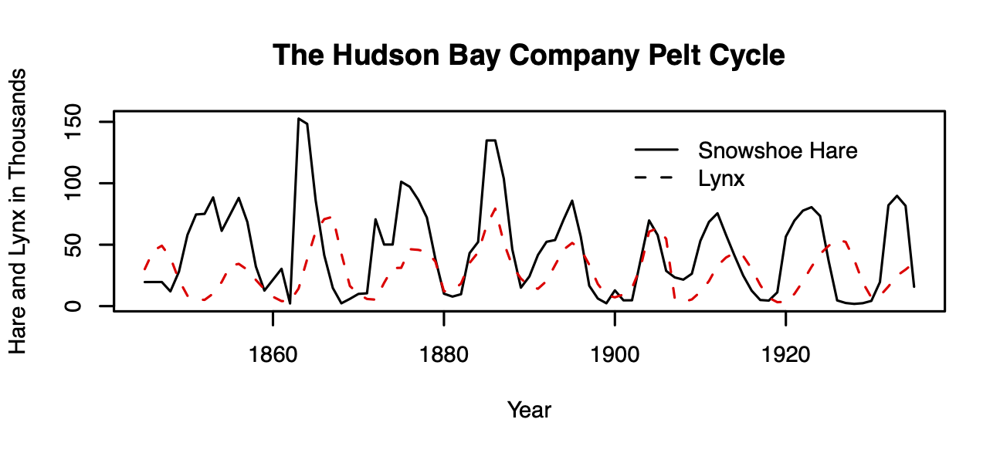

# Consumer-resource Interactions

Consumption is unavoidably fundamental to life. Organisms are at a disequilibrium with their surroundings, requiring inputs of resources to maintain themselves, grow, and reproduce. We first considered organisms from this biophysical or energetic context when we discussed foraging. Optimal foraging theory seeks to understand individual behavior of diet choice as a solution to the problem of maximizing net resource gain per unit time. 

We have also considered population growth from a demographic context beginning in chapter 3 and have continued, as we described with
$$\Delta N = B+I-D-E$$.

In consumer-resource theory, we combine biophysical and demographic approaches.

```{r LH, echo=FALSE, fig.cap="Lynx-snowshoe hare cycles."}

```

One of the most famous examples of species interactions in all of
ecology is the lynx--snowshoe hare cycle, based on data from the Hudson
Bay Trading Co. trapping records (Fig. \@ref(fig:LH)).^[These data are
actually collected from a number of different regions and embedded with a complex food web, so it probably doesn't make much sense to think of this as only one predator-prey pair of populations.] For decades, the lynx--hare cycle was used as a possible example of a predator-prey interaction, until a lot of hard work by a lot of people [@Stenseth1997;@Krebs1995] showed an asymmetric dynamic --- while the lynx depends quite heavily on the hare, and seems to track hare abundance, the hare cycles seem to be caused by more than just lynx. 

In this chapter, we will do a few things. First, we will cover
a few flavors of enemy-victim models of different levels of complexity, and style. Also known as enemy--victim relations, or exploitative interactions, we represent cases in which one species has a negative effect and one a positive effect on the other. In doing so, we will illustrate some fundamental concepts about consumer--resource dynamics, such as how predators respond to prey abundances in both a *numerical* and a *functional* manner. We will try to develop an understanding of the range of dynamics for both continuous and discrete time systems.

In this chapter, we discuss interactions between consumers and resources. In what we consider, the consumer is always an organism. However, we will consider cases in which the resource an inorganic substrate, such as nitrogen, and well as cases the resource is another organism. In general, we can conceptualize these as coupled equations,
\begin{align*}
\frac{1}{R}\frac{dR}{dt}&= f_R\left(R,C\right)\\
\frac{1}{C}\frac{dC}{dt} &= f_C\left(C,R\right)
\end{align*}
in which per-unit change in the resource is a function, $f_R$, of the resource itself and the consumer. Likewise, per-unit change in the consumer is a function, $f_C$, of the consumer itself, and the resource. @Holt2011th identified five universal propositions including that the consumption of resource necessarily reduces the amount of the resource. Both of these depend on the environmental context, but we'll ignore that for now. 

We start with a famous consumer-resource pairing, that of predator and prey, also known as enemy-victim interactions. 

Let's go all the way back to the beginning of this book where we introduced exponential growth. Let's imagine that our exponentially growing population grows at rate
$$\dot{N} = bN-dN$$
We knew that this, like all models, was wrong, but have argued that it is very useful. Indeed, it is in some ways null model for biological systems because exponential growth is so fundamental to life. 

Let us stick with this simplicity, and link a predator $P$ to the prey. A very simple way to do this is to include predators as another source of death of prey ($aN$), and prey as the source of life for predators ($eaN$),
\begin{align*}
\dot{N} &= bN-dN -aN\\
\dot{P} &= eaN - mP
\end{align*}
where $e<1$ and is the relative efficiency with which predators turn captured prey into new predators. 

This efficiency, $e$, shows us another general proposition about enemy-victim interactions; if we consider enemy and victim in the same units (e.g., grams), that the cost to the victim is always greater than the benefit to the enemy. This is simply the result of the second law of thermodynamics.

With these two equations, we can make a simple prediction regarding the equilibrium, $P^*$, by setting $\dot{P} = 0$,
$$P^* = \frac{ea}{m}N\quad ; \quad \frac{P}{N} = \frac{ea}{m}$$

Thus, this simple theory predicts that the relative abundances of predator and prey will be constant. Because the prey only grow (or die) exponentially, this theory can make no prediction about $N^*$. However, it does predict that predator and prey will persist at a constant ratio, assuming the parameters are fixed.

## Ratio dependence

If prey grows exponentially, so will the predators. If this is true, then it makes sense that the prey get captured at a constant per capita rate: the predators will always be lurking about at the same relative abundance. And this leads us to another way to think about these equations.

Now we will make our predators explicit, so that the per capita capture rate of prey is $a$ while the total rate also depends on $P$. On average, the number of prey available to each predator is just $N/P$. Therefore, predators will capture their share of prey at rate 
$$aP\frac{N}{P}$$
In this expression, we see that the capture rate of prey and growth rate of predators depends on the *ratio* of prey to predators. 
Putting this explicit treatment back into our model, we have
\begin{align*}
\dot{N} &= bN-dN -aP\frac{N}{P}\\
\dot{P} &= eaP\frac{N}{P} - mP
\end{align*}

We refer to this simple predator prey model as *ratio-dependent* predation (Arditi and Ginzburg 1989). We have added biological and mathematical complexity, and what is the end result? If we simplify these expressions, and let the $P$'s cancel out, we wind up just where we were before. That is reassuring. Both of these pairs of equations are the same: they describe ratio-dependent predation.

As a first model of predator-prey interactions, this is analogous to exponential growth of a single population, and thus has some very satisfying properties:

* Prey and predator both grow and die exponentially; the predator is merely along for the ride.
* the populations are coupled by the simplest possible connection. 

### Dynamics of ratio dependent predation
The dynamics of ratio-dependent predation are very simple. There are no cycles or fluctuations. It assumes that predation rate is a function of predator abundance and the ratio of prey to predators, and it predicts that predator abundance is is a constant fraction of the prey. This qualitative prediction is often roughly consistent with data.

Let's make a quick model, where we continue to make the ratio-dependence assumption transparent ($(N/P)P$) for clarity.^[Ratio-dependent predation]

```{r rd }
cr_ratio_dep_pred <- function(time, y, parameters){
  # the populations
  N <- y[1]; P <- y[2]
  with(as.list(parameters),{ 
  
    # the equations
    dndt <- r*N - a*N/P*P
    dpdt <- e*a*N/P*P - m*P
    
    # returning a list with one component that is 
    # a two element vector, c(rate1, rate2)
    return(list(c(dndt, dpdt)))
  })
}
```

Now we run it and plot the output.

```{r rdout, fig.cap="With the assumption of simple ratio-dependence, the predator population is a constant fraction of the prey population."}
t <- 0:100
p <- list(r=0.05, a=0.01, e=0.1, m=.1)

y0 <-c(N=100, P=3)
outdf <- as.data.frame(ode(y0, t, cr_ratio_dep_pred,  p))
outL <- pivot_longer(outdf, -time, names_to="State_vars", values_to="abun.")
ggplot(outL, aes(time, abun., colour=State_vars)) + geom_line() + scale_y_log10()
```

If we plot these in state space, we get Fig. \@ref(fig:rd1phase).
```{r rd1phase, echo=FALSE, fig.cap="The predator isocline under ratio dependence. There is no prey isocline because its abundance is completely independent of the predator population. Arrows indicate the trajectories. Note the prey are simply increaing"}
pp.flowfield <-  flowField(cr_ratio_dep_pred, 
                 xlim = c(0.1, 1000),
                 ylim = c(0.1,10),
                 parameters = p, points = 11, add=FALSE,
                 ylab="P", xlab="N", main="Ratio-dep")
pp.nullclines <- nullclines(cr_ratio_dep_pred, 
                            xlim = c(.1, 1000),
                            ylim = c(.1,10),
                            parameters = p, 
                            add.legend = FALSE)
```

*Exercise* Calculate by hand the equilibrium abundance of predators in the above model.


## Prey dependence
A more widely used model of predator-prey dynamics is that of Alfred Lotka and Vito Volterra. In this formulation, the per predator capture rate depends only on the prey abundance, not on the ratio of prey to predators. When capture rate is independent of the number of other predators in the population, we describe it thus.
\begin{align*}
\dot{N} &= bN-dN - aNP\\
\dot{P} &= eaNP - mP
\end{align*}
Here the per predator capture rate is simply $aN$. 

We find equilibria, or more correctly, zero net growth isoclines, by setting $\frac{P}{dt} = 0$ and $\frac{dN}{dt}=0$. When we do this we get curious results.

**Predator isocline** $\frac{dP}{dt} = 0 \implies N=\frac{m}{ea}$ 

**Prey isocline** $\frac{dN}{dt} = 0 \implies P=\frac{a}{r}$ 

Each population's growth rate is zero when the other population is at a fixed value. More on this when we deal with dynamics later on.

### Dyanmics of prey-dependent predation
Now let's create a numerical model of prey-dependent, or Lotka-Volterra, predation.
```{r pd }
cr_prey_dep_pred <- function(time, y, parameters){
  # the populations
  N <- y[1]; P <- y[2]
  with(as.list(parameters),{ 
  
    # the equations
    dndt <- r*N - a*N*P
    dpdt <- e*a*N*P - m*P
    
    # returning a list with one component that is 
    # a two element vector, c(rate1, rate2)
    return(list(c(dndt, dpdt)))
  })
}
```

Now we run this model, using the same parameters, and plot the output.

```{r pout, fig.cap="With the assumption of simple prey-dependence, dynamics are different than with ratio dependence.."}
t <- 0:200; y0 <-c(N=100, P=3)
p <- list(r=0.05, a=0.01, e=0.1, m=.1)

outdf <- as.data.frame( ode(y0, t, cr_prey_dep_pred,  p) )
outL <- pivot_longer(outdf, -time, names_to="State_vars", values_to="abun.")
ggplot(outL, aes(time, abun., colour=State_vars)) + geom_line()
```
With prey dependent predation, we get competely different dynamics. Let's integrate for more time. 
```{r echo=FALSE, fig.cap="Prey-dependent or Lotka-Volterra predation results in oscillations. Prey increase until predators are sufficiently abundant to control them, at which point they decline, leading to the decline of preadtors. The predator peaks lag behind the prey peaks."}
t <- 0:200
out <- ode(y0, t, cr_prey_dep_pred,  p)
outdf <- as.data.frame(out)
outL <- pivot_longer(outdf, -time, names_to="State_vars", values_to="abun.")
ggplot(outL, aes(time, abun., colour=State_vars)) + geom_line()
ggplot(outdf, aes(N, P)) + geom_point()
```


```{r, echo=FALSE, fig.cap="The prey and predator isoclines under prey dependence. Arrows indicate the direction of changing population sizes. The black lines are tractories based on two different initial abundances. The 'nullclines' are the zero net growth isoclines for the prey (x) and the predator (y). Based on the arrow heads, we can see that the trajectories oscillate in a counterclockwise direction."}

ppp.flowfield <-  flowField(cr_prey_dep_pred, xlim = c(0.1, 400), ylim = c(0.1,30),
                                 parameters = p, points = 11, add=FALSE,
                             ylab="P", xlab="N", main="Prey-dep")
ppp.nullclines <- nullclines(cr_prey_dep_pred, xlim = c(.1, 400), ylim = c(.1,30),
                            parameters = p, add.legend = TRUE)
y0  <- matrix(c(100, 25, 100, 10), nc=2, byrow = TRUE)
prey_trajectory <- trajectory(cr_prey_dep_pred, 
                                  y0   = y0, parameters=p,
                                  tlim = c(0, 200))
```

Think about these isoclines for a bit. Under what conditions does the prey increase (arrows pointing right)? Under what conditions does the prey decrease (arrows pointing left)? This shows us that the prey increase whenever the predator abundance is below a certain value. We found that value above, and it is $P = r/a$. When does the predator increase or decrease? When the prey is above or below a particular value, $N=m/(ea)$.

The only time these populations are at rest is when both of these are true. 


## Interlude: Functional response - what an individual predator does 
We refer to the per predator kill rate as the *functional response*. It is the response of a predator to different levels of $N$ and $P$. The functional response of the ratio-dependent model is $aN/P$, where as for the prey-dependent model it is $aN$ (Fig. \@ref(fig:funcresp)). These are referred to as *type I* functional responses.

Are these type I functional responses realistic? They both imply that a predator captures a constant fraction of all prey, *no matter how many prey there are.* It predicts that regardless whether there are two prey individuals or one gazillion prey, a single predator can nonetheless capture the same fraction. So, if prey reach high densities, then type I functional responses are not realistic. However, if prey never reach high densities, then type I is reasonable with the bounds of realized prey densities.

What is typically thought to be more realistic is if the predator satiates, where the capture rate approaches a plateau as the density of prey increases. After all, a predator has to catch, subdue, and kill a prey item, swallow it, and then move on. Optimal foraging models (Chapter 2) typically account for this. Ecologists refer to this activity as "handling" and the time required to do that as *handling time*. Buzz Holling (1959) developed a mathematical form for a functional response with prey-dependent predation that includes handling time:
$$\frac{aN}{1+ahN}$$
where $a$ is attack rate, and $h$ ia handling time. We refer to this functional response as a type II functional response  (Fig. \@ref(fig:funcresp)). As $N$ gets really big, this fraction approaches $1/h$,
$$\lim_{N \rightarrow \infty} \frac{aN}{1+ahN} = \frac{1}{h}$$

If it is not yet clear why this should be, pause and reflect on it. 

We can do the same exercise using the ratio, $N/P$, 
$$\lim_{N/P \rightarrow \infty} \frac{aN/P}{1+ahN/P} = \frac{1}{h}$$

Sometimes predators don't feed a lot until there are enough prey available. Sometimes this is due to predators *switching* from one prey type to another once the other becomes sufficiently common. A predator may develop a search image for a prey type, and ignore others. We've all known people like that. We represent this via an exponent ($z>1$) in our functional response,
$$\frac{aN^z}{1+ahN^z}$$
where $z>1$ and we refer to this as a type III functional response.
```{r funcresp, fig.cap="Left: Functional responses for either prey-dependent or ratio-dependent predation; $z=3$. Right: Same functional responses on a per-prey basis.", fig.show='hold', out.width="35%"}
{
  par(mgp=c(0,1,1))
  curve(.5*x, 0, 2.5, ylab=bquote("no. prey (or prey/predator) killed\nper predator per time"),
       xlab="N or N/P", axes=FALSE, main="Functional Responses")
  box()
  curve(x/(1+x), add=TRUE, lty=2 )
  curve(x^3/(1+x^3), add=TRUE, lty=3 )
  text(2, 1.2, "Type I")
  text(2.5, 1, "Type III", adj=1)
  text(2.5, .6, "Type II", adj=1)
  
  par(mgp=c(0,1,1))
  curve(.5*x/x, 0, 2.5, ylab=bquote("no. prey (or prey/predator) killed\nper predator per time"), ylim=c(0, 1),
       xlab="N or N/P", axes=FALSE, main="Functional Responses")
  box()
  curve(x/(1+x)/x, add=TRUE, lty=2 )
  curve(x^3/(1+x^3)/x, add=TRUE, lty=3 )
  text(0, .55, "Type I", adj=0)
  text(0, .1, "Type III", adj=0)
  text(0, 1, "Type II", adj=0)
}
```

If we ever want to use data to ask about the behavior of a predator, it can be very difficult to distinguish between these foraging behaviors by fitting data to functional response curves. We typically have more success fitting data of kill rate *per unit prey* *vs.* prey density (Fig. \@ref(fig:funcresp)) because there are qualitative differences in slope (negative vs. positive) at low prey density [@Juliano:2001cq].

The **numerical response** of the predator is simply the $dP/dt$ vs. $N$.


## Stability analysis for the prey-dependent Lotka--Volterra model
In this section, we will perform the necessary analytical work to understand the dynamics of Lokta--Volterra predator--prey dynamics, and we follow this up with a peek at the time series dynamics to confirm our understanding based on the analytical work. 

As before for competition, we follow four steps: determine equilibria, create the Jacobian matrix, and solve and use the Jacobian.

*Lotka--Volterra equilibrium*

All we have to do is to solve the isoclines for where they cross. Thus we could set these equations equal to each other. It turns out, however, that the isoclines were just straight lines, so we see that the equilibrium is at $(r/a,\,m/(ea))$.

*Creating, solving and using the Jacobian matrix*

Take a look at the growth equations again. Here we take the partial derivatives of these because we want to know how each population growth rate changes in response to changes in the abundance each of the other population. The partial derivatives of the prey growth equation, with respect to itself and to the predator, go into the first row of the matrix, whereas the partial derivatives of the predator growth rate, with respect to the herbivore and itself go into the second row.^[A partial derivative is just a derivative of a derivative with respect to one of the state variables.]
\begin{align}
  (\#eq:jacLV1)
\left(
\begin {array}{cc}
\frac{\partial \dot{N}}{\partial N}&\frac{\partial \dot{N}}{\partial P}\\
\frac{\partial \dot{P}}{\partial N}&\frac{\partial \dot{P}}{\partial P}
\end {array}
\right) =
\left(
\begin {array}{cc}
r-aP & -aN\\
eaP & eaN-g\\
\end {array}
\right)
\end{align}

We can replace the $P$ and $N$ in the Jacobian with the equibria found above. When we do this, we get

\begin{align}
  \label{eq:jacLV2}
\left(
\begin {array}{cc}
r-a(r/a)&-a(m/(ae))\\
ea(r/a)&ea(m/(ae))-s\\
\end {array}
\right) 
=
\left(
\begin {array}{cc}
0&-m/e\\
er&0\\
\end {array}
\right).
\end{align}

Typically a system will be more stable if the diagonal elements are more negative --- that would mean that each population is self regulating, and it corresponds to the Routh-Hurwitz criterion (see the competition chapter for an earlier use of the Routh-Hurwitz criteria).
\begin{equation}
  (\#eq:RH1)
  \mathbf{J_{11}} + \mathbf{J_{22}} < 0.
\end{equation}
We notice that in \@ref(eq:jacLV2) these diagonal elements are both zero. These zeroes reveal that there is no negative density dependence within each population, that is, no self-regulation. 

The other part of the Routh-Hurwitz criteria is the condition,
\begin{equation}
  (\#eq:RH2)
\mathbf{J_{11}}\mathbf{J_{22}-\mathbf{J_{12}}\mathbf{J_{21}}} > 0.
\end{equation}
In the predator--prey context, this suggests that the herbivore *declines* due to the predator ($\mathbf{J_{12}}<0$) and the predator *increases* due to the herbivore ($\mathbf{J_{21}}>0$). The signs of these elements make their product negative, and help make the above condition true. Note that because $\mathbf{J_{11}}\mathbf{J_{22}}$, this condition reduces to $bs>0$. Thus it seems that this will be true as along as both $b$ and $s$ are positive (which is always the case).

We can perform eigenanalysis given the parameters above.
```{r}
# our parameters are inside the list called 'p', so we use 'with()'
Jac <- with( p, matrix( c(0, -m/e, e*r, 0), byrow=TRUE, nr=2) )
eigen(Jac)[["values"]]
```

We would find that the eigenvalues are complex. Because they are complex, this means that the populations will oscillate or cycle, with period $2\pi/\omega$ (see Competition chapter). Because the real parts are zero, this means that the Lotka--Volterra predator--prey exhibits *neutral* stability. Recall that neutral stability is the "in-between" case where perturbations at the equilibrium neither grow nor decline over time. They merely change the abundances but cause no response.

## Prey carrying capacity and type II functional response
Among the more commonly used predator-prey models include a carrying capacity for the prey and a nonlinear type II functional response for the predator. This has commonly been attributed to @Rosenzweig:1963fk, and others soon began using similar approaches [@May1973ab]. Here is a common version, which I'll refer to as our Rosenzweig-MacArthur model:
\begin{align*}
\frac{dN}{dt} &= rN(1-\alpha N) - \frac{aN}{1+ahN}P
\frac{dP}{dt} &= e\frac{aN}{1+ahN}P - mP
\end{align*}

To investigate its dynamics, we can create an ODE function of this consumer-resource model.
```{r}
cr_RM_pred <- function(time, y, p){
  N <- y[1]; P <- y[2]
  with(as.list(p),{
    dN <- r*N*(1-alpha*N) - a*N*P/(1+a*h*N)
    dP <- e*a*N*P/(1+a*h*N) - m*P
    return(list(c(dN, dP)))
  })
}
```

```{r fig.cap="*Predator-prey dynamics with prey carrying capacity and type II predator functional response. With these parameter values, we see damped oscillations.*", out.width="67%"}
t <- 0:100; y0 <-c(N=100, P=3)
p <- list(r=0.8, alpha=0.001, a=.02, e=0.04, m=.15, h=.1)
outdf <- as.data.frame( ode(y0, t, cr_RM_pred,  p) )
outL <- pivot_longer(outdf, -time, names_to="State_vars", values_to="abun.")
ggplot(outL, aes(time, abun., colour=State_vars)) + geom_line()
```

If we plot the isoclines, we can see the dynamical phase plane more clearly. 

```{r echo=FALSE, eval=FALSE}
#p <- list(r=0.8, alpha=0.001, a=.02, e=0.04, m=.15, h=.1)
(P.iso <- with(p,{
  print(c(e,h*m))
  (m/a)/(e-h*m)
}))

with(p,{
curve((r/a) * (1 + (a*h - alpha)*x - a*alpha*h*x^2), 0, 1000, ylim=c(0,50))
abline(v=P.iso)
})

```

```{r, echo=FALSE, fig.cap="Damped oscillations can arise with prey negative density dependence, and a type II predator funcional response. Arrows indicate the direction of changing population sizes. The black lines are tractories based on two different initial abundances. The nullclines are the zero net growth isoclines for the prey (x) and the predator (y). Based on the arrow heads, we can see that the trajectories oscillate in a counterclockwise direction."}

ppp.flowfield <-  flowField(cr_RM_pred, xlim = c(0.1, 1000), 
                            ylim = c(0.1,80),
                            parameters = p, points = 11,
                            add=FALSE, ylab="P", xlab="N",
                            main="Rosenzweig-MacArthur")
ppp.nullclines <- nullclines(cr_RM_pred, xlim = c(.1,1000), 
                             ylim = c(.1,80),
                            parameters = p, add.legend = FALSE)
y0  <- matrix(c(100, 25, 100, 10), nc=2, byrow = TRUE)
prey_trajectory <- trajectory(cr_RM_pred,  y0 = y0,
                              parameters=p,
                              tlim = c(0, 200))
findEquilibrium(cr_RM_pred, y0=c(300,40), parameters=p)$ystar
```

### Paradox of enrichment
@Rosenzweig1971 showed an unexpected phenomenon --- that increasing a prey's carry capacity could drive it to extinction. This can happen if the prey grow too quickly to high abundance and temporarily support a high abundance of predators which then drive the prey extinct. We can demonstrate that here by lowering $\alpha$ enough to increase oscillations so that abundances get infinitessimally close to zero.


```{r fig.cap="*Predator-prey dynamics with prey carrying capacity and type II predator functional response. With these parameter values, we see damped oscillations.*", out.width="67%"}
t <- 0:100; y0 <-c(N=100, P=3)
p <- list(r=0.8, alpha=0.0005, a=.02, e=0.04, m=.15, h=.1)
outdf <- as.data.frame( ode(y0, t, cr_RM_pred,  p) )
outL <- pivot_longer(outdf, -time, names_to="State_vars", values_to="abun.")
ggplot(outL, aes(time, abun., colour=State_vars)) + geom_line()
```
