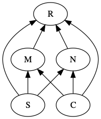

**This was been updated Friday afternoon, 17 Nov. 2017**

```{r setup, message=FALSE, include=FALSE}
# for plotting
library(ggplot2) 

# for our web construction and food web properties
library(bipartite) 
library(igraph)
library(rARPACK)

# for pretty graphics
library(DiagrammeR)
library(DiagrammeRsvg)
library(rsvg)
library(knitr)

# for structural equation models (including path analysis)

library(lavaan)
library(semPlot)
```


## Comparing Consumer vs. Mutualistic Bipartite Webs

Understanding the effects of network architecture on network resilience is a core mission of community ecology. Here we compare how mutualist and antagonist bipartite networks affect network resilience [@Thebault2010]. We control for network structure, and ask whether the subsequent effects of diversity, connectance, nestedness, and modularity on resilience differ between mutualist and antagonist networks (Fig. \@ref(fig:TandF)). In brief, you will find that they do.  

```{r TandF, echo=FALSE, fig.cap="*Possible effects of species richness, connectance, modularity, and nestedness on network resilience.*"}
tf <-
"digraph{
  rankdir = BT;
//node[shape=box];
//{rank=max; R;}
//{rank=min; S; C;}
// oval is the default node shape
S -> M; 
S -> N;
S -> R
C -> M;
C -> N;
C -> R;
M -> R;
N -> R;
}"

grViz(tf) %>%
  export_svg %>% charToRaw %>% rsvg_png("TandF.png")


```

Our questions are derived from @Thebault2010a, but the approach we use is different. They simulated dynamic communities using systems of ODEs that are similar to those that we have seen in earlier chapters on mutualism and consumer-resource interactions. They include negative density dependence in plants and type II functional responses in mutualists and herbivores.

We will use the approach we used earlier, that of May (1973) and @Pimm1977 @Pimm1978. In this approach, we do not simulate the dynamics. Instead, we assume that the species involved coexist, and we draw their interaction strengths at random from a specified distribution. This determines their instantaneous per capita effect on each other's population growth rate, that is, the Jacobian matrix that describes their interactions. 

In our approach, we will establish interactions at random, in which each pair of species (plant and animal) has the same probability of interacting. That probability is connectance ($L/(PA)$), where $P$ and $A$ are the numbers of plants and animals in the network. This means that the structure (who is connected to whom) will be determined randomly rather than as a result of the dynamics of ODE models as in Thebault and Fontaine (2010). Further, the number of species and the connectance will both be draw at random, within specified ranges.


### Creating bipartite webs

We'll start by creating a toy example of a bipartite web of mutualists: plants and their pollinators.
```{r cars}
# The number of species of plants
Sp <- 5
# The number of species of pollinators
Sa <- 12
# the total number of species
S <- Sa+Sp
```

We then set the connectance, and then generate random interactions between species.
```{r}
# The connectance in this web. 
contc <- .5

# Create interactions at random, drawing 0's and 1's with a probability of contc=0.5
interactions <- rbinom( n = Sa * Sp, size=1, prob=contc)

# Put those connections into our web
bip.network <- matrix(interactions, nrow=Sp, ncol=Sa)
rownames(bip.network) <- paste("plant", LETTERS[1:Sp], sep="")
colnames(bip.network) <- paste("bug", LETTERS[1:Sa], sep="")
#...and look at it
bip.network
```

Now that we have randomly constructed topology, let's create a realistic assumption about *how much* each of the pollinators interact with those plant species. It is generally observed that most interactions are weak (e.g., infrequent visits) and a few are strong (e.g., frequent visits). That pattern can be approximated by an exponential distribution. We will create those interactions and then plot them.
```{r}
# Exponentially distributed of interaction strengths
# Random numbers from and exponential distribution
x <- rexp(Sa*Sp)

# express these as a probability distribution (divide by the sum)
xp <- x/sum(x)

# assign those exponential probabilities to our interactions,
# creating the Quantitative network
bip.networkQ <- bip.network * xp
```

Next we can make some pretty pictures of this web.
```{r toys, fig.cap="*Illustrations of a hypothetical plant-pollinator network. The two matrices organize the species to highlight either nestedness (left) or modularity (right).*" }
{
  # visweb and plotweb are in the bipartite package
  layout(matrix(c(1,2,3,4), nc=2, byrow=TRUE) )
  hist(bip.networkQ, main="", xlab="interaction strength")
  plotweb(bip.networkQ, method='normal') 
  visweb(bip.networkQ, type='nested')
  visweb(bip.networkQ, type='diagonal')
  }
```

To measure the nestedness and the modularity, we use functions from packages `igraph`. 
```{r properties}
# Nestedness:
# quant. version of NODF  (Almeida-Neto et al. 2008, 2011)
bipartite::networklevel(bip.networkQ, index=c("weighted NODF"))
bipartite::metaComputeModules(bip.networkQ, N=5, method="Beckett") @ likelihood
```
This measure of nestedness (WNODF, @Almeido2011) varies between 0 and 100 for completely nonnested and nested networks. This measure of modularity varies between 0 and 1 for completely non-modular and modular networks.

To measure stability of this plant by animal matrix, we first convert it to a square matrix, add a little negative denisty dependence, and then use eigenanalysis to find the dominant eigenvalue.
```{r}
n <- matrix(0, nr=S, nc=S) 
# upper triangular part
n[1:Sp, (Sp+1):S] <- bip.networkQ
# lower triangular part
n[(Sp+1):S, 1:Sp] <- t(bip.networkQ) 
# Add negative density dependence that is the 
# same magnitude as other species interactions
diag(n) <- -1*max(rowSums(n))

#Calculate stability
Re(eigen(n)$values[1])
```
 
That is just an example of the type of network we will create in our simulation---we create a bipartite web with a random number of species, and random connectance, each within specified bounds.

## Testing effects of nestedness and modularity on network resilience.

In our webs, we can compare the effects of negative vs. positive interactions directly, because we will create one network with interaction strengths, and then simply reverse the signs of the effects of the animals on the plants to get herbivory *vs.* mutualism.

We simulate 1000 random bipartite webs using a large number of different numbers of plant and animal species. We select a connectance by drawing randomly from a uniform distribution between the values in argument `C`. 

When we generate a random network, we save one version that represents mutualists (+,+), and then we reverse the sign for the effect of the animal to represent herbivory (+,-).

The function `bip_stability()` performs eigananalysis on the resulting Jacobian matrix to estimate *resilience*, which we define as the negative of the real part of the dominant eigenvalue. This way, greater resilience is a larger positive number. It calculates the resilience for both the mutualist and the herbivorous versions of each random network. It also calculates *nestedness* and *modularity* in ways similar to that in Thebault and Fontaine (2010). It can calculate modularity in two ways, using either the binary adjacency matrix (ones and zeroes) or a quantitative matrix; the latter takes much moore time to calculate, so it uses the binary matrix by default. It also tallies diversity as the total number of species and the connectance as the total number of links divided by the number of possible links.

Make sure that ```bip_stability.R``` is in your working directory.
```{r}
source("bip_stability.R")
# Learn what arguments are available in this function
args(bip_stability)
```

* `Spp.a` and `Spp.p` are vectors from which the numbers of animal and plant species are drawn at random.
* `reps` is the number of random networks to create. 
* `C` is a two-element vector provide the min and max of possible connectances drawn at random. 

```{r}
b <- bip_stability(Spp.a = 16:60, Spp.p = 8:30, C=c(.05, 0.5), reps=1000, quant=FALSE)
```

We can get a summary of the output of the 1000 simulated webs here.
```{r}
summary(b)
```

Are these webs stable? What are the medians and ranges of each of the web properties? How do the resiliences of the two interaction types differ?

We can also graph these relations.
```{r}
pairs(b)
```

Do any of these relate to figures in Thebault and Fontaine (2010)?

## Path Analysis

Now we do the same sort of analysis that Thebault and Fontaine did to get their Fig. 2 C,D. Path analysis is a relatively simple way to model sets of correlations among dependent variables.

If we look above, we see curvature in some of the relations. In simple path analysis, as in Thebault and Fontaine, these relations are assumed to be linear. Here we transform these data a tad to help linearize these relations.
```{r}
out.tr <- (b)^.75
pairs( out.tr )
```

We next scale our data so that all variables have a mean of zero and a standard deviation of 1.
```{r}
dat <- data.frame( scale(out.tr) ) 
```

We specify each of the relationships, where `y ~ x` is "y as a function of x". We then fit the model and get the path coefficients.

To mimic Thebault and Fontaine, we will include all and only the interactions in their figure 2. We start with the mutualism web.

```{r}
# Step 1: Specify model
model <- 'resilience.m ~ nestedness + modularity + S + C
          nestedness ~  S + C
          modularity ~ S + C '

# Step 2: Estimate model of mutualism
mod.m.fit <- sem(model, data=dat)
coef(mod.m.fit)
```

Look at the estimates of the regressions. Those are the path coefficients.

Now it is up to you to get a pencil and paper and draw the picture....

Next, do the same thing for herbivory.
```{r}
# Step 1: Specify model
model <- 'resilience.h ~ nestedness + modularity + S + C
          nestedness ~ S + C
          modularity ~ S + C'

# Step 2: Estimate model of herbivory
mod.h.fit <- sem(model, data=dat)
coef(mod.h.fit)  

```

```{r paths, fig.cap="*Given the same bipartite network sturcture and the identical interaction strengths, antagonistic and mutualistic webs show different relations among emergent properties.*", fig.show='hold', out.width="50%"}

semPaths(mod.m.fit, what='path', whatLabels="std", 
         curve=1, curvature=1, sizeMan=10,
         edge.label.cex = 1.5, nCharNodes=4,
         edge.label.position=.7, layout='tree2')
semPaths(mod.h.fit, what='path', whatLabels="std", 
         curve=1, curvature=1, sizeMan=10,
         edge.label.cex = 1.5, nCharNodes=4,
         edge.label.position=.7, layout='tree2')

```
