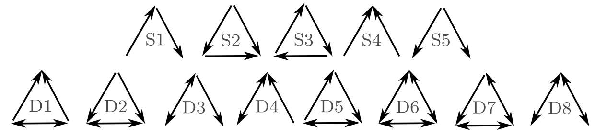
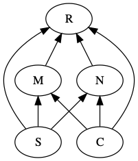

# Food webs and other networks

A food web is a real or a model of a *set of feeding relations among species or functional groups*. This chapter has two foci, (i) a very brief introduction to multi-species webs as networks, and (ii) a re-examination of old lessons regarding the effect of food chain length on a web's dynamical properties.


```{r web, echo=FALSE, fig.cap="A food web is a map of feeding relations. Here, snails (S) and invertebrates (I) feed on algae, and fish, F, feed on invertebrates and algae. We can represent this as a graph or a matrix.", out.width="40%", fig.show='hold', fig.ncol=2, fig.height=5, fig.width=5}
gid <- graph(c('S','A', 'A','S', 
               'I','A', 'A','I', 
               'I','F', 'F','I',
               'A','F', 'F','A'))
signs <- c("-",'+', "-",'+', "-",'+', "-",'+')
plot(gid, layout=matrix(c(0, .5, 1, .6, 0.5, 0.1, 0.5, .85), nc=2),
     edge.curved=.5,edge.label=signs, edge.label.font=2,  
     edge.label.cex=1.5, vertex.size=60, 
     margin=c(0,0,0,0), rescale=TRUE)
```


\begin{matrix}
& ~A~ & ~I~ & ~S~ & ~F~\\
\hline
A&0&-&-&-\\
I&+&0&0&-\\
S&+&0&0&0\\
F&+&+&0&0
\end{matrix}


## Food Web Characteristics
We need language to describe the components of a food web, such as *links* and *nodes*, and we also need language to describe the properties of a web as a whole. Generally speaking, networks such as food webs have *emergent properties* [@May:2006lr], such as the number of nodes in the network. Emergent properties are typically considered to be nothing more than characteristics which do not exist at simpler levels of organization. For instance, one emergent property of a population is its density, because population density cannot be measured in an individual; that is why density is an emergent property.^[If we assume no supernatural or spectral interference, then we can also assume that density arises mechanistically from complicated interactions among individuals and their environments, rather than via magic. Other scientists will disagree and say that properties like density that are merely additive aggregates do not qualify for the lofty title of "emergent property."] While all food web models are based on simple pairwise interactions, the resulting emergent properties of multispecies webs quickly become complex due to indirect interactions and coupled oscillations [@Berlow:2004yq;@Vandermeer:2006fj].  In addition, any extrinsic factor (e.g., seasonality) that might influence species interactions may also influence the emergent properties of food webs. 


A few important network descriptors and emergent properties include,

* **Node** A point of connection among links, a.k.a. trophospecies; each node in the web may be any set of organisms that share sufficiently similar feeding relations; in Fig. \@ref(fig:web), $F$ may be a single population of one species, or it may be a suite of species that all feed on both $I$ and $A$. 
* **Link** A feeding relation; a connection between nodes or trophospecies; may be directed (one way) or undirected. A directed link is indicated by an arrow, and is the effect ($+,\,-$) of one species on another. An undirected link is indicated by a line (no arrow head), and is merely a connection, usually with positive and negative effects assumed, but not quantified. 
* **Connectance** The proportion of possible links realized. Connectance may be based on either directed, $C_{D}$, or undirected, $C_{U}$, links. For Fig. \@ref(fig:web) these would be
\begin{gather*}
C_{D}=\frac{L}{S^{2}}=\frac{8}{16}=0.5 \\
C_{U}=\frac{L}{\left(S^2-S\right)/2}=\frac{4}{6}=0.67
\end{gather*}
where $S$ is the number of species or nodes.
* **Degree distribution**, $\mathrm{Pr}(i)$ The probability that a randomly chosen node will have degree $i$, that is, be connected to $i$ other nodes [@May:2006lr]. In Fig. \@ref(fig:web), $S$ is of degree 1 (i.e., is connected to one other species).  $F$ and $I$ are of degree 2, and $A$ is of degree 3. If we divide through by the number of nodes (4, in Fig. \@ref(fig:web)), then the degree distribution consists of the probabilities $\mathrm{Pr}\left(i\right)=\{0.25,\,0.5,\,0.25\}$. As webs increase in size, we can describe this distribution as we would a statistical distribution. For instance, for a web with randomly placed connections, the degree distribution is the binomial distribution [@Cohen1990d].
* **Characteristic path length** Sometimes defined as the average shortest path between any two nodes [@Dunne2002aa]. For instance, for Fig. \@ref(fig:web), the shortest path  between $S$ and $A$ is 1 link, and between $A$ and $I$ is 2 links. The average of all pairwise shortest paths is $(1+1+1+1+2+2)/6=1.\bar{3}$. It is also sometimes defined as the average of all paths between each pair of nodes.
* **Modularity, Compartmentation** The degree to which subsets of species are highly connected or independent of other species. This tends to arise in consumer-resource interactions [@Thebault2010].

To calculate modularity in a food web, first assume each species interacts with itself. Next, calculate the proportion of shared interactions, $p_{ij}$ for each pair of species, by comparing the lists of species with which each species in a pair interacts. The numerator of $p_{ij}$ is the number of species with which both of the pair interact. The denominator is the total number of different species with which either species interacts. \medskip

As an example, let's calculate this for the above food web (Fig. \@ref(fig:web)). $S$ interacts with $S$ and $A$, $I$ interacts with $I$, $A$, and $F$. Therefore, $S$ and $I$ both interact with only $A$, whereas, together, $S$ and $I$ interact with $S$, $I$, $A$, and $F$. The proportion, $p_{ij}$, therefore is $1/4 = 0.25$. We do this for each species pair. \smallskip

Next we sum the proportions, and  divide the sum by the maximum possible number of undirected links, $C_U$.

\begin{matrix}
 & S & I & F\\
\hline
A&2/4&3/4&3/4\\
S&  &1/4&1/4\\
I&  &  &3/3
\end{matrix}

\begin{align*}
C_{I}&=\frac{\sum_{i=1}^{S-1}\sum_{j=i+1}^{S}p_{ij}}{\left(S^2-S\right)/2}\\
    &=3.5/6\\
    &=0.58
\end{align*}

To reiterate: For any pair of species, $i$ and $j$ ($i\neq j$), $p_{ij}$ is the proportion of shared interactions, calculated from the number of species that interact with both species $i$ and $j$, divided by the number of species that interact with either species $i$ or species $j$. As above, $S$ is the number of species or nodes in the web.

* **Nestedness** the degree to which specialists make connections that generalists do too. A completely nested network is one in which we can rank species by the number of interactions, and find that species that interact with fewer other species are always interacting with species that generalists also interact with. This tends to arise in plant-pollinator networks [@Thebault2010].
* **Motif** A repeating pattern; most commonly, a unique set of unidirectional patterns of consumption (Fig. \@ref(fig:motifs)). A motif *profile* of a species is the variety of motifs that that species is part of, and the relative frequency with which they play each role. 
* **Small world architecture** The degree to which characteristic path length, $L$, grows with the logarithm of the number of nodes in the web, $N$, 
$$L \propto log(N)$$
This occurs when nodes are connected via a small number of links through a node with a large number of connections. This occurs in social networks when individuals are connected via shared acquaintances.

```{r motifs, echo=FALSE, fig.cap="There are 13 different possible motifs for three species. These links record only consumption. For instance, S1 is a simple linear food chain and S4 is a single species that is consumed by two other species. motifs D1-D8 all include mutual consumption. This is likely to occur between species in the same guild, and when adults of one feed on juveniles of another."}

```

* **Trophic level, trophic position** may simply be categorized as basal, intermediate or top trophic positions. Basal positions are those in which the trophospecies feed on no other species. The top positions are those in which the trophospecies are fed upon by nothing. One can also calculate a quantitative measure of trophic level. This is important in part because omnivory, something rampant in real food webs, complicates identification of a trophic level. We can calculate trophic level for the top predator, $F$ (Fig. \@ref(fig:web)), and let us assume that $F$ gets two-thirds of what it needs from $I$, and gets one-third from $A$. $I$ itself is on the second trophic level, so given that, the trophic level of $P$ is calculated as
\begin{equation*}
T_{i}=1+\sum_{j=1}^{S}T_{j}p_{ij}=1+\left(2\left(0.67\right)+1\left(0.33\right)\right)=2.67
\end{equation*}
where $T_{i}$ is the trophic level of species $i$,
$T_{j}$ is the trophic level of prey species $j$,
and $p_{ij}$ is the proportion of the diet of predator
$i$ consisting of prey $j$.

* **Omnivory** Feeding on more than one *trophic* level; it is *not* merely feeding on different species or resources.
* **Intraguild predation** A type of omnivory in which predation occurs between consumers that share a resource; in Fig. \@ref(fig:web) $F$ and $I$ share prey $A$. When $F$ gets most of its energy from $I$, we typically refer to that as omnivory; when $F$ gets most of its energy from $A$, we typically refer to that as intraguild predation because two species that share a resource occasionally eat each other.

This list of food web descriptors is a fine start but is by no means exhaustive.

## Does omnivory destablize food chains?
There are many interesting questions about food webs that we could address; let us address one that has a long history, and as yet, no complete answer: What determines the length of a food chain? Some have argued that chance plays a large role  [@Cohen1990d;@Hubbell2001; @Williams2000a],  and others have shown that area [@MacArthur1967; @Rosenzweig1995] or ecosystem size [@Post:2002bs] may play roles. The explanation that we will focus on here is *dynamical stability*. Communities with more species had been hypothesized to be less stable, and therefore less likely to persist and be observed in nature. Stuart Pimm and John Lawton [@Pimm1977] extended this work by testing whether *food chain length* could be limited by the instability of long food chains.

### Multi-species Lotka--Volterra notation
A many-species Lotka--Volterra model can be represented in a very compact form,
\begin{equation}
(\#eq:compact)
\frac{d X_{i}}{d t}=X_{i}\left(b_{i}+\sum_{j=1}^{S}a_{ij}X_{j}\right)
\end{equation}
where $S$ is the number of species in the web, $b_i$ is the intrinsic rate of increase of species $i$ (i.e., $r_i$), and $a_{ij}$ is a per capita effect of species $j$ on species $i$. 

When $i=j$, $a_{ij}$ refers to an *intra*specific effect, which is typically negative. Recall that in our earlier chapters on competition, we used $\alpha_{ii}$ to represent intraspecific per capita effects. Here for notational convenience, we leave $i$ and $j$ in the equation, realizing that $i=j$ for intraspecific interactions. Further, we let $a_{ij}$ be any sign, either positive or negative, and sum the effects. If we let $X=N$, $b=r$, and $a=r \alpha$, then the following are equivalent:
\begin{gather*}
  \dot{N_1} =r_1N_1\left(1-\alpha_{11}N_1 - \alpha_{12}N_2\right)\\
  \dot{X} =X_1\left(b_1+a_{11}X_1+a_{12}X_2 \right)
\end{gather*} 
The notation in \@ref(eq:compact) is at once both simple and flexible. When $a_{ij}$ is negative, it may represent competition or the effect of a predator, $j$, on its prey, $i$. When $a_{ij}$ is positive, it may represent mutualism or the effect of prey~$j$ on a predator~$i$.

### Background
In the early and mid-1970's, Robert May and others demonstrated that important predictions could be made with relatively simple Lotka--Volterra models [@May1973ab], and this work still comprises an important compendium of lessons for ecologists today [@May:2006lr]. May used simple Lotka--Volterra models to show that increasing the number of species in a food web tended to make the food web less stable [@May1973ab; @May1972]. In species-rich webs, species were more likely to become extinct. Further, he showed that the more connections there were among species in the web (higher connectance), and the stronger those connections (higher interaction strength), the less stable the web. At the time, this ran counter to a prevailing sentiment that more diverse ecosystems were more stable, and led to heated discussion. 
```{r PLABE, echo=FALSE, fig.cap="Three of the six webs investigated by Pimm and Lawton (1977). Left to right, these correspond to Pimm and Lawton (1977) Figs. 1A, E, and B. All basal species exhibit negative density dependence.", out.width=c("50%","50%","50%"), fig.show='hold'}
# fig.ncol=3, fig.height=10, fig.width=5
resc <- TRUE
gA <- graph(c(1,1, 1,2,2,1, 2,3,3,2, 3,4,4,3))
signs <- c("-", '+',"-", '+',"-", '+',"-")
plot(gA, layout=matrix(c(.5,.5,.5,.5, 0,.33,.67,1), nc=2), edge.curved=.5,      edge.label=signs, edge.label.font=1,  edge.label.cex=1, 
     vertex.size=20, edge.loop.angle=pi/4,
     margin=c(0,0,0,0), rescale=resc)

gE <- graph(c(1,1, 2,2, 3,3, 1,4,4,1, 2,4,4,2, 3,4,4,3))
signs <- c("-","-","-", '+',"-", '+',"-", '+',"-")
plot(gE, layout=matrix(c(0,.5,1,.5, 0,0,0,.5), nc=2), edge.curved=.5,      edge.label=signs, edge.label.font=1,  edge.label.cex=1, 
     vertex.size=30, edge.loop.angle=pi/4,
     margin=c(0,0,0,0), rescale=resc)

gB <- graph(c(1,1, 1,2,2,1, 
              2,3,3,2, 
              3,4,4,3, 
              2,4,4,2))
signs <- c("-", '+',"-", 
           '+',"-", 
           '+',"-", 
           '+',"-")
Bl <- matrix(c(.3,.5,.7,.3, 0,.33,.67,1), nc=2)
Bl <- matrix(c(.5,.5,.51,.49, 0,.33,.67,1), nc=2)
plot(gB, layout=Bl, 
     edge.curved=.5,edge.label=signs, edge.label.font=1,  edge.label.cex=1, 
     vertex.size=30, edge.loop.angle=pi/4,
     margin=c(0,0,0,0), rescale=resc)
```

May used specific quantitative definitions of all of his ideas. He defined connectance as the proportion of interactions in a web, given the total number of all possible directed interactions (i.e., directed connectance). Thus a linear food chain with four species (Fig.  \@ref(fig:PLABE), web A), and intraspecific competition in the basal (bottom) species would have a connectance of $4/16=0.25$. May's definition of interaction strength was the square root of the average of all $a_{ij}^2$ ($i \neq j$),
\begin{equation}
  (\#eq:IS)
  I =\sqrt{ \frac{\sum_{i=1}^S\sum_{j=1, i \neq j}^S a_{ij}}{S^2-S}}.
\end{equation}
Squaring the $a_{ij}$ focuses on magnitudes, putting negative and positive values on equal footing.

An important component of May's work explored the properties of *randomly* connected food webs. At first glance this might seem ludicrous, but upon consideration, we might wonder where else one could start. Often, simpler (in this case, random) might be better. The conclusions from the random connection models act as null hypotheses for how food webs might be structured; deviations from May's conclusions might be explained by deviations from his assumptions. Since this work, many ecologists have studied the particular ways in which webs in nature appear non-random.

One conclusion May derived was a threshold between stability and instability for random webs, defined by the relation
\begin{equation}
  (\#eq:1)
  I\left( S C_D \right)^{1/2} = 1
\end{equation}
where $I$ is the average interaction strength, $S$ is the number of species, and $C_D$ is directed connectance.  If $I\left( S C \right)^{1/2} > 1$, the system tended to be unstable  (Fig. \@ref(fig:may1)). Thus, if we
increase the number of species, we need to decrease the average interaction
strength if we want them to persist. The larger and more tightly connected (larger $I$, $S$, and $C_D$) the
web, the more likely it was to come crashing down. Therefore, if longer food
chains were longer by virtue of having more species, they would be less stable
because of the extra species, if for no other reason.
```{r may1, fig.cap="Relation between the average interaction strength and the number of species able to coexist (here directed connectance is $C_D = 0.3$). The line represents the maximum number of species that are predicted to be able to coexist at equilibrium. Fewer species could coexist, but, on average, more species cannot coexist at equilibrium.", fig.width=5, fig.height=5, results='hide', echo=FALSE, out.width="60%"}
S <- 40; C=.3
par(mar=c(3,3,0,0), mgp=c(2,.5, 0))
curve(C*x^ -2, .1, 1, ylab=expression("Number of Species ("*italic(S)*")"),
      xlab = expression("Interaction Strength ("*italic(I)*")") )
text(.6, 20, "Unstable Webs", srt=45)
text(.2, 3.75, "Stable Webs" , srt=-45, cex=.8)
```

Pimm and Lawton felt that it seemed reasonable that long chains might be less
stable also because predator-prey dynamics appear inherently unstable, and a
connected series of unstable relations seemed less likely to persist than
shorter chains. They tested whether food chain length
*per se*, and not the number of species, influenced the stability of food
chains. Another question they addressed concerned omnivory. At the time, surveys of naturally occurring
food webs had indicated that omnivory was rare [@Pimm1978]. Pimm and Lawton tested whether omnivory stabilized or destabilized food webs [@Pimm1977;@Pimm1978]. 

Like May, Pimm and Lawton [@Pimm1977] used Lotka--Volterra models to
investigate their ideas. They designed six different food web configurations
that varied food chain length, but held the number of species constant (Fig.
\@ref(fig:PLABE)). For each food web configuration, they varied randomly interaction strength and tested whether an
otherwise randomly structured food web was stable. Their food webs included
negative density dependence only in the basal species. 

Pimm and Lawton concluded that (i) shorter chains were more stable than longer chains, and (ii) omnivory destabilized food webs. While these conclusions have stood the test of time, Pimm and Lawton failed to highlight another aspect of their data --- that omnivory shortened return times for those webs that were qualitatively stable (Fig. \@ref(fig:histsAB)). Thus, omnivory could make more stable those webs that it didn't destroy. Subsequent work has elaborated on this, showing that weak omnivory is very likely to stabilize food webs  [@McCann1998a]. 

### Implementing Pimm and Lawton's Methods
Here we use R code to illustrate how one might replicate, and begin to extend, the work of Pimm and Lawton [@Pimm1977].

In previous chapters, we began with explicit time derivatives, found partial derivatives and solved them at their equilibria. Rather than do all this, Pimm  and Lawton bypassed these steps and went straight to the evaluated Jacobian matrix. They inserted  random estimates for the elements of the Jacobian into each non-zero element in the food web matrix. These estimates were constrained within (presumably) reasonable limits, given large less abundant predators and small more abundant prey. 

Their methods followed this approach.

1. Specify a food web interaction matrix.^[In the original publication, webs E and D seem to be represented incorrectly.]
2. Include negative density dependence for basal species only. 
3. Set upper and lower bounds for the effects of predators on prey ($0$ to
$-10$) and prey on predators($0$ to $+0.1$); these are the Jacobian elements.
4.  Generate a large number of random Jacobian matrices and perform linear
stability analysis.
5. Determine qualitative stability (test $\lambda_1<0$), and return time for each random matrix. Use these to examine key features of the distributions of return times (e.g., average return time).
6.  Compare the stability and return times among different food web configurations that varied systematically in food chain length and the presence
of omnivory, but hold the number of species constant.

It is worth discussing briefly the Jacobian elements. @May1973ab defined interaction strength as the Jacobian element of a matrix, which represents the *total effect of one individual on the  population growth rate of another species*. Think about how you calculate the Jacobian --- as the partial derivative of one species' growth rate with respect to the size of the other population. It is the instantaneous change in the population growth rate per unit change in the population of another, at the equilibrium. The units chosen for the Jacobian elements thus mean that individual predators have relatively much larger effects on the population growth rates of prey than *vice versa*.

Let's build a function that does what Pimm and Lawton did. There are an infinite number of ways to do this, but this will suffice. First, we'll create a matrix that represents qualitatively the simplest longest food chain where each species feeds only on one other species and where no prey are fed upon by more than one consumer. Initially, we will use the values of greatest magnitude used by Pimm and Lawton. 
```{r}
Aq = matrix(c(
  -1,   -10,   0,     0,
  0.1, 0,   -10,  0,
  0,    0.1,   0,    -10,
  0,      0,    0.1,   0),
  nrow=4, byrow=TRUE)
```
Note that this matrix indicates a negative effect of the basal species on itself, large negative effects ($-10$) of each consumer on its prey, and small positive effects of each prey on its consumer.

We can do a quick check of this web using the `diagram` package. 
```{r}
library(diagram)
plotmat(Aq,relsize=.8)
```

Without any additional arguments, it shows us pretty much all we need to see.


For subsequent calculations, it is convenient to to find out from the matrix itself how big the matrix is, that is, how many species, $S$, are in the web.
```{r}
S <- nrow(Aq)
```
Next, we create a random realization of this matrix by multiplying each element times a unique random number between zero and 1. For this matrix, that requires $4^2$ unique numbers.
```{r}
M <- Aq * runif(S^2)
```
Next we perform eigenanalysis on it, retaining the eigenvalues.
```{r}
eM <- eigen(M)[["values"]]
```
Pimm and Lawton tested whether the dominant eigenvalue was greater than 0 (unstable) and if less than zero, they calculated return time. We will simply record the dominant eigenvalue (the maximum of the real parts of the eigenvalues).
```{r}
deM <- max( Re(eM) )
```
Given the stabilizing effect of the intraspecific negative density dependence, we will hang on to that as well.
```{r}
intraNDD <- sqrt(sum(diag(M)^2)/S)
```
Given lessons from May's work, we might also want to calculate the average interaction strength, not including the intraspecific interactions. Here we set the diagonal interactions equal to zero, square the remaining elements, find their average, and take the square root.
```{r}
diag(M) <- 0
IS <- sqrt( sum(M^2)/(S*(S-1)) )
```
Recall that weak omnivory is supposed to stabilize food webs [@McCann1997]. For webs that include omnivory, we will calculate the interaction strength of omnivory in the same way we do for other interactions, as the square root of the average of the squared $a_{ij}$ \@ref(eq:IS).

We can wrap all this up in a function where we specify the $i,\,j$ of one of the directed omnivorous links. It does not matter which we specify, either the $ij$ or the $ji$.
```{r PL2, echo=FALSE, results='hide'}
pimmlawton <- function(mat, N=1, omni.i=NA, omni.j=NA, omega=NULL){
  S <- nrow(mat)
  if(is.na(omni.i)) {
  out <- matrix(NA, nrow=N, ncol=4)
    colnames(out) <- c("DomEig", "Im", "IntraDD", "I")
  for(n in 1:N) out[n,] <- {
  M = runif(S^2) * mat
  ## Do eigenanalysis
  eigs <- eigen(M)[["values"]]
  mx <- which.max(Re(eigs))
  deM = Re(eigs)[mx]
  deMi = Im(eigs)[mx]
  intraNDD <- sqrt(sum(diag(M)^2)/S)
  diag(M) <- 0
IS = sqrt( sum(M^2)/(S*(S-1)) )
 c(deM, deMi, intraNDD, IS)
  } } else {
  out <- matrix(NA, nrow=N, ncol=5)
    colnames(out) <- c("DomEig", "Im", "IntraDD", "I", "I.omni")
  for(n in 1:N) out[n,] <- {
  M = runif(S^2) * mat
  ## Adjust for McCann type omnivory
  if(!is.null(omega))  {M[omni.i,omni.j] <- omega*M[omni.i+1,omni.j]
                      M[omni.i+1,omni.j] <- (1-omega)*M[omni.i+1,omni.j]
                      M[omni.j,omni.i] <- omega*M[omni.j,omni.i+1]
                      M[omni.j,omni.i+1] <- (1-omega)*M[omni.j,omni.i+1]}
  ## Do eigenanalysis
  eigs <- eigen(M)[["values"]]
  mx <- which.max(Re(eigs))
  deM = Re(eigs)[mx]
  deMi = Im(eigs)[mx]
  intraNDD <- sqrt(sum(diag(M)^2)/S)
  diag(M) <- 0
IS = sqrt( sum(M^2)/(S*(S-1)) )
    omnivory <- sqrt(mean(c(M[omni.i,omni.j],M[omni.j,omni.i])^2))
 c(deM, deMi,intraNDD, IS, omnivory)
  }
}
    return(as.data.frame(out))
}
```

See the arguments in the function.
```{r} 
args(pimmlawton)
```

Now we can check this function for a single simulation for our first web,
```{r}
set.seed(1)
pimmlawton(Aq)
```
Now let's do it 2000 times, as Pimm and Lawton did. Each row will be an independent randomization, and the columns will be the dominant eigenvalue, the intraspecific density dependence, and the average interaction strength.
```{r}
out.A <- pimmlawton(Aq, N=2000) 
```
We might like to look at basic summary statistics of the information we collected --- what are their minima and maxima and mean? 
```{r}
summary(out.A)
```
We see that out of 2000 random food chains, the largest dominant eigenvalue is still less than zero ($\lambda_1<0$). What does that mean? It means that all of the chains are qualitatively stable, and that the return times are greater than zero ($-1/\lambda_1>0$).^[Recall that a negative return time indicates that any ``perturbation'' at the equilibrium would have been closer to zero at some time in the past, i.e., that the perturbation is growing.]

May's work showed that stability is related to interaction strength. Let's examine how the dominant eigenvalue is related to interaction strength.^[Recall that if we think of stability analysis as the analysis of a small perturbation at the equilibrium, then the dominant eigenvalue is the growth rate of that perturbation.]

May's work showed that stability is related to interaction strength. Let's examine how the dominant eigenvalue is related to interaction strength.^[Recall that if we think of stability analysis as the analysis of a small perturbation at the equilibrium, then the dominant eigenvalue is the growth rate of that perturbation.]
```{r pairsA, fig.cap="Perturbations at the equilibrium tend to dissipate more rapidly (more negative dominant eigenvalues) with greater intraspecific negative density dependence (IntraDD) and greater interspecific interaction strength (I). This graph also demonstrates the independence of IntraDD and I in these simulations."}
out.A$I.rel <- with(out.A, log(I/IntraDD) )
pairs(out.A)
# out.A$Idd <-  cut(out.A$IntraDD, 
#          quantile(out.A$IntraDD), include.lowest=TRUE )
# ggplot(data=out.A, aes(I, DomEig)) + geom_point() +
#   geom_smooth() + facet_wrap(~ Idd)
```

The results of our simulation (Fig. \@ref(fig:pairsA)) show that the dominant eigenvalue can become more negative with greater intraspecific negative density dependence (`IntraDD`) and greater intersepcifiic interaction strength (`I`). Recall what this means --- the dominant eigenvalue is akin to a perturbation growth rate at the equilibrium and is the negative inverse of return time. Therefore, stability can increase and return time decrease with increasing interaction strengths.

Note also (Fig. \@ref(fig:pairsA)) that many eigenvalues seem very close to zero --- what does this mean for return times? The inverse of a very small number is a very big number, so it appears that many return times will be very, very large, and rendering the webs effectively unstable. Let's calculate return times and examine a summary.
```{r}
  RT.A <- -1/out.A[["DomEig"]]
  summary(RT.A)
```
We find that the maximum return time is a very large number, and even the median is fairly large (```r round( median(RT.A) )```). In an ever-changing world, is there any meaningful difference between a return time of 1000 generations *vs.* being unstable or neutrally stable? 
 
Pimm and Lawton addressed this by picking an arbitrarily large number (150) and recording the percentage of return times greater than that. This percentage will tell us the percentage of webs that are not effectively stable.
```{r}
  sum( RT.A > 150 ) / 2000
```
Now let's extract the return times that are less than or equal to 150 and make a histogram with the right number of divisions or bins to allow it to look like the one in the original [@Pimm1977].
```{r histA, fig.cap="*A linear four-species food chain has is only somewhat likely to have reasonble return times.*"}
A.fast <-RT.A[RT.A < 150]
histA <- hist(A.fast, breaks=seq(0,150, by=5), main=NULL)
```
This histogram (Fig. \@ref(fig:histA)) provides us with a picture of the stability for a linear Lotka-Volterra food chain. Next, we will compare this to other webs.

### Shortening the Chain
Now let's repeat all this (more quickly) for a shorter chain, but with the same number of species (Fig. \@ref(fig:PLABE), web E). So, we first make the web function. Next we run the 2000 simulations, and check a quick summary.
```{r}
Eq = matrix(c(
  -1,   0,   0, -10,
  0,   -1,   0, -10,
  0,    0,   -1, -10,
  0.1, 0.1, 0.1,  0),
  nrow=4, byrow=TRUE)
# to confirm we got it right:
# plotmat(Eq, relsize=.8)
```

Now we can run the simulation.
```{r}
out.E <- pimmlawton(Eq, N=2000)
summary(out.E)
```
The summary shows that, again, that all webs are stable ($\lambda_1<0$). A histogram of return times also shows very short return times (Fig. \@ref(fig:histE)). Plots of $\lambda_1$ *vs.* interaction strengths show that with this short chain, and three basal species that the role of intraspecfic density dependence becomes even more important, and the predator-prey interactions less important in governing $\lambda_1$. 
```{r E1, fig.cap="For a food chain with two levels, and three basal species, perturbation growth rate (lambda_1) declines with increasing intraspecific negative density dependence (IntraDD) and is unrelated to predator-prey interaction strengths.", out.width=9}
layout(matrix(1:2,nr=1))
plot(DomEig ~ IntraDD, data=out.E)
plot(DomEig ~ I, data=out.E)
```

Note that with the shorter food chain, a greater proportion of the $\lambda_1$ are more negative (farther away from zero) than in the four level food chain. Clearly then, shortening the web and increasing the amount of negative density dependence stabilizes it, in spite of still having the same number of species.

Let us again categorize these as having long and short return times, and graph the distribution of the short ones.
```{r histE, fig.cap="*One predator and three prey, each with negative density dependence results in very stable webs.*"}
RT.E <- -1/out.E[["DomEig"]]
E.fast <-RT.E[RT.E < 150]
histE <- hist(E.fast, breaks=seq(0,150, by=5), main=NULL)
```


### Adding Omnivory
Real webs also have omnivory --- feeding on more than one trophic level. A nagging question, then and now, concerns the effect of omnivory on food web dynamics. Pimm and Lawton compared food web dynamics with and without omnivory. Let's now create the omnivorous web they used to compare directly with their linear food chain (Fig. \@ref(fig:PLABE), B vs. A). Next we run the 2000 simulations, and check a quick summary.
```{r}
Bq <- matrix(c(
  -1, -10,   0,     0,
  0.1,  0,   -10,   -2,
  0,    0.02,   0,    -10,
  0,    0.1,    0.1,   0),
  nrow=4, byrow=TRUE)
#plotmat(Bq, relsize=.8)
# recall we have to tell the function which links are omnivorous
out.B <-  pimmlawton(Bq, N=2000, omni.i=2, omni.j=4)
summary(out.B)
```
With omnivory, we now see that most webs have $\lambda_1>0$, and thus are *unstable*. This was one of the main points made by Pimm and Lawton. Let's look at the data for just the stable webs.
```{r}
out.B.stable <- out.B[out.B[,"DomEig"]<0,]
pairs(out.B.stable)
```

It means that most of the randomly constructed webs were not stable point equilibria. To be complete, let's graph what Pimm and Lawton did. They graphed the return times that were positive, and ignored those that were negative.
```{r histB, fig.cap="*Of the relatively few omnivorous webs that were qualitatively stable, a moderate fraction had low return times.*"}
RT.B <- -1/out.B[["DomEig"]]
B.fast <- RT.B[RT.B < 150 & RT.B > 0 ]
out.B.fast <- out.B[RT.B < 150 & RT.B > 0,]
histB <- hist(B.fast, breaks=seq(0,150, by=5),
              main=NULL)
```

### Comparing Chain A versus B
Now let's compare the properties of the two chains, without, and with, omnivory, chains **A** and **B** (Fig. \@ref(fig:PLABE), webs A and B). Because these are stochastic simulations, it means we have *distributions* of results. For instance, we have a distribution of return times for chain **A** and a distribution for return times for chain **B**. That is,
we can plot histograms for each of them. Pimm and Lawton compared their webs in common sense ways. They compared simple summaries, including

* the proportion of random webs that were qualitatively stable (positive return times),
* the proportion of stable random webs with return times greater than 150.

Now let's try graphical displays. Rather than simply chopping off the long return times, we use base 10 logarithms of return times because the
distributions are so right-skewed. First, we make a data frame with a column for web ID (A or B) and a column for all the return times. We then filter for just positive return times
```{r}
ret.time <- data.frame(web=rep(LETTERS[1:2], each=2000),
                       return.time = c(RT.A, RT.B)) %>% 
  filter(return.time>0)
```

Next we create a histogram of return times using probability density instead of counts.^[Note that now we use probabilities for the $y$-axis, rather than counts. The probability associated with any particular return time is the product of the height of the column and the width of the column (or bin).] We also add a nonparametric density estimator. 
```{r histsAB, fig.cap="*Comparing the distributions of return times for chain **A** and **B**. 'Density' is probability density.*"}
ggplot(ret.time, aes(return.time, fill=web)) + 
  geom_histogram(aes(y = ..density..),
                 alpha=.5, position="identity") + 
  geom_density(aes(fill=NULL, colour=web)) + 
  scale_x_log10() 
```

By overlaying these distributions, we make an interesting observation. The omnivorous webs with positive return times (those plotted) actually tended to have shorter return times than the linear chain. Pimm and Lawton noted this, but did not emphasize it. Rather, they sensibly focused on the more obvious result, that over 90% of the omnivorous webs had negative return times, indicating an absence of a stable point equilibrium.

### Re-evaluating Take-Home Messages
The primary messages made by @Pimm1977 were that 

* shorter webs are more stable than long chains,
* omnivory destabilized webs.

These conclusions were a major part of the lively debate surrounding these issues. It was consistent with the apparent observation of the time, that empirical food webs revealed little omnivory [@Pimm1977;@Pimm1978], and that food chains in nature seemed to be much shorter than could occur, if primary productivity (green plants and algae) was channeled upwards into a linear chain. 

Let's consider their assumptions.

First, Pimm and Lawton made the argument, as many others have (including us), that systems with stable point equilibria (nodes or foci) are more likely to persist than systems with persistent oscillations, such as stable limit cycles.  It is easy to show that a system can be pushed from a stable equilibrium into oscillations which eventually become so big as to drive an element of the system to extinction. This is a very reasonable assumption, but one which is not challenged enough. Other measures of system stability could be used, such as the minimum that occurs in a long series of fluctuations [@Huxel1998;@McCann1997]. 

Second, Pimm and Lawton ignored the effects of self-regulated basal species. By exhibiting negative density dependence, the basal species stabilized the web. When Pimm and Lawton made a shorter web, they also added more self-regulated populations. Thus, they necessarily confounded chain length with the number of species with negative density dependence. Which change caused the observed differences among webs? We don't know.

Third, they assumed that the effect of web topology (i.e., short *vs.* long chain) was best evaluated with the *average* properties of the topology, rather than the maximum properties of the topology. By these criteria, webs without omnivory were clearly better. On average, webs without omnivory were more often stable than chains with omnivory, even if some of their return times tended to be quite long. Therefore, one might argue that if a web assembles in nature, it is more likely to persist (i.e., be stable) if it lacks omnivory. 

However, let us consider this preceding argument further. The world is a messy place, with constant insults and disturbances, and resources and environmental conditions fluctuating constantly. In addition, there is a constant rain of propagules dropping into communities, and species abundances are changing all the time. In a sense then, communities are being constantly perturbed. The only webs that can persist in the face of this onslaught are the *most* stable ones, that is the ones with the shortest return times. We just showed that Pimm and Lawton's own analyses showed that *the most stable webs tended to be those with omnivory*. Subsequent work supports this claim that omnivory is rampant in nature [@Polis1991], and this is supported by theory that shows weak interactions, including omnivory, stabilize food webs [@McCann1998;@McCann1997].

One feature of our simulations that we ignored were oscillations implied by the imaginary component of each eigenvalue. Recall that larger imaginary parts imply shorter cycles, while zero means no oscillation at all.

Pimm and Lawton made very important contributions to this lengthy debate, and we are finally figuring out how to interpret their results.

## Perhaps mutualism stabilizes bipartite networks

Understanding the effects of network architecture on network resilience is a core mission of community ecology. In this section, we compare how mutualist and antagonist interactions in bipartite networks affect network resilience [@Thebault2010]. A bipartite network is one in which there are two separate groups of species, in which species interact between groups, but never within groups. Two such examples would be herbivores and plants, or pollinators and plants. @Thebault2010 compared both empirical and simulated plant-pollinator and plant-herbivore bipartite webs and found they differed in the network structure and the consequences for network stability.


To run the code in this section, you will need to install a few more packages.  If you've already installed them, just load them.
```{r eval=FALSE}
pkgs <- c("bipartite", "igraph", "rARPACK", "lavaan", "semPlot")
# install.packages(pkgs)
invisible( # to hide messages
  lapply(pkgs, library, character.only=TRUE)
)
```

In the following comparison between mutualist and antagonist bipartite networks, we control for network structure, and measure direct and indirect effects of diversity, connectance, nestedness, and modularity on resilience. We can then ask whether these effects differ between mutualist and antagonist networks (Fig. \@ref(fig:TandF)). In brief, you will find that they do.  
```{r TandF, echo=FALSE, fig.cap="*Possible effects of species richness, connectance, modularity, and nestedness on network resilience.*", out.width="50%"}
tf <-
"digraph{
  rankdir = BT;
//node[shape=box];
//{rank=max; R;}
//{rank=min; S; C;}
// oval is the default node shape
S -> M; 
S -> N;
S -> R
C -> M;
C -> N;
C -> R;
M -> R;
N -> R;
}"

grViz(tf) %>%
  export_svg %>% charToRaw %>% rsvg_png("TandF.png")


```

Our questions are derived from @Thebault2010a, but the approach we use is different. They simulated dynamic communities using systems of ODEs that are similar to those that we have seen in earlier chapters on mutualism and consumer-resource interactions. These ODEs included negative density dependence in plants and type II functional responses in mutualists and herbivores.

We will use the approach we used earlier, that of May (1973), @Pimm1977 and @Pimm1978. In this approach, we do not simulate the dynamics. Instead, we assume that the species coexist, and we draw their interaction strengths at random from a specified distribution. This determines their instantaneous per capita effect on each other's population growth rate, that is, the Jacobian matrix that describes their interactions. 

In our approach, we will establish interactions at random, in which each pair of species (plant and animal) has the same probability of interacting. That probability is connectance ($L/(PA)$), where $P$ and $A$ are the numbers of plants and animals in the network. Note that this measure of connectance differs from previous definitions, because we are ruling out all within-group interactions. This means that the structure (who is connected to whom) will be determined randomly rather than as a result of the dynamics of ODE models as in Thebault and Fontaine (2010). Further, the number of species and the connectance will both be draw at random, within specified ranges.

### Creating bipartite webs

We'll start by demonstrating a toy example of a bipartite web of mutualists: plants and their pollinators. We select the numbers of species and the connectance.  
```{r cars}
# The number of species of plants
Sp <- 5
# The number of species of pollinators
Sa <- 12
# the total number of species
S <- Sa+Sp

# The connectance in this web. 
contc <- .4
```

We then generate random interactions between species using the *binomial distribution*. This is the distribution of coin flips or rolling of die. If we want to flip a single fair coin ten times, we can use `rbinom()`. 
```{r}
# size is the number of coins to flip at once.
rbinom(n=10, size = 1, prob=0.5 )
```
We say this is "ten observations of 1 trial".

If we want to flip 10 coins all at once and count the number of heads, we could do this:
```{r}
# size is the number of coins to flip at once.
rbinom(n=1, size = 10, prob=0.5 )
```
We would say this is "one observation of ten trials".

For our bipartite web, we will create `Sa * Sp` coin flips or observations of one trial, each with the probability of 0.4 of getting a link.
```{r}
# Create interactions at random, drawing 0's and 1's with a probability of contc=0.5
interactions <- rbinom( n = Sa * Sp, size=1, prob=contc)
```

We create a matrix with these links (and no links). This will create our topology.
```{r}
bip.network <- matrix(interactions, nrow=Sp, ncol=Sa)
rownames(bip.network) <- paste("plant", LETTERS[1:Sp], sep="")
colnames(bip.network) <- paste("bug", LETTERS[1:Sa], sep="")
#...and look at it
bip.network
```

Your web may have species that do not interact with any others; that's okay for now. One day, you might have data like that.

Now let's add interaction strength. We'll rely on a semi-realistic assumption about *how much* each of the pollinators interact with those plant species. It is generally observed that most interactions are weak (e.g., infrequent visits) and a few are strong (e.g., frequent visits). That pattern can be approximated by an exponential distribution. We will create those interactions and then plot them.
```{r}
# Exponentially distributed of interaction strengths
# Random numbers from and exponential distribution
xp <- rexp(Sa*Sp)

# express these as a probability distribution (divide by the sum)
xp <- xp/sum(xp)

# assign those exponential probabilities to our interactions,
# creating the Quantitative network
bip.networkQ <- bip.network * xp
```

Next we can make some pretty pictures of this web. To do this, you'll need to load the `bipartite` package.
```{r toys, fig.cap="*Illustrations of a hypothetical plant-pollinator network. The two matrices organize the species to highlight either nestedness (left) or modularity (right).*" }
{
  # library(bipartite) if needed
  # visweb and plotweb are in the bipartite package
  layout(matrix(c(1,2,3,4), nc=2, byrow=TRUE) )
  hist(bip.networkQ, main="", xlab="interaction strength")
  bipartite::plotweb(bip.networkQ, method='normal') 
  bipartite::visweb(bip.networkQ, type='nested')
  bipartite::visweb(bip.networkQ, type='diagonal')
  }
```

There are several good network packages in R. We will use `bipartite` and `igraph`. Here we will measure the nestedness and the modularity using functions from package `bipartite`. 
```{r properties}
# Nestedness:
# quant. version of NODF  (Almeida-Neto et al. 2008, 2011)
networklevel(bip.networkQ, index=c("weighted NODF"))
metaComputeModules(bip.networkQ, N=5, method="Beckett") @ likelihood
```
This measure of nestedness (WNODF, @AlmeidaNeto2011) varies between 0 and 100 for completely nonnested and nested networks. This measure of modularity varies between 0 and 1 for completely non-modular and modular networks.

To measure stability of this plant by animal matrix, we first convert it to a square matrix, add a little negative denisty dependence, and then use eigenanalysis to find the dominant eigenvalue.
```{r}
n <- matrix(0, nr=S, nc=S) 
# upper triangular part
n[1:Sp, (Sp+1):S] <- bip.networkQ
# lower triangular part
n[(Sp+1):S, 1:Sp] <- t(bip.networkQ) 
# Add negative density dependence that is the 
# same magnitude as other species interactions
diag(n) <- -1*max(rowSums(n))

#Calculate stability
Re(eigen(n)$values[1])
```
 
That is just an example of the type of network we will create in our simulation---we create a bipartite web with a random number of species, and random connectance, each within specified bounds.

### Testing effects of nestedness and modularity on network resilience.

In our webs, we can compare the effects of negative vs. positive interactions directly, because we will create one network with interaction strengths, and then simply reverse the signs of the effects of the animals on the plants to get herbivory *vs.* mutualism.

We simulate 1000 random bipartite webs using a large number of different numbers of plant and animal species. We select a connectance by drawing randomly from a uniform distribution between the values in argument `C`. 

When we generate a random network, we save one version that represents mutualists (+,+), and then we reverse the sign for the effect of the animal to represent herbivory (+,-).

The function `bip_stability()` performs eigananalysis on the resulting Jacobian matrix to estimate *resilience*, which we define as the negative of the real part of the dominant eigenvalue. This way, greater resilience is a larger positive number. It calculates the resilience for both the mutualist and the herbivorous versions of each random network. It also calculates *nestedness* and *modularity* in ways similar to that in Thebault and Fontaine (2010). It can calculate modularity in two ways, using either the binary adjacency matrix (ones and zeroes) or a quantitative matrix; the latter takes much moore time to calculate, so it uses the binary matrix by default. It also tallies diversity as the total number of species and the connectance as the total number of links divided by the number of possible links.


This function has several arguments which you can see described in the help file. Among them are
* `Spp.a` and `Spp.p`: vectors from which the numbers of animal and plant species are drawn at random,
* `C`: a two-element vector provide the min and max of possible connectances drawn at random,
* `reps`: the number of random networks to create. 

Here we use it to generate 1000 random webs. We will then use those to examine the relations between various emergent properties of the networks.
```{r}
#library(primer)
b <- bip_stability(Spp.a = 16:60, Spp.p = 8:30, C=c(.05, 0.5), reps=5000, quant=FALSE)
```

We can get a summary of the output of the 1000 simulated webs here.
```{r}
summary(b)
```

Are these webs stable? What are the means, medians and ranges of each of the web properties? What is the percent differences in the resiliences of the two interaction types? 

We can also graph the pairwise relations. 
```{r}
pairs(b)
```

If you have a copy of Thebault and Fontaine (2010), you might check whether the above relations are similar to theirs.

### Path Analysis

Now we do the same sort of analysis that Thebault and Fontaine did to get their Fig. 2 C,D. Path analysis is a relatively simple way to model sets of correlations among dependent variables. To do this, we will use the `lavaan` package.

If we look above, we see curvature in some of the relations. In simple path analysis, as in Thebault and Fontaine, these relations are assumed to be linear. Here we transform these data a tad to help linearize these relations.
```{r}
out.tr <- (b)^.75
```

We next scale our data so that all variables have a mean of zero and a standard deviation of 1. This will simplify the interpretation of the path analysis output: the regression coefficients partial correlation coefficients and will be effect sizes that are each comparable to the others.
```{r}
dat <- data.frame( scale(out.tr) ) 
```

We specify each of the relationships, where `y ~ x` is "y as a function of x". We then fit the model and get the path coefficients.

To mimic Thebault and Fontaine, we will include all and only the interactions in their figure 2. We start with the mutualism web. Start by loading the `lavaan` package if you haven't previously.
```{r}
# library(lavvan)
# Step 1: Specify model
model.m <- 'resilience.m ~ nestedness + modularity + S + C
          nestedness ~  S + C
          modularity ~ S + C '

# Step 2: Estimate model of mutualism
mod.m.fit <- sem(model.m, data=dat)
coef(mod.m.fit)
```

These are the estimates of the pairwise regressions. Those are the path coefficients that tell us the strengths of the relations among the network properties. Below we make a path diagram using these.

Next, do the same thing for herbivory.
```{r}
# Step 1: Specify model
model.h <- 'resilience.h ~ nestedness + modularity + S + C
          nestedness ~ S + C
          modularity ~ S + C'

# Step 2: Estimate model of herbivory
mod.h.fit <- sem(model.h, data=dat)
#coef(mod.h.fit)  
```

To make the path diagrams, you'll need the `semPlot` package.
```{r paths, fig.cap="*Given the same bipartite network structure and the identical interaction strengths, mutualistic (left) and antagonistic webs (right) show slightly different relations among emergent properties. Recall also that resilience is about *", fig.show='hold', out.width="50%"}
# library(semPlot)
semPaths(mod.m.fit, what='path', whatLabels="std", 
         curve=1, curvature=1, sizeMan=10,
         edge.label.cex = 1.5, nCharNodes=4,
         edge.label.position=.7, layout='tree2')
semPaths(mod.h.fit, what='path', whatLabels="std", 
         curve=1, curvature=1, sizeMan=10,
         edge.label.cex = 1.5, nCharNodes=4,
         edge.label.position=.7, layout='tree2')

```

Here we see that some of the relations among empergent properties differs in the two web types. It is reassuring that the relations between richness and connectance *vs.* nestedness and modularity are identical. This is because the topologies (connections) are identical, as the only difference is the sign of some of the interactions. 

The differences lie in the slightly different effects on resilience. What are those differences, and are they consistent with Thebault and Fontaine (2010)? Are they consistent with what is generally presumed about the role of mutualisms and consumption in food webs?


## Exploring Pandora, right here at home

The Na'vi of Pandora know something of how their world works, and we are working hard to understand ours. Our world is a highly antagonistic world, driven by consumption - a tangled bank, nature, red in tooth and claw. However, all around us and hidden beneath  our feet, many species cooperate to survive and thrive in this otherwise harsh world. This cooperation can happen among species and it can also happen among individuals within a species. Suzanne Simard and others have been investigating belowground networks of nutrient flux and information sharing among individuals and between species.

Most plant species develop mycorrhizae, fungi-root associations which are typically mutualistic interactions. These fungi can often connect individuals of the same species together, creating a network by which one plant can information, nutrients, and carbon with another plant via this fungal highway. However, how these connections are structured is still very poorly known. In an effort to shed some light on this, @Beiler2015 described the topology of Douglas fir trees connected by two species of individual fungal genets, in contrasting environments (\@ref(fig:plot1)).


### Properties assessed

1. Application of networks to mycorrhizae
* node = tree
* link = one or more fungal genets connecting  two trees
* triplet = three connected trees (open triplet is connected by two links, closed, by three)
2. Network properties
* link density (links/species)
* degree distribution (statistical distribution of node degrees)
* global or network clustering coefficient: fraction of triplets that are closed (no. of closed triplets) / (no. of open + no. closed triplets)
* mean lcoal clustering coefficient among nodes in each network
* Betweenness centrality: the number of times a node acts as a bridge along the shortest path between two other nodes. How important is this node in making connections for other nodes?
3. Node properties
* degree (# of links)
* normalized degree: (fraction: d / all possible d)
* node clustering coefficient (local transivity; extent to which its neighbors are are connected)

All these were evaluated by whether the observed properties differed from properties that emerge from random networks with the same number of nodes and average node degree as the empirical mycorrhizal networks. We can generate such a graph using the `igraph` package. 

Plot 1, from a xeric site, had 26 trees and 258 links. Therefore, the average node degree must be $258/26\approx 9.9$. We can create a random graph by simply specify the number of vertices and the number of edges.
```{r plot1, fig.cap="*Example of a random graph using the same number of vertices and links as in plot 1 (Beiler et al. (2015)).*", out.width="70%" }
# node clustering coefficient: 0.84
# for Plot 1
V <- 26
E <- 258

gr <- erdos.renyi.game(V, E, type = "gnm")
# graph "order" and "size"
gorder(gr); gsize(gr)
plot(gr, vertex.label= NA, edge.arrow.size=0.02,vertex.size = 0.5, xlab = "Random Network: G(V,E) model")
```

We can compare the observed average node clustering coefficient ($0.84 \pm 0.37$) to that of the random graph we created above. Note that transivity is node clustering.
```{r}
mean(transitivity(gr, type = "local"))
```
We find that these differ. The observed can then be compared to 1000s of simulated random networks to see how unusual the observed value is. Here we use a toy example with 100 simulations to compare the node clustering coefficient observed in plot 1 to what we would expect in a random network.
```{r nccHist, fig.cap="*Observed node clustering appears unuusally high, relatively to that of random networks.*"}
ncc.sims <- replicate(100, { 
  gr <- erdos.renyi.game(V, E, type = "gnm")
  mean(transitivity(gr, type = "local"))
  } )
qplot(x=ncc.sims, geom="histogram") + 
  geom_vline(xintercept = 0.84, linetype=2)
```

We see that the local node clustering is higher in one real plot than we would expect by chance. Remember that this measures the extent to which a node's neighbors are connected to each other.


Among their results, Beiler et al. found that node clustering coefficient and node degree increased with tree size. It is interesting that in spite of these both increasing with tree size, there is a negative relation between them node clustering coef and node degree (Fig. 2). Beiler et al. point out that this happens in 'scale-free' graphs. 

A *scale-free* graph is one in which the probability of a node having L links follows a power law relation,
$$Pr(L) \sim L^{-z}$$
where, apparently, $2<z<3$. Let's demonstrate that for one plot.

```{r plot1sf, fig.cap="*Emergent relation between node clustering and node degree in a scale-free random network, based on the number of nodes and links in plot 1.*"}
# node clustering coefficients (per node)
ncc <- transitivity(gr, type = "local")
# degrees of each node
d <- degree(gr)
qplot(d, ncc, geom="jitter")
```

Now let's combine all the plots into one graph. First I collect all the data from Beiler et al. (Table 1,2, Beiler et al. (2015)).

```{r} 
# vertices
V <- c(26, 13, 31, 27, 27, 41)
# egdes
E <- c(258, 66, 283, 254, 177, 434)
# proportion of trees colonized
pV <- c(.846, .5, .875, .846, .778, .889)
# mean node degree
mean.deg <- c(18, 695, 17.15, 17.52, 12.21, 20.19)
# mean node clustering coef.
mean.ncc <- c(.84, .63, .84, .85, .83, .8)
plot <- 1:6
df <- data.frame(plot=plot, V=V, E=E, pV=pV, mean.deg=mean.deg, mean.ncc=mean.ncc)
df
```


```{r echo=FALSE, eval=FALSE}
my_ER_Stats <- function(ve){
  # ve is a two-element vector of vertices and edges totals
  
  V <- ve[1];  E <- ve[2]
  gr <- erdos.renyi.game(V, E, type = "gnm")
  
  # betweenness centrality
  bc <- igraph::betweenness(gr, directed = FALSE, weights = NULL,
  nobigint = TRUE, normalized = FALSE)
  bcbar <- mean(bc)
  
  # Network clustering coefficient
  gcc <- transitivity(gr) # global
  
  ncc <- transitivity(gr, type = "local")
# mean node clustering coefficient
 nccbar.o <- mean(ncc) # cf 0.84
# degrees of each node
d <- igraph::degree(gr)
# mean degree
dbar.o <- mean(d) # cf 18
return( c(bcbar.op=bcbar, gcc.o=gcc, nccbar.o=nccbar.o, dbar.o=dbar.o))
}
```

Next I make a function that generates a random graph from the data in Beiler et al. and calculates the properties I need.

For scale free graphs, I will set the power exponent to something between 2 and 3.
```{r}
exp.out <- 2.5
```

The following somewhat complicated looking code does the following for each plot in each site

* generates a scale-free random graph
* calculates local node clustering coefficient (transivity) for each resulting "tree",
* calculates the degree for each "tree",
* records the site of the plot.

It then binds together the data collected for each plot at each site.
```{r allplotsf, fig.cap="*Emergent relations between node clustering and node degree in scale-free random networks, based on the number of nodes and links in each plot.*"}
df2 <- apply(df[,1:3], 1, function(ve){
  #make a scale-free random graph, given V and E
  gsf <- sample_fitness_pl(ve[2], ve[3], exponent.out= exp.out,
                           exponent.in = -1, loops = FALSE,
                           multiple = FALSE, 
                           finite.size.correction = TRUE)
  # calculate prpoerties
  ncc <- transitivity(gsf, type = "local")
  deg <- igraph::degree(gsf)
  
  #combine in a matrix
  m <- matrix(c(plot=rep(ve[1], length(deg)), ncc, deg), ncol=3)
  m
 })

# bind together both sites and label columns
df.sf <- as.data.frame( do.call(rbind, df2) )
names(df.sf) <- c("plot", "ncc", "deg")

# plot the relation between node clustering coefficient
# and node degree
ggplot(df.sf, aes(deg, ncc, colour=as.factor(plot)) ) +
  geom_point()  + geom_smooth( method="lm", se=FALSE) + 
  scale_y_log10() 
```

The result is one example (or six examples) of what we would observe in a scale-free network. As one random draw, it may or may not be particularly representative the "typical" properties suggested in Beiler et al. (2015). Many observed networks appear to be scale-free, at least at first glance [@Barabasi:2009aa]. They may be a useful approximation of networks where node properties might be self-reinforcing, that is the better-connected nodes tend to become ever better connected. 

Thus far in this book, we've barely scratched the surface of food webs and networks. I hope that at least you've gotten a sense of the flavor for their investigation. 

