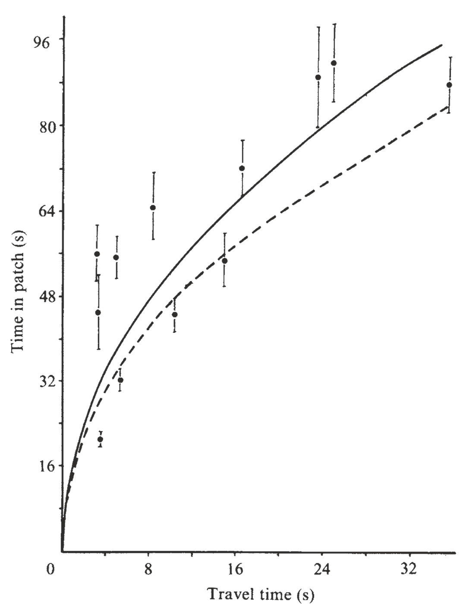
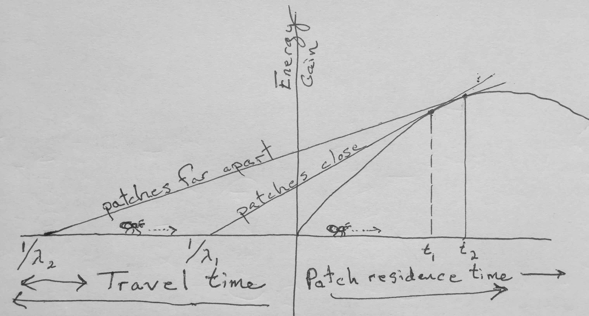

```{r include=FALSE}
knitr::opts_chunk$set(echo = TRUE, results='markup', warning=FALSE,
                      fig.path = "figs/", knitr.graphics.auto_pdf = TRUE,
                      message=FALSE, out.width="90%")
library(primer)
library(deSolve)
library(latticeExtra)
library(tidyverse)
theme_set(theme_minimal() + 
theme(panel.grid.major = element_line(colour = "darkgrey"),
      panel.grid.minor = element_line(colour = "darkgrey")) ) 
theme(panel.grid.major = element_line(colour = "darkgrey"))
cbPalette <- c("#000000", "#E69F00", "#56B4E9", "#009E73", 
               "#F0E442", "#0072B2", "#D55E00", "#CC79A7")
library(diagram)
library(DiagrammeR)
library(DiagrammeRsvg)
library(knitr)
library(tufte)
library(reshape2)
library(data.table)
library(magrittr)
library(kableExtra)
library(rsvg)
library(igraph)
library(phaseR)

```

```{r include=FALSE}
# automatically create a bib database for R packages
knitr::write_bib(c(
  .packages(), 'bookdown', 'knitr', 'rmarkdown'
), 'packages.bib')
```


# Preface {-}

\paragraph{Goals and audience}
In spite of the presumptuous title, my goals for this book are modest. I wrote it as 


* the manual I wish I had in graduate school, and
* a primer for our graduate course in Population and Community Ecology at Miami University.^[Miami University is located in the Miami River valley in Oxford, Ohio, USA; the region is home to the Myaamia tribe that dwelled here prior to European occupation.]


It is my hope that readers can enjoy the \emph{ecological content} and ignore the R code, if they care to.  Toward this end, I tried to make the code easy to ignore, by either putting boxes around it, or simply concentrating code in some sections and keeping it out of other sections. 

It is also my hope that ecologists interested in learning R will have a rich yet gentle introduction to this amazing programming language. Toward that end, I have included some useful functions in an R package called \texttt{primer}. Like nearly all R packages, it is available through the R projects repositories, the CRAN mirrors. See the Appendix for an introduction to the R language.

I have a hard time learning something on my own, unless I can \emph{do} something with the material. Learning  ecology is no different, and I find that my students and I learn theory best when we write down formulae, manipulate them, and explore consequences of rearrangement. This typically starts with copying down, verbatim, an expression in a book or paper. Therefore, I encourage readers to take pencil to paper, and fingers to keyboard, and copy expressions they see in this book. After that, make sure that what I have done is correct by trying some of the same rearrangements and manipulations I have done. In addition, try things that aren't in the book --- have fun.

\paragraph{A pedagogical suggestion}
For centuries, musicians and composers have learned their craft in part by \emph{copying by hand} to works of others. Physical embodiment of the musical notes and their sequences helped them learn composition. I have it on great authority that most theoreticians (and other mathematicians) do the same thing --- they start by copying down mathematical expressions. This physical process helps get the content under their skin and through their skull. I encourage you to do the same. Whether otherwise indicated or not, let the first assigned problem at the end of each chapter be to copy down, with a pencil and paper, the mathematical expression presented in that chapter. In my own self-guided learning, I have often taken this simple activity for granted and have discounted its value --- to my own detriment. I am not surprised how often students also take this activity for granted, and similarly suffer the consequences. \emph{Seeing} the logic of something is not always enough --- sometimes we have to actually \emph{recreate} the logic for ourselves.

Using a text editor (such as the simple one in the R GUI) is one of the huge benefits of using R. Using a text editor to write code and to make extensive comments to yourself (and others!) makes R \emph{truly} interactive. You interact with yourself by putting your thoughts on (virtual) paper, highlighting concepts and details you learn along the way, and documenting clearly what it is you have done. The code and the comments are two halves of the whole. Your comments also allow you to interact with others in a very complete way. You cannot realistically and reliably interact with others unless you put something in writing. If you use an application that is a pure GUI, you would have to describe the buttons you click and be absolutely certain that you leave nothing out and that you can actually communicate what you did. By writing and commenting code, you can send your scripts to anyone (your students, employees, boss, regulatory agency, collaborators\ldots). 

\paragraph{Comparison to other texts}
It may be useful to compare this book to others of a similar ilk. This book bears its closest similarities to two other wonderful primers: Gotelli's \emph{A Primer of Ecology}, and Roughgarden's \emph{Primer of Theoretical Ecology}. I am more familiar with these books than any other introductory texts, and I  am greatly indebted to these authors for their contributions to my education and the discipline as a whole. 

My book, geared toward graduate students, includes more advanced material than Gotelli's primer, but most of the ecological topics are similar. I attempt to start in the same place (e.g., ``What is geometric growth?''), but I develop many of the ideas much further. Unlike Gotelli, I do not cover life tables at all, but rather, I devote an entire chapter to \emph{demographic matrix models}. I include a chapter on community structure and diversity, including \emph{multivariate distances}, \emph{species-abundance distributions}, \emph{species-area relations}, and \emph{island biogeography}, as well as \emph{diversity partitioning}. My book also includes code to implement most of the ideas, whereas Gotelli's primer does not.

This book also differs from Roughgarden's primer, in that I use the Open Source R programming language, rather than Matlab\textregistered, and I do not cover physiology or evolution. My philosphical approach is similar, however, as I tend to ``talk'' to the reader, and we fall down the rabbit hole together\footnote{From \emph{Alice's Adventures in Wonderland} (1865), L. Carroll (C. L. Dodgson).}.

Aside from Gotelli and Roughgarden's books, this book bears similarity in content to several other wonderful introductions to mathematical ecology or biology. I could have cited repeatedly (and in some places did so) the following: Ellner and Guckenheimer (2006), Gurney and Nisbet (1998), Kingsland (1985), MacArthur (1972), Magurran (2004), May (2001), Morin (1999), Otto and Day (2006),  and Vandermeer and Goldberg (2007). Still others exist, but I have not yet had the good fortune to dig too deeply into them.

\paragraph{Acknowledgements}
I am indebted to Scott Meiners and his colleagues for their generous sharing of data, metadata, and statistical summaries from the Buell-Small Succession Study (http://www.ecostudies.org/bss/), a 50$+$ year study of secondary succession (supported in part by NSF grant DEB-0424605) in the North American temperate deciduous forest biome. I would like to thank Stephen Ellner for Ross's Bombay death data and for R code and insight over the past few years.  I am also indebted to Tom Crist and his colleagues for sharing some of their moth data (work supported by The Nature Conservancy Ecosystem Research Program
NSF DEB-0235369).

I am grateful for the generosity of early reviewers and readers, each of whom has contributed much to the quality of this work: Jeremy Ash, Tom Crist, David Gorchov, Raphael Herrera-Herrera, Thomas Petzoldt, James Vonesh, as well as several anonymous reviewers, and the students of our Population and Community Ecology class. I am also grateful for the many conversations and emails shared with four wonderful mathematicians and theoreticians: Jayanth Banavar, Ben bolker, Stephen Ellner, Amit Shukla, and Steve Wright --- I never have a conversation with these people without learning something. I have been particularly fortunate to have team-taught Population and Community Ecology at Miami University with two wonderful scientists and educators, Davd Gorchov and Thomas Crist. Only with this experience, of working closely with these colleagues, have I been able to attempt this book. It should go without saying, but I will emphasis, that the mistakes in this book are mine, and there would be many more but for the sharp eyes and insightful minds of many other people.

I am also deeply indebted to the R Core Development Team for creating, maintaining and pushing forward the R programming language and environment \cite{R2009}. Like the air I breathe, I cannot imagine my (professional) life without it. I would especially like to thank Friedrich Leisch for the development of \texttt{Sweave}, which makes literate programming easy \cite{Leisch:2002sw}. Because I rely on Aquamacs, ESS, \LaTeX, and a host of other Open Source programs, I am deeply grateful to those who create and distribute these amazing tools.

A few other R packages bear special mention. First, Ben Bolker's text \cite{Bolker:2008rr} and packages for modeling ecological data (\texttt{bbmle} and \texttt{emdbook}) are broadly applicable. Second, Thomas Petzoldt's and Karsten Rinke's \texttt{simecol} package provides a general computational architecture for ecological models, and implements many wonderful examples \cite{Petzoldt:2007jo}. Much of what is done in this primer (especially in chapters 1, 3--6, 8) can be done with \texttt{simecol}, and sometimes done better. Third, Robin Hankin's \texttt{untb} package is an excellent resource for exploring ecological neutral theory (chapter 10) \cite{Hankin:2007zm}. Last, I re    lied heavily on the \texttt{deSolve} \cite{Soetaert:mw} and \texttt{vegan} packages \cite{Oksanen:2008}.

Last, and most importantly, I would like to thank those to whom this book is dedicated, whose love and senses of humor make it all worthwhile.

# References

<!--chapter:end:index.Rmd-->

# Theory in Ecology {#theory}

In this chapter, we introduce a perspective on ecological theory, and provide an example of an efficient theory, metabolic scaling. 

*Scientific theory* is a body of knowledge that provides an organized and mechanistic view of how the world works [@Scheiner2010]. Theories concerning gravity, general relativity, and evolution by natural selection provide structured ways of connecting observations, patterns, and processes that  provide insight into why the world is the way it is. This stands in stark contrast to the colloquial use of *theory* that implies a lack of knowledge, as when someone says "oh, that's just a theory", referring to a guess without much evidence. Scientific theory is a set of explanations whose validity has been tested repeatedly by experiments and new data.


## Examples of theories

Ecology has lots of theories, of all different types. Below I discuss some which may be prevalent, important, useful, or some combination.

### Hierarchy theory

An early and persistent organizing theory in ecology is based on *hierarchy theory* [@ONeill1986; @Rose2017, and references therein]. It posits that ecological systems are structured *hierachically*, such that each entity comprises subunits. For instance, an entity such as a population of big bluestem grass (*Andropogon gerardii*) is part of a larger ecology community of many species. The population of big bluestem comprises subpopulations separated in space, a subpopulation comprises separate individuals, that each individual comprises multiple ramets and a set of organ systems and tissues, which comprise different cell types. This theory posits that each entity gives rise to emergent properties to the hierarchical level above it, and influences processes within each smaller sub-entity in the hierachical level below it. As a disciplinary organizing principle, this approach structures nearly all of the ecology curriculum.

Hierarchy theory gets more complicated when the levels of a hierarchy start to include fundamentally different types of entities. The big bluestem hierarchy above included only biotic components--a individual is part of a population which is part of a community of individuals of multiple species, and is made up of organ systems and tissues. Ecology, however, includes both the biotic and the abiotic parts of environments. An ecosystem includes a community of species, but also the nutrients, water, light, and other abiotic components, along with the spatial arrangement of all of these things. 

Different hierarchies are useful for different questions. An individual organism can play very different roles in different hierarchies. Consider and individual bunch grass. To understand how a population evolves, we need to count individuals within a population, because evolutionary fitness is tracked by the number of independent reproductive units. In contrast, to understand competitive interactions, it may be much more important to weigh the biomass of groups of individuals in a population, because biomass is more closely related of resource uptake.  

### A general theory of ecology

Good scientific theories exist within a hierarchy of disciplinary knowledge [@Scheiner2011]. They explain phenomena within a *domain* of knowledge which is organized around *principles* and *assumptions*. Scheiner and Willig posit a theory of biology that explains phenomena relating to the "diversity and complexity of living systems". One of the ten principles on which this theory depends is that "the cell is the fundamental unit of life". Subsumed within their theory of biology is the theory of cells whose domain is "cells and the causes of their structure, function, and variation." This theory in turn is based on principles and has theories to organize our understanding of cells and what cells do. 

*Models* are specific and explicit manifestations of more general theories. In this book, we focus on popular mathematical models that are specific manifestions of theories of ecology. 

@Scheiner2011 propose a theory of ecology, some of which we cover in this book. Here is part of this theory:

**The General Theory of Ecology**

**Domain:** The spatial and temporal pattern of the distribution and abundance of organisms, including causes and consequences.

**Principles:**

1. Organisms are distributed in space and time in a heterogeneous manner.
2. Organisms interact with their abiotic and biotic environments.
3. Variation in the characteristics of organisms results in heterogeneity of ecological patterns and processes.
4. The distributions of organisms and their interactions depend on contingencies.
5. Environmental conditions as perceived by organisms are heterogeneous in space and time.
6. Resources as perceived by organisms are finite and heterogeneous in space and time.
7. Birth and death rates are a consequence of interactions with the abiotic and biotic environment.
8. The ecological properties of species are the result of evolution.

These principles constitute what we know is true about ecological systems.  Some of these principles provide the focus for a single chapter while other principles apply broadly to many chapters in this book. 

`r newthought('Here is my own perspective')` on a general theory of ecology:

*Domain:* The house of life^["ecology" derives from the Greek "oikos" which means the rules of the house]: its constituent entities, causes, and consequences.

*Principles:* 
  
1. Entities^[An entity may be an ecosystem, a community, a population, an individual, or some other system with operationally defined boundaries.] are open systems with inputs and outputs.
2. Entities have internal complexity.
3. Entities include self-replicating components (living elements).
4. Entities interact via inputs, outputs, and behavior.
5. Rates of change, including inputs and outputs, are influenced directly by physical factors: space, temperature, and concentration.

You will see elements of these principles throughout this book as well.


### Efficient theory

@Marquet2014 argue that the best theories are those which are *efficient*. Such theories tend to be *based on first principles*, which are observations and laws that are fundamental assumptions in a scientific domain. In biology, such principles can include the laws of thermodynamics, and mathematical properties such as the central limit theorem. Theories built upon first principles are thus well-grounded in reality as we understand it and lead logically to refinements. Marquet and his colleagues also claim that efficient theory is *expressed in mathematics*. Mathematics is a universal language that is unamibiguous. It forces us to be as clear as possible about what we mean when we state a theory.^[$E=mc^2$ - need I say more?] Last, efficient theories are those that make a *large number of predictions using only a small number of free parameters*.^[Variables are quantities we measure and which change through time (e.g., population size). *Parameters* are (usually) fixed constants that govern the rates of change of variables (e.g., per capita birth rate).]  Examples of efficient theories we cover in this book include metabolic scaling, exponential growth, density dependence, and ecological neutral theory.

Marquet et al. and Scheiner and Willig emphasize slightly different features of the definition of "theory". Scheiner and Willig emphasize relatively broad ideas that are well-supported by experiments and repeated observation. Marquet and colleagues tend to mean something fairly specific and narrow, typically something that can be expressed mathematically. Scheiner and Willig might refer to such theory as constitutive theory or even simply a model. 

Next, I describe the Metabolic Theory of Ecology. This theory is based on first principles, and its central tenets are expressed mathematically. It's core equation has a very small number of free parameters (fitted constants) and makes a very large number of testable predictions. Parts of this theory are supported by a very large number of observations. It fits everyone's definition of theory.

## An example: Metabolic Theory of Ecology {#metabolic_scaling}

Metabolic rate is central to how rapidly individuals forage for, consume and use resources, reproduce and die. The *metabolic theory of ecology* [@Brown:2004wa] is a well-supported body of knowledge about the underlying mechanisms, and the resulting profound and wide-ranging consequences for populations and ecosystems. 

Body size and temperature are fundamental properties of organisms and the environment. The study of how body shape and body processes scale with body size is *allometry*. Because body size affects metabolic rate, body size indirectly helps determine population growth rates and how species interact with each other. Temperature affects how molecules vigorously molecules vibrate and move, and so increasing temperature tends to speed up chemical reactions. As metabolism is really just a complex network of biochemical reactions, temperature influences metabolic rate. 

The core of this theory is expressed in a simple mathematical equation that describes how body size and temperature govern metabolic rate.

### Body-size dependence

There is a profoundly simple and general rule describing the effect of interspecific variation in body size on metabolism.^[Metabolic rate may be measured by variables tied directly to metabolism, such as the rate of oxygen or energy consumption, or CO$_2$ production.] This biological law is referred to as the Kleiber law [@Kleiber1932], or *quarter power scaling* [@Brown:2004wa]. When we compare the basal  (i.e. resting) metabolic rates of different species, across a wide range of body sizes spanning many orders of magnitude, we find that

*whole-organism resting metabolic rate increases with organism mass raised to the three-quarter power*, or,

$$
B = aM^{z} \quad;\quad z = 3/4
$$

In this equation, $B$ is basal, or resting, metabolic rate, $M$ is body mass, $a$ is a proportionality constant, and $z$ is the *power law scaling coefficient*. The proportionality constant $a$ varies depending on the type of organism such as arthropods, fish, or mammals. Plants scale in the same manner  [@Niklas2001], although size or mass is a little trickier to measure. The scaling coefficient, $z$, is the seemingly magical constant that many have argued does not vary substantially among different types of organisms. 

Ecologists typically describe metabolism-mass relations and other power law behavior using logarithmic scales. When we do that, power law relations become linear. Using our rules for exponents and logarithms, metabolic scaling becomes
$$ \log B = \log a + z\log M$$
so that $\log B$ increases linearly with  $\log M$ with a slope of $3/4$. Our brains can process and compare linear relations much more easily than curvilinear ones. 

Here we plot the curvilinear relation in R using `curve()` in the `graphics` package of R that is included in the base installation as one of the core packages. The function `curve()` can plot any curve that be expressed as a function of `x`. Below, we draw a curve of a dotted 1:1 line for comparison, and then *add* the power function $x^{3/4}$.

```{r MTE34, fig.cap="Metabolic rate increases predictably with species body sizes.", echo=TRUE, fig.asp=.75, out.width="75%", echo=FALSE}
## using curve, let your variable be 'x'.
{par(mar=c(5,4,1,0), mgp=c(1.5,.4,0) ) # set figure margins in "lines"
curve(1*x, from = .01, 100, ylab = "Metabolic rate (B)",
      xlab="Body mass (M)", lty=3)
curve(x^(3/4), from = .01, to = 100, add=TRUE)
text(80, 90, "1:1"); text(80, 80^.8, expression(M^0.75))}
```
```{r MTE34b, eval=FALSE}
## using curve, let your variable be 'x'.
curve(1*x, from = .01, to=100, ylab = "Metabolic rate (B)",
      xlab="Body mass (M)", lty=3)
curve(x^(3/4), from = .01, to = 100, add=TRUE)
```

To help us grasp the implications of this, let's consider  *mass-specific* metabolic rates. "Mass-specific" means on a per-gram basis.^[With plants, we often measure something called "specific leaf area", SLA, which is the two dimensional area of a leaf divided by its mass.] Mass-specific metabolic rate is basal metabolic rate of an individual divided by its mass, or $B/M$. 

The mass-specific metabolic rate allows us to compare directly, for example, the metabolic rate of a cell in a shrew vs. a cell in an elephant. Which cell is burning fuel faster?

We can estimate this from the above metabolic scaling principle and the using rules exponents 
$$ \frac{B}{M} = a \frac{M^z}{M^1} = a M^{z-1} = aM^{-1/4}$$
From this, we now have the rule that

*mass-specific metabolic rate declines with organisms mass raised to the negative one quater power*

```{r MTE-MS, fig.cap="Mass-specific metabolic rate declines predictably with species body sizes.", echo=TRUE, out.width="75%"}
eq1 = function(M, a){a*M^-0.25} # create the function, F(M)
ggplot(data=data.frame(x=c(0.1, 100)), aes(x=x) ) + 
  stat_function(fun=eq1, geom="line", args=list(a=1)) + 
  xlab("Mass (M)") + ylab("Mass-specific metabolic rate (B/M)")
```

Over the years, there has been heated debate about (i) the precise value of the scaling coefficient $z$, and (ii) the underlying mechanism. Early arguments suggested that $z \approx 2/3$ because the rate heat dissipation scales with the amount surface area. Why $2/3$?

Let's envision the volume of an organism having three linear dimensions, so the volume scales to the cube of linear dimensions, while the surface area scales to the square of these linear dimensions,^[A linear relation is one in which $y$ is proportional to $x$, or $y \propto x$.]
$$V \propto L^3$$ 
$$A \propto L^2$$ 
The early explanation was that metabolic rate, $B$, scales linearly with area, 
$$B \propto A^1 \propto L^2$$.
With substitution we get, 
$$L^2 \propto V^z \propto (L^3)^z$$
implying that the exponents $2 = 3z$ or $z=2/3$, so we get,
$$B=V^{2/3}$$,
and, for the most part, mass scales linearly with volume for mammals or any other such group.

This early theory was because it started with first principles (heat dissipation and geometry) and resulted in the prediction of a single parameter. It could then be used to make predictions about how metabolic rate scales with body mass. Metabolic rate governs a huge amount of biology and ecology, including resource consumption rates, lifespan, and maximum population growth rates. Therefore, this theory and this model could be powerful tools for understanding the world and making testable predictions.

The above model is good because it could be tested. That is what has been done, and scientists found that there was a consistent mismatch between observations and the theory. Investigators showed that the value of the exponent appeared closer to 3/4 raher than 2/3. In the 1990s, a group including Jim Brown and Geoffrey West [@West1997] proposed an underlying mechanism that explained why it should be 3/4. They assumed that organisms must 

* distribute resources from a single source through a branching, fractal-like, space-filling network to all parts of the body,
* the size of the smallest branch ( a capillary) was the same for organisms of all sizes.
* the energy required to distribute the resources must be minimized, that less energy-efficient designs would be lost through natural selection. 

The prediction that resulted from these assumptions was that the exponent would be 3/4. This theory and model begin with different first principles and makes a different prediction. 

Soon Jayanth Banavar and his colleagues offered an alternative [@Banavar1999; @Banavar2002], arguing that the assumption of the fractal-like network was not correct, and in any event, was not necessary and did not apply to all organisms. They proposed different theory with less restrictive assumptions and found nonetheless that the exponent was also predicted to be 3/4. 

At the base of all these arguments is the geometry of the resource distribution system. All organisms take in limiting resources and have to distribute those resources to each part of each cell in the body. The key point is that *the larger the organism, the greater the portion of the resources are in transit at any instant in time*. This leads to an increasingly inefficient system, in which the metabolism of larger organisms has to run more slowly per unit resource: 

*Larger organisms can process more resources per unit time ($B=aM^{3/4}$), but do so less and less efficiently ($\frac{B}{M}=aM^{-1/4}$) due to resources in transport.*

Banavar, Brown and others eventually collaborated to address quarter power scaling in animals in particular which led to additional novel predictions [@Banavar2010].

This theory remains a fertile and active area of research [@Glazier2018]. The interested reader should be careful to distinguish between patterns observed across many species of very different sizes, versus patterns observed in a single species with individuals of different sizes versus other types of patterns. Subtly different patterns may be driven be very different mechanisms.


### Temperature dependence
In addition to body size, temperature plays the other key role in regulating metabolic rate. The Arrhenius equation connects the macroscopic property of temperature to the kinetic energy of molecules and the rates they govern. Metabolic rate is proportional to these rate determining processes, 
$$B  = a e^{\frac{-E_a}{kT}}$$
where $a$ is just a constant,  $e$ is the exponential, $E_a$ is the average activation energy of rate-limiting enzymes (units, eV), $k$ is Boltzmann's constant (units eV$\,$K$^{-1}$), and $T$ (units deg K). Bolztmann's constant ($\backsim 8.6 \times 10^-5$$\,$eV$\,$K$^{-1}$) converts the macroscopic property of temperature to kinetic energy of molecules. 

Individual biochemical reactions combine to determine basal metabolic rate, so @Gillooly2000 have taken this as a foundation for the metabolic theory of ecology [@Brown:2004wa]. In 2000, they suggested that the average activation energy is approximately $E_a = 0.23\,$eV . Subsequent work has described this as "temperature sensitivity", where larger numbers imply that organisms respond more strongly to temperature variation. 

The Arrhenius equation is a little more complicated that a simple power law, but not too much. Over the range of biologically relevant temperatures, it is dominated by a largely exponential increase in metabolic rate with increasing temperature (Fig @\ref(fig:arrh)). 
```{r arrh, echo=TRUE, fig.cap='The effect of body temperature on ectothermic metabolic rates can be approximated with the Arrhenius function, $B = a e^{-E_a/(kT)}$. Here $a = 10^4$, and $E_a = 0.23$. It is similar in shape to a power law with z > 1, over the range of biologically relevant temperatures.', fig.asp=.75, out.width="75%"}
# with base R
# base R: curve(10^4*exp(-0.23/(8.5 * 10^-5 *x)), 276, 316), ylab="B", xlab='T')
# or ggplot2
# the function, with default parameter values
eq.t <- function(t,a=10^4,E=0.23,k=8.6 * 10^-5){a*exp(-E/(k*t))}
# the data used in our function
temps <- data.frame(t=276:316)
ggplot(data=temps, aes(x=t)) + 
# set the basic properties of the plot
  stat_function(fun=eq.t, geom="line") + 
# set the function to plot
  xlab("Temperature (K)") + ylab("Metabolic rate (B)")  
# add labels
```

When we linearize the relation between metabolic rate and temperature, we get 
$$
\begin{aligned}
B &= a e^{\frac{-E_a}{kT}}\\
\log(B) &= \log{a} - E_a\frac{1}{kT}\\
\end{aligned}
$$
where the dependent variable is $1/(kT)$, $-E_a$ is the slope, and $\log a$ is the intercept. Thus, the negative slope of this relation describes theoretical prediction for the effect of temperature on metabolic rate. 

**So, there you have it.** The metabolic theory ecology is the algebraic product of body size- and temperature-dependence:
$$B = a M^{3/4} e^{\frac{-E_a}{kT}}$$
This theory makes quantitative predictions regarding all kinds of ecology phenomena [@Brown:2004wa], including

* home range size
* population growth
* population size
* resource uptake 
* predation and other species interactions, and
* ecosystem cycling.

Note that these relations are based on first principles of geometry and thermodynamics, and that they depend on only a small number of parameters ($a$, $-E_a$, and perhaps $z=3/4$), and makes a tremendous number of predictions. Therefore, @Marquet2014 propose that this is "good" theory, and very *efficient*.

## Power law scaling implies constant relative differences

In power law scaling, relative change is constant. That is, a proportional change in one variable results in a proportional change in the other. For instance, when we compare a smaller species to a larger species with $100 \times$ the body mass, we can expect to see metabolic rate increase by $31.6 \times$, *regardless of the mass of the smaller species.* For now, we will verify this numerically for some limited cases.
```{r}
# define body mass and metabolic rate
m <- c(.01, 1, 100, 10000)
b <- m^.75
```

Now we will divide each mass $i$ by the next smallest mass $i-1$. We do that using a vector by dividing each mass except the first one, by each mass except the last one.
```{r, echo=TRUE, eval=FALSE}
# round(x, digits=0) rounds number to zero decimal places
round( m[-1]/m[-length(m)], digits = 0)
round( b[-1]/b[-length(b)], digits = 1)
```

When we do these divisions, we see the constant relative change (\@ref(tab:relativemb)).
```{r relativemb, echo=FALSE}
df <- round(rbind(Mass=m, Basal.metabolic.rate=b,
  Relative.change.m=c(NA, m[-1]/m[-length(m)]),
      relative.change.b=c(NA,b[-1]/b[-length(b)] )), 2 )
colnames(df) <- c( "Small", "Med.", "Big", "Huge")
knitr::kable(df, booktabs = TRUE,
  caption = 'As we increase mass by a constant multiplier (10x), power law scaling results in a constant proportional change in basal metabolc rate.'
)
```

We can verify this generally using algebra, not just in the particular case above. We will show that if mass increases by a constant multiplier, metabolic rate will also, regardless of the particular masses involved.

Let mass $m_2$ be greater than mass $m_1$ by a factor of $c$, so that $m_2 = c m_1$, and
$$\frac{m_2}{m_1} = c$$.

We would like to show that the ratio of the metabolic rates $b_2 / b_1$ is also a constant. Since $m_2 = cm_1$, we can say that
$$b_1 = a m_1^{3/4}$$
$$b_2 = a (cm_1)^{3/4} = ac^{3/4}m_1^{3/4}$$
$$\frac{b_2}{b_1} = \frac{ac^{3/4}m_1^{3/4}}{am_1^{3/4}}$$
When we reduce this fraction, we a left with 
$$\frac{b_2}{b_1} = c^{3/4}$$

This shows that with power law scaling, increasing $x$ by a constant *multipier* (or proportion), $y$ increases by the same proportion raised to that power.

Let's represent this graphically in a couple of ways, reusing data we made up previously in this chapter. First, we just change the axes themselves, so that the units of the scales are multiples of 10 (often in scientific notation).
```{r logscale, fig.cap="changing the scales of the axes to linearize power law relations. Note scales are logarithmic, using the original linear values.", fig.show='hold', out.width="50%", fig.asp=1}
# using base R
par(mar=c(5,4,0,0), mgp=c(1.5,.4,0) )# set figure margins in "lines"
curve(x^(3/4), from = .01, to = 100, log="xy", ylab="Basal metabolic rate", xlab="Mass")
text(10, 80^.7, expression(M^0.75))
```

<!--chapter:end:01-theory.Rmd-->

# Optimal Foraging {#oft}
```{r cowie, fig.cap="Optimal foraging theory (OFT) generates testable quantitative predictions that allow a less ambiguous description and explanation for observed patterns and processes. Here, a simplistic model of Great Tit (Parus major) foraging that includes only gross energy intake underestimates the time spent in patches (dashed). In contrast, a model that includes energetic costs of traveling and searching matches predictions far better (solid).  From Cowie (1977).", out.width="75%", echo=FALSE}

```
It can be useful to think of natural selection as an optimizing process: phenotypes diversify, winners replicate and losers don't, and the phenotypes of winners tend to get passed on to the replicants. Therefore, we often assume, as did Dr. Pangloss, that the species that exist now are the best of all possible species, that is, they are of optimal design. And like Dr. Pangloss, we would be woefully mistaken if we stopped there. Nonetheless, optimization, that is, the tendency toward an optimum, helps us generate testable hypotheses and we consider some of these below.

Optimal Foraging Theory (OFT) helps us consider what organisms would do *if they foraged optimally.* All organisms--plants, fungi, archaea, and even animals--forage, and they are all subject to natural selection. Therefore, their phenotypes work pretty well, but probably not optimally and definitely not optimally for all times and places. Nonetheless, OFT is an efficient theory about the behavior of an organism, in the absence of other complications. Therefore, it allows us to study the relative importance of those "other complications."

Foraging is a key link between the individual, and communities and ecosystems [@Beckerman2010]. All organisms interact with their environment via consumption, and the choices they make influence population dynamics, species interactions, nutrient cycling, and even the physical structures of terrestrial and aquatic habitats. The text and logic of this chapter rely heavily on @Stephens1986 and @Ellner2009.

In Scheiner and Willig's edited volume on *The Theory of Ecology*, Andy Sih [@Sih2011] proposes that the following propositions form the basis of foraging theory:

1. Foraging patterns maximize fitness or a correlate of fitness. 
2. Foraging patterns depend on the range of options available to the forager and on how each available option affects fitness or a correlate of fitness.
3. Foraging behaviour balances conflicting demands--tradeoffs are important in shaping foraging behaviour.

These properties are the outcome of natural selection operating on foraging behavior. Our understanding of foraging itself considers these three features [@Stephens1986]:

* currency (what is being optimized),
* constraints (features of behaviour that limit optimality), and
* the resulting decision rules.

*Currency* is that quantity that is optimized by the forager. This currency is assumed to be a quantity that limits fitness, such as energy or a particular consumable resource. We measure it as a rate, for instance, as the energy gained per unit time (E/T) or the uptake of a critically limiting resource per unit time (R/T).

*Constraints* are limitations that we assume about organisms. These might include distances between resource patches, the time and costs associated with extracting a resource from a substrate or subduing prey. They also include constraints imposed by other species including competitors and predators. Constraints can get complicated quickly; however, simple quantitative theory makes predictions against which we can evaluate more complicated assumptions.

*Decision rules* are what we ascribed to a forager's choices. A decision rule concern the probability of attacking prey if encountered, or when to leave one resource patch in order to search for another. 

An additional way to think about all this is *where, when, and what.* A great deal of effort has focused on understanding patch use: *where* foragers should explore for resources, and *when* they should give up and go in search of another patch [@Charnov1976b]. These are **patch use** models, and are based on economic models and the marginal value theorem. 

Another avenue of inquiry concerns *what* animals should eat. For instance, should they go after big prey that may be hard to catch and difficult to subdue, or just snack on what is easy? These are **prey models** or diet models, and attempt to explain why organisms consume *what* they do. 

*A note on "prey".* All organisms forage for resources. Plants extend branches toward the light, and proliferate leaves and roots into resource rich patches, and rhizomes grow longer faster through resource-poor soils. Bumblebees search for and learn where to find nectar-rich flowers, and wolves hunt in packs to take down large ungulates. Some bacterivorous nanoflagellates intercept particles selectively depending on the perceived nutritional value of particles [@Boenigk2002]. So, depending on the forager, its "prey" may be $\mathrm{NO}_{3}^-$ ions, nectar, moose, or bacteria. Therefore, we will refer to these resources variously as prey, prey items, resources, and resource items. Some of these ideas are best handled with patch-based models [@Charnov1976b] where a "resource patch" is a more intuitive and useful unit.

*A note on "handle".* All organisms pays costs to consume resources. In OFT, "handle" typically means expending energy an time to attack and subdue prey (predators), proliferate into resource rich areas (plants), exude extra cellular enzymes (fungi); ingest the item(s), and then resume searching.

## A prey model

*...in which a forager asks, "should I eat this?"*^[whether "I" is a sugar maple tree or a human, most of us do not make this decision conciously...] 

Let's start where this field started, with a prey-centered model [@MacArthur1966; @Emlen1966]. 

\begin{itemize}
\item Currency - long-term energy gain per unit time, $G/T$.
\item Constraints
\begin{itemize}
    \item forager can consume only what it encounters.
    \item forager uses time and energy searching for items and handling items.
    \item if the forager chooses to pursue an item, searching stops and handling starts.
    \end{itemize}
\item Decision rules - the probability that a forager pauses from searching to handle an item.
\end{itemize}

The goal is to optimize the currency.

### Our intuition
```{r ant, echo=FALSE, fig.cap="The amount of energy, E (y-axis), that is lost and gained by a foraging ant--it may decline slowly over time (x-axis) while searching, and decline quickly while handling a food item. Our ant gains energy when it consumes an item. Below: Our ant. She expends energy while searching for food. Upon encountering a food item, she may choose to 'handle' it (encounters 1 and 3) and gain energy, or not handle it (encounter 2) and save the added cost of handling it.", out.width="100%" }
knitr::include_graphics("figs/foraging_ant2.jpg")
```

It seems reasonable that if a forager encounters food, it should eat it. However, if handling it costs more than the forager gets back in energy, then it isn't worth it. We might think of this as the ratio as *profitability*,
$$\frac{e_i}{h_i}$$
where $e_i$ is the energy in an item of type $i$, and $h_i$ is the cost of handling said item. If $e_i/h_i<1$, then it doesn't make sense to select the item. Further, handling an item means that the forager is *not* looking for a better food item. This suggests that even if $e_i/h_i>1$, a forager may not want to handle it if it is likely to soon encounter food items of higher energy content. On top of this, the act of searching may expose a forager to a risk of running into competing foragers, or even being eaten by a bigger forager. Clearly, a forager faces tradeoffs as it searches and when it encounters resources.

### Mathematical support
One of the reasons to represent ideas mathematically is that we make concrete assumptions, and then the math can tell us what the predictions are. That is what we will do here.

Let's assume that natural selection tends to maximize the currency as Gain per unit Time, $G/T$. Our model will use these parameters and variables:

* $i =$ index for prey type
* $S =$ total time spent **searching** (units = seconds, $s$).
* $\lambda_i =$ rate of encounter with prey of type $i$ (units = # encountered/s = $\#/s$; note this can also be #/area × area/s, if we like)^[A forager encounters prey at random, and this is known as a "Poisson process", where the number of encounters in a specified time interval is a random variable drawn from the Poisson probability distribution. It turns out that the *time between events* of a Poisson process follows the Exponential distribution. The Poisson distribution is determined by a single parameter, its mean. The Exponential distribution is also described by a single parameter, its *rate*. It turns out that we use the same $\lambda$ for both. }]
* $p_i =$ probability that a forager attacks prey if encountered (units are number handled per number encountered, or #/#; this is a dimensionless parameter)
* $h_i =$ handling time for an item of type $i$,  (units = s/#). 
* $T =$ **total** elapsed time (units = s)

From these definitions we can calculate other important quantities.

**Total number of items** encountered of type $i$ is 
$$S \lambda_i$$

The units are $s\, \#\,s^{-1} = \#$.

**Total number of type $i$ items handled** is the proportion, $p_i$, of those encountered that the foragers chooses to go after, or 
$$S\lambda_i p_i$$
The units are $\#$.

**Total time spent handling** all items of type $i$ is 
$$H=S\lambda_i p_i h_i$$ 
The units are $s$.^[We can check units for total handling time, $H = S\lambda_i p_i h_i$ by replacing the variables and parameters with their units. The units for $H$ are seconds, so we have $\mathrm{s = s \frac{\#}{s} \frac{\#}{\#} \frac{s}{\#}}$. When we multiply these fractions, we find that the $\#$s and two of the s's cancel out and we are left with $s=s$.]

**Total elapsed time** is time spent searching plus time spent handling, which is  
$$T=S + \sum_i^n S\lambda_i h_i p_i$$
where we use the summation to add together the total handling times for each prey or resource type $i = \{1,\,2, \ldots ,\,n\}$.

Let 

* $e_i =$ net energetic gain from catching and consuming a single type-i prey item (units = Joules, J). This includes the gross energy of the item minus handling costs plus energy not lost by searching during that time.
* $c =$ energy cost per unit of time while searching (units = J).

**Total energy gain** from eating all the items is the number of items of each type $i$ handled times the net amount of energy per item of type $i$, $e_i$, $$\sum_{i=1}^n S\lambda_i p_i e_i$$
where units are $\# (\mathrm{J}/ \#) = \mathrm{J}$.

Therefore, **rate** of energy intake (J/$s$) while handling and eating is 
$$\mathrm{intake} = \frac{\sum_{i=1}^n S\lambda_i p_i e_i}{S + \sum_{i=1}^n S\lambda_i h_i p_i}$$
If we then subtract the cost of searching, we arrive at the quantity we want to maximize, 
$$G/T=\frac{\sum_{i=1}^n \lambda_i p_i e_i}{1 + \sum_{i=1}^n \lambda_i p_i h_i}-c$$
A major question in OFT is whether a forager should include a particular prey type. Say we rank the prey types, $i=\{1,2,...,m,...,n\}$, in terms of energy content, where type $i=1$ has the most energy per item, $i=m$ is intermediate, and type $i=n$ has the least. *Which items should a forager include in her diet?* Should it be only the most energy-dense, or should it include the second as well, or should it be all of them? Part of the answer rests on the ratio of energy gain versus handling costs, or profitability, $e_i/h_i$.

If we maximized $G/T$ with respect to $p_j$, we would be able to determine whether to include item $j$. Doing so leads to several predictions.

**Prediction 1** *A less energy-dense item should be added if its net energy content is greater than the realized energy gain from all the other items,*

\begin{equation}
\frac{e_{m+1}}{h_{m+1}} > \frac{\sum_{i=1}^m \lambda_i e_i}{1 + \sum_{i=1}^{m} \lambda_i h_i} (\#eq:preypred1)
\end{equation}

where the diet already includes items 1-$m$, and the *realized* energy content of the diet takes into account average encounter rates of each item type. It means that a foraging will always select a particular type ($p_j =1$), or never select it ($p_j=0$); this is known as the "zero-one rule". 

**Prediction 2** Foragers will rank prey types by their profitability, $e/h$. 

**Prediction 3** When encounter rates increase (as with increasing abundances), selectivity increases. Note that encounter rates are in the right hand side, so as they increase, so will that fraction on the right. That will make it harder for the above inequality to be true, and a forager will be pickier. If you don't believe it, try this simplified version (Fig. \@ref(fig:selectivity)).

```{r selectivity, echo=TRUE, fig.cap="Selectivity increases with average encounter rates.", out.width="60%"}

G.T = function(lambda, h=1, e=1){lambda*e/(1+lambda*h)} # create the function you want
myData <- data.frame( lambda=c(0, 10) ) # data you need
ggplot(data=myData, aes(x=lambda)) + # set the basic properties of the plot
  # in the stat_function, we indicate the parameters in our equation.
  stat_function(fun=G.T, geom="line") +
  ylab(bquote(over(lambda*e, 1 + lambda*h))) + xlab(bquote(lambda))  # add labels
```

**Prediction 4** Inclusion of type $m+1$ in the diet does not depend on its encounter rate. Thus, a particular type should be included if the instantaneous net gain of that type is greater than the *realized long term average* net gain of all the more profitable types. Note that encounter rate appears on the right hand side, but not the left. 

So how does this model fair in the real world? Well, the zero-one rule doesn't work at all; it turns out that for a variety of reasons, foragers do not completely ignore low-profit prey. However, there is great support for the other predictions (above) [@Stephens1986]. Most importantly, in all cases, the theory has provided a clear framework to generate testable predictions from unambiguous assumptions, and that is what we want from efficient theory. The model itself helped guide research, and inclusion of greater complexity has led to deeper understanding of behavior and its consequences for species interactions.

## The patch model
*...in which omniscient rationale agents roam free.*

Here the forager asks, "how long should I stay here?" In the simple *prey* model, a forager searches for and then encounters prey one at a time, makes a decision to consume or not, and then resumes searching. In a simple *patch* model, a forager searches for and encounters patches one at a time, first consumes resources and then makes a decision to leave or not. Perhaps the single most important prediction of the simple patch model is that a forager should leave a patch when its current rate of energy gain drops down to the average or expected rate of energy gain for the habitat at large. 

In what follows, we rely on @Charnov1976b, who applies *the marginal-value theorem* to explain optimal behavior. Here, as in economics, "marginal value" refers to a rate - the slope of a function. In calculus, this is a derivative. Here, it is the derivative (i.e. slope) of the relation between energy gain and time.

Let's assume the simplest of all patch models: one patch type, all patches are the same, and they are distributed randomly in the habitat. Assume also that a forager uses time to travel between patches (travel time, $t_t$) and time searching within a patch (residence time, $t_r$). A forager encounters patches at random, with a rate of $\lambda$, and as such, would have a mean time to next encounter of $1/\lambda$. 

The patch is characterisized by its *gain function* $g(t_r)$ (Fig. \@ref(fig:gain)) which is the expected^["expected" value of a variable is the mean of that variable, because that is what we expect given the absence of other knowledge]
*cumulative net energy gained*, given time $t_r$ spent in the patch. The gain function is a cumulative total net amount. We can imagine different types of gain functions.
```{r gain, echo=FALSE, fig.cap="Net energy gain as a function of patch residence time may take different forms. Net energy gain increases through time but slows (decelerates) as a greater fraction of the resources in the patch are consumed. The top line (solid) assumes that there are diminishing returns as a patch is depleted, but the forager continues to find resources in excess of metabolic losses. The lower line (dashed) represents the net energy gain that could arise as a patch is depleted more fully and the costs continue unabated.", out.width='75%'}
eq1 <- function(tr) {.7 * tr/(.1+tr)}
eq2 <- function(tr) {-tr^2 + 1.5*tr}
df <- data.frame(tr=c(0,1) )
ggplot(df, aes(x = tr ) ) + 
  stat_function(fun=eq1, geom="line") + 
  stat_function(fun=eq2, geom="line", linetype="dashed") +
       ylab(expression("Energy intake, "*italic(g(t)))) + 
       xlab(expression("Residence time, "*italic(t[r])))
```

**Try this:**

1. Draw  a gain function where the prey remain well hidden at first, but the forager becomes increasingly able to find more and more prey. 
2. Draw a gain function where there is no cost to foraging, and where the forager eventually depletes all the prey. 
3. In one graph, draw two gain functions for a resource rich patch and for a resource poor patch.


So, our *currency* is long-term average energy intake, $R$, and we want to maximize this. The *decision* our forager needs to make is how long to stay in a patch. The forager's *constraints* share some similarity with the prey model [@Stephens1986]. 

* between-patch travel time and within-patch hunting time are distinct, and ...
* ... independent of each other,
* a forager encounters patches sequentially and randomly,
* in a given patch, net expected energy gain is a function of time spent in the patch...
* ...that is zero when $t=0$, and
* ...increases with time, but then decelerates
* the forager is omniscient - it knows everything about available patches and does not learn anything new as it forages (because it already knows everything).

The forager must decide how long to stay in the patch to maximize $R$. Let 
$$R=\frac{g(t_r)}{t_t + t_r}$$
where $t_t + t_r$ is the total time from leaving one patch, traveling to the next patch, foraging in the second patch, and then leaving the second patch. Think of this as benefit ($g(t)$) per unit time. This fraction is the slope of the straight line in Fig. \@ref(fig:marginal).

Intuitively, we can imagine that the long term average rate of energy gain $R$ is unimodal (hump-shaped) in the following scenario (Fig. \@ref(fig:gain)). Upon encountering a patch the forager has no resources and thus $R$ is actually negative due to the costs of traveling to the new patch. As $t_r$ passes and and the forager gains energy ($g(t_r)$ increases), $R$ will increase and become positive. An assumption of the theory (and reality) is that the gain function, $g(t_r)$, decelerates--the rate of energy intake declines as the patch is depleted. With increasing time in the patch and lower rate of energy intake, $R$ starts to decline. 

When $t_r$ is too short, $R$ is not yet maximizes. When $t_r$ is too long, $R$ begins to decline. Because $R$ is hump-shaped, we can use calculus to find its maximum. This will occur when its slope is zero, and the slope of a function, $F$, is its derivative, $F^\prime$. If we asssume that travel time is constant, then we can take the partial derivative of $R$ with respect to just the residence time, $t_r$, $\delta R / \delta t_r$. First, recall the product rule of differentiation: 
$$F(x) = g(x)f(x)\quad ; \quad F^\prime(x) =f^\prime(x)g(x) +  f(x)g^\prime(x)$$
With that we can find the necessary derivative.
$$\frac{\delta R}{\delta t_r} = - \frac{1}{(t_t+t_r)^2} g(t_r) + \frac{1}{t_t+t_r}g^\prime(t_r)= g^\prime(t_r) - \frac{g(t_r)}{t_t+t_r}=0$$
Because this derivative equals zero when the slope of the gain function ($g^\prime(t_r)$) equals $R$, that tells use that $R$ is maximized at that point. Therefore, it  predicts that in order to maximize the long-term average rate, we should stay in a patch until the instantaneous rate, $g^\prime(t_r)$ drops to the long term average rate, $R$ (Fig. \@ref(fig:marginal)).

```{r marginal, echo=FALSE, fig.cap="Energy gain vs. time: The origin is when the forager enters the patch; to the left is time spent traveling from one patch to the next, and to the right is time spent in the patch. The graph represents two different habitats, one in which the patches are easy to get to (habitat 1), and another where it takes more time to get from patch to patch (habitat 2). In all cases, the patches are identical, having the same gain function. The curved line is the gain function, the net energy gain as a function of time spent in the patch. The slope of that curve is the derivative of the gain function. Its slope at any single time point is the instantaneous rate of gain. The two straight lines are the expected gains averaged over time for each habitat as a whole. Lambda is the rate at which a forager randomly encounters patches - because it is a Poisson process, the mean or expected time is 1/lambda. The forager should leave the patch when the instantaneous rate of gain in the patch equals the long term average rate of gain for the habitat as a whole.", out.width="100%" }

```

The simple patch model predicts that when average travel time is greater, foragers will stay longer in a patch. Similarly, the model predicts that when patch quality is lower, foragers stay longer in each patch. Use Fig. \@ref(fig:marginal) to construct explanations for these predictions.

**Just a starting point**  

The simple prey and patch models have been extended a great deal to help understand a broad range of foraging situations [@Sih2011]. Simultaneous, rather than sequential, encounters can lead to different predictions. In these cases, energy alone, $e_i$, rather than profitability, $e_i/h_i$, may determine prey selection that maximizes the long term mean average rate. Travel time and encounter rates interact with this to explain contrasting situations. 

Central place foragers play by slightly different rules [@Stephens1986]. Central place foragers are located in a single location, and remain there. For instance, a parent bird (or dinosaur) finds patches and returns repeatedly to the nest, bringing one or multiple prey items. With parent birds, their fitness depends on offspring viability, and so selection tends to optimize in a manner similar to an organism foraging for themselves. These cases have been built upon patch models, where the question is how to exploit patches that exist at different distances from the nest. 

Another example of a central place forager is a spider that acts as a ambush or sit-and-wait predator who remains stationary until a prey item gets close enough to attack. One approach to the spider problem is to consider the distance to the prey as a handling cost and search costs are negligible.

These simple foraging models provide the starting points for a field of inquiry spanning many decades. The interplay between these models, the natural history of species, and experiments have led to greater appreciation of why organisms behave as they do, and the consequences for their evolution and the food webs and ecosystems in which they reside.

\newpage
## A simulation of a prey model
Next, we embark on a simulation of the simple prey model. We will start with these assumptions:

* two prey types, $i = {1,2}$
* ranked effective energy contents, $e_1 > e_2$
* equal handling times, $h_1=h_2=1$
* equal relative abundances, $r_1=r_2=0.5$
* encounter rates determined by an overall prey encounter rate, $\lambda$, and the relative abundances where $\lambda_i = \lambda r_i$.
* equal probability of attack if prey is encountered, $p_1=p_2=1$.
* search cost is constant, $c_s=0.01$

In addition to these properties, our simulation needs several bookkeeping parameters and variables in order to track the forager energy content. It will need to run for a finite amount of time; we'll control that with the total search time, `Total`. Remember that encounter rates are means but that actual encounters are random or stochastic. As a result, our forager may go through lean periods in which their net energy intake is negative.

We need to keep track of total elapsed time, and for each cycle, the search time, search cost, handling time, and energy gain.

```{r oft.sim, echo=TRUE}
optimal.forager <- function(
  e = c(2, 1), # energy content of the prey types
  h = c(.5, .5), # handling times
  r = c(.5, .5), # relative abundance of prey types: sum(r) = 1
  lambda = 0.4, # overal encounter rate, for all prey combined
  p = c(1,1), # prob. of attack if encountered
  cs = 0.4, # cost of searching per unit time
  Total = 10 # limit to foraging time
  ) {
###############
### begin foraging
ec <- NULL # an object to tally gains and costs.
cycle <- 0 # the cycle count (= search, choose and maybe attack and eat)
ct <- 0 # start time of the cyclesan object to tally cycle times.
elapsed.time <- 0 # total time spent foraging
while( elapsed.time < Total ) {
  # count which search cycle we're on
  (cycle <- cycle + 1)
  
  # a random amount of search time, t.s, until it finds something.
  (lambda.r <- lambda * r)
  (ts <- rexp(2, rate=lambda.r))
  if(ts[1] < ts[2]) i <- 1 else i <- 2
  i
  # cost of searching for that time
  (cost.s <- ts[i] * cs)

  # choose to attack the encountered item with probability p
  (gain <- if(p[i] > runif(1)){e[i]} else {0})
  
  # observed handling time 
  if(gain > 0 ){
    h.obs <- h[i]
    h.obs
  } else {
    h.obs <- 0
  }
   h.obs
 (cycle.time <- ts[i] + h.obs )
 ct <- c(ct, cycle.time)
 (elapsed.time <- elapsed.time + cycle.time)
 (ec <- c(ec, gain - cost.s))
}
df <- data.frame(net.e = ec, cycle.start = cumsum(ct[1:cycle]))
params <- list(e=e, h=h, r=r, lambda=lambda, p=p, cs=cs, Total=Total)
  out <- list(N = cycle, G = sum(ec), Tt = sum(ct), 
              series = df,
              params = params)
  return(out)
}

```

Here we let the forager forage for 60 minutes and then examine the structure of the output object. 
```{r echo=TRUE, keep.source=TRUE}
myOut <- optimal.forager(Total=60)
str(myOut)
```

* N is the number of foraging cycles
* G is net energy gain
* Tt is total elapsed time
* series is a dataframe with two variables: net.e is energy gain minus search costs for each cycle, and cycle.start is the elapsed time at which each cycle starts
* params is a list that includes all the parameters we used in this run

Now let's graph something, because graphs are fun.
```{r oft1, echo=TRUE, fig.cap="The cumulative energy capital of a forager goes down while searching and handling resource items, but increases each time the prey is assimilated."}

ggplot(myOut$series, aes(x=cycle.start, y=cumsum(net.e))) + geom_line() 

```

*Use this simulation* to help solidify in your own mind predictions of the simple prey model. How should we do that?


What is the prediction we are interested in?

Prediction: Include type 2 if
\begin{equation}
\frac{e_2}{h_2} > \frac{\lambda_1 e_1 }{1 + \lambda_1 h_1} (\#eq:prediction)
\end{equation}


```{r preypred, echo=FALSE, fig.cap="The right hand side of our prediction", fig.asp=.67, out.width="100%", fig.hold=TRUE}

par(mar=c(5,4,1,0), mgp=c(1.5,.4,0) ) # set figure margins in "lines"
layout(matrix(1:2, nr=1))
with(as.list(myOut$params),{
l1 <- lambda * r[1]
  curve(l1*x/(1 + l1*h[1]), 0, 20, xlab=bquote(e[1]),
      ylab=bquote( lambda[1]*e[1] / (1+lambda[1]*h[1])))
abline(h=e[2]/h[2], lty=2); text(0, e[2]/h[2], bquote(e[2]/h[2]), adj=c(0,-.1))
} )


with(as.list(myOut$params),{
l1 <- lambda * r[1]
  curve(x*e[1]/(1 + x*h[1]), 0, 20, xlab=bquote(lambda[1]),
      ylab=bquote( lambda*e[1] / (1+l1*h[1])))
abline(h=e[2]/h[2], lty=2); text(0, e[2]/h[2], bquote(e[2]/h[2]), adj=c(0,-.1))
} )

```
To get a sense of what our prediction \@ref(eq:prediction) means, we should graph the righthand quantity as a function of one relevant variable, such as energy content of type 1, or the encounter rate (Fig. \@ref(fig:preypred)).  The parameters that determined these curves are:
```{r echo=TRUE, results='verbatim'}
unlist( myOut$params )
```

### Lab exercise
1. Do these parameter values suggest that our forager should or should not include prey type 1 in her diet?
2. Create parameter combinations for which the forager (i) should and (ii) should not include prey type 2.
3. Use the simulation `optimal.forager()` to confirm your predictions.


```{r echo=FALSE, eval=FALSE}
# One possibility is that we can run the simulation with two prey types 
# setting e, h, and lambda to appropriate values. We then
# run it with both types ( p = (1,1) ) and then only type 1 (p=(1,0)) and
# then test whether G/T [both] is higher or lower than G/T [best only]

prey.test <- function(Total=100,...) {
  # run with both types
  both <- optimal.forager(p=c(1,1),...)
  # run with the better type only
  best <- optimal.forager(p=c(1,0),...)
  # Compare long term average energy gain as
  # both / best, where > 1 argues for including both
  (both$G/both$Tt) / (best$G/best$Tt)
}

reps <- replicate(5, prey.test(Total=10000, e=c(5,2), cs=.01) )
reps
# use summary to summarize your replicate simulations
```

<!--chapter:end:02-optimal_foraging.Rmd-->

# Simple density-independent growth {#expo}
```{r Melospiza1, echo=FALSE,  fig.cap="Song Sparrow (Melospiza melodia) counts in Darrtown, OH, USA. From  Sauer, J. R., J.E. Hines, and  J. Fallon. 2005. The North American Breeding Bird Survey, Results and Analysis 1966--2004. Version 2005.2. USGS Patuxent Wildlife Research Center, Laurel, MD.", out.width="70%"}
data(sparrows)
ggplot(data=sparrows[1:6,], aes(x=Year, y=Count)) + geom_line() + geom_point()
``` 
```{r Melospiza2, echo=FALSE,  fig.cap="Song Sparrow (Melospiza melodia) annual changes in population size as a function of population size.", out.width="70%"}
ssgr <- with(sparrows[1:6,], Count[2:6]/Count[1:5])
qplot(Count, ssgr, data=sparrows[1:5,], ylab=bquote(N[t+1]/N[t]), geom="point")
``` 


Between 1966 and 1971,\index{Song Sparrow} Song Sparrow (*Melospiza melodia*) abundance in Darrtown, OH, USA, seemed to increase very quickly, perhaps unimpeded by any particular factor (Fig. \@ref{fig:Melospiza1},  \@ref{fig:Melospiza2}). In an effort to manage this population, we may want to predict its future population size. We may also want to describe its growth rate and population size in terms of mechanisms that could influence its growth rate. We may want to compare its growth and relevant mechanisms to those of other Song Sparrow populations or to other passerine populations. To do this, we start with the simplest of all population phenomena, geometric and exponential growth.

Geometric and exponential growth are examples of *density-independent growth*. This captures the fundamental process of reproduction (e.g., making seeds or babies) results in a *geometric series*.^[A constatnt ratio between successive numbers.] For instance, one cell divides to make two, those two cells each divide to make four, and so on, where reproduction for each cell results in two cells, *regardless of how many other cells are in the population*---that is what we mean by *density-independent*. This myopically observed event of reproduction, whether one cell into two, or one plant producing many seeds, is the genesis of a geometric series. Therefore, most models of populations include this
fundamental process of geometric increase. Second, populations can grow in a density-independent fashion when resources are plentiful. It behooves us to start with this simple model because most, more complex population models include this process.

@Hastings2011 proposes that we can approach single species poulation growth from either a microscopic or macroscopic point of view. The microscopic approach begins with two propositions. The first is that if we know the location, timing, and traits of all individuals, we can predict perfectly population dynamics; the second is that we can never predict dynamics perfectly because  births and deaths are fundamentally random and can be described only with probabilities.^[A zen koan if there ever was one.] With this microscopic approach, we would seek a very detailed description of individuals and build a complex model to understand the consequences of the characteristics of all these interacting individuals, including the growth of the poppulation.

In this chapter, I choose to start with Hastings' macroscopic approach. These propositions appear simpler.

1. A population grows exponentially in the absence of other forces.
2. There are forces that can prevent a population from growing exponentially.

These are the consequences of the following assumptions.

a. all individuals in a population are identical.
b. there is no migration in or out of the population.
c1. the number of offspring per individual (or the per capita birth and death rates) are constant through time, and ...
c2. ... independent of the number of individuals in the population.

Deviations from these assumptions lead to all of the most interesting parts of single species population dynamics [@Hastings2011]. The only deviation we play with in this chapter concerns assumption c; we model stochastic variation in population growth rate to investigate extinction risk. It is also worth mentioning that, although propositions 1 and 2 follow from assumptions a-d, they are not strictly necessary [@Hastings2011]. For instance, individuals need not be identical, and we deal with a big exception in the next chapter where we introduce structured population growth. Also, migration is admissable, provided immigration = emigration and it does not alter growth rates. Nonetheless, other deviations from a. and b. can have very important consequences for single species population dynamics.


Here we define Density-independence^[No observed relation between $\frac{\Delta N}{N}$ vs. $N$] in a real population as a lack of a statistical relation between the density of a population, and its *per capita* growth rate. The power to detect a significant relation between any two continuous variables depends on those factors which govern statistical power, such as the number of observations, the range of the predictor variable, and the strength of the underlying relation. Therefore, our conclusion, that a particular population exhibits density-independent growth, may be trivial if our sample size is small, with few generations sampled, or if we sampled the population over a very narrow range of densities. Nonetheless, it behooves us to come back to this definition if, or when, we get caught up in the biology of a particular organism. 

In this chapter, we'll introduce density-independent population *projection*, *growth*, and *per capita growth*, for populations with synchronous reproduction (discrete models), and continuous reproduction (continuous models). 

## Discrete growth rates of fruit flies in my kitchen
Summertime, and the living is easy. Fruit flies in my kitchen, and their number's quite high. Flies love my ripe fruit, and my red wine. They drown in the wine--I am not sure if that is good or bad. 

For now, we'll treat fruit flies as if they grow in discrete generations. This is very common for populatilons that live in seasonal habitats - their reproduction is timed to the season, and they breed altogether in one bout.^[discrete generations are common in nature.]

I count the number of flies every week, and I find these numbers:
```{r flies, echo=TRUE, out.width="60%"}
t <- c(0, 1, 2, 3)
N <- c(2, 4, 8, 16)
qplot(x=t, y=N, geom=c("line", "point") )
```


There are several ways we can describe fruit fly population growth.  We begin by thinking about the proximate causes of change to population size per unit time: births, immigration, death and emigration (Fig. \@ref(fig:fliesi)). Those are the only options, and we state it thus:
$$\frac{\Delta N}{\Delta t} = \frac{B + I - D - E}{\Delta t}$$
that is, the pop growthe rate^[“Delta” N is the change in N.] is determined by the numbers of births, deaths, and migrants per unit time. 

Over the past month, I suspect the fruit flies are increasing primarily through reproduction in my kitchen. Clearly, at some point in the past, a fly or two (or three) must have immigrated into my kitchen, either as adults or as eggs or larvae in fruit I brought home ($I>0$). For now, I will assume fruit fly population dynamics in my kitchen are governed by only births and deaths ($I=E=0$), so, we have 
$$ \frac{N_{t+1} - N_t}{(t+1) - t}=\frac{\Delta N}{\Delta t}=\frac{B+D}{\Delta t}$$
In this equation, $t$ has a particular time unit, one week, so $t+1$ is one additional week. We refer to a population like this as *closed*, because it is closed to migration in or out.

```{r fliesi, echo=FALSE, fig.cap="The number of fruit flies in my kitchen depends on immigration and emigration, and births and deaths. In the text, we assume that immigration and emigration are zero. All rates are individuals per unit time.", out.width="100%", fig.width=5, fig.height=5}
nodes <- c("I", "F", "D", "E")
g1 <- graph( edges=c(1,2, 2,3, 2,2), n=3, directed=TRUE ) 
l <- cbind(c(-1, 0, 1), rep(0,3))
V(g1)$name <- c("pool", "F", "pool2")
V(g1)$size <- 50
V(g1)$shape <- c("none", "circle", "none")
E(g1)$label <- c("I", "E+D", "B")
 E(g1)$label.y <- c(.05, .05, .4 )
# E(g1)$label.y <- .5

plot(g1, layout=l, edge.loop.angle=3*pi/2, margin=c(0,0,0,0), rescale=FALSE, 
     main="Single species population model") 
```
I would like to represent births and deaths as proportions of existing adults.  that is, as
$$B = bN;\quad D=dN$$
This reflects the biological realities that adults produce offspring, and everyone has some chance of dying. The parameter $b$ could be any positive real number, $b \ge 0$. This model of births reflects the geometric property of reproduction: over a specified time interval $\Delta t$, an average parent makes $b$ babies. Parameter $d$ is any real number between zero and one, $0 \le d \le 1$. Both $b$ and $d$ have units of individuals per individual per unit time. They depend on that unit of time.

*What if offspring die before the next census?*

Fig. \@ref(fig:fliesi) helps us think about these things. Simplifying, we'll assume births occur first, and then death comes to offspring and adults.


Let's define a few terms.

* $N_0$, $N_1$ - the number of flies at the start and after the first time interval.
* $N^\prime$, $N^{\prime\prime}$ - distinct values of $N$, just after births.
* $\Delta N$ - the *change* in $N$ from one point in time to another.
* $t$ is time, so $\Delta t$ is the time interval over which $N$ may change.

Let's match these numbers to what is going on in my kitchen. For my first census count, $t=0$, I counted the adults and label that number $N_0$. These adults lay eggs which hatch, larvae and pupae develop, and become adults, giving us a population of $N^\prime = N_0 + bN$

Some of the eggs fail to hatch, and some of the larvae die
before maturing. Many of the adults die as well. If we assume the eggs,
larvae, and adults all die at the same rate, then by the end of one
generation we have $N_1 = dN^\prime = d(N_0 + bN)$. 

Substituting and multiplying we get
$$ N_1 = N_0 + bN_0 - d\left(N_0 + bN_0\right)$$

We see that by the next time point, $t=1$, the number of fruit flies
should be equal to the number we started with, $N_0$, plus the number
of new individuals, $bN_0$, minus the number of original adults that
die, $dN_0$, and minus the number of new individuals that die, $dbN_0$.

We can pull all of these parameters together,
$$ N_1 = N_0 + bN_0 - dN_0 - dbN_0 $$
$$ N_1 - N_0 =  N_0 \left(b - d - db\right)
= N_0 + r_dN_0 (\#eq:bddb)$$

where $r_d = b - d - db$. 

The *growth rate* of the population is $\Delta N / \Delta t$, or, at $t=0$, is
$$\frac{\Delta N}{\Delta t} = \frac{N_1 - N_0}{t_1-t_0} = \frac{(N_0 + r_dN_0) - N_0}{t_1-t_0} = r_d N_0 $$
If we generalize, we drop the zero, to get $r_dN$. The *per capita* population growth rate is $r_dN/N =r_d$). If our time step were something other than 1, we would also divide by $\Delta t$.

With the simple census data above, we can
estimate $r_d$ for the first time step.
$$N_1 = N_0 + r_dN_0=  2 + r_d (2) \implies r_d=1$$ 
If we know that $r_d$ is constant over time, we can infer a general rule to project the population forward in time an arbitrary number of time steps. We will let $\lambda = 1+r_d$.
$$N_1 = N_0 + r_dN_0 = N_0(1 + r_d) = N_0\lambda$$
$$N_2 = N_1\lambda=  (N_0 \lambda)\lambda$$
$$N_3 = N_2\lambda=  (N_0 \lambda)\lambda\lambda$$
or simply,
$$N_t = N_0\lambda^t$$

To summarize our model of discrete population growth, we have the following statements:

**Projection:**
$$N_t = N_0\lambda^t$$

**Population growth rate:**
$$\frac{\Delta N}{\Delta t} = r_dN; \quad \mathrm{where~} \lambda=1+r_d$$

**Per capita opulation growth rate:**
$$\frac{\Delta N}{N\Delta t} = r_d$$

At last, we see how this is a model of density-independent growth: per capita growth rate does not include $N$. 

## Fruit flies with continuous overlapping generations

In the reality that is my kitchen, individual fruit flies are having sex and reproducing on their own schedules. As a population, they breed continuously, so the cohorts re not synchronous. For populations like that, we need to describe instantaneous growth rates, where $\Delta t$ is no longer a fixed period of time, but is an instant, or infinity small.


We return to our example above (Fig. \@ref(fig:fliesi)), which we summarize in \@ref(eq:bddb). Please take a look at that equation; here we make time explicit so that it appears in the equation. We begin by remembering that $b$ and $d$ have time units. 

* Let $\Delta t$ be a small fraction of $t$, so that the time step goes from $t$ to $t + \Delta t$. 
* As $\Delta t \rightarrow 0$, $b$ and $d$ need to shrink as well, to $\Delta t  b$ and $\Delta t d$.
* $dN/dt$ is how we identify the differential equation that is the instantaneous rate of population growth, with lower case $d$ symbolizing infinitesimally small change.

We now have to solve for the limit of $\Delta N /\Delta t$ as $\Delta t$ goes to zero.
$$\frac{dN}{dt}=\lim_{\Delta t \rightarrow 0} \frac{N_{t+\Delta t} - N_t}{\Delta t} = \lim_{\Delta t \rightarrow 0} \frac{\Delta t\,bN_t - \Delta t \,dN_t - \Delta t\, d (\Delta t\, b)N_t}{\Delta t} $$
If we divide through by  $\Delta t$ and then let $\Delta t \rightarrow 0$, we get
$$\frac{dN}{dt}=\lim_{\Delta t \rightarrow 0} bN_t - dN_t - \Delta t\, d bN_t = bN_t - dN_t=rN$$


To arrive at the projection equation for a continuously growing population, we integrate $rN$ with respect to time. Integration is the cumulative summing of $y$ across a range of $x$. It even uses an exagerated "S" to indicate summation, $\int$. Here we integrate population growth across time. We start by rearranging
$$\frac{dN}{dt} = rN \Rightarrow \frac{dN}{N} = r dt$$

Now we integrate from $N$ and $r$ from $t=0$ to $t=t$,
$$\int_{N_0}^{N_t} \frac{1}{N}dN = \int_{0}^{t}rdt$$
$$\ln(N_t) - \ln(N_0) = rt - r\,0$$
$$\ln(N_t) = \ln(N_0) + rt$$
We now exponentiate ($e^x$) both sides to arrive at our projection equation.
$$N_t = e^{\ln(N_0) + rt} = N_0 e^{rt}$$

To summarize our model of continuous population growth, we have the following statements.

**Projection:**
$$N_t = N_0 e^{rt}$$

**Population growth rate:**
$$\frac{dN}{dt} = rN$$

**Per capita population growth rate:**
$$\frac{dN}{Ndt} = r$$
Once again, we see why we refer to exponential growth as density-independent: the per capita growth rate does not depend on $N$.

## Properties of geometric and exponential growth

Compare the projection equations for geometric and exponential growth. We find that 
$$\lambda = e^{r} \quad ; \quad \ln \lambda = r$$
This gives us a few useful rules of thumb. 

* No change: $r = 0\quad;\quad\lambda =1$
* Growing population: $r > 0 \quad;\quad \lambda > 1$
* Shrinking population: $r < 0 \quad;\quad \lambda < 1$
```{r echo=TRUE}
# Let r take on three values
r <- c( -1, 0, 1)
# Convert to lambda
exp(r)
```

*Time scaling* This is a useful property if we ever want to change time units in a discrete model. We must first $\lambda$ to $r$, change units in $r$ and convert back to $\lambda$. For instance, if we find that the annual finite rate of increase for a population of crickets is $\lambda = 1.2$, we cannot convert that to a monthly rate of $1.2/12 = 0.1$. Instead we convert to $r$ and back to $\lambda$.
```{r echo=TRUE}
lambda <- 1.2

# Convert lambda to r 
r <- log(lambda); r

# Scale r from year to month
r2 <- r/12; r2

# Convert back to lambda (per month)
lambda2 <- exp(r2); lambda2
```
This is very, very different than $\lambda/12$.


*Doubling time* Sometimes we gain a more intuitive grasp of an idea when we convert to a different form of the same relationship. Exponential growth is one of those ideas that can be hard to grasp. A more intuitive way to compare or express exponential grwoth rate is through *doubling time*, the time required for the population to double in size. For instance, a per capita growth rate of $r = 0.14\,\mathrm{inds}\cdot \mathrm{ind}^{-1} \mathrm{y}^{-1}$ means that the population will double in less than 5 years.

We determine this by letting $N_t = 2N_0$.
$$2N_0 = N_0 e^{rt}$$
$$\ln 2 = rt$$ 
$$t =\frac{\ln 2}{r}$$

```{r doubling, echo=TRUE, fig.cap="Doubling time is inversely related to the intrinsic rate of increase, r.", out.width="60%"}
# let r be a sequence from 
r <- c(0.01, 0.05, 0.1, 0.5)
#doubling time will be
log(2)/r

# and a picture
par(mgp=c(1.2, .2, 0), mar=c(2, 2, 1, 1), tcl=-.2)
curve( log(2)/x, xlab="r", ylab="Doubling time")
```

### Average growth rate
In any real data set, such as from a real population of fruit flies or Song Sparrows, $N_{t+1}/N_t$ will vary from year to year. How do we calculate an average growth rate for a fluctuating population? 

Let's consider the case where a population increases and then decreases. For each year, we will calculate the annual rate of increase $R = N_{t+1}/N_t$, and take the arithmetic average of those rates to see if it makes sense. 
```{r echo=TRUE}
N <- c(20, 30, 15, 15)
R <- N[2:4]/N[1:3]; R
```
The arithmetic average of those rates is $(1.5 + 0.5 + 1.0)/3=1.0$. If $R=1.0$, then, on average, the population should stay the same, but it decreased. Why is that?

Let us do the annual time steps explicitly to see what is going on.
$$N_3 = (N_0 R_0) R_1 R_2$$
```{r product1, echo=TRUE}
# Remember that we call the first time t=0 and N0, but
# when coding, these values are the first in a series, so 
# N0 is N[1]

# Now we do the annual changes which should equal N3
N[1]*R[1]*R[2]*R[3]
```
From this calculation, we see that when we start with $N_0=20$ and do the annaul steps, we wind up with a smaller population, even though the arithmetic average is $R_{\mathrm{ave}} = 1$. How do we calculate an average of numbers that we multiply together?

We want a number $\bar{R}$ such that 
$$\bar{R}^t = R_1R_2\ldots R_t$$

To find that, we simply solve for $\bar{R}$
$$(\bar{R}^t)^{1/t} =\bar{R} = \left(R_1R_2\ldots R_t\right)^{1/t}$$
We take the $t$-th root of the product of all the $R$. This is called the *geometric average.* Another way of writing this would be to use the product symbol, as in
$$\bar{R} = \left(\prod_{i=1}^t R_i\right)^{1/t}$$
```{r prod2, echo=TRUE}
R
#arithmetic average
mean(R)
# geometric average
t <- length(R); t
prod(R)^(1/t)
# shows the population should decline
```

Another way to do the same thing is to take the arithmethic mean of the log-growth rates, and back-transform,
```{r meanlog, echo=TRUE}
exp( mean( log(R) ) )
```

Now we see the effect of calculating the average growth rate correctly. This leads to a useful rule of thumb: *random variation in growth rate suppresses population growth.* Here we illustrate that. We start with a growing population.
```{r sim1, echo=TRUE}
lambda <- 1.01 # positive growth rate
N0 <- 100 # starting N
t <- 20 # 20 years
Nt1 <- N0*lambda^t; Nt1
```
Here $\lambda > 1$, so the population grows.

Now we do a simulation in which we let $\lambda$ have a mean of 1.01 but allow it to vary randomly.
```{r randomLambda, echo=TRUE, fig.cap="Random variation in growth rate alters the long term average growth rate."}
# create a vector to hold all N
N <- rep(0, t); N[1] <- N0

# create t-1 random lambdas with a mean of 1.01 
# ranging from 0.41 to 1.61
set.seed(3) # makes the radnom sequence repeatable
random.lambda <- runif(n=(t-1), min=0.41, max=1.61)

# the geometric mean
prod(random.lambda)^(1/length(random.lambda))

# actual simulated projection
for(i in 1:(t-1)) { 
  N[i+1] <- N[i] * random.lambda[i]
}

qplot(x=0:(t-1), N, geom=c("line", "point"), xlab="Time (y)")
```

Sometimes the arithmetic average is close to the correct average, but it is never the correct approach.


## Modeling with Data: Simulated Dynamics
Science strives to make predictions about about the behavior of systems.
 Ecologists and conservation biologists frequently strive to predict the fate of populations.  Here we  put into practice ideas about population biology to make informed predictions about the fate of the Song Sparrow population in Darrtown, OH. We also illustrate simple commputational methods for doing so.

The preceding sections (the bulk of the chapter) emphasized understanding the deterministic underpinnings of simple forms of density independent growth: geometric and exponential growth. This section explores the stochastic simulation of density independent growth. Our simulation makes most of the same assumptions we made at the beginning of the chapter. In addition, we assume that the observed annual growth rates ($N_{t+1}/N_t$) are representative of future growth rates, and that the growth rate in one year is entirely independent of any other year. 

To make meaning full projections of future population size, we should quantify  the uncertainty with our guess. Simulation is one way we can project populations and quantify the uncertainty. The way one often does that is to use the original data and sample it randomly to calculate model parameters. This way, the simulations are random, but based on our best available knowldge, i.e., the real data. The re-use of observed data occurs in many guises, and it is known often as bootstrapping or resampling.

### Data-based approaches
We could use the observed *changes* in population counts $R_t=N_{t+1}/N_t$ as our data. We would then draw an $R_t$ at random from among the many observed values, and project the population one year forward. We then repeat this into the future, say, for ten years. Each simulation of a ten year period will result in a different ten year trajectory because we draw $R_t$ at random from among the observed $R_t$. However, if we do many such simulations, we will have a *distribution* of outcomes that we can describe with simple statistics (e.g., median, mean, quantiles).

A different approach would be to estimate the individual probabilities of births and deaths in the entire Darrtown population, and use those probabilities and birth rates to simulate the entire population into the future. In such an *individual-based simulation*, we would simulate the fates of individuals, keeping track of all individual births and deaths. 

There are myriad other approaches, but these give you a taste of what might be possible. In this section we focus on the first of these alternatives, in which we use observed $R_t$ to simulate the dynamics of Song Sparrow counts. Do do so, in part, because we have those data, while we do not have any estimates of birth rates or death rates.

Here we investigate Song Sparrow (*Melospize melodia*) dynamics using data from the annual U.S. Breeding Bird Survey (http://www.mbr-pwrc.usgs.gov/ bbs/).  Below we will

1. create and examine visually the data (annual $R$'s),
2. simulate one projection,
3. scale up to multiple simulations,
4. simplify simulations and perform them 1000s of times, and
5. analyze the output.


### Creating and visualizing the data
Let's start by graphing the data^[I've come to abhor my use of the expression "look at"; I use it when I don't say what I mean. "Look at" can mean alomst anything these days, and it rarely means only "looking at"...]. *Graphing the data is always a good idea --- it is a principle of working with data*. We first load the data from the `primer` R package, and look at the names of the data frame. We then choose to `attach` the data frame, because it makes the code easier to read.^[Don't use `attach` for anything important]
```{r}
library(primer)
data(sparrows)
names(sparrows)
attach(sparrows)
```

Now we plot these counts through time (Fig. \@ref(fig:cts)).  
```{r cts, fig.cap="Observations of Song Sparrows in Darrtown, OH (http://www.mbr-pwrc.usgs.gov/bbs/).", out.width="75%"}
ggplot(data=sparrows, aes(x=Year, y=Count)) + geom_line() + geom_point(pch=1)
```

We see that Song Sparrow counts at this site (the DARRTOWN transect, OH, USA) fluctuated a fair bit between 1966 and 2003. They never were completely absent and never exceeded $\sim 120$ individuals.

Next we calculate annual $R_t=N_{t+1}/N_t$, that is, the observed growth rate for each year $t$.
```{r}
# the use of [-1[ in the index tells R to exclude the first element.
# length() is the length of a vector, so [-length(X)] means exclude the last
obs.R <- Count[-1]/Count[-length(Count)]
```
Thus our *data* are the observed $R_t$, not the counts *per se*. These $R$ form the basis of everything else we do. Because they are so important, let's plot these as well. Let's also indicate $R=1$ with a horizontal dotted line as a visual cue for zero population growth. Note that we exclude the last year because each $R_t$ is associated with $N_t$ rather than $N_{t+1}$. 
```{r Rrates, fig.cap="Annual growth rates (R=N[t+1]/N[t]) for Song Sparrows", out.width="75%"}
qplot(x=Year[-length(Count)], y=obs.R, geom="point") + geom_hline(yintercept=1, lty=3) + 
  labs(y=bquote(N[t+1]/N[t]), x="Year (t)")
```
One thing that emerges in our graphic data display (Fig. \@ref(fig:Rrates)) is we have an unusually high growth rate in the early 1990's, with the rest of the data clustered around 0.5--1.5. We may want to remember that.

### One simulation
Our simulation will,

1. determine the number of years we wish to simulate,
2. create an empty vector, `N`, to hold our simulated $N$, which is `years + 1` long,
3. draw a random sample of $R_t$, one for each year (`R`),
4. select a starting abundance $N_0$ and put it in `N[1]`.
5. multiply our first random $R$, `R[1]`, times `N[1]` to generate the next, `N[2]`.
6. repeat step 5 for each year to simulate each `N[t+1]` from `R[t]` and `N[t]`.


First, we decide how many years we want to simulate growth, and create an empty vector that will hold our data.
```{r}
years <- 10
N <-numeric(years+1) # rep(0,years+1) would do the same thing.
```
Our vector of $N$ has to be one longer than the number of $R$ we use. This is because each $R$ is sthe change *from one year to the next* and there will always be one more *next* than there is $R$.

Next we draw 10 $R$ at random with replacement. This is just like having all 35 observed $R$ written down on slips of paper and dropped into a paper bag. We then draw one slip of paper out of the bag, write the number down, and put the slip of paper back in the bag, and then repeat this 9 more times. This is *resampling with replacement*. In that case, we would be assuming that all of these $R_t$ are important and will occur at some point, but we just don't know when---they constitute the entire universe of possiblities. The R function *sample* will do this. 
[A random process occurs only in our imagination, or perhaps at the quantum level.^[Random, pseudorandom, and stochastic processes.] A stochastic process is one which we treat operationally as random while acknowledging that there are complex underlying deterministic drivers. A pseudorandom process is a completely deterministic and hidden process used by computers and their programmers to generate numbers that cannot be distinguished from random; we can repeat a pseudorandom process by stipulating a key hidden starting point.]

We can use `set.seed()` to make your pseudorandom process the same as mine, i.e., repeatable.
```{r}
set.seed(3)
# Draw a sample of our observed R with replacement, "years" times.
(rRs <- sample(x=obs.R, size=years, replace = TRUE))
```
Now that we have these 10 $R$, all we have to do is use them to generate the population sizes through time. For this, we need to use what programmers call a *for-loop*. In brief, a for-loop repeats a series of steps for a predetermined number of times. 


Let's start our simulated N with the sparrow count we had in the last year.
```{r}
N[1] <- Count[length(Count)]
```

Now we are ready to use the for-loop to project the population. For each year $t$, we multiply $N_t$ by the randomly selected $R_t$ to get $N_{t+1}$ and put it into the $t +1$ element of `N`. 
```{r forloop}
for( t in 1:years) { 
# starting with year = 1, and for each subsequent year, do... 
N[t+1] <- N[t] * rRs[t]
}
``` 
Let's graph the result.
```{r simten, fig.cap="A single simulated population projection."}
qplot(0:years, N, geom=c("point","line"))
```

It appears to work (Fig. \@ref(fig:simten)). Let's review what we have done. We

*had a bird count each year for 36 years. From this we calculated 35 $R$ (for all years except the very last).
* decided how many years we wanted to project the population (10\,y).
* drew at random and with replacement the observed $R$---one $R$ for each year we want to project forward.
* we created an empty vector and put in an initial value (the last year's real data).
* performed each year's calculation, and put it into the vector we made.


So what does Fig. \@ref(fig:simten) represent? It represents one possible outcome of a trajectory, if we assume that $R$ has an equal probability of being any of the observed $R_t$. This *particular* trajectory is very unlikely, because it would require one particular sequence of randomly selected $R$s. However,  it is *no less likely* than any other particular trajectory.

As only one realization of a set of randomly selected $R$, Fig. \@ref(fig:simten) tells us very little. What we need to do now is to replicate this process a very large number of times, and examine the *distribution* of outcomes, including moments of the distribution such as the mean, median, and confidence interval of eventual outcomes. 

### Multiple simulations
Now we create a way to perform the above simulation several times. There are a couple tricks we use to do this. We still want to start small so we can figure out the steps as we go. Here is what we would do next. 

1. We start by creating a function that will do the steps we did above.
2. We then do replicate independent simulations, using `replicate()`.


Here we write a function to combine several steps.
```{r}
myForLoop <- function(obs.R, years, initial.N) {
  # select all R at random
  rR <- sample(obs.R, size=years, replace=TRUE)
  # create a vector to hold N
  N <- numeric(years+1)
  # give it an initial population size
  N[1] <- initial.N
  # Do the for-loop
  for( t in 1:years ) {
    # project the population one time step
      N[t+1] <-  N[t] * rR[t]
  }
  # return the vector of N
  N
} 
# try it out with different hypothetical R
myForLoop(obs.R=0:3, years=5, initial.N=43)
```
Our function seems to work. Next we do ten such projection simulations, each for 50 time steps, using the sparrow data.
```{r tensim}
# specify the number of simulations and for how long
sims=10; years=50
set.seed(3)
outmat <- replicate(sims,   
                    expr=myForLoop(obs.R=obs.R, years=years, initial.N=43)
                    )
```
Now let's peek at the results (Fig. \@ref(fig:tensimfig)). It is fun to graph our output, but also helps us make sure we are not making a heinous mistake in our code. Note we use log scale to help us see the small populations.
```{r tensimfig, fig.cap="Using matplot() to plot a matrix vs. a single variable. Our simulated populations sometimes increase and sometimes decrease.", out.width="75%"}
matplot(0:years, outmat, type="l", log="y")
```

```{r tensimfig2, fig.cap="Using ggplot() to plot one variable against vs. a single variable, organized by a grouping variable. Our simulated populations sometimes increase and sometimes decrease.", out.width="75%"}
# combine columns years, and our output
junk <- data.frame(years = 1:(years+1), outmat)
names(junk)
# make sure to load 'tidyr' if you did not already load it or tidyverse
# library(tidyr)
# "gather" many columns into one (except years)
out.long <- gather(junk, key="Run", value="N", -years)
ggplot(data=out.long, aes(x=years, y=N, group=Run)) + geom_line() +  
  scale_y_log10() 

# Or for colorful lines
# ggplot(data=out.long, aes(x=years, y=N,  linetype=Run, colour=Run)) + 
#    geom_line(show.legend=FALSE) + scale_y_log10() 
```


What does it mean that the simulation has an approximately even distribution of final population sizes \emph{on the log scale} (Fig. \ref{fig:tensimfig2})? If we plotted it on a linear scale, what would it look like?^[Plotting it on the log scale reveals that the relative change is independent of population size; this is true because the rate of change is geometric. If we plotted it on a linear scale, we would see that many trajectories result in small counts, and only a few get really big. That is, the median size is pretty small, but a few populations get huge.}

Rerunning this simulation, with new $R$ each time, will show different dynamics every time, and that is the point of simulations. Simulations are a way to make a few key assumptions, and then leave the rest to chance. In that sense it is a null model of population dynamics.

###  A distribution of possible futures
Now we are in a position to make an informed prediction, given our assumptions. We will predict the range of possible outcomes and the most likely outcomes, given our set of assumptions. 

We will simulate the population for 50 years 10\,000 times and describe the distribution of final populatin sizes. We use `system.time` to tell me how long it takes on my computer.
```{r}
sims=1e4; years=50
set.seed(3)
## system.time keeps track of how long processes take.
system.time(
outmat <- replicate(sims,   
                    expr=myForLoop(obs.R=obs.R, years=years, initial.N=43)
                    )
            )
```
This tells me how long it took to complete 10\,000 simulations.  We also check the dimensions of the output, and they make sense.
```{r}
dim(outmat)
```
We see that we have an object that is the size we think it should be. We shall assume that everything worked way we think it should. 

### Analyzing results
We extract the last year of the simulations (last row), and summarize it with quartiles (0%, 25%, 50%, 75%, 100%, and also the mean).
```{r}
N.2053 <- outmat[51,]
summary(N.2053, digits=6)
```

```{r fig.cap="Distribution of the 10000 final base-10 log population sizes. Note the approximately Normal distribution.", out.width="75%"}
hist(log10(N.2053))
```

The `quantile()` function allows us to find a form of empirical confidence interval, including, approximately, the central 90% of the observations.^[Note that there are many ways to estimate quantiles (R has nine ways), but they are approximately similar to percentiles.]
```{r}
quantile(N.2053, prob=c(0.05, .95) )
```
These quantiles provide an estimate of the most likely range of possible populatin sizes, given our assumptions. 

### Inferring processes underlying growth rate
The above approach relies only on the observed data. That means that the growth rates, while representative, can never be different than what was observed. A different approaach would be to assume that the growth rates can be different than observed, *but drawn from the same underlying process* that caused the observed rates. 

The observed rates are simply a visible manifestation of unseen processes. We might summarize these by asserting that the observed growth rates were samples from a continuous distribution distribution, whose prperties we can infer from the sample. For instance, it may be that these processes cause annual rates to follow a Normal, or perhaps log-normal distribution. 

We can fit a Normal distribution to the logarithms of our observed $R$, and we see that it doesn't do too bad a job (Fig. \@ref(fig:fitln)).

```{r fitln, fig.cap="The logarithms of the observed R seem reasonably approximated by a Normal distribution whose mean and standard deviation are derived from the log-transformed data.", out.width="75%"}
mu <- mean( log(obs.R) )
sigma <- sd( log(obs.R) )

# a regular sequence for log-R
lR <- seq(-1, 1.1, by=0.01)
# the probability densities for the log-R
dR <- dnorm(lR, m=mu, sd=sigma)

hist(log(obs.R), breaks=10, prob=TRUE)
lines(lR, dR)
```

Now we will simulate populations just like before, but instead of random draws from the observed data, we do random draws from the inferred distribution.

Our new function.
```{r}
myForLoop2 <- function(mu, sigma, years, initial.N) {
  # select all R at random from 
  lrR <- rnorm(years, m=mu, sd=sigma)
  rR <- exp(lrR)
  # create a vector to hold N
  N <- numeric(years+1)
  # give it an initial population size
  N[1] <- initial.N
  # Do the for-loop
  for( t in 1:years ) {
    # project the population one time step
      N[t+1] <-  N[t] * rR[t]
  }
  # return the vector of N
  N
} 
```

Our new simulations.
```{r}
sims=1e4; years=50
set.seed(3)
outmat2 <- replicate(sims,   
                    expr=myForLoop2(mu=mu, sigma=sigma, years=years, initial.N=43)
                    )
N2.2053 <- outmat2[51,]
quantile(N2.2053, prob=c(0.05, .95) )
quantile(N.2053, prob=c(0.05, .95) )
```
The results are very similar to those based on only the observed $R$. If they were markedly different, we might ask whether our choice of distribution was appropriate.

Our conclusions are based on a model of discrete density-independent population growth

* what assumptions are we making and are they valid? 
* Are our unrealistic assumptions perhaps nonetheless a good approximation of reality? 
* what would you like to add next to make the model a better approximation? 

Perhaps we might explain some of the variation in annual growth rates to weather patterns in the breeding range (Darrtown, Ohio). If so, we might separate demographic effects vs. environmental effects. That would give us an even better model we could use for explanation and prediction.


\section{Summary}
In this chapter, we have explored the meaning of density-independent population growth. It is a statistically demonstrable phenomenon, wherein the per captia growth rate exhibits no relation with population density. It is a useful starting point for conceptualizing population growth. We have derived discrete geometric and continuous exponential growth and seen how they are related. We have caculated doubling times. We have discussed the assumptions that different people might make regarding these growth models. Last, we have used simulation to explore prediction and inference in a density-independent context.


<!--chapter:end:03-Expo-growth.Rmd-->

# Density-independent Demography {#DID}
In the preceding chapter, we listed Hastings' [@Hastings2011] key principles and assumptions of single species population growth. One of the key assumptions is that "all individuals in a population are identical." In this chapter, we elucidate an important violation of that assumption, population structure.


```{r human, echo=FALSE, fig.cap='Demography of human populations of Mexico and Sweden. Based on 1990 data from US Census Bureau, Population Division, International Programs Center.', out.width='30%', fig.show='hold'}
include_graphics(c("figs/AgeDistM.png","figs/AgeDistS.png","figs/AgeSpecFert.png"))
```


*Populations have structure.* Consider the human populations of Mexico and Sweden in 1990. Mexico had a much larger fraction of their population in child bearing age classes or younger (Fig. \@ref(fig:human)). In addition, the \index{age-specific fertility}age-specific fertility rate was higher in Mexico, especially for younger women
(Fig. \@ref(fig:human)). How did this happen, and why did Mexico have so
many young people? What were the consequences of this for their
culture, their use of resources, their domestic and foreign policies,
and their future population growth? How about Sweden? 

Demography is the study of populations with special attention to their structure [@Lincoln:1998ta]. Originally, age-based human demography was the provenance of actuaries who helped governments keep track of the number citizens of different ages and thus, for instance, know how many would be available for conscription into the military.^[In his chapter entitled ``Interesting Ways to Think about Death'' G.E. Hutchinson @Hutchinson1978 cites C.~F. Trenerry, E.~L. Gover and A.~S. Paul (*The Origins and Early History of Insurance*, London, P.~S. King \& Sons, Ltd.) for description of early Roman actuarial tables.]

*The reason we model the structure of populations* is because various demographic rates vary markedly with these stages. Juveniles produce no offspring. Very few seeds survive an entire year, whereas some large adults survive very well. We use structure when that structure is associated with important differences in demographic rates: *survival*, *fecundity*, and *growth*. 

The *structure* to which we refer is simply the organization of populations by some character such as life history stage, age, or size. Sizes and ages are often reduced to categories such as we saw in human populations (e.g., 0--4.9\,y, 5--9.9\,y,...). Sizes may be based on any reliable and repeatable measure that relates to demographic rates and are similarly binned. Life history stages may include eggs, larvae, metamorphs, juveniles, and adults in amphibians, or seeds, rosettes, and reproductive stems in herbaceous plants. With a variable such as size, we don't even need to use categories, but rather we can use size as a continuous variable; we address this briefly later in the chapter.

Structured population models allow us to intertwine species-specific natural history and quantitative methods. This makes the approach especially appealing for the conservation biology of threatened and endangered species. We use structured population models to improve our better understanding of a population or improve predictions of its future dynamics, or guide the management of the population. We might learn a lot about what controls the abundance
of a species if we can test ideas related to different stages, ages,
or sizes. What limits the population growth of the Western toad --
is it egg survival, or overwintering survival of juveniles? Where
should we invest our efforts to
control garlic mustard (*Alliaria petiolata*) -- killing the
first year
rosettes, or the second year adults? Why are cacti generally endangered [@Goettsch2015]---is the smallest size, or the largest size
that is most essential to insure long-term survival? We can use
structured population models to address such questions.

## A two stage matrix model

```{r toadlh, echo=FALSE, fig.cap='Like all amphibians, the Western toad (Anaxyrus boreas) has a complex life cycle, with several life history stages. Adults breed in early spring, laying eggs in water. The larvae (tadpoles) hatch and develop over the spring and summer, and then metamorphose (become metamorphs), and then juveniles. Juveniles require more than a year to mature. Adults can live up to about a decade. American toads (A. americanus) do the same thing.', out.width='65%', fig.show='hold'}
include_graphics("figs/VoneshF1.pdf")
```

A matrix model of a structured population consists of *stages* and *transitions*.  @Vonesh:2002fr used matrix projection to assess the importance of egg mortality for declines in amphibian populations. Their model of the Western toad (*Anaxyrus boreas*, Fig. \@ref(fig:toadlh)) comprises two stages (juveniles and adults) and four transitions. 

In all structured popuation models^[Models comprise stages and transitions.], a transition is the annual contribution of an individual in stage $i$ at time $t$ to stage $j$ at $t+1$. In Fig. \@ref(fig:toadlh), the transition from juvenile to adult is the probability that a juvenile survives an entire year and also matures, becoming sexually viable.^[Practice these pronunciations: $\sigma$ is sigma $\phi$ is phi or phee; $\rho$ is rho.]  The transition from juvenile to juvenile is the probability that a juvenile survives a year and does not mature. The transition from adult to adult is the probability that an adult survives the year. These three transitions are probabilities. 

The transition from adult to juvenile (Fig. \@ref(fig:toadlh)) is typically referred to as *fecundity*, and it is the product of several events. Vonesh and De la Cruz assume that this transition depends on the population sex ratio, the average clutch size of a female, egg survival, larval survival and metamorphosis, and the overwintering survival of metamorphs. They even assume that larval survival depnds on denisty. Thus what we refer to as "fecundity"^[In structured population models, fecundity includes survival.] is far more than just average clutch size because it must include all the processes that occur over the year associated with producing a clutch and the survival of that clutch.

Structured population models allow us to take advantage of the natural history of our study species. For our study population, at a minimum, we need to (i) identify stages that differ in their demographic rates, and (ii) when individuals tend to breed.

Consider the example of the Western toad (*Anaxyrus boreas*). As with all amphibians, survival and fecundity rates depend heavily or entirely on life history stages of egg, larvae (tadpole), juvenile, and adult. We would know that breeding occurs in early spring, depending on latitude and elevation. If we wanted to model juveniles and adults, we would typically sample a population prior to breeding when juveniles and adults are just starting to become active.

The design of a structured population model depends on the sampling or census schedule. These models are typically assume an annual census that occurs just before, and just after seed set, egg laying, or births. We refer to these as *pre-breeding* or *post-breeding* census models. @Vonesh:2002fr (Fig. \@ref(fig:toadlh)) use a pre-breeding census model. This is because only juveniles and adults are present in the population at the time of sampling. If the design assumed a post-breeding census (later in the year), it would probably include three stages, with larva (tadpoles) in addition to juveniles and adults. 

The reasons for using a pre- *vs.* post-breeding census include our ability to actually identify and sample stages, and parameter estimation. For example, it may be easy to accurately estimate the abundance of juvenile and adult toads, but very difficult to estimate larval density and larval survival. In such a case, we could represent the adult to juvenile transition as a black box, estimated as the total number of new juveniles in year $t+1$ divided by the number of adults in year $t$. 

We can draw a two different types of life cycle graphs for this two-stage model in just such a population (Fig. \@ref(fig:vdlc1)). Some people find one more illuminating than the other. It is useful to be able to use both.

```{r vdlc1, echo=FALSE, fig.cap='Two types of life cycle graphs. These both represent an amphibian pre-breeding model.', out.width='65%', fig.show='hold'}

# names <- c("Juveniles", "Adults")
# M <- matrix(nrow=2, ncol=2, byrow=TRUE, data=c("p11", "p12", "p21", "p22"))

m2 <- matrix(c("Juv-Juv", "Juv-Adult", "Adult-(egg-larva-metamorph)-Juvenile", "Adult-Adult"), nr=2, dimnames=list(c("Juveniles","Adults"), c("Juveniles","Adults")) )
par(mar=c(0,0,0,0))
knitr::include_graphics("figs/vdlc2.JPG")
plotmat(m2, pos = c(2), curve = matrix(c(1, 0, .6,1), nr=2), lwd = 1, box.lwd = 2,
    cex.txt = 0.8, box.type = "circle", box.prop = 1.0, 
    self.shiftx=0, self.shifty=-.15, self.arrpos = 1.5*pi)
``` 

All the stages must be present during the annual census, and each arrow or
transition must represent everything that happens over the
entire year. Notice the transition from adult toad to juvenile toad
(Fig. \@ref(fig:vdlc1)) includes egg production, egg survival, tadpole or
larva survival and growth, and metamorphosis out of the aquatic
stage. This are obviously important events. We make explicit only those stages that we count during our census; all other other events are iplicit within the transitions.

Once we have a life cycle diagram (Fig. \@ref(fig:vdlc1)), we create a *transition* or *projection* matrix that represents mathematically all of the stages and transitions between stages \@ref(eq:m1). This matrix will have one row and one column for each stage, and the columns represent the stages in year $t$ and the rows represent the stages in year $t+1$.  We refer to a single column by *j* and a single row by *i*. Each column represents stage *j* in year $t$, and each row represents stage *i* in year $t+1$. For our amphibian example, the transition matrix will have two rows and two columns. It will be a "two by two", or $2 \times 2$ matrix. 
$$
\begin{equation}
(\#eq:m1)
 \mathbf{A} =
\left(
\begin{array}{cc}
 p_{11}&F_{12} \\
p_{21}&p_{22} 
\end{array}
\right)
\end{equation}
$$
If \@ref(eq:m1) represents the Western toad (Fig. \@ref(fig:vdlc1)), then transition

* $p_{11}$ is the probability that juveniles survive but fail to mature,
* $p_{21}$ is the probability that juveniles survive and also mature,
* $p_{22}$ is the probability that adults survive, and 
* $F_{12}$ is contribution of the average adult to the juvenile stage.

In addition to fecundity, survival, maturation or growth from one stage to the next, some organisms undergo *regression* (Fig. \@ref(fig:conceptualmatrix)). Regressing means to transition from a later stage to an earlier stage. For instance, and plant can shrink in size do to physical damage, disease or herbivory. A plant can also return temporarily to a non-reproductive stage after a large bout of reproduction. These are examples of regression (Fig. \@ref(fig:conceptualmatrix)). 

One assumption we are making is that individuals set seed, or give birth, all at once. Therefore, we refer to our model as a \index{birth-pulse}*birth-pulse model*. On the other hand, if we assume that we have continuous reproduction throughout the year, we do things differently, and would refer to this as a \index{birth-flow}*birth-flow model*. Whether a population is breeding continuously over a year, or whether reproduction is seasonal, will influence how we estimate fecundities. Even for synchronously breeding populations, many models pool years into a single age class or stage. The interested reader should consult an authoritative text such as @Caswell:2001gu.

```{r conceptualmatrix, echo=FALSE, fig.cap='A transition matrix, in which each element in the matrix describes the probability that an individual of a given size $j$ at time $t$ appears as size $i$ and time $t+1$. Reproduction typically results in the minimum size, stage, or age. This matrix may be composed of a small number of rows and columns (2-10), or, in the case of integral projection, an infinite number of rows and columns. The number of rows is equal to the number of columns.', out.width='100%', fig.width=6, fig.height=6}

par(mar=c(1,3,3,1), xaxs = "i", yaxs = "i", pty = "s")
plot(0:1, 0:1, type="n", axes=F, ylab=expression("Size at "*italic(t) + 1), xlab="" )
mtext(expression("Stage "*italic(j)*" at "*italic(t) ), line=2 )
mtext(expression("Stage "*italic(i)*" at "*italic(t) + 1), side=2, line=2 )

polygon(x = c(0, 0, .8, 1, 1, .2), y = c(1, .8, 0, 0, .2, 1), col="lightgrey", border = F)
text(.57, .57, "Regression", srt = -45)
text(.43, .43, "Growth", srt = -45)

polygon(x = c(0, 0, .92, 1, 1, .08), y = c(1, .92, 0, 0, .08, 1), col="darkgrey", border = F)
text(.5, .5, "Stasis", srt=-45)

polygon(x = c(0.4, 0.4, 1, 1), y = c(1, .9, .9, 1), col="lightgrey", border = F)
text(.8, .95, "Reproduction")

mtext("A", adj = c(.24), cex=.75)
arrows(.25, 1, .25, .61, length=.1)
arrows(.25, .61, 0.005, .61, length=.1)
mtext("A' (> A)", padj = 1, side=2, at=.62, las=2, cex=.75)

mtext("B", adj = c(.55), cex=.75)
arrows(.55, 1, .55, .95, length=.1)
arrows(.55, .95, 0.005, .95, length=.1)
mtext("B' (= 1)", side=2, at=.95, las=2, cex=.75)

mtext("C", adj = c(.76), cex=.75)
segments(.75, 1, .75, .9, lty=3)
arrows(.75, .9, .75, .25, length=.1)
arrows(.75, .25, 0.005, .25, length=.1)
mtext("C' (= C)", padj = 1, side=2, at=.25, las=2, cex=.75)

mtext("D", adj = c(.85), cex=.75)
segments(.83, 1, .83, .9, lty=3)
arrows(.83, .9, .83, .3, length=.1)
arrows(.83, .3, 0.005, .3, length=.1)
mtext("D' (< D)", padj = 1, side=2, at=.31, las=2, cex=.75)
box()

``` 


A life cycle graph (Figs. \@ref(fig:toadlh), \@ref(fig:vdlc1)) and the corresponding transition matrix \@ref(eq:m1) constitute our model. The matrix **A** for our structured population is directly analogous to $\lambda$ for our unstructured model of discrete population growth in the previous chapter.^[A is the analog of lambda.] 

Later, we will project the population in an analogous way, using 
$$\mathbf{ N_{t+1} = A N_t}$$
and to do that, we need a refresher on matrix multiplication. 
 
## A brief primer on matrices
We refer to matrices by their rows and columns. A matrix with three rows and one column is a $3 \times 1$ matrix (a ``three by one'' matrix); we *always* state the number of rows first. Matrices comprise *elements*; an element of a matrix is signified by its row and column. The element in the second row and first column is $a_{21}$. The *dimension* of a matrix is its number of rows and columns.

To add two matrices, they must have the same dimensions. Consider two matrices, **A** and **B** . To add these two matrices we simply add the elements in the same row and column of both matrices, as below.

\begin{align*}
\mathbf{A} &=
\left(
\begin{array}{cc}
a & b \\
c & d
\end{array} \right); \;
\mathbf{B} =
\left(\begin{array}{cc}
m & o\\
n & p
\end{array}\right)\\
\mathbf{A+B} &=
\left( \begin{array}{cc}
\left( a+m \right) & \left(b+o \right)\\
\left(c+n \right) & \left(d+p \right)
\end{array} \right) 
\end{align*}


Multiplying matrices is a little more complicated. To do so, we mutliply elements and then sum them:

* multiply each row element of the first matrix (**A**) times each column element of the second matrix (**B**),
* sum the element-wise products, and 
* place this sum in the respective element of the final matrix.  

This process is what we refer to as  a *dot product* or sometimes *inner product*. When we have two vectors of equal length $x$ and $y$ the dot product is
$$x \cdot y = x_1y_1 + x_2y_2 + \ldots + x_n y_n$$
A dot product begins with two equal length vectors and returns a single number (i.e. a scalar).

Consider the matrix multiplication in \@ref(eq:exM).  We first multiply each element of row 1 of **A** ($a\; b$), times the corresponding elements of column 1 of **B** ($m\; n$), sum these products, and place the sum in the first row, first column of the resulting matrix. We then repeat this for each row of **A** and each column of **B**.

\begin{align}
(\#eq:exM)
\mathbf{AB} &=
\left( \begin{array}{cc}
\left( am + bn \right) & \left(ao+bp \right)\\
\left(cm + dn \right) & \left(co + dp \right)
\end{array}\right) 
\end{align}

To do this, the number of columns in the first matrix must equal the number of rows in the second matrix. It also means that the resulting matrix will have the same number of rows as the first matrix, and the same number of columns as the second matrix. Multiplying a $2 \times 2$ matrix by a $2 \times 1$ results in a $2 \times 1$. Multiplying a $3 \times 3$ matrix by a $3 \times 1$ results in a $3 \times 1$. We cannot multiply a $2 \times 1$ matrix by a $2 \times 2$ because the number of columns in the first matrix (1) does not match the number of rows in the second matrix (2).

Let's define two $2 \times 2$ matrices, **M** and **N**, filling in one by rows, and the other by columns.
```{r}
(M <- matrix( 1:4 , nrow=2, byrow=TRUE))
(N <- matrix( c(10, 20, 30, 40), nrow=2)) # byrow=FALSE is the default.
```

Adding these matrices is simple. Here we do the first element by hand, and then sum the matrices all at once.
```{r}
# 1 + 10
M[1,1] + N[1,1]
M + N
```
To mulitply **M** and **N**, we multiply and then sum the first row of $M$ by the first column of $N$, and make this element $a_{11}$ of the resulting matrix product.
```{r}
# 1*10 + 2*20
M[1,1] * N[1,1] + M[1,2] * N[2,1] 
```
This is the dot product.

In R, we must use `%*%` to signify that we mean matrix multiplication.
```{r}
M %*% N
```

If we multiply **M** times a $2 \times 1$ matrix **D**, what should we get? 
```{r}
D <- matrix(c(100, 200), nrow=2)
M %*% D
# note that we cannot perform D %*% M
```
Make sure you could write out the multiplication and summation for each element in the resulting matrix.

The transpose of **M** is $\mathbf{M^T}$
```{r echo=TRUE}
M; t(M)
```
We use the transpose of **A** to calculate reproductive value, later in the chapter.


## Decomposing **A**
A slightly different way to conceptualize our transition matrix is to consider it the three separate matrices, one each for survival, growth, and fecundity,
$$\mathbf{ A = SG + F }$$. 

Survival, **S**, and growth, **G**, havethese elements: 

* each stage $j$ has its own probability of survival $s_j$, which describes survival of each stage from $t$ to $t+1$.
* each survivor in stage $j$ will grow or regress into a different stage, or remain in the same stage, with probability $g_{ij}$.

In a demographic context, fecundity, **F**, is the surviving number of offspring produced by the average individual in stage $i$. Sometimes this is a complete black box, in which we can only count the adults in year $t$ and the offspring in year $t+1$. Other times, we can use estimates of the probability that an individual in stage $i$ reproduces at all, the average number of offspring of an individual that does actually reproduce, and the survival and growth of the adults or the resulting offspring. It all depends on the detail we have of our study system. And, of course, it depends heavily on whether we census our population shortly before reproduction (pre-breeding census), or shortly after reproduction (post-breeding census).

For our Western Toad (Fig. \@ref(fig:toadlh)), this results in
\begin{equation*}
(\#eq:SGF)
 \mathbf{A = SG + F} = 
 \left(
 \begin{array}{c}
 \sigma_j\\
\sigma_a
 \end{array} \right)
\left(
\begin{array}{cc}
1-\mathrm{P} & 0 \\
\mathrm{P} & 1
\end{array} \right)
+
\left(
\begin{array}{cc}
0 & \rho \phi \sigma_e \sigma_t \sigma_m \\
0 & 0
\end{array} \right)
\end{equation*}

where $\sigma_j,\,\sigma_a$ are survival of juveniles and adults, and P is the probability of juvenile growth, given survival. If an adult survives it always remains an adult ($g_{22}=1$) and never regresses ($g_{12}=0$). Fecundity occurs only in adults, and it is the product of the sex ratio ($\rho$), average clutch size per female ($\phi$), egg survival ($\sigma_e$), survival of tadpoles ($\sigma_t$), and the overwintering survival of the metamorphs ($\sigma_m$).

Following the rules of matrix multiplication and addition, we now have


Vonesh and de la Cruz went further and added *density-dependence* using a term for the negative effects of high tadpole density on tadpole survival and growth. We do not show that here, but regardless how complex the natural history gets, we can build natural history into our models.

\begin{equation*}
(\#eq:SGA)
 \mathbf{SG} = 
\left(
\begin{array}{cc}
\sigma_j (1-\mathrm{P}) & 0 \\
\sigma_j \mathrm{P} & \sigma_a
\end{array} \right) \; ; \;
\mathbf{A} = 
\left(
\begin{array}{cc}
\sigma_j (1-\mathrm{P}) & \rho \phi \sigma_e \sigma_t \sigma_m \\
\sigma_j \mathrm{P} & \sigma_a
\end{array} \right)
\end{equation*}

## A three stage model

Now we describe a three-stage model of a plant population. Like our amphibian example, it is a *pre-breeding* model, relying on a pre-breeding census. Nonetheless, it includes a seed stage for the seed bank, where seeds may be more than one year old. Eleanor @Pardini:2009aa and colleagues modeled garlic mustard (*Alliaria petiolata*), a biennial plant species that is an exotic invasive species in the eastern deciduous forest of the U.S. The stages they choose to represent were those present in May: seeds in the soil seed bank, 1--2 month old immature rosettes, and adults (Fig. \@fig:garlic1).
```{r garlic1, echo=FALSE, fig.cap='The life cycle of garlic mustard using a post-breeding census (Pardini et al. 2009). The census takes place in May of each year. Each arrow represents the transition from May to May. Seeds germinate in early spring and become rosettes (basal leaves near the soil surface). The rosettes experience mortality all summer, fall, and winter. Surviving rosettes become reproductive adults the following spring a summer. Adults flower and are pollinated in June, after which the fruits ripen and seeds mature. Seeds overwinter for at least six months before germinating in the spring. Not all seeds germinate, but they may remain viable in the seed bank for several years. Thus, the complete life cycle at least two years. Once the seeds germinate, the plant requires over a year to reach maturity, and produce flowers, fruits and seeds.'}
knitr::include_graphics("figs/pardiniLC.pdf")
```

Let's work through these probability transitions. 


* $s_1$, a germinated seed survives as a rosette.
* $s_2$, surviving from May to August as a rosette.
* $s_3$, surviving from August to early May and becoming a reproductive plant.
* $v$, a seed is viable (survives and can germinate).
* $g_1$, a viable seed germinates in the first season, or $1-g_1$ remains un germinated 
* $g_2$, a viable seed germinates in the second season or $1-g_2$ does not.

Fecundity, $f$, is the average number of seeds per reproductive plant. 

The transition matrix **A** would thus be

\begin{equation*}
(\#eq:pardini)
 \mathbf{A} = 
\left(
\begin{array}{ccc}
 1-g_2  & 0       & v(1-g_1)f \\
g_2 s_1 & 0       & v g_1 s_1 f \\
0       & s_2 s_3 & 0
\end{array} \right)
\end{equation*}


Put into your own words each of the transition elements.

What about the transition from adult to rosette? Did the plant shrink? While perennial plants can get smaller, or *regress*, that is not what happens here. In this transition, the adult in May gets pollinated, develops fruits, the seeds mature and are deposited on the soil late that summer or fall. Those seeds are survive overwinter, germinate in early spring, and grow into rosettes that summer, and survive until the next census in May. In that way, stage 3 (adult) contributes to stage 2 (rosette) through reproduction plus survival and growth. The transition from adult to seed, $p_{13}$, occurs only when the seeds do not germinate after the first winter, but spend another year in the seed bank in the soil.


Once we have the transition matrix, we can use it to characterize many features of the population, including the finite rate of increase ($\lambda$), the predicted relative abundances of the various stages, and the relative importance of each separate transition $p_{ij}$ for the long term population growth rate. We will do this in a later section, but first will explore projection. It is frequently useful to acutally project the population, one year at a time, into the future.

## Projection

*Projection* is the modeling of a population through time, for prediction under one or another set of assumptions. In practice, we use *matrix multiplication* to project stage- or structured populations. Matrix multiplication does all these calculations for us. We let **A** be our square demographic transition matrix, with one row and one column for each stage. Let $\mathbf{N}_t$  be a one-column matrix of stage sizes, with one row for each stage. Matrix multiplication allows us to project the population, 
$\mathbf{A}\mathbf{N}_t = \mathbf{N}_{t+1}$.

To project a population for multiple years, we use a *for-loop*. We used this in the previous chapter for an unstructured population. Here we multiply our transition matrix by the current year's abundances projecting next year's abundances. All we need to specify are the transition matrix, starting stage abundances for $t=0$, and the number of years through which we want to project. Here we define a transition matrix, $\mathbf{N}_0$, and a numbers of time steps to project.
```{r proj2, echo=TRUE} 
A <- matrix( c(.1, 2.0, 
        .3,.4), nrow=2, byrow=T)
N0 <- matrix(c(100, 1), nrow=1) 
years <- 6
```
To do the for-loop, we need an zeroes matrix to hold $n$ for each of the years of each of the stages, including for our first year. We start by filling our matrix with zeroes and "binding" the rows in $\mathbf{N}_0$ onto the top of our zeroes matrix as the first row.
```{r echo=TRUE}
N.proj1 <- matrix( 0, nrow=years, ncol=nrow(A)) 
colnames(N.proj1) <- c("Juv", "Adult")
N.proj2 <- rbind(N0, N.proj1)
```

Now we perform the iteration with the for-loop and plot the result. Note how we do the multiplication for the current year $t$ and put the result in the next year $t+1$.
```{r projmat, fig.cap='Projection of a population showing transient dynamics.'}
# Project, then...
for(t in 1:years) {N.proj2[t+1,] <- A%*%N.proj2[t,]}
# ...rearrange and plot
N.proj.data <- data.frame(Year=0:years, N.proj2)
npd <- gather(N.proj.data, Stage, Abundance, -Year)
ggplot(npd, aes(Year, Abundance, linetype=Stage)) + geom_line()
```

In the first seven years, we see the abundances of the two stages bounce around. These are *transient* dynamics that, in our density-independent models, will fade away over time.

## Analyzing the transition matrix
Projection is very important for many reasons, especially for stochastic models or for very complicated models. However, we also get some of our best insights through direct analysis the transition matrix using *eigenanalysis* [@Caswell:2001gu]. 

The features we learn about a structured population using  eigenanalysis are best thought of as predictions, attractors, or long term averages, assuming that the transition elements don't change. This is a big assumption, but understanding it helps us interpret the analysis appropriately.

Once you have obtained the transition matrix, $\mathbf{A}$, you can analysis it using *eigenanalysis* to estimate

* $\lambda$, the finite rate of increase, 
* stable stage structure,
* reproductive value, and
* sensitivities and elasticities.

Below, we explain each of these quantities.


### Eigenanalysis

Eigenanalysis is a mathematical technique that summarizes multivariate data. Ecologists use \index{eigenanalysis!demographic matrix}eigenanalysis frequently, for (i) multivariate statistics such as ordination, (ii) local stability analyses with two or more species, and (iii) analyzing population transition matrices. Eigenanalysis is simply a method to transform a square matrix into independent, or orthogonal, pieces. These pieces are *eigenvectors* and their corresponding *eigenvalues.* There are the same number of eigenvalues (and eigenvectors) as there are columns in a matrix. In demography, the two most useful pieces are the *dominant right eigenvalue* and its *corresponding right eigenvector*. 

Eigenanalysis is a technique that finds all the solutions for $\lambda$ and $\mathbf{w}$ of 

\begin{equation}
(\#eq:eigsol)
\mathbf{Aw}=\lambda \mathbf{w}
\end{equation}
where $\mathbf{w}$ is a particular summary of our data. With analysis of a transition matrix, $\mathbf{A}$ is the projection matrix, $\lambda$ is an *eigenvalue* and $\mathbf{w}$ is an *eigenvector*. If we write out eq. \@ref(eq:eigsol) for a $2 \times 2$ matrix, we would have

$$
 (\#eq:eigsollong)
 \left(
 \begin{array}{ccc}
  a_{11} & a_{12} \\
  a_{21} & a_{22}\\
 \end{array} 
 \right) 
 \left(
  \begin{array}[c]{c}
   w_{11}\\
   w_{21}
  \end{array}
  \right)
  =\lambda \left(
  \begin{array}[c]{c}
   w_{11}\\
   w_{21}
  \end{array}
  \right)
$$

For instance, we can preform eigenanalysis on this transition matrix.
```{r echo=TRUE}
(A <- matrix(c(0, .3, 2, .7), nrow=2))
(eA <- eigen(A))
```
This gives us one eigenvalue per column of our transition matrix (`values`). Each eigenvalue has a *corresponding eigenvector* that is the corresponding column of the `vectors` matrix. 

Let's use R to prove to ourselves that eq. \@ref(eq:eigsol) is what we say it is. Here we see for ourselves whether $\mathbf{A}\mathbf{w} = \lambda \mathbf{w}$ for 
$i = 1$. Below, we use the results of the previous eigenanalysis. 
```{r echo=TRUE}
(lambda1 <- eA$values[1])
(w1 <- eA$vectors[,1])
cbind(A %*% w1, lambda1 * w1)
```
The first column is $\mathbf{Aw}$ and the second column is $\lambda \mathbf{w}$. Sure enough, they look the same. Try doing the same exercise for the second eigenvalue and the second eigenvector, $i=2$.

Typically, the first eigenvalue and its corresponding eigenvector capture the most important features of the transition matrix. We call these the \index{eigenvalue!dominant}dominant eigenvalue, \index{$\lambda_1$|see{eigenvalue, dominant}}$\lambda_1$, and its corresponding eigenvector, $w_1$. While first solution does not capture all of the information about our transition matrix, it is the most useful.

There are an infinite number of solutions to this equation because solutions can just be simple multiples of the set found with eigenanalysis. Eigenanalysis finds a set in which the solutions are all independent of each other, and which capture all of the information in $\mathbf{A}$ in a particularly useful way. 

In this book, we will not delve into details of eigenanalysis beyond this. What is important for us is how we use the results. Below, we describe how we use eigenanalysis to find (i) the long term asymptotic finite rate of increase $\lambda$, (ii) the *stable stage distribution*, and the the *reproductive values* of each stage.

### Finite rate of increase 
\index{$\lambda$|see{lambda}}
The asymptotic annual growth rate or finite rate of increase\index{lambda!dominant eigenvalue} is the dominant eigenvalue of the transition matrix. Eigenvalues are always referred to with the Greek symbol $\lambda$, and provide a solution to \@ref(eq:eigsol). The dominant eigenvalue of any matrix, $\lambda_{1}$, is the eigenvalue with the largest magnitude, and it is frequently a complex number. (When we perform eigenanalysis, it is common to get complex numbers, with real and imaginary parts. The magnitude is the sum of the squared parts.) With population transition matrices, $\lambda_{1}$ will always be positive and real. This will not be the case with other types of matrices we examine in later chapters.

The dominant eigenvalue is the biggest one. We can find which one it by asking R to tell us the index position $i$ of the largest absolute value (the modulus) of the eigenvalues. In most cases, it is the first eigenvalue, as it is here.
```{r echo=TRUE}
( dom.pos <- which.max( Mod(eA[["values"]]) )  )
``` 
We use that index to extract the largest eigenvalue. We keep the real part, using `Re()`, dropping the imaginary part. (Note that although the dominant eigenvalue of a real transition matrix will always be real, R will include an imaginary part equal to zero ($0i$) as a place holder if any of the eigenvalues has a non-zero imaginary part).
```{r echo=TRUE}
# extract the dominant eigenvalue and retain only its Real part
( L1 <- Re(eA[["values"]][dom.pos]) )

```
`L1` is $\lambda_1$, the aysmptotic finite rate of increase. This finite rate of increase has the same biological meaning as $\lambda$ in the previous chapter.


### Stable stage distribution
The relative abundance of the different life history stages is called the *stage distribution*, that is, the distribution of individuals among the stages. A property of a stage structured population is that, if all the demographic rates (elements of the transition matrix) remain constant, its stage structure will approach a \index{stage distribution!stable}*stable* stage distribution, a stage distribution in which the **relative** number of individuals in each stage is constant. Note that a population can grow, so that the absolute number of individuals increases, but the relative abundances of the stages is constant; this is the stable stage distribution. If the population is not actually growing (i.e. $\lambda=1$) and demographic parameters remain constant, then the population is *stationary* and will achieve a \index{stage distribution!stationary}*stationary stage distribution*, where neither absolute nor relative abundances change.

How do we find the stable stage distribution? It also turns out that $w_1$ provides the necessary information. We scale the eigenvector $w_1$ by the sum of its elements because we are interested in the *distribution*, which is defined by all stages summing to one. Therefore the stable stage distribution is 
\begin{equation}
 (\#eq:ssd)
 \frac{w_1}{\sum_{i=1}^s{w_1}}
\end{equation}
where $s$ is the number of stages. 

Once a population reaches its stable stage distribution each of the stages grow exponentially, because
$$\mathbf{Aw}=\lambda \mathbf{w}$$


### Calculating the stable stage distribution
The dominant eigenvector, $w_1$, is in the same position as the dominant eigenvalue. We extract $w_1$, keeping just the real part, and divide it by its sum to get the stable stage distribution.
```{r echo=TRUE}
# continuing from previous code...
w1 <- Re(eA[["vectors"]][,dom.pos])
ssd <- w1/sum(w1)
round(ssd, 3)
```
This shows us that if the transition matrix does not change over time, the population will eventually be composed of these relative abundances.

We have claimed, without evidence, that with a constant transition matrix, the projected population will eventually reach a stable stage distribution and grow exponentially with a finite rate of increase of $\lambda_1$. Here we show an example.
```{r poweriter, echo=TRUE, cap.fig="When we project a hypothetical population with a constant transition matrix, it will reach asymptotically the stable stage distribution. The $y$-axis is the projected relative abundance of the two stages." , fig.width=6, fig.height=6}
A <- matrix(c(0, .3, 2, .7), nrow=2) # our tran. matrix
N0 <- c(Juveniles=1,Adults=10) # initial population
steps <- 8 # number of time steps
# combine the stages of our initial population, and a zero matrix 
# with a column for each stage and a row for each time step
N <- rbind(N0, matrix(0, ncol=2, nrow=steps) )
# use a for-loop to project the population each year and store it.
for(t in 1:steps) {N[t+1,] <- A%*%N[t,]}
# Sum the stages to get the total N
N.total <- rowSums(N)
# For each year, divide each stage by the total to get 
# relative abundances and thus the distribution.
proportions <- N/N.total
SD <- data.frame(Year=0:steps, proportions)
sdg <- gather(SD, Stage, Proportion, -Year)

# plot the distributions for succeeding years.
ggplot(sdg, aes(Stage, Proportion)) + geom_col()  + 
  facet_wrap(~Year, nrow=3, ncol=3)

```

Using total population sizes, we can calculate an annual rate of increase $N_{t+1}/N_t$. 
```{r echo=TRUE, fig.cap="Calculating an annual finite rate of increase from a projected population shows that the population will approach asymptotically a constant geometric rate of increase. Solid points are annual growth rate; the circular point is lambda(1) from eigen analyysis."}
# using "-" in an index removes that element
lambda.t <- N.total[-1]/N.total[-(steps+1)] 
qplot(x=1:steps, y=lambda.t, geom=c("line", "point")) + 
  annotate("point", x = steps  , y=L1, pch=1, size=3) 
```

Iterating the transition matrix to approximate $\lambda_1$ and $w_1$ is actually called the *power iteration method* for eigenanalysis. 

### Reproductive value
\label{sec:repval}
If the stage structure gives us one measure of the importance of a stage (its relative abundance), then the *reproductive value* gives us one measure of the importance of an *individual* in each stage. Reproductive value is the expected contribution of each individual to future reproduction. We characterize all individuals in a stage using the same expected \index{reproductive value}reproductive value.

We find each stage's reproductive value by solving for the dominant *left* eigenvector $\mathbf{v}$, where 
\begin{equation}
 (\#eq:rv)
 \mathbf{vA}=\lambda\mathbf{v}
\end{equation}
 Like the relation between the dominant right eigenvector and the stable stage distribution, this vector is actually *proportional* to the reproductive values. Unlike the stable stage distribution, we scale it so that all reproductive values are relative to that of the first stage (e.g. juveniles or seeds). 
$$
 (\#eq:rv2)
  \frac{v}{v_{1}}
$$

We find the left eigenvalues and -vectors by performing eigenanalysis on the *transpose* of the transition matrix. Transposition flips rows and columns. We perform eigenanalysis, extracting just the dominant left eigenvector; we then scale it, so the stage 1 has a reproductive value of 1.0. 
```{r}
etA <- eigen(t(A))
dom.pos <- which.max(Mod(etA$values))
v1 <- Re(etA$vectors[,dom.pos])
( rv <- v1/v1[1] )
```
Here we see that reproductive value, $rv$, increases with age or stage. This means that the expected reproductive value of an individual in the second stage is ```r round(rv[2]/rv[1],1)``` times as great as that of an individual in the first stage. In general, reproductive value of individuals in a stage increases with increasing probability of reaching fecund stages. 

### Sensitivity and elasticity
\index{sensitivity}Sensitivity and elasticity tell us the relative importance of each transition (i.e. each arrow of the life cycle graph or element of the matrix) in determining $\lambda$. They do so by combining information on the stable stage structure and reproductive values. 

The stage structure and reproductive values each in their own way contribute to the importance of each stage in determining $\lambda$. The stable stage distribution provides the relative abundance of individuals in each stage. Reproductive value provides the expected contribution to future population growth of individuals in each stage. Sensitivity and elasticity combine these to tell us the relative importance of each transition in determining $\lambda_1$. 

Almost always, sensitivities of a transition matrix are the sensistivities of $\lambda_1$ to the elements of the transition matrix. They are the direct contributions of each transition to determining $\lambda_1$. The sensitivity for the element $a_{ij}$ of a transition matrix is the change in $\lambda_1$ that occurs when we change $a_{ij}$ a small amount, or $\delta \lambda / \delta a_{ij}$. It isn't surprising, then, these are derived from the stable stage distribution and the reproductive values. Specifically, the sensitivities are calculated as

$$
\frac{\delta \lambda}{\delta a_{ij}}=\frac{v_{i}w_{j}}{v\cdot w} 
(\#eq:sens)
$$
where $v_{i}w_{j}$ is the product of each pairwise combination of elements of the dominant left and right eigenvectors, $v$ and $w$. Specifically, the numerator is generated by the reproductive value of the target stage and the stable stage distribution of the source stage,
$$
\begin{pmatrix} v_1\\v_2 \end{pmatrix} \begin{pmatrix} w_1 & w_2 \end{pmatrix}=
\begin{pmatrix} 
v_1 w_1 & v_1 w_2 \\
v_2 w_1 & v_2 w_2
\end{pmatrix}
$$


In the denominator, the *dot product*, $\mathbf{v} \cdot \mathbf{w}$, is the sum of the pairwise products of each vector element. Dividing $v_{i}w_{j}$ by this sum causes the sensitivities to be relative to the magnitudes of $v$ and $w$.


Let's calculate sensitivities now. Because the stable stage distribution and the reproductive values are merely scaled versions of the dominant right and left eigenvectors, it doesn't matter whether we use the unscaled eigenvectors, or the scaled stable stage distribution and reproductive values. 
```{r echo=TRUE}
vw <- matrix(rv, nr=2, nc=1) %*% matrix(ssd, nr=1, nc=2) # or vw <- v1 %*% t(w1); the numerator
dot.prod <- sum(rv*ssd) # or dot.prod <- sum(v1 * w1) denominator
(s <- vw/dot.prod)
```
These are the sensitivities, $\delta \lambda / \delta a_{ij}$, of each corresponding transition element. You will always get a sensitivity for every position in this matrix, even when the transition is zero, $a_{ij}=0$. We just ignore those, but by convention, include them. 

These sensitivities are the relative change in $\lambda_1$ for an absolute change in the element. For instance, it is the relative effect of increasing $a_{21}$ from 0.3 to 0.33, or $a_{22}$ from 0.7 to 0.73. 

The largest of these sensitivities is that for is $p_{21}$, surviving from the first stage to the second stage. This means that small changes to $p_{21}$ have large effects on $\lambda_1$ than do small changes to $F_2$ or $p_{22}$.

As $\delta \lambda / \delta a_{ij}$, the sensitivities are the slope of the line relating the magnitude of $\lambda_1$ to the matrix element. 
```{r, echo=FALSE, fig.cap="Sensitivities of lambda to transition elements are slopes. The dotted line is the calculated sensitivity of lambda to A[2,1], because it is the slope evaluated at A[2,1].", out.width="75%"}
s21 <- seq(.01, .99, by=.01)
l.s21 <- sapply(s21, function(s21){
  A21 <- matrix(c(0,s21, 2,.7), nr=2)
  l <- eigen(A21)$values[1]
})
b <- L1 - s[2,1]*A[2,1]

qplot(x=s21, y=l.s21, geom="line") + 
  labs(y=bquote(lambda), x=bquote(a[21])) + 
  geom_abline(intercept=b, slope=s[2,1], lty=3) + 
  annotate("point", x=A[2,1], y=L1)
```

\index{elasticity}*Elasticities* are sensitivities that have been weighted by the transition probabilities. We may, however, be interested in how a *proportional* change in a transition element influences $\lambda_1$---how does a 10\% increase in seed production, or a 10\% decline in juvenile survival influence $\lambda_1$? For these answers, we need to adjust sensitivities to account for the relative magnitudes of the transition elements, and this provides the elasticities, $e_{ij}$. Elasticities are *relative sensitivities*, and are defined as

$$
e_{ij}=\frac{\delta \lambda/\lambda}{\delta a_{ij}/a_{ij}} = \frac{a_{ij}}{\lambda}\frac{\delta \lambda}{\delta a_{ij}}.
$$
These are also equal to 
$$e_{ij}= \frac{\delta \log \lambda}{\delta \log a_{ij}}.$$
Like sensitivities, we can think of elasticities as slopes.

Calculating these in R is easy.
```{r echo=TRUE}
e <- (A/L1) * s
(round(e, 3))

```

Now we see that survival by adults ($p_{22}$) has the biggest effect on $\lambda_1$. Why the difference between sensitivities and elasticities? Because the elasticities reflect the effect of a *proportional change* (e.g., 1%) of the elements, whereas sensitivities reflect the effect of a change by a constant amount (e.g., 0.01) of each element. 

Note that elasticities are relative to each other, in that they sum to 1.0. This is an especially nice features of elasticities because it makes it easier to compare elasticities among differ matrices and even different organisms.

Once we have the sensitivities and elasticities, we can really begin to see what is controlling the growth rate of a stage (or age) structured population. Although these values do not tell us which stages and transitions will be influenced by natural phenomona or management practices, they provide us with the predicted effects on $\lambda_1$ of a proportional change in a demographic rate. This is particularly important in the management of invasive (or endangered) species where we seek to have the maximum impact for the minimum amount of effort and resources [@Caswell:2001gu; @Ellner:2006qe]. 

*All of these details can get very confusing*, and smart people don't always get it right. Therefore, get expert advice [@Caswell:2001gu; @Ellner:2006qe], and remember that the stages of life cycle graph and matrix are the stages that you collect at one point in time, and an arrow or transition element has to include everything that happens from one census period to the next.

--------------------------
What do we do if our stages seem like arbitrary categories along a continuous scale? What if size is easy to measure accurately and is a really good predictor of demographic rates, and these rates vary continuously with size? How do we decide on size classes? How do we draw seemingly arbitrary divisions between different sizes? 

  
With *integral projection*, as opposed to matrix projection, we no
longer have to worry about a particular number of stages or age
classes. We select an individual-level state variable, such as body mass, length, stem diameter, or even location, that is a useful predictor of
demographic rates. We use this continuously varying state variable in place of stages or age classes. We rely on statistical methods, such as linear regression, to describe the relations between the individual-level state variable and survival, growth, and fecundity. We then combine those relations to model how individuals in a population are likely to change from one generation to the next. 

In many organisms, size is often a relatively good predictor of survival and fecundity. Within a poulation, size is often associated with age, learning, and resource acquisition. Size is also related to the onset of reproductive maturity and initiation of specific reproductive structures. Among reproductive individuals, size is often strongly correlated with per capita reproductive output. Integral projection can use size to model size-dependent demography. 

Whereas matrix projection models use matrix algebra to project populations. Matrix algebra is mutliplication of discrete classes and summation of discrete products. Integral projection models (IPMs) use multiplication and the calculus of integration across continuous variables toward the same end.

## R packges for demography

@Caswell:2001gu is a definitive reference text for matrix models. @Ellner:2006qe provides an excellent introduction, and I am sure there are many other excellent texts as well.

@Stubben:2007 and @Stott:2018, and @delaCruz:2019 provide R packages for stage-based matrix models with methods that go well beyond this text. In addition, there are several other packages for analyzing life tables and human demography.

@Ellner:2016aa is probably the best source for understanding IPMs. The R package IPMpack [@Metcalf:2014ab] is an excellent package to implement and analyze IPMs.


## Exploring a real population
@Crouse1987 performed a demographic analysis of an endangered sea turtle species, the loggerhead (*Caretta caretta*). Management of loggerhead populations seemed essential for their long term survival, and a popular management strategy had been and still is to protect nesting females, eggs, and hatchlings. The ground breaking work by Crouse^[Crouse was a graduate student at the time---graduate students are the life-blood of modern science, doing cutting edge work and pushing their fields forward.] and her colleagues compiled data to create a stage-based projection matrix to analyze quantitatively which stages are most important and least important in influencing long-term growth rate. This work led to US Federal laws requiring that US shrimp fishermen use nets that include Turtle Excluder Devices (TEDs, https://www.fisheries.noaa.gov/southeast/bycatch/turtle-excluder-device-regulations ). Crouse et al. determined a transition matrix, **A**, for their loggerhead population:

 

$$\begin{array}{c}
H\\J_s\\J_l \\sub \\ B_1 \\B_2 \\ M
\end{array}
 \left(
\begin{array}{cccccccc}
     0&      0&      0&      0&    127&      4& 80\\
0.6747& 0.7370&      0&      0&      0&      0& 0\\
     0& 0.0486& 0.6610&      0&      0&      0& 0\\
     0&      0& 0.0147& 0.6907&      0&      0& 0\\
     0&      0&      0& 0.0518&      0&      0& 0\\
      0&      0&      0&      0& 0.8091&      0& 0\\
      0&      0&      0&      0&      0& 0.8091& 0.8089
\end{array} 
\right)$$


1. Draw by hand two different types of life cycle graphs for this loggerhead population. Include the matrix elements associated with each transition. 
2. Use eigenanalysis to determine $\lambda_1$.  Explain what this tells us about the population, including any assumptions regarding the stable stage distribution.
3. Use eigenanalysis to determine the stable stage distribution.
4. Use eigenanalysis to determine the elasticities. Which transition(s) are most influential in determining growth rate?
5. What is the predicted long-term relative abundance of all stages? What do we call this?
6. If your interest is to maximize long-term growth rate, in which stage(s) should you invest protection measures? Which stages are least likely to enhance long-term growth rate, regardless of protective measures?
7. Start with $\mathbf{N} = \left(1000\,10\,10\,10\,10\,10\,10\right)$ and graph dynamics for all stages for 20 years.

<!--chapter:end:04-DIDemography.Rmd-->

# References

<!--chapter:end:references.Rmd-->

