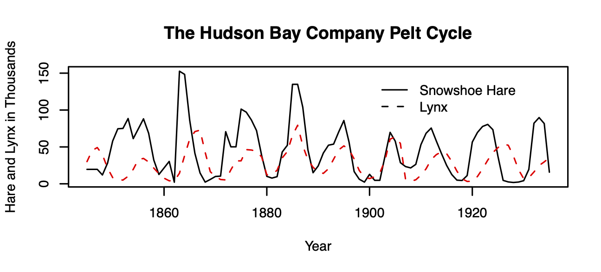
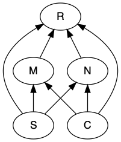

```{r include=FALSE}
knitr::opts_chunk$set(echo = TRUE, results='markup', warning=FALSE, message=FALSE, fig.path = "figs/", knitr.graphics.auto_pdf = TRUE,
                      message=FALSE, out.width="90%")

library(bipartite)
library(cowplot)
library(data.table)
library(diagram)
library(DiagrammeR)
library(DiagrammeRsvg)
library(igraph)
library(kableExtra)
library(knitr)
library(latticeExtra)
library(lavaan) #sem for bipartite stability hypotheses
library(magrittr)
library(phaseR)
library(primer)
library(reshape2)
library(rARPACK) # needed for eigs in bip_stability
library(rsvg)
library(scatterplot3d)
library(semPlot)
library(tidyverse)
library(tufte)
library(untb)
library(vegan)
library(xtable)

theme_set(theme_minimal() + 
theme(panel.grid.major = element_line(colour = "darkgrey"),
      panel.grid.minor = element_line(colour = "darkgrey")) ) 
theme(panel.grid.major = element_line(colour = "darkgrey"))
cbPalette <- c("#000000", "#E69F00", "#56B4E9", "#009E73", 
               "#F0E442", "#0072B2", "#D55E00", "#CC79A7")
```

```{r include=FALSE}
# automatically create a bib database for R packages
knitr::write_bib(c(
  .packages(), 'bookdown', 'knitr', 'rmarkdown'
), 'packages.bib')
```


# Preface {-}

This is based on my book published with Springer, "A Primer of Ecology With R", part of the Use R! series.

The `primer` package on CRAN (v. 1.2.0) should suffice for this edition. You may also install it directly from GitHub. To do this, install the `devtools` package. To successfully do that on a Windows operating system, I think you need to install Rtools:

`https://cran.r-project.org/bin/windows/Rtools/`


Once you have done all that, use this code:

```
devtools::install_github("HankStevens/primer")
```

In spite of the presumptuous title, my goals for this book are modest. I wrote it as 

* the manual I wish I had in graduate school, and
* a primer for our graduate course in Population and Community Ecology at Miami University.^[Miami University is located in the Miami River valley in Oxford, Ohio, USA; the region is home to the Myaamia tribe that dwelled here prior to European occupation.]

**Acknowledgements**

I am grateful for the generosity of early reviewers and readers, each of whom has contributed much to the quality of this work: Jeremy Ash, Tom Crist, David Gorchov, Raphael Herrera-Herrera, Thomas Petzoldt, James Vonesh, as well as several anonymous reviewers, and the students of our Population and Community Ecology class over the past 15 years. I am also grateful for the many conversations and emails shared with four wonderful mathematicians and theoreticians: Jayanth Banavar, Ben Bolker, Stephen Ellner, and Steve Wright --- I never have a conversation with these people without learning something. I have been particularly fortunate to have team-taught Population and Community Ecology at Miami University with two wonderful scientists and educators, Davd Gorchov and Thomas Crist. Only with this experience, of working closely with these colleagues, have I been able to attempt this book. It should go without saying, but I will emphasis, that the mistakes in this book are mine, and there would be many more but for the sharp eyes and insightful minds of many other people.

I am also deeply indebted to the R Core Development Team for creating, maintaining and pushing forward the R programming language and environment. Like the air I breathe, I cannot imagine my (professional) life without it. I am grateful to all of the developers of packages that have allowed literate programming with Rmarkdown and LaTeX, using RStudio and GitHub. 

I am indebted to Rachel Collins for her size-structured coneflower data, to Scott Meiners and his colleagues for their generous sharing of data, metadata, and statistical summaries from the Buell-Small Succession Study (http://www.ecostudies.org/bss/). I would like to thank Stephen Ellner for Ross's Bombay death data and for R code and insight over the past few years.  I am also indebted to Tom Crist and his colleagues for sharing some of their moth data (work supported by The Nature Conservancy Ecosystem Research Program
NSF DEB-0235369).

Last, and most importantly, I would like to thank those of you in my life who make living worthwhile.

Martin Henry Hoffman Stevens

Oxford, OH, USA, Earth

Today, Current Era


<!--chapter:end:index.Rmd-->

# Theory in Ecology {#theory}

In this chapter, we introduce a perspective on ecological theory, and provide two examples of efficient theory, metabolic scaling and maximum entropy theory. 

Theory is really, really important. Without theory of some sort to guide us, we are merely counting pebbles in a quarry. Good theory may be conceptual or mathematical, and helps us focus more clearly and in a less ambiguous manner on the systems we study. In this book, we explore mathematical models that provide special cases of theory.

*Scientific theory* is a body of knowledge that provides an organized and mechanistic view of how the world works [@Scheiner2010]. Theories concerning gravity, general relativity, and evolution by natural selection provide structured ways of connecting observations, patterns, and processes that  provide insight into why the world is the way it is. This stands in stark contrast to the colloquial use of *theory* that implies a lack of knowledge, as when someone says "oh, that's just a theory", referring to a guess without much evidence. Scientific theory is a set of explanations whose validity has been tested repeatedly by experiments and new data.

## Examples of theories

Ecology has lots of theories, of all different types. Below I discuss some which may be prevalent, important, useful, or some combination.

### Hierarchy theory

An early and persistent organizing schema in ecology is based on *hierarchy theory* [@ONeill1986; @Rose2017, and references therein]. It posits that ecological systems are structured *hierachically*, such that each entity comprises subunits. For instance, an entity such as a population of big bluestem grass (*Andropogon gerardii*) is part of a larger ecology community of many species. The population of big bluestem comprises subpopulations separated in space, a subpopulation comprises separate individuals, that each individual comprises multiple ramets and a set of organ systems and tissues, which comprise different cell types. This theory posits that each entity gives rise to emergent properties to the hierarchical level above it, and influences processes within each smaller sub-entity in the hierachical level below it. As a disciplinary organizing principle, this approach structures nearly all of the ecology curriculum.

Hierarchy theory gets more complicated when the levels of a hierarchy start to include fundamentally different types of entities. The big bluestem hierarchy above included only biotic components--a individual is part of a population which is part of a community of individuals of multiple species, and is made up of organ systems and tissues. Ecology, however, includes both the biotic and the abiotic parts of environments. An ecosystem includes a community of species, but also the nutrients, water, light, and other abiotic components, along with the spatial arrangement of all of these things. 

Different hierarchies are useful for different questions. An individual organism can play very different roles in different hierarchies. Consider and individual bunch grass. To understand how a population evolves, we need to count individuals within a population, because evolutionary fitness is tracked by the number of independent reproductive units. In contrast, to understand competitive interactions, it may be much more important to weigh the biomass of groups of individuals in a population, because biomass is more closely related of resource uptake.  

### A general theory of ecology

Good scientific theories exist within a hierarchy of disciplinary knowledge [@Scheiner2011]. They explain phenomena within a *domain* of knowledge which is organized around *principles* and *assumptions*. Scheiner and Willig posit a theory of biology that explains phenomena relating to the "diversity and complexity of living systems". One of the ten principles on which this theory depends is that "the cell is the fundamental unit of life". Subsumed within their theory of biology is the theory of cells whose domain is "cells and the causes of their structure, function, and variation." This theory in turn is based on principles and has theories to organize our understanding of cells and what cells do. 

*Models* are specific and explicit manifestations of more general theories. In this book, we focus on popular mathematical models that are specific manifestions of theories of ecology. 

@Scheiner2011 propose a theory of ecology, some of which we cover in this book. Here is part of this theory:

**The General Theory of Ecology**

**Domain:** The spatial and temporal pattern of the distribution and abundance of organisms, including causes and consequences.

**Principles:**

1. Organisms are distributed in space and time in a heterogeneous manner.
2. Organisms interact with their abiotic and biotic environments.
3. Variation in the characteristics of organisms results in heterogeneity of ecological patterns and processes.
4. The distributions of organisms and their interactions depend on contingencies.
5. Environmental conditions as perceived by organisms are heterogeneous in space and time.
6. Resources as perceived by organisms are finite and heterogeneous in space and time.
7. Birth and death rates are a consequence of interactions with the abiotic and biotic environment.
8. The ecological properties of species are the result of evolution.

These principles constitute what we know is true about ecological systems.  Some of these principles provide the focus for a single chapter while other principles apply broadly to many chapters in this book. 

Here is my own perspective on a general theory of ecology:

*Domain:* The house of life^["ecology" derives from the Greek "oikos" which means the rules of the house]: its constituent entities, causes, and consequences.

*Principles:* 
  
1. Entities^[An entity may be an ecosystem, a community, a population, an individual, or some other system with operationally defined boundaries.] are open systems with inputs and outputs.
2. Entities have internal complexity.
3. Entities include self-replicating components (living elements).
4. Entities interact via inputs, outputs, and behavior.
5. Rates of change, including inputs and outputs, are influenced directly by physical factors: space, temperature, and concentration.

You will see elements of these principles throughout this book as well.


### Efficient theory

@Marquet2014 argue that the best theories are those which are *efficient*. Such theories tend to be *based on first principles*, which are observations and laws that are fundamental assumptions in a scientific domain. In biology, such principles can include the laws of thermodynamics, and mathematical properties such as the central limit theorem. Theories built upon first principles are thus well-grounded in reality as we understand it and lead logically to refinements. Marquet and his colleagues also claim that efficient theory is *expressed in mathematics*. Mathematics is a universal language that is unamibiguous. It forces us to be as clear as possible about what we mean when we state a theory.^[$E=mc^2$ - need I say more?] Last, efficient theories are those that make a *large number of predictions using only a small number of free parameters*.^[Variables are quantities we measure and which change through time (e.g., population size). *Parameters* are (usually) fixed constants that govern the rates of change of variables (e.g., per capita birth rate).]  Examples of efficient theories we cover in this book include metabolic scaling, exponential growth, density dependence, and ecological neutral theory.

Marquet et al. and Scheiner and Willig emphasize slightly different features of the definition of "theory". Scheiner and Willig emphasize relatively broad ideas that are well-supported by experiments and repeated observation. Marquet and colleagues tend to mean something fairly specific and narrow, typically something that can be expressed mathematically. Scheiner and Willig might refer to such theory as constitutive theory or even simply a model. 

Next, I describe the Metabolic Theory of Ecology. This theory is based on first principles, and its central tenets are expressed mathematically. It's core equation has a very small number of free parameters (fitted constants) and makes a very large number of testable predictions. Parts of this theory are supported by a very large number of observations. It fits everyone's definition of theory.

## An example: Metabolic Theory of Ecology {#metabolic_scaling}

Metabolic rate is central to how rapidly individuals forage for, consume and use resources, reproduce and die. The *metabolic theory of ecology* [@Brown:2004wa] is a well-supported body of knowledge about the underlying mechanisms, and the resulting profound and wide-ranging consequences for populations and ecosystems. 

Body size and temperature are fundamental properties of organisms and the environment. The study of how body shape and body processes scale with body size is *allometry*. Because body size affects metabolic rate, body size indirectly helps determine population growth rates and how species interact with each other. Temperature affects how molecules vigorously molecules vibrate and move, and so increasing temperature tends to speed up chemical reactions. As metabolism is really just a complex network of biochemical reactions, temperature influences metabolic rate. 

The core of this theory is expressed in a simple mathematical equation that describes how body size and temperature govern metabolic rate.

### Body-size dependence

There is a profoundly simple and general rule describing the effect of interspecific variation in body size on metabolism.^[Metabolic rate may be measured by variables tied directly to metabolism, such as the rate of oxygen or energy consumption, or CO$_2$ production.] This biological law is referred to as the Kleiber law [@Kleiber1932], or *quarter power scaling* [@Brown:2004wa]. When we compare the basal  (i.e. resting) metabolic rates of different species, across a wide range of body sizes spanning many orders of magnitude, we find that

*whole-organism resting metabolic rate increases with organism mass raised to the three-quarter power*, or,

$$
B = aM^{z} \quad;\quad z = 3/4
$$

In this equation, $B$ is basal, or resting, metabolic rate, $M$ is body mass, $a$ is a proportionality constant, and $z$ is the *power law scaling coefficient*. The proportionality constant $a$ varies depending on the type of organism such as arthropods, fish, or mammals. Plants scale in the same manner  [@Niklas2001], although size or mass is a little trickier to measure. The scaling coefficient, $z$, is the seemingly magical constant that many have argued does not vary substantially among different types of organisms. 

Ecologists typically describe metabolism-mass relations and other power law behavior using logarithmic scales. When we do that, power law relations become linear. Using our rules for exponents and logarithms, metabolic scaling becomes
$$ \log B = \log a + z\log M$$
so that $\log B$ increases linearly with  $\log M$ with a slope of $3/4$. Our brains can process and compare linear relations much more easily than curvilinear ones. 

Here we plot the curvilinear relation in R using `curve()` in the `graphics` package of R that is included in the base installation as one of the core packages. The function `curve()` can plot any curve that be expressed as a function of `x`. Below, we draw a curve of a dotted 1:1 line for comparison, and then *add* the power function $x^{3/4}$.

```{r MTE34, fig.cap="Metabolic rate increases predictably with species body sizes.", echo=TRUE, fig.asp=.75, out.width="75%", echo=FALSE}
## using curve, let your variable be 'x'.
{par(mar=c(5,4,1,0), mgp=c(1.5,.4,0) ) # set figure margins in "lines"
curve(1*x, from = .01, 100, ylab = "Metabolic rate (B)",
      xlab="Body mass (M)", lty=3)
curve(x^(3/4), from = .01, to = 100, add=TRUE)
text(80, 90, "1:1"); text(80, 80^.8, expression(M^0.75))}
```
```{r MTE34b, eval=FALSE}
## using curve, let your variable be 'x'.
curve(1*x, from = .01, to=100, ylab = "Metabolic rate (B)",
      xlab="Body mass (M)", lty=3)
curve(x^(3/4), from = .01, to = 100, add=TRUE)
```

To help us grasp the implications of this, let's consider  *mass-specific* metabolic rates. "Mass-specific" means on a per-gram basis.^[With plants, we often measure something called "specific leaf area", SLA, which is the two dimensional area of a leaf divided by its mass.] Mass-specific metabolic rate is basal metabolic rate of an individual divided by its mass, or $B/M$. 

The mass-specific metabolic rate allows us to compare directly, for example, the metabolic rate of a cell in a shrew vs. a cell in an elephant. Which cell is burning fuel faster?

We can estimate this from the above metabolic scaling principle and the using rules exponents 
$$ \frac{B}{M} = a \frac{M^z}{M^1} = a M^{z-1} = aM^{-1/4}$$
From this, we now have the rule that

*mass-specific metabolic rate declines with organisms mass raised to the negative one quater power*

```{r MTE-MS, fig.cap="Mass-specific metabolic rate declines predictably with species body sizes.", echo=TRUE, out.width="75%"}
eq1 = function(M, a){a*M^-0.25} # create the function, F(M)
ggplot(data=data.frame(x=c(0.1, 100)), aes(x=x) ) + 
  stat_function(fun=eq1, geom="line", args=list(a=1)) + 
  xlab("Mass (M)") + ylab("Mass-specific metabolic rate (B/M)")
```

Over the years, there has been heated debate about (i) the precise value of the scaling coefficient $z$, and (ii) the underlying mechanism. Early arguments suggested that $z \approx 2/3$ because the rate heat dissipation scales with the amount surface area. Why $2/3$?

Let's envision the volume of an organism having three linear dimensions, so the volume scales to the cube of linear dimensions, while the surface area scales to the square of these linear dimensions,^[A linear relation is one in which $y$ is proportional to $x$, or $y \propto x$.]
$$V \propto L^3$$ 
$$A \propto L^2$$ 
The early explanation was that metabolic rate, $B$, scales linearly with area, 
$$B \propto A^1 \propto L^2$$.
With substitution we get, 
$$L^2 \propto V^z \propto (L^3)^z$$
implying that the exponents $2 = 3z$ or $z=2/3$, so we get,
$$B=V^{2/3}$$,
and, for the most part, mass scales linearly with volume for mammals or any other such group.

This early theory was because it started with first principles (heat dissipation and geometry) and resulted in the prediction of a single parameter. It could then be used to make predictions about how metabolic rate scales with body mass. Metabolic rate governs a huge amount of biology and ecology, including resource consumption rates, lifespan, and maximum population growth rates. Therefore, this theory and this model could be powerful tools for understanding the world and making testable predictions.

The above model is good because it could be tested. That is what has been done, and scientists found that there was a consistent mismatch between observations and the theory. Investigators showed that the value of the exponent appeared closer to 3/4 raher than 2/3. In the 1990s, a group including Jim Brown and Geoffrey West [@West1997] proposed an underlying mechanism that explained why it should be 3/4. They assumed that organisms must 

* distribute resources from a single source through a branching, fractal-like, space-filling network to all parts of the body,
* the size of the smallest branch ( a capillary) was the same for organisms of all sizes.
* the energy required to distribute the resources must be minimized, that less energy-efficient designs would be lost through natural selection. 

The prediction that resulted from these assumptions was that the exponent would be 3/4. This theory and model begin with different first principles and makes a different prediction. 

Soon Jayanth Banavar and his colleagues offered an alternative [@Banavar1999; @Banavar2002], arguing that the assumption of the fractal-like network was not correct, and in any event, was not necessary and did not apply to all organisms. They proposed different theory with less restrictive assumptions and found nonetheless that the exponent was also predicted to be 3/4. 

At the base of all these arguments is the geometry of the resource distribution system. All organisms take in limiting resources and have to distribute those resources to each part of each cell in the body. The key point is that *the larger the organism, the greater the portion of the resources are in transit at any instant in time*. This leads to an increasingly inefficient system, in which the metabolism of larger organisms has to run more slowly per unit resource: 

*Larger organisms can process more resources per unit time ($B=aM^{3/4}$), but do so less and less efficiently ($\frac{B}{M}=aM^{-1/4}$) due to resources in transport.*

Banavar, Brown and others eventually collaborated to address quarter power scaling in animals in particular which led to additional novel predictions [@Banavar2010].

This theory remains a fertile and active area of research [@Glazier2018]. The interested reader should be careful to distinguish between patterns observed across many species of very different sizes, versus patterns observed in a single species with individuals of different sizes versus other types of patterns. Subtly different patterns may be driven be very different mechanisms.


### Temperature dependence
In addition to body size, temperature plays the other key role in regulating metabolic rate. The Arrhenius equation connects the macroscopic property of temperature to the kinetic energy of molecules and the rates they govern. Metabolic rate is proportional to these rate determining processes, 
$$B  = a e^{\frac{-E_a}{kT}}$$
where $a$ is just a constant,  $e$ is the exponential, $E_a$ is the average activation energy of rate-limiting enzymes (units, eV), $k$ is Boltzmann's constant (units eV$\,$K$^{-1}$), and $T$ (units deg K). Bolztmann's constant ($\backsim 8.6 \times 10^-5$$\,$eV$\,$K$^{-1}$) converts the macroscopic property of temperature to kinetic energy of molecules. 

Individual biochemical reactions combine to determine basal metabolic rate, so @Gillooly2000 have taken this as a foundation for the metabolic theory of ecology [@Brown:2004wa]. In 2000, they suggested that the average activation energy is approximately $E_a = 0.23\,$eV . Subsequent work has described this as "temperature sensitivity", where larger numbers imply that organisms respond more strongly to temperature variation. 

The Arrhenius equation is a little more complicated that a simple power law, but not too much. Over the range of biologically relevant temperatures, it is dominated by a largely exponential increase in metabolic rate with increasing temperature (Fig \@ref(fig:arrh)). 
```{r arrh, echo=TRUE, fig.cap='The effect of body temperature on ectothermic metabolic rates can be approximated with the Arrhenius function, $B = a e^{-E_a/(kT)}$. Here $a = 10^4$, and $E_a = 0.23$. It is similar in shape to a power law with z > 1, over the range of biologically relevant temperatures.', fig.asp=.75, out.width="75%"}
# with base R
# base R: curve(10^4*exp(-0.23/(8.5 * 10^-5 *x)), 276, 316), ylab="B", xlab='T')
# or ggplot2
# the function, with default parameter values
eq.t <- function(t,a=10^4,E=0.23,k=8.6 * 10^-5){a*exp(-E/(k*t))}
# the data used in our function
temps <- data.frame(t=276:316)
ggplot(data=temps, aes(x=t)) + 
# set the basic properties of the plot
  stat_function(fun=eq.t, geom="line") + 
# set the function to plot
  xlab("Temperature (K)") + ylab("Metabolic rate (B)")  
# add labels
```

When we linearize the relation between metabolic rate and temperature, we get 
$$
\begin{aligned}
B &= a e^{\frac{-E_a}{kT}}\\
\log(B) &= \log{a} - E_a\frac{1}{kT}\\
\end{aligned}
$$
where the dependent variable is $1/(kT)$, $-E_a$ is the slope, and $\log a$ is the intercept. Thus, the negative slope of this relation describes theoretical prediction for the effect of temperature on metabolic rate. 

**So, there you have it.** The metabolic theory ecology is the algebraic product of body size- and temperature-dependence:
$$B = a M^{3/4} e^{\frac{-E_a}{kT}}$$
This theory makes quantitative predictions regarding all kinds of ecology phenomena [@Brown:2004wa], including

* home range size
* population growth
* population size
* resource uptake 
* predation and other species interactions, and
* ecosystem cycling.

Note that these relations are based on first principles of geometry and thermodynamics, and that they depend on only a small number of parameters ($a$, $-E_a$, and perhaps $z=3/4$), and makes a tremendous number of predictions. Therefore, @Marquet2014 propose that this is "good" theory, and very *efficient*.

## Power law scaling implies constant relative differences

In power law scaling, relative change is constant. That is, a proportional change in one variable results in a proportional change in the other. For instance, when we compare a smaller species to a larger species with $100 \times$ the body mass, we can expect to see metabolic rate increase by $31.6 \times$, *regardless of the mass of the smaller species.* For now, we will verify this numerically for some limited cases.
```{r}
# define body mass and metabolic rate
m <- c(.01, 1, 100, 10000)
b <- m^.75
```

Now we will divide each mass $i$ by the next smallest mass $i-1$. We do that using a vector by dividing each mass except the first one, by each mass except the last one.
```{r, echo=TRUE, eval=FALSE}
# round(x, digits=0) rounds number to zero decimal places
round( m[-1]/m[-length(m)], digits = 0)
round( b[-1]/b[-length(b)], digits = 1)
```

When we do these divisions, we see the constant relative change (Table \@ref(tab:relativemb)).
```{r relativemb, echo=FALSE}
df <- round(rbind(Mass=m, Basal.metabolic.rate=b,
  Relative.change.m=c(NA, m[-1]/m[-length(m)]),
      relative.change.b=c(NA,b[-1]/b[-length(b)] )), 2 )
colnames(df) <- c( "Small", "Med.", "Big", "Huge")
knitr::kable(df, booktabs = TRUE,
  caption = 'As we increase mass by a constant multiplier (10x), power law scaling results in a constant proportional change in basal metabolc rate.'
)
```

We can verify this generally using algebra, not just in the particular case above. We will show that if mass increases by a constant multiplier, metabolic rate will also, regardless of the particular masses involved.

Let mass $m_2$ be greater than mass $m_1$ by a factor of $c$, so that $m_2 = c m_1$, and
$$\frac{m_2}{m_1} = c$$.

We would like to show that the ratio of the metabolic rates $b_2 / b_1$ is also a constant. Since $m_2 = cm_1$, we can say that
$$b_1 = a m_1^{3/4}$$
$$b_2 = a (cm_1)^{3/4} = ac^{3/4}m_1^{3/4}$$
$$\frac{b_2}{b_1} = \frac{ac^{3/4}m_1^{3/4}}{am_1^{3/4}}$$
When we reduce this fraction, we a left with 
$$\frac{b_2}{b_1} = c^{3/4}$$

This shows that with power law scaling, increasing $x$ by a constant *multipier* (or proportion), $y$ increases by the same proportion raised to that power.

Let's represent this graphically in a couple of ways, reusing data we made up previously in this chapter. First, we just change the axes themselves, so that the units of the scales are multiples of 10 (often in scientific notation).
```{r logscale, fig.cap="changing the scales of the axes to linearize power law relations. Note scales are logarithmic, using the original linear values.", fig.show='hold', out.width="50%", fig.asp=1}
# using base R
par(mar=c(5,4,0,0), mgp=c(1.5,.4,0) )# set figure margins in "lines"
curve(x^(3/4), from = .01, to = 100, log="xy", ylab="Basal metabolic rate", xlab="Mass")
text(10, 80^.7, expression(M^0.75))
```

## Meet METE: Maximum Entropy Theory of Ecology

The Maximum Entropy Theory of Ecology is best known for making predictions and elucidating patterns of species-area relations and species abundance distributions that emerge in relatively stable ecological communities and ecosystems [@Harte2014]. However, it is an active area of research and Harte and others are extending the ideas into non-equilibrium systems as well [@Harte2021]. 

Entropy is, basically, disorder. Less entropy means more order or structure. Maximum entropy is maximum disorder. The universe tends toward maximum entropy, although in some places and times, like parts of our world right now, entropy can decrease. Physicists are the folks most responsible for our understanding of entropy, and Edwin Jaynes is arguably the one most responsible our understanding and appreciation of its role in information and probability.

MaxEnt, or the principle of maximization of information entropy, or the principle of maximum entropy is that, given a set of constraints on a system, the least-biased probability distribution that describes data arising from that system will be the one with maximum entropy. 

The principle of maximum entropy has show that maximal uncertainty arising from the flattest distribution, given known constraints, provides the least biased description of a system. It can provide the least biased probability distributions for these situations with these constraints:

* Consider a jar contains jelly beans, and contains at least one and no more than 1000. What is the least biased distribution of possible counts of jelly beans? 
* Imagine a hectare of land that contains trees of different heights, and that the mean height is three meters. What is the least biased distribution of possible tree heights?
* Regarding this forest - what if you were told that the variance in height was two meters? What would be the least biased distribution of possible tree heights?

The principle of maximum entropy could help us prove that, in the absence of other information, the least biased distributions for these sets of constraints would be the uniform, exponential, and Gaussian (or normal) probability distributions. 

The maximum entropy theory of ecology [@Harte2014] can tell us what to expect when we know very little, or *when very little is going on aside from random noise.* 

We will talk more about the METE in our chapter on diversity, but I mention it here to emphasize that patterns arise in ecology via random noise. 

The rank-abundance distribution is a famous ecological pattern. It is the log-abundance or relative abundance of species, arranged from the most abundant to the least abundant (Fig. \@ref(fig:mete1)).
```{r mete1, fig.cap="Rank abundance distribution of tree species in a 50 ha plot on Barro Colorado Island. Line is a best fit of the log-normal distribution.", out.width="50%", fig.show="hold"}
library(vegan)
data(BCI)
abun <- colSums(BCI)
mod <- rad.lognormal(abun)
plot(mod, main="Rank-abundance distribution")

mod.oct <- prestonfit(colSums(BCI))
plot(mod.oct, main="Species abundance distribution")  
```

The curve formed by these data points (left, Fig. \@ref(fig:mete1)) is steep at first, among the most abundant species. The curve then flattens out a bit before getting a little bit steeper again. If we group species into logarithmic abundance categories, and make a histogram of abundances, we get the *species abundance distribution." @Preston1964 noted that the distributions were remarkabling similar to a normal (Gaussian) distribution, when abundances were log-transformed (resulting in a lognormal-like distribution). It turns out that this curve is quite common and for decades ecologists argued about how we might infer the underlying ecological processes on the basis of the shape of the curve. This discussion died out once ecologists admitted that it was impossible to determined the processes on the basis of the pattern.

The discussion of the shape of the rank-abundance distribution was revived in the late nineties when Steve Hubbell showed that if you pretend all individuals are equally likely to live or die, *independent of their species identity*, then you should expect this pattern [@Hubbell2001]. Later, John Harte showed that the principle of maximum entropy was a more general approach to this question and could be extended into other realms and patters.

As an example, consider a community of five individuals and three species. Those are our only constraints, $N=5$, $S=3$. How many different possible distributions of species abundances can we get if we assume maximum uncertainty, i.e., maximum entropy? Is there any way to know? Because we have so few, we can count them. 

Consider five individuals distributed among three species (rows) and list all possible community states (columns).
```{r}
# by default, R fills matrices by columns.
states <- matrix(
  c(3,1,1, # column 1,
    1,3,1, # column 2, etc.
    1,1,3,
    2,2,1,
    2,1,2,
    1,2,2),
  nrow = 3 )
# label species
rownames(states) <- LETTERS[1:3]
states # each column is a possible configuration.
```

A rank or species abundance distributions does care *which* species is most abundant, just that different species exist and can have different abundances. Maximum entropy would have us ask, "what is the average abundance of the most abundant species?" Let's calculate that. We can see that the most abundant species has either 3 individuals or two individuals and each of these occurs three times. Therefore the average abundance of the most abundant species is calculated as
```{r}
(3+3+3+2+2+2)/6
```

or two and half individuals out of five individuals in the whole community.

How about the least abundant species? The least abundant species always has only one individual. Therefore, the second most abundant species has, on average, 1.5 individuals.

```{r mete2, fig.cap="Expected rank abundance distribution, given five individuals and three species, under the maximum entropy theory of ecology.", out.width="50%"}
qplot(x=1:3, y=c(2.5, 1.5, 1), geom=c("point", "line")) + 
  labs(y="Expected abundance")
```

This is one prediction of METE: given only the number of individuals and the number of species, it can predict a species abundance distribution.


## Summary

Useful theory is *efficient* theory, making the greatest number of predictions with the fewest free parameters. It helps clarify our thinking and disentangle the myriad mechanisms at play in our ecological systems.


<!--chapter:end:01-theory.Rmd-->

# Optimal Foraging {#oft}
```{r cowie, fig.cap="Optimal foraging theory (OFT) generates testable quantitative predictions that allow a less ambiguous description and explanation for observed patterns and processes. Here, a simplistic model of Great Tit (Parus major) foraging that includes only gross energy intake underestimates the time spent in patches (dashed). In contrast, a model that includes energetic costs of traveling and searching matches predictions far better (solid).  From Cowie (1977).", out.width="75%", echo=FALSE}

```
It can be useful to think of natural selection as an optimizing process: phenotypes diversify, winners replicate and losers don't, and the phenotypes of winners tend to get passed on to the replicants. Therefore, we often assume, as did Dr. Pangloss, that the species that exist now are the best of all possible species, that is, they are of optimal design. And like Dr. Pangloss, we would be woefully mistaken if we stopped there. Nonetheless, optimization, that is, the tendency toward an optimum, helps us generate testable hypotheses and we consider some of these below.

Optimal Foraging Theory (OFT) helps us consider what organisms would do *if they foraged optimally.* All organisms--plants, fungi, archaea, and even animals--forage, and they are all subject to natural selection. Therefore, their phenotypes work pretty well, but probably not optimally and definitely not optimally for all times and places. Nonetheless, OFT is an efficient theory about the behavior of an organism, in the absence of other complications. Therefore, it allows us to study the relative importance of those "other complications."

Foraging is a key link between the individual, and communities and ecosystems [@Beckerman2010]. All organisms interact with their environment via consumption, and the choices they make influence population dynamics, species interactions, nutrient cycling, and even the physical structures of terrestrial and aquatic habitats. The text and logic of this chapter rely heavily on @Stephens1986 and @Ellner2009.

In Scheiner and Willig's edited volume on *The Theory of Ecology*, Andy Sih [@Sih2011] proposes that the following propositions form the basis of foraging theory:

1. Foraging patterns maximize fitness or a correlate of fitness. 
2. Foraging patterns depend on the range of options available to the forager and on how each available option affects fitness or a correlate of fitness.
3. Foraging behaviour balances conflicting demands--tradeoffs are important in shaping foraging behaviour.

These properties are the outcome of natural selection operating on foraging behavior. Our understanding of foraging itself considers these three features [@Stephens1986]:

* currency (what is being optimized),
* constraints (features of behaviour that limit optimality), and
* the resulting decision rules.

*Currency* is that quantity that is optimized by the forager. This currency is assumed to be a quantity that limits fitness, such as energy or a particular consumable resource. We measure it as a rate, for instance, as the energy gained per unit time (E/T) or the uptake of a critically limiting resource per unit time (R/T).

*Constraints* are limitations that we assume about organisms. These might include distances between resource patches, the time and costs associated with extracting a resource from a substrate or subduing prey. They also include constraints imposed by other species including competitors and predators. Constraints can get complicated quickly; however, simple quantitative theory makes predictions against which we can evaluate more complicated assumptions.

*Decision rules* are what we ascribed to a forager's choices. A decision rule concern the probability of attacking prey if encountered, or when to leave one resource patch in order to search for another. 

An additional way to think about all this is *where, when, and what.* A great deal of effort has focused on understanding patch use: *where* foragers should explore for resources, and *when* they should give up and go in search of another patch [@Charnov1976b]. These are **patch use** models, and are based on economic models and the marginal value theorem. 

Another avenue of inquiry concerns *what* animals should eat. For instance, should they go after big prey that may be hard to catch and difficult to subdue, or just snack on what is easy? These are **prey models** or diet models, and attempt to explain why organisms consume *what* they do. 

*A note on "prey".* All organisms forage for resources. Plants extend branches toward the light, and proliferate leaves and roots into resource rich patches, and rhizomes grow longer faster through resource-poor soils. Bumblebees search for and learn where to find nectar-rich flowers, and wolves hunt in packs to take down large ungulates. Some bacterivorous nanoflagellates intercept particles selectively depending on the perceived nutritional value of particles [@Boenigk2002]. So, depending on the forager, its "prey" may be $\mathrm{NO}_{3}^-$ ions, nectar, moose, or bacteria. Therefore, we will refer to these resources variously as prey, prey items, resources, and resource items. Some of these ideas are best handled with patch-based models [@Charnov1976b] where a "resource patch" is a more intuitive and useful unit.

*A note on "handle".* All organisms pays costs to consume resources. In OFT, "handle" typically means expending energy an time to attack and subdue prey (predators), proliferate into resource rich areas (plants), exude extra cellular enzymes (fungi); ingest the item(s), and then resume searching.

## A prey model

*...in which a forager asks, "should I eat this?"*^[whether "I" is a sugar maple tree or a human, most of us do not make this decision conciously...] 

Let's start where this field started, with a prey-centered model [@MacArthur1966; @Emlen1966]. 

\begin{itemize}
\item Currency - long-term energy gain per unit time, $G/T$.
\item Constraints
\begin{itemize}
    \item forager can consume only what it encounters.
    \item forager uses time and energy searching for items and handling items.
    \item if the forager chooses to pursue an item, searching stops and handling starts.
    \end{itemize}
\item Decision rules - the probability that a forager pauses from searching to handle an item.
\end{itemize}

The goal is to optimize the currency.

### Our intuition
```{r ant, echo=FALSE, fig.cap="The amount of energy, E (y-axis), that is lost and gained by a foraging ant--it may decline slowly over time (x-axis) while searching, and decline quickly while handling a food item. Our ant gains energy when it consumes an item. Below: Our ant. She expends energy while searching for food. Upon encountering a food item, she may choose to 'handle' it (encounters 1 and 3) and gain energy, or not handle it (encounter 2) and save the added cost of handling it.", out.width="100%" }
knitr::include_graphics("figs/foraging_ant2.jpg")
```

It seems reasonable that if a forager encounters food, it should eat it. However, if handling it costs more than the forager gets back in energy, then it isn't worth it. We might think of this as the ratio as *profitability*,
$$\frac{e_i}{h_i}$$
where $e_i$ is the energy in an item of type $i$, and $h_i$ is the cost of handling said item. If $e_i/h_i<1$, then it doesn't make sense to select the item. Further, handling an item means that the forager is *not* looking for a better food item. This suggests that even if $e_i/h_i>1$, a forager may not want to handle it if it is likely to soon encounter food items of higher energy content. On top of this, the act of searching may expose a forager to a risk of running into competing foragers, or even being eaten by a bigger forager. Clearly, a forager faces tradeoffs as it searches and when it encounters resources.

### Mathematical support
One of the reasons to represent ideas mathematically is that we make concrete assumptions, and then the math can tell us what the predictions are. That is what we will do here.

Let's assume that natural selection tends to maximize the currency as Gain per unit Time, $G/T$. Our model will use these parameters and variables:

* $i =$ index for prey type
* $S =$ total time spent **searching** (units = seconds, $s$).
* $\lambda_i =$ rate of encounter with prey of type $i$ (units = # encountered/s = $\#/s$; note this can also be #/area × area/s, if we like)^[A forager encounters prey at random, and this is known as a "Poisson process", where the number of encounters in a specified time interval is a random variable drawn from the Poisson probability distribution. It turns out that the *time between events* of a Poisson process follows the Exponential distribution. The Poisson distribution is determined by a single parameter, its mean. The Exponential distribution is also described by a single parameter, its *rate*. It turns out that we use the same $\lambda$ for both. }]
* $p_i =$ probability that a forager attacks prey if encountered (units are number handled per number encountered, or #/#; this is a dimensionless parameter)
* $h_i =$ handling time for an item of type $i$,  (units = s/#). 
* $T =$ **total** elapsed time (units = s)

From these definitions we can calculate other important quantities.

**Total number of items** encountered of type $i$ is 
$$S \lambda_i$$

The units are $s\, \#\,s^{-1} = \#$.

**Total number of type $i$ items handled** is the proportion, $p_i$, of those encountered that the foragers chooses to go after, or 
$$S\lambda_i p_i$$
The units are $\#$.

**Total time spent handling** all items of type $i$ is 
$$H=S\lambda_i p_i h_i$$ 
The units are $s$.^[We can check units for total handling time, $H = S\lambda_i p_i h_i$ by replacing the variables and parameters with their units. The units for $H$ are seconds, so we have $\mathrm{s = s \frac{\#}{s} \frac{\#}{\#} \frac{s}{\#}}$. When we multiply these fractions, we find that the $\#$s and two of the s's cancel out and we are left with $s=s$.]

**Total elapsed time** is time spent searching plus time spent handling, which is  
$$T=S + \sum_i^n S\lambda_i h_i p_i$$
where we use the summation to add together the total handling times for each prey or resource type $i = \{1,\,2, \ldots ,\,n\}$.

Let 

* $e_i =$ net energetic gain from catching and consuming a single type-i prey item (units = Joules, J). This includes the gross energy of the item minus handling costs plus energy not lost by searching during that time.
* $c =$ energy cost per unit of time while searching (units = J).

**Total energy gain** from eating all the items is the number of items of each type $i$ handled times the net amount of energy per item of type $i$, $e_i$, $$\sum_{i=1}^n S\lambda_i p_i e_i$$
where units are $\# (\mathrm{J}/ \#) = \mathrm{J}$.

Therefore, **rate** of energy intake (J/$s$) while handling and eating is 
$$\mathrm{intake} = \frac{\sum_{i=1}^n S\lambda_i p_i e_i}{S + \sum_{i=1}^n S\lambda_i h_i p_i}$$
If we then subtract the cost of searching, we arrive at the quantity we want to maximize, 
$$G/T=\frac{\sum_{i=1}^n \lambda_i p_i e_i}{1 + \sum_{i=1}^n \lambda_i p_i h_i}-c$$
A major question in OFT is whether a forager should include a particular prey type. Say we rank the prey types, $i=\{1,2,...,m,...,n\}$, in terms of energy content, where type $i=1$ has the most energy per item, $i=m$ is intermediate, and type $i=n$ has the least. *Which items should a forager include in her diet?* Should it be only the most energy-dense, or should it include the second as well, or should it be all of them? Part of the answer rests on the ratio of energy gain versus handling costs, or profitability, $e_i/h_i$.

If we maximized $G/T$ with respect to $p_j$, we would be able to determine whether to include item $j$. Doing so leads to several predictions.

**Prediction 1** *A less energy-dense item should be added if its net energy content is greater than the realized energy gain from all the other items,*

\begin{equation}
\frac{e_{m+1}}{h_{m+1}} > \frac{\sum_{i=1}^m \lambda_i e_i}{1 + \sum_{i=1}^{m} \lambda_i h_i} (\#eq:preypred1)
\end{equation}

where the diet already includes items 1-$m$, and the *realized* energy content of the diet takes into account average encounter rates of each item type. It means that a foraging will always select a particular type ($p_j =1$), or never select it ($p_j=0$); this is known as the "zero-one rule". 

**Prediction 2** Foragers will rank prey types by their profitability, $e/h$. 

**Prediction 3** When encounter rates increase (as with increasing abundances), selectivity increases. Note that encounter rates are in the right hand side, so as they increase, so will that fraction on the right. That will make it harder for the above inequality to be true, and a forager will be pickier. If you don't believe it, try this simplified version (Fig. \@ref(fig:selectivity)).

```{r selectivity, echo=TRUE, fig.cap="Selectivity increases with average encounter rates.", out.width="60%"}

G.T = function(lambda, h=1, e=1){lambda*e/(1+lambda*h)} # create the function you want
myData <- data.frame( lambda=c(0, 10) ) # data you need
ggplot(data=myData, aes(x=lambda)) + # set the basic properties of the plot
  # in the stat_function, we indicate the parameters in our equation.
  stat_function(fun=G.T, geom="line") +
  ylab(bquote(over(lambda*e, 1 + lambda*h))) + xlab(bquote(lambda))  # add labels
```

**Prediction 4** Inclusion of type $m+1$ in the diet does not depend on its encounter rate. Thus, a particular type should be included if the instantaneous net gain of that type is greater than the *realized long term average* net gain of all the more profitable types. Note that encounter rate appears on the right hand side, but not the left. 

So how does this model fair in the real world? Well, the zero-one rule doesn't work at all; it turns out that for a variety of reasons, foragers do not completely ignore low-profit prey. However, there is great support for the other predictions (above) [@Stephens1986]. Most importantly, in all cases, the theory has provided a clear framework to generate testable predictions from unambiguous assumptions, and that is what we want from efficient theory. The model itself helped guide research, and inclusion of greater complexity has led to deeper understanding of behavior and its consequences for species interactions.

## The patch model
*...in which omniscient rationale agents roam free.*

Here the forager asks, "how long should I stay here?" In the simple *prey* model, a forager searches for and then encounters prey one at a time, makes a decision to consume or not, and then resumes searching. In a simple *patch* model, a forager searches for and encounters patches one at a time, first consumes resources and then makes a decision to leave or not. Perhaps the single most important prediction of the simple patch model is that a forager should leave a patch when its current rate of energy gain drops down to the average or expected rate of energy gain for the habitat at large. 

In what follows, we rely on @Charnov1976b, who applies *the marginal-value theorem* to explain optimal behavior. Here, as in economics, "marginal value" refers to a rate - the slope of a function. In calculus, this is a derivative. Here, it is the derivative (i.e. slope) of the relation between energy gain and time.

Let's assume the simplest of all patch models: one patch type, all patches are the same, and they are distributed randomly in the habitat. Assume also that a forager uses time to travel between patches (travel time, $t_t$) and time searching within a patch (residence time, $t_r$). A forager encounters patches at random, with a rate of $\lambda$, and as such, would have a mean time to next encounter of $1/\lambda$. 

The patch is characterisized by its *gain function* $g(t_r)$ (Fig. \@ref(fig:gain)) which is the expected^["expected" value of a variable is the mean of that variable, because that is what we expect given the absence of other knowledge]
*cumulative net energy gained*, given time $t_r$ spent in the patch. The gain function is a cumulative total net amount. We can imagine different types of gain functions.
```{r gain, echo=FALSE, fig.cap="Net energy gain as a function of patch residence time may take different forms. Net energy gain increases through time but slows (decelerates) as a greater fraction of the resources in the patch are consumed. The top line (solid) assumes that there are diminishing returns as a patch is depleted, but the forager continues to find resources in excess of metabolic losses. The lower line (dashed) represents the net energy gain that could arise as a patch is depleted more fully and the costs continue unabated.", out.width='75%'}
eq1 <- function(tr) {.7 * tr/(.1+tr)}
eq2 <- function(tr) {-tr^2 + 1.5*tr}
df <- data.frame(tr=c(0,1) )
ggplot(df, aes(x = tr ) ) + 
  stat_function(fun=eq1, geom="line") + 
  stat_function(fun=eq2, geom="line", linetype="dashed") +
       ylab(expression("Energy intake, "*italic(g(t)))) + 
       xlab(expression("Residence time, "*italic(t[r])))
```

**Try this:**

1. Draw  a gain function where the prey remain well hidden at first, but the forager becomes increasingly able to find more and more prey. 
2. Draw a gain function where there is no cost to foraging, and where the forager eventually depletes all the prey. 
3. In one graph, draw two gain functions for a resource rich patch and for a resource poor patch.


So, our *currency* is long-term average energy intake, $R$, and we want to maximize this. The *decision* our forager needs to make is how long to stay in a patch. The forager's *constraints* share some similarity with the prey model [@Stephens1986]. 

* between-patch travel time and within-patch hunting time are distinct, and ...
* ... independent of each other,
* a forager encounters patches sequentially and randomly,
* in a given patch, net expected energy gain is a function of time spent in the patch...
* ...that is zero when $t=0$, and
* ...increases with time, but then decelerates
* the forager is omniscient - it knows everything about available patches and does not learn anything new as it forages (because it already knows everything).

The forager must decide how long to stay in the patch to maximize $R$. Let 
$$R=\frac{g(t_r)}{t_t + t_r}$$
where $t_t + t_r$ is the total time from leaving one patch, traveling to the next patch, foraging in the second patch, and then leaving the second patch. Think of this as benefit ($g(t)$) per unit time. This fraction is the slope of the straight line in Fig. \@ref(fig:marginal).

Intuitively, we can imagine that the long term average rate of energy gain $R$ is unimodal (hump-shaped) in the following scenario (Fig. \@ref(fig:gain)). Upon encountering a patch the forager has no resources and thus $R$ is actually negative due to the costs of traveling to the new patch. As $t_r$ passes and and the forager gains energy ($g(t_r)$ increases), $R$ will increase and become positive. An assumption of the theory (and reality) is that the gain function, $g(t_r)$, decelerates--the rate of energy intake declines as the patch is depleted. With increasing time in the patch and lower rate of energy intake, $R$ starts to decline. 

When $t_r$ is too short, $R$ is not yet maximizes. When $t_r$ is too long, $R$ begins to decline. Because $R$ is hump-shaped, we can use calculus to find its maximum. This will occur when its slope is zero, and the slope of a function, $F$, is its derivative, $F^\prime$. If we asssume that travel time is constant, then we can take the partial derivative of $R$ with respect to just the residence time, $t_r$, $\delta R / \delta t_r$. First, recall the product rule of differentiation: 
$$F(x) = g(x)f(x)\quad ; \quad F^\prime(x) =f^\prime(x)g(x) +  f(x)g^\prime(x)$$
With that we can find the necessary derivative.
$$\frac{\delta R}{\delta t_r} = - \frac{1}{(t_t+t_r)^2} g(t_r) + \frac{1}{t_t+t_r}g^\prime(t_r)= g^\prime(t_r) - \frac{g(t_r)}{t_t+t_r}=0$$
Because this derivative equals zero when the slope of the gain function ($g^\prime(t_r)$) equals $R$, that tells use that $R$ is maximized at that point. Therefore, it  predicts that in order to maximize the long-term average rate, we should stay in a patch until the instantaneous rate, $g^\prime(t_r)$ drops to the long term average rate, $R$ (Fig. \@ref(fig:marginal)).

```{r marginal, echo=FALSE, fig.cap="Energy gain vs. time: The origin is when the forager enters the patch; to the left is time spent traveling from one patch to the next, and to the right is time spent in the patch. The graph represents two different habitats, one in which the patches are easy to get to (habitat 1), and another where it takes more time to get from patch to patch (habitat 2). In all cases, the patches are identical, having the same gain function. The curved line is the gain function, the net energy gain as a function of time spent in the patch. The slope of that curve is the derivative of the gain function. Its slope at any single time point is the instantaneous rate of gain. The two straight lines are the expected gains averaged over time for each habitat as a whole. Lambda is the rate at which a forager randomly encounters patches - because it is a Poisson process, the mean or expected time is 1/lambda. The forager should leave the patch when the instantaneous rate of gain in the patch equals the long term average rate of gain for the habitat as a whole.", out.width="100%" }
knitr::include_graphics("figs/marginal-value.jpg")
```

The simple patch model predicts that when average travel time is greater, foragers will stay longer in a patch. Similarly, the model predicts that when patch quality is lower, foragers stay longer in each patch. Use Fig. \@ref(fig:marginal) to construct explanations for these predictions.

**Just a starting point**  

The simple prey and patch models have been extended a great deal to help understand a broad range of foraging situations [@Sih2011]. Simultaneous, rather than sequential, encounters can lead to different predictions. In these cases, energy alone, $e_i$, rather than profitability, $e_i/h_i$, may determine prey selection that maximizes the long term mean average rate. Travel time and encounter rates interact with this to explain contrasting situations. 

Central place foragers play by slightly different rules [@Stephens1986]. Central place foragers are located in a single location, and remain there. For instance, a parent bird (or dinosaur) finds patches and returns repeatedly to the nest, bringing one or multiple prey items. With parent birds, their fitness depends on offspring viability, and so selection tends to optimize in a manner similar to an organism foraging for themselves. These cases have been built upon patch models, where the question is how to exploit patches that exist at different distances from the nest. 

Another example of a central place forager is a spider that acts as a ambush or sit-and-wait predator who remains stationary until a prey item gets close enough to attack. One approach to the spider problem is to consider the distance to the prey as a handling cost and search costs are negligible.

These simple foraging models provide the starting points for a field of inquiry spanning many decades. The interplay between these models, the natural history of species, and experiments have led to greater appreciation of why organisms behave as they do, and the consequences for their evolution and the food webs and ecosystems in which they reside.

\newpage
## A simulation of a prey model
Next, we embark on a simulation of the simple prey model. We will start with these assumptions:

* two prey types, $i = {1,2}$
* ranked effective energy contents, $e_1 > e_2$
* equal handling times, $h_1=h_2=1$
* equal relative abundances, $r_1=r_2=0.5$
* encounter rates determined by an overall prey encounter rate, $\lambda$, and the relative abundances where $\lambda_i = \lambda r_i$.
* equal probability of attack if prey is encountered, $p_1=p_2=1$.
* search cost is constant, $c_s=0.01$

In addition to these properties, our simulation needs several bookkeeping parameters and variables in order to track the forager energy content. It will need to run for a finite amount of time; we'll control that with the total search time, `Total`. Remember that encounter rates are means but that actual encounters are random or stochastic. As a result, our forager may go through lean periods in which their net energy intake is negative.

We need to keep track of total elapsed time, and for each cycle, the search time, search cost, handling time, and energy gain.

```{r oft.sim, echo=TRUE}
optimal.forager <- function(
  e = c(2, 1), # energy content of the prey types
  h = c(.5, .5), # handling times
  r = c(.5, .5), # relative abundance of prey types: sum(r) = 1
  lambda = 0.4, # overal encounter rate, for all prey combined
  p = c(1,1), # prob. of attack if encountered
  cs = 0.4, # cost of searching per unit time
  Total = 10 # limit to foraging time
  ) {
###############
### begin foraging
ec <- NULL # an object to tally gains and costs.
cycle <- 0 # the cycle count (= search, choose and maybe attack and eat)
ct <- 0 # start time of the cyclesan object to tally cycle times.
elapsed.time <- 0 # total time spent foraging
while( elapsed.time < Total ) {
  # count which search cycle we're on
  (cycle <- cycle + 1)
  
  # a random amount of search time, t.s, until it finds something.
  (lambda.r <- lambda * r)
  (ts <- rexp(2, rate=lambda.r))
  if(ts[1] < ts[2]) i <- 1 else i <- 2
  i
  # cost of searching for that time
  (cost.s <- ts[i] * cs)

  # choose to attack the encountered item with probability p
  (gain <- if(p[i] > runif(1)){e[i]} else {0})
  
  # observed handling time 
  if(gain > 0 ){
    h.obs <- h[i]
    h.obs
  } else {
    h.obs <- 0
  }
   h.obs
 (cycle.time <- ts[i] + h.obs )
 ct <- c(ct, cycle.time)
 (elapsed.time <- elapsed.time + cycle.time)
 (ec <- c(ec, gain - cost.s))
}
df <- data.frame(net.e = ec, cycle.start = cumsum(ct[1:cycle]))
params <- list(e=e, h=h, r=r, lambda=lambda, p=p, cs=cs, Total=Total)
  out <- list(N = cycle, G = sum(ec), Tt = sum(ct), 
              series = df,
              params = params)
  return(out)
}

```

Here we let the forager forage for 60 minutes and then examine the structure of the output object. 
```{r echo=TRUE, keep.source=TRUE}
myOut <- optimal.forager(Total=60)
str(myOut)
```

* N is the number of foraging cycles
* G is net energy gain
* Tt is total elapsed time
* series is a dataframe with two variables: net.e is energy gain minus search costs for each cycle, and cycle.start is the elapsed time at which each cycle starts
* params is a list that includes all the parameters we used in this run

Now let's graph something, because graphs are fun.
```{r oft1, echo=TRUE, fig.cap="The cumulative energy capital of a forager goes down while searching and handling resource items, but increases each time the prey is assimilated."}

ggplot(myOut$series, aes(x=cycle.start, y=cumsum(net.e))) + geom_line() 

```

*Use this simulation* to help solidify in your own mind predictions of the simple prey model. How should we do that?


What is the prediction we are interested in?

Prediction: Include type 2 if
\begin{equation}
\frac{e_2}{h_2} > \frac{\lambda_1 e_1 }{1 + \lambda_1 h_1} (\#eq:prediction)
\end{equation}


```{r preypred, echo=FALSE, fig.cap="The right hand side of our prediction", fig.asp=.67, out.width="100%", fig.hold=TRUE}

par(mar=c(5,4,1,0), mgp=c(1.5,.4,0) ) # set figure margins in "lines"
layout(matrix(1:2, nr=1))
with(as.list(myOut$params),{
l1 <- lambda * r[1]
  curve(l1*x/(1 + l1*h[1]), 0, 20, xlab=bquote(e[1]),
      ylab=bquote( lambda[1]*e[1] / (1+lambda[1]*h[1])))
abline(h=e[2]/h[2], lty=2); text(0, e[2]/h[2], bquote(e[2]/h[2]), adj=c(0,-.1))
} )


with(as.list(myOut$params),{
l1 <- lambda * r[1]
  curve(x*e[1]/(1 + x*h[1]), 0, 20, xlab=bquote(lambda[1]),
      ylab=bquote( lambda*e[1] / (1+l1*h[1])))
abline(h=e[2]/h[2], lty=2); text(0, e[2]/h[2], bquote(e[2]/h[2]), adj=c(0,-.1))
} )

```
To get a sense of what our prediction \@ref(eq:prediction) means, we should graph the righthand quantity as a function of one relevant variable, such as energy content of type 1, or the encounter rate (Fig. \@ref(fig:preypred)).  The parameters that determined these curves are:
```{r echo=TRUE, results='verbatim'}
unlist( myOut$params )
```

### Lab exercise
1. Do these parameter values suggest that our forager should or should not include prey type 1 in her diet?
2. Create parameter combinations for which the forager (i) should and (ii) should not include prey type 2.
3. Use the simulation `optimal.forager()` to confirm your predictions.


```{r echo=FALSE, eval=FALSE}
# One possibility is that we can run the simulation with two prey types 
# setting e, h, and lambda to appropriate values. We then
# run it with both types ( p = (1,1) ) and then only type 1 (p=(1,0)) and
# then test whether G/T [both] is higher or lower than G/T [best only]

prey.test <- function(Total=100,...) {
  # run with both types
  both <- optimal.forager(p=c(1,1),...)
  # run with the better type only
  best <- optimal.forager(p=c(1,0),...)
  # Compare long term average energy gain as
  # both / best, where > 1 argues for including both
  (both$G/both$Tt) / (best$G/best$Tt)
}

reps <- replicate(5, prey.test(Total=10000, e=c(5,2), cs=.01) )
reps
# use summary to summarize your replicate simulations
```

<!--chapter:end:02-optimal_foraging.Rmd-->

# Simple density-independent growth {#expo}
```{r Melospiza1, echo=FALSE,  fig.cap="Song Sparrow (Melospiza melodia) counts in Darrtown, OH, USA. From  Sauer, J. R., J.E. Hines, and  J. Fallon. 2005. The North American Breeding Bird Survey, Results and Analysis 1966--2004. Version 2005.2. USGS Patuxent Wildlife Research Center, Laurel, MD.", out.width="70%"}
data(sparrows)
ggplot(data=sparrows[1:6,], aes(x=Year, y=Count)) + geom_line() + geom_point()
``` 
```{r Melospiza2, echo=FALSE,  fig.cap="Song Sparrow (Melospiza melodia) annual changes in population size as a function of population size.", out.width="70%"}
ssgr <- with(sparrows[1:6,], Count[2:6]/Count[1:5])
qplot(Count, ssgr, data=sparrows[1:5,], ylab=bquote(N[t+1]/N[t]), geom="point")
``` 


Between 1966 and 1971,\index{Song Sparrow} Song Sparrow (*Melospiza melodia*) abundance in Darrtown, OH, USA, seemed to increase very quickly, perhaps unimpeded by any particular factor (Fig. \@ref(fig:Melospiza1),  \@ref(fig:Melospiza2)). In an effort to manage this population, we may want to predict its future population size. We may also want to describe its growth rate and population size in terms of mechanisms that could influence its growth rate. We may want to compare its growth and relevant mechanisms to those of other Song Sparrow populations or to other passerine populations. To do this, we start with the simplest of all population phenomena, geometric and exponential growth.

Geometric and exponential growth are examples of *density-independent growth*. This captures the fundamental process of reproduction (e.g., making seeds or babies) results in a *geometric series*.^[A constatnt ratio between successive numbers.] For instance, one cell divides to make two, those two cells each divide to make four, and so on, where reproduction for each cell results in two cells, *regardless of how many other cells are in the population*---that is what we mean by *density-independent*. This myopically observed event of reproduction, whether one cell into two, or one plant producing many seeds, is the genesis of a geometric series. Therefore, most models of populations include this
fundamental process of geometric increase. Second, populations can grow in a density-independent fashion when resources are plentiful. It behooves us to start with this simple model because most, more complex population models include this process.

@Hastings2011 proposes that we can approach single species poulation growth from either a microscopic or macroscopic point of view. The microscopic approach begins with two propositions. The first is that if we know the location, timing, and traits of all individuals, we can predict perfectly population dynamics; the second is that we can never predict dynamics perfectly because births and deaths are fundamentally random and can be described only with probabilities.^[A zen koan, if there ever was one.] With this microscopic approach, we would seek a very detailed description of individuals and build a complex model to understand the consequences of the characteristics of all these interacting individuals, including the growth of the population.

In this chapter, I choose to start with Hastings' macroscopic approach. These propositions appear simpler.

1. A population grows exponentially in the absence of other forces.
2. There are forces that can prevent a population from growing exponentially.

These are the consequences of the following assumptions.

a. all individuals in a population are identical.
b. there is no migration in or out of the population.
c. (i) the number of offspring per individual (or the per capita birth and death rates) are constant through time, and (ii) independent of the number of individuals in the population.

Deviations from these assumptions lead to all of the most interesting parts of single species population dynamics [@Hastings2011]. The only deviation we play with in this chapter concerns assumption c; we model stochastic variation in population growth rate to investigate extinction risk. It is also worth mentioning that, although propositions 1 and 2 follow from assumptions a-d, they are not strictly necessary [@Hastings2011]. For instance, individuals need not be identical, and we deal with a big exception in the next chapter where we introduce structured population growth. Also, migration is admissable, provided immigration = emigration and it does not alter growth rates. Nonetheless, other deviations from a. and b. can have very important consequences for single species population dynamics.

Here we define Density-independence in a real population as a lack of a statistical relation between the density of a population, and its *per capita* growth rate^[No observed relation between $\frac{\Delta N}{N}$ vs. $N$]. The power to detect a significant relation between any two continuous variables depends on those factors which govern statistical power, such as the number of observations, the range of the predictor variable, and the strength of the underlying relation. Therefore, our conclusion, that a particular population exhibits density-independent growth, may be trivial if our sample size is small, with few generations sampled, or if we sampled the population over a very narrow range of densities. Nonetheless, it behooves us to come back to this definition if, or when, we get caught up in the biology of a particular organism. 

In this chapter, we'll introduce density-independent population *projection*, *growth*, and *per capita growth*, for populations with synchronous reproduction (discrete models), and continuous reproduction (continuous models). 

## Discrete growth rates of fruit flies in my kitchen
Summertime, and the living is easy. Fruit flies in my kitchen, and their number's quite high. Flies love my ripe fruit, and my red wine. They drown in the wine--I am not sure if that is good or bad. 

For now, we'll treat fruit flies as if they grow in discrete generations. This is very common for populatilons that live in seasonal habitats - their reproduction is timed to the season, and they breed altogether in one bout.^[discrete generations are common in nature.]

I count the number of flies every week, and I find these numbers:
```{r flies, echo=TRUE, out.width="60%"}
t <- c(0, 1, 2, 3)
N <- c(2, 4, 8, 16)
qplot(x=t, y=N, geom=c("line", "point") )
```


There are several ways we can describe fruit fly population growth.  We begin by thinking about the proximate causes of change to population size per unit time: births, immigration, death and emigration (Fig. \@ref(fig:fliesi)). Those are the only options, and we state it thus:
$$\frac{\Delta N}{\Delta t} = \frac{B + I - D - E}{\Delta t}$$
that is, the pop growthe rate^[“Delta” N is the change in N.] is determined by the numbers of births, deaths, and migrants per unit time. 

Over the past month, I suspect the fruit flies are increasing primarily through reproduction in my kitchen. Clearly, at some point in the past, a fly or two (or three) must have immigrated into my kitchen, either as adults or as eggs or larvae in fruit I brought home ($I>0$). For now, I will assume fruit fly population dynamics in my kitchen are governed by only births and deaths ($I=E=0$), so, we have 
$$ \frac{N_{t+1} - N_t}{(t+1) - t}=\frac{\Delta N}{\Delta t}=\frac{B+D}{\Delta t}$$
In this equation, $t$ has a particular time unit, one week, so $t+1$ is one additional week. We refer to a population like this as *closed*, because it is closed to migration in or out.

```{r fliesi, echo=FALSE, fig.cap="The number of fruit flies in my kitchen depends on immigration and emigration, and births and deaths. In the text, we assume that immigration and emigration are zero. All rates are individuals per unit time.", out.width="100%", fig.width=5, fig.height=5}
nodes <- c("I", "F", "D", "E")
g1 <- graph( edges=c(1,2, 2,3, 2,2), n=3, directed=TRUE ) 
l <- cbind(c(-1, 0, 1), rep(0,3))
V(g1)$name <- c("pool", "F", "pool2")
V(g1)$size <- 50
V(g1)$shape <- c("none", "circle", "none")
E(g1)$label <- c("I", "E+D", "B")
 E(g1)$label.y <- c(.05, .05, .4 )
# E(g1)$label.y <- .5

plot(g1, layout=l, edge.loop.angle=3*pi/2, margin=c(0,0,0,0), rescale=FALSE, 
     main="Single species population model") 
```
I would like to represent births and deaths as proportions of existing adults.  that is, as
$$B = bN;\quad D=dN$$
This reflects the biological realities that adults produce offspring, and everyone has some chance of dying. The parameter $b$ could be any positive real number, $b \ge 0$. This model of births reflects the geometric property of reproduction: over a specified time interval $\Delta t$, an average parent makes $b$ babies. Parameter $d$ is any real number between zero and one, $0 \le d \le 1$. Both $b$ and $d$ have units of individuals per individual per unit time. They depend on that unit of time.

*What if offspring die before the next census?*

Fig. \@ref(fig:fliesi) helps us think about these things. Simplifying, we'll assume births occur first, and then death comes to offspring and adults.


Let's define a few terms.

* $N_0$, $N_1$ - the number of flies at the start and after the first time interval.
* $N^\prime$, $N^{\prime\prime}$ - distinct values of $N$, just after births.
* $\Delta N$ - the *change* in $N$ from one point in time to another.
* $t$ is time, so $\Delta t$ is the time interval over which $N$ may change.

Let's match these numbers to what is going on in my kitchen. For my first census count, $t=0$, I counted the adults and label that number $N_0$. These adults lay eggs which hatch, larvae and pupae develop, and become adults, giving us a population of $N^\prime = N_0 + bN$

Some of the eggs fail to hatch, and some of the larvae die
before maturing. Many of the adults die as well. If we assume the eggs,
larvae, and adults all die at the same rate, then by the end of one
generation we have $N_1 = dN^\prime = d(N_0 + bN)$. 

Substituting and multiplying we get
$$ N_1 = N_0 + bN_0 - d\left(N_0 + bN_0\right)$$

We see that by the next time point, $t=1$, the number of fruit flies
should be equal to the number we started with, $N_0$, plus the number
of new individuals, $bN_0$, minus the number of original adults that
die, $dN_0$, and minus the number of new individuals that die, $dbN_0$.

We can pull all of these parameters together,
$$ N_1 = N_0 + bN_0 - dN_0 - dbN_0 $$
$$ N_1 - N_0 =  N_0 \left(b - d - db\right)
= N_0 + r_dN_0 (\#eq:bddb)$$

where $r_d = b - d - db$. 

The *growth rate* of the population is $\Delta N / \Delta t$, or, at $t=0$, is
$$\frac{\Delta N}{\Delta t} = \frac{N_1 - N_0}{t_1-t_0} = \frac{(N_0 + r_dN_0) - N_0}{t_1-t_0} = r_d N_0 $$
If we generalize, we drop the zero, to get $r_dN$. The *per capita* population growth rate is $r_dN/N =r_d$). If our time step were something other than 1, we would also divide by $\Delta t$.

With the simple census data above, we can
estimate $r_d$ for the first time step.
$$N_1 = N_0 + r_dN_0=  2 + r_d (2) \implies r_d=1$$ 
If we know that $r_d$ is constant over time, we can infer a general rule to project the population forward in time an arbitrary number of time steps. We will let $\lambda = 1+r_d$.
$$N_1 = N_0 + r_dN_0 = N_0(1 + r_d) = N_0\lambda$$
$$N_2 = N_1\lambda=  (N_0 \lambda)\lambda$$
$$N_3 = N_2\lambda=  (N_0 \lambda)\lambda\lambda$$
or simply,
$$N_t = N_0\lambda^t$$

To summarize our model of discrete population growth, we have the following statements:

**Projection:**
$$N_t = N_0\lambda^t$$

**Population growth rate:**
$$\frac{\Delta N}{\Delta t} = r_dN; \quad \mathrm{where~} \lambda=1+r_d$$

**Per capita opulation growth rate:**
$$\frac{\Delta N}{N\Delta t} = r_d$$

At last, we see how this is a model of density-independent growth: per capita growth rate does not include $N$. 

## Fruit flies with continuous overlapping generations

In the reality that is my kitchen, individual fruit flies are having sex and reproducing on their own schedules. As a population, they breed continuously, so the cohorts re not synchronous. For populations like that, we need to describe instantaneous growth rates, where $\Delta t$ is no longer a fixed period of time, but is an instant, or infinity small.


We return to our example above (Fig. \@ref(fig:fliesi)), which we summarize in \@ref(eq:bddb). Please take a look at that equation; here we make time explicit so that it appears in the equation. We begin by remembering that $b$ and $d$ have time units. 

* Let $\Delta t$ be a small fraction of $t$, so that the time step goes from $t$ to $t + \Delta t$. 
* As $\Delta t \rightarrow 0$, $b$ and $d$ need to shrink as well, to $\Delta t  b$ and $\Delta t d$.
* $dN/dt$ is how we identify the differential equation that is the instantaneous rate of population growth, with lower case $d$ symbolizing infinitesimally small change.

We now have to solve for the limit of $\Delta N /\Delta t$ as $\Delta t$ goes to zero.
$$\frac{dN}{dt}=\lim_{\Delta t \rightarrow 0} \frac{N_{t+\Delta t} - N_t}{\Delta t} = \lim_{\Delta t \rightarrow 0} \frac{\Delta t\,bN_t - \Delta t \,dN_t - \Delta t\, d (\Delta t\, b)N_t}{\Delta t} $$
If we divide through by  $\Delta t$ and then let $\Delta t \rightarrow 0$, we get
$$\frac{dN}{dt}=\lim_{\Delta t \rightarrow 0} bN_t - dN_t - \Delta t\, d bN_t = bN_t - dN_t=rN$$


To arrive at the projection equation for a continuously growing population, we integrate $rN$ with respect to time. Integration is the cumulative summing of $y$ across a range of $x$. It even uses an exagerated "S" to indicate summation, $\int$. Here we integrate population growth across time. We start by rearranging
$$\frac{dN}{dt} = rN \Rightarrow \frac{dN}{N} = r dt$$

Now we integrate $N$ and $r$ with respect to their start and end points: $N$ from $N_0$ to $N_t$, and, correspondingly, $r$ from $t=0$ to $t=t$,
$$\int_{N_0}^{N_t} \frac{1}{N}dN = \int_{0}^{t}rdt$$
$$\ln(N_t) - \ln(N_0) = rt - r\,0$$
$$\ln(N_t) = \ln(N_0) + rt$$
We now exponentiate ($e^x$) both sides to arrive at our projection equation.
$$N_t = e^{\ln(N_0) + rt} = N_0 e^{rt}$$

To summarize our model of continuous population growth, we have the following statements.

**Projection:**
$$N_t = N_0 e^{rt}$$

**Population growth rate:**
$$\frac{dN}{dt} = rN$$

**Per capita population growth rate:**
$$\frac{dN}{Ndt} = r$$
Once again, we see why we refer to exponential growth as density-independent: the per capita growth rate does not depend on $N$.

## Properties of geometric and exponential growth

Compare the projection equations for geometric and exponential growth. We find that 
$$\lambda = e^{r} \quad ; \quad \ln \lambda = r$$
This gives us a few useful rules of thumb. 

* No change: $r = 0\quad;\quad\lambda =1$
* Growing population: $r > 0 \quad;\quad \lambda > 1$
* Shrinking population: $r < 0 \quad;\quad \lambda < 1$
```{r echo=TRUE}
# Let r take on three values
r <- c( -1, 0, 1)
# Convert to lambda
exp(r)
```

*Time scaling* This is a useful property if we ever want to change time units in a discrete model. We must first $\lambda$ to $r$, change units in $r$ and convert back to $\lambda$. For instance, if we find that the annual finite rate of increase for a population of crickets is $\lambda = 1.2$, we cannot convert that to a monthly rate of $1.2/12 = 0.1$. Instead we convert to $r$ and back to $\lambda$.
```{r echo=TRUE}
lambda <- 1.2

# Convert lambda to r 
r <- log(lambda); r

# Scale r from year to month
r2 <- r/12; r2

# Convert back to lambda (per month)
lambda2 <- exp(r2); lambda2
```
This is very, very different than $\lambda/12$.


*Doubling time* Sometimes we gain a more intuitive grasp of an idea when we convert to a different form of the same relationship. Exponential growth is one of those ideas that can be hard to grasp. A more intuitive way to compare or express exponential grwoth rate is through *doubling time*, the time required for the population to double in size. For instance, a per capita growth rate of $r = 0.14\,\mathrm{inds}\cdot \mathrm{ind}^{-1} \mathrm{y}^{-1}$ means that the population will double in less than 5 years.

We determine this by letting $N_t = 2N_0$.
$$2N_0 = N_0 e^{rt}$$
$$\ln 2 = rt$$ 
$$t =\frac{\ln 2}{r}$$

```{r doubling, echo=TRUE, fig.cap="Doubling time is inversely related to the intrinsic rate of increase, r.", out.width="60%"}
# let r be a sequence from 
r <- c(0.01, 0.05, 0.1, 0.5)
#doubling time will be
log(2)/r

# and a picture
par(mgp=c(1.2, .2, 0), mar=c(2, 2, 1, 1), tcl=-.2)
curve( log(2)/x, xlab="r", ylab="Doubling time")
```

### Average growth rate
In any real data set, such as from a real population of fruit flies or Song Sparrows, $N_{t+1}/N_t$ will vary from year to year. How do we calculate an average growth rate for a fluctuating population? 

Let's consider the case where a population increases and then decreases. For each year, we will calculate the annual rate of increase $R = N_{t+1}/N_t$, and take the arithmetic average of those rates to see if it makes sense. 
```{r echo=TRUE}
N <- c(20, 30, 15, 15)
R <- N[2:4]/N[1:3]; R
```
The arithmetic average of those rates is $(1.5 + 0.5 + 1.0)/3=1.0$. If $R=1.0$, then, on average, the population should stay the same, but it decreased. Why is that?

Let us do the annual time steps explicitly to see what is going on.
$$N_3 = (N_0 R_0) R_1 R_2$$
```{r product1, echo=TRUE}
# Remember that we call the first time t=0 and N0, but
# when coding, these values are the first in a series, so 
# N0 is N[1]

# Now we do the annual changes which should equal N3
N[1]*R[1]*R[2]*R[3]
```
From this calculation, we see that when we start with $N_0=20$ and do the annaul steps, we wind up with a smaller population, even though the arithmetic average is $R_{\mathrm{ave}} = 1$. How do we calculate an average of numbers that we multiply together?

We want a number $\bar{R}$ such that 
$$\bar{R}^t = R_1R_2\ldots R_t$$

To find that, we simply solve for $\bar{R}$
$$(\bar{R}^t)^{1/t} =\bar{R} = \left(R_1R_2\ldots R_t\right)^{1/t}$$
We take the $t$-th root of the product of all the $R$. This is called the *geometric average.* Another way of writing this would be to use the product symbol, as in
$$\bar{R} = \left(\prod_{i=1}^t R_i\right)^{1/t}$$
```{r prod2, echo=TRUE}
R
#arithmetic average
mean(R)
# geometric average
t <- length(R); t
prod(R)^(1/t)
# shows the population should decline
```

Another way to do the same thing is to take the arithmethic mean of the log-growth rates, and back-transform,
```{r meanlog, echo=TRUE}
exp( mean( log(R) ) )
```

Now we see the effect of calculating the average growth rate correctly. This leads to a useful rule of thumb: *random variation in growth rate suppresses population growth.* Here we illustrate that. We start with a growing population.
```{r sim1, echo=TRUE}
lambda <- 1.01 # positive growth rate
N0 <- 100 # starting N
t <- 20 # 20 years
Nt1 <- N0*lambda^t; Nt1
```
Here $\lambda > 1$, so the population grows.

Now we do a simulation in which we let $\lambda$ have a mean of 1.01 but allow it to vary randomly.
```{r randomLambda, echo=TRUE, fig.cap="Random variation in growth rate alters the long term average growth rate."}
# create a vector to hold all N
N <- rep(0, t); N[1] <- N0

# create t-1 random lambdas with a mean of 1.01 
# ranging from 0.41 to 1.61
set.seed(3) # makes the radnom sequence repeatable
random.lambda <- runif(n=(t-1), min=0.41, max=1.61)

# the geometric mean
prod(random.lambda)^(1/length(random.lambda))

# actual simulated projection
for(i in 1:(t-1)) { 
  N[i+1] <- N[i] * random.lambda[i]
}

qplot(x=0:(t-1), N, geom=c("line", "point"), xlab="Time (y)")
```

Sometimes the arithmetic average is close to the correct average, but it is never the correct approach.


## Modeling with Data: Simulated Dynamics
Science strives to make predictions about about the behavior of systems.
 Ecologists and conservation biologists frequently strive to predict the fate of populations. This is referred to as *population viability analysis* (PVA) and is a large field of endeavor that is vital to managing threatened populations. Here we  put into practice ideas about population biology to make informed predictions about the fate of the Song Sparrow population in Darrtown, OH. We also illustrate simple computational methods for doing so. 
 
The preceding sections (the bulk of the chapter) emphasized understanding the deterministic underpinnings of simple forms of density independent growth: geometric and exponential growth. This section explores the stochastic simulation of density independent growth. Our simulation makes most of the same assumptions we made at the beginning of the chapter. In addition, we assume that the observed annual growth rates ($N_{t+1}/N_t$) are representative of future growth rates, and that the growth rate in one year is entirely independent of any other year. 

To make meaning full projections of future population size, we should quantify  the uncertainty with our guess. Simulation is one way we can project populations and quantify the uncertainty. The way one often does that is to use the original data and sample it randomly to calculate model parameters. This way, the simulations are random, but based on our best available knowldge, i.e., the real data. The re-use of observed data occurs in many guises, and it is known often as bootstrapping or resampling.

In a highly influential paper on miminmum population sizes in conservation, @Shaffer1981 identifies four different types of noise or stochasticity that are important in driving variability in populations. The first of these is *demographic stochasticity*. This is the random or more correctly stochastic nature of individual births and deaths. Due to this element of random chance, individuals may live or die, produce offspring or not. As a result, population size will fluctuation randomly. This is very important in small populations, and becomes increasingly unimportant in larger and larger populations. This is the same process that underlies genetic drift in small populations. 
 
Another source of variation @Shaffer1981 identifies is *environmental stochasticity*. This is temporal variation in birth or death rates that affects all individuals to a similar degree, due to variation in the population's biotic or abiotic environment. 

The last sources of variation are *genetic stochasticity* and *natural catastrophes*. Perhaps the latter of these is the most difficult to deal with, because catastrophes are, by definition, enormously consequential and unpredictable.

Given these sources of uncertainty, @Shaffer1981 defines *minimum population size* (MVP) thus,

"*A minimum viable population for any given species in any given habitat is the smallest isolated population having a 99% chance of remaining extant for 1000 y despite foreseeable effects of demographic, environmental and genetic stochasticity, and natural catastrophes.*"

In our simulations, we take one approach to simulating a population of Song Sparrows. The computational approaches includes a variety of tricks that you could use in a more serious approach to population projection and determining  probabilities of extinction. In their supplemental documentation, @Chaudhary_2019 provide an excellent list of criteria to evaluate your own or someone else's approach to PVA.

### Data-based approaches
We could use the observed *changes* in population counts $R_t=N_{t+1}/N_t$ as our data. We would then draw an $R_t$ at random from among the many observed values, and project the population one year forward. We then repeat this into the future, say, for ten years. Each simulation of a ten year period will result in a different ten year trajectory because we draw $R_t$ at random from among the observed $R_t$. However, if we do many such simulations, we will have a *distribution* of outcomes that we can describe with simple statistics (e.g., median, mean, quantiles).

A different approach would be to estimate the individual probabilities of births and deaths in the entire Darrtown population, and use those probabilities and birth rates to simulate the entire population into the future. In such an *individual-based simulation*, we would simulate the fates of individuals, keeping track of all individual births and deaths. 

There are myriad other approaches, but these give you a taste of what might be possible. In this section we focus on the first of these alternatives, in which we use observed $R_t$ to simulate the dynamics of Song Sparrow counts. Do do so, in part, because we have those data, while we do not have any estimates of birth rates or death rates.

Here we investigate Song Sparrow (*Melospize melodia*) dynamics using data from the annual U.S. Breeding Bird Survey (http://www.mbr-pwrc.usgs.gov/ bbs/).  Below we will

1. create and examine visually the data (annual $R$'s),
2. simulate one projection,
3. scale up to multiple simulations,
4. simplify simulations and perform them 1000s of times, and
5. analyze the output.


### Creating and visualizing the data
Let's start by graphing the data^[I've come to abhor my use of the expression "look at"; I use it when I don't say what I mean. "Look at" can mean alomst anything these days, and it rarely means only "looking at"...]. *Graphing the data is always a good idea --- it is a principle of working with data*. We first load the data from the `primer` R package, and look at the names of the data frame. We then choose to `attach` the data frame, because it makes the code easier to read.^[Don't use `attach` for anything important]
```{r}
library(primer)
data(sparrows)
names(sparrows)
attach(sparrows)
```

Now we plot these counts through time (Fig. \@ref(fig:cts)).  
```{r cts, fig.cap="Observations of Song Sparrows in Darrtown, OH (http://www.mbr-pwrc.usgs.gov/bbs/).", out.width="75%"}
ggplot(data=sparrows, aes(x=Year, y=Count)) + geom_line() + geom_point(pch=1)
```

We see that Song Sparrow counts at this site (the DARRTOWN transect, OH, USA) fluctuated a fair bit between 1966 and 2003. They never were completely absent and never exceeded $\sim 120$ individuals.

Next we calculate annual $R_t=N_{t+1}/N_t$, that is, the observed growth rate for each year $t$.
```{r}
# the use of [-1[ in the index tells R to exclude the first element.
# length() is the length of a vector, so [-length(X)] means exclude the last
obs.R <- Count[-1]/Count[-length(Count)]
```
Thus our *data* are the observed $R_t$, not the counts *per se*. These $R$ form the basis of everything else we do. Because they are so important, let's plot these as well. Let's also indicate $R=1$ with a horizontal dotted line as a visual cue for zero population growth. Note that we exclude the last year because each $R_t$ is associated with $N_t$ rather than $N_{t+1}$. 
```{r Rrates, fig.cap="Annual growth rates (R=N[t+1]/N[t]) for Song Sparrows", out.width="75%"}
qplot(x=Year[-length(Count)], y=obs.R, geom="point") + geom_hline(yintercept=1, lty=3) + 
  labs(y=bquote(N[t+1]/N[t]), x="Year (t)")
```
One thing that emerges in our graphic data display (Fig. \@ref(fig:Rrates)) is we have an unusually high growth rate in the early 1990's, with the rest of the data clustered around 0.5--1.5. We may want to remember that.

### One simulation
Our simulation will,

1. determine the number of years we wish to simulate,
2. create an empty vector, `N`, to hold our simulated $N$, which is `years + 1` long,
3. draw a random sample of $R_t$, one for each year (`R`),
4. select a starting abundance $N_0$ and put it in `N[1]`.
5. multiply our first random $R$, `R[1]`, times `N[1]` to generate the next, `N[2]`.
6. repeat step 5 for each year to simulate each `N[t+1]` from `R[t]` and `N[t]`.


First, we decide how many years we want to simulate growth, and create an empty vector that will hold our data.
```{r}
years <- 10
N <-numeric(years+1) # rep(0,years+1) would do the same thing.
```
Our vector of $N$ has to be one longer than the number of $R$ we use. This is because each $R$ is sthe change *from one year to the next* and there will always be one more *next* than there is $R$.

Next we draw 10 $R$ at random with replacement. This is just like having all 35 observed $R$ written down on slips of paper and dropped into a paper bag. We then draw one slip of paper out of the bag, write the number down, and put the slip of paper back in the bag, and then repeat this 9 more times. This is *resampling with replacement*. In that case, we would be assuming that all of these $R_t$ are important and will occur at some point, but we just don't know when---they constitute the entire universe of possiblities. The R function *sample* will do this. 
[A random process occurs only in our imagination, or perhaps at the quantum level.^[Random, pseudorandom, and stochastic processes.] A stochastic process is one which we treat operationally as random while acknowledging that there are complex underlying deterministic drivers. A pseudorandom process is a completely deterministic and hidden process used by computers and their programmers to generate numbers that cannot be distinguished from random; we can repeat a pseudorandom process by stipulating a key hidden starting point.]

We can use `set.seed()` to make your pseudorandom process the same as mine, i.e., repeatable.
```{r}
set.seed(3)
# Draw a sample of our observed R with replacement, "years" times.
(rRs <- sample(x=obs.R, size=years, replace = TRUE))
```
Now that we have these 10 $R$, all we have to do is use them to generate the population sizes through time. For this, we need to use what programmers call a *for-loop*. In brief, a for-loop repeats a series of steps for a predetermined number of times. 


Let's start our simulated N with the sparrow count we had in the last year.
```{r}
N[1] <- Count[length(Count)]
```

Now we are ready to use the for-loop to project the population. For each year $t$, we multiply $N_t$ by the randomly selected $R_t$ to get $N_{t+1}$ and put it into the $t +1$ element of `N`. 
```{r forloop}
for( t in 1:years) { 
# starting with year = 1, and for each subsequent year, do... 
N[t+1] <- N[t] * rRs[t]
}
``` 
Let's graph the result.
```{r simten, fig.cap="A single simulated population projection."}
qplot(0:years, N, geom=c("point","line"))
```

It appears to work (Fig. \@ref(fig:simten)). Let's review what we have done. We

*had a bird count each year for 36 years. From this we calculated 35 $R$ (for all years except the very last).
* decided how many years we wanted to project the population (10\,y).
* drew at random and with replacement the observed $R$---one $R$ for each year we want to project forward.
* we created an empty vector and put in an initial value (the last year's real data).
* performed each year's calculation, and put it into the vector we made.


So what does Fig. \@ref(fig:simten) represent? It represents one possible outcome of a trajectory, if we assume that $R$ has an equal probability of being any of the observed $R_t$. This *particular* trajectory is very unlikely, because it would require one particular sequence of randomly selected $R$s. However,  it is *no less likely* than any other particular trajectory.

As only one realization of a set of randomly selected $R$, Fig. \@ref(fig:simten) tells us very little. What we need to do now is to replicate this process a very large number of times, and examine the *distribution* of outcomes, including moments of the distribution such as the mean, median, and confidence interval of eventual outcomes. 

### Multiple simulations
Now we create a way to perform the above simulation several times. There are a couple tricks we use to do this. We still want to start small so we can figure out the steps as we go. Here is what we would do next. 

1. We start by creating a function that will do the steps we did above.
2. We then do replicate independent simulations, using `replicate()`.


Here we write a function to combine several steps.
```{r}
myForLoop <- function(obs.R, years, initial.N) {
  # select all R at random
  rR <- sample(obs.R, size=years, replace=TRUE)
  # create a vector to hold N
  N <- numeric(years+1)
  # give it an initial population size
  N[1] <- initial.N
  # Do the for-loop
  for( t in 1:years ) {
    # project the population one time step
      N[t+1] <-  N[t] * rR[t]
  }
  # return the vector of N
  N
} 
# try it out with different hypothetical R
myForLoop(obs.R=0:3, years=5, initial.N=43)
```
Our function seems to work. Next we do ten such projection simulations, each for 50 time steps, using the sparrow data.
```{r tensim}
# specify the number of simulations and for how long
sims=10; years=50
set.seed(3)
outmat <- replicate(sims,   
                    expr=myForLoop(obs.R=obs.R, years=years, initial.N=43)
                    )
```
Now let's peek at the results (Fig. \@ref(fig:tensimfig)). It is fun to graph our output, but also helps us make sure we are not making a heinous mistake in our code. Note we use log scale to help us see the small populations.
```{r tensimfig, fig.cap="Using matplot() to plot a matrix vs. a single variable. Our simulated populations sometimes increase and sometimes decrease.", out.width="75%"}
matplot(0:years, outmat, type="l", log="y")
```

```{r tensimfig2, fig.cap="Using ggplot() to plot one variable against vs. a single variable, organized by a grouping variable. Our simulated populations sometimes increase and sometimes decrease.", out.width="75%"}
# combine columns years, and our output
junk <- data.frame(years = 1:(years+1), outmat)
names(junk)
# make sure to load 'tidyr' if you did not already load it or tidyverse
# library(tidyr)
# Take the wide data frame with many columns and turn it into 
# a long data frame with one column to ID each simulation, and one to hold values.
out.long <- pivot_longer(junk, cols=X1:X10, names_to="Run", values_to="N")
ggplot(data=out.long, aes(x=years, y=N, group=Run)) + geom_line() +  
  scale_y_log10() 

# Or for colorful lines
# ggplot(data=out.long, aes(x=years, y=N,  linetype=Run, colour=Run)) + 
#    geom_line(show.legend=FALSE) + scale_y_log10() 
```


What does it mean that the simulation has an approximately even distribution of final population sizes \emph{on the log scale} (Fig. \ref{fig:tensimfig2})? If we plotted it on a linear scale, what would it look like?^[Plotting it on the log scale reveals that the relative change is independent of population size; this is true because the rate of change is geometric. If we plotted it on a linear scale, we would see that many trajectories result in small counts, and only a few get really big. That is, the median size is pretty small, but a few populations get huge.}

Rerunning this simulation, with new $R$ each time, will show different dynamics every time, and that is the point of simulations. Simulations are a way to make a few key assumptions, and then leave the rest to chance. In that sense it is a null model of population dynamics.

###  A distribution of possible futures
Now we are in a position to make an informed prediction, given our assumptions. We will predict the range of possible outcomes and the most likely outcomes, given our set of assumptions. 

We will simulate the population for 50 years 10\,000 times and describe the distribution of final populatin sizes. We use `system.time` to tell me how long it takes on my computer.
```{r}
sims=1e4; years=50
set.seed(3)
## system.time keeps track of how long processes take.
system.time(
outmat <- replicate(sims,   
                    expr=myForLoop(obs.R=obs.R, years=years, initial.N=43)
                    )
            )
```
This tells me how long it took to complete 10\,000 simulations.  We also check the dimensions of the output, and they make sense.
```{r}
dim(outmat)
```
We see that we have an object that is the size we think it should be. We shall assume that everything worked way we think it should. 

### Analyzing results
We extract the last year of the simulations (last row), and summarize it with quartiles (0%, 25%, 50%, 75%, 100%, and also the mean).
```{r}
N.2053 <- outmat[51,]
summary(N.2053, digits=6)
```

```{r fig.cap="Distribution of the 10000 final base-10 log population sizes. Note the approximately Normal distribution.", out.width="75%"}
hist(log10(N.2053))
```

The `quantile()` function allows us to find a form of empirical confidence interval, including, approximately, the central 90% of the observations.^[Note that there are many ways to estimate quantiles (R has nine ways), but they are approximately similar to percentiles.]
```{r}
quantile(N.2053, prob=c(0.05, .95) )
```
These quantiles provide an estimate of the most likely range of possible populatin sizes, given our assumptions. 

### Inferring processes underlying growth rate
The above approach relies only on the observed data. That means that the growth rates, while representative, can never be different than what was observed. A different approaach would be to assume that the growth rates can be different than observed, *but drawn from the same underlying process* that caused the observed rates. 

The observed rates are simply a visible manifestation of unseen processes. We might summarize these by asserting that the observed growth rates were samples from a continuous distribution distribution, whose prperties we can infer from the sample. For instance, it may be that these processes cause annual rates to follow a Normal, or perhaps log-normal distribution. 

We can fit a Normal distribution to the logarithms of our observed $R$, and we see that it doesn't do too bad a job (Fig. \@ref(fig:fitln)).

```{r fitln, fig.cap="The logarithms of the observed R seem reasonably approximated by a Normal distribution whose mean and standard deviation are derived from the log-transformed data. The probability distribution has been rescaled to be visible on this graph.", out.width="75%"}
mu <- mean( log(obs.R) )
sigma <- sd( log(obs.R) )

# a regular sequence for log-R
lR <- seq(-1, 1.1, by=0.01)
# the probability densities for the log-R
dR <- dnorm(lR, m=mu, sd=sigma)
# rescale the probability density to visible height to graph
rdR <- dR*10

hist(log(obs.R), breaks=10, ylab="Frequency")
lines(lR, rdR)
```

Now we will simulate populations just like before, but instead of random draws from the observed data, we do random draws from the inferred distribution.

Our new function.
```{r}
myForLoop2 <- function(mu, sigma, years, initial.N) {
  # select all R at random from 
  lrR <- rnorm(years, m=mu, sd=sigma)
  rR <- exp(lrR)
  # create a vector to hold N
  N <- numeric(years+1)
  # give it an initial population size
  N[1] <- initial.N
  # Do the for-loop
  for( t in 1:years ) {
    # project the population one time step
      N[t+1] <-  N[t] * rR[t]
  }
  # return the vector of N
  N
} 
```

Our new simulations.
```{r}
sims=1e4; years=50
set.seed(3)
outmat2 <- replicate(sims,   
                    expr=myForLoop2(mu=mu, sigma=sigma, years=years, initial.N=43)
                    )
N2.2053 <- outmat2[51,]
quantile(N2.2053, prob=c(0.05, .95) )
quantile(N.2053, prob=c(0.05, .95) )
```
The results are very similar to those based on only the observed $R$. If they were markedly different, we might ask whether our choice of distribution was appropriate.

Our conclusions are based on a model of discrete density-independent population growth

* what assumptions are we making and are they valid? 
* Are our unrealistic assumptions perhaps nonetheless a good approximation of reality? 
* what would you like to add next to make the model a better approximation? 


### 1/$f$ environmental noise
Perhaps we might explain some of the variation in annual growth rates to weather patterns in the breeding range (Darrtown, Ohio). If so, we might separate demographic effects *vs.* environmental effects. That would give us an even better model we could use for explanation and prediction.

When we model or simulate more realistic time series, we often find it essential to account for the *temporal autocorrelation* that often appears in environmental data. Patterns of autocorrelation are often best characterized by "one over f-noise" ($1/f$), that is, random variation where the temporal autocorrelation follows a color spectrum. Uncorrelated noise is referred to as white noise because the correlations actually occur at all wavelengths. Red noise emphasized strong positive correlation at short wavelengths and low correlation at long wavelengths. As a result, red noise is more random at longer wavelengths but less random at short wavelengths . Environmental variables typically have a reddened color that we typically refer to as pink noise [@Halley1996]. 

A good example of reddened noise is average daily air temperature. Daily temperature tends to be positively correlated from one day to the next, but tends more and more weakly correlated between two days that are separated more and more in time. Daily water temperature is even more strongly correlated in adjacent days because of the high specific heat of water.


```{r}
set.seed(1)
time.series <- one_over_f(gamma=2, N=50)
plot(1:50, time.series, type='l', main="Reddened noise")
time.series <- one_over_f(gamma=0, N=50)
plot(1:50, time.series, type='l', main="White noise")
one_over_f()
```


\section{Summary}
In this chapter, we have explored the meaning of density-independent population growth. It is a statistically demonstrable phenomenon, wherein the per captia growth rate exhibits no relation with population density. It is a useful starting point for conceptualizing population growth. We have derived discrete geometric and continuous exponential growth and seen how they are related. We have caculated doubling times. We have discussed the assumptions that different people might make regarding these growth models. Last, we have used simulation to explore prediction and inference in a density-independent context.


<!--chapter:end:03-Expo-growth.Rmd-->

# Density-independent Demography {#DID}
In the preceding chapter, we listed Hastings' [@Hastings2011] key principles and assumptions of single species population growth. One of the key assumptions is that "all individuals in a population are identical." In this chapter, we elucidate an important violation of that assumption, population structure.


```{r human, echo=FALSE, fig.cap='Demography of human populations of Mexico and Sweden. Based on 1990 data from US Census Bureau, Population Division, International Programs Center.', out.width='30%', fig.show='hold'}
include_graphics(c("figs/AgeDistM.png","figs/AgeDistS.png","figs/AgeSpecFert.png"))
```


*Populations have structure.* Consider the human populations of Mexico and Sweden in 1990. Mexico had a much larger fraction of their population in child bearing age classes or younger (Fig. \@ref(fig:human)). In addition, the \index{age-specific fertility}age-specific fertility rate was higher in Mexico, especially for younger women
(Fig. \@ref(fig:human)). How did this happen, and why did Mexico have so
many young people? What were the consequences of this for their
culture, their use of resources, their domestic and foreign policies,
and their future population growth? How about Sweden? 

Demography is the study of populations with special attention to their structure [@Lincoln:1998ta]. Originally, age-based human demography was the provenance of actuaries who helped governments keep track of the number citizens of different ages and thus, for instance, know how many would be available for conscription into the military.^[In his chapter entitled ``Interesting Ways to Think about Death'' G.E. Hutchinson @Hutchinson1978 cites C.~F. Trenerry, E.~L. Gover and A.~S. Paul (*The Origins and Early History of Insurance*, London, P.~S. King \& Sons, Ltd.) for description of early Roman actuarial tables.]

*The reason we model the structure of populations* is because various demographic rates vary markedly with these stages. Juveniles produce no offspring. Very few seeds survive an entire year, whereas some large adults survive very well. We use structure when that structure is associated with important differences in demographic rates: *survival*, *fecundity*, and *growth*. 

The *structure* to which we refer is simply the organization of populations by some character such as life history stage, age, or size. Sizes and ages are often reduced to categories such as we saw in human populations (e.g., 0--4.9\,y, 5--9.9\,y,...). Sizes may be based on any reliable and repeatable measure that relates to demographic rates and are similarly binned. Life history stages may include eggs, larvae, metamorphs, juveniles, and adults in amphibians, or seeds, rosettes, and reproductive stems in herbaceous plants. With a variable such as size, we don't even need to use categories, but rather we can use size as a continuous variable; we address this briefly later in the chapter.

Structured population models allow us to intertwine species-specific natural history and quantitative methods. This makes the approach especially appealing for the conservation biology of threatened and endangered species. We use structured population models to improve our better understanding of a population or improve predictions of its future dynamics, or guide the management of the population. We might learn a lot about what controls the abundance
of a species if we can test ideas related to different stages, ages,
or sizes. What limits the population growth of the Western toad --
is it egg survival, or overwintering survival of juveniles? Where
should we invest our efforts to
control garlic mustard (*Alliaria petiolata*) -- killing the
first year
rosettes, or the second year adults? Why are cacti generally endangered [@Goettsch2015]---is the smallest size, or the largest size
that is most essential to insure long-term survival? We can use
structured population models to address such questions.

## A two stage matrix model

```{r toadlh, echo=FALSE, fig.cap='Like all amphibians, the Western toad (Anaxyrus boreas) has a complex life cycle, with several life history stages. Adults breed in early spring, laying eggs in water. The larvae (tadpoles) hatch and develop over the spring and summer, and then metamorphose (become metamorphs), and then juveniles. Juveniles require more than a year to mature. Adults can live up to about a decade. American toads (A. americanus) do the same thing.', out.width='65%', fig.show='hold'}
include_graphics("figs/VoneshF1.png")
```

A matrix model of a structured population consists of *stages* and *transitions*.  @Vonesh:2002fr used matrix projection to assess the importance of egg mortality for declines in amphibian populations. Their model of the Western toad (*Anaxyrus boreas*, Fig. \@ref(fig:toadlh)) comprises two stages (juveniles and adults) and four transitions. 

In all structured popuation models^[Models comprise stages and transitions.], a transition is the annual contribution of an individual in stage $i$ at time $t$ to stage $j$ at $t+1$. In Fig. \@ref(fig:toadlh), the transition from juvenile to adult is the probability that a juvenile survives an entire year and also matures, becoming sexually viable.^[Practice these pronunciations: $\sigma$ is sigma $\phi$ is phi or phee; $\rho$ is rho.]  The transition from juvenile to juvenile is the probability that a juvenile survives a year and does not mature. The transition from adult to adult is the probability that an adult survives the year. These three transitions are probabilities. 

The transition from adult to juvenile (Fig. \@ref(fig:toadlh)) is typically referred to as *fecundity*, and it is the product of several events. Vonesh and De la Cruz assume that this transition depends on the population sex ratio, the average clutch size of a female, egg survival, larval survival and metamorphosis, and the overwintering survival of metamorphs. They even assume that larval survival depnds on denisty. Thus what we refer to as "fecundity"^[In structured population models, fecundity includes survival.] is far more than just average clutch size because it must include all the processes that occur over the year associated with producing a clutch and the survival of that clutch.

Structured population models allow us to take advantage of the natural history of our study species. For our study population, at a minimum, we need to (i) identify stages that differ in their demographic rates, and (ii) when individuals tend to breed.

Consider the example of the Western toad (*Anaxyrus boreas*). As with all amphibians, survival and fecundity rates depend heavily or entirely on life history stages of egg, larvae (tadpole), juvenile, and adult. We would know that breeding occurs in early spring, depending on latitude and elevation. If we wanted to model juveniles and adults, we would typically sample a population prior to breeding when juveniles and adults are just starting to become active.

The design of a structured population model depends on the sampling or census schedule. These models are typically assume an annual census that occurs just before, and just after seed set, egg laying, or births. We refer to these as *pre-breeding* or *post-breeding* census models. @Vonesh:2002fr (Fig. \@ref(fig:toadlh)) use a pre-breeding census model. This is because only juveniles and adults are present in the population at the time of sampling. If the design assumed a post-breeding census (later in the year), it would probably include three stages, with larva (tadpoles) in addition to juveniles and adults. 

The reasons for using a pre- *vs.* post-breeding census include our ability to actually identify and sample stages, and parameter estimation. For example, it may be easy to accurately estimate the abundance of juvenile and adult toads, but very difficult to estimate larval density and larval survival. In such a case, we could represent the adult to juvenile transition as a black box, estimated as the total number of new juveniles in year $t+1$ divided by the number of adults in year $t$. 

We can draw a two different types of life cycle graphs for this two-stage model in just such a population (Fig. \@ref(fig:vdlc1)). Some people find one more illuminating than the other. It is useful to be able to use both.

```{r vdlc1, echo=FALSE, fig.cap='Two types of life cycle graphs. These both represent an amphibian pre-breeding model.', out.width='65%', fig.show='hold'}

# names <- c("Juveniles", "Adults")
# M <- matrix(nrow=2, ncol=2, byrow=TRUE, data=c("p11", "p12", "p21", "p22"))

m2 <- matrix(c("Juv-Juv", "Juv-Adult", "Adult-(egg-larva-metamorph)-Juvenile", "Adult-Adult"), nr=2, dimnames=list(c("Juveniles","Adults"), c("Juveniles","Adults")) )
par(mar=c(0,0,0,0))
knitr::include_graphics("figs/vdlc2.JPG")
plotmat(m2, pos = c(2), curve = matrix(c(1, 0, .6,1), nr=2), lwd = 1, box.lwd = 2,
    cex.txt = 0.8, box.type = "circle", box.prop = 1.0, 
    self.shiftx=0, self.shifty=-.15, self.arrpos = 1.5*pi)
``` 

All the stages must be present during the annual census, and each arrow or
transition must represent everything that happens over the
entire year. Notice the transition from adult toad to juvenile toad
(Fig. \@ref(fig:vdlc1)) includes egg production, egg survival, tadpole or
larva survival and growth, and metamorphosis out of the aquatic
stage. This are obviously important events. We make explicit only those stages that we count during our census; all other other events are implicit within the transitions.

Once we have a life cycle diagram (Fig. \@ref(fig:vdlc1)), we create a *transition* or *projection* matrix that represents mathematically all of the stages and transitions between stages \@ref(eq:m1). This matrix will have one row and one column for each stage, and the columns represent the stages in year $t$ and the rows represent the stages in year $t+1$.  We refer to a single column by *j* and a single row by *i*. Each column represents stage *j* in year $t$, and each row represents stage *i* in year $t+1$. For our amphibian example, the transition matrix will have two rows and two columns. It will be a "two by two", or $2 \times 2$ matrix. 
\begin{equation}
(\#eq:m1)
 \mathbf{A} =
\left(
\begin{array}{cc}
 p_{11}&F_{12} \\
p_{21}&p_{22} 
\end{array}
\right)
\end{equation}
If \@ref(eq:m1) represents the Western toad (Fig. \@ref(fig:vdlc1)), then transition

* $p_{11}$ is the probability that juveniles survive but fail to mature,
* $p_{21}$ is the probability that juveniles survive and also mature,
* $p_{22}$ is the probability that adults survive, and 
* $F_{12}$ is contribution of the average adult to the juvenile stage.

In addition to fecundity, survival, maturation or growth from one stage to the next, some organisms undergo *regression* (Fig. \@ref(fig:conceptualmatrix)). Regressing means to transition from a later stage to an earlier stage. For instance, and plant can shrink in size do to physical damage, disease or herbivory. A plant can also return temporarily to a non-reproductive stage after a large bout of reproduction. These are examples of regression (Fig. \@ref(fig:conceptualmatrix)). 

One assumption we are making is that individuals set seed, or give birth, all at once. Therefore, we refer to our model as a \index{birth-pulse}*birth-pulse model*. On the other hand, if we assume that we have continuous reproduction throughout the year, we do things differently, and would refer to this as a \index{birth-flow}*birth-flow model*. Whether a population is breeding continuously over a year, or whether reproduction is seasonal, will influence how we estimate fecundities. Even for synchronously breeding populations, many models pool years into a single age class or stage. The interested reader should consult an authoritative text such as @Caswell:2001gu.

```{r conceptualmatrix, echo=FALSE, fig.cap='A transition matrix, in which each element in the matrix describes the probability that an individual of a given size $j$ at time $t$ appears as size $i$ and time $t+1$. Reproduction typically results in the minimum size, stage, or age. This matrix may be composed of a small number of rows and columns (2-10), or, in the case of integral projection, an infinite number of rows and columns. The number of rows is equal to the number of columns.', out.width='100%', fig.width=6, fig.height=6}

par(mar=c(1,3,3,1), xaxs = "i", yaxs = "i", pty = "s")
plot(0:1, 0:1, type="n", axes=F, ylab=expression("Size at "*italic(t) + 1), xlab="" )
mtext(expression("Stage "*italic(j)*" at "*italic(t) ), line=2 )
mtext(expression("Stage "*italic(i)*" at "*italic(t) + 1), side=2, line=2 )

polygon(x = c(0, 0, .8, 1, 1, .2), y = c(1, .8, 0, 0, .2, 1), col="lightgrey", border = F)
text(.57, .57, "Regression", srt = -45)
text(.43, .43, "Growth", srt = -45)

polygon(x = c(0, 0, .92, 1, 1, .08), y = c(1, .92, 0, 0, .08, 1), col="darkgrey", border = F)
text(.5, .5, "Stasis", srt=-45)

polygon(x = c(0.4, 0.4, 1, 1), y = c(1, .9, .9, 1), col="lightgrey", border = F)
text(.8, .95, "Reproduction")

mtext("A", adj = c(.24), cex=.75)
arrows(.25, 1, .25, .61, length=.1)
arrows(.25, .61, 0.005, .61, length=.1)
mtext("A' (> A)", padj = 1, side=2, at=.62, las=2, cex=.75)

mtext("B", adj = c(.55), cex=.75)
arrows(.55, 1, .55, .95, length=.1)
arrows(.55, .95, 0.005, .95, length=.1)
mtext("B' (= 1)", side=2, at=.95, las=2, cex=.75)

mtext("C", adj = c(.76), cex=.75)
segments(.75, 1, .75, .9, lty=3)
arrows(.75, .9, .75, .25, length=.1)
arrows(.75, .25, 0.005, .25, length=.1)
mtext("C' (= C)", padj = 1, side=2, at=.25, las=2, cex=.75)

mtext("D", adj = c(.85), cex=.75)
segments(.83, 1, .83, .9, lty=3)
arrows(.83, .9, .83, .3, length=.1)
arrows(.83, .3, 0.005, .3, length=.1)
mtext("D' (< D)", padj = 1, side=2, at=.31, las=2, cex=.75)
box()

``` 


A life cycle graph (Figs. \@ref(fig:toadlh), \@ref(fig:vdlc1)) and the corresponding transition matrix \@ref(eq:m1) constitute our model. The matrix **A** for our structured population is directly analogous to $\lambda$ for our unstructured model of discrete population growth in the previous chapter.^[A is the analog of lambda.] 

Later, we will project the population in an analogous way, using 
$$\mathbf{ N_{t+1} = A N_t}$$
and to do that, we need a refresher on matrix multiplication. 
 
## A brief primer on matrices
We refer to matrices by their rows and columns. A matrix with three rows and one column is a $3 \times 1$ matrix (a ``three by one'' matrix); we *always* state the number of rows first. Matrices comprise *elements*; an element of a matrix is signified by its row and column. The element in the second row and first column is $a_{21}$. The *dimension* of a matrix is its number of rows and columns.

To add two matrices, they must have the same dimensions. Consider two matrices, **A** and **B** . To add these two matrices we simply add the elements in the same row and column of both matrices, as below.

\begin{align*}
\mathbf{A} &=
\left(
\begin{array}{cc}
a & b \\
c & d
\end{array} \right); \;
\mathbf{B} =
\left(\begin{array}{cc}
m & o\\
n & p
\end{array}\right)\\
\mathbf{A+B} &=
\left( \begin{array}{cc}
\left( a+m \right) & \left(b+o \right)\\
\left(c+n \right) & \left(d+p \right)
\end{array} \right) 
\end{align*}


Multiplying matrices is a little more complicated. To do so, we mutliply elements and then sum them:

* multiply each row element of the first matrix (**A**) times each column element of the second matrix (**B**),
* sum the element-wise products, and 
* place this sum in the respective element of the final matrix.  

This process is what we refer to as  a *dot product* or sometimes *inner product*. When we have two vectors of equal length $x$ and $y$ the dot product is
$$x \cdot y = x_1y_1 + x_2y_2 + \ldots + x_n y_n$$
A dot product begins with two equal length vectors and returns a single number (i.e. a scalar).

Consider the matrix multiplication in \@ref(eq:exM).  We first multiply each element of row 1 of **A** ($a\; b$), times the corresponding elements of column 1 of **B** ($m\; n$), sum these products, and place the sum in the first row, first column of the resulting matrix. We then repeat this for each row of **A** and each column of **B**.

\begin{align}
(\#eq:exM)
\mathbf{AB} &=
\left( \begin{array}{cc}
\left( am + bn \right) & \left(ao+bp \right)\\
\left(cm + dn \right) & \left(co + dp \right)
\end{array}\right) 
\end{align}

To do this, the number of columns in the first matrix must equal the number of rows in the second matrix. It also means that the resulting matrix will have the same number of rows as the first matrix, and the same number of columns as the second matrix. Multiplying a $2 \times 2$ matrix by a $2 \times 1$ results in a $2 \times 1$. Multiplying a $3 \times 3$ matrix by a $3 \times 1$ results in a $3 \times 1$. We cannot multiply a $2 \times 1$ matrix by a $2 \times 2$ because the number of columns in the first matrix (1) does not match the number of rows in the second matrix (2).

Let's define two $2 \times 2$ matrices, **M** and **N**, filling in one by rows, and the other by columns.
```{r}
(M <- matrix( 1:4 , nrow=2, byrow=TRUE))
(N <- matrix( c(10, 20, 30, 40), nrow=2)) # byrow=FALSE is the default.
```

Adding these matrices is simple. Here we do the first element by hand, and then sum the matrices all at once.
```{r}
# 1 + 10
M[1,1] + N[1,1]
M + N
```
To mulitply **M** and **N**, we multiply and then sum the first row of $M$ by the first column of $N$, and make this element $a_{11}$ of the resulting matrix product.
```{r}
# 1*10 + 2*20
M[1,1] * N[1,1] + M[1,2] * N[2,1] 
```
This is the dot product.

In R, we must use `%*%` to signify that we mean matrix multiplication.
```{r}
M %*% N
```

If we multiply **M** times a $2 \times 1$ matrix **D**, what should we get? 
```{r}
D <- matrix(c(100, 200), nrow=2)
M %*% D
# note that we cannot perform D %*% M
```
Make sure you could write out the multiplication and summation for each element in the resulting matrix.

The transpose of **M** is $\mathbf{M^T}$
```{r echo=TRUE}
M; t(M)
```
We use the transpose of **A** to calculate reproductive value, later in the chapter.


## Decomposing **A**
A slightly different way to conceptualize our transition matrix is to consider it the three separate matrices, one each for  growth, survival, and fecundity,
$$\mathbf{ A = GS + F }$$. 

Survival, **S**, and growth, **G**, have these elements: 

* each stage $j$ has its own probability of survival $s_j$, which describes survival of each stage from $t$ to $t+1$.
* each survivor in stage $j$ will grow or regress into a different stage, or remain in the same stage, with probability $g_{ij}$.

In a demographic context, fecundity, **F**, is the surviving number of offspring produced by the average individual in stage $i$. Sometimes this is a complete black box, in which we can only count the adults in year $t$ and the offspring in year $t+1$. Other times, we can use estimates of the probability that an individual in stage $i$ reproduces at all, the average number of offspring of an individual that does actually reproduce, and the survival and growth of the adults or the resulting offspring. It all depends on the detail we have of our study system. And, of course, it depends heavily on whether we census our population shortly before reproduction (pre-breeding census), or shortly after reproduction (post-breeding census).

For our Western Toad (Fig. \@ref(fig:toadlh)), this results in
\begin{equation*}
(\#eq:SGF)
 \mathbf{A = GS + F} = 
\left(
\begin{array}{cc}
1-\mathrm{P} & 0 \\
\mathrm{P} & 1
\end{array} \right)
\left(
 \begin{array}{cc}
 \sigma_j&0\\
0 & \sigma_a
 \end{array} \right)
+
\left(
\begin{array}{cc}
0 & \rho \phi \sigma_e \sigma_t \sigma_m \\
0 & 0
\end{array} \right) = 
\left(
\begin{array}{cc}
\sigma_j (1-\mathrm{P}) & \rho \phi \sigma_e \sigma_t \sigma_m \\
\sigma_j \mathrm{P} & \sigma_a
\end{array} \right)
\end{equation*}

where $\sigma_j,\,\sigma_a$ are survival of juveniles and adults, and P is the probability of juvenile growth, given survival. If an adult survives it always remains an adult ($g_{22}=1$) and never regresses ($g_{12}=0$). Fecundity occurs only in adults, and it is the product of the sex ratio ($\rho$), average clutch size per female ($\phi$), egg survival ($\sigma_e$), survival of tadpoles ($\sigma_t$), and the overwintering survival of the metamorphs ($\sigma_m$).^[Survival, **S**, is really a vector, here ($\sigma_j,\,\sigma_a$). In order to multiply survivals and the growth matrix in the way we want, we need to multiply **S** by the identity matrix to get what we see above.]


Vonesh and de la Cruz went further and added *density-dependence* using a term for the negative effects of high tadpole density on tadpole survival and growth. We do not show that here, but regardless how complex the natural history gets, we can build natural history into our models.


## A three stage model

Now we describe a three-stage model of a plant population. Like our amphibian example, it is a *pre-breeding* model, relying on a pre-breeding census. Nonetheless, it includes a seed stage for the seed bank, where seeds may be more than one year old. Eleanor @Pardini:2009aa and colleagues modeled garlic mustard (*Alliaria petiolata*), a biennial plant species that is an exotic invasive species in the eastern deciduous forest of the U.S. The stages they choose to represent were those present in May: seeds in the soil seed bank, 1--2 month old immature rosettes, and adults (Fig. \@ref(fig:garlic1).
```{r garlic1, echo=FALSE, fig.cap='The life cycle of garlic mustard using a post-breeding census (Pardini et al. 2009). The census takes place in May of each year. Each arrow represents the transition from May to May. Seeds germinate in early spring and become rosettes (basal leaves near the soil surface). The rosettes experience mortality all summer, fall, and winter. Surviving rosettes become reproductive adults the following spring a summer. Adults flower and are pollinated in June, after which the fruits ripen and seeds mature. Seeds overwinter for at least six months before germinating in the spring. Not all seeds germinate, but they may remain viable in the seed bank for several years. Thus, the complete life cycle at least two years. Once the seeds germinate, the plant requires over a year to reach maturity, and produce flowers, fruits and seeds.'}
knitr::include_graphics("figs/pardiniLC.png")
```

Let's work through these probability transitions. 

* $s_1$, a germinated seed survives as a rosette.
* $s_2$, surviving from May to August as a rosette.
* $s_3$, surviving from August to early May and becoming a reproductive plant.
* $v$, a seed is viable (survives and can germinate).
* $g_1$, a viable seed germinates in the first season, or $1-g_1$ remains ungerminated.
* $g_2$, a viable seed germinates in the second season or $1-g_2$ does not.

Fecundity, $f$, is the average number of seeds per reproductive plant. 

The transition matrix **A** would thus be

\begin{equation*}
(\#eq:pardini)
 \mathbf{A} = 
\left(
\begin{array}{ccc}
 1-g_2  & 0       & v(1-g_1)f \\
g_2 s_1 & 0       & v g_1 s_1 f \\
0       & s_2 s_3 & 0
\end{array} \right)
\end{equation*}


Put into your own words each of the transition elements.

What about the transition from adult to rosette? Did the plant shrink? While perennial plants can get smaller, or *regress*, that is not what happens here. In this transition, the adult in May gets pollinated, develops fruits, the seeds mature and are deposited on the soil late that summer or fall. Those seeds are survive overwinter, germinate in early spring, and grow into rosettes that summer, and survive until the next census in May. In that way, stage 3 (adult) contributes to stage 2 (rosette) through reproduction plus survival and growth. The transition from adult to seed, $p_{13}$, occurs only when the seeds do not germinate after the first winter, but spend another year in the seed bank in the soil.


Once we have the transition matrix, we can use it to characterize many features of the population, including the finite rate of increase ($\lambda$), the predicted relative abundances of the various stages, and the relative importance of each separate transition $p_{ij}$ for the long term population growth rate. We will do this in a later section, but first will explore projection. It is frequently useful to acutally project the population, one year at a time, into the future.

## Projection

*Projection* is the modeling of a population through time, for prediction under one or another set of assumptions. In practice, we use *matrix multiplication* to project stage- or structured populations. Matrix multiplication does all these calculations for us. We let **A** be our square demographic transition matrix, with one row and one column for each stage. Let $\mathbf{N}_t$  be a one-column matrix of stage sizes, with one row for each stage. Matrix multiplication allows us to project the population, 
$\mathbf{A}\mathbf{N}_t = \mathbf{N}_{t+1}$.

To project a population for multiple years, we use a *for-loop*. We used this in the previous chapter for an unstructured population. Here we multiply our transition matrix by the current year's abundances projecting next year's abundances. All we need to specify are the transition matrix, starting stage abundances for $t=0$, and the number of years through which we want to project. Here we define a transition matrix, $\mathbf{N}_0$, and a numbers of time steps to project.
```{r proj2, echo=TRUE} 
A <- matrix( c(.1, 2.0, 
        .3,.4), nrow=2, byrow=T)
N0 <- matrix(c(100, 1), nrow=1) 
years <- 6
```
To do the for-loop, we need an zeroes matrix to hold $n$ for each of the years of each of the stages, including for our first year. We start by filling our matrix with zeroes and "binding" the rows in $\mathbf{N}_0$ onto the top of our zeroes matrix as the first row.
```{r echo=TRUE}
N.proj1 <- matrix( 0, nrow=years, ncol=nrow(A)) 
colnames(N.proj1) <- c("Juv", "Adult")
N.proj2 <- rbind(N0, N.proj1)
```

Now we perform the iteration with the for-loop and plot the result. Note how we do the multiplication for the current year $t$ and put the result in the next year $t+1$.
```{r projmat, fig.cap='Projection of a population showing transient dynamics.'}
# Project, then...
for(t in 1:years) {N.proj2[t+1,] <- A%*%N.proj2[t,]}
# ...rearrange and plot
N.proj.data <- data.frame(Year=0:years, N.proj2)
npd <- gather(N.proj.data, Stage, Abundance, -Year)
ggplot(npd, aes(Year, Abundance, linetype=Stage)) + geom_line()
```

In the first seven years, we see the abundances of the two stages bounce around. These are *transient* dynamics that, in our density-independent models, will fade away over time.

## Analyzing the transition matrix
Projection is very important for many reasons, especially for stochastic models or for very complicated models. However, we also get some of our best insights through direct analysis the transition matrix using *eigenanalysis* [@Caswell:2001gu]. 

The features we learn about a structured population using  eigenanalysis are best thought of as predictions, attractors, or long term averages, assuming that the transition elements don't change. This is a big assumption, but understanding it helps us interpret the analysis appropriately.

Once you have obtained the transition matrix, $\mathbf{A}$, you can analysis it using *eigenanalysis* to estimate

* $\lambda$, the finite rate of increase, 
* stable stage structure,
* reproductive value, and
* sensitivities and elasticities.

Below, we explain each of these quantities.

### Eigenanalysis

Eigenanalysis is a mathematical technique that summarizes multivariate data. Ecologists use \index{eigenanalysis!demographic matrix}eigenanalysis frequently, for (i) multivariate statistics such as ordination, (ii) local stability analyses with two or more species, and (iii) analyzing population transition matrices. Eigenanalysis is simply a method to transform a square matrix into independent, or orthogonal, pieces. These pieces are *eigenvectors* and their corresponding *eigenvalues.* There are the same number of eigenvalues (and eigenvectors) as there are columns in a matrix. In demography, the two of the most useful pieces are the *dominant right eigenvalue* and its *corresponding right eigenvector*. 

Eigenanalysis is a technique that finds all the solutions for $\lambda$ and $\mathbf{w}$ of 
\[
(\#eq:eigsol)
\mathbf{Aw}=\lambda \mathbf{w}
\]

where $\mathbf{w}$ is a column vector with the same number of rows as $\mathbf{A}$. If we write out eq. \@ref(eq:eigsol) for a $2 \times 2$ matrix, we would have

$$
 (\#eq:eigsollong)
 \left(
 \begin{array}{ccc}
  a_{11} & a_{12} \\
  a_{21} & a_{22}\\
 \end{array} 
 \right) 
 \left(
  \begin{array}[c]{c}
   w_{11}\\
   w_{21}
  \end{array}
  \right)
  =\lambda \left(
  \begin{array}[c]{c}
   w_{11}\\
   w_{21}
  \end{array}
  \right)
$$
For instance, we can perform eigenanalysis on this transition matrix.
```{r echo=TRUE}
(A <- matrix(c(0, .3, 2, .7), nrow=2))
(eA <- eigen(A))
```
This gives us one eigenvalue per column of our transition matrix (`values`). Each eigenvalue has a *corresponding eigenvector* that is the corresponding column of the `vectors` matrix. 

Let's use R to prove to ourselves that eq. \@ref(eq:eigsol) is what we say it is. Here we see for ourselves whether $\mathbf{A}\mathbf{w} = \lambda \mathbf{w}$ for 
$i = 1$. Below, we use the results of the previous eigenanalysis. 
```{r echo=TRUE}
(lambda1 <- eA$values[1])
(w1 <- eA$vectors[,1])
cbind(A %*% w1, lambda.w=lambda1 * w1)
```
The first column is $\mathbf{Aw}$ and the second column is $\lambda \mathbf{w}$. Sure enough, they look the same. Try doing the same exercise for the second eigenvalue and the second eigenvector, $i=2$.

Typically, the first eigenvalue and its corresponding eigenvector capture the most important features of the transition matrix. We call these the \index{eigenvalue!dominant}dominant eigenvalue, \index{$\lambda_1$|see{eigenvalue, dominant}}$\lambda_1$, and its corresponding eigenvector, $w_1$. While first solution does not capture all of the information about our transition matrix, it is the most useful.

There are an infinite number of solutions to this equation because solutions can just be simple multiples of the set found with eigenanalysis. Eigenanalysis finds a set in which the solutions are all independent of each other, and which capture all of the information in $\mathbf{A}$ in a particularly useful way. 

In this book, we will not delve into details of eigenanalysis beyond this. Here are some eigenanalysis takeaways:

* you can perform eigenanalysis only on square matrices (number of rows  = number of columns).
* there are the same number of eigenvalues of **A** as there are columns of **A**.
* eigenvalues are usually complex numbers, having a real part and an imaginary part.
* the largest eigenvalue is the one with the largest geometric mean of the real and the imaginary parts with the sign (+,-) respected.
* the "dominant" eigenvalue is the largest one; R will return this as the first one.
* each eigenvalue has a corresponding eigenvector.
* the number of elements in each eigenvector is the same as the number of rows in **A**.

What is important for us is how we use the results. Below, we describe how we use eigenanalysis to find (i) the long term asymptotic finite rate of increase $\lambda$, (ii) the *stable stage distribution*, and the the *reproductive values* of each stage.

### Finite rate of increase 
\index{$\lambda$|see{lambda}}
The asymptotic annual growth rate or finite rate of increase\index{lambda!dominant eigenvalue} is the dominant eigenvalue of the transition matrix. It has the same meaning as in geometric growth of an unstructured population. 

Eigenvalues are always referred to with the Greek symbol $\lambda$, and provide a solution to \@ref(eq:eigsol). The dominant eigenvalue of any matrix, $\lambda_{1}$, is the eigenvalue with the largest magnitude, and it is frequently a complex number. When we perform eigenanalysis, it is common to get complex numbers, with real and imaginary parts. The magnitude is the sum of the squared parts. With population transition matrices, $\lambda_{1}$ will always be positive and real. This will not be the case with other types of matrices we examine in later chapters.

The dominant eigenvalue is the biggest one. We can find which one it is by asking R to tell us the index position $i$ of the largest absolute value (the modulus) of the eigenvalues. In most cases, it is the first eigenvalue, as it is here.
```{r echo=TRUE}
( dom.pos <- which.max( Mod(eA[["values"]]) )  )
``` 
We use that index to extract the largest eigenvalue. We keep the real part, using `Re()`, dropping the imaginary part. (Note that although the dominant eigenvalue of a real transition matrix will always be real, R will include an imaginary part equal to zero ($0i$) as a place holder if any of the eigenvalues has a non-zero imaginary part).
```{r echo=TRUE}
# extract the dominant eigenvalue and retain only its Real part
( L1 <- Re(eA[["values"]][dom.pos]) )
```
`L1` is $\lambda_1$, the asymptotic finite rate of increase. This finite rate of increase has the same biological meaning as $\lambda$ in the previous chapter.

### Stable stage distribution
The predicted long term average relative abundance of the different life history stages or ages is called the *stage distribution*, that is, the distribution of individuals among the stages. A property of a stage structured population is that, if all the demographic rates (elements of the transition matrix) remain constant, its stage structure will approach a \index{stage distribution!stable}*stable* stage distribution, a stage distribution in which the relative number of individuals in each stage is constant. Note that a population can grow, so that the absolute number of individuals increases, but the relative abundances of the stages is constant; this is the stable stage distribution. If the population is not actually growing (i.e. $\lambda=1$) and demographic parameters remain constant, then the population is *stationary* and will achieve a \index{stage distribution!stationary}*stationary stage distribution*, where neither absolute nor relative abundances change.

How do we find the stable stage distribution? It also turns out that $w_1$ provides the necessary information. We scale the eigenvector $w_1$ by the sum of its elements because we are interested in the *distribution*, which is defined by all stages summing to one. Therefore the stable stage distribution is 
\[
 (\#eq:ssd)
 \frac{w_1}{\sum_{i=1}^s{w_1}}
\]
where $s$ is the number of stages. 

Once a population reaches its stable stage distribution each of the stages grows or shrinks exponentially. You might believe that if you consider that we can represent $\mathbf{A}$ with $\lambda$.

### Calculating the stable stage distribution
The dominant eigenvector, $w_1$, is in the same position as the dominant eigenvalue. We extract $w_1$, keeping just the real part, and divide it by its sum to get the stable stage distribution.
```{r echo=TRUE}
# continuing from previous code...
w1 <- Re(eA[["vectors"]][,dom.pos])
ssd <- w1/sum(w1)
round(ssd, 3)
```
This shows us that if the transition matrix does not change over time, the population will eventually be composed of these relative abundances.

We have claimed, without evidence, that with a constant transition matrix, the projected population will eventually reach a stable stage distribution and grow exponentially with a finite rate of increase of $\lambda_1$. Here we show an example.
```{r poweriter, echo=TRUE, cap.fig="When we project a hypothetical population with a constant transition matrix, it will reach asymptotically the stable stage distribution. The $y$-axis is the projected relative abundance of the two stages." , fig.width=6, fig.height=6}
A <- matrix(c(0, .3, 2, .7), nrow=2) # our tran. matrix
N0 <- c(Juveniles=1,Adults=10) # initial population
steps <- 8 # number of time steps
# combine the stages of our initial population, and a zero matrix 
# with a column for each stage and a row for each time step
N <- rbind(N0, matrix(0, ncol=2, nrow=steps) )
# use a for-loop to project the population each year and store it.
for(t in 1:steps) {N[t+1,] <- A%*%N[t,]}
# Sum the stages to get the total N
N.total <- rowSums(N)
# For each year, divide each stage by the total to get 
# relative abundances and thus the distribution.
proportions <- N/N.total
SD <- data.frame(Year=0:steps, proportions)
sdg <- gather(SD, Stage, Proportion, -Year)

# plot the distributions for succeeding years.
ggplot(sdg, aes(Stage, Proportion)) + geom_col()  + 
  facet_wrap(~Year, nrow=3, ncol=3)
```

If we sum the abundances of the different stages, we calculate total population sizes. With that, we can calculate an annual rate of increase $N_{t+1}/N_t$. 
```{r echo=TRUE, fig.cap="Calculating an annual finite rate of increase from a projected population shows that the population will approach asymptotically a constant geometric rate of increase. Solid points are annual growth rate; the circular point is lambda(1) from eigenanalysis."}
# using "-" in an index removes that element
lambda.t <- N.total[-1]/N.total[-(steps+1)] 
qplot(x=1:steps, y=lambda.t, geom=c("line", "point")) + 
  annotate("point", x = steps  , y=L1, pch=1, size=3) 
```

Iterating the transition matrix to approximate $\lambda_1$ and $w_1$ is actually called the *power iteration method* for eigenanalysis. 

### Reproductive value
\label{sec:repval}
If the stage structure gives us one measure of the importance of a stage (its relative abundance), then the *reproductive value* gives us one measure of the importance of an *individual* in each stage. Reproductive value is the expected contribution of each individual to future reproduction. We characterize all individuals in a stage using the same expected \index{reproductive value}reproductive value.

We find the reproductive value associated with each stage by solving for the dominant *left* eigenvector $\mathbf{v}$, where 
\[
 (\#eq:rv)
 \mathbf{vA}=\lambda\mathbf{v}.
\]
Like the relation between the dominant right eigenvector and the stable stage distribution, this vector is actually *proportional* to the reproductive values. Unlike the stable stage distribution, we scale it so that all reproductive values are relative to that of the first stage (e.g. juveniles or seeds). 
$$
 (\#eq:rv2)
  \frac{v_1}{v_{1[1]}}
$$
We find the left eigenvalues and -vectors by performing eigenanalysis on the *transpose* of the transition matrix. Transposition flips rows and columns, so that row 1 becomes column 1 and vice versa. We perform eigenanalysis, extracting just the dominant left eigenvector; we then scale it, so the stage 1 has a reproductive value of 1.0. 
```{r}
tA <- t(A) # transpose
etA <- eigen(tA)
dom.pos <- which.max(Mod(etA$values))
v1 <- Re(etA$vectors[,dom.pos])
( rv <- v1/v1[1] )
```
Here we see that reproductive value, `rv`, increases with age or stage. This means that the expected reproductive value of an individual in the second stage is ```r round(rv[2]/rv[1],1)``` times as great as that of an individual in the first stage. In general, reproductive value of individuals in a stage increases with increasing probability of reaching fecund stages. 

### Sensitivity and elasticity
\index{sensitivity}Sensitivity and elasticity tell us the relative importance of each transition (i.e. each arrow of the life cycle graph or element of the matrix) in determining $\lambda$. They do so by combining information on the stable stage structure and reproductive values. 

The stage structure and reproductive values each in their own way contribute to the importance of each stage in determining $\lambda$. The stable stage distribution provides the relative abundance of individuals in each stage. Reproductive value provides the expected contribution to future population growth of individuals in each stage. Sensitivity and elasticity combine these to tell us the relative importance of each transition in determining $\lambda_1$.

Sensitivities are the direct contributions of each transition to determining $\lambda_1$. The sensitivity for the element $a_{ij}$ of a transition matrix is the change in $\lambda_1$ that occurs when we change $a_{ij}$ a small amount, or 
$$\delta \lambda / \delta a_{ij}$$. 
It isn't surprising, then, these are derived from the stable stage distribution and the reproductive values. Specifically, the sensitivities are calculated as

$$
\frac{\delta \lambda}{\delta a_{ij}}=\frac{v_{1[i]}w_{1[j]}}{v_1\cdot w_1} 
(\#eq:sens)
$$
where $v_{i}w_{j}$ is the product of each pairwise combination of elements of the dominant left and right eigenvectors, $v$ and $w$. Specifically, the numerator is generated by the reproductive value of the target stage and the stable stage distribution of the source stage,
$$
\begin{pmatrix} v_1\\v_2 \end{pmatrix} \begin{pmatrix} w_1 & w_2 \end{pmatrix}=
\begin{pmatrix} 
v_1 w_1 & v_1 w_2 \\
v_2 w_1 & v_2 w_2
\end{pmatrix}
$$
In the denominator, the *dot product*, $\mathbf{v} \cdot \mathbf{w}$, is the sum of the pairwise products of each vector element,
$$v_{11}w_{11} + v_{12}w_{12} + \ldots + v_{1n}w_{1n}$$.
Dividing the numerator by this sum causes the sensitivities to be relative to the magnitudes of $v$ and $w$.

Let's calculate sensitivities now. Because the stable stage distribution and the reproductive values are merely scaled versions of the dominant right and left eigenvectors, it doesn't matter whether we use the unscaled eigenvectors, or the scaled stable stage distribution and reproductive values. 
```{r echo=TRUE}
vw <- matrix(rv, nr=2, nc=1) %*% matrix(ssd, nr=1, nc=2) # or vw <- v1 %*% t(w1); the numerator
dot.prod <- sum(rv*ssd) # or dot.prod <- sum(v1 * w1) denominator
(s <- vw/dot.prod)
```
These are the sensitivities, $\delta \lambda / \delta a_{ij}$, of each corresponding transition element. You will always get a sensitivity for every position in this matrix, even when the transition is zero, $a_{ij}=0$. We just ignore those, but by convention, usually include them. 
These sensitivities are the relative change in $\lambda_1$ for an absolute change in the element. For instance, it is the relative effect on lambda of increasing $a_{21}$ from 0.3 to 0.31, or $a_{22}$ from 0.7 to 0.71. 

The largest of the sensitivities we just calculated is that for $p_{21}$, surviving from the first stage to the second stage. This means that small changes to $p_{21}$ have larger effects on $\lambda_1$ than do small changes to $F_2$ or $p_{22}$.

As $\delta \lambda / \delta a_{ij}$, the sensitivities are the slope of the line relating the magnitude of $\lambda_1$ to the matrix element. 
```{r, echo=FALSE, fig.cap="Sensitivities of lambda to transition elements are slopes. The dotted line is the calculated sensitivity of lambda to A[2,1], because it is the slope evaluated at A[2,1].", out.width="75%"}
s21 <- seq(.01, .99, by=.01)
l.s21 <- sapply(s21, function(s21){
  A21 <- matrix(c(0,s21, 2,.7), nr=2)
  l <- eigen(A21)$values[1]
})
b <- L1 - s[2,1]*A[2,1]

qplot(x=s21, y=l.s21, geom="line") + 
  labs(y=bquote(lambda), x=bquote(a[21])) + 
  geom_abline(intercept=b, slope=s[2,1], lty=3) + 
  annotate("point", x=A[2,1], y=L1)
```

\index{elasticity}**Elasticities** are sensitivities that have been weighted by the transition probabilities. Recall that sensitivities are the effects on lambda of a small absolute change in transition matrix elements. In contrast, elasticities are the effects on lambda of a *proportional* change in a transition element influences $\lambda_1$---how does a 1\% increase in seed production, or a 1\% decline in juvenile survival influence $\lambda_1$? For these answers, we need to adjust sensitivities to account for the relative magnitudes of the transition elements, and this provides the elasticities, $e_{ij}$. Elasticities are *relative sensitivities*, and are defined as

$$
e_{ij}=\frac{\delta \lambda/\lambda}{\delta a_{ij}/a_{ij}} = \frac{a_{ij}}{\lambda}\frac{\delta \lambda}{\delta a_{ij}}.
$$
These are also equal to 
$$e_{ij}= \frac{\delta \log \lambda}{\delta \log a_{ij}}.$$
Like sensitivities, we can think of elasticities as slopes.

Calculating these in R is easy.
```{r echo=TRUE}
e <- (A/L1) * s
(round(e, 3))
```
Now we see that survival by adults ($p_{22}$) has the biggest effect on $\lambda_1$. Why the difference between sensitivities and elasticities? Because the elasticities reflect the effect of a *proportional change* (e.g., 1%) of the elements, whereas sensitivities reflect the effect of a change by a constant amount (e.g., 0.01) of each element. 

Note that elasticities are relative to each other, in that they sum to 1.0. This is an especially nice feature of elasticities because it makes it easier to compare elasticities among different matrices and different organisms.

Once we have the sensitivities and elasticities, we can really begin to see what is controlling the growth rate of a stage (or age) structured population. They provide us with the predicted effects on $\lambda_1$ of a proportional change in a demographic rate. This is particularly important in the management of invasive (or endangered) species where we seek to have the maximum impact for the minimum amount of effort and resources [@Caswell:2001gu; @Ellner:2006qe]. We can use these to help predict how a population might respond to natural phenomena or management practices that affect one stage or another. 

*All of these details can get very confusing*, and smart people don't always get it right. Therefore, get expert advice [@Caswell:2001gu; @Ellner:2006qe], and remember that the stages of life cycle graph and matrix are the stages that you collect at one point in time, and an arrow or transition element has to include everything that happens from one census period to the next.

## Integral projection
What do we do if our stages seem like arbitrary categories along a continuous scale? What if size is easy to measure accurately and is a really good predictor of demographic rates, and these rates vary continuously with size? How do we decide on size classes? How do we draw seemingly arbitrary divisions between different sizes? 

With *integral projection*, as opposed to matrix projection, we no longer have to worry about a particular number of stages or age classes. We select an individual-level state variable, such as body mass, length, stem diameter, or even location, that is a useful predictor of demographic rates. 

We use this continuously varying state variable in place of stages or age classes. We rely on statistical methods, such as linear regression, to describe the relations between the individual-level state variable and survival, growth, and fecundity. We then combine those relations to model how individuals in a population are likely to change from one generation to the next. 

In many organisms, size is often a relatively good predictor of survival and fecundity. Within a population, size is often associated with age, learning, and resource acquisition. Size is also related to the onset of reproductive maturity and initiation of development of reproductive structures. Among reproductive individuals, size is often strongly correlated with per capita reproductive output. Integral projection can use size to model size-dependent demography. 

Integral projection models (IPMs) are based on the calculus of integration across continuous variables to combine information about size-dependent demographic rates and size distributions to project population abundances and sizes in the future. 

In practice, we rarely use the tools of integral calculus on which IPMs so solidly grounded. Instead, we approximate integration using very large matrices. As a simple example of this approximation, consider plant height that we measure using a meter stick. We assume that plant height is, in principle, a continuous variable that could take any real value between 0 and infinity. However, imagine that we only measure height to the nearest centimeter, and thereby create 100 height categories. This measurement process chops up continuous variation into discrete categories. When implementing integral projection models, we typically combine different techniques that are associated with continuous variation (e.g., linear regression) and with discrete variation (e.g., matrix algebra).

### A size-based IPM of smooth coneflower
Rachel Collins and colleagues have been studying populations of an endangered coneflower, *Echinecea laevigata*, in southwest Virginia, USA. Smooth coneflower is a perennial rhizomatous herbaceous plant that is sparsely distributed across mid-Atlantic and southeastern states (plantsusda.gov). It requires open spaces with little canopy cover, such as meadows or early successional habitat.

Collins marked each individual in selected populations, measured size of individual coneflower plants using total leaf area, which ranged from 3-950 cm$^2$. Because she tagged individuals and tracked changes over time, she was able estimate survival and fecundity of different sized individuals. She also measured seed set (number of seeds per inflorescence) and recruitment. Recruitment is emergence from the seed, that is, germination, growth, and survival in the first year. 

In what follows, we see empirical data on growth, survival, and fecundity. These continuous data will allow us to produce matrices with very, very narrow size classes. The details require some understanding of probability densities, rather than probabilities, per se, but they are conceptually analogous. The continuous probability density analog of a matrix is referred to as a "kernel". Regardless, the goal is the same -- we want to use our understanding of growth, survival, and fecundity to estimate a matrix or kernel **K** where,
$$\mathbf{K = GS + F}$$.

Next we show the the size-dependence of these processes, and the resulting kernels. In IPMs, it is common to use the logarithm of size rather than the original linear scale. This is because many processes scale with log-size. That is what we do here - all sizes are the natural log of leaf area.

```{r load_coneflower}
# vegetative coneflower data.
data(coneflower)
cf <- coneflower
# seed set
data(coneflowerseeds)
sf <- coneflowerseeds
# recruit sizes - not shown
data(coneflowerrecruits)
rs <- coneflowerrecruits
# recruit sizes - not shown
```

Survival, **S**, from one year to the next depends on size. 

```{r fig.cap="Survival is represented as surviving (1) or not surviving (0). The probability of surviving to the next year, given a size in the first year is esitmated using logistic regression.", out.width="67%" }
eda_s <- ggplot(cf, aes(logA, surv)) + lims(x=c(0.5, 2.75)) +
  geom_jitter(height=.02, alpha=0.5) + 
  geom_smooth(method="glm", method.args = list(family = "binomial")) + labs(title="Survival")
eda_s
```

Growth, **G** is really how the size of a plant in one year depends on its size in the previous year. 
```{r growth, fig.cap="Growth is the relation between size at one time vs. size in another. The fitted estimate includes the 95% confidence interval. The dashed line is the 1:1 line; above this line is growth, while below it is regression to a smaller size.", out.width="67%"}
# use only the plants alive in both years
cfs <- filter(cf, surv==1 & !is.na(logAp))
eda_g <- ggplot(cfs, aes(logA, logAp)) + geom_point() +
  geom_abline(intercept=0, slope=1, lty=2, col="blue") +
  labs(title="Growth, Stasis, Regr.") + 
  geom_smooth(method="lm",col="red", se=)
eda_g
```

Next we tackle fecundity, **F**, which for us is estimated using

* the size-dependent probability of flowering,
* the size-dependent number of seeds produced by a flowering individual,
* the probability of a seed germinating and surviving to be a new recruit, and
* the size-distribution of new recruits.

Typically, bigger individuals have a greater chance of flowering, and smooth coneflower is no exception. We estimate that chance using logistic regression.
```{r flowering, fig.cap="Plants that are larger in the first year have a greater chance of flowering in the next year.", out.width="67%" }
cff <- filter(cf, surv==1 )
eda_f <- ggplot(cfs, aes(logA, flower_p)) + 
  geom_jitter(height=.02, alpha=0.5) + 
  geom_smooth(method="glm", method.args = list(family = "binomial")) + labs(title="Flowering")
eda_f
```

It is also true that bigger plants might produce more seeds, although there is not a lot of evidence for that is these data.
```{r seed, fig.cap="No compelling evidence that size influences seed set. Nonetheless, we will use this approach in estiamting fecundity, F.", out.width="67%"}
eda_sd <- ggplot(sf, aes(logAs, seeds)) + geom_point() +
  geom_smooth(method="lm") + labs(title="Seed set")
eda_sd
```

We also need to estimate *establishment probability*, or the chance that a seed germinates and survives until the following summer. Collins estimated that using seed baskets. These are mesh baskets with soil into which she placed a known number of seeds. They are placed in the ground and seedlings or recruits are counted the following year.
```{r pr, fig.cap="Probability that seeds in one year establish as new recruits the following summer.", out.width="67%"}
# 50 seeds into each of baskets
N <- rep(50, 9)
# no. of seeds planted in the fall that popped up and
# survived into June
success <- c(5,8,11,10,1,0,4,5,5)
Y <- cbind(success, failure=N-success)
germ.est <- glm(Y ~ 1, family="binomial")
# the point estimate of establishment success
# backtransform from logistic regression.
pr <- 1/(1 + exp(-coef(germ.est)[1]))

# plot the probability distribution of establishment 
x <- sum(Y[,"success"])
nx <- sum(Y[,"failure"])
# Use the Jeffreys interval, which is based on the Beta distribution 
# with priors of (1/2, 1/2) being the conjugate prior for the binomial.
eda_pr <- ggplot(data = data.frame(x = c(0, 0.5)), aes(x)) +
  stat_function(fun = dbeta, n = 501, 
                args = list(shape1 = x+1/2, shape2=nx+1/2)) + labs(y="Prob(recruiting)", title="Seed basket recruitment") + 
  scale_y_continuous(breaks = NULL)
eda_pr
```

We can use other data (not shown) to characterize the size distribution of new recruits, which are approximately log-normally distributed.
```{r recruits, fig.cap="The size distribution of new recruits; we assume that this is independent of plant size in year t.", out.width="67%"}
m.log <- mean(log10(rs$area17)) # mean of log-area of new recruits
std.log <- sd(log10(rs$area17)) # st. dev. of log-area of new recruits
eda_C <- ggplot(data = data.frame(x = c(0.4, 1.4)), aes(x)) +
  stat_function(fun = dnorm, n = 101, 
                args = list(mean = m.log, sd = std.log)) +
  labs(y="Prob(recruit log-size x)", 
       title="Distr. of recruit sizes") + 
  scale_y_continuous(breaks = NULL)
eda_C
```

First we estimate something from data, then we use it to build functions. I use code handed down on stone tablets from Ellner, Merow, and others.


We start with a data frame to hold summaries.
```{r params}
## this sets up a list of the model parameters. These parameters will be estimated and recorded below.
params=data.frame(
    surv.int=NA,
    surv.slope=NA,
    growth.int=NA,
    growth.slope=NA,
    growth.sd=NA,
    flowering.int=NA,
    flowering.slope=NA,
    seed.int=NA,
    seed.slope=NA,
    seed.sd=NA,
    recruit.size.mean=NA,
    recruit.size.sd=NA,
    establishment.prob=NA
)
```

Next, we perform the analyses from which we extract means, linear relationships, and variation, and put this values into the above data frame.
```{r}
#survival regression
surv.reg=glm(surv~logA,data=cf,family=binomial())
params$surv.int <- coef(surv.reg)[1]
params$surv.slope <- coef(surv.reg)[2]

# Growth
gr.reg <- lm(logAp ~ logA, data=cf)
params$growth.int <- coef(gr.reg)[1]
params$growth.slope <- coef(gr.reg)[2]
params$growth.sd <- sd(resid(gr.reg))

# flowering
fl.reg=glm(flower_p~logA, data=cf,family=binomial())
params$flowering.int <- coef(fl.reg)[1]
params$flowering.slope <- coef(fl.reg)[2]

# seed set
seed.reg <- lm(seeds ~ logAs, data=sf)
params$seed.int <- coef(seed.reg)[1]
params$seed.slope <- coef(seed.reg)[2]
params$seed.sd <- sd(resid(seed.reg))

# recruitment
params$establishment.prob <- pr

# recruit size distr.
params$recruit.size.mean <- m.log
params$recruit.size.sd <- std.log

```

Here we make functions that will be able use the above relationships and the data frame to make the kernel.
```{r echo=FALSE}
## The functions
# z is size in the first year
# zp is z prime, size in the second year

# 1. probability of surviving
# this is a logistic funcion

s.z=function(z,params) {
  # calculate survival probability by
  # backtransforming glm regression params 
    u=exp(params$surv.int+params$surv.slope*z)
    s <- u/(1+u)
    return(s)
}

# 2. growth function
# this is a normal distribution
g.zpz=function(zp,z,params) { 
  # describe the normal linear relation between size at t=0 vs. t=1.
  # size(t+1) = y.intercept + slope*size(t) + e; e~N(0,sigma^2)
    dnorm(zp,
          mean=params$growth.int+params$growth.slope*z,
          sd=params$growth.sd)
}

# 3. reproduction function      
# this is a constant times a normal distribution times an exponential function
# size-dependent flowering probability 
# seeds per flowering head (maybe size dependent)
# germination probability (seed baskets)
# survival of new recruits from germination to first census (I think this is wrapped into the germination data).
#  size distribution of new recruits.

f.zpz=function(zp,z,params) {
  # size-dep prob of flowering
    1/(1+exp(- params$flowering.int - params$flowering.slope*z)) *
    # size-dep number of seeds
    (params$seed.int+params$seed.slope*z) *
    # p(r), prob of recruitment (germination and establishment)
    params$establishment.prob *
    # distribution of sizes in the first year
    dnorm(zp, mean=params$recruit.size.mean, sd=params$recruit.size.sd)
}

```


```{r kernels, fig.cap="The component kernels G, S, and F, that make up the full demographic projection kernel, K, for smooth cone flower. Unlike proection matrices, kernels scale both axes to start at size = 0 in the lower left corner. The color scaling of the full kernel differs slightly so that we can see the contributions of G, S, and F."}
## Make the kernel (cf. projection matrix)

# Relies on the Riemann sum, using midpoints. Increase $n$ to decrease $h$ and improve accuracy (but reduce speed).

# The variable 'y' in the figures below is log10(Area).

# 1. boundary points b, mesh points y and step size h
# integration limits - these limits span the range of sizes observed in the data set, and then some.
min.size=.9*min(c(log10(rs$area17), cf$logA,cf$logAp),na.rm=T)
max.size=1.1*max(c(log10(rs$area17), cf$logA,cf$logAp),na.rm=T)
# number of cells in the discretized kernel
n=100 
# boundary points (the edges of the cells defining the kernel)
b = min.size + c(0:n)*(max.size-min.size)/n 
# mesh points (midpoints of the cells)
y = ( b[1:n] + b[2:(n+1)] ) / 2
# width of the cells
h = y[2]-y[1]

#############
# 2. make component kernels
par(mfrow=c(2,2)) 
# outer  yields an outer product where each element is can be an arbitrary function.
G=h*outer(y, y, FUN=g.zpz, params=params)   # growth kernel
image(y,y,t(G),main='G')        # plot it

P = G # placeholder;redefine P on the next line
S=s.z(y,params=params)   
for(i in 1:n) P[,i]=G[,i]*S[i]          # growth*survival kernel
{image(y,y,t(P),main='GS')   # plot it
abline(0,1,lwd=3) }# plot 1:1, which represents stasis

Fec=h*outer(y, y, f.zpz, params=params)   # reproduction kernel
image(y,y,t(Fec),main='F') # plot it

K=P+Fec # full kernel
#image(y,y,t(K),main='full kernel')          # plot it

# sometimes it's hard to see both because
# the fecundity part of the kernel swamps the growth/survival part, 
# so here's a plotting trick to level out the kernel
image(y,y,t(K)^.33,main='K', 
      col=grey.colors(12, start=0, end=1, rev = TRUE))    # plot it
```

### Population summaries
Any question that we could answer using matrices, we can answer using kernels.

We estimate the finite rate of increase, $\lambda$, the same way we did before. 
```{r results='asis'}
(lambda=Re(eigen(K)$values[1]))
```

The same is true for the stable size distribution, reproductive value, and elasticity.
```{r Ksolutions, fig.cap="Descriptions of smooth coneflower demographics."}
w.eigen=Re(eigen(K)$vectors[,1])
stable.dist=w.eigen/sum(w.eigen) 
v.eigen=Re(eigen(t(K))$vectors[,1])
repro.val=v.eigen/v.eigen[1] 


# The eigen-things can be combined to obtain the sensitivity and elasticity matrices.
# 2. compute elasticity and sensitivity matrices
v.dot.w=sum(stable.dist*repro.val)*h
sens=outer(repro.val,stable.dist)/v.dot.w
elas=matrix(as.vector(sens)*as.vector(K)/lambda,nrow=n)

# 3. plot results 

par(mfrow=c(1,3)) 
plot(y,stable.dist,xlab="Size",type="l",main="Stable size distribution")
plot(y,repro.val,xlab="Size",type="l",main="Reproductive values") 
image(y,y,t(elas),xlab="Size (t)",ylab="Size (t+1)",main="Elasticity")
```
 

## R packges for demography

@Caswell:2001gu is a definitive reference text for matrix models. @Ellner:2006qe provides an excellent introduction, and I am sure there are many other excellent texts as well.

@Stubben:2007 and @Stott:2018, and @delaCruz:2019 provide R packages for stage-based matrix models with methods that go well beyond this text. In addition, there are several other packages for analyzing life tables and human demography.

@Ellner:2016aa is probably the best source for understanding IPMs. The R package IPMpack [@Metcalf:2014ab] is an excellent package to implement and analyze IPMs.


## Exploring a real population
@Crouse1987 performed a demographic analysis of an endangered sea turtle species, the loggerhead (*Caretta caretta*). Management of loggerhead populations seemed essential for their long term survival, and a popular management strategy had been and still is to protect nesting females, eggs, and hatchlings. The ground breaking work by Crouse^[Crouse was a graduate student at the time---graduate students are the life-blood of modern science, doing cutting edge work and pushing their fields forward.] and her colleagues compiled data to create a stage-based projection matrix to analyze quantitatively which stages are most important and least important in influencing long-term growth rate. This work led to US Federal laws requiring that US shrimp fishermen use nets that include Turtle Excluder Devices (TEDs, https://www.fisheries.noaa.gov/southeast/bycatch/turtle-excluder-device-regulations ). Crouse et al. determined a transition matrix, **A**, for their loggerhead population:

 

$$\begin{array}{c}
H\\J_s\\J_l \\sub \\ B_1 \\B_2 \\ M
\end{array}
 \left(
\begin{array}{cccccccc}
     0&      0&      0&      0&    127&      4& 80\\
0.6747& 0.7370&      0&      0&      0&      0& 0\\
     0& 0.0486& 0.6610&      0&      0&      0& 0\\
     0&      0& 0.0147& 0.6907&      0&      0& 0\\
     0&      0&      0& 0.0518&      0&      0& 0\\
      0&      0&      0&      0& 0.8091&      0& 0\\
      0&      0&      0&      0&      0& 0.8091& 0.8089
\end{array} 
\right)$$

```{r}
A <- matrix(
  c(0,      0,      0,      0,    127,      4,    80,
    0.6747, 0.7370, 0,      0,      0,      0,     0,
    0,      0.0486, 0.6610, 0,      0,      0,     0,
    0,      0,      0.0147, 0.6907, 0,      0,     0,
    0,      0,      0,      0.0518, 0,      0,      0,
    0,      0,      0,      0,      0.8091, 0,      0,
    0,      0,      0,      0,      0,      0.8091, 0.8089), 
nrow=7, ncol=7, byrow=TRUE)
eigen(A)$values
```


1. Draw by hand two different types of life cycle graphs for this loggerhead population. Include the matrix elements associated with each transition. 
2. Use eigenanalysis to determine $\lambda_1$.  Explain what this tells us about the population, including any assumptions regarding the stable stage distribution.
3. Use eigenanalysis to determine the stable stage distribution.
4. Use eigenanalysis to determine the elasticities. Which transition(s) are most influential in determining growth rate?
5. What is the predicted long-term relative abundance of all stages? What do we call this?
6. If your interest is to maximize long-term growth rate, in which stage(s) should you invest protection measures? Which stages are least likely to enhance long-term growth rate, regardless of protective measures?
7. Start with $\mathbf{N} = \left(1000\,10\,10\,10\,10\,10\,10\right)$ and graph dynamics for all stages for 20 years.

<!--chapter:end:04-DIDemography.Rmd-->

# Density-dependent growth {#DDgrowth}
Let's go back to our Song Sparrow (*Melospiza melodia*) data that we used to illustrate density-independent growth --- now we graph *all* the data.

```{r sparrowDD, echo=FALSE, out.width='50%', fig.cap='*Song Sparrow *Melospiza melodia* counts, $N$, from 1966--2003 and the relation between observed counts and annual growth rate determined from those counts, fit with ordinary least squares regression. See Chapter 3 for data source.*', fig.show='hold'}
data(sparrows)
sparrows$Rt <- with(sparrows, log(c(Count[-1]/Count[-length(Count)],NA) ))
#<<MelospizaDDG1, fig=TRUE,echo=false, results=hide>>=
s1 <- ggplot(sparrows, aes(Year,Count)) + geom_point() + geom_line()
#<<MelospizaDDG2, fig=TRUE,echo=false, results=hide>>=
s2 <- ggplot(sparrows, aes(Count, Rt, label=substr(as.character(Year), 3, 4 ))) + geom_text() + 
geom_smooth(method="lm", se=FALSE) +
labs(y=bquote(italic(r[t])),
     x=expression("Sparrow Count ("*italic(N[t])*")"), type="n")
s1;s2
```

```{r secondorder, echo=FALSE, eval=FALSE}
m1 <- lm(Rt~Count, sparrows)
summary(m1)
Rt2 <- sparrows$Rt[2:35]
foN <- sparrows$Count[2:35]
soN <- sparrows$Count[1:34]
m12 <- lm(Rt2 ~ foN + soN)
summary(m12)
qplot(foN, Rt2,  geom=c("point"))
```


When we plot the annual per capita growth rate, $r_t = \log (N_{t+1}/N_t)$, as a function of $N$, we see a pattern emerge. At low $N$, $r>0$, whereas at high $N$, $r < 0$. The annual growth rate depends on the size or density of the population. This is the sort of thing we mean we we use the term *density-dependent growth*.

What might limit the population growth of these sparrows? Space available for male territories in their successional-scrub type habitat? Availability of seeds, fruits and invertebrates? We don't necessarily know precisely what limits it, but if it is something related to their own abundance, then we can treat density as a proxy for the amount of limitation.

Density-dependent population growth is the case where the per capita population growth rate depends statistically on the density of the population. When the slope of that relation is negative as it is in Fig. \@ref(fig:sparrowDD), we call this *negative density-dependence*. Negative density dependence a characteristic of a population undergoing *intraspecific competition*, where individuals of the same species compete for shared resources and have negative effects on their demographic rates. So, \ldots how would we represent this algebraically?^[root: Arabic. *Al-jabr*]

## Continuous logistic growth

When it was originally introduced to ecology by Verlhurst in the late 1800s, he described the limits to population growth in terms of an upper limit $K$, 
\begin{equation}
\frac{dN}{dt}= rN\left(1-\frac{N}{K}\right) (\#eq:logK)
\end{equation}
where $K$ is referred to as the *carrying capacity*. It is the population size where the negative effects of crowding prevent additional population growth. This happens in this equation because when $N=K$, population growth rate falls to zero, because $\left(1-K/K\right)=1-1=0$. 

Notice that the first part of this equation is exponential growth $rN$, which is then modified by a negative effect of a growing population. As $N$ grows, so does $(1-N/K)$ and causes $dN/dt$ to shrink. As $N$ approaches $K$, $dN/dt$ approaches zero, and the population stops changing and stays at $N=K$. 

We refer to $K$ as an *\index{attractor}attractor* because $N$ moves in a deterministic fashion toward $K$ -- $K$ attracts $N$. We explore the meanings of *attractor* and related terms throughout the book.

**Theory alert!** Recall that Alan @Hastings2011 identified principles of macroscopic theory of population growth, that (i) populations exponentially, unless (ii) something prevents exponential growth. Here we see one of those somethings -- negative density dependence.

Another common representation of this model, the one we use here is
\begin{equation}
\frac{dN}{dt}= rN\left(1-\alpha N\right) (\#eq:logalpha)
\end{equation}
where $\alpha=1/K$. In this manner, $\alpha$ represents the per capita effect of an individual on its population growth rate. More on that next.


## Dynamics around the equilibria --- stability
The *stability* of a system^[A system might be nearly any set of interacting parts, such as a population, or an economy, or the internet.] is a measure of how much it tends to stay the same, in spite of external disturbances or changes in the state of the system. 

The term *stability* has been given many more specific meanings, including resilience, resistant,  reactivity, and permanence. We won't go into these here, but one could consider them different facets of stability [@Chen2001].^[Resistance refers to the tendency to resist change in the first place; resilience refers to the long term rate of return to an equilibrium; reactivity refers to the rate of change immediately following such a disturbance [@Neubert1997], and permanence is the degree to which a system does not simplify by entering one of its boundary equilibria.] We will focus on resilience, the tendency for a population to return an equilibrium, or be *attracted toward* an equilibrium, if it is perturbed from it.

Consider the stability of a marble inside a wok. If the wok doesn't move, then the marble just sits in the lowest spot on the bottom. If the wok is bumped, the marble jiggles and rolls around a bit, but settles back down to the bottom. This is a stable system because there is a point at the bottom of the bowl (the attractor) toward which the marble rolls --- all points inside the wok allow the marble to find the lowest point (the attractor). For this reason, we call the collection of points on the inside surface of the wok the *basin of attraction*. The steeper the sides, the more quickly the marble moves toward the bottom. This rate is referred to as its *resilience*.

To translate the notion of a basin into a population, let the position of marble inside the wok be the value of $N$ at any particular point. Bumping the wok is any disturbance that causes a change in $N$. The slope of the sides of the wok reflects the biology and its mathematics that cause $N$ to move quickly or slowly back toward the bottom. For the logistic model, this rate is determined by $r$ and $\alpha$, and also by $N$ itself. The attractor at the very bottom of the bowl is the population's carrying capacity, $K=1/\alpha$.^[The marble's inertia, which contributes to its momentum, is analogous to a time lag in density dependence that we wil see in the discrete model; with a time lag, a population can overshoot the equilibrium.]

When we imagine a marble in a wok, it becomes easy to envision $K$ as an attractor at the bottom of the bowl.  That is why we consider the carrying capacity a stable equilibrium point, or attractor, even if other factors, such as a disturbance, may cause $N$ to deviate from it.

The equilibrium we have focused on has been $K$, but recall that $N=0$ is also an equilibrium. This equilibrium is actually the edge of the wok --- the slightest jiggle, and the marble falls in and moves toward the center of the wok, $K$.  The biological analog of this "jiggle" is the additional of one or a very small numbers of individuals to an otherwise extinct population. For example, consider that a sterile Petri dish with nutrient agar has an *E. coli* population size of zero. If that *E. coli* $N=0$ gets "perturbed" with a single added cell, the population will move quickly toward its carrying capacity $K$. In this sense, $N=0$ is an equilibrium, but it is an *unstable* equilibrium. We also call such an unstable equilibrium a *repeller*.

### Analytical linear stability analysis
We are interested in the dynamics or stability of $N$ at each of the equilibria, $N^*$. Here we use *analytical linear \index{stability analysis!single species}stability analysis* to show mathematically what we described above with the marble and the wok. While somewhat limited in its scope, linear stability is nonetheless a powerful technique for dynamic model analysis.

In a nutshell, what we do is determine whether the growth rate, which is zero at each equilibrium, becomes positive or negative in response to a small change in $N$. That is, if $N$ takes a tiny step away from the equilbrium, does that tiny step shrink, or grow? If a tiny step results in a shrinking of that step, back toward the equilibrium, that demonstrates stability. If a tiny step results in growth and a bigger step, that demonstrates instability. That is what analytical stability analysis tells us.

Consider a plot of the growth rate, $dN/dt$ *vs.* $N$ (Fig. \@ref(fig:FNN)).  The equilibria, $N^*$, are the $N$ ($x$-axis) at which $dN/dt=0$ (points a, d). Note where population growth rate is positive and where it is negative. What will happen to this population if it finds itself at $N=50$? It will grow, moving along the $x$-axis, until population growth rate slows so much that it comes to rest where $N=1/\alpha=K=100$. Thus, $N$ changes until it converges on the equilibrium, $N^*$, where $dN/dt=0$. Alternatively at $N=110$, $dN/dt$ is negative, and so $N$ shrinks back down to $K$ (point d). This return toward $K$ means that $K$ is an attractor and a stable equilibrium.


Next, consider $N=0$, at point a; it cannot change on its own. However, if "perturbed" at all, with the addition of one or more individuals, then this "perturbation" will grow, sending $N$ across the $x$-axis, away from $N=0$, toward $N=K$. This stasis at $N=0$, and movement away from $N=0$ with the slightest perturbation means that $N=0$ is a repeller and an unstable equilibrium.

*Linear stability analysis will calculate the degree of attraction or repulsion at a local point.*

```{r FNN, fig.cap="*Population growth rate, $dN/dt$, as a function of $N$. This kind of graph is called a phase portrait or phase plane. Points a--e are labelled for convenience. At values of $N$ associated with points $a$ and $d$, population growth rate equals zero. At values of $N$ associated with $b$ and $c$ growth rate is positive, and for $e$ growth rate is negative. Note this is growth rate as a function of $N$ (time is not explicitly part of this graph)*"}
# Plot the phase portrait - use the phaseR package
logisticPP <- phasePortrait(logistic, ylim = c(-5, 105), parameters = c(1, 100),
              ylab="Population Growth Rate (dN/dt)", xlab="N")
N <- c(0, 10, 50, 100, 115)
pop.growth.rate <- expression( N * (1 -  N/100) )
points(N, eval(pop.growth.rate), cex=1.5)
text(N, eval(pop.growth.rate), letters[1:5],adj=c(.5,2))
```

```{r echo=FALSE, eval=FALSE}
# Determine the stability of the equilibrium points
logistic_stability_1   <- stability(logistic,
                                    ystar      = 0,
                                    parameters = c(1, 2),
                                    system     = "one.dim")
logistic_stability_2   <- stability(logistic,
                                    ystar      = 2,
                                    parameters = c(1, 2),
                                    system     = "one.dim")
```

How fast will $N$ return to $N^*=K$, if perturbed? Let's start by imagining that we have two populations with different intrinsic rates of increase ($r=1,\,0.5$), and focus in on the growth rate at $N^*=K$ (Fig. \@ref(fig:stab2)). For which one of these populations will $dN/dt$ go to zero more quickly? If each population loses a few individuals and declines by $x$ to $N^*-x$, which population will return to $N^*$ more quickly? Not surprisingly, it is the population with the higher $r$ --- when $r=1$, its population growth rate ($y$-axis) is greater than when $r=0.5$, and therefore will return at a faster rate.

Note also that this same population ($r=1$) has a negative growth rate of greater magnitude at $N^*+x$. Regardless of whether it gains or loses individuals, it will return to $N^*$ more quickly than the population with the lower $r$.

```{r stab2, echo=FALSE, fig.cap="*Very close to an equilibrium, a population recovers from a perturbation, moving toward the equilibrium attractor, at rate $e^{-r}$. Left, slopes of population growth $vs.$ $N$ near the equilibrium; around the equilibrium attractor, small decreases in $N$ lead to positive growth rate, whereas small increases lead to negative growth rate; the population with the steeper slope changes faster. Right, regardless of the particular $r$ of a population, a population recovers from a perturbation, moving toward the equilibrium attractor, at rate $e^{-r}$*", fig.show="hold", out.width="50%"}
include_graphics(c("figs/Stability2.png", "figs/Stability3.png") )
```


How do we quantify the rate of return at $N^*$ so that we can compare two or more populations? The slope of the curve at $N^*$ quantifies the rate of return, because the slope is the exponential return rate. To calculate the slope of a curve we use calculus, because the slope of a curve is a derivative. In this case, we need the derivative of the growth rate ($dN/dt$) with respect to the variable on the $x$-axis, $N$. Such a derivative is called a *\index{partial derivative}partial derivative*. Therefore we need the partial derivative of growth rate, with respect to $N$. This will be the slope of the growth rate with respect to $N$.

To find the partial derivative, let us denote the population growth rate as $\dot{N}=dN/dt$ ("N-dot"),
\begin{equation}
  (\#eq:dot)
  \dot{N} = rN\left(1-\alpha N\right).
\end{equation}
$\dot{N}$ is a common symbol for a time derivative such as a growth rate, and we use it here merely to simplify the notation.

Given $\dot{N}$, its partial derivative with respect to $N$ is
\begin{equation}
  (\#eq:pdlog)
  \frac{\partial \dot{N}}{\partial N} = r - 2r\alpha N.
\end{equation}
Further, we are interested in the equilibrium, where $N = 1/\alpha$. If we substitute this into eq. \ref{eq:pdlog} and simplify, this reduces to 
\begin{equation}
  (\#eq:pdlog2)
  \frac{\partial \dot{N}}{\partial N} = -r \, .
\end{equation}
At $N^*=1/\alpha$, the slope is $-r$. *This negative slope at the equilibrium demonstrates the stability of this equilibrium.


Near $N^*$, population growth rate is $-rx$.^[Because $\Delta y/\Delta x = - r$, i.e. the change in $y$ equals the change in $x$ times the slope.] That is, the rate of change of $x$ (Figs. \@ref(fig:stab2)) is 
\begin{equation}
  (\#eq:9)
  \frac{dx}{dt} = -rx
\end{equation}
This allows us to pretend that the perturbation will diminish exponentially, because the growth rate is constant. We say "pretend," because we realize that this rate applies only in the small region where we can assume the slope is a straight line. We can describe the size of $x$ at any time $t$ by integrating this well-known differential equation with respect to time as
\begin{equation}
  (\#eq:8)
  x_t = x_0e^{-r t}
\end{equation}
where $x_0$ is the size of the initial displacement relative to the equilibrium, and $x_t$ is the size of the displacement at time $t$ relative to the equilibrium.

If we choose an $x_t$ carefully, and do so for any and all such analyses, we can determine the time required to reach $x_t$ and we call that time the *characteristic return time*. To determine the characteristic return time, we will let $x_t=x_0/e$, thus defining the characteristic return time as the amount of time required to reduce the perturbation by 63\% (i.e. $1/e$). We can solve for $t$ by dividing through by $x_0$ and taking the $\log$ of both sides,
\begin{align}
  (\#eq:returntime)
  \frac{x_0}{e} &= x_0e^{-r t}\\
  \log\left(e^{-1}\right) &= -r t\\
  t &= -\frac{1}{\left(-r\right)}.
\end{align}
Thus we see return time, $t$, here is a positive number, with the same units as $r$, and depends on the slope of the the growth rate with respect to $N$. It also depends on the assumption of linearity very close to the equilibrium.

*To review*, we took the partial derivative of $dN/dt$ with respect to $N$, and then evaluated the partial derivative at $N^*$ to get the rate of change of the perturbation, $x$. A negative value indicates that the perturbation will decline through time, indicating a stable equilibrium or attractor. A positive value would indicate that the perturbation will grow over time, thus indicating an unstable equilibrium, or a repellor.

We can use R's minimal symbolic capabilities to get derivatives. Here we get the partial derivative and then evaluate it for the two equilibria (Fig. \@ref(fig:FNN)).
```{r symbolic}
alpha <- 0.01; r <- 1
pop.growth.rate <- expression( r * N * (1 -  alpha*N) )
# find the partial derivative of dNdt
dF.dN <- D(pop.growth.rate,"N")
dF.dN # here it is
# set N equal to zero and the carrying capacity
N <- c(0, 1/alpha) 
# calculate the slopes of dN/dt vs. N at those two points
eval(dF.dN)
```

The first value, 1, corresponds to the first value of $N$, which is $N=0$. Because it is positive, this indicates that the perturbation will increase with time, meaning that $N=0$ is a repellor. The second value, $-1$, is negative, and so indicates that the perturbation will decrease with time, meaning that $N=1/\alpha$ is an attractor. 

### Projection with numerical integration 
In simple density-independent growth, we were able to project a population using the integral of the exponential growth equation, $N_t=N_0 e^{rt}$. As our models become more complex, we are no longer able to to do that. Instead, we use *numerical integration* to project models of continuous growth through time. We use numerical techniques that turn the infinitely small intervals of calculus ($dx$, $dy$) into very, very small, but finite steps. Mathematicians and computer scientists have devised very clever ways of doing this very accurately and precisely. In R, the best package for this is `deSolve`, which contains several *solvers* for differential equations that perform numerical integration. We will access these solvers (i.e. numerical integraters) using the `ode` function in the `deSolve` package. This function, `ode`, is a wrapper for the underlying suite of functions that do the work. 

When we have an ordinary differential equation (ODE) such as logistic growth,$dN/dt = rN(1-\alpha N)$ we say that we "solve" the equation,

* over a particular time interval
* given a set of parameters and 
* particular initial conditions or initial population size. 

For instance, we say that we solve the logistic growth model for time at $t=0,\, 1 \ldots \, 20$, with parameters $r=1$, $\alpha=0.001$, and $N_0=10$. 

Let's do an example with `ode`, using logistic growth. We first have to define a function in a particular way. The arguments for the function must be, in order: time, a vector of populations, and a vector or list of model parameters. Note that this function is already in the primer package as `clogistic()`, so you don't have to run this code to use the function.
```{r}
clogistic <- function(time, y, parameters){
  # y is a single value of N; if we have more than one population, 
  # e.g. competition, then y would have two values, one for 
  # each population.
  
  # parameters is a vector of...parameters....
  
  # Both y and parameters have names for each element,
  # e.g., y <- c(N=10) - see the text.
  
  with(as.list(c(y, parameters)), {
    # "with" creates an "environment" within which R looks for values
    # c() combines the two vectors into one
    # as.list() turns the resulting vector into a list
    
    # our differential equation for growth
    dN.dt <- r * N * (1 - alpha * N)
    
    # making the function create output, which must be a list with
    # one element
    return( list( dN.dt ) )
  } )
}
```

While it isn't necessary, we use `with()` to allow us to use the names of variables and parameters [@Petzoldt:2003dp]. This works only when `y` and `p` are vectors with named variables and parameters. Finally, we use `return` to cause the function to produce the derivative in a `list`. 

The following is equivalent, but slightly less readable or transparent.
```
  logistic2 <- function(t, y, p){
    dN.dt <- p[1] * y[1] * (1 - p[2] * y[1])
    return( list( dN.dt ) )
```

To solve the ODE, we will need to specify parameters--we wil have to tell R the values we want to use for $r$ and $\alpha$.
```{r}
p <- c(r=1, alpha = 0.001)
```

We also need to tell R the size of the population to start with, at $t=0$, or $N_0$. We refer to this as the *initial condition*, and we will start with a population size of $N_0=1$. We also need to supply the time steps we want as output. R will project the population size for all times up until and including the last time step we specify.
```{r}
# We name the state variable and the parameters
y0 <- c(N=1)
t <- 0:20
```
Now you put it all into `ode()`, with the correct arguments. The output is a matrix, with the first column being the time steps, and the remaining being your state variables. Because you loaded `primer`, the `deSolve` package should be loaded already.^[Loading the `primer` package loads `deSolve` automatically.]
```{r}
out <- ode(y=y0, times=t, func=clogistic, parms=p)
out[1:5,]
```


We can plot the output as well. The `deSolve` package directs R to use special methods to plot output from `ode`. 
```{r odeplot, fig.cap="*Output from a numerical integration of logistic growth, where N0==10, r=1, alpha=0.001.*"}
plot(out)
```

Here we see the classic S-shaped curve of logistic growth. Regardless where we start, the population will always settle down on $K=1/\alpha$. 
**Before reading on, predict** the shape of this curve if:

* $r$ is smaller, or larger.
* $\alpha$ is smaller, or larger.
* the initial population size is above $K$

```{r logisticVariety, echo=TRUE, fig.cap="*How variation in logistic growth parameters influence the dynamics.*", out.width="75%"}
t=seq(0, 20, by=0.01); r <- c(.5, 1.5)
alpha <- c(0.002, 0.001); N0 <- c(10, 1500)
input <- expand.grid(r=r, alpha=alpha, N=N0)
outdf <- NULL
#outdf <- data.frame(time=NULL, N=NULL, N0=NULL, r=NULL, alpha=NULL)
for(i in 1:nrow(input)) { 
  y <- c(N=input[i,"N"])
  p <- c(r=input[i,"r"], alpha=input[i,"alpha"] )
  out <- ode(y, times=t, fun=clogistic, p)
  out2 <- cbind(out, N0=y, r=p["r"], alpha=p["alpha"])
  outdf <- rbind.data.frame(outdf, out2)
}
outdf$N0 <- as.factor( outdf$N0 )
outdf$alpha <- as.factor(outdf$alpha )
ggplot(outdf, aes(time, N, colour=N0, linetype=alpha) ) + geom_line() + 
  facet_grid(r~., labeller=label_both) + theme_bw()
```

We see that the  refer to $K$ as an *\index{attractor}attractor* because $N$ moves in a deterministic fashion toward $K$. We explore the meanings of *attractor* and related terms throughout the book.

The `phaseR` package has some sweet plotting functions for systems of 1 or two ODEs. We used it above for the phase portrait, and here we use it for the trajectories. 
```{r phaserLogistic, fig.cap="*A velocity field is kind of like a magnetic field, showing what rate and direction of trajectories throughout this space. A nullcline is an isocline where the rate of change is zero (the straight horizontal lines in this figure). Here r = 1, and K=2.*"}
# Plot the velocity field, nullclines and several trajectories

## These create arrows (vectors) whose length and direction
## reveal the velocity at different points
logistic_flowField     <- flowField(logistic,
                                    xlim       = c(0, 5),
                                    ylim       = c(-1, 3),
                                    parameters = c(1, 2),
                                    points     = 21,
                                    system     = "one.dim",
                                    add        = FALSE)
## A 
logistic_nullclines    <- nullclines(logistic,
                                     xlim       = c(0, 5),
                                     ylim       = c(-1, 3),
                                     parameters = c(1, 2),
                                     system     = "one.dim")
logistic_trajectory    <- trajectory(logistic,
                                     y0         = c(-0.5, 0.5, 1.5, 2.5),
                                     tlim       = c(0, 5),
                                     parameters = c(1, 2),
                                     system     = "one.dim")
```


## Other forms of density-dependent growth

There are many forms of density-dependent growth, some of which will we describe below. Let's start by decoupling the density-dependence of birth and death rates [@Gotelli2001]. 

### Effects of N on birth and death rates

Recall from chapter 3 that $r=b-d$. Now we will let $b$ and $d$ be functions of population size $N$ ($b=F(N)$, $d=G(N)$). We could let $F(N)$ and $G(N)$ take a wide variety of different forms. For now, however, let's say that $N$ has *linear* effects on these rates so that 
\begin{align}
b &=b_0 - aN\\
d &= d_0 + cN
\end{align}
which appear in Fig. \@ref(fig:bd). 

```{r bd, echo=FALSE, fig.cap="*Per capita birth and death rates can be functions of density (dashed lines). The carrying capacity (K) occurs at the point where the per capita birth and death rates are equal. The solid line represents the per capita population growth rate, which is zero when N=K.*", out.width="75%"}
dd = function(N, e, f){e + f*N} # create the function you want
pgr <- function(N, b0, d0, a, c){ b0-a*N - (d0+c*N) }
b0 <- 1; a=.0075; d0 <- 0.1; c=.0075
myData <- data.frame( N=c(0, 100) ) # ggplot requires a data frame
p <- ggplot(data=myData, aes(x=N)) + # set the basic properties of the plot
  # in the stat_function, we indicate the parameters in our equation.
  stat_function(fun=dd, geom="line", 
                args=list(e=b0, f=-a), linetype=2) + 
  stat_function(fun=dd, geom="line", 
                args=list(e=d0, f=c), lty=5) + 
    stat_function(fun=pgr, geom="line", 
                  args=list(b0=b0, d0=d0, a=a, c=c)) + 
  labs(y="Per capita birth and death rates", x="Population size (N)") + 
  theme_classic() + theme(axis.text.x = element_blank()) +
  geom_hline(yintercept=0, lty=3)+
  scale_x_continuous(expand = c(0, 0)) 
p +
  annotate("text", x=95, y=0.02, label = "y = 0",
           vjust=0)  +
    annotate("text", x=1, y=b0, label = "b0",
           hjust=0, vjust=0)  +
  
    annotate("text", x=80, y=.3, label = "birth rate",
           hjust=0, vjust=-.5)  +
  
    annotate("text", x=1, y=d0, label = "d0",
           hjust=0, vjust=-.5)  +
  
    annotate("text", x=80, y=.8, label = "death rate",
           hjust=0, vjust=-.5)  +
  
  annotate("text", x=(b0-d0)/(a+c), y=-.1, label = "K") +
  annotate("text", x=85, y=-.5, label = "dN/(Ndt)") 
```

Now population growth rate is 
\begin{align}
\frac{dN}{dt} &= [(b_0-aN)-(d_0 + cN)] N\\
& =[(b_0-d_0) - (a+c)N] N\\
& = (b_0-d_0)(1-\frac{a+c}{b_0-d_0}N)N
\end{align}
where the net negative effect of $N$ on per capita population growth rate is $$\alpha = \frac{a+c}{b_0-d_0}$$
where the numerator is the total direct negative effect of $N$ on birth and death rates, and the denominator is $r$, the net maximum per capita growth rate which occurs as $N$ approaches zero. 

### Theta-logistic growth
Here we explore a simple extension of the logistic model, the \index{logistic growth!theta-logistic}*theta-logistic* model, which adds a parameter to increase flexibility and generality.
\begin{equation}
  (\#eq:11)
  \frac{dN}{dt} = rN\left(1 - \left(\alpha N\right)^\theta \right) 
\end{equation}
Here $\theta$ is strictly positive ($\theta>0$); $\theta=0$ means zero growth, and $\theta < 0$ would mean negative growth below $K$, and unbounded positive growth above $K$. Approximations of eq. \@ref(eq:11) that allow $\theta \leq 0$ are possible [@Sibly:2005ys], but the interpretation becomes strained.

Here we make a function that we can use with `ode()`, the numerical integration function. You'll need to run this code to use it later.
```{r}
thetalogistic  <- function(times, y, parms) {
  ## with() and as.list() create an environment in which R will see 
  ## the named elements in `parms`. 
  n <- y[1]
  with(as.list(parms), {
    dN.dt <- r * n * (1-(alpha*n)^theta)
    return( list( c(dN.dt) ) ) }  )
}
```

By varying $\theta$, we can change the linear density dependence of the simple logistic model to curvilinear density dependence (Fig. \ref{th1}). This curvilinearity arises because when $\alpha N < 1.0$ (i.e. $0 < N < K$),
\begin{align*}
  (\#eq:12)
   \left(\alpha N\right)^\theta &< \alpha N,\quad \theta > 1\\
   \left(\alpha N\right)^\theta &> \alpha N,\quad \theta < 1.
\end{align*}
In contrast, when $\alpha N=1.0$, then $\left(\alpha N\right)^\theta < \alpha N$. This means that $\theta$ does not affect $K$. 

When $\theta > 1$, this weakens density dependence at low $N$, so the population grows faster than logistic, all else being equal. When $\theta < 1$, this strengthens density dependence at low $N$, causing the population to grow more slowly than logistic, all else being equal.

The effects of $\theta$ on density dependence controls the shape of relation between growth rate $vs$. $N$ (a.k.a. the production function, Fig. \ref{th2}). First, note that for a given $r$, growth rate for $N<K$ increases with $\theta$. Second, note that the position of peak of the production function shifts to the right as $\theta$ increases. That is, as $\theta$ increases, the $N$ at which the maximum growth rate occurs also increases. If we wanted to shift the peak growth rate to a higher $N$ without also increasing the height of the peak, we could decrease $r$ simultaneously. 

We could speculate on biological meaning of $\theta$ and the shape of the denisty dependence. For instance, very high $\theta$ suggests a threshold, wherein the population exhibits little density dependence until very close to $K$. Perhaps this is related to territoriality, or a spatial refuge from predators. Alternatively, low $\theta$ might suggest resource preemption, wherein a small number of individuals can sequester large amounts of resources, but increasing $N$ results in reduced preemption. For organisms with very plastic body sizes (plants, fish), this could mean that at low $N$, average body size is large, but as $N\rightarrow K$, average body size decreases. While $\theta$, *per se*, is devoid of mechanism, discovering the magnitude of $\theta$ for different types of species [@Sibly:2005ys] could lead to the generation of new testable hypotheses about what controls populations. 


```{r ThetaDD, fig.cap="*Theta-logistic per capita rates, population growth rates, and dynamics for $\theta<1$, $\theta=1$, and $\theta>1$. In a review of population dynamics, Sibly et al. (2005) use theta-logistic density dependence to show that populations most frequently have a concave-up, $\theta < 1$, pattern.*", fig.show="hold", out.width="33%"}

r <- .75; alpha <- 0.01; theta <- c(.5, 1, 2); N <- 0:110
## Per capita PGR
theta.out <- sapply(theta, function(th) {1-(alpha*N)^th})
matplot(N, theta.out, type='l', col=1)
abline(h=0)
legend('topright', legend=paste("theta =", c(2, 1, 0.5) ), lty=3:1, bty='n')

## PGR
thetaGR.out <- sapply(theta, function(th) {r*N*(1-(alpha*N)^th)})
matplot(N, thetaGR.out, type='l', col=1)
abline(h=0)
##
r <- 3.4
lines(N, r*N*(1-(alpha*N)^theta[1]))
text(12, 24, "r=3.4")

prms <- c(r = 0.75, alpha = 0.01, theta=1)
t <- seq(0,20, by=.1)
thetaN <- sapply(theta, function(th) {prms["theta"] <- th
                                      ode(y=1, times=t, thetalogistic, prms)[,2] } )
matplot(t, thetaN, type='l')
```

### Allee effect
The *Allee effect* is a positive relation between average individual fitness and population size [@Drake2011al]. For us, this translates as a positive relation between per capita population growth rate and population size. 

An Allee effect is likely to arise in sexually reproducing populations. This occurs because at very low population sizes, male and female individuals are less likely to encounter each other and so mating frequency is very low. As population size increases, females and males are more likely to encounter each other, and mating increases. 

One way to represent this is with an additional term in our model, which incorporates a threshold population size, below which population growth rate is negative. Here $a$ is the threshold population size,
\begin{equation}
\frac{dN}{dt}= rN\left(1-\alpha N\right)\left(1 - \frac{a+\tau}{N+\tau}\right) (\#eq:logallee)
\end{equation}

so that if the population size falls below the threshold, it cannot recover ($N<a$, $dN/dt < 0$). Parameter $\tau$ is greater than 0, and controls how severe the consequence is for $N<a$. The smaller $\tau$ is, the more negative population growth becomes.  A function to project this dynamic is available in `primer` as `alogistic()`.

```{r echo=FALSE, eval=FALSE}
 alogistic <- function(t, y, p){
   # 
   with(as.list(c(y,p)),{
         dN.dt <- r * N * (1 - alpha*N) * (1 - (a+tau)/(N+tau) )
            return( list( dN.dt ) )
   })
 }
```

```{r allee, fig.cap="*The Allee effect the a positive relation bewteen population growth rate and population size, often best envisioned as a negative consequence of small population size. Here, the threshold population size is 20, meaning that $dN/dt < 0$, when $N < 20$.*", out.width="75%"}
## for simplicity, we let r=1 so we can ignore it here.
pgrA <- function(N, alpha, a, tau){ N*(1-alpha*N)*(1-(a+tau)/(N+tau)) }
myData <- data.frame( N=c(0, 110) ) # ggplot requires a data frame
p <- ggplot(data=myData, aes(x=N)) + # set the basic properties of the plot
  # in the stat_function, we indicate the parameters in our equation.
    stat_function(fun=pgrA, geom="line", n=1001,
                  args=list(alpha = 0.01, a=20, tau=.1)) + 
  labs(y="Population growth rate (dN/dt)", x="Population size (N)") + 
  #theme_classic() + 
  geom_hline(yintercept=0, lty=3)+
  scale_x_continuous(expand = c(0, 0)) 
p

```

### The integral of logistic growth
We might as well add that there is an expression for $N_{t}$, analogous to $N_{t}=N_{0}\exp(rt)$ for exponential growth. If we integrate eq. \@ref(eq:logalpha) with respect to time, we have
\begin{equation}
N_{t}=\frac{N_{0}e^{rt}}{1+\alpha N_{0}\left(e^{rt}-1\right)}.
\label{fig:clogisticNt}
\end{equation}
Note the resemblance to the exponential equation. We have the exponential equation in the numerator, divided by a correction factor which starts at 1 when $t=0$. The correction factor then grows with time, at a rate which is virtually the same as exponential growth but adjusted by $\alpha$ and scaled by $N_{0}$. Thus when $t=0$, and if $N_0$ is small, we have near-exponential growth, decreased merely by a factor of $\alpha N_0$. 

## Discrete Density-dependent Growth
The continuous logistic equation is probably our simplest example of population growth, aside from pure exponential growth. Here we describe the discrete-time version. Recall that the discrete time version of population growth rate is 
$$\frac{\Delta N}{\Delta t}=\frac{N_{t+1}-N_t}{(t+1) - t}=N_{t+1}-N_t$$
because our time step is one (1) entire time unit (typically a year). The discrete time logistic function is therefore
\begin{equation}
  N_{t+1} - N_t = r_d N_t\left(1-\alpha N_t\right)
  (\#eq:3dd)
\end{equation}

Here $r_d$ has the same meaning it did in chapter 3, where $r_d = b-d-bd$. When $r_d$ is quite small in a slow growing population, this is very similar to the continuous form. However, as $r_d$ becomes larger in a faster growing population, the dynamics can get quite exciting.

Let's explore the dynamics of this numerically by writing a function to project discrete logistic growth. A pre-written function is available in `primer` by the same name. 

To project a discrete time model, we have to project entire one year at a time. We did this for structured demographic models, and unstructured geometric growth and our sparrow simulation. We will do it here using a function in the `deSolve` package that imposes a one year time step, specifically for discrete time models, including difference equations.^[`deSolve` allows several different ways to project discrete time models. Consult `vignette('deSolve', package='deSolve')`.]

We set up the model as we did with the continuous time model. 
```{r}
dlogistic <- function (t, y, p) {
  N <- y[1]
  with( as.list(p),{
      N.diff <-  rd * N * (1 - alpha * N) 
      return(list(N.diff))  }) }
```

We then specific the parameters, the initial state or population size, and the time steps. Note that for a discrete time model the **time steps must be annual increments**. We then project the population.
```{r dlogistic, fig.cap="*Discrete growth can look a lot like continuous growth as long as the per capita growth rate is low.*"}
p <- c(rd=1, alpha=.01)
y <- c(N=10)
years <- 0:10
outd <- ode(func = dlogistic, y = y, times = years,
 parms = p, method = "euler")
outd <- as.data.frame(outd)
ggplot(outd, aes(x=time, N)) + geom_line() + geom_point() +
  annotate("text", x=1, y =1/p["alpha"]+2, label="K = 1/alpha")
```

### Effects of $r_d$
Changing $\alpha$ or $K$ does not change radically the dynamics of this model. However, increasing $r_d$ changes the dynamics a lot. This is in contrast to what happens in continuous logsitic growth. When we increase $r_d$ sufficiently, we get *stable limit cycles* and if we raise $r_d$ high enough, we get *chaos*.^[Not the evil spy agency featured in the 1960's US television show, *Get Smart*.].

```{r dlogcycles, fig.cap="*How variation in $r_d$ influences dynamics of discrete logistic growth.*", out.width="75%"}
rd.v <- seq(1.3, 2.8, by=.3)
N0 <- c(N=10); t = 0:20
Ns <- sapply(rd.v, function(r) {
  p <- c(rd=r, alpha=0.01)
  outd <- ode(func = dlogistic, y = N0, times = t,
 parms = p, method = "euler")[,2]
  }
 ) 
out <- data.frame(t=t, Ns)
names(out) <- c("t", paste("rd=",rd.v, sep=""))
out.l <- pivot_longer(out, cols=-1, names_to="r.d", values_to="N")

ggplot(out.l, aes(t, N) ) + geom_line() + 
  facet_wrap(~r.d)
```


At low $r_d$, we have simple asymptotic approach to $K$. As $r_d$ increases, we see the population overshoot the carrying capacity and exhibit *damped oscillations*. When $2 < r_d < 2.449$, the population is attracted to two-point limit cycles. In this case, *these two points are stable attractors*. Regardless where the population starts out, it is attracted to the same two points, for a given $r_d$. As $r_d$ increases further, the number of points increases to a four-point limit cycle (e.g., at $r_d=2.5$), then an eight-point cycle, a 16-point limit cycle, and so on. These points are stable attractors. As $r_d$ increases further , however, stable limit cycles shift into *chaos* ($r_d>2.57$). Chaos is a non-repeating, deterministic fluctuating trajectory, that is bounded, and sensitive to initial conditions.

@May:1974fk shocked the ecological community when he first demonstrated stable limit cycles and chaos using this model. His groundbreaking work, done on a hand calculator, showed how very complicated, seemingly random dynamics emerge as a result of very simple deterministic rules. Among other things, it made population biologists wonder whether prediction was possible at all. In general, however, chaos seems to require very special circumstances, including very high population growth.

Is there a biological interpretation of these fluctuations? Consider some simple environment, in which small vegetation-eating animals with high reproductive rates eat almost all the vegetation in one year. The following year, the vegetation will not have recovered, but the animal population will still be very high. Thus the high growth rate causes a disconnect between the actual population size, and the negative effects of those individuals comprising the population. *The negative effects of the actions of individuals (e.g., resource consumption) are felt by the offspring of those individuals, rather than the individuals themselves*. We won't belabor the point here, but it is certainly possible to extend this delayed density dependence to a wide variety of populations. The discrete logistic model has a built in delay, or *time lag*, of one time step, because the growth increment makes a single leap of one time step. This delay is missing from the analogous continuous time model because the growth increment covers an infinity small time step, thanks to the miracles of calculus.^[A time lag can be explicitly built in to a continuous time model, with only a small effort.]

### Bifurcations
Up until now, we have examined $N$ as a function of time. We have
graphed it for different $\alpha$ and $N_0$, but time was always on
the $x$-axis. Now we are going to examine $N$ as a function of $r_d$, so $r_d$ is on the $x$-axis. Specifically, we will plot the stable limits or attractors $vs$. $r_d$ (Fig. \@ref(fig:bifurcation)). What does it mean? For $r_{d} < 2$, there is only a single $N$. This is what we mean by a stable point equilibrium, or point attractor.

As long as $r_d$ is small, $N$ always converges to a particular point.^[It need not be the same $N$ for each $r_d$, although in this case it is.] When $2<r_{d}<2.45$, then all of a sudden there are two different $N$; that is, there is a two-point stable limit cycle. Note that when $r_d\approx 2$ these oscillations between the two point attractors around $K$ are small, but as we increase $r_d$, those two points are farther apart. The point at which the limit cycle emerges, at $r_d=2$, is called a *bifurcation*; it is a splitting of the single attractor into two attractors. At $r_{d}\approx 2.45$, there is another bifurcation, and each the two stable attractors split into two, resulting in a total of  four unique $N$. At $r_{d}\approx 2.53$, there are eight $N$. 

All of these points are *periodic attractors* because $N$ is drawn to these particular points at regular intervals. As $r_d$ increases the number of attractors will continue to double, growing geometrically. Eventually, we reach a point when there becomes an infinite number of unique points, *that are determined by $r_{d}$*.^[They are also determined by the initial $N$, but we will get to that later.] This completely deterministic, non-repeating pattern in $N$ is a property of *chaos*. Chaos is not a random phenomenon; rather it is the result of deterministic mechanisms generating non-repeating patterns.

Here we perform more comprehensive simulations, and plot the point and periodic attractors *vs*. $r_d$. First we pick some constraints for the simulation: the number of different $r_d$, the sequence of $r_d$ values, and the number of time steps.

```{r bifurcation, fig.cap="*Illustration of the long term dynamics of discrete logistic population growth. When a small change in a continuous parameter results in a change in the number of attractors (e.g. a single point equilibrium to a stable 2-point limit cycle), we call this a bifurcation.*", out.width="75%"}

## Iff you are interested....
num.rd <- 1001 # the number of rd's you want
rd.s <- seq(1.5,3, length=num.rd) # the actual rd values
t <- 0:1000 # how long to run each population
N0 <- c(N=99) # N-zero
## do all the dynamical simulations putting each run
## into a column of a matrix.
Ns <- sapply(rd.s, function(r) {
  p <- c(rd=r, alpha=0.01)
  outd <- ode(y = N0, times = t, func = dlogistic, 
 parms = p, method = "euler")[,2]
  }
 ) 
out <- data.frame(t=t, Ns) # put times to the front of the matrix
names(out) <- c("t", paste("rd=",rd.s, sep="")) # relabel columns
out.last <- subset(out, t > 0.8*max(t)) # keep only the last 20%
## put the data in the "long format"
out.l <- pivot_longer(out.last, cols=-1, names_to="r.d", values_to="N")
out.l <- arrange(out.l, r.d, t) # re-order the data
## extract text out of the 'r.d' label that is the numeric value
text.values <- substr(out.l$r.d, regexpr("=", out.l$r.d)+1, 100) 
## convert the characters of "1.5" to the number 1.5
out.l$rd <- as.numeric( text.values )

## plot the stable limits to show the bifurcations
ggplot(out.l, aes(rd, N)) + geom_point(pch=".") + theme_bw()

out.l.chaotic <- subset( out.l, rd > 2.6 )

ggplot(out.l.chaotic, aes(rd, N)) + geom_point(pch=".") + theme_bw()
```

There has been a great deal of effort expended trying to determine whether a particular model or real population exhibits true chaos. In any practical sense, it may be somewhat unimportant whether a population exhibits true chaos, or merely a higher order periodic attractor [@Ellner:2005fk]. The key point here is that very simple models, and therefore potentially simple mechanisms, can generate very complex dynamics.


\subsubsection{Sensitivity to initial conditions}
Another very important characteristic feature of chaotic populations is that they are very sensitive to initial conditions. Thus emerges the idea that whether a butterfly in Sierra Leone flaps its wings twice or thrice may determine whether a hurricane hits the southeastern United States in New Orleans, Louisiana, or in Galveston, Texas.^[Clearly, this suggests that the solution to increased storm severity due to global warming is to kill all butterflies.]

If we generate simulations where we vary initial population size by a single individual, we find that this can have an enormous impact on the similarity of two populations' dynamics, and on our ability to predict future population sizes (Fig. \@(fig:DDGChaosInitN)). Note how the populations start with similar trajectories, but soon diverge so that they experience different sequences of minima and maxima (Fig. \@(fig:DDGChaosInitN)). This is part of what was so upsetting to ecologists about May's 1974 paper --- perhaps even the simplest deterministic model could create dynamics so complex that we could not distinguish them from random [@May:1974fk]. Over time, however, we came to learn that (i) we could distinguish random dynamics from some chaos-like dynamics, and (ii) the hunt for chaos could be very exciting, if most frequently disappointing [@Becks2005; @Constantino1995; @Kendall:1998ys].

We start with three populations, all very close in initial abundance, $N_0 \in \{97,98,99\}$. We then project the population with a $r_d$ to generate chaos for 30 time steps.
```{r DDGChaosInitN, fig.cap="*Effects of differences in initial population size on the short term and long term dynamics, and their correspondence, of three populations.*", out.width="75%"}
N.init <- c(97,98,99)
t <- 0:30
p <- c(rd=2.7, alpha=0.01)
out <- NULL
for(i in  1:3){
  # project the population
  N0 <- c(N=N.init[i])
  a <- ode(y=N0, times=t, dlogistic, 
           parms=p, method="euler")
  # fill a column with the initial value
  b <- data.frame(a, N0=as.factor(N0)) # b now has cols: t, N, rd
  # store data in rows of out "bind rows" with rbind
  out <- rbind.data.frame(out, b)
}
ggplot(data=out, aes(time, N, colour=N0, linetype=N0)) + geom_line()
```

\subsubsection{Boundedness, and other descriptors}
One last issue that we should note is the extent to which our populations are *bounded*. A population may have complex dynamics, but we may be able to characterize a given population by its upper and lower bounds. In spite of the differences created by the initial conditions, the upper and lower bounds of our chaotic populations were very similar (Fig. \@ref(fig:DDGChaosInitN)). Note also as $r_d$ increases (Fig. \@ref(fig:bifurcation)) the oscillations increase very systematically.

One way to see the deterministic nature of chaos is to trace population size from each time point to the next time point. We put $N_t$ on the $x$-axis and $N_{t+1}$ on the $y$-axis, and connect all successive points.  
```{r logweb, fig.cap="*A chaotic discrete logistic population shows certain highly predictable patterns including population sizes limited to a quadratic form revealed here.*", out.width="75%"}
N0 <- c(N=2); t <- 0:1000
p <- c(rd = 2.8, alpha = 0.01)
out <- ode(N0, t, dlogistic, p, method="euler")
n <- out[901:1000, 2]
ntp1 <- n[-1]
nt <- n[-length(n)]
qplot(nt, ntp1, geom=c("point", "path") ) + labs(y="N[t+1]", x="N[t]")
```

In general, we can describe many characteristics of populations, even if we cannot predict exactly what the population size will be five years hence. For instance, we can describe the shape of density dependence (linear, nonlinear), and characteristics of $N$, such as the average, the variance, the periodicity, the upper and lower bounds, and the color (i.e. degree of temporal auto-correlation). Indeed, these characteristics may vary among types of organisms, body sizes, or environments.

#### Ricker and more
There are many more models of density dependent growth. Some, like the theta-logistic and the Richards models, are more flexible and have more parameters. Others, like the Gompertz model, are used more widely in other fields, such as cancer research for tumor growth, von Bertalanffy for body size growth, and the Ricker model for fisheries. 

The Ricker model looks a lot like our friend, exponential growth, but where $r$ is modified by density. Here we see them side by side.

\begin{equation}
N_{t+1} = N_t e^{r} \quad ; \quad N_{t+1}=N_t e^{r_d \left(1-N_t/K\right)}
\end{equation}

Like discrete logistic growth, the Ricker model^[Bill Ricker, the eponym of the famous model, made very important contributions to the study of poplation dynamics and fisheries science.] will also exhibit chaos at high per capita growth rates ($r_d>>1$). 


## Maximum Sustained Yield
The classical model of harvesting fisheries and wildlife populations is based on a particular conceptualization of *maximum sustained yield* (MSY). Maximum sustained yield is historically defined as the population size where both population growth rate and harvest rate are at a maximum. For the logistic growth model, this is half the carrying capacity. We can solve this by finding the maximum of the production function. To do this we use calculus (differentiation) to find where the slope of the production function equals zero. Starting with the partial derivative with respect to $N$ (eq. \@ref(eq:pdlog)), we solve for zero.
\begin{align}
  (\#eq:msy1)
    0 &= r - 2r\alpha N\\
    N &= \frac{r}{2r\alpha} = \frac{K}{2}
\end{align}
Similarly, we could determine this peak for the $\theta$-logistic model as well. 
\begin{align}
  (\#eq:msyth)
  \frac{\partial \dot{N}}{\partial N} &=r - \left(\theta+1\right)r\left(\alpha N\right)^\theta\\
0 &= \frac{K}{\left(\theta+1\right)^{1/\theta}}
\end{align}
When $\theta=1$, this reduces to $K/2$, as for the logistic model. As we saw above, $\theta < 1$ causes this value to be less than $K/2$.

Even if we assume the logistic model is appropriate for a given population, harvests in practice seldom reduce populations to $K/2$, because often $N$ and $K$ vary with time and are difficult to estimate.  Moreover, economic forces often lead to over-harvesting.  More contemporary models of harvesting incorporate these concepts [@Roughgarden:1996fr] but still may not prevent fisheries collapse driven by social and political pressures. We should note that when more detailed information is available on age- or stage-specific survivorship and reproduction, age- or stage-structured models of harvesting are the preferred method (e.g., Chapter 2). For many populations, such as marine fisheries, however, data are often  available only on stock size ($N$) and total catch ($H$).  In some fisheries models, the total catch is fixed and does not vary with $N$.  This leads to highly unstable population dynamics and fortunately is no longer practiced in most fisheries.  Usually the total catch $H$ is modeled as a function of $N$.

Let us assume that total catch or harvest, $H$, is a simple linear function of $N$; the total harvest rate $FN$ is usually described this way.^[We could, but will not, further describe this by $F=qE$, where $q$ is the catchability coefficient for the fishery, and $E$ is fishing effort in hours.] In this case, a maximum sustained yield can be determined from the logistic growth-harvest model. This basic model is then
\begin{align}
  (\#eq:FN)
\frac{dN}{dt}&=rN(1-\frac{N}{K})-FN
\end{align}
where $FN=H$ harvest rate, and $F$ is the per capita fishing mortality rate. Here we assume a fixed per capita catch mortality $F$ so that total harvest is $H=F\times N$. Maximum sustained yield should then occur at $K/2$ (Fig. \@ref(fig:msy1)). Therefore would like to know the value of $F$ for which a new $N^* = K/2$ rather than $K$. We can determine the value of $F$ for which this is true by finding when $dN/dt=0$ and $N=K/2$.
\begin{align}
  0 &= r\frac{K}{2}\left(1-\frac{\frac{K}{2}}{K}\right)-F\frac{K}{2}\\
  F &= \frac{r}{2} (\#eq:F)
\end{align}

```{r msy1, fig.cap="*To find the predicted population growth rate with harvesting, we start with Logistic growth rate (solid line) and then substract harvest rate (dashed line).*", fig.show="hold", out.width="50%"}
pgrlog <- function(N, r, alpha){ r*N*(1-alpha*N) }
r <- 0.5; alpha <- 0.01
myData <- data.frame( N=c(0, 110) ) # ggplot requires a data frame
p <- ggplot(data=myData, aes(x=N)) + # set the basic properties of the plot
  # in the stat_function, we indicate the parameters in our equation.
    stat_function(fun=pgrlog, geom="line", n=1001,
                  args=list(r=r, alpha = alpha)) + 
  labs(y="Population growth rate (dN/dt)", x="Population size (N)") + 
  geom_abline(intercept=0, slope=r/2, lty=2) + ylim(c(-5, 15))
p

pgrH <- function(N, r, alpha, f){ r*N*(1-alpha*N) - f*N }
f <- r/2
myData2 <- data.frame( N=c(0, 60) ) # ggplot requires a data frame
h <- ggplot(data=myData2, aes(x=N)) + # set the basic properties of the plot
  # in the stat_function, we indicate the parameters in our equation.
    stat_function(fun=pgrH, geom="line", n=1001,
                  args=list(r=r, alpha = alpha, f = f)) + 
  labs(y="PGR w/ harvesting (dN/dt)", x="Population size (N)") +
   ylim(c(-5, 15))
h
```

If harvesting occurs at a rate of $F<r/2$, the slope of the harvest line is shallower than in Fig. \@ref(fig:msy1), and we refer to this as *under-harvesting*. If the rate is $F>r/2$, then the slope is steeper than in Fig. \@ref(fig:msy1), and we refer to this as *over-harvesting*. @Roughgarden:1996fr show that under-harvesting is the most ecologically stable, whereas over-harvesting is frequently thought to be the economically optimal approach if we don't care about the long-term wellbeing of the fishing industry.

Typically the economically optimal approach leads to over-harvesting because the marginal income on a fishery is related to the interest rate on invested income,  $F= (r + \rho)/2$, where $\rho$ is the interest rate (usually $\rho$ is set to 0.05). We can substitute this into eq. \@ref(eq:FN) and solve for $N$ (ignoring $N=0$).
\begin{align*}
  (\#eq:ecopt)
  0&=rN(1-\frac{N}{K})-\frac{r + \rho}{2}N\\
   N\frac{r}{K}&=r -\frac{r}{2} -\frac{\rho}{2}\\
  N &=\frac{K}{2}\left(1-\frac{\rho}{r}\right)
\end{align*}
Thus, unless $\rho=0$, the typical economic optimum $N_{e}^*$ will be smaller than $N*=K/2$.  This makes intuitive economic sense if we consider income from invested profits. The margin of error, however, is much smaller, putting the fisheries population, and the investment of fishing fleets and associated econmoies at greater risk. @Roughgarden:1996fr showed that ecological stability of a fishery is likely to beget economic and cultural stability. They show that the supposed "economic optimal" harvesting rate was so low that it increased the extinction risk of the harvested population to unacceptably high levels. The collapse of a fishery is, of course, both economically and culturally devastating.


<!--chapter:end:05-DDgrowth.Rmd-->

# Populations in Space {#meta} 

```{r CandG, echo=FALSE, fig.cap="*A frequency distribution of the number of plant species (y-axis) that occupy different numbers of  grassland remnants (x-axis). Note the U-shaped (bimodal) distribution of the number of sites occupied. Other years were similar (Collins and Glenn 1991).*", out.width="75%"}
CandG <- c(32,16,10,9,8,7,8,6,4,5,7,4,2,1,1,1,3,8,12)
NoS <- 1:19
qplot(NoS, CandG, geom="col",  ylab="No. of Species", 
      xlab="Number of Sites Occupied")
```

Over relatively large spatial scales, it is not unusual to have some species that seem to occur everywhere, and many species that are found in only one or a few locations. For example, Scott Collins and Susan Glenn [@Collins:1991fk] showed that in grasslands, each separated by up to 4$\,$km, there were more species occupying only one site (Fig. \@ref(fig:CandG), left-most bar) than two or more sites, and also that there are more species occupying all the sites than most intermediate numbers of sites (Fig. \@ref(fig:CandG), right-most bar), resulting in a U-shaped frequency distribution. Illke  Hanski [@Hanski1982] coined the rare and common species "satellite" and "core" species, respectively, and proposed an explanation. Part of the answer seems to come from *the effects of immigration and emigration in a spatial context*. In this chapter we explore mathematical representations of individuals and populations in space, and we investigate the consequences for populations and collections of populations.

## Source-sink Dynamics
In Chapters 3-5, we considered *closed* populations. In contrast, one could imagine a population governed by *b*irths plus *i*mmigration, and *d*eaths plus *e*migration (a *BIDE* model). Ron Pulliam [@Pulliam:1988ez] proposed a simple model that includes all four components of *BIDE* which provides a foundation for thinking about connected subpopulations. We refer to the dynamics of these as *source-sink* models. Examples include subpopulations of birds inhabit low quality forest patches only because of immigration from high quality forest patches [@Robinson:1995hc], or understory palms that inhabitat distinct microhabitats in which seeds move from high to low quality patches [@Berry:2008].
```{r ssmodel, echo=FALSE, fig.cap="The simplest source-sink model, where m21 > m12 so that net movement of individuals is from the source to the sink.", fig.width=10, fig.height=5, out.width="75%"}
ss <- matrix(c("lambda>1", "m[21]", "m[12]", "lambda<1"), nr=2)
colnames(ss) <- c("Source", "Sink")
par(mar=c(0,0,0,0))
plotmat(ss, pos=2, curve=.3) # requires the diagram package
```


The concept of source-sink populations begins with the assumption that spatially separated subpopulations occupy distinct patches, which each exhibit their own intrinisic dynamics due to births and deaths (Fig. \@ref(fig:ssmodel)). We can characterize each subpopulation with its own population growth rate, $\lambda_i$. In addition, individuals migrate between patches. Therefore, the number of individuals we observe in a particular patch is due to both internal dynamics of births and deaths, and also migration. 

*Source populations* are those with more births than deaths ($\lambda > 1$) and with more emigration than immigration. *Sink populations* are those with fewer births than deaths ($\lambda < 1$) and with more immigration than emigration.

When we consider causes of variation in $\lambda$, we often refer to the *quality* of patches or habitats. High quality patches have are those with high growth rates ($\lambda>1$), whereas low quality patches are those with low growth rates ($\lambda < 1$). We might also study factors associated with growth rate, such as the frequency of nesting sites, predator densities, or soil fertility, factors which we predict would regulate growth rates.  

Pulliam envisioned two linked bird populations where we track adult reproduction, adult and juvenile survival, and estimate $\lambda_i$ separately for each population. The size of the source population, at time $t+1$ is $n_{1,t+1}$ and is the result of survival and fecundity. Adult survival $P_A$ and fecundity results from reproduction, $\beta_1 n_{1,t}$, times survival of the juveniles $P_J$. The sink population was modeled the same way.
\begin{align}
  (\#eq:ss1)
  n_{1, t+1} &= P_A n_{1,t} + P_J (\beta_1 n_{1,t}) = \lambda_1 n_1\\
  n_{2, t+1} &= P_A n_{2,t} + \beta_2 P_J n_{1,t} = \lambda_2 n_2
\end{align}

Pulliam then assumed that 

* the two populations vary only in fecundity ($\beta$), which created differences in growth rates, such that $\lambda_1 > 1 > \lambda_2$. 
* birds in excess of the number of territories in the source population emigrated from the source habitat to the sink habitat, $m_{21} = \lambda_1 - 1$. 

These assumptions result in the source population maintaining a constant density, while all the excess fecundity migrates to the sink population. 


We can use a matrix model to investigate source-sink populations [e.g., @Berry:2008]. We place each rate in the respective element in a two-stage matrix model. We assume a pre-breeding census, in which we count only adults. The population dynamics would thus be governed by \textbf{A}.

\begin{equation}
(\#eq:SSBerry)
\mathbf{A} = \left(
\begin{array}{cccc}
P_{A1} + P_{J1}\beta_1 &  M_{12} \\
M_{21}  &  P_{A2} +P_{J2}\beta_2 
\end{array} \right)
\end{equation}
where the upper left element (row 1, column 1) reflects the within-patch growth characteristics for patch 1. The lower right quadrant (row 2, and column 2) reflects the within-patch growth characteristics of patch 2. 

Source-sink models assume net migration flows from the source to the sink ($M_{21}>M_{12}$). We will assume, for simplicity, that migration is exclusively from the source to the sink ($M_{21}>0$, $M_{12}=0$). We further assume that $\lambda_1 > 1$ but all excess individuals migrate to patch 2, so $M_{21} = \lambda_1 - 1>0$. Then \textbf{A} simplifies to 

\begin{equation}
(\#eq:SSPulliam)
\mathbf{A} = \left(
\begin{array}{cccc}
1 &  0 \\
\lambda_1-1 &  \lambda_2 \\
\end{array} \right)
\end{equation}

We first assign $\lambda$ for the source and sink populations, and create a matrix.
```{r }
lambda1 <- 1.2; lambda2 <- .4
A <- matrix(c(1,    0, 
              lambda1-1, lambda2), nrow=2, byrow=TRUE)
A
``` 
We can then use eigenanalysis, as we did in Chapter 4 for stage structured populations. The dominant eigenvalue will provide the long term asymptotic total population growth. We can calculate the stable stage distribution, which in this case is the distribution of individuals between the two habitats. 
```{r }
eA <- eigen(A)
eA$values
# calculate the stable stage distr.
(ssd <- eA$vectors[,1]/sum(eA$vectors[,1]) )
```
From the dominant eigenvalue, we see Pulliam's working assumption that the total population growth (for the two popuations combined) is  $\lambda=1$. Upon calculating the stable distribution, we also see that the source population contains more individuals than the sink population. 

Pulliam explored the consequences of these assumptions for the relative abundances in the two populations. He varied $\lambda_1$ over a range of values and calculated the relative abundance of the source population. We let `p1` be the proportion of the total population in the source. 
```{r ssP, fig.cap="The declining relative abundance in the high quality habitat in a source-sink model. The proportion of the total population ($n_1/(n_1+n_2)$) in the source population may decline with increasing habitat quality and growth rate.", out.width="75%"}

# a range of lambdas
lambda1 <- seq(1, 3, by=0.01)

# proportion of total N in the source habitat
p1 <- sapply(lambda1, function(l1) {
  # replace lambda1
  A[2,1] <- l1-1
  # extract the dominant eigenvalue
  dom.ev <- eigen(A)$vectors[,1]
  # calculate the relative abundance of the first pop.
  dom.ev[1]/sum(dom.ev)
  })

# plot the result
qplot(x=lambda1, y=p1, geom="line", 
      ylab="Fraction of total population\n in the source population",
      xlab=expression(lambda[1]) ) 
```

One of his main theoretical findings was that *relative abundance and population density can be misleading indicators of habitat quality* (Fig. \@ref(fig:ssP)). If we assume that excess individuals in the source migrate to the sink, then as habitat quality and reproduction increase in the source population, the source population comprises *an ever decreasing proportion* of the total population! That is, as $\lambda_1$ gets larger, $n_1/(n_1+n_2)$ gets smaller. Thus, density can be a very misleading predictor of long-term population viability, if the source population is both productive and exhibits a high degree of emigration.


### Complications and cases

Pseudosinks and ecological traps are special cases with counterintuitive dynamics. Pseudosinks are patches in which immigration is so high that it pushes the subpopulation over its carrying capacity and depresses growth rates [e.g., @Breininger2004]. In the absence of immigration, population growth rates would sustain the population ($\lambda > 1$). Ecological traps are habitats that are preferred by animals, but are actually low quality ($\lambda < 1$). These can occur, espcially in the face of human-induced rapid environmental change. In many cases, there is a mismatch between sensory traits of organisms and novel environments [@Robertson:2013tr]. Like a moth to a flame, as it were.

Ideal free and despotic are two types of distributions of individuals among patches. For both types, we assume that the quality of unoccupied habitats varies among patches. We also assume that individuals have negative effects on quality, for example, through territory occupation or resource use. This means that current habitat quality depends on the original quality of unoccupied habitat and the also the number of occupants. An ideal free distribution of individuals among patches results when individuals distribute themselves in perfect proportion to habitat quality. The net result is that all current patches have equal quality because high quality patches suffer from proportionally more individuals. 

In contrast, an ideal despotic distribution arises when individuals always prefer habitat that has higher original quality, *until the habitat is full*, at which point they use low quality habitat. This is thought to occur where animals are territorial, and prefer the better habitat as long as there is a single territory available.

Balanced dispersal arises when migration occurs at similar rates among patches of similar quality ($\lambda \approx 1$) but where patches vary in size and population size. This results in the unexpected obervation that migration for small patches with few individuals into large patches occurs nearly as often as the reverse.  This means that *per capita* emigration rates are higher for small patches than large patches. It is not clear why this occurs, but it could could occur if the higher edge:area ratio of smaller patches boosts migration rate [@Hamback:2007yj] and the evolution of dispersal characteristics in populations of different sizes [@Legrand:2017aa; @McPeek1992].


## Metapopulations
The logistic model (Chapter 5) is all well and good, but it has no concept of *space* built into it. In many, and perhaps most circumstances in ecology, space has the potential to influence the dynamics of populations and ecosystem fluxes [@Lehman1997;@Leibold:2004fe;@Loreau:2003hb]. The logistic equation represents a *closed* population, with no clear accounting for emigration or immigration. In particular cases, however, consideration of space may be essential. What will we learn if we start considering space, such that sites are open to receive immigrants and lose emigrants?

```{r metapop, echo=FALSE, fig.hold=TRUE, fig.cap = "Collections of sites, where each site (A-F) may be a spot of ground potentially occupied by a single plant, or it may be an oceanic island potentially occupied by a butterfly population. Sites may also be colonized via both internal and external sources.", fig.subcap= c("Closed metapopulation", "Open metapopulation"), out.width="49%", fig.ncol = 2, fig.height=5, fig.width=5}
# requires the igraph package
g1 <- graph( edges=c(1,2, 1,3, 1,4, 1,5, 1,6,
                     2,3, 2,4, 2,5, 2,6,
                     3,4, 3,5, 3,6,
                     4,5, 4,6, 5,6), directed=FALSE ) 
V(g1)$name <- LETTERS[1:6]
V(g1)$size <- 50
#plot(g1)
plot(g1,  margin=c(0,0,0,0), rescale=TRUE) 

g2 <- graph( edges=c(1,2, 1,3, 1,4, 1,5, 1,6, 1,7,
                     2,3, 2,4, 2,5, 2,6, 2,7,
                     3,4, 3,5, 3,6, 3,7,
                     4,5, 4,6, 4,7,  5,6, 5,7, 6,7), directed=FALSE ) 

#g2 <- graph( edges=c(1,2, 1,3, 1,4, 1,5, 1,6, 1,7), directed=FALSE ) 
l <- cbind(c(-1,1,2.25,3,1,2.25,3), c(1.5,.8,.9,1.25,2.2,2.1,1.75))
V(g2)$shape <- c("vrectangle", rep("circle", 6))
V(g2)$name <- c("Mainland",LETTERS[1:6])
V(g2)$size <- c(110, rep(40, 6) )
V(g2)$size2 <- 300
plot(g2, layout=l,  margin=c(0,0,0,0), rescale=TRUE)
```


**A metapopulation is a population of populations** (Fig. \@ref(fig:metapop)). Modeling metapopulations emerged from work in pest management when @Levins1969 wanted to represent the dynamics of the proportion of fields infested by a pest. He assumed that a field was either occupied by the pest, or not. In this framework, we keep track of the proportion of all populations that remain occupied. He assumed that the metapopulation is closed, in the sense that all migration occurs there exists a finite number of sites which may exchange migrants.

Whether we consider a single spatial population, or single metapopulation, we can envision a *collection of sites* connected by dispersal. Each site may be a small spot of ground that is occupied by a plant, or it may be an oceanic island that is occupied by a population. All we know about a single site is that it is occupied or unoccupied. If the site is occupied by an individual, we know nothing of how big that individual is; if the site is occupied by a population, we know nothing about how many indiviuals are present. The models we derive below keep track of the proportion of sites that are occupied. These are known loosely as *metapopulation models*. Although some details can differ, whether we are modeling a collection of spatially discrete individuals in single population or a collection of spatially discrete populations, these two cases share the idea that there are a collection of sites connected by migration, and each is subject to extinction. 

The most relevant underlying biology concerns colonization and extinction in our collection of sites (Fig. \@ref(fig:metapop)). In this chapter, we will assume that all sites experience equal rates. In the one model, we assume that the collection of sites receives propagules from the outside, from some external source that is not influenced by the collection of sites (Fig. \@ref(fig:metapop)). In all cases, we will consider how total rates of colonization, $C$, and extinction, $E$, influence the the rate of change of $p$, the proportion of sites that are occupied,
$$\frac{dp}{dt}=C-E.$$
We will consider below, in a somewhat orderly fashion, several permutations of how we represent colonization and extinction of sites [@Gotelli1993; @Gotelli1991]. 

### The classic Levins model
\index{metapopulation!Levins}@Levins1969 proposed what has become the classic metapopulation model,
\begin{equation}
  (\#eq:intcol)
  \frac{dp}{dt} = c_{i}p\left(1-p\right) - ep
\end{equation}
This equation describes the dynamics of the proportion, $p$, of a set of fields invaded by a pest. The pest colonizes different fields at a total rate governed by the rate of propagule production, $c_i$, and also on the proportion of patches that contain the pest, $p$. Thus, propagules are being scattered around the landscape at rate $c_i p$. We use the subscript $i$ to remind us that the colonization is coming from within the sites that we are studying (i.e. internal colonization).

The rate at which $p$ changes is also related to the proportion of fields that are unoccupied, $(1-p)$, and are therefore available to become occupied and increase $p$. The total rate of colonization is $c_ip(1-p)$. The pest has a constant local extinction rate $e$, so the total extinction rate in the landscape is $ep$.  

The parameters $c_i$ and $e$ are very similar to $r$ of continuous logistic growth, insofar as they are dimensionless instantaneous rates. However, they are sometimes thought of as probabilities. The parameter $c_i$ is approximately the proportion of open sites colonized per unit time. For instance, if we created or found 100 open sites, we could come back in a year and see how many became occupied over that time interval of one year, and that proportion would be a function of $c_i$. The parameter $e$ is often thought of as the probability that a site becomes unoccupied per unit time. If we found 100 occupied sites in one year, we could revisit them a year later and see how many became *un}occupied over that time interval of one year.

 With internal colonization, we are modeling a closed spatial population of sites, whether "site" refers to an entire field (as above), or a small patch of ground occupied by an individual plant [@Tilman1994b]. 

The Levins metapopulation model: An R function for a differential equation requires arguments for time, a vector of the state variables (here we have one state variable, $p$), and a vector of parameters.
```{r}
levins <- function(t, y, parms) {
       p <- y[1]
       with(as.list(parms), {
       dp <- ci * p * (1-p) - e * p
       return(list(dp))
       }) }
``` 
By using `with`, we can specify the parameters by their names, as long as `parms` includes names. The function `levins()` returns a list that contains a value for the derivative, evaluated at each time point, for each state variable (here merely $dp /dt$). We then use `levins` in the numerical integration function `ode` in the `deSolve` package.
```{r }
prms <- c(ci=0.15, e=0.05)
Initial.p <- 0.01
out.L <- data.frame(ode(y=Initial.p, times=1:100, func=levins, parms=prms ))
``` 
We then plot the result (Fig. \@ref(fig:levins)).
```{r levins, fig.cap="*Levins metapopulation model*", out.width="75%"}
qplot(x=out.L[,1], y=out.L[,2], geom="line", ylim=c(0,1), ylab="p", xlab="time")  +
  annotate("text", 25, .75, label=bquote(over(dp,dt)==cp(1-p)-ep))
```
Can we use this model to predict the eventual equilibrium? Sure --- we just set \@ref(eq:intcol) to zero and solve for $p$. This model achieves and equilibrium at,
\begin{align*}
  (\#eq:3)
  0 &=c_{i}p-c_{i}p^2 - ep\\
  p^* &= \frac{c_{i}-e}{c_{i}}=1-\frac{e}{c_{i}}.
\end{align*}
 When we do this, we see that $p^* > 0$ as long as $c_i > e$ (e.g., Fig. \@ref(fig:levins)). When is $p^* = 1$, so that all the sites are filled? In principle, all sites cannot be occupied simultaneously unless $e=0$.
 
### Propagule rain
From where else might propagules come? \index{metapopulation!propagule rain}\index{metapopulation!Gotelli}If a site is not closed off from the rest of the world, propagules could come from outside the collection of sites that we are actually monitoring. 

For now, let us assume that our collection of sites is continually showered by propagules from an external source. If only those propagules are important, then we could represent the dynamics as, 
\begin{equation}
  (\#eq:proprain)
  \frac{dp}{dt} = c_{e}\left(1-p\right) - ep 
\end{equation}
where  $c_{e}$ specifies the rate of colonization coming from the external source. @Gotelli1991 refers to this model as a metapopulation model with propagule rain, or as the island--mainland model. He calls it this because it describes a constant influx of propagules which does not depend on the proportion, $p$, of sites occupied for propagule production. Extinction here is mediated only by the proportion of sites occupied, and has a constant per site rate. 

The propagule rain metapopulation model: An R function for a differential equation requires arguments for time, a vector of the state variables (here we have one state variable, $p$), and a vector of parameters.
```{r }
gotelli <- function( t, y, parms) {
       p <- y[1]
       with(as.list(parms), {
       dp <- ce *  (1-p) - e * p
       return(list(dp))
       })
       }
prms <- c(ce=0.15, e=0.05)
Initial.p <- 0.01
out.G <- data.frame(ode(y=Initial.p, times=1:100, func=gotelli, parms=prms ))
``` 

We then plot the result (Fig. \@ref(fig:gotelli)).
```{r gotelli, fig.cap="*Propagule rain metapopulation model*", out.width="75%"}
qplot(x=out.G[,1], y=out.G[,2], geom="line", ylim=c(0,1), ylab="p", xlab="time")  +
  annotate("text", 50, .25, label=bquote(over(dp,dt)==c[e](1-p)-ep))
```
We can solve for this model's equilibrium by setting eq. \ref{eq:proprain} equal to zero.
\begin{align*}
0  &= c_{e}-c_{e}p - ep\\
p^*&=\frac{c_{e}}{c_{e}+e}.
\end{align*}

Of course, we might also think that both internal and external sources are important, in which case we might want to include both sources in our model,
\begin{align}
  (\#eq:genmod)
  \frac{dp}{dt} &= (c_{i}p+c_{e})\left(1-p\right) - ep
\end{align}
As we have seen before, however, adding more parameters is not something we take lightly. Increasing the number of parameters by 50\% could require a lot more effort to estimate.

### The rescue effect and the core-satellite model
Thus far, we have ignored what happens between census periods. Imagine that we sample site "A" each year on 1 January. It is possible that between 2 January and 31 December the population at site A becomes extinct and then is subsequently recolonized, or "rescued" from extinction. When we sample on 1 January in the next year, we have no way of knowing what has happened in the intervening time period. We would not realize that the population had become extinct and recolonization had occurred.

We can, however, model total extinction rate $E$ with this *rescue effect*,
\begin{equation}
  (\#eq:reseff)
  E = - ep\left( 1-p \right).
\end{equation}
Note that as $p \rightarrow 1$, the total extinction rate approaches zero.  Total extinction rate declines because as the proportion of sites occupied increases, it becomes increasingly likely that dispersing propagules will land on all sites. When propagules happen to land on sites that are on the verge of extinction, they can "rescue" that site from extinction.

@Brown1977a found that enhanced opportunity for immigration seemed to reduce extinction rates in arthropod communities on thistles. They coined this effect of immigration on extinction as the \index{metapoopulation!rescue effect}*rescue effect.* @MacArthur1963 also discussed this idea in the context of island biogeography. We can even vary the strength of this effect by adding yet another parameter $q$, such that the total extinction rate is $-ep\left( 1-qp \right)$  [@Gotelli1993].

Assuming only internal propagule supply and the simple rescue effect results in what is referred to as the the \index{metapopulation!core-satellite}core-satellite model,
\begin{align}
  (\#eq:CoreSat1)
  \frac{dp}{dt} &= c_ip\left(1-p\right) - ep\left( 1-p \right)
\end{align}
This model was made famous by Illka \index{metapopulation!Hanski}Hanski [@Hanski1982]. It is referred to as the *core-satellite* model because Hanski showed that it predicts precisely the pattern we saw in Fig. \@ref(fig:CandG) at the beginning of the chapter.

The core-satellite metapopulation model: A function for a differential equation requires arguments for time, a vector of the state variables (here we have one state variable, $p$), and a vector of parameters.
```{r }
hanski <- function( t, y, parms) {
  p<- y[1]
       with(as.list(parms), {
       dp <- ci * p *  (1-p) - e * p *(1-p)
       return(list(dp))
       })
}
prms <- c(ci=0.15, e=0.05)
Initial.p <- 0.01
out.H <- data.frame(ode(y=Initial.p, times=1:100, func=hanski, parms=prms ))
``` 
We then plot the result (Fig. \@ref(fig:hanski)).
```{r hanski, fig.cap="*The core-satellite metapopulation model*", out.width="75%"}
qplot(x=out.H[,1], y=out.H[,2], geom="line", ylim=c(0,1), ylab="p", xlab="time")  + 
  annotate("text", 50, .25, label=bquote(over(dp,dt)==c[i]*p(1-p)-ep(1-p)))
```

What is the equilibrium for the Hanski mode (eq. \@ref(eq:CoreSat1))? We can rearrange this to further simplify solving for $p^*$.
\begin{align}
 (\#eq:CoreSat2)
  \frac{dp}{dt} &= \left(c_i-e \right) p \left(1-p\right)
\end{align}
This shows us that for any value of $p$ between zero and one, the sign of the growth rate (positive or negative) is determined by $c_i$ and $e$. 

If $c_i>e$, the rate of increase will always be positive, and because occupancy cannot exceed 1.0, the metapopulation will go to full occupancy ($p^*=1$), and stay there. This equilibrium will be a *stable attractor* or stable equilibrium. What happens if for some reason the metapopulation becomes globally extinct, such that $p=0$, even though $c_i>e$? If $p=0$, then like logistic growth, the metapopulation stops changing and cannot increase. However, the slightest perturbation away from $p=0$ will lead to a positive growth rate, and increase toward the stable attractor, $p^*=1$. In this case, we refer to $p^*=0$ as an unstable equilibrium and a *repellor*.

Let's explore the stability of these equilibria by plotting the metapopulation growth rate as a function of $p$ (Fig. \@ref(fig:hanskiP)). When we set $c_i>e$, and examine the slope of that line at $p^*=1$, we see the slope is negative, indicating a stable equilibrium. At $p^*=0$ the slope is positive, indicating an unstable equilibrium. 
```{r hanskiP, fig.cap="*Metapopulation growth rate as a function of $p$, in the core-satellite model when $c_i > e$. We see that growth rate falls to zero at full occupancy (i.e., at $p^*=1$). At that point, the slope is negative, indicating that this equilibrium is stable.*", outwidth="75%"}
dpdtCS <- expression((ci-e)*p*(1-p))
ci <- 0.15; e <- 0.05
p <- seq(0,1, length=50)
dp.dt <- eval(dpdtCS)
qplot(p, dp.dt, geom="line", ylab="dp/dt")
``` 

If $c_i<e$, the rate of increase will always be negative, and because occupancy cannot be less than 0, the metapopulation will become extinct ($p^*=0$), and stay there. Thus $p^*=0$ would be a stable equilibrium or attractor. What is predicted to happen if, for some odd reason this population achieved full occupancy, $p=1$, even though $c_i<e$? In that case, $(1-p)=0$, and the rate of change goes to zero, and the population is predicted to stay there, even though extinction is greater than colonization. How weird is that? Is this fatal flaw in the model, or an interesting prediction resulting from a thorough examination of the model? How relevant is it? How could we evaluate how relevant it is? We will discuss this a little more below, when we discuss the effects of habitat destruction.

What happens when  $c_i=e$? In that case, $c_i - e = 0$, and the population stops changing. What is the value of $p$ when it stops changing? It seems as though it could be any value of $p$, because if $c_i-e=0$, the rate change goes to zero. What will happen if the population gets perturbed --- will it return to its previous value? Let's return to question in a bit.

To analyze stability in logistic growth, we examined the slope of the partial derivative at the equilibrium, and we can do that here. We find that the partial derivative of \@ref(eq:CoreSat1) with respect to $p$ is
\begin{equation}
  (\#eq:CoreSatPD1)
  \frac{\partial \dot{p}}{\partial p} = c - 2cp - e + 2ep
\end{equation}
where $\dot{p}$ is the time derivative \@ref(eq:CoreSat1). A little puzzling and rearranging will make things a little simpler.
\begin{equation}
  (\#eq:CoreSatPD2)
  \frac{\partial \dot{p}}{\partial p} = \left(c_i - e\right)\left(1-2p\right)
\end{equation}
Recall our rules with regard to stability (Chapter 5). If the partial derivative (the slope of the time derivative) is negative at an equilibrium, it means the the growth rate approaches zero following a perturbation, meaning that it is stable. If the partial derivative is positive, it means that the change accelerates away from zero  following the perturbation, meaning that the equilibrium is unstable. So, we find the following guidelines: 

* $c_i>e$
    * $p=1$, $\partial \dot{p}/ \partial p < 0$, stable equilibrium.   
    * $p=0$, $\partial \dot{p}/ \partial p>0$, unstable equilibrium.
* $c_i < e$
    * $p=1$, $\partial \dot{p}/ \partial p > 0$, unstable equilibrium.   
    * $p=0$, $\partial \dot{p}/ \partial p < 0$, stable equilibrium.

What if $c_i=e$?  In that case, both the time derivative ($d p / dt$) and the partial derivative ($\partial \dot{p}/ \partial p$) are zero *for all values of p*. Therefore, if the population gets displaced from any arbitrary point, it will remain unchanged, not recover, and will stay displaced.  We call this odd state of affairs a *neutral equilibrium*. We revisit neutral equilibrium when we discuss interspecific competition and predation.


### Parallels with Logistic Growth
\index{metapopulation!parallels~with~logistic~growth}
It may have already occurred to you that the closed spatial population described here sounds a lot like simple logistic growth. A closed  population, spatial or not, reproduces in proportion to its density, and is limited by its own density. Here we will make the connection a little more clear. It turns out that a simple rearrangement of \@ref(eq:intcol) will provide the explicit connection between logistic growth and the spatial population model with internal colonization [@Roughgarden1998]. 

Imagine for a moment that you are an avid birder following a population of Song Sparrows in Darrtown, OH, USA (Ch. 5). If Song Sparrows are limited by the number of territories, and males are competing for territories, then you could think about male Song Sparrows as "filling up" some proportion, $p$, of the available habitat. Each territory is thus like a local population, but where a pair of sparrows either occupies a site, or not, and the proportion of all territories that are occupied is $p$. You therefore decide that you would like to use Levins' spatially-implicit metapopulation model instead \@ref(eq:intcol). How will you do it? You do it by *rescaling* logistic growth, $dN/dt = rN(1-\alpha N)$\index{scaling~(logistic~growth)}.

Let us start by defining our logistic model variables in other terms. First we define $N$ as
\begin{equation*}
  N=Hp
\end{equation*}
where $N$ is the number of males defending territories, $H$ is the total number of possible territories, and $p$ is the proportion of possible territories occupied at any one time. At equilibrium, $N^*=K=Hp^*$, and $\alpha=1/(Hp^*)$. Recall that for the Levins model, $p^*=(c_i-e)/c_i$, so therefore,
$$\alpha = \frac{c_i}{H\left(c_i - e\right)}$$
We now have $N$, $\alpha$, and $K$ in terms of $p$, $H$, $c_i$ and $e$, so what about $r$? Recall that for logistic growth, the per capita growth rate goes to $r$ as $N \to 0$ (Chapter 3). For the Levins metapopulation model, the per patch growth rate is 
\begin{align}
  \frac{1}{p}\frac{dp}{dt}&=c_{i}\left(1-p\right) - e.
\end{align}
As $p \to 0$ this expression simplifies to $c_i-e$, which is equivalent to $r$. Summarizing, then, we have,
\begin{gather}
  (\#eq:5)
  r=c_i-e\\
  N=Hp\\
  \alpha = \frac{1}{K} = \frac{1}{Hp^*} = \frac{c_i}{H\left(c_i-e\right)}
\end{gather}

Substituting into logistic growth ($\dot{N} = rN(1-\alpha N)$), we now have 
\begin{align}
 (\#eq:6)
  \frac{d(pH)}{dt} &= \left(c_i-e\right)pH\left(1-\frac{c_i}{H\left(c_i-e\right)}Hp\right)\\
  &= \left(c_i-e\right)pH - \frac{ c_i-e }{c_i-e}c_ip^2H\\
  &= H\left(c_ip\left(1-p\right) - ep \right)
\end{align}
which is almost the Levins model. If we note that $H$ is a constant, we realize that we can divide both sides by $H$, ending up with the Levins model \@ref(eq:intcol).

### Levins $vs$. Hanski
Why would we use Levins' model instead of Hanski's core-satellite model? To explore this possibility, let's see how the Hanski model might change gradually into the Levins model. First we define the Hanski model with an extra parameter, $a$, 
\begin{equation}
  (\#eq:7)
  \frac{dp}{dt} = c_ip\left(1-p\right) - ep\left(1-ap\right).
\end{equation}
Under Hanski's model, $a=1$ and under Levins' model $a=0$. If we solve for the equilibrium, we see that 
\begin{equation}
  (\#eq:8hanski)
  p^*=\frac{c-e}{c-ae}
\end{equation}
so that we can derive either result for the two models. In the context of logistic growth, where $K=Hp^*$, this result \@ref(eq:8hanski) implies that for the Hanski model, $K$ fills all available habitat, whereas the Levins model implies that $K$ fills only a fraction of the total available habitat. That fraction results from the dynamic balance between $c_i$ and $e$.

### Habitat Destruction
Other researchers have investigated effects of habitat loss on metapopulation dynamics [@Kareiva:1995kx; @Nee:1992vn; @Tilman1994b]. Taking inspiration from the work of Lande [@Lande:1987uq;@Lande:1988ad], @Kareiva:1995kx modeled the effect of \index{habitat destruction}\index{metapopulation!habitat destruction}habitat destruction, $D$, on overall immigration probability.  They incorporated this into Levins' model as
\begin{equation}
  (\#eq:D)
\frac{dp}{dt}=c_ip(1-D-p) - ep
\end{equation}
where $D$ is the amount of habitat destroyed, expressed as a fraction of the original total available habitat. 

\paragraph{Habitat destruction model:} To turn eq. \@ref(eq:D) into a function we can use with `ode`, we have,
```{r lande, fig.cap="*Habitat destruction metapopulation model*", out.width="75%"}
lande <- function(t, y, parms) {
       with(as.list(c(y,parms)), {
       dp <- ci * p * (1-D-p) - e * p
       return(list(dp))
       }) }
prmsD <- c(ci=0.15, e=0.05, D=.2)
Initial.p <- c(p=0.1)

out.D <- data.frame(ode(y=Initial.p, times=1:100, func=lande, parms=prmsD ))
qplot(x=out.D[,1], y=out.D[,2], geom="line", ylim=c(0,1), ylab="p", xlab="time")  +
  annotate("text", 25, .75, 
           label=bquote( over(dp,dt)==c[i]*p(1-D-p)-ep) )
```


Habitat destruction, $D$, may vary between 0 ($=$ Levins model) to complete habitat loss 1.0; obviously the most interesting results will come for intermediate values of $D$, which we illustrate next.

### Illustrating the effects of habitat destruction
We can plot the dynamics for three levels of destruction, starting with none ($D=0$). We first set all the parameters, and time.
```{r}
t <- 1:200
prmsD <- c(ci=0.15, e=0.05, D=0)
Initial.p <- c(p=0.01)
t <- 1:200
D0 <- ode(y=Initial.p, times=t, func=lande, parms=prmsD )
prmsD["D"] <- 0.2
D.2 <- ode(y=Initial.p, times=t, func=lande, parms=prmsD )
prmsD["D"] <- 0.5
D.5 <- ode(y=Initial.p, times=t, func=lande, parms=prmsD )
ps <- rbind.data.frame(D0, D.2, D.5)
ps$D <- as.character( rep(c(0, .2, .5), each=length(t)) )
``` 

Last, we plot it and add some useful labels.
```{r lande3, fig.cap="*Three different levels of habitat destruction*", width=5, height=5}
ggplot(ps, aes(time, p, linetype=D)) + geom_line() 
```


What is the equilibrium under this model? Setting eq. \ref{eq:D} to zero, we can then solve for $p$.
\begin{gather}
  (\#eq:Deq)
  0=c_i-c_iD-c_ip - e\\
  p^* = \frac{c_i-c_iD - e}{c_i} = 1 -  \frac{e}{c_i} - D
\end{gather}
Thus we see that habitat destruction has a simple direct effect on the metapopulation.

### Different assumptions lead to different predictions about rates of extinction
Let us return now to the case in the core-satellite model where $c_i < e$ and $p=1$. Recall that in this case, $p=1$ is an *unstable* equilibrium ($p=0$ is the stable equilibrium for $c_i<e$). 

Imagine that at one time, a metapopulation is regulated by the mechanisms in the core-satellite model, including the rescue effect, and $c_i>e$. We therefore pretend that, the metapopulation occupies virtually every habitable site (let $p=0.999$). Now imagine that the environment changes, causing $c_i<e$. Perhaps climate change enhances extinction rates. All of a sudden, our metapopulation is poised near an unstable equilibrium, with 
$$p=0.999\quad ; \quad c_i < e$$. 
What will happen and how might it differ with and without the assumption of the rescue effect?

When $c_i > e$, we see that $p^*=1$ is the stable attractor (Fig. \@ref(fig:hanski2)). If extinction rates rise so that $c_i < e$, we see the inevitable march toward extinction predicted by the core-satellite model (Fig. \@ref(fig:hanski2)). The decline starts slowly and remains slow, until it begins to gradually accelerate. Do all metapopulation models make the same predictions?

If we try this experiment with the Levins model, we see something very different. The Levins model predicts very rapid decline once $c_i < e$. Both models predict extinction, but the rescue effect delays the appearance of that extinction. It appears that the rescue effect (which is the difference between the two models) may act a bit like the ``extinction debt'' [@Tilman1994b] wherein deterministic extinction of a dominant species in a multi-species community is merely delayed, but not postponed indefinitely. Perhaps populations influenced by the rescue effect might be prone to unexpected collapse, if the only stable equilibria are 1 and 0. Thus simple theory can provide interesting insight, resulting in very different predictions for superficially similar processes.

Here we show the unexpected collapse of core populations, starting at or near equilbrium. The first two use the Hanski model, while the third uses Levins. The second and third use $c_i < e$.
```{r hanski2, fig.cap="*Metapopulation dynamics, starting from near equilibrium for $c_i=0.20$ and $e=0.01$. If the environment changes, causing extinction rate to increase until it is greater than colonization rate, we may observe greatly delayed, but inevitable, extinction (e.g., $c_i=0.20, e=0.25$)*"}
C1 <- ode(y=c(p=0.999), times=t, func=hanski, parms=c(ci=0.2, e=0.01))
C2 <- ode(y=c(p=0.999), times=t, func=hanski, parms=c(ci=0.2, e=0.25))
L2 <- ode(y=c(p=0.999), times=t, func=levins, parms=c(ci=0.2, e=0.25))
coll <- rbind.data.frame(C1, C2, L2)
coll$model <- factor(rep(c("c>e", "c<e", "c<e (Levins)"), each=nrow(L2)),
                     levels=c("c>e", "c<e", "c<e (Levins)"))

ggplot(coll, aes(time, p, linetype=model)) + geom_line()
```

## Hanski's incidence function
The above models of metapopulation dynamics provide an outline for understanding metapopulation dynamics. However, they do not necessarily provide a direct means to interrogate data or use data illuminate our understanding. One of the main reasons for this is that they do not address two important ecological realities: that patches will be differ in area and thus differ in population sizes, and that they are different distances from each other. @MacArthur1963 argued persuasively that extinction risk should be related to area, and that distance from a source should influence the probability of colonization. @Hanski1994 provided an approach using *incidence functions*, which predict the probability of occurrence. They allow us to incorporate area and distance in our model, and uses easily acquired patch occupancy data (presence/absence data) to evaluate metapopulation characteristics. 

The **incidence of occupancy** is determined by colonization and extinction probabilities. We will assume that if a patch $i$ is empty in year $t$, it will be recolonized in year $t+1$ with a probability $C_i$. This also means it will remain empty with probability of $1-C_i$. If a patch $j$ is occupied in year $t$, it will become extinct in year $t+1$ with probability $E_i$. This also means that it will persist with probability $1-E_i$. 

The two states for one patch are illustrated with the code and figure below. Each column of the matrix is the probabilities for one state. Te first column comprises the probabilities of remaining empty or changing from empty to occupied. The second column comprises the probabilities that an occupied patch becomes empty or remains occupied.
```{r}
C <- .3; E <- .5
M <- matrix(c(1-C, E,
              C, 1-E), ncol=2, byrow=TRUE)
colnames(M) <- rownames(M) <- c("empty", "occupied")
M
{
  plotmat(M, pos=2) #requires the diagram package
  title("The two states of one patch")
}
```

The probability, $J_i$, that a patch is occupied at any given time is,
$$J_i = \frac{C_i}{C_i + E_i}.$$

We can show this by calculating the stable distribution of these states using eigenanalysis in the way we did for demographic matrices. 
```{r}
# J
(J <- C/(C+E))

# The stationary distributions for the two states, empty and occupied
eM <- eigen(M)
eM$vectors[,1]/sum(eM$vectors[,1])
```
We see that $J_i$ is the stable state for being colonized. 

**Extinction probability**, $E$, is determined by patch area $A_i$ in our simple model. This is because we will assume that all patches have a similar quality and so support equal densities (individuals per unit area). Larger areas have more individuals and thus have lower risk of extinction. @Hanski1994 described this mathematically as
\begin{align*}
E_i = \frac{e}{A_i^x} \quad &\mathrm{if} A_i > e^{1/x}\\
E_i = 1 \quad &\mathrm{if} A_i \le e^{1/x}
\end{align*}
where $e$ and $x$ are constants letting $E_i$ vary for different systems. Parameter $x$ controls the effect of area, where larger values $x>1$ mean that large patches have very low extinction risk. Smaller values of $x$ ($x<1$) mean that patches have to become exceedingly larger to appreciably reduce extinction risk. The parameter $e$ is the area-independent measure of extinction risk, and so is related to intrinsic population dynamics and environmental stochasticity.

We can illustrate extinction probability with toy code.
```{r E, fig.cap="*Extinction probabliity for a butterfly population (silver spotted skipper, Hanski 1994).*", out.width="75%"}
# Extinction probability
E.p <- function(A, e=0.01, X=1.009){
  Ei <- ifelse(A > e^(1/X), e/(A^X), 1)
  Ei }

curve(E.p(x), 0, 0.2, ylim=c(0,1))

## The ggplot way
# myData <- data.frame( A=c(0, .2) ) # ggplot requires a data frame
# ggplot(data=myData, aes(x=A)) + # set the basic properties of the plot
#   # in the stat_function, we indicate the parameters in our equation.
#   stat_function(fun=E.p, geom="line", 
#                 args=list(e = 0.01, X = 1.009)) 
```
Note that $A_0 = e^{1/x}$ is the critical patch size where a population is not expected to persist a year.

**Colonization probability**, $C_i$, is more complicated. It is a function of the number of arriving migrants, which are themselves a function of distances from other patches and the area (and thus population sizes) of those patches. It is
$$C_i = \frac{1}{1+\left(\frac{y^\prime}{S_i}\right)^2}$$
where $y^\prime$ is colonizing ability of the species, and $S_i$ can be thought of as a measure of isolation of patch $i$ from the rest of the patches. Formally, this is
$$S_i = \sum_{j=1}^n\left(p_j \mathrm{exp}(-\alpha d_{ij}) A_j\right)$$
where there are a total $n$ other patches $j$ that are habitats, $p_j$ is an indicator of whether a patch is currently occupied (0,1), $d_{ij}$ is the distance from patch $j$ to patch $i$, $\alpha$ is the effect of distance, and $A_j$ is the area of patch $j$ and thus an index of population size.

We can illustrate extinction probability with toy code.
```{r C, fig.cap="*Colonization probabliity for a butterfly population (silver spotted skipper, Hanski 1994).*", out.width="75%"}
# Colonization probability from one patch to another, as a function of distance
C.p <- function(d, yprime, alpha, area){
  Sij <- exp(-alpha*d ) * area
  Ci <- 1/(1 + (yprime/Sij)^2 )
  Ci
}

# parameters
yprime <- 2.663; ha <- 0.94; alpha <- 2
km <- seq(0, 1.5, by=0.01)
C <- sapply(km, function(d) {C.p(d=d, yprime=yprime, alpha=alpha, area=ha)})
qplot(km, C, geom="line")
```

There are additional details about the colonization function that I have buried, but the interested reader could consult sources of these ideas [@Hanski1994jae; @Hanski1994].


Combining $C_i$ and $E_i$, we can define the incidence function,
$$J_i = \frac{1}{1+ \left(1+\left[\frac{y^\prime}{S_i}\right]^2\right)\frac{e}{A_i^x}}.$$

To use this model, we need the following data for each patch

* areas, $A_i$, of each patch,
* locations of each patch, from which to calculate the distances between each pair of patches $i,j$,
* presence or absence of the species in each patch,
* the distance parameter $\alpha$.

From the distances, $\alpha$, and presence/absences, we calculate $S_i$ for each patch. There are a couple of ways to estimate $\alpha$ but perhaps the best way is to do this using mark-recapture methods, but we will not explain those here. Other parameters, $e,\,x,\,y^\prime$, are estimated using nonlinear regression methods; we use these below.  


<!--chapter:end:06-space.Rmd-->

# Direct competition and mutualism

Different species frequently compete for limiting resources, and as a result have negative impacts on each other. For example, change in species composition during secondary succession (Fig. \@ref(fig:weeds)) appears mediated by, among other things, a species' ability to intercept light, grow, and cast shade over other species. This chapter addresses very simple ways to represent such interactions between species. Unless I specify otherwise, "competition" in this chapter will refer to competition between species, or *inter*specific competition. 

```{r weeds, echo=FALSE, fig.cap="*Changes in abundances of six species of asters during early secondary succession. This turnover of perennial weeds appears mediated by competition for light, among other factors (data from the long-term Buell-Small Succession study [http://www.ecostudies.org/bss/]).*", out.width="75%"}
    
data(weeds)
ggplot(weeds, aes(Age, Cover, colour=Species, linetype=Species)) +
geom_smooth(se=FALSE) 
```

In this chapter we introduce *direct* interspecific competition and mutualism (Fig. \@ref(fig:DandID)). Direct competition is an interaction in which individuals experience a direct negative effect of another individual through aggressive interaction via contact or signaling.  Indirect competition are negative interactions mediated by another factor, such as a limiting resource. When grass species compete for nitrate and ammonium, it is the shortage of those nutrients that causes the negative effects, and that shortage results from their consumption by competing species. However, regardless of the biological complexity of indirect competition, we can learn a lot by modeling it as a simplified direct interaction.

Direct mutualisms are described mathematically in a manner that is identical to direct competition, but with signs reversed. Many pairwise mutualisms are direct insofar as they do not involve a third species or element. Think bumblebees and partridge peas, or mycorrhizae, or *Rhizobium* and legumes. 

In a later chapter, we add more mechanistic, and messier, biological complexity when we describe indirect competition for one and two resources, and when we model more explicitly the costs and benefits of of mutualism between two or four species. This will be a consumer-resource approach to competition and mutualism. 
```{r DandID, echo=FALSE, fig.cap="*We can model competition as direct negative effects, or as indirect interactions mediated through a resource.*", out.width="40%", fig.show='hold', fig.ncol=2, fig.height=5, fig.width=5}
gd <- graph(c("sp. 1", "sp. 2", "sp. 2", "sp. 1"))
signs <- c("-","-")
plot(gd, layout=matrix(c(0, 1, 0.5, 0.5), nc=2), edge.curved=.5, 
     edge.label=signs, edge.label.font =1.5,  edge.label.cex=2, 
    vertex.size=50,
     margin=c(0,0,0,0), rescale=TRUE)

gid <- graph(c('sp. 1', 'R', 'R', 'sp. 1', 'sp. 2', 'R', 'R', 'sp. 2'))
signs <- c("-",'+', "-",'+')
plot(gid, layout=matrix(c(0, .5, 1, 0.75, 0.25, 0.75), nc=2), edge.curved=.5, 
     edge.label=signs, edge.label.font=2,  edge.label.cex=1.5, 
     vertex.size=50,
     margin=c(0,0,0,0), rescale=TRUE)
```

In this chapter model direct interactions using the Lotka-Volterra framework. 

## Interspecific competition
Our models of density-dependent growth were built upon the assumption that individuals within a single population had negative effects on each other, which we refered to as intraspecific competition. Here we assume that individuals of different species also have negative effects on each other.

The classic model of competitive interactions is the continuous Lotka-Volterra model of interspecific competition [@Kingsland:1985kx]. We build directly on the logistic growth model by adding an additional term for negative density dependence, this time, with the competing species. Now we have to label our populations and all of our parameters using subscripts. These subscripts identify the species to which the parameter relates. For instance, $r_1$ is the intrinsic rate of increase for species 1, and $\alpha_{12}$ is the per capita effect of species 2 on 1. 
\begin{align}
  \frac{d N_1}{d t}&=r_1N_1\left(1-\alpha_{11}N_1-\alpha_{12}N_2\right)(\#eq:N2a)\\
  \frac{d N_2}{d t}&=r_2N_2\left(1-\alpha_{21}N_1-\alpha_{22}N_2\right) (\#eq:N2b)
\end{align}
You will notice in \@ref(eq:N2a) that the denisty-dependence term includes the total effect of species 1 on itself ($\alpha_{11}$) and the total effect of species 2 and species 1 ($\alpha_{12}$) (Table \@ref(tab:cc)).

It is useful to understand where these subscripts come from. Why are they read from right to left --- why not left to right? As we saw in our models of structured population growth, it comes from the underlying linear algebra used to work with all these equations. We define all of the $\alpha$'s together as a matrix,
\begin{equation}
  (\#eq:alphD)
  \mathbf{\alpha} =  \begin{pmatrix}
    \alpha_{11} & \alpha_{12} \\
    \alpha_{21} & \alpha_{22} 
    \end{pmatrix} = 
\begin{pmatrix}
    0.010 & 0.005\\
    0.008 & 0.010 
    \end{pmatrix}
\end{equation}
The subscripts on the $\alpha$s represent the row and column of the
coefficient; $\alpha_{12}$ is in the first row, second column. This merely reflects how mathematicians describe matrix elements and dimensions --- row $\times$ column. When we use matrix multiplication, $\alpha_{12}$ becomes the effect of species 2 (column) on species 1 (row). In this case, $\alpha_{11}=\alpha_{22}=0.01$, $\alpha_{21}=0.008$, and $\alpha_{12}=0.005$. Thus, both species have greater effects on themselves than on each other. Remember, the larger the $\alpha$, the larger the effect. 

```{r cc, echo=FALSE}
t1 <- data.frame(
  Parameter=c('$r_i$', '$\\alpha_{ii}$', '$\\alpha_{ij}$', '$K_i$', '$\\alpha^\\prime_{ij}$', '$\\beta_{ij}$'),
  Description=c('Instantaneous rate of increase; intrinsic rate of growth; individuals produced per individual per unit time.', 'Intraspecific density dependence; intraspecific competition coefficient; the negative effect of an individual of species $i$ on its own growth rate.', 'Interspecific density dependence; interspecific competition coefficient; the effect of interspecific competition; the negative effect that an individual of species $j$ has on the growth rate of species $i$.', '$1/\\alpha_{ii}$; *carrying capacity* of species $i$; the population size obtainable by species $i$ in the absence of species $j$.', '$\\alpha_{ij}/\\alpha_{ii}$; the relative importance of interspecific competition.', '$\\alpha_{ij}/\\alpha_{jj}$; the *invasion criterion* for species $i$;  the relative importance of interspecific competition; the importance of the effect of species $j$ on species $i$ relative to the effect of species $j$ on itself.')
)
t1 %>% kbl(caption='Parameters of the continuous 2 species Lotka-Volterra competition model. The rest of the chapter explains the meaning and motivation.', escape=FALSE)
```

These equations are also commonly represented using carrying capacity, $K_i$, to summarize intraspecific effects on abundance, and coefficients to modify the intraspecific effects quantified with $K_i=1/\alpha_{ii}$. This representation looks like
\begin{align}
  \frac{d N_1}{d t}&=r_1N_1\left(\frac{K_1-N_1-\alpha'_{12}N_2}{K_1}\right) (\#eq:K1)\\
  \frac{d N_2}{d t}&=r_2N_2\left(\frac{K_2-N_2-\alpha'_{21}N_1}{K_2}\right). (\#eq:K2)
\end{align}
In this version, $K_1=1/\alpha_{11}$, and *note that $\alpha'_{12}$ differs from $\alpha_{12}$*. The $\alpha'_{12}$ in eq. \@ref(eq:K1) merely modifies the effect of $1/K_1$. It turns out the $\alpha'_{1,2}$ is equal to the *ratio* of the interspecific and intraspecific per capita effects, or 
\begin{align}
  \alpha_{12}&=\frac{\alpha'_{12}}{K_1}\notag\\
\alpha'_{12}&=\frac{\alpha_{12}}{\alpha_{11}}.
\end{align}
Another useful measure of the relative importance of interspecific competition is $\beta_{ij}=\alpha_{ij}/\alpha_{jj}$ (see *Invasion criteria*, below).

### Equilbria
In this section, we describe how we find equilibria in a simple multispecies model, by solving the growth equations for zero, much the way we did in Chapters 3 and 4. We begin with *isoclines*, and move on to *boundary and internal equilibria* and *invasion criteria*.

#### Isoclines

An isocline is, in general, a line connecting points on a graph or map that have equal value. For instance, a topographic map has elevation isoclines, connecting points of equal elevation. Here, our isoclines will connect points in state space at which the growth rate for species $i$ equals zero --- every point on that line will represent $\dot{N}_i=0$. We call these *zero net growth isoclines* (ZNGI), sometimes called  "zingees" by people who prefer an economy of words.

A zero net growth isocline is the set of all points for which the growth of a population is zero, *when the population size of a competing species is held constant*. A two-species equilibrium is a point at which the growth rates of both populations are zero. We saw previously that the carrying capacity of a single species logistic population is an equilibrium. With two species, it gets a tad trickier.

We find the isocline of a species by setting its growth rate equal to zero and solving the equation for that species in terms of the other species. As an example, find the zero net growth isocline for $N_2$. We find below that there is a straight line that describes all points for which $d N_2/dt=0$, if $N_1$ were held constant. 

We start by setting \@ref(eq:N2b) to zero, and solving for $N_2$.
\begin{align*}
  \frac{d N_2}{d t}&=r_2N_2\left(1-\alpha_{21}N_1-\alpha_{22}N_2\right) \\
  0 &=r_2N_2\left(1-\alpha_{21}N_1-\alpha_{22}N_2\right)\\
  0 &= 1-\alpha_{21}N_1-\alpha_{22}N_2\\
  N_2 &=\frac{1}{\alpha_{22}} - \frac{\alpha_{21}}{\alpha_{22}}N_1 .(\#eq:N2iso)
\end{align*}
Recall that the formula for a straight line is $y=mx + b$ where $m$ is
the slope and $b$ is the intercept on the $y$ axis. We can see that the
expression for $N_2$ in \@ref(eq:N2iso) is a straight line, where
$y=N_2$, $m= \alpha_{21}/\alpha_{22}$, and $b=1/\alpha_{22}$ (Fig. \@ref(fig:Niso1)). When $N_1$ is zero, $N_2=1/\alpha_{22}$. This is precisely what we saw in Chapter 3 (logistic growth), that a single species logistic population has an equilibrium at its carrying capacity, $K=1/\alpha$.

The isocline (Fig. \@ref(fig:Niso1)) shows that as the competitor's population size, $N_1$, becomes larger, $N_2$ declines by $\alpha_{21}/\alpha_{22}$ for each additional individual of the competing species 1, until finally $N_2=0$ when $N_1=1/\alpha_{21}$.

**Graphing an isocline** isn't too hard, so let's graph something similar  to Fig. \@ref(fig:Niso1). First, we define a new matrix of competition coefficients, where
$\alpha_{11}=\alpha_{22} > \alpha_{12}=\alpha_{21}$.
```{r}
a <- matrix(c(  0.01, 0.005,
                  0.005, 0.01), ncol=2, byrow=TRUE)
```
We create an expression to plot the $N_2$ isocline, as a function of
possible values of $N_1$.
```{r}
N2iso <- expression(1/a[2,2] - (a[2,1]/a[2,2])*N1)
```
We then specify $N_1$, and then evaluate and plot $N_2$. We add arrows to remind us of what happens if $N_2$ is above or below the value on the isocline.
```{r eval=FALSE}
N1 <- 0:200
plot(N1, eval(N2iso), type='l',
      ylim=c(0, 200), xlim=c(0, 200),
      ylab=expression("N"[2]))
arrows(x0=90, y0=150, x1=90, y1=80, length=0.1)
arrows(x0=75, y0=0, x1=75, y1=50, length=0.1)
```
 
The isocline for $N_2$ (Fig. \@ref(fig:Niso1)) is the line at which
$d N_2/d t =0$ *for a fixed value of $N_1$*. Just as in the
single species logistic growth model, if $N_2$ exceeds its
equilibrium, it declines, and if $N_2$ is less than its equilibrium,
it grows. The isocline (Fig. \@ref(fig:Niso1) is the set of balance points between positive and negative growth. This is reflected in the arrows in Fig. \@ref(fig:Niso1) --- if the $N_2$ is ever above this isocline, it declines and if it is ever below this isocline, it rises. This isocline shows that whether $N_2$ increases or decreases depends on $N_1$.

```{r Niso1, fig.cap="*Phase plane plots of each of the two competing species, with Lotka-Volterra zero growth isoclines. Arrows indicate population trajectories. Recall $K = 1/alpha$.*", echo=FALSE, results='hide', fig.show='hold', out.width="40%", fig.ncol=2, fig.width=3.5, fig.height=4}
a <- matrix(c(  0.01, 0.005,
                  0.005, 0.01), ncol=2, byrow=TRUE)
par(mar=c(5,4,3, 1.5))
curve(1/a[2,2] - (a[2,1]/a[2,2])*x, 0, 1/a[2,1], axes=FALSE, lty=2,
       ylim=c(0, max(1/a[2,2], 1/a[1,2])), xlim=c(0, max(1/a[1,1], 1/a[2,1])),
      ylab=expression("N"[2]), xlab=expression("N"[1]), pty="s" )
title("Species 2 Dynamics")
box()
axis(1, c(0, 1/a[1,1], 1/a[2,1]),
          c(0, expression(1/alpha[11]),expression(1/alpha[21]))
          )
axis(2, c(0, 1/a[2,2], 1/a[1,2]),
          c(0, expression(1/alpha[22]),expression(1/alpha[12]))
          )
arrows(c(75, 175), c(150,150), lty=2,
       c(75,175), c(80,45), length=0.12)
arrows(c(25, 125), c(5, 5), lty=2,
       c(25,125), c(55, 20), length=0.12)

### N1 isocline
### To graph this isocline, we have to solve the N1 isocline
### for N2 merely because N2 happens to be on the y axis

#quartz(width=5.5/2.54, height=6.5/2.54)
curve(1/a[1,2] - (a[1,1]/a[1,2])*x, 0, 1/a[1,1],
      axes=FALSE,
       ylim=c(0, max(1/a[2,2], 1/a[1,2])), xlim=c(0, max(1/a[1,1], 1/a[2,1])),
      ylab=expression("N"[2]), xlab=expression("N"[1]),pty='s' )
axis(1, c(0, 1/a[1,1], 1/a[2,1]),
          c(0, expression(1/alpha[11]),expression(1/alpha[21]))
          )
axis(2, c(0, 1/a[2,2], 1/a[1,2]),
          c(0, expression(1/alpha[22]),expression(1/alpha[12]))
          )
title("Species 1 Dynamics")
box()

arrows(c(150,150), c(75, 175),
       c(80,45), c(75,175), length=0.12)
arrows( c(5, 5), c(25, 125),
       c(55, 20), c(25,125), length=0.12)

```
By analogy, the isocline for species 1 turns out to be
\begin{align}
  N_1 &=\frac{1}{\alpha_{11}} - \frac{\alpha_{12}}{\alpha_{11}}N_2. (\#eq:N1iso)
\end{align} 

Note that these isoclines are merely equations for straight lines, and it is easy to do nonsensical things, such as specify coefficients that result in negative population sizes. Therefore, let us proceed with some thoughtfulness and care.

#### Finding equilibria
By themselves, the isoclines tell us that if species 2 becomes extinct ($N_2=0$), then species 1 reaches its carrying capacity ($N_1=1/\alpha_{11}$) (Fig. \@ref(fig:Niso1)). Similarly, if $N_1=0$, then $N_2=1/\alpha_{22}$. These are important equilibria, because they verify the internal consistency of our logical, and they provide end-points on our isoclines. 

*If the species coexist ($N_1,\,N_2 >0$) it means that they must share one or more points on their isoclines* --- such an equilibrium is the point
where the lines cross. We find these equilibria by solving the isoclines simultaneously. A simple way to do this is to substitute the right hand side of the $N_2$ isocline  \@ref(eq:N2iso) in for $N_2$ in the $N_1$ isocline \@ref(eq:N1iso).  That is, we substitute an isocline of one species in for that species' abundance in another species' isocline. Combining eqs. \@ref(eq:N2iso) and \@ref(eq:N1iso), we get
\begin{align}
  N_1 &=\frac{1}{\alpha_{11}} - \frac{\alpha_{12}}{\alpha_{11}}\left(\frac{1}{\alpha_{22}} - \frac{\alpha_{21}}{\alpha_{22}}N_1 \right)\notag\\
  N_1 &=\frac{1}{\alpha_{11}} - 
  \frac{\alpha_{12}}{\alpha_{11}\alpha_{22}}+
  \frac{\alpha_{12}\alpha_{21}}{\alpha_{11}\alpha_{22}}N_1 \notag\\
  N_1\left(1-\frac{\alpha_{12}\alpha_{21}}{\alpha_{11}\alpha_{22}}\right)&=
  \frac{\alpha_{22}-\alpha_{12}}{\alpha_{11}\alpha_{22}} \notag\\
  N_1^*&=\frac{\alpha_{22}-\alpha_{12}}{\alpha_{11}\alpha_{22}-\alpha_{12}\alpha_{21}} (\#eq:lvn1eq)
\end{align}
When we do this for $N_2$, we get
\begin{align}
  N_2^*&=\frac{\alpha_{11}-\alpha_{21}}{\alpha_{22}\alpha_{11}-\alpha_{12}\alpha_{21}}(\#eq:lvn2eq)
\end{align}

We now have the values for $N_1^*$ and $N_2^*$ at the point at which their isoclines cross (Fig. \@ref(fig:LVIsoclines), upper left). These equilibria apply only when isoclines cross within feasible state space.  

The expressions for $N_1^*$ and $N_2^*$ look pretty complicated, but can we use them to discern an intuitive understanding for species 1? First, we see that $r_i$ is not in the expressions for the equilibria --- they do not depend on $r_i$ in this two-species model. Second, we can confirm that as interspecific competition intensity falls to zero ($\alpha_{12}=\alpha_{21}=0$), each species reaches its own carrying capacity. That is, when putative competitors occupy sufficiently different niches and no longer compete, then they both reach their own carrying capacities.

We can also say something a little less obvious about species 1. What happens when the negative effect of the competitor, $N_2$, starts to increase, that is, as $\alpha_{12}$ gets bigger? Or, put more obtusely but precisely, let's find
\begin{equation}
  \label{eq:1}
  N_1^* = \lim_{\alpha_{12} \to \infty}\frac{\alpha_{22}-\alpha_{12}}{\alpha_{22}\alpha_{11}-\alpha_{12}\alpha_{21}}
\end{equation}
that is, find the limit of the equilibrium \@ref(eq:lvn1eq) as
$\alpha_{12}$ gets very large. Well, the $\alpha_{ii}$ become
effectively zero because $\alpha_{12}$ gets so big. This leaves
$-\alpha_{12}/(-\alpha_{12}\alpha_{21})=1/\alpha_{21}$. Huh? This
means simply that as the negative effect of the competitor increases,
the abundance of species 1 becomes increasingly dependent upon
$\alpha_{21}$, its negative effect on its competitor. Thus we have an
arms race: as the negative effect of its competitor increases, the
abundance of a species depends increasingly on its ability to suppress
the competitor.

Summarizing, we see that in the absence of interspecific competition, species are attracted toward their carrying capacities. Second, if interspecific competition is intense, then a species' carrying capacity becomes less important, and its abundance is increasingly determined by its ability to suppress its competitor. 


#### Coexistence --- the invasion criterion
Based on the numerators in eqs. \@ref(eq:lvn1eq) and \@ref(eq:lvn2eq), it seems that $N_1^*$ and $N_2^*$ may both be greater than zero whenever $\alpha_{ii}-\alpha_{ji} >0$. This is, indeed, the case. Below we step through the analysis of what we refer to as the "invasion criterion," which specifies the conditions for $N_i^* > 0$.

In general, the details of any model and its dynamics may be quite complicated, but as long as we know whether a species will always *increase when it is rare*, or *invade*,^[Ecologists who study invasion of exotic species may use the word "invade" to mean the successful dispersal to, establishment and spread at a site. This incorporates a tremendous amount of species- or system-specific biology. Here we mean "invasion" in only a much more strict or narrow sense --- to increase when rare.] then we know whether it can persist in the face of complex interactions. Thus we don't need to find its equilibrium, but merely its behavior near zero.

How do we determine whether a species can increase when rare? Let's explore that with the Lotka-Volterra competition model. We can start letting species 1's growth equation  \@ref(eq:N2a) be greater than zero.
\begin{equation*}
  (\#eq:coex1)
  0 < r_1N_1\left(1-\alpha_{11}N_1-\alpha_{12}N_2\right).
\end{equation*}
From this we can see that in the absence of any density dependence ($\alpha=0$) and assuming $r_1>0$, and $N_1>0$, the population grows exponentially. Further, we can see that $d N/d t >0$ as long as $\left(1-\alpha_{11}N_1-\alpha_{12}N_2\right)>0$. 

**To determine whether $N_1$ can increase when rare** we want to figure out what happens when $N_1$ gets very close to zero. We start by expressing $d N_1 / d t$ completely in terms of $N_1$ and $\alpha$. We do this by substituting $N_2$'s isocline \@ref(eq:N2iso) in place of $N_2$ in \@ref(eq:N2a). We then solve this for any growth greater than zero.
\begin{align}
 0&< \left(1-\alpha_{11}N_1-\alpha_{12}N_2\right)\notag\\
 0&<\left(1-\alpha_{11}N_1-\alpha_{12}\left(\frac{1}{\alpha_{22}}-\frac{\alpha_{21}}{\alpha_{22}}N_1\right)\right)
(\#eq:N1crit1)
\end{align}


Now --- what is the value of \@ref(eq:N1crit1) as $N_1 \to 0$? We can substitute 0 for $N_1$, and \@ref(eq:N1crit1) becomes 
\begin{align}
 0&<\left(1-\alpha_{12}\left(\frac{1}{\alpha_{22}}\right)\right) \notag\\
 0&<1-\frac{\alpha_{12}}{\alpha_{22}}\notag\\
\alpha_{12}&<{\alpha_{22}}.
\end{align}
What is this saying? It is saying that as long as $\alpha_{12}<\alpha_{22}$, then our focal species can persist, increasing in abundance from near zero --- $N_1$ will increase when rare, that is, it will successfully invade.

For two species to both persist, or coexist, it must be that case that
\begin{equation*}
\alpha_{12}<\alpha_{22} \quad , \quad \alpha_{21}<\alpha_{11} .
(\#eq:N1criterion)
\end{equation*}

Simply put, *for species to coexist stably, their effects on themselves must be greater than their effects on each other* (Fig. \@ref(fig:LVIsoclines), upper left).

#### Other equilibria
Given our isoclines and equilibria above, what other logical combinations might we see, other than coexistence? Here we list others, and provide graphical interpretations (Fig. \@ref(fig:LVIsoclines)). 

**Species 1 can invade when rare, but species 2 cannot (Fig. \@ref(fig:LVIsoclines), lower left)**
\begin{equation*}
\alpha_{12} < \alpha_{22} \quad,\quad \alpha_{21}>\alpha_{11} 
\end{equation*}
This leads to competitive exclusion by species 1 --- species 1 wins. This is referred to as a *boundary equilibrium*, because it is on the boundary of the state space for one species. Equilibria where all $N_i>0$ are referred to as *internal equilibria*.

**Species 2 can invade when rare, but species 1 cannot (Fig. \@ref(fig:LVIsoclines), upper right)**
\begin{equation*}
\alpha_{12}>\alpha_{22} \quad,\quad \alpha_{21}<\alpha_{11} 
\end{equation*}
This leads to competitive exclusion by species 2 --- species 2 wins. This is the other boundary equilibrium. Note that for both this and the previous boundary equilibrium, the equilibrium equations, \@ref(eq:lvn1eq) & \@ref(eq:lvn2eq), can return $N^*$ that are negative or too large ($>K$). Recall that these equations derive from simple equations of straight lines, and do not guarantee that they are used sensibly --- equations aren't dangerous, theoreticians who misuse equations are dangerous. 

**Neither species can invade when rare (Fig. \@ref(fig:LVIsoclines), lower right).**

\begin{equation*}
\alpha_{12} > \alpha_{22} \quad,\quad \alpha_{21} > \alpha_{11}
\end{equation*}

This creates an unstable internal equilibrium---exclusion will occur, but either species could win. This condition is sometimes referred to as *founder control* [@Bolker2003a] because the identity of the winner depends in part on the starting abundances. It creates a *saddle* in state space. What the heck is a saddle? More on that below. It suffices to say that from some directions, an saddle attracts the trajectories of the populations, while from other directions, it repels the trajectories.^[The topography of mountain ranges can include saddles, which are precisely the context in which we use "saddle" here. Search the web for Saddleback Mountain, New York, USA, Lat/Long: 44$^\circ$ 8' N; 73$^\circ$ 53' W. See also pictures of horse saddles --- same shape.]


```{r LVIsoclines, results='hide', echo=FALSE, fig.cap="*Phase plane diagrams of Lotka-Volterra competitors under different invasion conditions. Horizontal and vertical arrows indicate directions of attraction and repulsion for each population (solid and dased arrows); diagonal arrows indicate combined trajectory. Circles indicate equilibria; additional boundary equilibria can occur whenever one species is zero. Left to right: stable eq., $a_{ji} < a_{ii}$; $N_2$ wins, $a_{12} > a_{22}$; $N_1$ wins, $a_{21} > a_{11}; saddle attractor-repellor, $a_{ji} > a_{ii}$.*", fig.show='hold', fig.ncol=2, out.width="40%" , fig.width=4, fig.height=4}

### Isoclines for combinations of invasion criteria
### Both isoclines on the same graph
a <- matrix(c(  0.01, 0.005,
                  0.005, 0.01), ncol=2, byrow=TRUE)

#quartz(width=55/2.54, height=6.5/2.54)
par(mar=c(5,4,.5, 1.5))
plot( (a[2,2]-a[1,2])/(a[2,2]*a[1,1] - a[1,2]*a[2,1]), 
       (a[1,1]-a[2,1])/(a[2,2]*a[1,1] - a[1,2]*a[2,1]), cex=2, pch=1, col=1, axes=FALSE,
      ylim=c(0, max(1/a[2,2], 1/a[1,2])), xlim=c(0, max(1/a[1,1], 1/a[2,1])),
      ylab=expression("N"[2]), xlab=expression("N"[1]), pty='s')
curve(1/a[2,2] - (a[2,1]/a[2,2])*x, 0, 1/a[2,1], add=TRUE, lty=2)
curve(1/a[1,2] - (a[1,1]/a[1,2])*x, 0, 1/a[1,1], add=T)
axis(1, c(0, 1/a[1,1], 1/a[2,1]),
          c(0, expression(1/alpha[11]),expression(1/alpha[21]))
          )
axis(2, c(0, 1/a[2,2], 1/a[1,2]), 
          c(0, expression(1/alpha[22]),expression(1/alpha[12]))
          )
box()
arrows(c(25,25,25), c(25,25,25), c(25,50,50), c(50,25,50),
       col=1, length=.12, lwd=c(1,1,2), lty=c(2,1,1))
arrows(c(150,150,150), c(150,150,150), c(150,120, 120), c(120,150,120),
      col=1, length=.12,  lwd=c(1,1,2), lty=c(2,1,1))
arrows(c(10, 10, 10), c(125,125,125), c(10,30,30), c(105,125,105),
       length=0.12, col=1,  lwd=c(1,1,2), lty=c(2,1,1))
arrows(c(125,125,125), c(10, 10,10), c(125,105,105), c(30,10,30), 
       length=0.12, col=1,  lwd=c(1,1,2), lty=c(2,1,1))


### Stable coexistence SEE ABOVE
### Species 2 can invade , species one cannot.
a <- matrix(c(  0.01, 0.02,
                  0.005, 0.01), ncol=2, byrow=TRUE)
curve(1/a[2,2] - (a[2,1]/a[2,2])*x, 0, 1/a[2,1], lwd=1, lty=2,  axes=FALSE, 
      ylim=c(0, max(1/a[2,2], 1/a[1,2])), xlim=c(0, max(1/a[1,1], 1/a[2,1])),
      ylab=expression("N"[2]), xlab=expression("N"[1]))
curve(1/a[1,2] - (a[1,1]/a[1,2])*x, 0, 1/a[1,1], add=T)
axis(1, c(0, 1/a[1,1], 1/a[2,1]),
          c(0, expression(1/alpha[11]),expression(1/alpha[21]))
          )
axis(2, c(0, 1/a[2,2], 1/a[1,2]), lwd=1,
          c(0, expression(1/alpha[22]),expression(1/alpha[12]))
          )
box()
xs <- c(1, 1, .4, .4) * a[1,1]^-1
ys <- c(.2, .4, .4, .7)*a[2,2]^-1

arrows(xs[1:3], ys[1:3], xs[2:4], ys[2:4],
       lty=2:1, lwd=c(1,1), length=0.12)
points(0,1/a[2,2], cex=2)


### Species 1 can invade , species 2 cannot.
a <- matrix(c(  0.01, 0.005,
                  0.02, 0.01), ncol=2, byrow=TRUE)
curve(1/a[2,2] - (a[2,1]/a[2,2])*x, 0, 1/a[2,1], lwd=1, lty=2,  axes=FALSE,
      ylim=c(0, max(1/a[2,2], 1/a[1,2])), xlim=c(0, max(1/a[1,1], 1/a[2,1])),
      ylab=expression("N"[2]), xlab=expression("N"[1]))
curve(1/a[1,2] - (a[1,1]/a[1,2])*x, 0, 1/a[1,1], add=T)
box()
axis(1, c(0, 1/a[1,1], 1/a[2,1]),
          c(0, expression(1/alpha[11]),expression(1/alpha[21]))
          )
axis(2, c(0, 1/a[2,2], 1/a[1,2]),
          c(0, expression(1/alpha[22]),expression(1/alpha[12]))
          )

ys <- c(1, 1, .4, .4) * a[1,1]^-1
xs <- c(.2, .4, .4, .7)*a[2,2]^-1

arrows(xs[1:3], ys[1:3], xs[2:4], ys[2:4],
       lty=1:2, lwd=c(1,1), length=0.12)
points(1/a[1,1],0, cex=2)

### Neither species can invade , yet an unstable equilbrium -- a saddle point attractor-repellor -- exists.
a <- matrix(c(  0.01, 0.02,
                  0.02, 0.01), ncol=2, byrow=TRUE)
curve(1/a[2,2] - (a[2,1]/a[2,2])*x, 0, 1/a[2,1], lty=2,  axes=FALSE,
      ylim=c(0, max(1/a[2,2], 1/a[1,2])), xlim=c(0, max(1/a[1,1], 1/a[2,1])),
      ylab=expression("N"[2]), xlab=expression("N"[1]))
curve(1/a[1,2] - (a[1,1]/a[1,2])*x, 0, 1/a[1,1], add=T)
box()
axis(1, c(0, 1/a[1,1], 1/a[2,1]),
          c(0, expression(1/alpha[11]),expression(1/alpha[21]))
          )
axis(2, c(0, 1/a[2,2], 1/a[1,2]),
          c(0, expression(1/alpha[22]),expression(1/alpha[12]))
          )

pxys <- matrix(c(.13,.1,.25,.1,
                 .1,.13,.1,.25,
                 .115,.115,.25,.25,
                 .7,.8,.4,.8,
                 .8,.7,.8,.4,
                 .75,.75,.4,.4,
                 .25,.4,.1, .6,
                 .4,.25,.6, .1), 
              nc=4, byrow=T)
xys <- pxys
xys[,1:2] <-  a[1,1]^-1 * pxys[,1:2]
xys[,3:4] <-  pxys[,3:4] * a[2,2]^-1
arrows(xys[,1], xys[,2], xys[,3], xys[,4],
       lty=c(1,2,3,1,2,3,2,1), lwd=c(1), length=0.12)
n2star <- (a[1,1] - a[2,1])/(a[1,1]*a[2,2] - a[1,2]*a[2,1])
n1star <- (a[2,2] - a[1,2])/(a[1,1]*a[2,2] - a[1,2]*a[2,1])
points(n1star,n2star, cex=2)
```

### Dynamics at the Equilibria
Here we use eigenanalysis to analyze the properties of the equilibrium, whether they are attractors, repellers, or both, and whether the system oscillates around these equilibria. 

For logistic growth, we assessed stability with the partial derivative of the growth rate, with respect to population size. If it was negative the population was stable, and the more negative the value, the shorter the return time.  Here we build on this, and present a general recipe for stability analysis [@Morin1999a]:

1. Determine the equilibrium abundances of each species by setting its growth equation to zero, and solving for $N$.
1. Create the Jacobian matrix. This matrix represents the response of each species to changes in its own population and to changes in each other's populations.   The matrix elements are the partial derivatives of each species' growth rate with respect to each population.
1. Solve the Jacobian. Substitute the equilibrium abundances into the partial derivatives of the Jacobian matrix to put a real number into each element of the Jacobian matrix. 
1. Use the Jacobian matrix to find the behavior of the system near the equilibria. The trace, determinant, and eigenvalues of the Jacobian can tell us how stable or unstable the system is, and whether and how it cycles.

#### Determine the equilibria
We just did this above. Given \@ref(eq:lvn1eq) and \@ref(eq:lvn2eq), we see that the **$\alpha$** determine completely $N_1^*$ and $N_2^*$. This is not true for Lotka-Volterra systems with more than two species; such systems also depend on $r_i$.

**Finding equilibria in R** can be done using *expressions* for the equilibria, $N_1^*$ and $N_2^*$. An R expression is a symbolic representation of an equation. These will be symbolic representations that we later evaluate using `eval()`.
```{r}
N1Star <- expression( (a22-a12)/(a22*a11 - a12*a21) )
N2Star <- expression( (a11-a21)/(a22*a11 - a12*a21) )
```
Next we create the $\mathbf{\alpha}$ and evaluate our expressions.
```{r}
a11 <- a22 <- 0.01;  a12 <- 0.001; a21 <- 0.001
N1 <- eval(N1Star); N2 <- eval(N2Star)
N1
```
 
#### Create the Jacobian matrix
The next step is to find each partial derivative. The partial derivatives describe how the growth rate of each species changes with respect to the abundance of each other species and with respect to its own abundance. Thus a positive value indicates that a growth rate increases as another population increases. This might be the case with predator growth rate and its prey population. A negative value indicates a growth rate decreases as another population increases. This is likely to be true for competitors or prey growth rate and its predator population. 

Here, we work through an example, deriving the partial derivative of species 1's growth rate with respect to itself.

First let's expand the growth rate of species 1 \@ref(eq:N2a)^[Recall that the time derivative, $d N / d t$, can be symbolized with $\dot{N}$ ("n-dot").]
\begin{align}
  \frac{d N_1}{d t}&=\dot{N_1} =r_1N_1 - r_1\alpha_{11}N_1^2 - r_1\alpha_{12}N_2N_1.
\end{align}

Now we derive the partial differential equation (PDE)^[PDEs are typically written using a fancy symbol, delta, as in $\partial F/\partial N$. It helps alert us to the fact that we are differentiating one variable with respect to another state variables. When taking a derivative with respect to $X$, we treat all other variables as constants.] with respect to $N_1$, treating $N_2$ as a constant.
\begin{equation}
  \frac{\partial \dot{N_1} }{\partial N_1}=r_1 - 2r_1\alpha_{11}N_1 - r_1\alpha_{12}N_2
\end{equation}
We should think of this as the per capita effect of species 1 on its growth rate.

To derive the PDE with respect to $N_2$, we treat $N_1$ as a constant, and find
\begin{equation}
  \frac{\partial \dot{N_1} }{\partial N_2}= - r_1\alpha_{12}N_1.
  \end{equation}
This is the per capita effect of species 2 on species 1's growth rate.

We then do the same for $\dot{N_2}$, and so derive the full matrix of PDE's,
\begin{align}
  (\#eq:Jac5)
\left(
\begin {array}{cc}
\frac{\partial \dot{N_1}}{\partial N_1}&\frac{\partial \dot{N_1}}{\partial N_2}\\
\frac{\partial \dot{N_2} }{\partial N_1}&\frac{\partial \dot{N_2}}{\partial N_2}
\end {array}
\right)  =
\left(
\begin {array}{cc}
r_1 - 2r_1\alpha_{11}N_1 - r_1\alpha_{12}N_2& - r_1\alpha_{12}N_1\\
- r_2\alpha_{21}N_2&r_2 - 2r_2\alpha_{22}N_2 - r_2\alpha_{21}N_1\\
\end {array}
\right).
\end{align}

This matrix of PDEs is the Jacobian matrix, or simply the "Jacobian." As differential equations, they describe the slopes of curves (i.e. the slopes of tangents of curves) at a particular point. That is, they  describe the straight line interpretations as that point. As *partial* differential equations, they describe how the growth rates change as population sizes change.

**Finding partial differential equations and the Jacobian matrix in R** can be done using expressions. Here we create equations or *expressions* for the for the growth rates, $\dot{N_1}$ and $\dot{N_2}$, and use these to find the partial derivatives. First, expressions for the growth rates:
```{r}
dN1dt <- expression( r1 * N1 - r1 * a11 * N1^2 - r1 * a12 * N1 * N2 )
dN2dt <- expression(r2*N2 - r2*a22*N2^2 - r2*a21*N1*N2)
```
Next, we use each expression for $\dot{N}$ to get each the partial derivatives with respect to each population size. Here we use the R function `D()` (see also `?deriv`). We reveal here the result for the first one only, the partial derivative of $\dot{N_1}$ with respect to itself, and then get the others.
```{r}
ddN1dN1 <-D(dN1dt, "N1")
ddN1dN1
```
Here we find the remaining PDEs.
```{r}
ddN1dN2 <- D(dN1dt, "N2")
ddN2dN1 <- D(dN2dt, "N1")
ddN2dN2 <- D(dN2dt, "N2")
```
Last we put these together to create the Jacobian matrix, which is itself an expression that we can evaluate again and again.
```{r}
J <- expression( matrix(c(eval(ddN1dN1), eval(ddN1dN2),
                     eval(ddN2dN1), eval(ddN2dN2)),
                   nrow=2, byrow=TRUE) )
```

#### Solve the Jacobian at an equilibrium
To solve the Jacobian at an equilibrium,  we substitute $N_1^*$ \@ref(eq:lvn1eq) and $N_2^*$ \@ref(eq:lvn2eq) into the Jacobian matrix \@ref(eq:Jac5). Refer to those equations now. What is the value of $N_1$ in terms of $\alpha_{ii}$ and  $\alpha_{ij}$? Take that value and stick it in each element of the Jacobian \@ref(eq:jac). Repeat for $N_2$. When we do this, and rearrange, we get,
\begin{align}
  \mathbf{J}=
\left(
\begin {array}{cc}
-r_1\alpha_{11}\left(\frac{\alpha_{22}-\alpha_{12}}{\alpha_{11}\alpha_{22}-\alpha_{12}\alpha_{21}}\right)& - r_1\alpha_{12}\left(\frac{\alpha_{22}-\alpha_{12}}{\alpha_{11}\alpha_{22}-\alpha_{12}\alpha_{21}}\right)\\
- r_2\alpha_{21} \left(\frac{\alpha_{11}-\alpha_{21}}{\alpha_{11}\alpha_{22}-\alpha_{12}\alpha_{21}}\right)&
-r_2\alpha_{22}\left(\frac{\alpha_{11}-\alpha_{21}}{\alpha_{11}\alpha_{22}-\alpha_{12}\alpha_{21}}\right)\\
\end {array}
\right). (\#eq:jac)
\end{align}

Yikes $\ldots$ seems a little intimidating for such a small number of species. However, it is remarkable how each element can be expressed as a product of $-r_i\alpha_{ij}N_i^*$, where $i$ refers to row, and $j$ refers to column. 


**Evaluating the Jacobian matrix in R** is the easy part, if we defined it as above.
Assuming that above we selected particular $\mathbf{\alpha}$, used these to determine $N_1^*$ and $N_2^*$, found the PDEs and created an expression for the Jacobian matrix, and labeled everything appropriately, we can then evaluate the Jacobian at an equilibrium. For $\alpha_{ii}=0.01$ and $\alpha_{ij}=0.001$ (see above) we find
```{r}
r1 <- r2 <- 1
J1 <- eval(J)
J1
```
Note that all of these PDEs are negative for this equilibrium. This indicates a stable equilibrium, because it means that each population's growth rate slows in response to an increase in any other.


#### Use the Jacobian matrix
Just the way we used eigenanalysis to understand long term asymptotic behavior of demographic matrices, we can use eigenanalysis of the Jacobian to assess the long-term asymptotic behavior of these competing Lotka-Volterra populations. We can again focus on its dominant, or leading, eigenvalue ($\lambda_1$). The dominant eigenvalue will be the eigenvalue with the greatest real part, and not necessarily the eigenvalue with the greatest magnitude.^[This criterion is different than for demographic, discrete time projection matrices.] In particular, the dominant eigenvalue, $\lambda_1$, may have a real part for which the magnitude^[The magnitude or absolute value of a complex number $|a+bi|$ = $\sqrt{a^2 + b^2}$.] is smaller, but which is less negative or more positive (e.g., $\lambda_1=-.01$, $\lambda_2=-1.0$). For continuous models, the dominant eigenvalue, $\lambda_1$, is approximately the rate of change of a perturbation, $x$, from an equilibrium, 
\begin{equation}
  (\#eq:2x)
  x_t=x_0e^{\lambda_{1}t}.
\end{equation}
 Thus, the more negative the value, the faster the exponential decline back toward the equilibrium (i.e., toward $x=0$). As we did for logistic growth, we should think of the dominant eigenvalue as a "perturbation growth rate": negative values mean a decline of the perturbation, and positive values indicate an increase in the perturbation, causing the system to diverge or be repelled away from the equilibrium.

In addition to the dominant eigenvalue, we need to consider the other eigenvalues. Table \@ref(tab:eiginterpret) provides a summary for interpreting eigenvalues with respect to the dynamics of the system. The eigenvalues depend upon elements of the Jacobian, and values calculated from the elements, notably the determinant, the trace, and the discriminant; a similar set of rules of system behavior can be based upon these values [@Roughgarden1998]. For instance, the *Routh-Hurwitz criterion* for stability tells us that a two-species equilibrium will be locally stable, only if $\mathbf{J_{11}} + \mathbf{J_{22}} < 0$ and if $\mathbf{J_{11}}\mathbf{J_{22}-\mathbf{J_{12}}\mathbf{J_{21}}} > 0$. The biological interpretation of this criterion will be posed as a problem at the end of the chapter. For now, Table \@ref(tab:eiginterpret) will suffice.

```{r eiginterpret, echo=FALSE}
dt2 <- data.frame(
  Eigenvalues =c('All real parts $< 0$', 'Some real parts $< 0$', 'No real parts  $< 0$', 'Real parts $= 0$', 'Imaginary parts absent', 'Imaginary parts present ($\\pm\\omega i$)'  ),
  Interpretation=c('Globally Stable Point (Point Attractor)', 'Saddle (Attractor-Repellor)', 'Globally Unstable Point (Point Repellor)', 'Neutral', 'No oscillations', 'Oscillations with period $2\\pi/\\omega$')
)

dt2 %>%
  kbl(caption = "Interpreting eigenvalues of a Jacobian matrix.", escape = FALSE) %>%
  kable_classic(full_width = F)
```

**Eigenanalysis of the Jacobian matrix in R** is easy once we evaluated the Jacobian matrix at its equilibrium (above). We simply perform eigenanalysis on the matrix (from previous boxes: $\alpha_{11}=\alpha_{22}=0.01,\,\alpha_{12}=\alpha_{21}=0.001,\, r=1$).
```{r}
eigStable <- eigen(J1); eigStable[["values"]]
```
The dominant eigenvalue is negative (the larger of the two: $\lambda_1$ = ```r round(max(eigStable[["values"]]), 3)```) indicating a globally stable equilibrium (Table \@ref(tab:eiginterpret). Both eigenvalues are real, not complex, indicating that there would be no oscillations (Table \@ref(tab:eiginterpret)).

#### Three interesting equilbria

Here we examine the dynamical properties of three particularly interesting internal equilibria that are, respectively, stable, unstable, and neutral. In each case, our examples use $\alpha_{11}=\alpha_{22}=0.01$ and $r_1=r_2=1$. What is most important, however, is not the particular eigenvalues, but rather their sign, and how they vary with $\alpha_{12}$ and $\alpha_{21}$, and the resulting stability properties and trajectories. 

Given our stability criteria above, let us next examine the dominant eigenvalue of the Jacobian for each equilibrium \ldots but which values of $\alpha_{ij},\,\alpha_{ji}$ should we choose? We can describe our invasion criterion for species $i$ as
\begin{equation}
(\#eq:8)
  \beta_{ij}=\alpha_{ij}/\alpha_{jj}
\end{equation}
where, if $\beta_{ij}<1$, species $i$ can invade. This ratio is the relative strength of inter- *vs.* intraspecific competitive effect. It turns out to be useful to calculate $\lambda_1$ (``perturbation growth rate'') for combinations of $\beta_{ij},\,\beta_{ji}$.

**Stable equilibrium -- $\beta_{ij},\, \beta_{ji} <1$**: These criteria correspond to $\alpha_{12}<\alpha_{22}\, , \, \alpha_{21}<\alpha_{11}$. As the relative strength of interspecific effects increases toward 1.0, $\lambda_1$ approaches zero, at which point the system would no longer have a single global point attractor.

When $\beta_{ij},\, \beta_{ji} <1$, then both species can invade each other. We find that all of the eigenvalues of the Jacobian are negative and real (Fig. \@ref(fig:LVeig), demonstrating that these populations will reach a stable equilibrium (Table \@ref(tab:eiginterpret). When we plot these eigenvalues for these combinations of $\beta$, we see that the dominant eigenvalue increases from negative values toward zero as either $\beta_{12}$ or $\beta_{21}$ approaches 1 (Fig. \@ref(fig:LVeig)). 

```{r echo=FALSE, results='hide'}
findL1 <- function(B, r1=1, r2=1, a11=.01, a22=.01) {
r1=r1; r2=r2; 
a11 = a11; a22 <- a22
a12 <- B[1]*a22; a21 <- B[2]*a11
if(B[1] < 1 & B[2] > 1) {N1 <- 1/a11
                         N2=0
                       } else 
  if(B[1] > 1 & B[2] < 1) {N1 <- 0; 
                           N2 <- 1/a22
                         } else 
if(B[1] < 1 & B[2] < 1) { N1 <- eval(N1Star); N2=eval(N2Star) 
                        } else 
      if(B[1] > 1 & B[2] > 1) {N1 <- eval(N1Star)
                               N2 <- eval(N2Star)
 } else 
### This is completely arbitrary
if(B[1] == 1 & B[2] == 1) N1 <- N2 <- 1/(2*a11) 

### Evaluate the Jacobian using the above parameters
J <- expression( matrix(c(eval(ddN1dN1), eval(ddN1dN2),
                     eval(ddN2dN1), eval(ddN2dN2)),
                   nrow=2, byrow=TRUE) )
J1 <- eval(J); J1
eigAll <- eigen(J1)
return( list(domL=max(Re(eigAll$values)), eigenanal = eigAll, Jacobian=J1, N = c(N1, N2) ) )
  }
```

```{r LVeig, echo=FALSE, fig.cap="Stable equilibria: as the relative strength of interspecific competition increases (B(ij) increases toward 1), instability increases (lambda(1) increases toward 0). Solid dots represent initial abundances.", fig.width=4, fig.height=4, fig.show='hold', out.width="50%"}
dat <- expand.grid(B12=seq(0.0001, 1, by=0.05), 
                   B21=seq(0.0001, 1, by=0.05))

dat$L <- apply(dat, 1, function(b) findL1(B=b)$domL)


print(contourplot(L ~ B12 + B21, dat, cuts=10,
          xlab=expression(beta[12]), ylab=expression(beta[21])))
a <- matrix(c(  0.01, 0.005,
                  0.005, 0.01), ncol=2, byrow=TRUE)
curve(1/a[2,2] - (a[2,1]/a[2,2])*x, 0, 1/a[2,1], axes=FALSE,
      ylim=c(0, max(1/a[2,2], 1/a[1,2])), xlim=c(0, max(1/a[1,1], 1/a[2,1])),
      ylab=expression("N"[2]), xlab=expression("N"[1]))
curve(1/a[1,2] - (a[1,1]/a[1,2])*x, 0, 1/a[1,1], add=T, lwd=2, lty=2)
axis(1, c(0, 1/a[1,1], 1/a[2,1]),
          c(0, expression(1/alpha[11]),expression(1/alpha[21]))
          )
axis(2, c(0, 1/a[2,2], 1/a[1,2]),
          c(0, expression(1/alpha[22]),expression(1/alpha[12]))
          )
box()
nstart <- 10
n1 <- c(seq(1/(2*a[1,1]), 1/a[2,1], length=nstart),
        seq(3/(4*a[1,1]), 1, length=nstart) )

n2 <- c(seq(1/a[1,2], 1/(2*a[2,2]), length=nstart),
        seq(1, 3/(4*a[2,2]), length=nstart ) )

paramsST <- c(r1=.1, r2=.1,
            a11 = a[1,1], a12 = a[1,2],
            a21 = a[2,1], a22 = a[2,2])

for( i in 1:length(n1) ) {Ns <- ode(c(n1[i],n2[i]), 1:200,
                                      lvcomp2, paramsST )
                          points(n1[i],n2[i], pch=19)
                          lines(Ns[,2],Ns[,3]) }


```


**Unstable equilibria -- $\beta_{ij}, \, \beta_{ji} > 1$**
  
These criteria correspond to  $\alpha_{12}>\alpha_{22} ,\, \alpha_{21}>\alpha_{11}$ (Fig. \@ref(fig:LVeigU)). 
As we saw above, the Lotka-Volterra competition model has not only stable equilibria, but also unstable equilibria, when both populations are greater than zero. Although an unstable equilibrium cannot persist, $\beta_{ij}, \, \beta_{ji} > 1$ creates interesting and probably important dynamics[@Hastings2004a]. One of the results is referred to as *founder control*, where either species can colonize a patch, and whichever species  gets there first (i.e. the founder) can resist any invader [@Bolker2003a].

Another interesting phenomenon is the *saddle* itself; this unstable equilibrium is an *attractor-repeller*, that is, it attracts from some directions and repels from others (Fig. \@ref(fig:LVeigU)). This implies that the final outcome of dynamics may be difficult to predict from initial trajectories.

```{r LVeigU, echo=FALSE, fig.cap="Unstable equilibria: as the relative strength of interspecific competition increases (B(ij) > 1), instability increases (lambda(1) > 0). The unstable equilibrium may attract trajectories from some initial states, but repel from others (solid dots represent initial abundances).", fig.width=4, fig.height=4, fig.show='hold', out.width="40%"}
dat2 <- expand.grid(B12=seq(1.01, 2.01, by=0.05), 
                   B21=seq(1.01, 2.01, by=0.05))
dat2$L <- apply(dat2, 1, function(b) findL1(B=b)$domL)

print(contourplot(L ~ B12 + B21, dat2, cuts=10, ylim=c(.95,2.05), xlim=c(.95, 2.05),
          xlab=expression(beta[12]), ylab=expression(beta[21])))
a <- matrix(c(  0.01, 0.02,
                  0.02, 0.01), ncol=2, byrow=TRUE)
curve(1/a[2,2] - (a[2,1]/a[2,2])*x, 0, 1/a[2,1], axes=FALSE,
      ylim=c(0, max(1/a[2,2], 1/a[1,2])), xlim=c(0, max(1/a[1,1], 1/a[2,1])),
      ylab=expression("N"[2]), xlab=expression("N"[1]))
curve(1/a[1,2] - (a[1,1]/a[1,2])*x, 0, 1/a[1,1], add=T, lwd=2,lty=2)
axis(1, c(0, 1/a[1,1], 1/a[2,1]),
          c(0, expression(1/alpha[11]),expression(1/alpha[21]))
          )
axis(2, c(0, 1/a[2,2], 1/a[1,2]),
          c(0, expression(1/alpha[22]),expression(1/alpha[12]))
          )
box()

nstart <- 10
n1 <- c(seq(1/(2*a[1,1]), 1/(a[1,1]), length=nstart),
        seq(1/(2*a[2,1]), 0, length=nstart) )

n2 <- c(seq(1/a[2,2], 1/(2*a[2,2]), length=nstart),
        seq(0, 1/(2*a[1,2]), length=nstart ) )
paramsUN <- c(r1=.1, r2=.1,
            a11 = a[1,1], a12 = a[1,2],
            a21 = a[2,1], a22 = a[2,2])

for( i in 1:length(n1) ) {Ns <- ode(c(n1[i],n2[i]), 1:100,
                                      lvcomp2, paramsUN )
                          points(n1[i],n2[i], pch=19)
                          lines(Ns[,2],Ns[,3])}
```


Recall the geometric interpretation of this unstable equilibrium --- a saddle. The trajectory of a ball rolling across a saddle can depend to a very large degree on where the ball starts. Place it on the crown of the saddle, and it will tend to roll in a very deterministic fashion directly toward the unstable equilibrium, even if it eventually rolls off the side.

**Eigenanalysis in R of the Jacobian where $\beta_{ij}, \, \beta_{ji} > 1$**:  Here we create values for $\mathbf{\alpha}$ that create an unstable equilbrium.
```{r}
a11 <- a22 <- 0.01
a12 <- a21 <- 0.011
N1 <- eval(N1Star); N2 <- eval(N2Star)
eigen( eval(J) )[["values"]]
```
The dominant eigenvalue is now positive, while the other is negative,  indicating a saddle (Table \@ref(tab:eiginterpret).

**Neutral equilibria --- $\beta_{ij} =  \beta_{ji} = 1$**: What happens when the inter- and intraspecific effects of each species are equal? This puts the populations on a knife's edge, between an unstable saddle and a stable attractor. Let's think first about a geometric interpretation, where we shift between a bowl, representing a stable attractor, and a saddle, representing what we call a *neutral saddle*. 

Imagine that we begin with a stable attractor, represented by a bowl, where $\alpha_{ij} < \alpha_{ii}$. We drop a ball in a bowl, and the bowl rolls to the bottom --- the global attractor. As we increase the interspecific competition coefficients, $\alpha_{ij} \to \alpha_{ii}$, we are pressing down on just two points on opposite sides of the bowl. Our hands push down on two opposite sides, until the bowl is flat in one direction, but has two remaining sides that slope downward. Perhaps you think this looks like a taco shell? The same shape is easily replicated by just picking up a piece of paper by opposite edges, letting it sag in the middle. This is the neutral saddle.  What would eigenanalysis tell us? Let's find out.

We could just charge ahead in R, and I encourage you to do so, repeating the steps above. You would find that doesn't work because when $\beta_{ij} =  \beta_{ji} = 1$, our equilibria are undefined (numerator and denominator are zero in \@ref(eq:lvn1eq), \@ref(eq:lvn2eq). Hmmm. Perhaps we can simplify things by taking the *limit* of the equilibrium, as $\alpha_{ij} \to \alpha_{jj}$. Let $\alpha_{12}=a$ and $\alpha_{22}=a+h$, and let $\alpha_{21}=b$ and $\alpha_{11}=b+h$. Then we want the limit of the equilibrium as $h$ goes to zero.
\begin{align}
  (\#eq:lim)
  \lim_{h \to 0}\frac{\left(a+h\right)-a}{\left(a+h\right)\left(b+h\right) - ab} &=\frac{1}{a+b}
\end{align}
Thus, $N_1^* = 1/(\alpha_{11}+\alpha_{22})$, assuming $\alpha_{12} = \alpha_{22}$ and $\alpha_{21}=\alpha_{11}$. Therefore, the equilibrium population size is simply the inverse of the sum of these coefficients.

**Eigenanalysis in R of the Jacobian where $\beta_{ij} =  \beta_{ji} = 1$**:  Here we create values for $\mathbf{\alpha}$ that create a neutral equilbrium.
```{r}
a11 <- a21 <- 0.01; a22 <- a12 <- 0.015
```
We determine $N^*$ using \@ref(eq:lim) because the usual expression, \@ref(eq:lvn2eq), fails because the denominator equals 0. 
```{r}
N1 <- N2 <- 1/(a11+a22)
eigen( eval(J) )[["values"]]
```
The dominant eigenvalue is now zero, indicating a neutral equilibrium (Table \@ref(tab:eiginterpret). The neutral nature of this equilibrium results in more than one equilibrium. Let's try a different one, also on the isocline.
```{r}
N1 <- 1/(a11); N2<-0
eigen( eval(J) )[["values"]]
```
Again $\lambda_1=0$ so this equilibrium is also neutral.

When we perform eigenanalysis, we find that the largest of the two eigenvalues is zero, while the other is negative. This reveals that we have neither a bowl nor an unstable saddle, but rather, a taco shell, with a level bottom --- a neutral saddle.


```{r lvstabneut, echo=FALSE, fig.cap="*Trajectories of N(1),N(2) for $\beta_{12} = \beta_{21} = 1$. The entire isocline is an attractor, a neutral saddle, and the final abundances depend on the initial abundances and the ratio of $\alpha_{11}/\alpha_{22}$. The circle represents our one derived equilibrium.*", fig.width=4, fig.height=4, out.width="40%"}
par(mar=c(5,4,.5,1))
a <- matrix(c(  0.01, 0.015,
                  0.01, 0.015), ncol=2, byrow=TRUE)
curve(1/a[2,2] - (a[2,1]/a[2,2])*x, 0, 1/a[2,1], axes=FALSE,
      ylim=c(0,100), xlim=c(0, 100),
      ylab=expression("N"[2]), xlab=expression("N"[1]))
curve(1/a[1,2] - (a[1,1]/a[1,2])*x, 0, 1/a[1,1], add=T, lwd=4, lty=2)
axis(1, c(0, 1/a[1,1]),
          c(0, expression(1/alpha[11]))
          )
axis(2, c(0, 1/a[2,2]),
          c(0, expression(1/alpha[22]))
          )
box()

nstart <- 6
n1 <- c(seq(0, 1/(a[1,1]), length=nstart),
        seq(1/(2*a[1,1]), 0, length=nstart) )

n2 <- c(seq(1.5/a[2,2], 1/(2*a[2,2]), length=nstart),
        seq(0, 1/(2*a[2,2]), length=nstart ) )
paramsUN <- c(r1=1, r2=1,
            a11 = a[1,1], a12 = a[1,2],
            a21 = a[2,1], a22 = a[2,2])

for( i in 2:length(n1) ) {Ns <- ode(c(n1[i],n2[i]), 1:10,
                                      lvcomp2, paramsUN )
                          points(n1[i],n2[i], pch=19)
                          lines(Ns[,2],Ns[,3])
                        arrows(Ns[1,2],Ns[1,3],Ns[10,2],Ns[10,3],
                               length=0.12)}
points(1/sum(a[1,]), 1/sum(a[1,]), cex=2)

dat3 <- expand.grid(B12=seq(.01, 2, by=0.05), 
                    B21=seq(.01, 2, by=0.05))
dat3$one <- dat3$B12*dat3$B21
dat3$L <- apply(dat3, 1, function(b) findL1(B=b)$domL)
dat3$RT <- dat3$L^(-1)

trellis.device(col=FALSE, width=4, height=4)
print(contourplot(L ~ B12 + B21, dat3, cuts=20, labels=T,
                  xlab=expression(beta[12]), ylab=expression(beta[21])))
```

For example, if the populations start at low abundances, both populations will tend to increase at constant rates until they run into the isocline. Thus, both populations can increase when rare, but the relative abundances will never change, regardless of initial abundances.

Recall the Lotka-Volterra isoclines, and what we originally stated about them. We stated that the equilibrium will be the point where the isoclines cross. When all $\beta_{ij} =  \beta_{ji} = 1$, the *isoclines completely overlap*, so we have an infinite number of equilibria---all the points along the line 
\begin{equation}
  N_2= \frac{1}{\alpha_{22}} - \frac{\alpha_{11}}{\alpha_{22}}N_1
\end{equation}
and the initial abundances determine the trajectory and the equilibrium (Fig. \@ref(fig:lvstabneut)).


### Return Time and the Effect of $r$
Above, we referred to $\lambda_1$ as the perturbation growth rate. More commonly, people refer to another quantity known as *characteristic return time*. Return time is commonly calculated as the negative inverse of the largest real part of the eigenvalues,
\begin{equation}
  (\#eq:rt4)
  RT = -\frac{1}{\lambda_1}.
\end{equation}
It is the time required to return a fraction of the distance^[This fraction is about 63\% or $1/e$; thus the hypothetical initial perturbation $x_0$ shrinks to $0.37x_0$.] back toward an equilibrium. Negative return times ($\lambda_1>0$) refer to "backward time," or time into the past when this population would have been this far away  (Fig. \@ref(fig:RT).

If we envision the populations sitting at an equilibrium, we can then envision a small perturbation that shifts them away from that point in state space. Let's call this displacement $x_0$. The rate of change of in $x$ is approximately the exponential rate,
\begin{equation}
  (\#eq:3)
  \frac{d x}{d t} \approx c\lambda_1 t.
\end{equation}
where $c$ is a constant, so the distance traveled, $x$, is given by \@ref(eq:2x). Therefore, a negative $\lambda_1$ indicates an exponential decline in the disturbance, back toward the equilibrium (Fig. \@ref(fig:RT). The units of return time are the same as for $r$. Recall that all of this depends on the linearization of the curved surface around an equilibrium; it therefore applies exactly to only an infinitesimally small region around the equilibrium. It also usually provides the average, regardless of whether the perturbation is a population decline or a population increase.
```{r RT, echo=FALSE, fig.cap="*For $\beta_{ij} < 1$, return time is positive because some time will lapse before the system returns toward to its equilibrium.  For $\beta_{ij}>1$, return time is negative, because the system was closer to the (unstable) equilibrium in the past.*", fig.width=4, fig.height=4, out.width="75%"}
par(mar=c(5,4,.5,1))
aij <- seq(0.0001, 0.009, length=30)
a11 <- a22 <- 0.01
 RT <- sapply(aij, function(a) { a12 <- a21 <- a
                                 N1 <- eval(N1Star); N2 <- eval(N2Star)
                                 -1/max(Re(eigen(eval(J))$values))})
 aij2 <- seq(0.011, 0.019, length=30)
 RT2 <- sapply(aij2, function(a) { a12 <- a21 <- a
                                 N1 <- eval(N1Star); N2 <- eval(N2Star)
                                 -1/max(Re(eigen(eval(J))$values))})
 
plot(aij, RT, type='l', xlab=expression(alpha[ij]), xlim=c(0,.02),  ylim=c(-20,20))
lines(aij2, RT2, lty=2)
abline(h=0)
 abline(v=a11)
```


**Effect of $r$ on stability and return time**

Consider the Jacobian matrix \@ref(eq:jac), and note that $-r_i$ appears in each Jacobian element. Therefore, the larger the $r$, the greater the magnitude of the Jacobian elements. This causes $\lambda_1$ to increase in magnitude, reflecting greater responsiveness to perturbation at the equilibrium (Fig. \@ref(fig:LVeigR).


If we consider return time for continuous models where $\beta_{12},\,\beta_{21} < 1$, greater $r$ shortens return time, increasing stability (Fig. \@ref(fig:LVeigR). For continuous models where $\beta_{12},\,\beta_{21} > 1$, greater $r$ increases perturbation growth rate, decreasing stability  (Fig. \@ref(fig:LVeigR). For discrete models, which we have not discussed in this context, recall that increasing $r_d$ of discrete logistic growth can destabilize the population because of the built-in lag. The same is true for discrete competition models --- increasing $r_d$ too much destabilizes the interaction.

```{r LVeigR, echo=FALSE, fig.cap="*The dominant eigenvalue of the Jacobian matrix varies with r as well as with $\beta$ --- higher r causes greater responsiveness to perturbations around an internal equilibrium for r = 1 and r = 0.5.*", fig.show='hold', out.width="40%", fig.width=4, fig.height=4}

dat3 <- expand.grid(B12=seq(.01, 2, by=0.05), 
                    B21=seq(.01, 2, by=0.05))
dat3$one <- dat3$B12*dat3$B21
dat3$L <- apply(dat3, 1, function(b) findL1(B=b)$domL)
dat3$RT <- dat3$L^(-1)
print(wireframe(L ~ B12 + B21, dat3, scales=list(arrows=FALSE),
          screen = list(z = 20,  x = -70), zlim=c(-1,.35),
          drape=TRUE, colorkey=F, zlab=expression(lambda[1]),
          xlab=expression(beta[12]), ylab=expression(beta[21])))

dat3$L2 <- apply(dat3, 1, function(b) findL1(B=b, r1=.5, r2=.5)$domL)

# print(contourplot(L2 ~ B12 + B21, dat3, cuts=20, labels=T,
#                   xlab=expression(beta[12]), ylab=expression(beta[21])))

print(wireframe(L2 ~ B12 + B21, dat3, scales=list(arrows=FALSE),
          screen = list(z = 20,  x = -70), zlim=c(-1,.35),
          drape=TRUE, colorkey=F, zlab=expression(lambda[1]),
          xlab=expression(beta[12]), ylab=expression(beta[21])))
```


## Interspecific mutualism

Mutualisms occur in a wide variety of different species. Mutualisms form the foundations of ecosystems including coral reefs (coral and zooxanthellae), grasslands, and forests (plants and mycorrhizal fungi, pollinators, and dispersers). The natural history of mutualisms are wildly diverse and complex, and and @Boucher1982 list types of mutualisms:
  
* Energetic
* Nutritional
* Defense
* Transport
* Obligate *vs.* facultative
* Direct *vs.* indirect
* Symbiotic *vs.* independent

One of the most common of these is
*indirect mutualism* (Fig. \@ref(fig:mut3)). In this case, a series of negative direct interactions can yield net positive indirect interactions, as in the classic
case where "the enemy of my enemy is my friend." For instance,
consider a three plant species that all compete for the same limiting
resource. When species A suppresses species B, it is indirectly
helping species C [@Miller1994]. 

We will focus on *direct mutualisms*, and in this chapter, we'll explore this using Lotka-Volterra models

Lotka-Volterra mutualism is very straightforward, following the same template as competition. All that we have to do is change the sign associated with the other species. As usual, $\alpha_{ij}$ is the per capita effect of species $j$ on species $i$.

\begin{align*}
\frac{dN_1}{dt} &= r_1N_1\left( 1 - \alpha_{11}N_1 + \alpha_{12}N_2\right)\\
\frac{dN_2}{dt} &= r_2N_2 \left(1 + \alpha_{21}N_1 - \alpha_{22}N_2\right)
\end{align*}

In the above equations we see the sign of the intraspecific terms $\alpha_{ii}N_i$ is negative, while the sign of the interspecific terms $\alpha_{ij}N_j$.

The zero net growth isoclines are found the same way we found those for interspecific competition, by solving $dN_1/dt$ (for zero). We will graph these, so we solve each in terms of species 1.
\begin{align*}
0 &= 1 + \alpha_{21}N_1 - \alpha_{22}N_2\\
N_2 &= 1/\alpha_{22} + \frac{\alpha_{21}}{\alpha_{22}}N_1
\end{align*}
\begin{align*}
0 &= 1 - \alpha_{11}N_1 + \alpha_{12}N_2\\
N_2 &=\frac{\alpha_{11}}{\alpha_{12}}N_1 - 1/\alpha_{12}
\end{align*}

The equilibria are
$$N_i^* = \frac{\alpha_{jj} + \alpha_{ij}}{\alpha_{ii}\alpha_{jj} - \alpha_{ij}\alpha_{ji}}$$
Note this assumes that both $\alpha_{jj}$ and $\alpha_{ji}$, per se, are greater than zero, because our equation assumed it was so. 

Let's use this to describe a facultative mutualism, that is, one in which neither species needs the other to persist, but in which they each do better. What we mean by that is that let $r>0$. For now, we will also assume that the mutualism provides only a modest benefit, where species benefits to each is smaller than the negative effects on themselves ($\alpha_{ii} > \alpha_{ij}$). The dynamics are stable (Fig. \@ref(fig:LVmut))


```{r fig=TRUE, fig.width=2.5, fig.height=2.5, echo=FALSE, eval=FALSE}
alpha11 <- alpha22 <- 0.2
alpha12 <- alpha21 <- 0.1

zngi.m <- ggplot(data.frame(x=c(0,15)), aes(x=x)) +
  stat_function(fun=function(x) {1/alpha22 + alpha21*x}) +
  stat_function(fun=function(x) {-1/alpha12 + alpha11/alpha12*x}, linetype=2) +
  lims(y=c(0,15)) + labs(y="N2", x="N1") 

df2 <- data.frame(x=c(3,13,3,13), y=c(3,3,9,10), 
                  xend=c(3,13,3,13), yend=c(4,5,6,7))
df2 <- data.frame(x=c(3,9), y=c(3,9), xend=c(3, 9), yend=c(4.5, 7.5) )

zngi.m + geom_segment(data=df2, aes(x=x, y=y, xend=xend, yend=yend),  
              arrow = arrow(length = unit(.5, units="cm") ) )

```

To illustrate the dynamics of this population, we will parameterize an ODE model. Our parameters meet our assumptions stated above.
```{r}
parameters <- c(alpha11 = .2, alpha22 = .2, alpha12 = .1, alpha21=.1,
                r1=.01, r2=.01)
```

Here we write an ODE model to help anaylze dynamics.
```{r echo=TRUE}
mutualism.LV <- function(t, y, params){
  n1 <- y[1]; n2 <- y[2]
  with(as.list(params), {
    dn1.dt = r1*n1*(1 - alpha11*n1 + alpha12*n2)
    dn2.dt = r2*n2*(1 + alpha21*n1 - alpha22*n2)
    return(list( c(dn1.dt, dn2.dt) ) )
  })
}
```
```{r results='hide', include=FALSE}
t <- 0:100
n2star <- with(as.list(parameters), {(alpha22+alpha21)/(alpha22*alpha11-alpha12*alpha21)})
out <- ode(y=c(11,11), time=t, mutualism.LV, parameters)
#plot(out)
```

The Lotka-Volterra approach predicts exclusion of one species in two realistic scenarios, obligate mutualisms and mutualisms with large effects. An obligate mutualism is one in which growth rate is negative in the absence of the mutualism. The way to describe that in Lotka-Volterra models is to set $r < 0$. This results in an unstable equilibrium which is a global repellor which results in the loss of one species. Second, if the benefit is greater than the negative intraspecific effect, we get an uncontrolled positive feedback loop leading to infinite population sizes. In this sense, it is like exponential growth: a potentially very useful idea, but it must be moderated somehow in order to reflect long term trajectories.

```{r LVmut, echo=FALSE, fig=TRUE, fig.show = 'hold', fig.cap="Only weak facultative mutualisms are stable.", fig.width=3, fig.height=3.5, out.width='33%'}
#source("nullclines2.R")
{
umut.flowfield <-  flowField(mutualism.LV, xlim = c(0, 15), ylim = c(0,15),
                                 parameters = parameters, points = 11, add = FALSE, 
                             ylab="N2", xlab="N1", 
main=bquote(alpha[ii] >  alpha[ij]))

umut.nullclines <- nullclines(mutualism.LV, xlim = c(0, 15), ylim = c(0,15), parameters = parameters, add.legend = FALSE)
}

{p.o <- c(alpha11 = .2, alpha22 = .2, alpha12 = .1, alpha21=.1,
                r1 = -0.01, r2 = -0.01)
umut.flowfield <-  flowField(mutualism.LV, xlim = c(0, 15), 
                             ylim = c(0,15), parameters = p.o, 
                             points = 11, add = FALSE, 
                             ylab="N2", xlab="N1", 
                             main= bquote(italic(r) < 0))

umut.nullclines <- nullclines(mutualism.LV, xlim = c(0, 15), 
                              ylim = c(0,15), 
                              parameters = p.o, add.legend = FALSE)
}

{p.p <- c(alpha11 = .2, alpha22 = .2, alpha12 = .3, alpha21=.3,
                r1 = 0.1, r2 = 0.1)
umut.flowfield <-  flowField(mutualism.LV, xlim = c(0, 15), 
                             ylim = c(0,15),
                            parameters = p.p, points = 11, add = FALSE, 
                             ylab="N2", xlab="N1", 
                             main=bquote(alpha[ii]<alpha[ij]))
umut.nullclines <- nullclines(mutualism.LV, xlim = c(0, 15), 
                              ylim = c(0,15), 
                              parameters = p.p,  add.legend = FALSE)
}

```

## Generalized Lotka-Volterra models

Up to this point, we have used the sign ($\pm$) of each term in our equations to illustrate as clearly as possible the types interactions that we are exploring. If instead, we let the sign of the coefficient determine the type of interaction, we let $\alpha$ be less than or greater than zero, we can describe the growth rate of any species $i$ as a function of all species $j$, with
$$\frac{dN_i}{dt} = r_i N_i\left(1+ \sum_{j=1}^S \alpha_{ij}N_j\right)$$
where $\alpha_{ij}, \alpha_{ji} < 0$ describes competitive interactions, and $\alpha_{ij}, \alpha_{ji} > 0$ describes mutualisms, and $\alpha_{ij} < 0,\, \alpha_{ji}>0$ can be predation by $j$ of $i$, and where $j=i$ represents the effect of species $i$ on itself. In a later chapter, we will use this description to investigate how, in contrast to two-species interactions, $r_i$ helps shape multiple basins of attraction and alternative stable states.

\newpage
## Summary
This chapter has provided several useful results. 

* We can represent species effects on each other in precisely the same way we represented their effects on themselves.
* Considering only two species, species $i$ can invade species $j$ when the effect of species $j$ on species $i$ is less than its effect of species $j$ on itself.
* Two species coexist stably when their effects on each other are smaller than their effects on themselves.
* The dominant eigenvalue of the Jacobian matrix (perturbation growth rate), and its negative inverse, return time, are useful  mathematical definitions of stability. 
* Perturbation growth rate decreases as $\beta_{ij},\, \beta_{ji}$ decrease, and are either both less than one or both greater than 1 ($\beta_{ij} = \alpha_{ij}/\alpha_{jj}$).
* The magnitude of perturbation growth rate increases with $r$.


<!--chapter:end:07-direct_competition_and_mutualism.Rmd-->

# Consumer-resource Interactions {#cr}

Consumption is fundamental to life. Organisms are at a disequilibrium with their surroundings, requiring inputs of resources to maintain themselves, grow, and reproduce. We first considered organisms from this biophysical or energetic context when we discussed foraging. Optimal foraging theory seeks to understand individual behavior of diet choice as a solution to the problem of maximizing net resource gain per unit time. 

All organisms require carbon and inorganic materials such as nitrogen and phosphorus as basic building blocks of cells. When one or more of these limit growth, we refer to these as *limiting resources*, and when differential growth limitation among species occurs as a result of this short supply, we refer to this as *resource limitation* and consequently *resource competition*. When these resources are other organisms we often refer to them as prey, hosts, or simply victims. The consumers may be predators, pathogens, parasites, herbivores, or just enemies.

We use simple examples of resource competition based loosely on examples by @MacArthur1972 and @Tilman1982. As with nearly all the models in this book, we represent the growth of resources and consumers as growth rate = gains - losses.

We have considered population growth from a demographic context beginning in chapter 3 and have continued, as we described with
$$\Delta N = B+I-D-E$$. 
In consumer-resource theory, we can combine biophysical and demographic approaches.

```{r LH, echo=FALSE, fig.cap="Lynx-snowshoe hare cycles."}

```

One of the most famous examples of species interactions in all of ecology is the lynx--snowshoe hare cycle, based on data from the Hudson Bay Trading Co. trapping records (Fig. \@ref(fig:LH)).^[These data are actually collected from a number of different regions and embedded with a complex food web, so it probably doesn't make much sense to think of this as only one predator-prey pair of populations.] For decades, the lynx--hare cycle was used as a possible example of a predator-prey interaction, until a lot of hard work by a lot of people [@Stenseth1997;@Krebs1995] showed an asymmetric dynamic --- while the lynx depends quite heavily on the hare, and seems to track hare abundance, the hare cycles seem to be caused by more than just lynx. 

In this chapter, we will do a few things. First, we will cover a few flavors of consumer-resource models of different levels of complexity, and style. Consumers are always organisms: plants, microbes, or animals. Resources in this context may be biotic (prey) or abiotic  resources such as nitrate or phosphate that are taken up by fungi, plants, or algae. Also known as exploitative interactions, we represent cases in which one species has a negative effect and one a positive effect on the other. In doing so, we will illustrate some fundamental concepts about consumer--resource dynamics, such as how predators respond to prey abundances in both a *numerical* and a *functional* manner. We will try to develop an understanding of the range of dynamics for both continuous and discrete time systems.

In general, we can conceptualize consumer-resource interactions as coupled equations,
\begin{align*}
\frac{1}{R}\frac{dR}{dt}&= f_R\left(R,C\right)\\
\frac{1}{C}\frac{dC}{dt} &= f_C\left(C,R\right)
\end{align*}
in which per-unit change in the resource is a function, $f_R$, of the resource itself and the consumer. Likewise, per-unit change in the consumer is a function, $f_C$, of the consumer itself, and the resource. @Holt2011th identified five universal propositions regarding predator-prey interactions, including that the consumption of resource necessarily reduces the amount of the resource, and that all of this depends on the environmental context, but we'll ignore that for now. 

We start with a famous consumer-resource pairing, that of predator and prey, also known as enemy-victim interactions. 

Let's go way back toward the beginning of this book where we introduced exponential growth. Let's imagine that our exponentially growing population grows at rate
$$\dot{N} = bN-dN$$
We knew that this, like all models, was wrong, but have argued that it is very useful. Indeed, it is in some ways null model for biological systems because exponential growth is so fundamental to life. 

Let us stick with this simplicity, and link a predator $P$ to the prey. A very simple way to do this is to include predators as another source of death of prey ($aN$), and prey as the source of life for predators ($eaN$),
\begin{align*}
\dot{N} &= bN-dN -aN\\
\dot{P} &= eaN - mP
\end{align*}
where $e<1$ and is the relative efficiency with which predators turn captured prey into new predators. 

The units of these differential equations are individuals per unit time. Therefore, the units of each term must also be individuals per unit time. The units of $b$ and $d$ are units of prey per unit of prey per unit time, 
$$\mathrm{units}(b) = \frac{\mathrm{prey}}{\mathrm{prey}}\frac{1}{t} = t^{-1}$$
or simply per unit time, where a unit could be an individual or a gram. Units of attack rate or consumption rate, $a$, are also $t^{-1}$. Units of efficiency are simply new predators per unit prey,
$$\mathrm{units}(e) = \frac{\mathrm{predators}}{\mathrm{prey}}$$
and units of $m$ are predators per predator per unit time, or $t^{-1}$.

When we combine all the units for all the terms for $\dot{P}$ above, we get
$$ \frac{\mathrm{predators}}{t} = \left(\frac{\mathrm{predators}}{\mathrm{prey}} \cdot \frac{1}{t} \cdot \mathrm{prey}|\right) - \left( \frac{1}{t}\cdot \mathrm{predators}\right)$$
and prove to ourselves the units are consistent across each term in the equation. Write out the same sort of equation for the prey.

The mere fact of efficiency, $e<1$, shows us another general proposition about enemy-victim interactions; if we consider enemy and victim in the same units (e.g., grams), then the cost to the victim is always greater than the benefit to the enemy. This is simply the result of the second law of thermodynamics, and is a fundamental part of all predator-prey interactions [@Holt2011].

With these two equations, we can make a simple prediction regarding the equilibrium, $P^*$, by setting $\dot{P} = 0$,
$$P^* = \frac{ea}{m}N\quad ; \quad \frac{P}{N} = \frac{ea}{m}$$

Thus, this simple theory predicts that at steady state, the relative abundances of predator and prey will be constant. Because the prey only grow (or die) exponentially, this theory can make no prediction about $N^*$, save when $b=d$. However, it does predict that predator and prey will persist at a constant ratio, assuming the parameters are fixed.

## Ratio dependence

The above ideas posit that if prey grows exponentially, so will the predators. If this is true, then it makes sense that the prey get captured at a constant per capita rate: the predators will always be lurking about at the same relative abundance. And this leads us to another way to think about these relations and these equations.

Let's make individual predators an explicit part of the loss rate, so that the per capita capture rate of prey is $a$ while the total rate also depends on $P$. On average, the number of prey available to each predator is just $N/P$. Therefore, predators will capture their share of prey at rate 
$$aP\frac{N}{P}$$.
In this expression, we see that the capture rate of prey and growth rate of predators depends on the *ratio* of prey to predators. 
Putting this explicit treatment back into our model, we have
\begin{align*}
\dot{N} &= bN-dN -aP\frac{N}{P}\\
\dot{P} &= eaP\frac{N}{P} - mP
\end{align*}

We refer to this simple predator prey model as *ratio-dependent* predation [@Arditi1989]. We have added biological and mathematical complexity, and what is the end result? If we simplify these expressions, and let the $P$'s cancel out, we wind up just where we were before. That is reassuring. Both of these pairs of equations are the same: they describe ratio-dependent predation.

The units of $a$ remain the same as before, because the predator terms cancel out ($a(N/P)P = aN$).

As a first model of predator-prey interactions, this is analogous to exponential growth of a single population, and thus has some very satisfying properties:

* Prey and predator both grow and die exponentially; the predator is merely along for the ride.
* the populations are coupled by the simplest possible connection. 

### Dynamics of ratio dependent predation
The dynamics of ratio-dependent predation are very simple. There are no cycles or fluctuations, just like in exponential growth of a single species. It assumes that predation rate is a function of predator abundance and the number of prey per predator. I predicts that predator abundance is a constant fraction of the prey. This qualitative prediction is often roughly consistent with data.

Let's code a quick function of this model, where we continue to make the assumption of ratio-dependence as transparent as we can ($(N/P)P$), for clarity.
```{r rd }
cr_ratio_dep_pred <- function(time, y, parameters){
  # the populations
  N <- y[1]; P <- y[2]
  with(as.list(parameters),{ 
  
    # the equations
    dndt <- r*N - a*N/P*P
    dpdt <- e*a*N/P*P - m*P
    
    # returning a list with one component that is 
    # a two element vector, c(rate1, rate2)
    return(list(c(dndt, dpdt)))
  })
}
```

Now we run it and plot the output.

```{r rdout, fig.cap="*With the assumption of simple ratio-dependence, the predator population is a constant fraction of the prey population.*"}
t <- 0:100
p <- list(r=0.05, a=0.01, e=0.1, m=.1)

y0 <-c(N=100, P=3)
outdf <- as.data.frame(ode(y0, t, cr_ratio_dep_pred,  p))
outL <- pivot_longer(outdf, -time, names_to="State_vars", values_to="abun.")
ggplot(outL, aes(time, abun., colour=State_vars)) + geom_line() + scale_y_log10()
```

If we plot these in state space, we get Fig. \@ref(fig:rd1phase).
```{r rd1phase, echo=FALSE, fig.cap="*The predator isocline under ratio dependence. There is no prey isocline because its abundance is completely independent of the predator population. Arrows indicate the trajectories. Note the prey are simply increaing.*"}
pp.flowfield <-  flowField(cr_ratio_dep_pred, 
                 xlim = c(0.1, 1000),
                 ylim = c(0.1,10),
                 parameters = p, points = 11, add=FALSE,
                 ylab="P", xlab="N", main="Ratio-dep")
pp.nullclines <- nullclines(cr_ratio_dep_pred, 
                            xlim = c(.1, 1000),
                            ylim = c(.1,10),
                            parameters = p, 
                            add.legend = FALSE)
```

*Exercise* Calculate by hand the equilibrium abundance of predators in the above model. 

## Prey dependence
A more widely used model of predator-prey dynamics is that championed independently by Alfred Lotka and Vito Volterra. In this formulation, the per predator capture rate depends only on the prey abundance, not on the ratio of prey to predators. We refer to this as "mass effects", where, as is often the case in chemical reactions, the rate of reaction depends merelyt on the concentration of the reactants. Molecules of each reactant do not interfere with each other. Organisms are not always so chill. Nonetheless, it is a widely used, and often reasonable, approximation of enemy victim interactions, especially at low densities of enemies.

When capture rate is independent of the number of other predators in the population, we describe it thus.
\begin{align}
\dot{N} &= bN-dN - aNP = rN - aNP\\
\dot{P} &= eaNP - mP
\end{align}
Here the per predator capture rate is simply $aN$. Therefore, the units of $a$ differ from the ratio-dependent model. 

Given that $aNP$ must have units of prey per unit time, what must the units of $a$ be? Can you express them in a biologically meaningful way?

We find equilibria, or more correctly, zero net growth isoclines, by setting $\frac{P}{dt} = 0$ and $\frac{dN}{dt}=0$. When we do this we get curious results.

**Predator isocline** $\frac{dP}{dt} = 0 \implies N=\frac{m}{ea}$ 

**Prey isocline** $\frac{dN}{dt} = 0 \implies P=\frac{r}{a}$ 

Each population's growth rate is zero when the other population is at a fixed value. More on this when we deal with dynamics next.

### Dyanmics of prey-dependent predation
Now let's code a numerical model of prey-dependent, or Lotka-Volterra, predation.
```{r pd }
cr_prey_dep_pred <- function(time, y, parameters){
  # the populations
  N <- y[1]; P <- y[2]
  with(as.list(parameters),{ 
  
    # the equations
    dndt <- r*N - a*N*P
    dpdt <- e*a*N*P - m*P
    
    # returning a list with one component that is 
    # a two element vector, c(rate1, rate2)
    return(list(c(dndt, dpdt)))
  })
}
```

Now we run this model, using the same parameters as for ratio-dependent predation, and plot the output.
```{r pout, fig.cap="*Prey-dependent or Lotka-Volterra predation results in oscillations. Prey increase until predators are sufficiently abundant to control them, at which point they decline, leading to the decline of preadtors. The predator peaks lag behind the prey peaks.*"}
t <- 0:200; y0 <-c(N=100, P=3)
p <- list(r=0.05, a=0.01, e=0.1, m=.1)

outdf <- as.data.frame( ode(y0, t, cr_prey_dep_pred,  p) )
outL <- pivot_longer(outdf, -time, names_to="State_vars", values_to="abun.")
ggplot(outL, aes(time, abun., colour=State_vars)) + geom_line()
```


```{r, echo=FALSE, fig.cap="*The prey and predator isoclines under prey dependence. Arrows indicate the direction of changing population sizes. The black lines are tow different tractories based on two different initial abundances. The 'nullclines' are the zero net growth isoclines for the prey (x) and the predator (y). Based on the arrow heads, we can see that the trajectories oscillate in a counterclockwise direction.*"}

ppp.flowfield <-  flowField(cr_prey_dep_pred, 
                            xlim = c(0.1, 400), 
                            ylim = c(0.1,30),
                            parameters = p, points = 11,
                            add=FALSE,
                            ylab="P", xlab="N", main="Prey-dep")
ppp.nullclines <- nullclines(cr_prey_dep_pred, xlim = c(.1, 400), ylim = c(.1,30), parameters = p, add.legend = TRUE)
y0  <- matrix(c(100, 25, 100, 10), nc=2, byrow = TRUE)
prey_trajectory <- trajectory(cr_prey_dep_pred, 
                                  y0   = y0, parameters=p,
                                  tlim = c(0, 200))
```

Think about these isoclines for a bit. Under what conditions does the prey increase (arrows pointing right)? Under what conditions does the prey decrease (arrows pointing left)? This shows us that the prey increase whenever the predator abundance is below a certain value. We found that value above, and it is $P = r/a$. When does the predator increase or decrease? When the prey is above or below a particular value, $N=m/(ea)$.

The only time these populations are at rest is when both of these are true. 


## Interlude: Functional response - what an individual predator does (#fr)
We refer to the per predator kill rate as the *functional response*. It is the response of a predator to different levels of $N$ and $P$. The functional response of the above ratio-dependent model is $aN/P$, where as for the prey-dependent model it is $aN$ (Fig. \@ref(fig:funcresp)). These are referred to as *type I* functional responses.

Are these type I functional responses realistic? They both imply that a predator captures a constant fraction of all prey, *no matter how many prey there are.* It predicts that regardless whether there are two prey individuals or one gazillion prey, a single predator can nonetheless capture the same fraction. So, if prey reach high densities, then type I functional responses are not realistic. However, if prey never reach high densities, then type I is reasonable with the bounds of realized prey densities.

What is typically thought to be more realistic is if the predator satiates, where the capture rate approaches a plateau as the density of prey increases. After all, a predator has to catch, subdue, and kill a prey item, swallow it, and then move on. Optimal foraging models (Chapter 2) typically account for this. Ecologists refer to this activity as "handling" and the time required to do that as *handling time*. Buzz @Holling1959 developed a mathematical form for a functional response with prey-dependent predation that includes handling time:
$$\frac{aN}{1+ahN}$$
where $a$ is attack rate, and $h$ ia handling time. We refer to this functional response as a type II functional response  (Fig. \@ref(fig:funcresp)). As $N$ gets really big, this fraction approaches $1/h$,
$$\lim_{N \rightarrow \infty} \frac{aN}{1+ahN} = \frac{1}{h}$$

If it^["The limit, as N approaches infinity, of 'a N over one plus a h N' equals one over h."] is not yet clear why this should be, pause and reflect on it. 

We can do the same exercise using the ratio, $N/P$, 
$$\lim_{N/P \rightarrow \infty} \frac{aN/P}{1+ahN/P} = \frac{1}{h}$$

Another very common weigh to represent the same type II response is the formulation for Michaelis-Menten enzyme kinetics, 
$$m \frac{N}{k+N}$$
where $k$ is the half-saturation constant, and $m$ is the maximum rate. The half saturation constant is the value of $N$ that results in a reaction rate or killing rate that is half the maximum, $m$. Algebraic rearrangement between the Holling type II and the Michaelis-Menten type II formulations would show that $m=1/h$ and $k=1/(ah)$. You might try that to convince yourself it is true.

Sometimes predators don't feed a lot until there are enough prey available. Sometimes this is due to predators **switching** from one prey type to another once the other becomes sufficiently common. A predator may develop a search image for a prey type, and ignore others. We've all known people like that. We represent this via an exponent ($z>1$) in our functional response,
$$\frac{aN^z}{1+ahN^z}$$
where $z>1$ and we refer to this as a type III functional response.
```{r funcresp, fig.cap="*Left: Functional responses for either prey-dependent or ratio-dependent predation; $z=3$. Right: Same functional responses on a per-prey basis.*", fig.show='hold', out.width="45%"}
{
  par(mgp=c(0,1,1))
  curve(.5*x, 0, 2.5, ylab=bquote("no. prey (or prey/predator) killed\nper predator per time"),
       xlab="N or N/P", axes=FALSE, main="Functional Responses")
  box()
  curve(x/(1+x), add=TRUE, lty=2 )
  curve(x^3/(1+x^3), add=TRUE, lty=3 )
  text(2, 1.2, "Type I")
  text(2.5, 1, "Type III", adj=1)
  text(2.5, .6, "Type II", adj=1)
}
{
  par(mgp=c(0,1,1))
  curve(.5*x/x, 0, 2.5, ylab=bquote("no. prey (or prey/predator) killed\nper predator per time"), ylim=c(0, 1),
       xlab="N or N/P", axes=FALSE, main="Functional Responses")
  box()
  curve(x/(1+x)/x, add=TRUE, lty=2 )
  curve(x^3/(1+x^3)/x, add=TRUE, lty=3 )
  text(0, .55, "Type I", adj=0)
  text(0, .1, "Type III", adj=0)
  text(0, 1, "Type II", adj=0)
}
```

If we ever want to use data to ask about the behavior of a predator, it can be very difficult to distinguish between these foraging behaviors by fitting data to functional response curves. We typically have more success fitting data of kill rate per unit prey *vs.* prey density (Fig. \@ref(fig:funcresp)) because there are qualitative differences in slope (negative vs. positive) at low prey density [@Juliano:2001cq].

**Prey- *vs.* ratio-dependent functional responses**

Some empirical evidence suggests that partial ratio-dependence may often represent what is happening in nature [@Arditi:2012]. We can get this by introducing an additional constant, $m$, in our type II functional response:
$$\frac{aN/P^m}{1+ahN/P^m}$$
where $0\le m \le 1$. When $m=0$, we have a prey-dependent response, and when $m=1$ we have a purely ratio-dependent response. 

The **numerical response** of the predator is simply the how population growth rate varies with $N$, or $dP/dt$ vs. $N$.

## Stability analysis for the prey-dependent Lotka--Volterra model
In this section, we will perform the necessary analytical work to understand the dynamics of Lotka--Volterra predator--prey dynamics, and we follow this up with a peek at the time series dynamics to confirm our understanding based on the analytical work. 

As before for competition, we follow four steps: determine equilibria, create the Jacobian matrix, and solve and use the Jacobian.

*Lotka--Volterra equilibrium*

All we have to do is to solve the isoclines for where they cross. Thus we could set these equations equal to each other. It turns out, however, that the isoclines were just straight lines, so we see that the equilibrium is at $(r/a,\,m/(ea))$. 

If you haven't already, set growth rates equal to zero and solve for these isoclines.

*Creating, solving and using the Jacobian matrix*

Take a look at the growth equations again. Here we take the partial derivatives of these because we want to know how each population growth rate changes in response to changes in the abundance each of the other population. The partial derivatives of the prey growth equation, with respect to itself and to the predator, go into the first row of the matrix, whereas the partial derivatives of the predator growth rate, with respect to the herbivore and itself go into the second row.^[A partial derivative is just a derivative of a derivative with respect to one of the state variables.] 

Just for kicks, you might try deriving these partial derivatives, e.g., $\frac{\delta dN/dt}{\delta N}$, where for this example, we treat $N$ as the variable and $P$ as a constant.
\begin{align}
  (\#eq:jacLV1)
\left(
\begin {array}{cc}
\frac{\partial \dot{N}}{\partial N}&\frac{\partial \dot{N}}{\partial P}\\
\frac{\partial \dot{P}}{\partial N}&\frac{\partial \dot{P}}{\partial P}
\end {array}
\right) =
\left(
\begin {array}{cc}
r-aP & -aN\\
eaP & eaN-m\\
\end {array}
\right)
\end{align}

We can replace the $P$ and $N$ in the Jacobian with the equibria found above. When we do this, we get

\begin{align}
  (\#eq:jacLV2)
\left(
\begin {array}{cc}
r-a(r/a)&-a(m/(ae))\\
ea(r/a)&ea(m/(ae))-s\\
\end {array}
\right) 
=
\left(
\begin {array}{cc}
0  & - m/e \\
er &   0  \\
\end {array}
\right).
\end{align}

Typically a system will be more stable if the diagonal elements are more negative than the off-diagonals are postive --- that would mean that each population is self regulating, and it corresponds to the Routh-Hurwitz criterion (see the competition chapter for an earlier use of the Routh-Hurwitz criteria).
\begin{equation}
  (\#eq:RH1)
  \mathbf{J_{11}} + \mathbf{J_{22}} < 0.
\end{equation}
We notice that in \@ref(eq:jacLV2) these diagonal elements are both zero. These zeroes reveal that there is no negative density dependence within each population, that is, no self-regulation. 

The other part of the Routh-Hurwitz criteria is the condition,
\begin{equation}
  (\#eq:RH2)
\mathbf{J_{11}}\mathbf{J_{22}-\mathbf{J_{12}}\mathbf{J_{21}}} > 0.
\end{equation}
In the predator--prey context, this suggests that the herbivore *declines* due to the predator ($\mathbf{J_{12}}<0$) and the predator *increases* due to the herbivore ($\mathbf{J_{21}}>0$). The signs of these elements make their product negative, and help make the above condition true. Note that because $\mathbf{J_{11}} \mathbf{J_{22}} =0$, this condition reduces to $-rm>0$. Thus it seems that this will cannot be true as along as both $r$ and $m$ are positive (which we have defined as the case). Therefore, this dynamic will not  have a *stable* equilibrium.

We can perform eigenanalysis given the parameters above.
```{r}
# our parameters are inside the list called 'p', so we use 'with()'
Jac <- with( p, matrix( c(0, -m/e, e*r, 0), byrow=TRUE, nr=2) )
eigen(Jac)[["values"]]
```

We find that the eigenvalues are complex, and real real parts are not less than zero. Because they are complex, this means that the populations will oscillate or cycle, with period $2\pi/\omega$ (see Competition chapter). Because the real parts are zero, this means that the Lotka--Volterra predator--prey exhibits *neutral* stability. Recall that neutral stability is the "in-between" case where perturbations at the equilibrium neither grow nor decline over time. They merely change the abundances but cause no response.

**Here we come to an important distinction:** the simple ratio dependent predation model predicts no oscillations, whereas the simple prey-dependent predation model predictions that oscillations are inherent in predator-prey interactions. Which of these ideas provides a more useful base from which to understand predator-prey dynamics depends on the system, and on who you talk to.

## Resource growth functions
Up until now, we have assumed that the resource grows exponentially in the absence of a consumer. This is the essential starting point, and now we add two simple extensions, logistic growth, and saturating resource supply.

When the resource is a biotic population, it is typical to represent their growth function with logistic growth, such as 
$$\frac{dN}{dt}=rN\left( 1-\alpha N \right)$$
or to use $N/K$ in place of $\alpha N$.

When the resource is an inorganic molecule, such as nitrate or phosphate in soil solution or in an aquatic habitat, we often assume a constant background supply rate $S$ [@Tilman1982] in the absence of consumption. We can imagine that this background supply rate results from microbial activities that are little affected by the growth of the single species we are describing. We further imagine that this is inhibited by the availability of the the resource $R$, so that, in the absence of consumption, the actual resource supply rate is
$$\frac{dR}{dt} = r(S-R)$$
where $r$ is resource renewal rate (not intrinsic rate of increase). The units of $r$ here are $1/t$ or perhaps we can think of it as
$$\frac{\mathrm{resource~produced}}{\mathrm{resource~present}} \cdot \frac{1}{t}=t^{-1}$$
As the amount of $R$ increases, $dR/dt$ decreases. In a sense, it bears some resemblance to logistic growth, where $S=K$ and $R=N$. Next we explore this model in some detail. 

### Consumption of a renewable resource
Consider one of the simplest models of consumer-resource interactions,
$$\frac{dR}{dt}= r\left(S-R\right) - aN R$$
$$\frac{dN}{dt}= N\left(eaR - d\right)$$

where $a$ is the per capita feeding rate of a consumer on a resource, $e$ is the efficiency with which a consumer converts a unit of resource into new biomass, and $d$ is the per capita death rate of consumers. The fixed parameter $S$ is the background supply rate of a resource, and $r(S-R)$ is the turnover rate of resources that are part of the available $R$ pool. If the resource is nitrate, perhaps this is determined by nitrifying soil microbes at steady state. This rate declines as the amount of resource grows, or $r(S-R)$. This is likely to happen when a resource is washed out of the soil, or if a high amount of resource suppresses its production.

Consumers can be measured in mass, such as grams, or per capita. Or perhaps our organisms each weigh one gram.

Let's start by exploring what happens to the resource when there is consumer $N=0$. If we solve for $dR/dt=0=r(S-R)$, we get,
$$R^* = S$$
and we see that, at this equilibrium ($N=0$), the environment will contain $S$ amount of resource.

As we described above, each unit of consumer reduces a unit of resource by $a$ units per unit time. We say that the per capita effect of the consumer on the resource is $a$. The effect of the resource on the consumer is moderated by the assimilation efficiency $e$, that is, how much the consumer can grow, given its consumption of $R$. Therefore, the effect of the resource on the consumer is $ef$.

So the consumer consumes resource and grows, but it also dies. At equilibrium, growth = death, and when this is true, we can solve for per capita growth rate equal to zero.
$$\frac{dN}{Ndt} = 0 = efR - d \implies R^* = \frac{d}{ef}$$ 

**We refer to this equilibrium as "R-star", and it plays a central role in competition theory.** More on it in a moment.

If we set $dR/dt=0$ and substitute $R^*$ in for $R$, we find that the the consumer population will be 
$$N^* = \frac{r\left(S - d/(ea)\right)}{a(d/(ea)}=r\left(S\frac{e}{d}-\frac{1}{a} \right)$$

From this we can say that the environment must supply the resource at a rate of at least $S>d/(ea)$ to allow species $N$ to persist.  In addition, the per capita effect of the consumer on the entire resource pool at equilibrium is $aR^* =d/e$.

Here we make an R function of these populations.
```{r}
cr_plant <- function(t,y,p){
  N <- y[1]; R <- y[2]
  with(as.list(p),{
    dN <- N*(e*a*R - d)
    dR <- r*(S-R) - a*R*N
    return(list(c(dN,dR)))
  } )
}
```

If we select parameter values, we can find $R^*$ and $N^*$.
```{r}
p <- c(e=.1, a=1, d=.1, r=2, S=2)
 with(as.list(p),{
   R.star = d/(e*a)
   N.star = r*(S*e/d - 1/a)
   return(c(R.star, N.star))
 })
```

We can also plot the dynamics.
```{r}
t <- seq(0, 100, by=1)
out <- ode(y=c(N=1.5, R=2), times=t, func=cr_plant, parms=p)

outdf <- out %>% as.data.frame() %>% pivot_longer(cols=!time, names_to="population", values_to="value")
qplot(time, value, col=population, data=outdf, geom="line")
```

### Prey carrying capacity and type II functional response
The most commonly used predator-prey models include a carrying capacity for the prey, so the prey population grows logistically. The predator has a nonlinear type II functional response. These are both well-established realistic biological complications This has commonly been attributed to @Rosenzweig:1963fk, and others soon began using similar approaches [@May1973ab]. Here is a common version, which I'll refer to as our Rosenzweig-MacArthur model, for predator, $P$, and prey, $N$:
\begin{align*}
\frac{dN}{dt} &= r(1-\alpha N) - \frac{aN}{1+ahN}P\\
\frac{dP}{dt} &= e\frac{aN}{1+ahN}P - mP
\end{align*}

To investigate its dynamics, we can create an ODE function of this consumer-resource model.
```{r}
cr_RM_pred <- function(time, y, p){
  # prey is first, predator is second.
  N <- y[1]; P <- y[2]
  with(as.list(p), {
    Ndot <- r*N*(1-alpha*N) - a*N*P/(1+a*h*N) # prey
    Pdot <- e*a*N*P/(1+a*h*N) - m*P # predator
    return(list(c(Ndot, Pdot)))
  })
}
```

```{r fig.cap="*Predator-prey dynamics with prey carrying capacity and type II predator functional response. With these parameter values, we see damped oscillations.*", out.width="67%"}
t <- 0:100; y0 <-c(N=100, P=3)
p <- list(r=0.8, alpha=0.001, a=.02, e=0.04, m=.15, h=.1)
outdf <- as.data.frame( ode(y0, t, cr_RM_pred,  p) )
outL <- pivot_longer(outdf, -time, names_to="State_vars", values_to="abun.")
ggplot(outL, aes(time, abun., colour=State_vars)) + geom_line()
```

If we plot the isoclines, we can see the dynamical phase plane more clearly. 

```{r echo=FALSE, eval=FALSE}
#p <- list(r=0.8, alpha=0.001, a=.02, e=0.04, m=.15, h=.1)
(P.iso <- with(p,{
  print(c(e,h*m))
  (m/a)/(e-h*m)
}))

with(p,{
curve((r/a) * (1 + (a*h - alpha)*x - a*alpha*h*x^2), 0, 1000, ylim=c(0,50), ylab="Predator", xlab="Prey")
abline(v=P.iso)
})

```

```{r, echo=TRUE, fig.cap="*Damped oscillations can arise with prey negative density dependence, and a type II predator funcional response. Arrows indicate the direction of changing population sizes. The black lines are tractories based on two different initial abundances. The nullclines are the zero net growth isoclines for the prey (x) and the predator (y). Based on the arrow heads, we can see that the trajectories oscillate in a counterclockwise direction.*", results='hide', message=FALSE}

## This use the phaseR package to plot phase planes 
## for 1-D and 2-D systems
ppp.flowfield <-  flowField(cr_RM_pred, xlim = c(0.1, 1000), 
                            ylim = c(0.1,80),
                            parameters = p, points = 11,
                            add=FALSE, ylab="P", xlab="N",
                            main="Rosenzweig-MacArthur")
## ZNGIs
ppp.nullclines <- nullclines(cr_RM_pred, xlim = c(.1,1000), 
                             ylim = c(.1,80),
                            parameters = p, add.legend = FALSE)
y0  <- matrix(c(100, 25, 100, 10), nc=2, byrow = TRUE)

## Dynamics
prey_trajectory <- trajectory(cr_RM_pred,  y0 = y0,
                              parameters=p,
                              tlim = c(0, 200))

eq <- findEquilibrium(cr_RM_pred, y0=c(300,40), parameters=p)$ystar
```

The stable equilibrium occurs at approximately ```r round(eq)   ```.

## Paradox of enrichment
Using a variety of models that assume a prey carrying capacity and a type II functional response, @Rosenzweig1971 showed an unexpected phenomenon --- that increasing a prey's carry capacity could drive it to extinction. This can happen if the prey grow too quickly to high abundance and temporarily support a high abundance of predators which then drive the prey extinct. We can demonstrate that here by lowering $\alpha$ enough to increase oscillations so that abundances get infinitesimally close to zero.

```{r fig.cap="*Predator-prey dynamics with prey carrying capacity and type II predator functional response. With these parameter values, we see damped oscillations.*", out.width="67%"}
t <- 0:100; y0 <-c(N=100, P=3)
p <- list(r=0.8, alpha=0.0005, a=.02, e=0.04, m=.15, h=.1)
outdf <- as.data.frame( ode(y0, t, cr_RM_pred,  p) )
outL <- pivot_longer(outdf, -time, names_to="State_vars", values_to="abun.")
ggplot(outL, aes(time, abun., colour=State_vars)) + geom_line()
```

Try replicating the phase plane plot used above with these new parameters.

## Consumption of two resources
In this section, we work through an example of a species that depends on two resources. For simplicity, we will assume that the resources are *substitutable*, that is, a shortage of one can be made up for with an excess of another. 

Consider a plant, $N$, that can consume two substitutable resources ammonium ($R_1=$NH$_4^+$) and nitrate ($R2=$NO$_3^-$). One could just as easily imagine tadpoles that feed on zooplankton and periphyton, fish that feed on macroinvertebrates and periphyton, or wolves that feed on lemmings and caribou. All parameters have the same meanings as above ($e$-efficiency, $a$-consumption, $d$-mortality, $r$-resource renewal, $S$-supply).

$$\frac{dN}{dt}= N\left(e_{1} a_{1} R_1 + e_{2} a_{2} R_2 - d\right)$$
$$\frac{dR_1}{dt}= r_1\left(S-R_1\right) - a_{1}N R_1$$
$$\frac{dR_2}{dt}= r_2\left(S-R_2\right) - a_{2}NR_2$$
The growth rate of our plant depends on the concentrations of both resources. 

The ODE function we can write looks like this:
```{r}
cr_1substitutable <- function(t, y, parameters){
  # consumption by 1 consumer of two substitutable resources
  N <- y[1] ; R1 <- y[2]; R2 <- y[3]; 
  with(as.list(parameters), {
    N.dot <- N * ( e1*a1*R1 + e2*a2*R2  - d )
    R1.dot <- r1 * (S1 - R1) - a1*N*R1 
    R2.dot <- r2 * (S2 - R2) - a2*N*R2
    return( list(c(N.dot,R1.dot, R2.dot)) )
  } )
}
   
```

```{r}
parameters <- list(
                # the environment supplies resources at these rates
                r1 = .5, r2=.5, S1=3, S2=3,
                # consumption rates
                a1=1, a2=0.5,
                # assimilation efficiencies
                e1=.1, e2=.1, 
                # death rate
                d=.1
                )
t <- seq(0, 50, by=.1)
y.init <- c(N=.5, R1=.1, R2=2)
out <- ode(y = y.init,  times=t, func=cr_1substitutable,
             parms=parameters)
outL <- out %>% as.data.frame() %>% 
  pivot_longer(cols=-time, names_to="State.vars", values_to="Abun")
ggplot(outL, aes(x=time, y=Abun, colour=State.vars)) + geom_line()
```

We can solve $dN/dt=0$, and get the combinations of resource concentrations to result at equilibrium when the plant rate of increase matchs the loss rate:
$$R_2 = \frac{d}{e_2 a_2} -\frac{e_1 a_1}{e_2 a_2}R_1$$
where it takes the form of a straight line 
$$y = \mathrm{intercept} + \mathrm{slope}\cdot x$$
with $R_2=y$ and $R_1=x$. We graph this below, and include the effect of the consumer on the resources (solid arrows, Fig. \@ref(fig:cr_vecs)). The total per capita consumption rate is the vector derived from the separate feeding rates $a_1$ and $a2$, times consumer abundance, $N$. We also show the effect of resource renewal (dashed arrows, Fig. \@ref(fig:cr_vecs)). This is what would happen to resources if the consumer were eliminated. We are most often interested in these vector at the equilibria, $N^*$, and they depend on the resource supply rates $S_1$, $S_2$.

```{r, cr_vecs, echo=FALSE, fig.cap="*A consumer's zero net growth isocline (ZNGI, dN/dt=0, solid line) for two substitutable resources is determined by traits of the species. Solid arrows are consumption effects, dashed arrows are resource renewal vectors; the magnitudes of these are equal to $a_i$ and $r_i$, respectively. Dotted lines are resource dynamics, starting at supply rates with low consumer abundance (open points) and ending at their equilibrium (solidd dots). Parameters: $e_i=d_i=0.1$, $a_1=1$, $a_2=0.5$; $r_i=0.5$; $S_i$ are shown as open points.*"}

parameters <- list(
                # the environment supplies resources at these rates
                r1 = .5, r2=.5, S1=3, S2=3,
                # consumption rates
                a1=1, a2=0.5,
                # assimilation efficiencies
                e1=.1, e2=.1, 
                # death rate
                d=.1
                )


with(parameters, {# must be a list
  par(mar=c(4,4,1,1))
  curve(d/(e2*a2) - e1*a1/(e2*a2)*x, 0, 1, xlim=c(0,3), ylim=c(0,3),
        ylab=bquote(R[2]), xlab=bquote(R[1]))

  ## add dynamics and consumption vectors for different supply rates
  S <- matrix(c(1:3, 3:1), ncol=2)
  p2 <- parameters
  t <- seq(0, 100, by=.1)
  for(i in 1:3){
    p2$S1 <- S[i,1]
    p2$S2 <- S[i,2]
    points(p2$S1,p2$S2)
    y.init <- c(N=.5, R1=p2$S1, R2=p2$S2)
    out <- ode(y = y.init,  times=t, func=cr_1substitutable,
             parms=p2)
  lines(out[,"R1"], out[,"R2"], lty=3)
  last <- nrow(out)
  
  # R*s
  points(out[last,"R1"], out[last,"R2"], pch=19)
  
  # consumption vectors
  arrows(x0=out[last,"R1"], y0 = out[last,"R2"], 
         x1=out[last,"R1"]*(1-a1), y1= out[last,"R2"]*(1-a2),
         length=.1)
  
  # renewal vectors
  arrows(x0=out[last,"R1"], y0 = out[last,"R2"], 
         x1=out[last,"R1"] + r1*(p2$S1-out[last,"R1"]), 
         y1= out[last,"R2"] + r2*(p2$S2-out[last,"R2"]) ,
         length=.2, lty=2)
  }
})
```
### Interpreting consumption and assimilation
On one hand, a higher consumption rate, $a$, means that an organism consumes more of that resource. On the other hand however, it means that a reduction in that resource has a larger negative effect on the consumer. The same is true for assimilation efficiencies, $e$. Being more efficient at converting a resource to biomass also means that a reduction in that resource represents a greater reduction in growth rate.

Evolution has often resulted in adaptations that allow organisms to consume relatively more of resources that they need more of. One reason that an organism needs more of one resource than another is because of its stoichiometric composition [@Sterner2002]. For instance, a plant species root, stem, and leaf tissue has a higher C:N ratio might have a relatively higher carbon or light requirement and a relatively lower nitrogen requirement than a species with a lower C:N ratio, such as an herbivore. A plant is likely to have adaptions that allow them to acquire relatively more carbon and survive on less nitrogen than the other species. 

As a result of species' stoichiometric composition, we can hypothesize a that species with relatively higher tissue concentration of $R_1$ will have higher consumption rate, $a_1$, than a species with a relatively lower $R_1$ tissue concentration. 

Our population, $N$, is consuming resources in the ratio $a_2 R_2 / a_1 R_1$, and developing new biomass and individuals in the ratio $e_2 a_2 R_2 / e_1 a_1 R_1$. This can be a useful approximation of reality. It would be logical, but far from guaranteed, that the organism's requirements for growth or metabolism are of a similar ratio. Otherwise, they must store or excrete what they do not use. Thus we can consider 
$$\frac{e_2 a_2 R_2^*}{e_1 a_1 R_1^*}$$
as a resource ratio requirement. 

## In fine

So that is what is involved with simple consumer-resource interactions. Resources renew, consumers consume and grow inefficiently, and the environment influences those processes. There are a variety of ways to represent resource renewal, and consumption. Consumption, as attack rate or feeding rate, is the effect of the consumer on the resource, and is illustrated with the functional response.

In later chapters, we describe different types of enemy-victim relations including host-parasitoid and disease dynamics, and consequences of competition and mutualism that emerge when consumers interact via shared resources.

<!--chapter:end:08-consumerResource.Rmd-->

# Host-parasitoid relations

A parasitoid is a ghastly thing. These animals, frequently small wasps, characteristically lay an egg on their hosts, often a caterpillar, the young hatch out, and then slowly consume the juicy bits of the host. Neither the adult wasp nor their larvae immediately kill their host. Many eggs can be laid on a host, and many larvae can live (at least briefly) in the host. Ultimately, however, the host is gradually consumed and one or a few larvae per host metamorphosizes into an adult. Thus parasitoid larvae always consume and kill their hapless host. In this sense, their natural history is intermediate between that of predator and parasite---they are parasite-like, or a parasitoid. Thank the gods for parasitoids, as they often help suppress other animals that we like even less, such as herbivores that eat our crops. There are even parasitoids of parasitoids, or hyperparasitoids. And they are among the most diverse taxonomic groups of all animals.

There are a variety of characteristics about host--parasitoid relations that might make them different from the kind of predator--prey relations that we have been thinking about up until now. In particular, the life cycles of host and prey are so intimately connected that there is a one-to-one correspondence between dead hosts and the number of parasitoids in the next generation. If we know how many hosts are killed, then we know approximately how many parasitoids are born.

## Independent and random attacks

In keeping with convention of parasitoid models, let us describe dynamics of hosts and their parasitoid enemies with a discrete time model [@Nicholson:1935aa; @May:1978fk]. This makes sense, as these organisms, typically insects, frequently complete their life cycles together and within a year. Let us pretend that the hosts, $H$, grow geometrically in the absence of parasitoids, such that $H_{t+1} = RH_t$. If we assume that some individuals are attacked and killed by parasitoids, $H_a$, then this rate becomes 
\begin{equation}
 (\#eq:12)
  H_{t+1} = R\left( H_t - H_a \right)
\end{equation}
Further, we assume a couple things about parasitoid natural history. First, we pretend the parasitoids *search randomly and independently* for prey, and are able to search area, $a$ ("area of discovery"), in their life time. The total number of *attack events* then is $E_t=aH_tP_t$: adults may lay an egg on any host it encounters, but this event does not kill the host. Therefore, hosts can receive more than one egg, thereby making the number of attacked hosts lower than the number of attack events, $E_t$. Each attack occurs as a random event, and for now we assume that each attack is independent of all others.

For many species of parasitoids, only one adult can emerge from a single host, regardless of how many eggs were laid on that host. Therefore, the number of emerging adult parasitoids, $P_{t+1}$, is simply the number of hosts that were attacked at all, whether the host received one egg or many. Therefore, the number of parasitoids at time $t+1$ is merely the number of hosts that were attacked, and we can represent this as 
\begin{equation}
  (\#eq:13)
  P_{t+1} = H_a.
\end{equation}
The assumption of one dead host = one new parasitoid can be easily relaxed if we introduce a constant $q$, such that $P_{t+1} = qH_a$. 

@Nicholson:1935aa took advantage of a well known discrete probability distribution, the *Poisson distribution*^[This distribution was discovered by a French mathematician (Sim\'{e}on-Denis Poisson (1781--1840), so we pronounce the name "pwah-sohn," like the "fois" of fois gras, and the "sohn" with a quiet "n," like, well, like the French would say it.] which describes the probability of observing a particular number of events in a specified time interval or area, when thos events occur randomly and independently. It is defined as
$$P\left(x\right) = \frac{\mu^x e^{-\mu}}{x!} $$
where the probability of observing $x$ events (in a given time interval) depends on the overall average rate $\mu$ and the number of observed events.
It generates the series
\begin{equation*}
  \frac{1}{e^\mu},  \frac{\mu}{1!e^\mu}, \frac{\mu^2}{2!e^\mu}, \cdots \frac{\mu^r}{r!e^\mu}
\end{equation*}
representing the probabilities of occurrence of 0, 1, 2, \ldots $r$. The exclamation point indicates the factorial
$$x! = x(x-1)(x-2)...(1)$$
and where $0!=1$ by definition. This distribution allows us to predict the number of potential hosts that escape attack is $e^{-\mu}$ where $\mu=aP$, the per parasitoid attack area, $a$, times the number of parasitoids, $P$. We can then use this to create a  simple discrete analytical model of host--parasitoid dynamics. 
\begin{align}
  H_{t+1} &= R H_te^{-aP_t}  (\#eq:para1)\\
  P_{t+1} &= H_t \left(1-e^{-aP_t}\right)(\#eq:para2)
\end{align}
Parameter $a$ is known as the "area of discovery," the area searched during a parasitoid's lifetime. The greater the area searched (i.e., larger $a$) means more hosts killed, and fewer to survive and contribute to the next generation. The Poisson distribution tells us that if attacks are random and independent, then $e^{-aP_t}$ is the probability of a host not being attacked. Therefore, $H_te^{-aP_t}$ is the expected number of hosts which are not attacked and survive to reproduce. 

We can find the equilibrium for this discrete model. Recall that, in models of continuous differential equations, this meant letting $dN/dt = 0$. In the discrete case, it means letting  $N_{t+1}-N_t=0$. The equilibrium, $N^*$, is the value of $N$ when this is true, so $N^*=N_{t+1}=N_t$. We use this to find the equilibrium of the parasitoids, starting with \@ref(eq:para1),
\begin{align}
  H^*&=RH^*e^{-aP_t}\notag\\
  1 &=Re^{-aP_t} \notag\\
  P^*&=P_t=\frac{\log R}{a}
\end{align}
If we recognize that in \@ref(eq:para2), $P_{t+1}=H_t-H_{t+1}/R$, and that $H^*=H_t=H_{t+1}$, then we find the host equilibrium
\begin{align}
  H^*&=P^*\frac{R}{R-1}.
\end{align}

### Simulating simple host-parasitoid dynamics
Here we motivate the Nicholson-Bailey model with a simulation of these dynamics. It may provide a more intuitive understanding than simply throwing a probability distribution at the problem. In the end, we wind up at the same place, and this should be reassuring.

The Nicholson-Bailey model  assumes that parasitoids search a fixed area, and each attacks hosts randomly and independently. We set the duration of the time series, the model parameters, and create an empty data frame to hold the results.
```{r}
time <- 20; R <- 3; a <- .005
HPs <- data.frame(Hs <- numeric(time), Ps <- numeric(time))
```
Next we calculate the equilibrium, and use a nearby point for the initial abundances.
```{r}
Pst <- log(R)/a; Hst <- Pst*R/(R-1) 
HPs[1, ] <- c(Hst+1, Pst)
```
We then project the dynamics, one generation at a time, for each time step.
```{r}
for(t in 1:(time-1))  HPs[t+1,]  <- {H <- R * HPs[t,1] * exp( -a * HPs[t,2] )
                                 P <- HPs[t,1]*(1-exp(-a*HPs[t,2]))
                               c(H,P) }
```

Last we plot the trajectory, placing a point at the (unstable) equilibrium, and using arrows to highlight the direction and magnitude of the increment of change per time step.
```{r fig.cap="*Dynamics around the unstable equilibrium of the Nicholson-Bailey host--parasitoid model ($R=3$, $a=0.005$). Arrows indicate a single time step; the point is the equilibrium at the center.*"}
plot(HPs[,1], HPs[,2], type="n", xlab="H", ylab="P"); points(Hst, Pst);
arrows(HPs[-time,1], HPs[-time,2], HPs[-1,1], HPs[-1,2], length=.05)
```

#### Simulating Random Attacks
This model makes strong assumptions about the proportion of hosts that escape attacks, that depends on parasitoid attacks being random and independent. Therefore let us simulate parasitoid attacks that are random and independent and compare those data to field data. Let's start with some field data collected by Mark Hassell [@May:1978fk], which are the number of parasitoid larvae per host, either 0, 1, 2, 3, or 4 larvae.
```{r}
totals <- c(1066, 176, 48, 8, 5)
```
Here, 1066 hosts have no larvae. We can recreate the data set, where we have one observation per host: the number of larvae in that host.
```{r}
obs <- rep(0:4, totals)
```
To simulate random attacks, let's use the same number of hosts, and the same number of attacks, and let the computer attack hosts at random. We calculate the total number of hosts, $H$, and the total and mean number of attacks experienced by hosts.
```{r}
H <- sum( totals )
No.attacks <- sum(obs)
mean.attacks <- mean(obs)
```
Next, the predators attack (or 'sample') the hosts at random and with
equal probability. To code this, we identify the hosts by numbering
them 1--$H$. We then attack these hosts independently, that is, we ```replace``` each attacked host back into the pool of possible prey. 
```{r}
attack.events <- sample(x=1:H, size=No.attacks, replace=TRUE)
```
We then count the number times different hosts were attacked.
```{r}
N.attacks.per.host <- table(attack.events)
```
and then find count the number of hosts that were attacked once, twice, or more.
```{r}
(tmp <- table( N.attacks.per.host ) )
```
We see, for instance, that \Sexpr{tmp[2]} hosts were attacked twice. This also allows us to know how many hosts were \emph{not} attacked,
```{r}
not.att <- H - sum(tmp)
```
Let's compare the observed data to the simulated data.
```{r}
obs.sim <- rep(0:max(N.attacks.per.host), c(not.att, tmp))
table(obs)
table(obs.sim)
```
*There seem to be fewer unattacked hosts and more attacked hosts in the random-attack simulation than in the observed data*. Is this simply a consequence of the observed values being one of many random possibilities? Or is it a systematic difference? How do we check this?

One way to check whether the observed data differ from our model of random and independent attacks is to simulate many such observations, and compare the observed data (```rtotals[1]``` unattacked hosts) to the distribution of the simulated results. Here we do this by performing $n$ simulations of the same steps we used above.
```{r}
n <- 1000
unatt.sim<- sapply(1:n, function(j) { ## Repeat n times...
  ## simulate the same number of attacks.
  host.sim.att <- sample(x=1:H, size=No.attacks, replace=TRUE)
  ## subtract the number of attacked hosts from the total in the host population
  ## The number of attacks on each attacked host
  attacks.per <- table(host.sim.att)
  ## the number of attacked hosts 
  n.attd <- length( attacks.per)
  ## the number not attacked
  H - n.attd
                         } )
``` 
Next we just make a histogram (Fig. \@ref(fig:PoisSim)) of the number of unattacked hosts, adding a dotted line to show where the true data lie, and a dashed line for the prediction, under the assumption of random and independent attacks, based on the Poisson distribution.
```{r PoisSim, fig.cap="*Histogram of simulated host populations, attacked at a rate of ```r round(mean.attacks,2)``` mean attacks per host, assuming a attacks on hosts are random and independent of each other.*"}
hist(unatt.sim, xlab="Simulated # of Unattacked Hosts", 
     prob=TRUE, xlim=c(1000, 1070) )
abline(v=1066, lty=3)
abline(v=exp(-mean.attacks), lty=2)
```

Our simulation results (Fig. \@ref(fig:PoisSim)) indicate that the observed data include far more unattacked hosts than expected by chance.

Another, quicker way to evaluate the assumption of independent and random attacks is to compare the ratio of the variance of the observed larvae per host to the mean. If the data follow a Poisson distribution, this ratio is expected to equal to one.
```{r}
(I <- var(obs)/mean(obs))
```
This ratio is greater than one, but we do not know if this could be due to chance. We can test it, because under the null hypothesis, we expect that the product of the ratio and the number of hosts, $H$, follows a $\chi^2$ distribution, with $H-1$ degrees of freedom. We can ask how likely this ratio, or a more extreme ratio, is, if attacks are random and independent. We compare it to the cumulative probability density function for the $\chi^2$ distribution. 
```{r}
1-pchisq(I*H, df=H-1)
```
We find that, given this large number of observations, it is exceedingly unlikely to observe a ratio this large or larger. It is nice that this agrees with our simulation! We feel more confident when a parametric test agrees with a simulation of our ideas; perhaps both are not necessary, but working through both helps us to understand what we are doing.

## Aggregation leads to coexistence
The Nicholson-Bailey model within independent and radnom attacks, \@ref(eq:para1), \@ref(eq:para2), predicts that the parasitoid and host become extinct. That is potentially useful - sometimes it is exactly what we observe in local subpopulations. It may also suggest that we are missing something because not all populations become extinct. This is a feature of models that we like: they allow us to rigorously evaluate our assumptions and falsify them. All scientific ideas ultimately have to be described in a manner that could allow us to, in principle, falsify them. If we have some confidence in the model above, this falsification might lead us to ask, "what is the model missing?"

Perhaps what we are missing is some important parasitoid natural history. Parasitoids tend to aggregate on particular hosts or on local populations of the hosts. Some hosts are more likely to get attacked than others, resulting in more unattacked hosts and more hosts receiving multiple attacks than predicted under random and independent attacks. This may be related to their searching behavior, or to spatial distributions of hosts in the landscape. When the parasitoids aggregate, they tend to leave the low density host populations unparasitized. As a result, these low density populations act as *refuges*.

Perhaps we can kill two birds with one stone, and fix both problems with one step. That is what @May:1978fk and others have done, by assuming that parasitoids *aggregate*. 

May proposed the following logic for one reason we might observe more unattacked hosts than expected. Imagine that the distribution of parasitoids *among* patches in the landscape can be described with one probability distribution, with some particular mean and variance in the number of parasitoids per patch. Imagine next that their attacks on hosts *within* each patch are random and independent and thus described with the Poisson distribution. This will result in a compound distribution of attacks --- a combination of the among-patch, and within-patch distributions.^[This distribution is actually a mixture of Poisson distributions. The Poisson distribution is determined entirely by its mean, $\mu$. If we let $\mu$ itself be a random variable drawn from the Gamma distribution, then we arrive at the negative binomial distribution.] If we examine the distribution of larvae per host, for all hosts in the landscape, we will find a higher proportion of unattacked hosts, and a higher proportion of hosts that are attacked many times. 

The *negative binomial distribution* can describe aggregated data, such as the number of larvae per host. Such data are counts greater than or equal to zero, in which the variance is greater than the mean. Thus, the negative binomial distribution can describe greater aggregation than the Poisson distribution (where $\mu=\sigma^2$), and thereby describe nature somewhat more accurately. May suggested that while the true distribution of larvae in hosts, in any particular case, was unlikely to truly be a negative binomial, it was nonetheless a useful approximation.

Ecologists frequently use the negative binomial distribution for count data where the variance is greater than the mean. There are different derivations of the distribution, and therefore different parameterizations [@Bolker:2008rr]. In ecology, we typically use the mean, $\mu$, and the *overdispersion parameter* $k$. The variance, $\sigma^2$, is a function of these, where $\sigma^2 = \mu + \mu^2/k$; by overdispersion we mean that $\sigma^2 > \mu$. Large values of $k$ ($k>10$) indicate random and independent events rather than aggregation, and the distribution becomes indistinguishable from the Poisson. Small values ($k<2$) indicate aggregation.^[Although $k$ is often referred to as a "clumping" or "aggregation" parameter, we might think of it as a "randomness" parameter, because larger values result in more random, Poisson-like distributions.] Fig. \@ref(fig:negbin) shows examples. R has the negative binomial distribution built in (`nbinom`), but does not use $k$ as one of its arguments; rather, `size` $=k$. Here we generate a graph showing the distribution with different values of $k$.
```{r eval=FALSE, echo=FALSE}
getk <- function(CV2, mu){mu/(mu*CV2-1)}
getk(7.33, -.24)
getk(7.77, -.46)
getk(2, -.025)
getk(.1,.395)
```
```{r negbin, fig.cap="*The negative binomial distribution, where the dispersion parameter $k$ controls variance or breadth the distribution. For a given mean, smaller $k$ causes a greater variance, and results in a higher proportion of zeroes. These $k$ are representative of values from @Pacala1990.*"}
nb.dat <- cbind(
       Random = dnbinom(0:5, mu=.5, size=10^10),
      "k=10"=dnbinom(0:5, mu=.5, size=10),
      "k=1"=dnbinom(0:5, mu=.5, size=1),
      "k=0.01"=dnbinom(0:5, mu=.5, size=.01)
               )
matplot(0:5, nb.dat , type="b", pch=1:4, col=1, ylim=c(0,1),
        xlab="Attacks per Hosts", ylab="Probability") 
legend("topright", rev(colnames(nb.dat)), pch=4:1, lty=4:1, bty='n')
mtext(quote(mu== 0.5), padj=2)
```

The proportion of unattacked hosts expected under the negative binomial is $(1 + aP_t/k)^{-k}$. Therefore, we can write the analytical expressions for the population dynamics that are very similar to those of the Nicholson-Bailey model, but using the negative binomial distribution.
\begin{align}
  H_{t+1} &= RH_t\left(1+\frac{aP_t}{k} \right)^{-k}  (\#eq:may14a)\\
  P_{t+1} &=  H_t - H_t\left(1+\frac{aP_t}{k} \right)^{-k}  (\#eq:may14b)
\end{align}
@May:1978fk referred to this as a phenomenlogical model (as opposed to mechanistic) because the negative binomial merely approximates the true, perhaps compound, distribution.

### Equilibria for a discrete-time model
The equilibria of the host and parasitoid populations in May's model \@ref(eq:may14a), \@ref(eq:may14b), are  derived simply, once we decide upon how to describe the condition for an equilibrium (a.k.a. steady state). In models of differential equations, this meant letting $d N/d t =0$. In the discrete case it means letting  $N_{t+1}-N_t=0$. The equilibrium is the value of $N$ when this is true, so $N^*=N_{t+1}=N_t$. Following this train of thought, we have $H^*=H_{t+1} = H_t $ and $P^*=P_{t+1} = P_t$. 

To solve for equilbria, we begin with the expression for hosts \@ref(eq:may14a), and solve for equilibrium parasitoid density. In this case, we can divide \@ref(eq:may14a) both sides by $H^*$.
\begin{align}
  1 &= R\left(1+\frac{aP_t}{k}\right)^{-k}\notag\\
  R^{-1} &=  \left(1+\frac{aP_t}{k}\right)^{-k}\notag\\
  R^{1/k} &= 1 + \frac{aP_t}{k}\notag\\
  P^* &= \frac{k}{a} \left(R^{1/k} - 1 \right)\label{eq:16}
\end{align}
Given this, what causes increases in $P^*$? Certainly decreasing $a$ leads to increases in $P^*$. If a parasitoid population has a smaller $a$ (i.e. smaller area of discovery), this means that they require less space, and can thereby achieve higher density. Increasing $k$ means less aggregated attack events, which increases the probability that a parasitoid larvae is alone on a host, and this increases parasitoid density, but only up to  a limit.

If we want $H^*$ as well, we can solve for that too. We see that \@ref(eq:may14b) can be rearranged to show
\begin{align*}
  P_{t+1} &= H_t - \frac{H_{t+1}}{R}
\end{align*}
and given contant $H$ and $P$, 
\begin{align}
  (\#eq:18)
  H^* &= P^* \left(\frac{R}{R-1} \right)
\end{align}
where $P^*$ is \@ref(eq:may14a). 


## Stability of host--parasitoid dynamics
As with differential equation models, we can analyze the stability in the immediate vicinity of equilibria in discrete time models using eigenanalysis of the Jacobian matrix. Although analogous, there are some important differences  between continuous and discrete models.

* The Jacobian matrix is comprised of partial derivatives of growth increments (e.g., $\Delta N = N_{t+1}-N_t$), rather than of time derivatives (e.g., $\dot{N}$).
* Interpretation of eigenvalues of the Jacobian reflects the difference between finite rate of increase ($\lambda$) and the intrinsic rate of increase ($r$); e.g., for discrete models, $\lambda = 1$ indicates zero growth.
* Populations with discrete generations can grow too quickly to be stable (e.g., chaos in discrete logistic growth).


In the discrete time case, the Jacobian matrix is the set of partial derivatives of the discrete growth increment rather than of the time derivatives used for continuous growth^[Note $dN/dt$ is also an increment --- it is the increment $\Delta N$ as $\Delta t \to 0$, whereas in the discrete case, $\Delta t = 1$.]. The growth increments are the increments of change over an entire time step, or $\Delta H=H_{t+1} - H_t$ and $\Delta P=P_{t+1} - P_t$. Taking those increments from \@ref(eq:may14a), \@ref(eq:may14b), the Jacobian matrix of partial differential equations is 
\begin{align}
  (\#eq:jachp)
\left(
\begin {array}{cc}
\frac{\partial \Delta H}{\partial H}&\frac{\partial \Delta H}{\partial P}\\
\frac{\partial \Delta P}{\partial H}&\frac{\partial \Delta P}{\partial P}
\end {array}
\right) =
\left(
\begin {array}{cc}
R\left(1+aP\right)^{-k}-1\quad &-akHR\left(1+aP\right)^{-\left(k+1\right)} \\
1-\left(1+aP\right)^{-k}& akH\left(1+aP\right)^{-\left(k+1\right)}
\end {array}
\right) 
\end{align}
@ 
To analyze this at the equilibrium, we substitute $H^*,\,P^*$ for $H,\,P$, and perform eigenanalysis. The resulting eigenvalues, $\lambda_1,\,\lambda_2$, then reflect *perturbation growth increments*, the discrete time analogy of the instantaneous perturbation growth rates of continuous models.

Recall that for continuous time, $\lambda_1$ is the instantaneous rate of change in a perturbation at equilibrium, 
\begin{equation}
 (\#eq:pert1)
  \dot{x}= \lambda_1 x,\quad x_t = x_0e^{\lambda_1 t}
\end{equation}
where $x$ is the perturbation at the equilibrium; if $\lambda_1<0$, the perturbation would decline. For discrete growth, we can think of  $\lambda_1$ as the discrete growth factor of a perturbation at equilibrium, 
\begin{equation}
  (\#eq:pert2)
  x_{t+1}=\lambda_1x_t
\end{equation}
where $x$ is the perturbation. Here, we see that $x$ will decline as long as $0 <\lambda_1 < 1$. Second, if $\lambda_1 < 0$, then $x_{t+1}$ changes sign with each time step, and the perturbation oscillates around 0. That is alright, as the magnitude also decreases with each time step, so the perturbation still declines toward zero. However, if $\lambda < -1$, those oscillations grow and the perturbation oscillates permanently. This is directly analogous to the oscillations, or stable limit cycles, we saw in the discrete logistic growth model. Thus, a criterion for stability in discrete growth models is that for all eigenvalues, $-1 < \lambda < 1$. 

For discrete models, we also need to be a little more concerned about the imaginary part of the eigenvalues, because they contribute to the magnitude of the oscillations and eigenvalues. We therefore add that the magnitude of $\lambda = a + bi$ is  $|\lambda|=\sqrt{a^2 +b^2}$. Thus, the system is stable when $|\lambda|\leq 1$. The magnitude of a complex number is known as its *modulus*.  The moduli (plural of modulus) of the host--parasite model therefore includes the complex plane, were the real part of each eigenvalue is on the $x$-axis, and the imaginary part is on the $y$-axis (Fig. \@ref(fig:mod)). The magnitude or modulus of an eigenvalue is the length of the vector in this plane. 

We can illustrate the stability criterion for discrete models in a few ways. The phase plane portrait or time series would illustrate the dynamics directly. However, it is also useful to show the relation between a measure of stability and parameters influencing stability. Since aggregation seems so important in the host--parasitoid model, we can show how stability ($\lambda$) varies with $k$. We can thus investigate *how much* aggregation is required for stability [@Pacala1990]. We would anticipate that stability declines ($|\lambda| \to 1$) as $k$ increases.

We proceed largely as we did for continuous models, first with expressions for, and partial derivatives of, the relevant functions --- for discrete models we use $F(N_t)$, where of $N_{t+1}=F(N_t)$.
```{r discstab}
F.H <- expression(R*H*(1+a*P/k)^-k - H )
F.P <- expression(H - H*(1+a*P/k)^-k - P)
F.H.H <- D(F.H, "H"); F.H.P <- D(F.H, "P")
F.P.H <- D(F.P, "H"); F.P.P <- D(F.P, "P")
```
We next specify a sequence of $k$'s, and for each $k$, find the equilibria, evaluate the Jacobian, and return the eigenvalues of the Jacobian.
```{r}
k <- 10^seq(-1, 1, by=.01)
R <- 3
a <- .005
HPeigs <- sapply(k, function(ki) {
  k <- ki
  P <- k*(R^(1/k) - 1)/a
  H <- P * R/(R-1)
  jac <- matrix( c(eval(F.H.H), eval(F.H.P), eval(F.P.H), eval(F.P.P)), 
                nrow=2, byrow=TRUE )
eigen(jac)[["values"]] 
} )
```

Last, we plot the eigenvalue with the greatest absolute magnitude, and retain the sign of the real part, $\lambda$ \emph{vs.} $k$.

```{r LK, fig.cap="*Dynamical stability of a discrete host-parasitoid model with aggregation. Region of stability for the rate of change following a small perturbation away from equilibrium. The plus sign '+' is $(0,0)$ and the two small circles are the complex eigenvalues. The length of the vector is the modulus.*"}
modmaxs <- apply( HPeigs, 2, function(lambdas) {
  i <- which.max(Mod(lambdas))
  sign(Re(lambdas[i])) * Mod(lambdas[i]) })

plot(k, modmaxs, type='l', 
     ylab=quote("Stability "*(lambda[1])) )
abline(h=-1, lty=3)
```


Most of our eigenvalues are complex numbers.   It is typically important to evaluate the modulus, or magnitude, of the eigenvalues of a Jacobian matrix for a discrete model. Here we graph them in the complex number plane (Fig. \@ref(fig:mod)).

First we set up the unit circle which will define the stability region in the complex number plane.
```{r}
th <- seq(-pi, pi, len=100)
z <- exp(1i*th)
```
We then plot the circle and add the eigenvalues for our smallest $k$; 
```{r LK2, fig.cap="*The complex number plane; the length of the arrows are the moduli, lambda.*"}
par(pty="s")
plot(z, type="l")
points(0,0, pch=3); points(HPeigs[,100])
arrows(x0=c(0,0), y0=c(0,0), x1=Re(HPeigs[,100]), y1=Im(HPeigs[,100]))
```
The length of the arrows are the moduli, $|\lambda|$.


#### Dynamics of the May host--parasitoid model
Here we simply play with May's model. The following generates a phase plane diagram of the dynamics, although it is not shown. We set the duration of the time series, the model parameters, and create an empty data frame to hold the results.
```{r}
time <- 20; R <- 3; a <- .005; k <- .6
HP2s <- data.frame(Hs = numeric(time), Ps = numeric(time))
```
Next we calculate the equilibrium, and use a nearby point for the initial abundances.
```{r}
P2st <- k*(R^(1/k) - 1)/a; H2st <- P2st * R/(R-1)
P2st;H2st
HP2s[1, ] <- c(1000,500)
```
We then project the dynamics, one generation at a time, for each time step.
```{r}
for(t in 1:(time-1))  HP2s[t+1,]  <- {
  H <- R * HP2s[t,1] * (1+a*HP2s[t,2]/k)^(-k)
  P <- HP2s[t,1] - HP2s[t,1] * (1+a*HP2s[t,2]/k)^(-k)
                               c(H,P) }

```
Last we plot the trajectory, placing a point at the equilibrium, and using arrows to highlight the direction and magnitude of the increment of change per time step.
```{r, NBdynStable}
{
  plot(HP2s[,1], HP2s[,2], type="l", xlab="H", ylab="P")
  points(H2st, P2st)
  arrows(HP2s[-time,1], HP2s[-time,2], HP2s[-1,1], HP2s[-1,2], length=.05)
}
```

## *In Fine*
* Parasitoids are a wildly diverse set of taxa, but largely undescribed.
* We commonly model host-parasitoid in discrete time.
* Hosts grow geometrically, and die when attacked.
* Parasitoids in the next generation are simply the number of attacked hosts.
* Aggregation in attack behavior appears to allow stable coexistence.

<!--chapter:end:09-host_parasitoid.Rmd-->

# Disease
Here we discuss epidemiological disease models. Pathogens cause diseases, and are typically defined as microorganisms (fungi, bacteria, and viruses) with some host specificity, and which undergo population growth within the host. The curious reader may want to consult @Ellner:2006qe and @Bjornstad2018b.


I think, without tons of evidence, that one nice aspect of disease ecology and the use epidemiological models is that they have helped ecologists feel more comfortable with short term dynamics and also the importance of prediction. Human epidemiology is rightly obsessed with understanding the disease outbreak in front of us, whether it is the common cold, or SARS-CoV-2 and how to alter its course. It is even more interested in being able to predict the course of an outbreak. In contrast, ecology has often been more interested in asymptotic dynamics rather than short term, and more on understanding than prediction. There is a place for everything, and it is good to see the two having merged a bit.

Our simplest models of disease are funny, in that they don't model pathogens (the enemy) at all. These famous models, by @Kermack:1927fk, keep track of different types of hosts, primarily those with and without disease:

* **Susceptible hosts** Individuals which are not infected, but could become infected,
* **Infected hosts** Individuals which are already infected, and
* **Resistant hosts** Individuals which are resistant to the disease, typically assumed to have built up an immunity through past exposure,

where $N=S+I+R$. It is important to note that $N$, $S$, $I$, and $R$ are *densities*. That is, we track numbers of individuals in a fixed area. This is important because it has direct consequences for the spread, or transmission, of disease [@McCallum2001].

Disease spreads from infected individuals to susceptible individuals. The rate depends to some extent on the number or alternatively, on the fraction of the population that is infected. Resistant individuals are not typically considered vectors of the pathogens, and so increased abundance of resistant individuals slow the transmission rate by diluting the other two groups. 

## Closed epidemics


A good starting place is the simplest SIR models, that for a *closed* epidemic. By this we mean that births, deaths, and migration are essentially zero, such that we have a fixed population size. This is a reasonable assumption over relatively short time intervals, which is fine if we are interested in the progression of a single disease outbreak.
\begin{align*}
  (\#eq:SIRd)
  \frac{d S}{d t} &= -\beta IS\\
  \frac{d I}{d t} &=\beta IS  - \gamma I\\
  \frac{d R}{d t} &= \gamma I
\end{align*}

```{r sir}
# Here we create the function for the simple SIR model.
SIRd <- function(t, y, p) {
  {
        S <- y[1]
        I <- y[2]
        R <- y[3]
    }
  with( as.list(c(y, p)), {
    dS.dt <- -B*I*S
    dI.dt <- B*I*S - g*I
    dR.dt <- g*I
   return( list(c(dS.dt, dI.dt, dR.dt)) )
  } )
}
```

### Density-dependent transmission

In \@ref(eq:SIRd), the total transmission rate depends on the density of susceptible hosts. The *transmission coefficient*, $\beta$, describes the instantaneous rate at which the number of infected hosts increases per infected individual. It is directly analogous to the attack rate of type I prey-dependent models. Recall that it is based on the law of mass action, borrowed from physics and chemistry. It assumes that the rate at which events occur (new infections) is due to complete and random mixing of the reactants ($S,\,I$), and the rate at which the reactants collide and react can be described by a single constant, $\beta$. As density of either type of molecule increases, so too does the rate of interaction. In prey-dependent predation, we referred to $aN$ as a linear functional response; here we refer to $\beta S$ as the *density-dependent transmission function*. The *transmission rate* is the instantaneous rate for the number of *new infections* or cases per unit time [@McCallum2001].

Resistant individuals might be resistant for one of two reasons. They may die, or they may develop immunities. In either case, we assume they cannot catch the disease again, nor spread the disease. As this model assumses  a constant population  size, we continue to count all $R$ individuals, regardless of whether they become immune or die.

The individuals become resistant to this disease at the constant per capita rate, $\gamma$. The rate $\gamma$ is also the inverse of the mean residence time, or *duration*, of the disease^[This is an interesting phenomenon of exponential processes---the mean time associated with the process is equal to the inverse of the rate. This is analogous to turnover time or residence time for a molecule of water in a well-mixed lake.].  

Disease *incidence* is the number of new infections or cases occurring over a defined time interval. This definition makes incidence a discrete-time version of transmission rate. Disease *prevalence* is the fraction of the population that is infected $I/N$.

A common question in disease ecology is to ask under what conditions will an outbreak occur. Another way of asking that is to ask what conditions cause $\dot{I}>0$. We can set $dI/dt > 0$ and solve for something interesting about what is required for an outbreak to occur.
\begin{align}
(\#eq:sird-threshold)
  0 & < \beta IS - \gamma I\notag\\
  \frac{\gamma}{\beta} &< S
\end{align}
What does this tell us? First, because we could divide through by $I$, it means that if no one is infected, then an outbreak can't happen---it is the usual, but typically unstable equilibrium at 0. Second, it tells us that an outbreak will occur if the absolute density of susceptibles^[$S$ is the absolute density, whereas $S/N$ is the relative density.] is greater than $\gamma / \beta$. If we consider the pre-outbreak situation where $S \approx N$, then simply making the population size (and density) low enough can halt the spread of disease. This is why outbreaks tend to occur in high density populations, such as agricultural hosts (e.g., cattle), or historically in urban human populations, or in schools. 

Vaccinations are a way to reduce $S$ without reducing $N$. If a sufficient number of individuals in the population are vaccinated to reduce $S$ below $\gamma / \beta$, this tends to protect the unvaccinated individuals as well.

Another common representation of this is called the *force of infection* or *basic reproductive rate of the disease.* If we assume that in a large population $S \approx N$, then rearranging \@ref(eq:sird-threshold) gives us 
\begin{equation}
(\#eq:R0)
  R_0=\frac{\beta N}{\gamma}
\end{equation}
where $R_0$ is the basic reproductive rate of the disease. If $R_0 > 1$, then an outbreak (i.e., disease growth) is plausible. Try not to confuse density of resistant hosts, $R$, with the basic reproductive rate of the disease, $R_0$. This is analogous to the finite rate of increase of a population where $\lambda>1$.

Here we model the outbreak of a nonlethal disease (e.g.,  a new cold virus in winter at university). We assume that the disease is neither life-threatening, and nor is anyone resistant, thus $R=0$. We can investigate the SIR model by pretending that, as is often the case, we begin with a largely uninfected population and $t=0$, so $I_0=1$ and $S_0\approx N$.  We first set parameters. Let's assume that a cold lasts about a week - that is the duration of the disease, which is $1/\gamma$. This assumes that the duration ot he cold symptoms are exponentially distributed. 
```{r cold}
parms <- c(B=.001, g=1/7)
N <- 10^3; I <- R <- 1; S <- N - I - R
y <- c(S=S, I=I, R=R)

# Next we integrate for 20 weeks.
weeks <- seq(0, 20, by=0.01)
out1 <- data.frame( ode(y, weeks, SIRd, parms) )
out2 <- pivot_longer(out1, cols=S:R, names_to="Host", values_to="N")
ggplot(out2, aes(time, N, linetype=Host)) + geom_line() + labs(x="Weeks")
```
```{r ash, echo=FALSE, eval=FALSE}
# Emerald ash borer?
N <- 10^4; I <- R <- 1; S <- N - I - R
y <- c(S=S, I=I, R=R)
# ash death takes about 4 years to die, 
# meaning it is infected for about 4 years
duration <- 4
gamma = 1/duration
# question = how to estimate beta?
beta = .0005
parms <- c(B=beta, g=gamma)
years <- seq(0,10, by=0.01)
out1 <- data.table( ode(y, years, SIR, parms)  )
out2 <- pivot_longer(out1, cols=S:R, names_to="Host", values_to="N")
ggplot(out2, aes(time, N, linetype=Host)) + geom_line() + labs(x="Years")
```

It is important at this point to reiterate a point we made above---*these conclusions apply when S, I, and R are densities* [@McCallum2001]. If you increase population size but also the area associated with the population, then you have not changed density. If population size only increases, but density is constant, then interaction frequency does not increase. Some populations may increase in density as they increase is size, but some may not. Mass action dynamics are the same as type I functional response as predators---there is a constant linear increase in per capita infection rate as the number of susceptible hosts increases.

### Frequency-dependent transmission
In addition to density-dependent transmission, investigators have used other forms of density dependence. One the most common is typically known as *frequency--dependent* transmission, where transmission depends on the *prevalence*, or the frequency of infecteds in the population, $I/N$.
\begin{align}
  \frac{d S}{d t} &= - \beta \frac{SI}{N} (\#eq:SIRfd1)\\
  \frac{d I}{d t} &=   \beta \frac{SI}{N} - \gamma I (\#eq:SIRfd2)\\
  \frac{d I}{d t} &=   \gamma I. (\#eq:SIRfd3)
\end{align}

Here we create the function for the system of ODEs in eq. \ref{eq:SIR}.
```{r}
SIRf <- function(t, y, p) {
  {
        S <- y[1]
        I <- y[2]
        R <- y[3]
        N <- S + I + R
    }
  with( as.list(c(y,p)), {
    dS.dt <- -B*I*S/N
    dI.dt <- B*I*S/N - g*I
    dR.dt <- g*I
   return( list(c(dS.dt, dI.dt, dR.dt)) )
  } )
}
```
The proper form of the transmission function depends on the mode of transmission  [@McCallum2001]. Imagine two people are on an elevator, one sick (infected), and one healthy but susceptible, and then the sick individual sneezes [@Ellner:2006qe]. This results in a particular probability, $\beta$, that the susceptible individual gets infected. Now imagine resistant individuals get on the elevator---should adding resistant individuals change the probability that the susceptible individual gets infected? Note what has and has not changed. First, with the addition of a resistant individual, $N$ has increased, and prevalence, $I/N$, has decreased. However, the densities of $I$ and $S$ remain the same (1 per elevator). What might happen? There are at least two possible outcomes:

1. If sufficient amounts of the virus spread evenly throughout the elevator, adding a resistant individual does *not* change the probability of the susceptible becoming sick, and the rate of spread will remain dependent on the densities of $I$ and $S$---the rate will not vary with declining prevalence.
2.  If only the immediate neighbor gets exposed to the pathogen, then the probability that the neighbor is susceptible declines with increasing $R$, and thus the rate of spread *will* decline with declining prevalence.

It is fairly easy to imagine different scenarios, and it is very important to justify the form of the function. Density- and frequency-dependent transmission are the two most common caricatures.

```{r}
R <- 0; S <- I <- 1000; Ss <- Is <- seq(1, S, length=11); N <- S+I+R
betaD <- 0.1; betaF <- betaD*N

# sapply will calculate the transmission functions for each combination of
# the values of $I$ and $S$.
mat1 <- sapply(Is, function(i) betaD * i * Ss)
mat2 <- sapply(Is, function(i) betaF * i * Ss / (i + Ss + R) )
# Now we plot these matrices. 

{
  layout(matrix(1:2, nr=1))
persp(mat1, theta=20, phi=15, r=10, zlim=c(0,betaD*S*I), 
      main="Density Dependent",
      xlab="I", ylab="S", zlab="Transmission Rate")
persp(mat2, theta=20, phi=15, r=10, zlim=c(0,betaF*S*I/N), 
      main="Frequency Dependent",
      xlab="I", ylab="S", zlab="Transmission Rate")
}

``` 

What does frequency--dependent transmission imply about dynamics? Let's solve for $dI / dt > 0$.
\begin{align}
  (\#eq:19)
  0 &< \beta \frac{SI}{N} - \gamma I \notag\\
  \gamma &< \beta \frac{S}{N}.
\end{align}
As we did above, let's consider the pre-outbreak situation where $S \approx N$, so that $S/N \approx 1$. In that case, the basic reproductive rate is $R_0=\beta/\gamma$, which is *independent of $N$*. An outbreak will occur as long as $\beta > \gamma$, regardless of population density. This is in direct contrast to the density-dependent transmission model (\@ref(eq:SIRfd1), \@ref(eq:SIRfd2)), where outbreak could be prevented if we simply reduce the population, $N$, to a sufficently low density. Both modes of transmission are observed in human and non-human populations, so it is important to understand how the disease is spread in order to predict its dynamics.

Another interesting phenomenon with frequency--dependent transmission is that prevalence ($I/N$) can decline with increasing population size (Fig. \@ref(fig:sirFD)). Two phenomena contribute to this pattern. First, outbreak in a completely susceptible population typically begins with a single individual, and so initial prevalence is always $I/N=1/N$. Second, as a consequence of this, the transmission rate is lower in larger populations because $\beta SI/N$ is small. As a consequence, prevalence remains low for a relatively long time. In a seasonal population, most individuals in large populations remain uninfected after four months. Depending upon the organism, this could be long enough to reproduce. In contrast, a density--dependent model typically shows the oppositive, pattern, with more rapid, extreme outbreaks and greater prevalence in more dense populations (Fig. \@ref(fig:sirFD)).

*SIR* dynamics with frequency--dependent transmission (Fig. \ref(fig:sirFD)). 

Here we demonstrate that prevalence can decline with increasing population size in a frequency--dependent disease (e.g.,  a smut on plant [@Antonovics1992]).  Let us assume that resistance cannot be acquired, so $\gamma=0$, and $R = 0$. We can investigate the SIR model by pretending that, as is often the case, we begin with a largely uninfected population and $t=0$, so $I_0=1$ and $S_0\approx N$.  We first set parameters.

```{r}
S <- 4^(0:4);  I <- 1; parmsf <- c(B=1, g=0); parmsd <- c(B=1/16, g=0)
```
We next integrate for six months, letting $R=S/2$.
```{r}
Months <- seq(0, 8, by=0.1)
outd <- sapply(S, function(s) {out <- ode(c(s,I,R), Months, SIRd, parmsd)
                               out[,3]/apply(out[,2:4], 1, sum) } )
outf <- sapply(S, function(s) {out <- ode(c(s,I,R), Months, SIRf, parmsf)
                               out[,3]/apply(out[,2:4], 1, sum) } )
#TR <- sapply(S, function(s) {R <- s/2; parmsf["B"]*s*I/(s+I+R)})
```
Last, we make the figures.
```{r SIRfd, fig.show='hold', out.width="40%"}
matplot(Months, outd, type='l', col=1, ylab="Prevalence (I/N)")
matplot(Months, outf, type='l', col=1, ylab="Prevalence (I/N)")
legend('bottomright', legend=S, lty=1:length(S),  bty='n')
#plot(S, TR)
```

## Open epidemics
The above model assumes a constant population size. Here expand this to include population growth and death unrelated to disease (Fig. \@ref(fig:sirmod)). 
```{r sirmod, fig.cap="*Conceptual model of an open epidemic. We'll let lambda be migration and births, and mu be mortality. Births may come from any group.*"}
A <- matrix(NA, nrow=7, ncol=7)
a <- matrix(c( 2,1, 3,2, 4,3, 5,2, 6,3, 7,4), ncol=2, byrow=TRUE)
A[a] <- 1
plotmat(A, pos=c(4,3), box.type=c('none', 'square','square','square','none','none','none'), curve=0,
        arr.pos=.6, segment.from=.1, segment.to=.9,
        relsize=.8, dtext=NA, box.size=.05,
        name=c(expression(lambda), 'S', 'I', 'R', 
               expression(mu),
               expression(mu),
               expression(mu))) 
```
Here we get specific, and add births, $b$, potentially by all types, sick or not ($S+I+R$), and we assume that the newborns are susceptible only. We also add a mortality term to each group ($\mu S,\,\mu I,\,\mu R$).
\begin{align}
  (\#eq:SIRbd)
  \frac{d S}{d t} &= b \left( S+I+R \right) - \beta SI - \mu S\\
  \frac{d I}{d t} &=\beta SI  - \gamma I - \mu I\\
  \frac{d R}{d t} &= \gamma I - \mu R
\end{align}
Note that the births add only to the susceptible group, whereas density independent mortality subtracts from each group. 

**Disease model with population growth**
Here we create the function for the system of ODE's in \@ref(eq:SIRbd).
```{r}
SIRmod <- function(t, y, p) {
  S <- y[1]; I <- y[2]; R <- y[3]; N <- sum(y)
  with( as.list(p), {
    dS.dt <- b*N - B*I*S/N^z - mu*S
    dI.dt <- B*I*S/N^z - g*I - mu*I
    dR.dt <- g*I - mu*R
   return( list(c(dS.dt, dI.dt, dR.dt)) )
  } )
  }
```
Let's start to work with this model---that frequently means making simplifying assumptions. We might start by assuming that if infected and resistant individuals can contribute to offspring, then the disease is relatively benign. Therefore, we can assume that mortality is the same for all groups ($\mu_i= \mu$). We'll also assume (again) a constant population size. This means that birth rate equals mortality or $b=\mu$.

We add additional complexity by allowing transmission to be partially frequency dependent. We introduce a scaling parameter $z$, where transmission is
$$\beta I \frac{S}{N^z}$$
so that when $z=0$ we have pure density dependence, and $z=1$ is pure frequency dependence.

Note that if we let $z,\, b,\, \mu =0$, the we have the simplest SIR model with which we bagn the chapter.

Now imagine a large city, with say, a million people. Let's then assume that we start of with a population of virtually all susceptible people, but we introduce a single infected person.
```{r}
N <- 10^6
R <- 0; I <- 1; S <- N - I - R
```
Let us further pretend that the disease runs its course over about 10--14 days. Recall that $\gamma$ (gamma) is the inverse of the *duration* of the disease.
```{r}
g <- 1/(13/365)
```
Given a constant population size and exponential growth, then the average life span is the inverse of the birth rate. Let us pretend that the average life span is 50 years. 
```{r}
b <- 1/50
```
For this model, the force of infection turns out to be $R_0 = 1 + 1 / \left(b + \alpha\right)$, where $\alpha$ is the average age at onset of the disease [@Ellner:2006qe]. We can therefore estimate $\beta$ from all the other parameters, including population size, average life span, average age at onset, and the average duration of the disease. For instance, imagine that we have a disease of children, where the average onset of disease is 5\,y, so we have 
```{r}
age <- 5
R0 <- 1 + 1/(b*age)
```
so $\beta$ becomes
```{r}
B <- R0 * (g + b) / N
```
Finally, we can integrate the population and its states. We create a named vector of parameters, and decide on the time interval. 
```{r}
parms <- c(B = B, g = g, b = b, mu=b, z=0)
years <- seq(0,30, by=.1)
```
It turns out that because of the relatively extreme dynamics (Fig. \@ref(fig:sirbd)), we want to tell the ODE solver to take baby steps, so as to properly capture the dynamics---we use the `hmax` argument to make sure that the maximum step it takes is relatively small.
```{r sirbd, fig.cap="*Epidemic for a nonlethal disease, with an SIR model which includes births and deaths, and a constant population size.*", out.width="70%"}
out <- data.frame(ode(c(S=S,I=I,R=R), years, SIRmod, parms, hmax=.01)) 
SIRbd.out <- pivot_longer(out, cols=2:4, names_to="Populations", values_to="Density")
ggplot(SIRbd.out, aes(time, Density+1, colour=Populations)) + 
  geom_line() + scale_y_log10() + xlab('Years')
```


Note that the population quickly becomes resistant (Fig. \@ref(fig:sirbd)). Note also that we have oscillations, albeit damped oscillations. An analytical treatment of the model, including eigenanalysis of the Jacobian matrix could show us precisely the predicted periodicity [@Ellner:2006qe]. It depends on the the age at onset, and the duration of the disease. 


## Modeling data from Bombay
Here we try our hand at fitting the SIR model to some data. Kermack and McCormick \@ref(Kermack:1927fk) provided data on the number of plague deaths per week in Bombay^[Bombay is the coastal city now known as Mumbai, and is the capital of Maharashtra; it is one of the largest cities in the world.] in 1905--06. We first enter them and look at them.^[Data provided kindly by S.P. Ellner]

```{r sir2, fig.cap="*Cumulative deaths for plague, in Bombay, India, 1905--1906 (raw data and fitted model, as described in this section).*"}
data(ross)
qplot(x=Week, y=CumulativeDeaths, data=ross)
```

As with most such enterprises, we wish we knew far more than we do about the which depends on fleas, rodents, humans, and *Yersinia pestis* on which the dynamics depend. To squeeze this real-life scenario  into a model with a small number of parameters requires a few assumptions.

%We begin by assuming, and Kermack and Mckendrick did, that mortality from bubonic plague, in Bombay, in 1905, was quite high, close to 90\%. Next, we realize that the only data we have is deaths. Given, however, that the mortality is very high, we might approximate the number of infections by saying that Deaths = 0.9 $\times$ Infections.

A good starting place is a simple SIR model for a population of constant size \@ref(eq:SIRd) [@Ellner:2006qe; @Kermack:1927fk].

### Optimization
We next want to let R find the most accurate estimates of our model parameters $\beta,\,\gamma$. The best and most accessible reference for this is @Bolker:2008rr. Please read the Appendix (for the moment, available on request) for more explanation regarding optimization and objective functions.

Now we create the objective function. An objective function compares a model to data, and calculates a measure of fit (e.g., residual sum of squares or likelihood). Our objective function will calculate the likelihood^[Likelihood is proportional the probability of data, given a particular model and its parameters.] of particular values for SIR model parameters. These parameters include  $\gamma$ and $\beta$ of the SIR model. We will also estimate $I_0$, initial size of the infected population at our $t=0$. A survey of easily accessed census data suggests the population at the time was in the neighborhood of $\sim 9.5 \times 10^5$ individuals. We also might assume that $I_0$ would be a very small number, perhaps $\sim 1$ in principle, so we will use that. We would really like to estimate $N$ and $I_0$, but we'll save that for another day.

Some details about our objective function:

1. Arguments are transformed parameters (this allows the optimizer to work on the logit^[A logit is the transformation of a proportion which will linearize the logistic curve, logit (p) = $\log ( p/(1-p) )$.] and log scales).
1. Transformed parameters are backtransformed to the scale of the model.
1. Parameters are used to integrate the ODEs using `ode`, retaining only the resistant (i.e. dead) group (the fourth column of the output); this provides the *predicted values* given the parameters and the time from onset, and the standard deviation of the residuals around the predicted values.
1. It returns the negative log-likelihood of the data, given the parameter values.

Here is our objective function. Note that its last value is the negative sum of the log-probabilities of the data (given a particular realization of the model).
```{r sirLL}
sirLL=function(logit.B, logit.g, log.I0, log.N) {
  #parameters
  parms <- c(B=plogis(logit.B), g=plogis(logit.g));
  # starting point
  x0 <- c(S=exp(log.N), I=exp(log.I0), R=0)
  # solve
  Rs <- ode(y=x0, ross$Week, SIRd, parms, hmax=.01)[,4]
  # calculate the root mean squared error of the fit
  SD <- sqrt( sum( (ross$CumulativeDeaths - Rs)^2)/length(ross$Week) )
  # calculate the negative loglikelihood
   -sum(dnorm(ross$CumulativeDeaths, mean=Rs, sd=SD, log=TRUE))
}
```
We then use this function, `sirLL`, to find the likelihood of the best parameters. The `mle2` function in the `bbmle` library^[You will need to install the `bbmle` package, unless someone has already done this for the computer you are using.] will minimize the negative log-likelihood generated by `sirLL`, and return values for the parameters of interest.

We will use a robust, but relatively slow method called Nelder-Mead (it is the default). We supply `mle2` with the objective function and a list of initial parameter values. This can take a few minutes, but that's okay.
```{r eval=FALSE}
library(bbmle)
# we used fixed to fix N and I0 to particular values and not estimate them.
fit <- mle2(sirLL, start=list(logit.B=qlogis(1e-5), logit.g=qlogis(.2), 
                     log.N=log(9.5e5), log.I0=0), 
                     method="Nelder-Mead") 
```
```{r echo=FALSE, results='hide'}
load("rossfits.Rdata")
```
Let's look at a summary of the fit, as far as it went. Here is what I get.
```{r}
summary(fit)
```
This gets us some parameter estimates, but they are probably not accurate because  the computer couldn't settle on what it thought was  a stable solution (convergence failure. This occurs frequently when we ask the computer to estimate too many, often correlated, parameters for a given data set. Therefore, we have to make assumptions regarding selected parameters. Let us assume for the time being that the two variable estimates are correct, that the population size of the vulnerable population was approximately exp(```rround(coef(fit)[3],1)```) and the number of infections at the onset of the outbreak was ```r round(coef(fit)[4],1)```. We will hold these constant and ask R to refit the model, using the default method.
```{r eval=FALSE}
fit2 <- mle2(sirLL, start=as.list(coef(fit)[1:2]),
            fixed=list(log.N=coef(fit)[4], log.I0=coef(fit)[3]), method="BFGS")
summary(fit2)
```

Next we want to find confidence intervals for $\beta$ and $\gamma$. This can take more than several minutes, but it results in a likelihood profile for these parameters, which show the confidence regions for these parameters (Fig. \@ref(fig:profile)). 
```{r eval=FALSE}
pr2 <- profile(fit2)
```

```{r profile, fig.cap="*The likelihood profile plots show us the confidence intervals on transformed SIR model parameters.*"}
par(mar=c(5,4,4,1))
plot(pr2)
```
```{r eval=FALSE, echo=FALSE}
save(fit,fit2,pr2, file="rossfits.Rdata")
```


Last we get to plot our curve with the data. We first backtransform the coefficients of the objective function.
```{r}
p <- as.numeric(c(plogis(coef(fit)[1:2]),
       exp(coef(fit)[3:4])) ); p
```
We then get ready to integrate the disease dynamics over this time period.
```{r}
inits <- c(S = p[4], I=p[3], R=0)
params <- c(B=p[1], g=p[2])
outdf <- data.frame( ode(inits, ross$Week, SIRd, params) )
```

Last, we plot the model and the data (Fig. \ref{fig:sir2}).
```{r}
sir.Bombay <- pivot_longer(data=outdf, 2:4, names_to="Populations", values_to="Density")
ggplot(sir.Bombay, aes(time, Density, colour=Populations)) + geom_line() + 
  geom_point(data=ross, 
             mapping=aes(x=Week, y=CumulativeDeaths), 
             inherit.aes=FALSE )
# inherit.aes=FALSE tells geom_point not color by "Populations" 
```
So, what does this mean (Fig. \@ref(fig:sir2)? We might check what these values mean, against what we know about the reality. Our model predicts that logit of $\gamma$ was a confidence interval,
```{r}
(CIs <- confint(pr2))
```
This corresponds to a confidence interval for $\gamma$ of 
```{r}
(gs <- as.numeric(plogis(CIs[2,]) ))
```
Recall that the duration of the disease in the host is $1/\gamma$. Therefore, our model predicts a confidence interval for the duration (in days) of 
```{r}
7*1/gs
```
Thus, based on this analysis, the duration of the disease is about 9.5 days.  This seems to agree with what we know about the biology of the Bubonic plague. Its duration, in a human host, is typically thought to last 4--10 days.

<!--chapter:end:10-disease.Rmd-->

# Consumer-resource Competition and Mutualisms

In an earlier chapter, we used Lotka-Volterra models of competition and mutualism to learn about some fundamental properties of (-,-) and and (+,+) interactions. Here we add some model complexity to illustrate a more mechanistic approach to modeling greater biological reality.  

In [Chapter 8](#cr), on consumer-resource interactions, we learned a variety of approaches to representing different types of resources or prey, and different ways consumers consume them. **Please read chapter 8 before proceeding here.** There are a lot of terms and parameters we use here that are more fully explained in [Chapter 8](#cr). 

## Competition for one resource
Let's imagine we have competition between two species for the shared limiting inorganic resource,
$$\frac{dN_1}{dt}= N\left(e_1a_1R - d_1\right)$$
$$\frac{dN_2}{dt}= N_2\left(e_2a_2R - d_2\right)$$
where $e$ is assimilation efficiency, $a$ is consumption rate, and $d$ is mortality. As we can see, these two species do not interact directly--$N_2$ is not in the expression for $dN_1/dt$ and vice versa. 

The expression for $dR/dt$ includes a renewing resource,
$$\frac{dR}{dt} = r(S-R) - e_1a_1N_1R - e_2a_2N_2R$$
where $S$ is background resource supply rate, and $r$ is resource renewal rate. 

Here we graph mass-specific or per capita growth rates as functions of resource concentrations. These curves are simply,
$$y = e_ia_i x - d_i$$
where $y$ is the per capita or mass-specific growth rate (dN/dt), and $x$ is resource concentration or density ($R$).
```{r dN, fig.cap="*Mass-specific growth rates of two species across a range of resource concentrations. Note that where growth rates equal death rates, consumer growth is zero (arrows) and this determines each species' $R^*$s.*", out.width="75%" }

e1 <- 0.1; a1 <- 1; d1 <- 0.3
e2 <- 0.1; a2 <- .5; d2 <- 0.1

{
  # setting the margins of the plot
  par(mar=(c(5, 4,.5,.5)))
  
  # making the graph
  curve(e1*a1*x - d1, 0,10, ylab="dN/(Ndt)", xlab="Resource concentration")
  curve(e2*a2*x - d2, lty=2, col=2, add=TRUE)
  abline(h=0, lty=3)
  legend("topleft", c("Sp. 1", "Sp. 2"), lty=1:2, col=1:2, bty='n')
  
  #adding the arrows
  x1 <- d1/(e1*f1); x2 <- d2/(e2*f2); len <- 0.1
  arrows(c(x1,x2), c(-len, len), c(x1,x2), c(0,0), length=0.1)
  }      

```
We can calculate the equilibrium resource concentration that each species would create on its own, their $R^*$s. Recall that we find this by setting each species per capita growth rates to zero, and solving for $R$.
```{r}
R.star.sp1 <- d1/(e1*a1)
R.star.sp2 <- d2/(e2*a2)
c(R.star.sp1, R.star.sp2)
```
From Fig. \@ref(fig:dN), we see that at high resource concentrations, species 1 grows faster than species 2. However, at low resource concentrations, species 2 grows faster than species 1. Resource concentrations change as consumers take up resources, so when does the whole system reach an equilibrium? 

Both species (Fig. \@ref(fig:dN)) increase in biomass as long as resources are high enough to allow growth, whereas resources will decline as consumers grow more and more and take up increasing amounts of resources. Eventually consumer biomass is high enough to drive down resources so low that mass-specific growth rate is zero. This will happen at different resource concentrations for our two species. We see that species 2 has a positive growth rate when species 1 does not (Fig. \@ref(fig:dN)). This type of resource competition for a single limiting resource was named the $R^*$ rule ("R-star"):

**The species with the lowest $R^*$ for the shared limiting resource will exclude all others.**

We refer to this type of resource competition as $R^*$ competition.

We can create a model to integrate the dynamics of these three components.
```{r cr2}
cr_2plants  <- function(t,y,p){
  N1 <- y[1]; N2 <- y[2]; R <- y[3]
  with(as.list(p),{
    dN1 <- N1*(e1*a1*R - d1)
    dN2 <- N2*(e2*a2*R - d2)
    dR <- r*(S-R) - a1*N1*R - a2*N2*R
    return(list(c(dN1,dN2,dR)))
  } )
}
```

Now we run the model.
```{r}
t <- seq(0, 100, by=.5)
p <- list(e1=0.1, a1=1, d1=0.3, 
          e2=0.1, a2=.5, d2=0.1,
          S=5, r=1)

y.initial <- c(N1=.1, N2=.1, R=4)
rout <- ode(y=y.initial, time=t, fun=cr_2plants, parms=p)
r.long <- rout %>% as.data.frame %>% pivot_longer(cols=-time, names_to = "State", values_to = "Grams")
ggplot(data=r.long, aes(time, Grams, colour=State, linetype=State)) + 
  geom_line() 
```

Now if we like, we can find $N_2^*$ when $R^*=d_2/(e_2a_2)$, and $N_1 =0$.
$$\frac{dR}{dt} = 0 = r\left(S-R\right) - a_2N_2R$$
Substituting $R^*$ in for $R$ gives us this solution:

$$N^*_2 = r\left(S\frac{e_2}{d_2} - \frac{1}{a_2}\right)$$
It is clear from this expression that increasing the death rate ($d$) will drive down $N^*_2$. However, increasing resource turnover rate, $b$, assimilation efficiency, $e$, or uptake rate, $a$, will all cause $N_2^*$ to increase.

In the above model, per capita growth rates were linear functions of resource concentration. It more common to use a type II [functional response](#fr) for the consumers [@Tilman1982] (Fig. \@ref(fig:monod)), which we described in Chapter 8.
$$\frac{dN_i}{Ndt}= b_i\frac{R}{k_i + R} - d_i$$
```{r monod, fig.cap="*The Monod function for per capita resource-dependent growth rates of two different populations. These are a type II functional responses.*", out.width="67%"}
b <-c(1, .5); k=c(5, .1); d = 0.3
{curve(b[1]*x/(k[1]+x) - d, 0, 10, ylab=bquote(dP/(Pdt)), xlab="R")
curve(b[2]*x/(k[2] + x) - d, lty=2, add=TRUE)
abline(h=0, lty=3); text(7.5, 0, "gain = loss", adj=c(.5, -.3))
}
```
As we saw earlier with linear mass-specific growth rates, one species will have a lower $R^*$ than the other, and this model predicts that it will out-compete the other. 

## Competition for Substitutable resources

For two species, $N_1$ and $N_2$, competing for two shared and substitutable resources, $R_1,\,R_2$, we will identify $e_{ij}$ and $a_{ij}$, where $e$ is assimilation efficiency, $a$ is feeding rate. They now have two subscripts, where $i$ refers to the consumer species $N_{i}$, and $j$ refers to either resource 1 or 2 ($R_1$, $R_2$). With that, we have the following relations.

$$\frac{dN_1}{dt}= N_1\left(e_{11} a_{11} R_1 + e_{12} a_{12} R_2 - d_1\right)$$
$$\frac{dN_2}{dt}= N_2\left(e_{21} a_{21} R_1 + e_{22} a_{22} R_2 - d_2\right)$$

$$\frac{dR_1}{dt}= r_1\left(S-R_1\right) - a_{11}N_1R_1 - a_{21}N_2 R_1$$
$$\frac{dR_2}{dt}= r_2\left(S-R_2\right) - a_{12}N_1R_2 - a_{22}N_2R_2$$

where $a_i$ is the per capita feeding rate of a consumer on a resource, $e_i$ is the efficiency with which a consumer converts a unit of resource into new biomass, $d_i$ is the per capita death rate of consumers, $S$ is the background supply rate of a resoure, and $r(S-R)$ is the turnover rate of resources that are part of the available $R$ pool.

The differential feeding rates, $a_{i1}$ and $a_{i2}$, tell us a lot about the relative requirements and limitations experienced by the two consumers. If
$$a_{i1} > a_{i2}$$
then, all else being equal, species $i$ requires more $R_1$ than $R_2$ in the environment.

Here we create an R function for the 4-D system of ODEs.
```{r}
## 
cr_2substitutable <- function(t, y, parameters){
  N1 <- y[1] ; N2 <- y[2] ; R1 <- y[3]; R2 <- y[4]; 
  with(as.list(parameters), {
    N1.dot <- N1 * ( e11*a11*R1 + e12*a12*R2  - d1 )
    N2.dot <- N2 * ( e21*a21*R1 + e22*a22*R2  - d2 )
    R1.dot <- r1 * (S1 - R1) - (a11*N1 + a21*N2)*R1
    R2.dot <- r2 * (S2 - R2) - (a12*N1 + a22*N2)*R2
    return( list(c(N1.dot, N2.dot, R1.dot, R2.dot)) )
  } )
}
```

Next we create a parameter set in which species 1 grows more with each unit of $R_1$ and also consumes more of it than $R_2$.
```{r cr_2}
parameters <- c(# the environment supplies slightly more of resources 1
                r1 = 1, r2=1, S1=1.8, S2=1.2, 
                # sp 1 grows more with each unit of R1
                # sp 2 grows more with each unit of R2
                e11=.1, e12=.1, e21=.1, e22=.1,
                # sp 1 consumes more R1 than R2 and more than sp 2
                # sp 2 consumes more R2 than R1 and more than sp 1
                a11=2, a12=1, a21=1, a22=2, 
                # both spp die at the same rate
                d1=.1, d2=.1)
```

```{r cr_2x2, fig.cap="*Initial dynamics of two species competing for two shared substitutable resources. Species 1 uses resource 1 more efficiently than it does resource 2 and also consumes more of it, per capita. Conversely, species 2 uses resource 2 more efficiently than it does resource 1 and also consumes more of it per capita.*" }

t <- seq(0, 20, by=.1); y.init <- c(N1=1, N2=1, R1=1.8, R2=1.2)
out <- ode(y = y.init, times=t, func=cr_2substitutable, 
           parms=parameters)
outL <- out %>% as.data.frame %>% pivot_longer(-time, names_to="State_vars", values_to="abun.")
ggplot(outL, aes(time, abun., colour=State_vars)) + geom_line()
```

```{r echo=FALSE}
cr_2subst_graph <- function(parameters, s1=NULL, s2=NULL, n1=1, n2=1, t=1000, by=1){
  p <- as.list(parameters)
  if(!is.null(s1)) p$S1 <- s1
  if(!is.null(s2)) p$S2 <- s2
with(p,
     { # ZNGI1
       Dz1 <- e11*a11/(e12*a12)
       Dz2 <- e21*a21/(e22*a22)
       R1.star = (d2*e12*a12 - d1*e22*a22 )/(e21*a21*e12*a12 - e11*a11*e22*a22)
       R2.star = (d1 - R1.star*e11*a11)/(e12*a12)
       impact1 <- a12*R2.star/(a11*R1.star)
       impact2 <- a22*R2.star/(a21*R1.star)
       stable <- 
         (Dz1 > Dz2 & (a12/a11)*(R2.star/R1.star) < (a22/a21)*(R2.star/R1.star)) |
         (Dz1 < Dz2 & (a12/a11)*(R2.star/R1.star) > (a22/a21)*(R2.star/R1.star))
       
       # xint = max( c(d1/(e11*a11),d2/(e21*a21) ))
       # yint  = max( c(d1/(e12*a12), d2/(e22*a22)) )
       lim = max( c(d1/(e11*a11),d2/(e21*a21), d1/(e12*a12), d2/(e22*a22)) )
       #xmax = max(c(1/(e12*a12),1/(e22*a22) ))
       
       layout(matrix(1:2, nrow=1))
       # Species 1 ZNGI (x = R1)
       par(pty="s")
       curve( (d1-e11*a11*x)/(e12*a12), ylim=c(0,lim*2), xlim=c(0, lim*2),
              ylab="R2", xlab="R1", main="ZNGIs and consumption vecs.")
       
       # Species 2 ZNGI (x = R1)
       curve( (d2-e21*a21*x)/(e22*a22), add=TRUE, lty=2)
       legend("topright", c("Sp 1", "Sp 2"), lty=1:2, bty='n')
       
        # Sp 1 vectors
       arrows(x0=R1.star, y0=R2.star, 
              x1=R1.star*(1-a11/2), y1=R2.star*(1-a12/2), length=.05, col=2)
       segments(x0=R1.star, y0=R2.star, 
                x1=R1.star*(1+a11*10), y1=R2.star * (1+a12*10), col=2)
       # Sp 2 vectors
       arrows(x0=R1.star, y0=R2.star, 
              x1=R1.star*(1-a21/2), y1=R2.star*(1-a22/2), lty=2, length=.05, col=2)
       segments(x0=R1.star, y0=R2.star, 
              x1=R1.star*(1+a21*10), y1=R2.star * (1+a22*10), lty=2, col=2)
       
        # Resource dynamics
       t <- seq(0, t, by=by)
       y.init <- c(N1=n1, N2=n2, R1=S1, R2=S2)
       out <- ode(y = y.init, times=t, func=cr_2substitutable,
                  parms=p)
       tf <- as.numeric( out[nrow(out), ] )  # last row
       lines(out[,4], out[,5], lty=3, col="purple", lwd=1)
       points(x=S1,y=S2)
       points(x=tf[4], y=tf[5], pch=19)
       
       ## Plot time series
       matplot(t, out[,-1], type="l", lty=c(1,2,3,3), col=c(1,1,2,4),
               ylab="State variables", xlab="Time",
               main="Dynamics")
       
       return( list(stable=stable,  Rstar=c(R1.star, R2.star), zngi.slope=c(Dz1,Dz2), consumption=c(impact1, impact2), parameters=parameters, last.integration=tf) )
})
}
```

It is 
```{r}
output <- cr_2subst_graph(parameters)
```


## Tilman's resource ratio with essential resources
Coefficients reflect resources 1 and 2, and species $i$. 

* $a_i$ = relative resource production rate
* $e_{ij}$ 

$$ \dot{R_1} = a_1\left(S_1-R_1\right) - \left( \dot{N_1} + m_1 \right) - \left( \dot{N_2} + m_2 \right)$$
$$ \dot{R_2} = a_2\left(S_2-R_2\right) - \left( \dot{N_1} + m_1 \right)  - \left( \dot{N_2} + m_2 \right) $$

$$\dot{N_1} = r_1 \,\mathrm{MIN}\left(e_{11}c_{11}\frac{R_1}{k_{11} + R_1} \, , \, e_{12}c_{21}\frac{R_2}{k_{21} + R_1}\right) - m_1$$


$$\dot{N_2} = r_2 \,\mathrm{MIN}\left(e_{21}c_{12}\frac{R_1}{k_{12} + R_1} \, , \, e_{22}c_{22}\frac{R_2}{k_{22} + R_1}\right) - m_2$$

```{r}
## Something is not right here
resratio <- function(t, y, parameters){
  R1 <- y[1]; R2 <- y[2]; N1 <- y[3] ; N2 <- y[4] ;
  with(as.list(parameters), {
    N1.dot <- r1 * N1 * ( min( c( c11*R1/(k11 + R1), c21*R2/(k21 + R2) ) ) - m1 )
    N2.dot <- r2 * N2 * ( min( c( c12*R1/(k12 + R1), c22*R2/(k22 + R2) ) ) - m2 )
    ## R.dot must follow N.dot if we use N.dot in R.dot
    R1.dot <- a1 * (S1 - R1) - 
      r1 * N1 * ( min( c( c11*R1/(k11 + R1), c21*R2/(k21 + R2) ) ))/e11 - 
      r2 * N2 * ( min( c( c12*R1/(k12 + R1), c22*R2/(k22 + R2) ) ))/e12 
    R2.dot <- a2 * (S2 - R2) - 
      r1 * N1 * ( min( c( c11*R1/(k11 + R1), c21*R2/(k21 + R2) ) ))/e21 - 
      r2 * N2 * ( min( c( c12*R1/(k12 + R1), c22*R2/(k22 + R2) ) ))/e22 
    return( list(c(R1.dot, R2.dot, N1.dot, N2.dot)) )
  } )
}

parameters <- c(a1 = 1, a2=1, S1=10, S2=10, 
                r1=1, r2=1, m1=.1, m2=.1, 
                c11=1, c21=1, c12=1, c22=1, 
                k11=.1, k21=1, k12=1, k22=.1,
                e11=.1, e21=.1, e12=.1, e22=.1)

with(as.list(parameters),{
  curve(r1*c11*x/(k11 + x)-m1, 0, 3, xlab=expression("R"["j"]), 
        ylab=expression("r"["i"]*"c"["i"]*"R"["j"] /( "k"["ji"] + "R"["j"]) - "m"["i"] ) )
  curve(r1*c21*x/(k21 + x)-m1, 0, 3, add=T, lty=2)
  curve(r2*c12*x/(k12 + x)-m2, 0, 3, col=4, add=T)
  curve(r2*c22*x/(k22 + x)-m2, 0, 3, add=T, col=4, lty=2)
  abline(h=0, lty=3)
  legend('right', c('N1(R1)', 'N1(R2)', 'N2(R1)', 'N2(R2)'), 
         lty=c(1,2,1,2), col=c(1,1,4,4), lwd=2, bty='n')
})
```

```{r ode}
t <- 0:100
y0 <- c(R1=.5, R2=.5, N1=10, N2=10)
run1 <- ode(y=y0, times=t, func=resratio, parms=parameters)
parameters; plot(run1)
run1[101,]
```
$$R_{j}^* = \frac{k_{ji}m_i}{r_i-m_i}$$


## Consumer-resource mutualism

In this section, we will model mutualisms using a framework that, unlike our Lotka-Volterra approach, is intended specifically to describe resource consumption by one or both partners [@MacArthur1972]. 

Sometimes mutualists share resources, as with mycorrhizal
associations, where species share a resource or a product that they
can acquire or manufacture in surplus and trade it for a resource or product that is limiting. This is a bi-drectional mutualism (Fig. \@ref(fig:mut3)) because the flow of \emph{resources} are bidirectional: both species provide a resource to the other [@Holland2010]. 
```{r mut3, echo=FALSE, fig.cap="Bidirection, unidirectional, and indirect mutualisms. Normal arrowhead is a positive effect, whereas an open dot arrowhead is a negative effect. A dashed line indicates a service, and a solid line indicates a consumable resource.", fig.show="hold", out.width="33%"}
# a digraph is a directed graph
# the model is written in the "dot" language
bimut <-
"digraph{
  rankdir = LR;
node[shape=box];
// oval is the default node shape
  M1 -> M2[label='R'];
M2 -> M1[label='R'];
}"

#grViz(bimut)

umut <-
"digraph{
  rankdir = LR;
node[shape=box];
// oval is the default node shape
  M1 -> M2[label='R'];
M2 -> M1[label='S', style=dashed]
}"

imut <-
"digraph{
  rankdir = TB;
node[shape=box];
{rank=max; R1; R2;}
{rank=min; M1; M2;}
// oval is the default node shape
R1 -> M1; M1 -> R1[arrowhead='odot'];
R2 -> M2; M2 -> R2[arrowhead='odot'];
R1 -> R2[arrowhead='odot']; R2 -> R1[arrowhead='odot'];
}"

grViz(bimut) %>%
  export_svg %>% charToRaw %>% rsvg_png("bimut.png")

grViz(umut) %>%
  export_svg %>% charToRaw %>% rsvg_png("umut.png")

grViz(imut) %>%
  export_svg %>% charToRaw %>% rsvg_png("imut.png")

include_graphics(c("bimut.png","umut.png","imut.png"))
```

In other cases, mutualists may share services, as with moray
eel-grouper foraging. In this particular case, grouper and the giant
moray eel have different foraging strategies, with the eel going into
reef crevices and the grouper waiting outside to pick off prey that
escape the eel [@Bshary2006]. Sometimes these mutualisms are
called *by-product* mutualisms, in cases where there is no
evidence of coordinated behavior, but nonetheless a mutualism arises via the independent activities of each species.

In the following, we explore the type of mutualism in which one
species provides a resource and the other species provides a
service (Fig. \@ref(fig:mut3)). This is a uni-directional mutualism because the flow of *resources* is only unidrectional, from one species to the other [@Holland2010].

A good example of a uni-directional of mutualism is seed dispersal via
a frugivore that disperses seeds. A plant species provides a 
fruit that is nutritious for an animal. A primary benefit for the
plant is that seeds are carried away from the parent plant. This may
help seeds escape enemies that accumulate near parent plants
(Connell-Janzen hypothesis). In addition, it provides a bet hedging
opportunity wherein seeds are dispersed to a variety of habitats any
one of which may be better for survival than the current location. It
is even possible that dispersal is *directed* to preferred
habitat that is consistently better than under the parent plant due to
better resource levels or environmental conditions
[@Wenny1998]. The animal benefits by consuming the fleshy part of
the fruit surrounding the seed. An interesting case arises when seed
predators collect seeds but do not kill them before having buried,
cached, or moved seeds. 

Another very important example example of this type of mutualism is pollination. Pollinators (bats, insects, birds) receive resources (nectar, pollen) and provide services (pollination, gene flow). 

### A model of uni-directional mutualism

Here we describe a model of a facultative unidirectional mutualism that uses type II foraging model for both consumption of the resource and provision of the service. 

The growth equation for the plant species, $M_1$, includes logistic growth, and has terms for the benefit it receives from its mutualist frugivore and the cost paid to that frugivore.

$$\frac{dM_1}{dt} = r_1 M_1\left(1-d_1M_1\right)  - aM_2\left(\frac{M_1}{h_1 + M_1}\right) + sM_1\left(\frac{M_2}{h_2 + M_2}\right)$$

The plant species ($M_1$) grows logistically in the absence of fruit consumption or seed dispersal $r_1 M_1\left(1-d_1M_1\right)$. Consumption of fruits are governed by a type II functional response by the frugivore $aM_2\left(\frac{M_1}{h_1 + M_1}\right)$, so that the consumption rate of a single frugivore has an upper limit (Fig. \@ref(fig:funcResp)). Successful seed dispersal and establishment is also governed by a type II functional response. The success of a single seed reaches an upper limit as the number of frugivores continues to increase, $c_1M_1\left(\frac{M_2}{h_2 + M_2}\right)$ (Fig. \@ref(fig:funcResp)). 

```{r funcResp, echo=TRUE, fig=TRUE, fig.show = 'hold', fig.width=3, fig.height=3.5, out.width='40%', fig.cap="Fruit consumption by a single frugivore is governed by a type II functional response as fruit abundance increases. Successful seed dispersal and establishment is governed by a type II functional response as frugivores increase."}

ggplot(data.frame(x=c(0, 1)), aes(x=x) ) + 
  stat_function(fun=function(x) { 10*x/(1+10*x) }) +
  labs( x="Fruit abundance", y="Consumption Rate of a frugivore")


ggplot(data.frame(x=c(0, 1)), aes(x=x) ) + 
  stat_function(fun=function(x) { 10*x/(1+10*x) }) +
  labs( x="Frugivore abundance", y="Dispersal rate of a seed")

```

The growth equation for the frugivore species, $M_2$, includes logistic growth, and one term for the benefit gained from the plant.

$$\frac{dM_2}{dt} =  r_2M_2\left(1-d_2M_2\right) + eaM_2\left(\frac{M_1}{h_1+M_1}\right) $$
The animal seed disperser grows logistically in in the absence of consuming this particular plant species $r_2M_2\left(1-d_2M_2\right)$. The animal benefits from consuming the fruit which it attacks at the same rate as for $M_1$, $aM_2\left(\frac{M_1}{h_1+M_1}\right)$, but converts the fruit into new individuals with efficiency $e$.

* consumption > service = net predation
* service > consumption = net mutualism

Here we provide code for the ODE for the complete bidirectional mutualism. When we define the parameters, we will set some of them equal to zero so that it represents a unidirectional consumer-resource mutualism.
```{r}
# The derivative 
## A two-species consumer-resource mutualism
## Holland and DeAngelis 2009, Ecology Letters Ecology Letters, 12: 1357–1366.
## The parameterization follows that in this article. It differs from those 
## in the above equations. Can you see the differences?

cr_bimut <- function(t,y,parameters) {
  M1 <- y[1] # 
  M2 <- y[2] # 
  with( as.list( parameters ), {
    dM1 <- M1 * (r1 - d1*M1 + a12*M2/(h2 + M2) - B1*M2/(e1+M1) )
    dM2 <- M2 * (r2 - d2*M2 + a21*M1/(h1 + M1) - B2*M1/(e2+M2) )
    list( c( dM1, dM2 ))
  }
  )
}

```

And here are the parameters, and we graph the time series.
```{r}
### These parameters create a unidirectional, resource-service mutualism (B2 = 0)
## Translating, a12 = a above, and a21 = ea above, and B1 = s above
## therefore e = a21/a12

p.u <- list(r1 = 1, r2 = 1, d1=0.01, d2=0.01, 
            a12 = 0.4, a21 = 0.25, B1 = 0.3, B2 = 0, 
            h1=0.3, h2=0.3, e1=0.3, e2=0.3)

#####
# times series
t <- seq(0,25, by=.1)
y <- c(M1=50, M2=1)

out <- ode(y=y, times=t, func= cr_bimut, parms=p.u)
outdf <- data.frame(out)
outL <- pivot_longer(outdf, -time, 
                     names_to="State_var", values_to="N")
ggplot(outL, aes(time, N, colour=State_var)) + geom_line()
```


The dynamics can result in *multiple basins of attraction* or *alternative stable states* (Fig. \@ref(fig:mba)).

```{r mba, echo=FALSE, fig=TRUE,  fig.width=5, fig.height=5.5, fig.cap="A resource-service mutualism may result in alternative stable states. If both species achieve moderate abundance, then both species increase toward a stable mutualism. However, if the frugivore is too abundant relative to the plant, then its consumption dominates the interaction and drives the equilibrium mutualism.", out.width="75%"} 
#####
## Phase plane diagram
umut.flowfield <-  flowField(cr_bimut, xlim = c(0, 170), ylim = c(0,220),
                             parameters = p.u, points = 21, add = FALSE, 
                             ylab="M2 - Frugivore", xlab="M1 - Garden tree species")

umut.nullclines <- nullclines(cr_bimut, c(0, 170), ylim = c(0,220), 
                              parameters = p.u,
                                  add.legend = FALSE)

#####
# manifold for the interior saddle
isad <- findEquilibrium(cr_bimut, y0 = c(40,150), 
                        parameters = p.u, system = "two.dim",
                              tol = 1e-16, max.iter = 50, 
                        h = 1e-06, plot.it = TRUE,
                              summary = FALSE)

# umut.manifolds <- drawManifolds(bimut, parameters = p.u, y0=as.numeric(isad$ystar),
 #                                  add.legend = FALSE)
#dev.print(pdf, "saddle.pdf")

## Include all equilibria and manifolds
y0 <- matrix(c(0, 25,125, 0, 100,
                  100,100,150, 0,0), nc=2)
eqs <- list(NULL)
for(i in 1:nrow(y0) ){
  eqs[[i]] <- findEquilibrium(cr_bimut, y0 = y0[i,], 
                              parameters = p.u, 
                              system = "two.dim",
                              tol = 1e-16, max.iter = 50, 
                              h = 1e-06, plot.it = TRUE,
                              summary = FALSE)
}
```

Holland and DeAngelis (2009) vary $a_{21}$ between $(0.25,\ldots,\,0.4)$ to vary the relation from mutualism to predation. Try that now. Save a picture of your results.

## Plant-soil feedbacks
Vascular plants form the basis of terrestrial 
ecosystems, and they live in intimate contact with the most diverse
group of organisms on Earth--soil microbes. Ecologists have
begun to focus on this intimate relationship, and Jim Bever [@Bever2003] has been
one of ecologists helping lead the way (Fig. \@ref(fig:beverfig)). 

```{r beverfig, echo=FALSE, fig.cap="Plants and soil microbes can interact in negative or positive ways. Plants may grow more poorly with their own soil flora than with that of a competitor's.", out.width="75%"}
library(diagram)
bm <- matrix(c("a11", "ca","1", 0, "cb", "a22", "0", "nu", 
               "alphaA", "alphaB", 0,0,
               "betaA","betaB", 0,0), nc=4)

bm <- matrix(c( 
  "-1/K[A]", "-c[A]/K[A]",1, 0,
  "-c[B]/K[B]", "-1/K[B]",0, "nu",
  "alpha[A]", "alpha[B]", -1, 0,
  "beta[A]","beta[B]", 0, -1 
), nc=4)
name <- c(expression(N[A]), expression(N[B]), expression(S[A]), expression(S[B]))
par(mar=c(0,0,0,0))
plotmat(bm, pos=c(2,2), name=name)
```

Fig. \@ref(fig:beverfig) reflects the following Lotka-Volterra style model of plant species $N_A$ and $N_B$, and soil microbial floras $S_A$ and $S_B$:
  \begin{equation}
\frac{dN_A}{dt} = r_A N_A \left( 1 + \alpha_A S_A + \beta_A S_B -
                                   \frac{N_A + c_B N_B}{K_A}\right) 
\end{equation}
where the effects of microbes ($\alpha$, $\beta$) could be positive or negative (e.g. pathogenic). The plants each have their own carrying capacities ($K$), and negative effects on each other ($c$). 

The corresponding equation for the other plant species is 
\begin{equation}
\frac{dN_B}{dt} = r_B N_B \left( 1 + \alpha_B S_A + \beta_B S_B -
                                   \frac{c_A N_A + N_B}{K_B}\right).
\end{equation}

We often refer to the soil flora associated with a single plant species as its *home* flora, and the other as the *away* flora. Each microbial flora comprises many, many species and we aggregate the net effects. Bever (2003) further simplified his model by placing  constraints on soil microbes, so that $S_A + S_B=1$. This allows him to focus on the relations among microbes and plants. With these assumptions, he showed that the net effect of each flora as a single state variable for the home flora of each species:
  $$\frac{dS_A}{dt} = S_A(1-S_A) \left( \frac{N_A}{N_A + N_B} - \nu\frac{N_B}{N_A + N_B}\right)$$
  and that $$S_B=1-S_A$$.


**Coexistence criteria**
Bever states that (2003, p. 467, bottom of the second column) out that the interactions are more stable if 
$$\alpha_A + \beta_B < \alpha_B + \beta_A $$
which means that the effects of the home floras own their home plants are less positive (or more negative) then on the other species. 

Bever also argued that for either plant species to increase when rare (i.e. coexist), that the interspecific competition has to be less than the benefits of the interactions of the soil floras. However, his criterion in eqn 5 (p. 469) is not sufficient, and this is revealed by its lack of consistency with the parameter set and outcomes in Fig. 4. So, we will alter his equation a bit to reveal what probably would work. We use the parameterization from Chapter \@ref(Competition) so that it is consistent with others [@Bolker2003a;@Chesson2000a]. We reformulate the carrying capacities and $c_A$ and $c_B$ as 

$$\alpha_{AA}=1/K_A;\,\alpha_{BB}=K_B;\,\alpha_{BA}= c_A/K_B;\,\alpha_{AB}=c_B/K_A$$
  If we recall our earlier work, we showed that each species $i$ can invade when 
$$\frac{\alpha_{ij}}{\alpha_{jj}} < 0$$ 
This translates to the Lotka-Volterra invasion criterion for species A is
$$\frac{\alpha_{AB}}{\alpha_{BB}} =\frac{c_b}{K_A}K_B$$
  The invasion criterion for species B is 
$$\frac{\alpha_{BA}}{\alpha_{AA}} =\frac{c_a}{K_B}K_A$$
  The coexistence criterion is that each species must be able to invade when rare, including when the soil flora has no effect. Therefore, we have

\begin{equation}
\left(\frac{c_b}{K_A}K_B,\, \frac{c_a}{K_B}K_A\right) < \frac{(1+\alpha_B)(1+\beta_A)}{(1+\alpha_A)(1+\beta_B)}
(\#eq:bevercrit)
\end{equation}

 where both conditions on the left must be satisfied. In the numerator on the right, we have the effect of each soil flora on their away plant species. In the denominator, we have the effects of each flora on the home plant species. Thus, the fraction on the right is the relative benefit of the soil flora.

Now we will create an ODE function that will let us see the dynamics play out. We need only model one soil flora because $S_B = 1-S_A$.
```{r}
bever3 <- function(t,y,p){
  with(as.list(c(y,p)), {
    dNa <- ra * Na * (1+alphaA*SA + betaA*(1-SA) - (Na + cB*Nb)/Ka)
    dNb <- rb * Nb * (1+alphaB*SA + betaB*(1-SA) - (cA*Na + Nb)/Kb)
    dSA <- SA*(1-SA) * ( Na/(Na+Nb) - nu*Nb/(Na+Nb) )
    return(list(c(dNa, dNb, dSA), SB=1-SA))
  })
  }
```

We will parameterize the model in a way that reveals the importance of the soil floras to coexistence, according to criteria stated above \@ref(eq:bevercrit). We will create a vector of parameters, and then test whether the inequality in \@ref(eq:bevercrit) is true. We start with an absence of a soil flora effect.

```{r}
p0 <- list(ra=0.7, rb=0.5, Ka = 10, Kb=12, cA=.98, cB=.98, 
           alphaA=0, alphaB=0, betaA=0, betaB=0, nu=0.8)
```

Use the criterion above, and paper and a pencil, and see what you discover. We could also do it in R.

```{r}
with(p0, { cA/Kb*Ka  < (1+alphaB)*(1+betaA) / ( (1+alphaA)*(1+betaB)) })
with(p0, { cB/Ka*Kb < (1+alphaB)*(1+betaA) / ( (1+alphaA)*(1+betaB)) })
```
                                                                                This shows us we will not get coexistence in the absence of soil flora. Now we add the soil flora.
                                                                                
```{r}
p <- list(ra=0.7, rb=0.5, Ka = 10, Kb=12, cA=.98, cB=.98, alphaA=-0.03, alphaB=0.1, betaA=0.1, betaB=-0.2, nu=0.8)
```

Try your hand again, with paper and pencil. And then do it in R.

```{r}
with(p, { cA/Kb*Ka  < (1+alphaB)*(1+betaA) / ( (1+alphaA)*(1+betaB)) })
with(p, { cB/Ka*Kb < (1+alphaB)*(1+betaA) / ( (1+alphaA)*(1+betaB)) })
```
On this basis, we should see that each species can invade when rare. 
Now let's see the dynamics play out.
```{r beverplot, echo=FALSE, fig=TRUE, width=10, height=10, include=TRUE, fig.cap="Dynamics of competing plant species, subject to self-limiting negative feedbacks with soil pathogens.", out.width="50%", fig.show='hold'}
t <- seq(0,200, .1)
y0 <- c(Na=4, Nb=9, SA=0.5)
{outdf <- as.data.frame( ode(y=y0, times=t, fun=bever3, parms=p) )
outL <- pivot_longer(outdf, -time, 
                     names_to="State_var", values_to="N")
ggplot(outL, aes(time, N, colour=State_var)) + geom_line()
}

### Phase plane plot
plot(outdf$Na, outdf$Nb, type='l', ylab="N_B", xlab="N_A")
### Make the start clear
points(y0[1], y0[2], cex=2, col=2, pch=19)
text(y[1], y[2], "Start here (t=0)", adj=c(-.2,.5), srt=-45, col="green")
```

```{r echo=FALSE, eval=FALSE}
bever <- function(t,y,p){
  with(as.list(c(y,p)), {
    dNa <- ra * Na * (1+alphaA*SA + betaA*SB - (Na + cB*Nb)/Ka)
    dNb <- rb * Nb * (1+alphaB*SA + betaB*SB - (cA*Na + Nb)/Kb)
    dSA <- SA*(1-SA)*(Na/(Na+Nb) - nu*Nb/(Na+Nb))
    dSB <- -dSA
    return(list(c(dNa, dNb, dSA, dSB)))
  })
}
t <- seq(0,500, .1)
y0 <- c(Na=1, Nb=.5, SA=0.5, SB=0.5)
p <- c(ra=.7, rb=.5, Ka = 10, Kb=12, cA=0.885, cB=0.98, 
       alphaA=-0.03, alphaB=0.1, betaA=0.1, betaB=-0.2, nu=0.8)
# out <- ode(y=y0, times=t, fun=bever, parms=p)
# outL <- pivot_longer(as.data.frame(out), -time, 
#                      names_to="State_var", values_to="N" )
# 
# ggplot(outL, aes(time, N, colour=State_var)) + geom_line()
```

## Simulations for learning

Often, we learn a lot by describing interactions in simple enough terms that we can analyze the interaction analytically, such as the way we analyzed Lotka-Volterra competition and mutualism. In more complex cases, we often cannot find an analytical, or *closed form*, solution, or if we do, it is so complex that it is difficult to extract meaning. In those cases, we may be able to learn a lot about the consequences of our model's assumptions through simulation. Using simulation, we examine the observed dynamics for a wide range of parameter values and then infer general rules about how parameters or parameter combinations influence dynamics.

In this study, we will use simulations to attempt to determine rules that govern the long-term dynamics of the mutualism model with linear density dependence in both intra- and interspecific interactions. We will also use simulation to confirm our earlier analytical solution and *vice versa*.

### ```lvg()```
The core of our simulations will use a general purpose Lotka-Volterra model that simpy takes an interaction matrix and $r$ as inputs. 
```{r, message = FALSE, echo = TRUE, results='hide'}
lvg <- function (time, n, parameters) 
{
  r <- parameters[[1]]
  a <- parameters[[2]]
  dns.dt <- r * n * (1 + (a %*% n))
  return(list(c(dns.dt)))
}
```

In this model, the parameters are a *list* (a type of R data object) with two components. The first is a vector of *r*, one for each species we want to model. The second component of the list is the matrix of interaction coefficients. This matrix is square (same number of rows and columns). The elements of this matrix must have the correct sign. For instance, to represent competition, the relevant elements would have to be negative.

Here we create an interaction matrix for a two-species Lotka-Volterra mutualism, where each species suffers from intraspecific competition, and benefits from its mutualist.
```{r echo = TRUE, results='markup' }
a <- matrix(c( -.1, .02,
               .02, -.09), nrow = 2, byrow=TRUE)
a
```

Now let's numerically integrate, or simulate, the model and plot the outcome. Comment your code to help remind you what is going on.

```{r fig.cap="Dyanmics of a Lotka-Volterra mutualism. ", echo = TRUE, results='markup' }
# Let r be the same fpor each species
r <- c(1,1)
parms <- list(r=r, a=a)
parms

t=seq(0,30, by=.1)
N0 <- c(N1=20, N2=5)
lvout <- as.data.frame( ode(N0, t, lvg, parms) )
lvL <- pivot_longer(lvout, -time, names_to="State_vars", 
            values_to="N")

ggplot(lvL, aes(time, N, colour=State_vars, linetype=State_vars)) + 
  geom_line() + 
  geom_hline(yintercept=c(-1/a[1,1], -1/a[2,2]), linetype=c(1,3)) +
  annotate(geom="text", 
           x=c(15, 20),y=c(-1/a[1,1], -1/a[2,2]), label=c("K1", "K2"), vjust=-0.2 )
```

### Systematic simulations
When we use a model to explore the consequences of our assumptions, we want to use a range of plausible assumptions. In a case like this one where we are exploring a model more than the natural phenomenon it represents, we should use a wide range of parameter values that include cases where it is likely to fail. In our case, we will hold intraspecific density dependence constant and vary interspecific interaction coefficients from zero to twice the value of intraspecific interactions. 

We start with building the bits and pieces that the simulation will use, and then use a for-loop to cycle through all the parameter combinations we are interested in.
```{r, message=FALSE, warning=FALSE, echo = TRUE, results='markup' }
# Use expand.grid to create systematically combinations of parameters
df <- expand.grid(a11 = -0.1, a12=seq(0, .2, by =.02),
                  a21 = seq(0, .2, by=.02),  a22=-0.1 )
dim(df) # The number of rows and columns
head(df) # the top of the data frame
```

```{r message=FALSE, warning=FALSE}
# set intrinsic rates of increase...
r <- c(1,1)

# and starting values...
N0 <- c(N1 = 10, N2= 10.001)

# and times for which to return output.
t <- 0:200

# Set values that will be useful later on in our for-loop.
n <- length( t + 1 )
npar <- nrow( df ) 

# create an empty data frame to hold our simulation output.
output <- data.frame( t = numeric(npar), N1 = numeric( npar ), 
                      N2 = numeric( npar ) )

### USE A  FOR-LOOP TO INTEGRATE THE MODEL FOR EACH COMBINATION OF PARAMETERS
for( i in 1:npar ) {
  coefs.true <- matrix( as.numeric( df[i,] ), 
                        nrow = 2, byrow = TRUE)
  invisible(
    capture.output( 
    # capture.output is a function that allows us to avoid seeing warnings...
    # not usually a good idea to ignore warnings!!!
    # but it is OK here....
    lvout <- ode(N0, t, lvg, parms = list(r, coefs.true) )
  ) )
  
  # hang on to only the last row of output, and  
  # put it in the i-th row of our output data frame.
  last <- nrow(lvout)
   output[i,] <- lvout[last,]
}

# Combine columns of parameters and output.
simdat <- cbind(df, output)
```

### Checking simulation results
Let's look for anomalous results, such as negative population sizes, or infinite or "too" large sizes. 
```{r echo = TRUE, results='markup' }
# Do simplistic numerical summaries.
summary(simdat[,5:7])
```
If we run this, we see some strange population sizes and time was not always `r max(t)`, showing that the numerical integration failed before completing. Also, $N$ included unreasonably large values.

Let's look for all rows in which *either* $N_1$ *or* $N_2$ are huge ($> 10\,000$).
```{r echo = TRUE, results='markup' }
# the vertical bar | means "or"
sim.N <- subset(simdat, N1 > 10000 | N2 > 10000)
head(sim.N)
```
Notice also that values for $t$ indicate that the integration couldn't find values beyond a certain time point. Hmm. For now, let's assume our simulation is doing what we think it is and that these results indicate a true lack of equilibrium.


What could we do to learn the emerging rules? What if we just plot the values of $\alpha_{ij},\,\alpha_{ji}$ where $N$ is really, really big?

```{r echo = TRUE, results='markup', fig.cap="*Values of $alpha$ when N is extraordinarily large.*", fig.width=3, fig.height=2.5, out.width="50%"}
ggplot(sim.N, aes(a12, a21)) + geom_point()
```

What do we learn from just this figure? Write down a possible set of conditions necessary to get these anomalous results.


### Comparing simulation results to analytical solutions

Any time we do something novel in our modeling, we need to find a way to evaluate the novel approach to make sure it is doing what we think it is. When we have an analytical solution for our model, it is great to compare the analytical solution to the simulations.

One thing we can do is to compare the long-term steady state values we get in simulation to the analytical equilibria of this mutualism model.

First, we find analytical solutions for all of the equilibria predicted by the coefficients. Consult the equilibrium solution in the first section of the chapter. We then compare these to numerical solutions.

Here we calculate the predicted equilibria for each row of our coefficients, using the above solution.
```{r echo = TRUE, results='markup' }
denom <- simdat[,1] * simdat[,4] - simdat[,2] * simdat[,3]
# note this solution is subtracting the negative intraspecific comp coef.
# making it consistent with our equations in section 1
num1 <- simdat[,2] - simdat[,4]
num2 <- simdat[,3] - simdat[,1]
N1.eq <- num1 / denom
N2.eq <-num2 / denom

# combine with simulation data set
sim.check1 <- cbind(simdat, N1.eq, N2.eq)
# sim.check1[order(sim.check1$a12, sim.check1$a21),]
```
Let's find the subset with potential problems, such as for $N_1$ or $N_2$ less than than zero or really, really big ($>10000$).

```{r echo = TRUE, results='markup', fig.cap="*Analytically calculated predictions for $N^*$* vs. observed simulated $N$.", out.width="50%", fig.width=3, fig.height=2.5}
problems1 <- subset(sim.check1, (N1 < 0 | N2 < 0 | N1 > 1e4 | N2 > 1e4 ) )
# look at the subset
ggplot(problems1, aes(N1, N1.eq)) + geom_point()
```

Fascinating! Both the analytical and the simulated results give us wacky, but very different results. Let's examine the coefficients that generated these results.
```{r echo = TRUE, results='markup' }
problems1[1:5,]
```
What do you notice about these coefficients? 

* What would you get for each term in the  for the analytical equilibrium using the first row of data?
* How do you reconcile these results?

Once we understand the anomalous results above, let's compare the simulated and the analytical solutions for $N_1$ and $N_2$ both greater than zero and both less than a huge number.
```{r echo = TRUE, results='markup' }
check2 <- subset(sim.check1, (N1.eq > 0 & N2.eq > 0) & (N1 < 1e4 & N2 < 1e4 ))
```

Next we calculate the differences between the analytical solutions and the simulated values.
```{r echo = TRUE, results='markup' }
N1.diff <- check2$N1 - check2$N1.eq
N2.diff <- check2$N2 - check2$N2.eq
summary(N1.diff); summary(N2.diff)
```

These summaries show us that the differences between the  analytical solutions and the numerical approximations are very, very, very small. That is a good thing. It gives us confidence that our simulations are doing what we think they are doing.

So, we can now tentatively assume that our simulations are doing what we think they are, and we could have confidence with results that we generate.

In practice, sometimes we simulate a very complex model and compare the results with a simpler, tractable analytical solution. Here, we get the hang of the approach by comparing simulations against known solutions.


### One last thing: using the Jacobian matrix

Use eigenanalysis of the Jacobian matrix to assess the stability of these equilibria. Consult eq. 5.21 and Table 5.2 of Stevens (2009). 

\medskip

A sensible equilibrium.
```{r echo = TRUE, results='markup' }
subset(sim.check1, a12 == .02 & a21 == .02)
# form remember that we set r = 1
J1 <- matrix(c(-.1*12.5, -.02*12.5,
               -.02*12.5, -.1*12.5), nrow=2, byrow=TRUE)
eigen(J1)
```
What do these results mean?
  
  \bigskip

A nonsensical equilibrium
```{r echo = TRUE, results='markup'}
subset(sim.check1, a12 == .2 & a21 == .2)
J2 <- matrix( c( -.1*(-10), -.2*(-10), 
                 -.2*(-10), -.1*(-10)), nrow=2, byrow=TRUE) 
eigen(J2)
```
What do these results mean?
  
### *In Fine*
So, how can you digest and communicate what you have found? You should be able to answer these questions:
  
  1. Did the simulation perform as you thought and how do you know?
  2. Did the simulation *confirm* something we first assessed analytically? If so, how?
  3. How do you explain the differences between the simulations and analytical equilibrium (extremely large vs. negative population sizes)?

<!--chapter:end:11-consumer-resource-comp-mut.Rmd-->

# Food webs and other networks

A food web is a real or a model of a *set of feeding relations among species or functional groups*. This chapter has two foci, (i) a very brief introduction to multi-species webs as networks, and (ii) a re-examination of old lessons regarding the effect of food chain length on a web's dynamical properties.


```{r web, echo=FALSE, fig.cap="A food web is a map of feeding relations. Here, snails (S) and invertebrates (I) feed on algae, and fish, F, feed on invertebrates and algae. We can represent this as a graph or a matrix.", out.width="40%", fig.show='hold', fig.ncol=2, fig.height=5, fig.width=5}
gid <- graph(c('S','A', 'A','S', 
               'I','A', 'A','I', 
               'I','F', 'F','I',
               'A','F', 'F','A'))
signs <- c("-",'+', "-",'+', "-",'+', "-",'+')
plot(gid, layout=matrix(c(0, .5, 1, .6, 0.5, 0.1, 0.5, .85), nc=2),
     edge.curved=.5,edge.label=signs, edge.label.font=2,  
     edge.label.cex=1.5, vertex.size=60, 
     margin=c(0,0,0,0), rescale=TRUE)
```


\begin{matrix}
& ~A~ & ~I~ & ~S~ & ~F~\\
\hline
A&0&-&-&-\\
I&+&0&0&-\\
S&+&0&0&0\\
F&+&+&0&0
\end{matrix}


## Food Web Characteristics
We need language to describe the components of a food web, such as *links* and *nodes*, and we also need language to describe the properties of a web as a whole. Generally speaking, networks such as food webs have *emergent properties* [@May:2006lr], such as the number of nodes in the network. Emergent properties are typically considered to be nothing more than characteristics which do not exist at simpler levels of organization. For instance, one emergent property of a population is its density, because population density cannot be measured in an individual; that is why density is an emergent property.^[If we assume no supernatural or spectral interference, then we can also assume that density arises mechanistically from complicated interactions among individuals and their environments, rather than via magic. Other scientists will disagree and say that properties like density that are merely additive aggregates do not qualify for the lofty title of "emergent property."] While all food web models are based on simple pairwise interactions, the resulting emergent properties of multispecies webs quickly become complex due to indirect interactions and coupled oscillations [@Berlow:2004yq;@Vandermeer:2006fj].  In addition, any extrinsic factor (e.g., seasonality) that might influence species interactions may also influence the emergent properties of food webs. 


A few important network descriptors and emergent properties include,

* **Node** A point of connection among links, a.k.a. trophospecies; each node in the web may be any set of organisms that share sufficiently similar feeding relations; in Fig. \@ref(fig:web), $F$ may be a single population of one species, or it may be a suite of species that all feed on both $I$ and $A$. 
* **Link** A feeding relation; a connection between nodes or trophospecies; may be directed (one way) or undirected. A directed link is indicated by an arrow, and is the effect ($+,\,-$) of one species on another. An undirected link is indicated by a line (no arrow head), and is merely a connection, usually with positive and negative effects assumed, but not quantified. 
* **Connectance** The proportion of possible links realized. Connectance may be based on either directed, $C_{D}$, or undirected, $C_{U}$, links. For Fig. \@ref(fig:web) these would be
\begin{gather*}
C_{D}=\frac{L}{S^{2}}=\frac{8}{16}=0.5 \\
C_{U}=\frac{L}{\left(S^2-S\right)/2}=\frac{4}{6}=0.67
\end{gather*}
where $S$ is the number of species or nodes.
* **Degree distribution**, $\mathrm{Pr}(i)$ The probability that a randomly chosen node will have degree $i$, that is, be connected to $i$ other nodes [@May:2006lr]. In Fig. \@ref(fig:web), $S$ is of degree 1 (i.e., is connected to one other species).  $F$ and $I$ are of degree 2, and $A$ is of degree 3. If we divide through by the number of nodes (4, in Fig. \@ref(fig:web)), then the degree distribution consists of the probabilities $\mathrm{Pr}\left(i\right)=\{0.25,\,0.5,\,0.25\}$. As webs increase in size, we can describe this distribution as we would a statistical distribution. For instance, for a web with randomly placed connections, the degree distribution is the binomial distribution [@Cohen1990d].
* **Characteristic path length** Sometimes defined as the average shortest path between any two nodes [@Dunne2002aa]. For instance, for Fig. \@ref(fig:web), the shortest path  between $S$ and $A$ is 1 link, and between $A$ and $I$ is 2 links. The average of all pairwise shortest paths is $(1+1+1+1+2+2)/6=1.\bar{3}$. It is also sometimes defined as the average of all paths between each pair of nodes.
* **Modularity, Compartmentation** The degree to which subsets of species are highly connected or independent of other species. This tends to arise in consumer-resource interactions [@Thebault2010].

To calculate modularity in a food web, first assume each species interacts with itself. Next, calculate the proportion of shared interactions, $p_{ij}$ for each pair of species, by comparing the lists of species with which each species in a pair interacts. The numerator of $p_{ij}$ is the number of species with which both of the pair interact. The denominator is the total number of different species with which either species interacts. \medskip

As an example, let's calculate this for the above food web (Fig. \@ref(fig:web)). $S$ interacts with $S$ and $A$, $I$ interacts with $I$, $A$, and $F$. Therefore, $S$ and $I$ both interact with only $A$, whereas, together, $S$ and $I$ interact with $S$, $I$, $A$, and $F$. The proportion, $p_{ij}$, therefore is $1/4 = 0.25$. We do this for each species pair. \smallskip

Next we sum the proportions, and  divide the sum by the maximum possible number of undirected links, $C_U$.

\begin{matrix}
 & S & I & F\\
\hline
A&2/4&3/4&3/4\\
S&  &1/4&1/4\\
I&  &  &3/3
\end{matrix}

\begin{align*}
C_{I}&=\frac{\sum_{i=1}^{S-1}\sum_{j=i+1}^{S}p_{ij}}{\left(S^2-S\right)/2}\\
    &=3.5/6\\
    &=0.58
\end{align*}

To reiterate: For any pair of species, $i$ and $j$ ($i\neq j$), $p_{ij}$ is the proportion of shared interactions, calculated from the number of species that interact with both species $i$ and $j$, divided by the number of species that interact with either species $i$ or species $j$. As above, $S$ is the number of species or nodes in the web.

* **Nestedness** the degree to which specialists make connections that generalists do too. A completely nested network is one in which we can rank species by the number of interactions, and find that species that interact with fewer other species are always interacting with species that generalists also interact with. This tends to arise in plant-pollinator networks [@Thebault2010].
* **Motif** A repeating pattern; most commonly, a unique set of unidirectional patterns of consumption (Fig. \@ref(fig:motifs)). A motif *profile* of a species is the variety of motifs that that species is part of, and the relative frequency with which they play each role. 
* **Small world architecture** The degree to which characteristic path length, $L$, grows with the logarithm of the number of nodes in the web, $N$, 
$$L \propto log(N)$$
This occurs when nodes are connected via a small number of links through a node with a large number of connections. This occurs in social networks when individuals are connected via shared acquaintances.

```{r motifs, echo=FALSE, fig.cap="There are 13 different possible motifs for three species. These links record only consumption. For instance, S1 is a simple linear food chain and S4 is a single species that is consumed by two other species. motifs D1-D8 all include mutual consumption. This is likely to occur between species in the same guild, and when adults of one feed on juveniles of another."}
include_graphics("figs/motifs.png")
```

* **Trophic level, trophic position** may simply be categorized as basal, intermediate or top trophic positions. Basal positions are those in which the trophospecies feed on no other species. The top positions are those in which the trophospecies are fed upon by nothing. One can also calculate a quantitative measure of trophic level. This is important in part because omnivory, something rampant in real food webs, complicates identification of a trophic level. We can calculate trophic level for the top predator, $F$ (Fig. \@ref(fig:web)), and let us assume that $F$ gets two-thirds of what it needs from $I$, and gets one-third from $A$. $I$ itself is on the second trophic level, so given that, the trophic level of $P$ is calculated as
\begin{equation*}
T_{i}=1+\sum_{j=1}^{S}T_{j}p_{ij}=1+\left(2\left(0.67\right)+1\left(0.33\right)\right)=2.67
\end{equation*}
where $T_{i}$ is the trophic level of species $i$,
$T_{j}$ is the trophic level of prey species $j$,
and $p_{ij}$ is the proportion of the diet of predator
$i$ consisting of prey $j$.

* **Omnivory** Feeding on more than one *trophic* level; it is *not* merely feeding on different species or resources.
* **Intraguild predation** A type of omnivory in which predation occurs between consumers that share a resource; in Fig. \@ref(fig:web) $F$ and $I$ share prey $A$. When $F$ gets most of its energy from $I$, we typically refer to that as omnivory; when $F$ gets most of its energy from $A$, we typically refer to that as intraguild predation because two species that share a resource occasionally eat each other.

This list of food web descriptors is a fine start but is by no means exhaustive.

## Does omnivory destablize food chains?
There are many interesting questions about food webs that we could address; let us address one that has a long history, and as yet, no complete answer: What determines the length of a food chain? Some have argued that chance plays a large role  [@Cohen1990d;@Hubbell2001; @Williams2000a],  and others have shown that area [@MacArthur1967; @Rosenzweig1995] or ecosystem size [@Post:2002bs] may play roles. The explanation that we will focus on here is *dynamical stability*. Communities with more species had been hypothesized to be less stable, and therefore less likely to persist and be observed in nature. Stuart Pimm and John Lawton [@Pimm1977] extended this work by testing whether *food chain length* could be limited by the instability of long food chains.

### Multi-species Lotka--Volterra notation
A many-species Lotka--Volterra model can be represented in a very compact form,
\begin{equation}
(\#eq:compact)
\frac{d X_{i}}{d t}=X_{i}\left(b_{i}+\sum_{j=1}^{S}a_{ij}X_{j}\right)
\end{equation}
where $S$ is the number of species in the web, $b_i$ is the intrinsic rate of increase of species $i$ (i.e., $r_i$), and $a_{ij}$ is a per capita effect of species $j$ on species $i$. 

When $i=j$, $a_{ij}$ refers to an *intra*specific effect, which is typically negative. Recall that in our earlier chapters on competition, we used $\alpha_{ii}$ to represent intraspecific per capita effects. Here for notational convenience, we leave $i$ and $j$ in the equation, realizing that $i=j$ for intraspecific interactions. Further, we let $a_{ij}$ be any sign, either positive or negative, and sum the effects. If we let $X=N$, $b=r$, and $a=r \alpha$, then the following are equivalent:
\begin{gather*}
  \dot{N_1} =r_1N_1\left(1-\alpha_{11}N_1 - \alpha_{12}N_2\right)\\
  \dot{X} =X_1\left(b_1+a_{11}X_1+a_{12}X_2 \right)
\end{gather*} 
The notation in \@ref(eq:compact) is at once both simple and flexible. When $a_{ij}$ is negative, it may represent competition or the effect of a predator, $j$, on its prey, $i$. When $a_{ij}$ is positive, it may represent mutualism or the effect of prey~$j$ on a predator~$i$.

### Background
In the early and mid-1970's, Robert May and others demonstrated that important predictions could be made with relatively simple Lotka--Volterra models [@May1973ab], and this work still comprises an important compendium of lessons for ecologists today [@May:2006lr]. May used simple Lotka--Volterra models to show that increasing the number of species in a food web tended to make the food web less stable [@May1973ab; @May1972]. In species-rich webs, species were more likely to become extinct. Further, he showed that the more connections there were among species in the web (higher connectance), and the stronger those connections (higher interaction strength), the less stable the web. At the time, this ran counter to a prevailing sentiment that more diverse ecosystems were more stable, and led to heated discussion. 
```{r PLABE, echo=FALSE, fig.cap="Three of the six webs investigated by Pimm and Lawton (1977). Left to right, these correspond to Pimm and Lawton (1977) Figs. 1A, E, and B. All basal species exhibit negative density dependence.", out.width=c("50%","50%","50%"), fig.show='hold'}
# fig.ncol=3, fig.height=10, fig.width=5
resc <- TRUE
gA <- graph(c(1,1, 1,2,2,1, 2,3,3,2, 3,4,4,3))
signs <- c("-", '+',"-", '+',"-", '+',"-")
plot(gA, layout=matrix(c(.5,.5,.5,.5, 0,.33,.67,1), nc=2), edge.curved=.5,      edge.label=signs, edge.label.font=1,  edge.label.cex=1, 
     vertex.size=20, edge.loop.angle=pi/4,
     margin=c(0,0,0,0), rescale=resc)

gE <- graph(c(1,1, 2,2, 3,3, 1,4,4,1, 2,4,4,2, 3,4,4,3))
signs <- c("-","-","-", '+',"-", '+',"-", '+',"-")
plot(gE, layout=matrix(c(0,.5,1,.5, 0,0,0,.5), nc=2), edge.curved=.5,      edge.label=signs, edge.label.font=1,  edge.label.cex=1, 
     vertex.size=30, edge.loop.angle=pi/4,
     margin=c(0,0,0,0), rescale=resc)

gB <- graph(c(1,1, 1,2,2,1, 
              2,3,3,2, 
              3,4,4,3, 
              2,4,4,2))
signs <- c("-", '+',"-", 
           '+',"-", 
           '+',"-", 
           '+',"-")
Bl <- matrix(c(.3,.5,.7,.3, 0,.33,.67,1), nc=2)
Bl <- matrix(c(.5,.5,.51,.49, 0,.33,.67,1), nc=2)
plot(gB, layout=Bl, 
     edge.curved=.5,edge.label=signs, edge.label.font=1,  edge.label.cex=1, 
     vertex.size=30, edge.loop.angle=pi/4,
     margin=c(0,0,0,0), rescale=resc)
```

May used specific quantitative definitions of all of his ideas. He defined connectance as the proportion of interactions in a web, given the total number of all possible directed interactions (i.e., directed connectance). Thus a linear food chain with four species (Fig.  \@ref(fig:PLABE), web A), and intraspecific competition in the basal (bottom) species would have a connectance of $4/16=0.25$. May's definition of interaction strength was the square root of the average of all $a_{ij}^2$ ($i \neq j$),
\begin{equation}
  (\#eq:IS)
  I =\sqrt{ \frac{\sum_{i=1}^S\sum_{j=1, i \neq j}^S a_{ij}}{S^2-S}}.
\end{equation}
Squaring the $a_{ij}$ focuses on magnitudes, putting negative and positive values on equal footing.

An important component of May's work explored the properties of *randomly* connected food webs. At first glance this might seem ludicrous, but upon consideration, we might wonder where else one could start. Often, simpler (in this case, random) might be better. The conclusions from the random connection models act as null hypotheses for how food webs might be structured; deviations from May's conclusions might be explained by deviations from his assumptions. Since this work, many ecologists have studied the particular ways in which webs in nature appear non-random.

One conclusion May derived was a threshold between stability and instability for random webs, defined by the relation
\begin{equation}
  (\#eq:1)
  I\left( S C_D \right)^{1/2} = 1
\end{equation}
where $I$ is the average interaction strength, $S$ is the number of species, and $C_D$ is directed connectance.  If $I\left( S C \right)^{1/2} > 1$, the system tended to be unstable  (Fig. \@ref(fig:may1)). Thus, if we
increase the number of species, we need to decrease the average interaction
strength if we want them to persist. The larger and more tightly connected (larger $I$, $S$, and $C_D$) the
web, the more likely it was to come crashing down. Therefore, if longer food
chains were longer by virtue of having more species, they would be less stable
because of the extra species, if for no other reason.
```{r may1, fig.cap="Relation between the average interaction strength and the number of species able to coexist (here directed connectance is $C_D = 0.3$). The line represents the maximum number of species that are predicted to be able to coexist at equilibrium. Fewer species could coexist, but, on average, more species cannot coexist at equilibrium.", fig.width=5, fig.height=5, results='hide', echo=FALSE, out.width="60%"}
S <- 40; C=.3
par(mar=c(3,3,0,0), mgp=c(2,.5, 0))
curve(C*x^ -2, .1, 1, ylab=expression("Number of Species ("*italic(S)*")"),
      xlab = expression("Interaction Strength ("*italic(I)*")") )
text(.6, 20, "Unstable Webs", srt=45)
text(.2, 3.75, "Stable Webs" , srt=-45, cex=.8)
```

Pimm and Lawton felt that it seemed reasonable that long chains might be less
stable also because predator-prey dynamics appear inherently unstable, and a
connected series of unstable relations seemed less likely to persist than
shorter chains. They tested whether food chain length
*per se*, and not the number of species, influenced the stability of food
chains. Another question they addressed concerned omnivory. At the time, surveys of naturally occurring
food webs had indicated that omnivory was rare [@Pimm1978]. Pimm and Lawton tested whether omnivory stabilized or destabilized food webs [@Pimm1977;@Pimm1978]. 

Like May, Pimm and Lawton [@Pimm1977] used Lotka--Volterra models to
investigate their ideas. They designed six different food web configurations
that varied food chain length, but held the number of species constant (Fig.
\@ref(fig:PLABE)). For each food web configuration, they varied randomly interaction strength and tested whether an
otherwise randomly structured food web was stable. Their food webs included
negative density dependence only in the basal species. 

Pimm and Lawton concluded that (i) shorter chains were more stable than longer chains, and (ii) omnivory destabilized food webs. While these conclusions have stood the test of time, Pimm and Lawton failed to highlight another aspect of their data --- that omnivory shortened return times for those webs that were qualitatively stable (Fig. \@ref(fig:histsAB)). Thus, omnivory could make more stable those webs that it didn't destroy. Subsequent work has elaborated on this, showing that weak omnivory is very likely to stabilize food webs  [@McCann1998a]. 

### Implementing Pimm and Lawton's Methods
Here we use R code to illustrate how one might replicate, and begin to extend, the work of Pimm and Lawton [@Pimm1977].

In previous chapters, we began with explicit time derivatives, found partial derivatives and solved them at their equilibria. Rather than do all this, Pimm  and Lawton bypassed these steps and went straight to the evaluated Jacobian matrix. They inserted  random estimates for the elements of the Jacobian into each non-zero element in the food web matrix. These estimates were constrained within (presumably) reasonable limits, given large less abundant predators and small more abundant prey. 

Their methods followed this approach.

1. Specify a food web interaction matrix.^[In the original publication, webs E and D seem to be represented incorrectly.]
2. Include negative density dependence for basal species only. 
3. Set upper and lower bounds for the effects of predators on prey ($0$ to
$-10$) and prey on predators($0$ to $+0.1$); these are the Jacobian elements.
4.  Generate a large number of random Jacobian matrices and perform linear
stability analysis.
5. Determine qualitative stability (test $\lambda_1<0$), and return time for each random matrix. Use these to examine key features of the distributions of return times (e.g., average return time).
6.  Compare the stability and return times among different food web configurations that varied systematically in food chain length and the presence
of omnivory, but hold the number of species constant.

It is worth discussing briefly the Jacobian elements. @May1973ab defined interaction strength as the Jacobian element of a matrix, which represents the *total effect of one individual on the  population growth rate of another species*. Think about how you calculate the Jacobian --- as the partial derivative of one species' growth rate with respect to the size of the other population. It is the instantaneous change in the population growth rate per unit change in the population of another, at the equilibrium. The units chosen for the Jacobian elements thus mean that individual predators have relatively much larger effects on the population growth rates of prey than *vice versa*.

Let's build a function that does what Pimm and Lawton did. There are an infinite number of ways to do this, but this will suffice. First, we'll create a matrix that represents qualitatively the simplest longest food chain where each species feeds only on one other species and where no prey are fed upon by more than one consumer. Initially, we will use the values of greatest magnitude used by Pimm and Lawton. 
```{r}
Aq = matrix(c(
  -1,   -10,   0,     0,
  0.1, 0,   -10,  0,
  0,    0.1,   0,    -10,
  0,      0,    0.1,   0),
  nrow=4, byrow=TRUE)
```
Note that this matrix indicates a negative effect of the basal species on itself, large negative effects ($-10$) of each consumer on its prey, and small positive effects of each prey on its consumer.

We can do a quick check of this web using the `diagram` package. 
```{r}
library(diagram)
plotmat(Aq,relsize=.8)
```

Without any additional arguments, it shows us pretty much all we need to see.


For subsequent calculations, it is convenient to to find out from the matrix itself how big the matrix is, that is, how many species, $S$, are in the web.
```{r}
S <- nrow(Aq)
```
Next, we create a random realization of this matrix by multiplying each element times a unique random number between zero and 1. For this matrix, that requires $4^2$ unique numbers.
```{r}
M <- Aq * runif(S^2)
```
Next we perform eigenanalysis on it, retaining the eigenvalues.
```{r}
eM <- eigen(M)[["values"]]
```
Pimm and Lawton tested whether the dominant eigenvalue was greater than 0 (unstable) and if less than zero, they calculated return time. We will simply record the dominant eigenvalue (the maximum of the real parts of the eigenvalues).
```{r}
deM <- max( Re(eM) )
```
Given the stabilizing effect of the intraspecific negative density dependence, we will hang on to that as well.
```{r}
intraNDD <- sqrt(sum(diag(M)^2)/S)
```
Given lessons from May's work, we might also want to calculate the average interaction strength, not including the intraspecific interactions. Here we set the diagonal interactions equal to zero, square the remaining elements, find their average, and take the square root.
```{r}
diag(M) <- 0
IS <- sqrt( sum(M^2)/(S*(S-1)) )
```
Recall that weak omnivory is supposed to stabilize food webs [@McCann1997]. For webs that include omnivory, we will calculate the interaction strength of omnivory in the same way we do for other interactions, as the square root of the average of the squared $a_{ij}$ \@ref(eq:IS).

We can wrap all this up in a function where we specify the $i,\,j$ of one of the directed omnivorous links. It does not matter which we specify, either the $ij$ or the $ji$.
```{r PL2, echo=FALSE, results='hide'}
pimmlawton <- function(mat, N=1, omni.i=NA, omni.j=NA, omega=NULL){
  S <- nrow(mat)
  if(is.na(omni.i)) {
  out <- matrix(NA, nrow=N, ncol=4)
    colnames(out) <- c("DomEig", "Im", "IntraDD", "I")
  for(n in 1:N) out[n,] <- {
  M = runif(S^2) * mat
  ## Do eigenanalysis
  eigs <- eigen(M)[["values"]]
  mx <- which.max(Re(eigs))
  deM = Re(eigs)[mx]
  deMi = Im(eigs)[mx]
  intraNDD <- sqrt(sum(diag(M)^2)/S)
  diag(M) <- 0
IS = sqrt( sum(M^2)/(S*(S-1)) )
 c(deM, deMi, intraNDD, IS)
  } } else {
  out <- matrix(NA, nrow=N, ncol=5)
    colnames(out) <- c("DomEig", "Im", "IntraDD", "I", "I.omni")
  for(n in 1:N) out[n,] <- {
  M = runif(S^2) * mat
  ## Adjust for McCann type omnivory
  if(!is.null(omega))  {M[omni.i,omni.j] <- omega*M[omni.i+1,omni.j]
                      M[omni.i+1,omni.j] <- (1-omega)*M[omni.i+1,omni.j]
                      M[omni.j,omni.i] <- omega*M[omni.j,omni.i+1]
                      M[omni.j,omni.i+1] <- (1-omega)*M[omni.j,omni.i+1]}
  ## Do eigenanalysis
  eigs <- eigen(M)[["values"]]
  mx <- which.max(Re(eigs))
  deM = Re(eigs)[mx]
  deMi = Im(eigs)[mx]
  intraNDD <- sqrt(sum(diag(M)^2)/S)
  diag(M) <- 0
IS = sqrt( sum(M^2)/(S*(S-1)) )
    omnivory <- sqrt(mean(c(M[omni.i,omni.j],M[omni.j,omni.i])^2))
 c(deM, deMi,intraNDD, IS, omnivory)
  }
}
    return(as.data.frame(out))
}
```

See the arguments in the function.
```{r} 
args(pimmlawton)
```

Now we can check this function for a single simulation for our first web,
```{r}
set.seed(1)
pimmlawton(Aq)
```
Now let's do it 2000 times, as Pimm and Lawton did. Each row will be an independent randomization, and the columns will be the dominant eigenvalue, the intraspecific density dependence, and the average interaction strength.
```{r}
out.A <- pimmlawton(Aq, N=2000) 
```
We might like to look at basic summary statistics of the information we collected --- what are their minima and maxima and mean? 
```{r}
summary(out.A)
```
We see that out of 2000 random food chains, the largest dominant eigenvalue is still less than zero ($\lambda_1<0$). What does that mean? It means that all of the chains are qualitatively stable, and that the return times are greater than zero ($-1/\lambda_1>0$).^[Recall that a negative return time indicates that any ``perturbation'' at the equilibrium would have been closer to zero at some time in the past, i.e., that the perturbation is growing.]

May's work showed that stability is related to interaction strength. Let's examine how the dominant eigenvalue is related to interaction strength.^[Recall that if we think of stability analysis as the analysis of a small perturbation at the equilibrium, then the dominant eigenvalue is the growth rate of that perturbation.]

May's work showed that stability is related to interaction strength. Let's examine how the dominant eigenvalue is related to interaction strength.^[Recall that if we think of stability analysis as the analysis of a small perturbation at the equilibrium, then the dominant eigenvalue is the growth rate of that perturbation.]
```{r pairsA, fig.cap="Perturbations at the equilibrium tend to dissipate more rapidly (more negative dominant eigenvalues) with greater intraspecific negative density dependence (IntraDD) and greater interspecific interaction strength (I). This graph also demonstrates the independence of IntraDD and I in these simulations."}
out.A$I.rel <- with(out.A, log(I/IntraDD) )
pairs(out.A)
# out.A$Idd <-  cut(out.A$IntraDD, 
#          quantile(out.A$IntraDD), include.lowest=TRUE )
# ggplot(data=out.A, aes(I, DomEig)) + geom_point() +
#   geom_smooth() + facet_wrap(~ Idd)
```

The results of our simulation (Fig. \@ref(fig:pairsA)) show that the dominant eigenvalue can become more negative with greater intraspecific negative density dependence (`IntraDD`) and greater intersepcifiic interaction strength (`I`). Recall what this means --- the dominant eigenvalue is akin to a perturbation growth rate at the equilibrium and is the negative inverse of return time. Therefore, stability can increase and return time decrease with increasing interaction strengths.

Note also (Fig. \@ref(fig:pairsA)) that many eigenvalues seem very close to zero --- what does this mean for return times? The inverse of a very small number is a very big number, so it appears that many return times will be very, very large, and rendering the webs effectively unstable. Let's calculate return times and examine a summary.
```{r}
  RT.A <- -1/out.A[["DomEig"]]
  summary(RT.A)
```
We find that the maximum return time is a very large number, and even the median is fairly large (```r round( median(RT.A) )```). In an ever-changing world, is there any meaningful difference between a return time of 1000 generations *vs.* being unstable or neutrally stable? 
 
Pimm and Lawton addressed this by picking an arbitrarily large number (150) and recording the percentage of return times greater than that. This percentage will tell us the percentage of webs that are not effectively stable.
```{r}
  sum( RT.A > 150 ) / 2000
```
Now let's extract the return times that are less than or equal to 150 and make a histogram with the right number of divisions or bins to allow it to look like the one in the original [@Pimm1977].
```{r histA, fig.cap="*A linear four-species food chain has is only somewhat likely to have reasonble return times.*"}
A.fast <-RT.A[RT.A < 150]
histA <- hist(A.fast, breaks=seq(0,150, by=5), main=NULL)
```
This histogram (Fig. \@ref(fig:histA)) provides us with a picture of the stability for a linear Lotka-Volterra food chain. Next, we will compare this to other webs.

### Shortening the Chain
Now let's repeat all this (more quickly) for a shorter chain, but with the same number of species (Fig. \@ref(fig:PLABE), web E). So, we first make the web function. Next we run the 2000 simulations, and check a quick summary.
```{r}
Eq = matrix(c(
  -1,   0,   0, -10,
  0,   -1,   0, -10,
  0,    0,   -1, -10,
  0.1, 0.1, 0.1,  0),
  nrow=4, byrow=TRUE)
# to confirm we got it right:
# plotmat(Eq, relsize=.8)
```

Now we can run the simulation.
```{r}
out.E <- pimmlawton(Eq, N=2000)
summary(out.E)
```
The summary shows that, again, that all webs are stable ($\lambda_1<0$). A histogram of return times also shows very short return times (Fig. \@ref(fig:histE)). Plots of $\lambda_1$ *vs.* interaction strengths show that with this short chain, and three basal species that the role of intraspecfic density dependence becomes even more important, and the predator-prey interactions less important in governing $\lambda_1$. 
```{r E1, fig.cap="For a food chain with two levels, and three basal species, perturbation growth rate (lambda_1) declines with increasing intraspecific negative density dependence (IntraDD) and is unrelated to predator-prey interaction strengths.", out.width=9}
layout(matrix(1:2,nr=1))
plot(DomEig ~ IntraDD, data=out.E)
plot(DomEig ~ I, data=out.E)
```

Note that with the shorter food chain, a greater proportion of the $\lambda_1$ are more negative (farther away from zero) than in the four level food chain. Clearly then, shortening the web and increasing the amount of negative density dependence stabilizes it, in spite of still having the same number of species.

Let us again categorize these as having long and short return times, and graph the distribution of the short ones.
```{r histE, fig.cap="*One predator and three prey, each with negative density dependence results in very stable webs.*"}
RT.E <- -1/out.E[["DomEig"]]
E.fast <-RT.E[RT.E < 150]
histE <- hist(E.fast, breaks=seq(0,150, by=5), main=NULL)
```


### Adding Omnivory
Real webs also have omnivory --- feeding on more than one trophic level. A nagging question, then and now, concerns the effect of omnivory on food web dynamics. Pimm and Lawton compared food web dynamics with and without omnivory. Let's now create the omnivorous web they used to compare directly with their linear food chain (Fig. \@ref(fig:PLABE), B vs. A). Next we run the 2000 simulations, and check a quick summary.
```{r}
Bq <- matrix(c(
  -1, -10,   0,     0,
  0.1,  0,   -10,   -2,
  0,    0.02,   0,    -10,
  0,    0.1,    0.1,   0),
  nrow=4, byrow=TRUE)
#plotmat(Bq, relsize=.8)
# recall we have to tell the function which links are omnivorous
out.B <-  pimmlawton(Bq, N=2000, omni.i=2, omni.j=4)
summary(out.B)
```
With omnivory, we now see that most webs have $\lambda_1>0$, and thus are *unstable*. This was one of the main points made by Pimm and Lawton. Let's look at the data for just the stable webs.
```{r}
out.B.stable <- out.B[out.B[,"DomEig"]<0,]
pairs(out.B.stable)
```

It means that most of the randomly constructed webs were not stable point equilibria. To be complete, let's graph what Pimm and Lawton did. They graphed the return times that were positive, and ignored those that were negative.
```{r histB, fig.cap="*Of the relatively few omnivorous webs that were qualitatively stable, a moderate fraction had low return times.*"}
RT.B <- -1/out.B[["DomEig"]]
B.fast <- RT.B[RT.B < 150 & RT.B > 0 ]
out.B.fast <- out.B[RT.B < 150 & RT.B > 0,]
histB <- hist(B.fast, breaks=seq(0,150, by=5),
              main=NULL)
```

### Comparing Chain A versus B
Now let's compare the properties of the two chains, without, and with, omnivory, chains **A** and **B** (Fig. \@ref(fig:PLABE), webs A and B). Because these are stochastic simulations, it means we have *distributions* of results. For instance, we have a distribution of return times for chain **A** and a distribution for return times for chain **B**. That is,
we can plot histograms for each of them. Pimm and Lawton compared their webs in common sense ways. They compared simple summaries, including

* the proportion of random webs that were qualitatively stable (positive return times),
* the proportion of stable random webs with return times greater than 150.

Now let's try graphical displays. Rather than simply chopping off the long return times, we use base 10 logarithms of return times because the
distributions are so right-skewed. First, we make a data frame with a column for web ID (A or B) and a column for all the return times. We then filter for just positive return times
```{r}
ret.time <- data.frame(web=rep(LETTERS[1:2], each=2000),
                       return.time = c(RT.A, RT.B)) %>% 
  filter(return.time>0)
```

Next we create a histogram of return times using probability density instead of counts.^[Note that now we use probabilities for the $y$-axis, rather than counts. The probability associated with any particular return time is the product of the height of the column and the width of the column (or bin).] We also add a nonparametric density estimator. 
```{r histsAB, fig.cap="*Comparing the distributions of return times for chain **A** and **B**. 'Density' is probability density.*"}
ggplot(ret.time, aes(return.time, fill=web)) + 
  geom_histogram(aes(y = ..density..),
                 alpha=.5, position="identity") + 
  geom_density(aes(fill=NULL, colour=web)) + 
  scale_x_log10() 
```

By overlaying these distributions, we make an interesting observation. The omnivorous webs with positive return times (those plotted) actually tended to have shorter return times than the linear chain. Pimm and Lawton noted this, but did not emphasize it. Rather, they sensibly focused on the more obvious result, that over 90% of the omnivorous webs had negative return times, indicating an absence of a stable point equilibrium.

### Re-evaluating Take-Home Messages
The primary messages made by @Pimm1977 were that 

* shorter webs are more stable than long chains,
* omnivory destabilized webs.

These conclusions were a major part of the lively debate surrounding these issues. It was consistent with the apparent observation of the time, that empirical food webs revealed little omnivory [@Pimm1977;@Pimm1978], and that food chains in nature seemed to be much shorter than could occur, if primary productivity (green plants and algae) was channeled upwards into a linear chain. 

Let's consider their assumptions.

First, Pimm and Lawton made the argument, as many others have (including us), that systems with stable point equilibria (nodes or foci) are more likely to persist than systems with persistent oscillations, such as stable limit cycles.  It is easy to show that a system can be pushed from a stable equilibrium into oscillations which eventually become so big as to drive an element of the system to extinction. This is a very reasonable assumption, but one which is not challenged enough. Other measures of system stability could be used, such as the minimum that occurs in a long series of fluctuations [@Huxel1998;@McCann1997]. 

Second, Pimm and Lawton ignored the effects of self-regulated basal species. By exhibiting negative density dependence, the basal species stabilized the web. When Pimm and Lawton made a shorter web, they also added more self-regulated populations. Thus, they necessarily confounded chain length with the number of species with negative density dependence. Which change caused the observed differences among webs? We don't know.

Third, they assumed that the effect of web topology (i.e., short *vs.* long chain) was best evaluated with the *average* properties of the topology, rather than the maximum properties of the topology. By these criteria, webs without omnivory were clearly better. On average, webs without omnivory were more often stable than chains with omnivory, even if some of their return times tended to be quite long. Therefore, one might argue that if a web assembles in nature, it is more likely to persist (i.e., be stable) if it lacks omnivory. 

However, let us consider this preceding argument further. The world is a messy place, with constant insults and disturbances, and resources and environmental conditions fluctuating constantly. In addition, there is a constant rain of propagules dropping into communities, and species abundances are changing all the time. In a sense then, communities are being constantly perturbed. The only webs that can persist in the face of this onslaught are the *most* stable ones, that is the ones with the shortest return times. We just showed that Pimm and Lawton's own analyses showed that *the most stable webs tended to be those with omnivory*. Subsequent work supports this claim that omnivory is rampant in nature [@Polis1991], and this is supported by theory that shows weak interactions, including omnivory, stabilize food webs [@McCann1998;@McCann1997].

One feature of our simulations that we ignored were oscillations implied by the imaginary component of each eigenvalue. Recall that larger imaginary parts imply shorter cycles, while zero means no oscillation at all.

Pimm and Lawton made very important contributions to this lengthy debate, and we are finally figuring out how to interpret their results.

## Perhaps mutualism stabilizes bipartite networks

Understanding the effects of network architecture on network resilience is a core mission of community ecology. In this section, we compare how mutualist and antagonist interactions in bipartite networks affect network resilience [@Thebault2010]. A bipartite network is one in which there are two separate groups of species, in which species interact between groups, but never within groups. Two such examples would be herbivores and plants, or pollinators and plants. @Thebault2010 compared both empirical and simulated plant-pollinator and plant-herbivore bipartite webs and found they differed in the network structure and the consequences for network stability.


To run the code in this section, you will need to install a few more packages.  If you've already installed them, just load them.
```{r eval=FALSE}
pkgs <- c("bipartite", "igraph", "rARPACK", "lavaan", "semPlot")
# install.packages(pkgs)
invisible( # to hide messages
  lapply(pkgs, library, character.only=TRUE)
)
```

In the following comparison between mutualist and antagonist bipartite networks, we control for network structure, and measure direct and indirect effects of diversity, connectance, nestedness, and modularity on resilience. We can then ask whether these effects differ between mutualist and antagonist networks (Fig. \@ref(fig:TandF)). In brief, you will find that they do.  
```{r TandF, echo=FALSE, fig.cap="*Possible effects of species richness, connectance, modularity, and nestedness on network resilience.*", out.width="50%"}
tf <-
"digraph{
  rankdir = BT;
//node[shape=box];
//{rank=max; R;}
//{rank=min; S; C;}
// oval is the default node shape
S -> M; 
S -> N;
S -> R
C -> M;
C -> N;
C -> R;
M -> R;
N -> R;
}"

grViz(tf) %>%
  export_svg %>% charToRaw %>% rsvg_png("TandF.png")


```

Our questions are derived from @Thebault2010a, but the approach we use is different. They simulated dynamic communities using systems of ODEs that are similar to those that we have seen in earlier chapters on mutualism and consumer-resource interactions. These ODEs included negative density dependence in plants and type II functional responses in mutualists and herbivores.

We will use the approach we used earlier, that of May (1973), @Pimm1977 and @Pimm1978. In this approach, we do not simulate the dynamics. Instead, we assume that the species coexist, and we draw their interaction strengths at random from a specified distribution. This determines their instantaneous per capita effect on each other's population growth rate, that is, the Jacobian matrix that describes their interactions. 

In our approach, we will establish interactions at random, in which each pair of species (plant and animal) has the same probability of interacting. That probability is connectance ($L/(PA)$), where $P$ and $A$ are the numbers of plants and animals in the network. Note that this measure of connectance differs from previous definitions, because we are ruling out all within-group interactions. This means that the structure (who is connected to whom) will be determined randomly rather than as a result of the dynamics of ODE models as in Thebault and Fontaine (2010). Further, the number of species and the connectance will both be draw at random, within specified ranges.

### Creating bipartite webs

We'll start by demonstrating a toy example of a bipartite web of mutualists: plants and their pollinators. We select the numbers of species and the connectance.  
```{r cars}
# The number of species of plants
Sp <- 5
# The number of species of pollinators
Sa <- 12
# the total number of species
S <- Sa+Sp

# The connectance in this web. 
contc <- .4
```

We then generate random interactions between species using the *binomial distribution*. This is the distribution of coin flips or rolling of die. If we want to flip a single fair coin ten times, we can use `rbinom()`. 
```{r}
# size is the number of coins to flip at once.
rbinom(n=10, size = 1, prob=0.5 )
```
We say this is "ten observations of 1 trial".

If we want to flip 10 coins all at once and count the number of heads, we could do this:
```{r}
# size is the number of coins to flip at once.
rbinom(n=1, size = 10, prob=0.5 )
```
We would say this is "one observation of ten trials".

For our bipartite web, we will create `Sa * Sp` coin flips or observations of one trial, each with the probability of 0.4 of getting a link.
```{r}
# Create interactions at random, drawing 0's and 1's with a probability of contc=0.5
interactions <- rbinom( n = Sa * Sp, size=1, prob=contc)
```

We create a matrix with these links (and no links). This will create our topology.
```{r}
bip.network <- matrix(interactions, nrow=Sp, ncol=Sa)
rownames(bip.network) <- paste("plant", LETTERS[1:Sp], sep="")
colnames(bip.network) <- paste("bug", LETTERS[1:Sa], sep="")
#...and look at it
bip.network
```

Your web may have species that do not interact with any others; that's okay for now. One day, you might have data like that.

Now let's add interaction strength. We'll rely on a semi-realistic assumption about *how much* each of the pollinators interact with those plant species. It is generally observed that most interactions are weak (e.g., infrequent visits) and a few are strong (e.g., frequent visits). That pattern can be approximated by an exponential distribution. We will create those interactions and then plot them.
```{r}
# Exponentially distributed of interaction strengths
# Random numbers from and exponential distribution
xp <- rexp(Sa*Sp)

# express these as a probability distribution (divide by the sum)
xp <- xp/sum(xp)

# assign those exponential probabilities to our interactions,
# creating the Quantitative network
bip.networkQ <- bip.network * xp
```

Next we can make some pretty pictures of this web. To do this, you'll need to load the `bipartite` package.
```{r toys, fig.cap="*Illustrations of a hypothetical plant-pollinator network. The two matrices organize the species to highlight either nestedness (left) or modularity (right).*" }
{
  # library(bipartite) if needed
  # visweb and plotweb are in the bipartite package
  layout(matrix(c(1,2,3,4), nc=2, byrow=TRUE) )
  hist(bip.networkQ, main="", xlab="interaction strength")
  bipartite::plotweb(bip.networkQ, method='normal') 
  bipartite::visweb(bip.networkQ, type='nested')
  bipartite::visweb(bip.networkQ, type='diagonal')
  }
```

There are several good network packages in R. We will use `bipartite` and `igraph`. Here we will measure the nestedness and the modularity using functions from package `bipartite`. 
```{r properties}
# Nestedness:
# quant. version of NODF  (Almeida-Neto et al. 2008, 2011)
networklevel(bip.networkQ, index=c("weighted NODF"))
metaComputeModules(bip.networkQ, N=5, method="Beckett") @ likelihood
```
This measure of nestedness (WNODF, @AlmeidaNeto2011) varies between 0 and 100 for completely nonnested and nested networks. This measure of modularity varies between 0 and 1 for completely non-modular and modular networks.

To measure stability of this plant by animal matrix, we first convert it to a square matrix, add a little negative denisty dependence, and then use eigenanalysis to find the dominant eigenvalue.
```{r}
n <- matrix(0, nr=S, nc=S) 
# upper triangular part
n[1:Sp, (Sp+1):S] <- bip.networkQ
# lower triangular part
n[(Sp+1):S, 1:Sp] <- t(bip.networkQ) 
# Add negative density dependence that is the 
# same magnitude as other species interactions
diag(n) <- -1*max(rowSums(n))

#Calculate stability
Re(eigen(n)$values[1])
```
 
That is just an example of the type of network we will create in our simulation---we create a bipartite web with a random number of species, and random connectance, each within specified bounds.

### Testing effects of nestedness and modularity on network resilience.

In our webs, we can compare the effects of negative vs. positive interactions directly, because we will create one network with interaction strengths, and then simply reverse the signs of the effects of the animals on the plants to get herbivory *vs.* mutualism.

We simulate 1000 random bipartite webs using a large number of different numbers of plant and animal species. We select a connectance by drawing randomly from a uniform distribution between the values in argument `C`. 

When we generate a random network, we save one version that represents mutualists (+,+), and then we reverse the sign for the effect of the animal to represent herbivory (+,-).

The function `bip_stability()` performs eigananalysis on the resulting Jacobian matrix to estimate *resilience*, which we define as the negative of the real part of the dominant eigenvalue. This way, greater resilience is a larger positive number. It calculates the resilience for both the mutualist and the herbivorous versions of each random network. It also calculates *nestedness* and *modularity* in ways similar to that in Thebault and Fontaine (2010). It can calculate modularity in two ways, using either the binary adjacency matrix (ones and zeroes) or a quantitative matrix; the latter takes much moore time to calculate, so it uses the binary matrix by default. It also tallies diversity as the total number of species and the connectance as the total number of links divided by the number of possible links.


This function has several arguments which you can see described in the help file. Among them are
* `Spp.a` and `Spp.p`: vectors from which the numbers of animal and plant species are drawn at random,
* `C`: a two-element vector provide the min and max of possible connectances drawn at random,
* `reps`: the number of random networks to create. 

Here we use it to generate 1000 random webs. We will then use those to examine the relations between various emergent properties of the networks.
```{r}
#library(primer)
b <- bip_stability(Spp.a = 16:60, Spp.p = 8:30, C=c(.05, 0.5), reps=5000, quant=FALSE)
```

We can get a summary of the output of the 1000 simulated webs here.
```{r}
summary(b)
```

Are these webs stable? What are the means, medians and ranges of each of the web properties? What is the percent differences in the resiliences of the two interaction types? 

We can also graph the pairwise relations. 
```{r}
pairs(b)
```

If you have a copy of Thebault and Fontaine (2010), you might check whether the above relations are similar to theirs.

### Path Analysis

Now we do the same sort of analysis that Thebault and Fontaine did to get their Fig. 2 C,D. Path analysis is a relatively simple way to model sets of correlations among dependent variables. To do this, we will use the `lavaan` package.

If we look above, we see curvature in some of the relations. In simple path analysis, as in Thebault and Fontaine, these relations are assumed to be linear. Here we transform these data a tad to help linearize these relations.
```{r}
out.tr <- (b)^.75
```

We next scale our data so that all variables have a mean of zero and a standard deviation of 1. This will simplify the interpretation of the path analysis output: the regression coefficients partial correlation coefficients and will be effect sizes that are each comparable to the others.
```{r}
dat <- data.frame( scale(out.tr) ) 
```

We specify each of the relationships, where `y ~ x` is "y as a function of x". We then fit the model and get the path coefficients.

To mimic Thebault and Fontaine, we will include all and only the interactions in their figure 2. We start with the mutualism web. Start by loading the `lavaan` package if you haven't previously.
```{r}
# library(lavvan)
# Step 1: Specify model
model.m <- 'resilience.m ~ nestedness + modularity + S + C
          nestedness ~  S + C
          modularity ~ S + C '

# Step 2: Estimate model of mutualism
mod.m.fit <- sem(model.m, data=dat)
coef(mod.m.fit)
```

These are the estimates of the pairwise regressions. Those are the path coefficients that tell us the strengths of the relations among the network properties. Below we make a path diagram using these.

Next, do the same thing for herbivory.
```{r}
# Step 1: Specify model
model.h <- 'resilience.h ~ nestedness + modularity + S + C
          nestedness ~ S + C
          modularity ~ S + C'

# Step 2: Estimate model of herbivory
mod.h.fit <- sem(model.h, data=dat)
#coef(mod.h.fit)  
```

To make the path diagrams, you'll need the `semPlot` package.
```{r paths, fig.cap="*Given the same bipartite network structure and the identical interaction strengths, mutualistic (left) and antagonistic webs (right) show slightly different relations among emergent properties. Recall also that resilience is about *", fig.show='hold', out.width="50%"}
# library(semPlot)
semPaths(mod.m.fit, what='path', whatLabels="std", 
         curve=1, curvature=1, sizeMan=10,
         edge.label.cex = 1.5, nCharNodes=4,
         edge.label.position=.7, layout='tree2')
semPaths(mod.h.fit, what='path', whatLabels="std", 
         curve=1, curvature=1, sizeMan=10,
         edge.label.cex = 1.5, nCharNodes=4,
         edge.label.position=.7, layout='tree2')

```

Here we see that some of the relations among empergent properties differs in the two web types. It is reassuring that the relations between richness and connectance *vs.* nestedness and modularity are identical. This is because the topologies (connections) are identical, as the only difference is the sign of some of the interactions. 

The differences lie in the slightly different effects on resilience. What are those differences, and are they consistent with Thebault and Fontaine (2010)? Are they consistent with what is generally presumed about the role of mutualisms and consumption in food webs?


## Exploring Pandora, right here at home

The Na'vi of Pandora know something of how their world works, and we are working hard to understand ours. Our world is a highly antagonistic world, driven by consumption - a tangled bank, nature, red in tooth and claw. However, all around us and hidden beneath  our feet, many species cooperate to survive and thrive in this otherwise harsh world. This cooperation can happen among species and it can also happen among individuals within a species. Suzanne Simard and others have been investigating belowground networks of nutrient flux and information sharing among individuals and between species.

Most plant species develop mycorrhizae, fungi-root associations which are typically mutualistic interactions. These fungi can often connect individuals of the same species together, creating a network by which one plant can information, nutrients, and carbon with another plant via this fungal highway. However, how these connections are structured is still very poorly known. In an effort to shed some light on this, @Beiler2015 described the topology of Douglas fir trees connected by two species of individual fungal genets, in contrasting environments (\@ref(fig:plot1)).


### Properties assessed

1. Application of networks to mycorrhizae
* node = tree
* link = one or more fungal genets connecting  two trees
* triplet = three connected trees (open triplet is connected by two links, closed, by three)
2. Network properties
* link density (links/species)
* degree distribution (statistical distribution of node degrees)
* global or network clustering coefficient: fraction of triplets that are closed (no. of closed triplets) / (no. of open + no. closed triplets)
* mean lcoal clustering coefficient among nodes in each network
* Betweenness centrality: the number of times a node acts as a bridge along the shortest path between two other nodes. How important is this node in making connections for other nodes?
3. Node properties
* degree (# of links)
* normalized degree: (fraction: d / all possible d)
* node clustering coefficient (local transivity; extent to which its neighbors are are connected)

All these were evaluated by whether the observed properties differed from properties that emerge from random networks with the same number of nodes and average node degree as the empirical mycorrhizal networks. We can generate such a graph using the `igraph` package. 

Plot 1, from a xeric site, had 26 trees and 258 links. Therefore, the average node degree must be $258/26\approx 9.9$. We can create a random graph by simply specify the number of vertices and the number of edges.
```{r plot1, fig.cap="*Example of a random graph using the same number of vertices and links as in plot 1 (Beiler et al. (2015)).*", out.width="70%" }
# node clustering coefficient: 0.84
# for Plot 1
V <- 26
E <- 258

gr <- erdos.renyi.game(V, E, type = "gnm")
# graph "order" and "size"
gorder(gr); gsize(gr)
plot(gr, vertex.label= NA, edge.arrow.size=0.02,vertex.size = 0.5, xlab = "Random Network: G(V,E) model")
```

We can compare the observed average node clustering coefficient ($0.84 \pm 0.37$) to that of the random graph we created above. Note that transivity is node clustering.
```{r}
mean(transitivity(gr, type = "local"))
```
We find that these differ. The observed can then be compared to 1000s of simulated random networks to see how unusual the observed value is. Here we use a toy example with 100 simulations to compare the node clustering coefficient observed in plot 1 to what we would expect in a random network.
```{r nccHist, fig.cap="*Observed node clustering appears unuusally high, relatively to that of random networks.*"}
ncc.sims <- replicate(100, { 
  gr <- erdos.renyi.game(V, E, type = "gnm")
  mean(transitivity(gr, type = "local"))
  } )
qplot(x=ncc.sims, geom="histogram") + 
  geom_vline(xintercept = 0.84, linetype=2)
```

We see that the local node clustering is higher in one real plot than we would expect by chance. Remember that this measures the extent to which a node's neighbors are connected to each other.


Among their results, Beiler et al. found that node clustering coefficient and node degree increased with tree size. It is interesting that in spite of these both increasing with tree size, there is a negative relation between them node clustering coef and node degree (Fig. 2). Beiler et al. point out that this happens in 'scale-free' graphs. 

A *scale-free* graph is one in which the probability of a node having L links follows a power law relation,
$$Pr(L) \sim L^{-z}$$
where, apparently, $2<z<3$. Let's demonstrate that for one plot.

```{r plot1sf, fig.cap="*Emergent relation between node clustering and node degree in a scale-free random network, based on the number of nodes and links in plot 1.*"}
# node clustering coefficients (per node)
ncc <- transitivity(gr, type = "local")
# degrees of each node
d <- degree(gr)
qplot(d, ncc, geom="jitter")
```

Now let's combine all the plots into one graph. First I collect all the data from Beiler et al. (Table 1,2, Beiler et al. (2015)).

```{r} 
# vertices
V <- c(26, 13, 31, 27, 27, 41)
# egdes
E <- c(258, 66, 283, 254, 177, 434)
# proportion of trees colonized
pV <- c(.846, .5, .875, .846, .778, .889)
# mean node degree
mean.deg <- c(18, 695, 17.15, 17.52, 12.21, 20.19)
# mean node clustering coef.
mean.ncc <- c(.84, .63, .84, .85, .83, .8)
plot <- 1:6
df <- data.frame(plot=plot, V=V, E=E, pV=pV, mean.deg=mean.deg, mean.ncc=mean.ncc)
df
```


```{r echo=FALSE, eval=FALSE}
my_ER_Stats <- function(ve){
  # ve is a two-element vector of vertices and edges totals
  
  V <- ve[1];  E <- ve[2]
  gr <- erdos.renyi.game(V, E, type = "gnm")
  
  # betweenness centrality
  bc <- igraph::betweenness(gr, directed = FALSE, weights = NULL,
  nobigint = TRUE, normalized = FALSE)
  bcbar <- mean(bc)
  
  # Network clustering coefficient
  gcc <- transitivity(gr) # global
  
  ncc <- transitivity(gr, type = "local")
# mean node clustering coefficient
 nccbar.o <- mean(ncc) # cf 0.84
# degrees of each node
d <- igraph::degree(gr)
# mean degree
dbar.o <- mean(d) # cf 18
return( c(bcbar.op=bcbar, gcc.o=gcc, nccbar.o=nccbar.o, dbar.o=dbar.o))
}
```

Next I make a function that generates a random graph from the data in Beiler et al. and calculates the properties I need.

For scale free graphs, I will set the power exponent to something between 2 and 3.
```{r}
exp.out <- 2.5
```

The following somewhat complicated looking code does the following for each plot in each site

* generates a scale-free random graph
* calculates local node clustering coefficient (transivity) for each resulting "tree",
* calculates the degree for each "tree",
* records the site of the plot.

It then binds together the data collected for each plot at each site.
```{r allplotsf, fig.cap="*Emergent relations between node clustering and node degree in scale-free random networks, based on the number of nodes and links in each plot.*"}
df2 <- apply(df[,1:3], 1, function(ve){
  #make a scale-free random graph, given V and E
  gsf <- sample_fitness_pl(ve[2], ve[3], exponent.out= exp.out,
                           exponent.in = -1, loops = FALSE,
                           multiple = FALSE, 
                           finite.size.correction = TRUE)
  # calculate prpoerties
  ncc <- transitivity(gsf, type = "local")
  deg <- igraph::degree(gsf)
  
  #combine in a matrix
  m <- matrix(c(plot=rep(ve[1], length(deg)), ncc, deg), ncol=3)
  m
 })

# bind together both sites and label columns
df.sf <- as.data.frame( do.call(rbind, df2) )
names(df.sf) <- c("plot", "ncc", "deg")

# plot the relation between node clustering coefficient
# and node degree
ggplot(df.sf, aes(deg, ncc, colour=as.factor(plot)) ) +
  geom_point()  + geom_smooth( method="lm", se=FALSE) + 
  scale_y_log10() 
```

The result is one example (or six examples) of what we would observe in a scale-free network. As one random draw, it may or may not be particularly representative the "typical" properties suggested in Beiler et al. (2015). Many observed networks appear to be scale-free, at least at first glance [@Barabasi:2009aa]. They may be a useful approximation of networks where node properties might be self-reinforcing, that is the better-connected nodes tend to become ever better connected. 

Thus far in this book, we've barely scratched the surface of food webs and networks. I hope that at least you've gotten a sense of the flavor for their investigation. 


<!--chapter:end:13-simplefoodwebs.Rmd-->

# Diversity

## Background
```{r BSsuc,fig=TRUE, echo=FALSE, results='hide', message=FALSE, fig.cap="*Empirical rank--abundance distributions of successional plant communities (old-fields) within the temperate deciduous forest biome of North America. 'Year' indicates the time since abandonment from agriculture.  Data from the Buell-Small succession study* (http://www.ecostudies.org/bss/)."}
bsdiv <- read.csv('figs/C3rank.csv')
bs <- pivot_longer(bsdiv, cols=-1, names_to="Year", 
                   values_to="Percent_cover") 
bs <- filter(bs, !is.na(Percent_cover) )
ggplot(bs, aes(Rank, Percent_cover, linetype=Year, colour=Year)) + geom_line() + scale_y_log10()

```

It seems easy, or at least tractable, to compare the abundance of a single species in two samples. In this chapter, we introduce conceptsthat ecologists use to compare entire communities in two samples. We focus on two quantities: *species composition*, and *diversity*. We also discuss several issues related to this, including species--abundance distributions,  ecological neutral theory, diversity partitioning, and species--area relations. Several packages in R include functions for dealing specifically with these topics. 

Please see the "Environmetrics" link within the "Task Views" link at any CRAN website for downloading R packages. Perhaps the most comprehensive (including both diversity and composition) is the `vegan` package, but many others include important features as well.

## Species Composition

Differences in species composition among communities is a form of $\beta$--diversity. Understanding the patterns and processes by which communities change or differs in space and time is perhaps the principal goal of community ecology. Beta-diversity is the term we give to these differences. Understanding precisely what we mean it is essential for correctly addressing our questions, and @Anderson2011 have provided us with an excellent roadmap to help. All of the questions and their answers rely on a proper understanding of *multivariate distance.* And that requires us to start with species composition.

Species composition is merely the set of species in a site or a sample. Typically this includes some measure of abundance at each site, but it may also simply be a list of species at each site, where "abundance" is either presence or absence. 


Imagine we have four sites (A--D) from which we collect density data on two species, *Salix whompii* and *Fraxinus virga*. We can enter hypothetical data of the following abundances.
```{r}
dens <- data.frame(Salwho=c(1,0,2,3), Fravir=c(21,8,13,5))
row.names(dens) <- LETTERS[1:4]
dens
```
Next, we plot the abundances of both species; the plotted points then are the sites (Fig. \@ref(fig:dens)).
```{r dens, fig.cap="*Hypothetical species composition for four sites (A--D)*"}
plot(dens, type='n'); text(dens, row.names(dens))
```
In Fig. \@ref(fig:dens), we see that the species composition in site A is most different from the composition of site D. That is, the distance between site A and D is greater than between any other sites. The next question, then, is *how* far apart are any two sites? Clearly, this depends on the scale of the measurement (e.g., the values on the axes), and also on how we measure distance through multivariate space. 

### Measures of abundance
Above we pretended that the abundances were absolute densities (i.e., 1 = one stem per sample). We could of course represent all the abundances differently. For instance, we could calculate relative density, where each species in a sample is represented by the proportion of the sample comprised of that species. For site A, we divide each species by the sum of all species.
```{r}
dens[1,]/sum(dens[1,])
```
We see that *Salix* makes up about 5% of the sample for Site A, and *Fraxinus* makes up about 95% of the sample. Once we calculate relative densities for each species at each site, this eliminates differences in total density at each site because all sites then total to 1. 

We could also calculate relative measures for any type of data, such as biomass or percent cover. 

 In most instances, *relative density* refers to the density of a species *relative* to the other species in a sample (above), but it can also be density in a sample relative to other samples. We would thus make each *species* total equal 1, and then its abundance at each site reflects the proportion of a species total abundance comprised by that site. For instance,  we can make all *Salix* densities relative to each other.
```{r}
dens[,1]/sum(dens[,1])
``` 
Here we see that sites A and B both have about 14% of all *Salix* stems, and site D has 43%.

Whether our measures of abundance are absolute or relative, we would like to know how different samples (or sites) are from each other. Perhaps the simplest way to describe the difference among the sites is to calculate the distances or dissimilarities between each pair of sites.

### Dissimilarities and Distances

When we have data on just the presence and absence of species, we can calculate a difference between sites using the *Jaccard index* of similarity,

$$J_{AB} = \frac{A \cap B}{A \cup B}$$
where the numerator is the number of species in the set of shared species (present at both sites) and the denominator is the number of species in the set present at either site. Among our sites, the Jaccard index between site B and site A is 
$$J_{BA} = \frac{1}{2}$$
and this is the same between site B and C and D as well. Jaccard dissimilarity is $1 - J$. This would be $0.5$ for site B and any other site, and zero for the other pairs. 

There is a quantitative version of this, which is 
$$J_{AB} = \frac{\sum_{i=1}^S \min (x_i)}{\sum_{i=1}^S \max (x_i)}$$
where $x_i$ is the abundance of $i$. For sites A and B, this would be,

$$J_{AB} = \frac{0+8}{1+21}=4/11 = 0.\overline{36}$$
and so dissimilarity would again be $1-J_{AB}$.

*Euclidean distance* is another important way to measure differences between sites. With two species, we have two dimensional space, which is Fig. \@ref(fig:dens). The Euclidean distance between two sites is merely the length of the vector connecting those sites. We calculate this as $\sqrt{x^2+y^2}$, where $x$ and $y$ are the $(x,y)$ distances between a pair of sites. The $x$ distance between sites B and C is the difference in *Salix* abundance between the two sites,
```{r}
x <- dens[2,1] - dens[3,1]
```
where `dens` is the data frame with sites in rows, and species in different columns. The $y$ distance between sites B and C is difference in *Fraxinus* abundance between the two sites.
```{r}
y <- dens[2,2] - dens[3,2]
``` 
The Euclidean distance between these is therefore
```{r}
sqrt(x^2 + y^2)
```
We calculate all pairwise Euclidean distances between sites A--D based on 2 species using built-in functions in R.
```{r}
(alldists <- dist(dens))
```
We can generalize this to include any number of species, but it becomes increasingly harder to visualize. We can add a third species, *Mandragora officinarum*, and recalculate pairwise distances between all sites, but now with three species.
```{r}
dens[["Manoff"]] <- c(11,3,7,5)
(spp3 <- dist(dens))
```
We can plot species abundances as we did above, and `pairs(dens)` would give us all the pairwise plots given three species. However, what we really want for species is a 3-D plot. Here we load another package and create a 3-D scatterplot.
```{r}
library(scatterplot3d)
sc1 <- scatterplot3d(dens,  type='h', pch="",
      xlim=c(0,5), ylim=c(0, 25), zlim=c(0,15))
text(sc1$xyz.convert(dens), labels=rownames(dens))
```
In three dimensions, Euclidean distances are calculated the same basic way, but we add a third species, and the calculation becomes $\sqrt{x^2 + y^2 +z^2}$. Note that we take the square root (as opposed to the cube root) because we originally squared each distance. We can generalize this for two sites for $S$ species as
$$D_E = \sqrt{\sum_{i=1}^S\left( x_{ai} - x_{bi}\right)^2}$$

Of course, it is difficult (impossible?) to visualize arrangements of sites with more than three axes (i.e., $>3$ species), but we can always *calculate* the distances between pairs of sites, regardless of how many species we have.

There are many ways, in addition to Euclidean distances, to calculate differences. Among the most commonly used in ecology is
*Bray--Curtis* dissimilarity, which goes by other names, including Sørenson dissimilarity 
$$D_{BC} = \frac{\sum_{i=1}^S\left| x_{ai} - x_{bi}\right|}{\sum_{i=1}^S (x_{ai} + x_{bi})}$$
where $S$ is the number of species in all samples. Bray--Curtis dissimilarity is merely the total difference in species abundances between two sites, divided by the total abundances at each site. Bray--Curtis dissimilarity (and a couple others) tends to result in more intuitively pleasing distances in which both common and rare species have relatively similar weights, whereas Euclidean distance depends more strongly on the most abundant species. This happens because Euclidean distances are based on squared differences, whereas Bray--Curtis uses absolute differences. Squaring always amplifies the importance of larger values. Fig. \@ref(fig:mds) compares graphs based on Euclidean and Bray--Curtis differences of the same raw data.

[Add note on distance vs. dissimilarity, and the triangle inequality]

### Displaying multidimensional distances
A simple way to display distances for three or more species is to create a plot in two dimensions that attempts to arrange all sites so that they are *approximately* the correct distances apart. In general this is impossible to achieve precisely, but distances can be approximately correct. One technique that tries to create an optimal (albiet approximate) arrangement is *non-metric multidimensional scaling*. Here we add a fourth species (*Aconitum lycoctonum*) to our data set before plotting the distances. 
```{r}
dens$Acolyc <- c(16, 0, 9,4)
```
The non-metric multidimensional scaling function is in the \texttt{vegan} package. It calculates distances for us using the original data. Here we display Euclidean distances among sites (Fig. \@ref(fig:mds)).

```{r mds, fig.cap="*Nonmetric multidimensional (NMDS) plots showing approximate distances between sites. These two figures display the same raw data, but Euclidean distances tend to emphasize differences due to the more abundant species, whereas Bray-Curtis does not. Because NMDS provides iterative optimizations, it will find slightly different arrangements each time you run it.*", fig.height=3.5, fig.width=3.5, fig.show='hold', out.width="45%"}
# ignore warnings for these toy examples
mdsE <- metaMDS(dens, distance="euc", autotransform=FALSE, trace=0)
plot(mdsE, display="sites", type="text")
mdsB <- metaMDS(dens, distance="bray", autotransform=FALSE, trace=0)
plot(mdsB, display="sites", type="text")
```

## Diversity
To my mind, there is no more urgent or interesting goal in ecology and evolutionary biology than understanding the determinants of biodiversity. Biodiversity is many things to many people, but we typically think of it as a measure of the variety of biological life present, perhaps taking into account the relative abundances. For ecologists, we most often think of *species diversity* as some quantitative measure of the variety or number of different species.  This has direct analogues to the genetic diversity within a population [@Crow1970; @Vellend2005a], and the connections between species and genetic diversity include both shared patterns and shared mechanisms. Here we confine ourselves entirely to a discussion of species diversity, the variety of different species present.

## Species diversity
Species diversity represents the variety of species in a community or a sample of a community. Fig. \@ref(fig:BSsuc) shows us at a glance the distributions of species abundances, and thus the diversities, of a plant community at different points in time as it undergoes secondary succession. In the figure we see the number of different species that are present (*x*-axis), and the relative abundances (*y*-axis). This image gives us an intuition about the variety of species we might encounter. It shows us whether we might expect to encounter many different species, or whether the community might be dominated by one or just a few species. The sense is what we try to capture in a single number that we call a "diversity index".

Species diversity is closely allied with mechanisms of coexistence. When two areas differ in their diversity, we are likely to ask why this is so. The number and variety of species present will depend on how many species are available to colonize an area, and also on the mechanisms that allow them to coexist locally. @MacArthur1963 envisioned this in terms of ecology, where the number of species in an area is s function of rates of immigration and local extinction,
$$S = \Delta I - \Delta E$$
where mechanisms of coexistence govern $\Delta E$. This equation is the basis for the theory of island biogeography [@MacArthur1963; @MacArthur1967]. More on that later.

There are many diversity indices that we could calculate; here, we will calculate four different measures: species richness, Shannon-Weiner diversity, Simpson's diversity, and Simpson's inverse diversity. These sometimes are referred to by slightly different names, so it is important to figure out exactly what someone has done.

Let's start by creating two samples of two different communities.
```{r toy, fig.cap="*Two toy communities.*", ou.width="70%"}
comm <- rep(c("X","Y"), each=4)
spp <- letters[c(1:4, 1:4)]
abun <- c(10,3,1,0, 4,1,6,3)
rank <- c(1,2,3,4, 2,4,1,3)
df <- data.frame(comm=comm, spp=spp, n=abun, rank=rank)
ggplot(df, aes(rank, n, colour=comm, linetype=comm)) + 
  geom_line() + lims(y=c(1,10)) 
```

These two samples have different numbers of species, and different distributions. Community Y has a more even distribution of species abundances, whereas community X is dominated by a single species. Now we'll calculate our different measures of species diversity.

**Species richness** is simply the number of different species in the sample. It is the value of the *x*-axis in the above figure. To calculate that from these data, we will determine the lengths of the vectors of nonzero abundances.
```{r}
tapply(X=df$n, INDEX=df$comm, 
       FUN = function(x) {length(x[x>0])} )
```
Species richness increases as the number of individuals in the sample increases. Therefore, care should be taken in comparing the richness of two different samples to make sure that they are sufficiently comparable. 

When most ecologists use the term 'species diversity' they are not referring to species richness, but rather some index that incorporates relative abundance as well. One of the most common of these is  **Shannon-Weiner diversity** or the Shannon index. This quantity has its roots in information theory and entropy. It measures the disorder in a data set. For instance, if nearly all of the individuals are a single species, then the data are highly predictable and ordered. In contrast, if there are many individuals of many different species, then it would be very difficult to describe in a simple way, and difficult to predict what a sample would look like--disorder, or entropy, would be high. The Shannon index is
$$H=-\sum_{i-1}^Sp_i\log p_i$$
where $p_i$ is the proportion of individuals belonging to species $i$. 
```{r} 
# a function that starts with abundances and calculates H
shannon <- function(n) { 
  n <- n[n>0] # remove zero values
  p <- n/sum(n)
  -1 * sum( p*log(p) )
  }
tapply(X=df$n, INDEX=df$comm, 
       FUN = shannon)
```   

These numbers provide relative estimates of "variety". They increase with increasing species richness and with increasing evenness of abundances. While there is no hypothetical upper limit, it ranges the minimum is zero for a single species, and five or six for hyper-diverse communities.

**Simpson diversity** indices are based on the **Simpson dominance** index. The dominance index is the probability that two randomly selected individuals belong to the same species,
$$D = \sum_{i=1}^S p_i^2$$
which varies between 1 for a single species and declines toward zero with increasing numbers of species and increasing number of species. If we were describing alleles, instead of trees, this value is the inbreeding coefficient, of genetic homozygosity [@Crow1970,@Nei1987]. It is also referred to as the Gini coefficient, and was formulated to measure income inequality. This value is used in two ways in aid calculation of diversity. One Simpson's diversity index is the arithmetic complement,
$$S_c = 1-D$$,
which is the probability that two randomly selected individuals belong to different species. It is also the initial slope of the expected individuals ($x$) vs. species ($y$) curve [@Lande2000], and the variance of species composition [@Lande1996]. 

Here we show the equivalence of Simpson's index and the variance of species composition. First, we reimagine community X as collections of individuals comprising different species identities. We  we create a pretend community of six individuals (rows) and 3 species (columns). Somewhat oddly, we identify the degree to which each individual is comprised of each species; in this case, individuals can be only one species.^[Imagine the case where the columns are traits, or genes. In that case, individuals could be characterized by affiliation with multiple columns, whether traits or genes.] Here we let two individuals be each species.
```{r}
X <- matrix(0, nrow=14, ncol=3, 
            dimnames=list(NULL, c("A", "B", "C")))
X[1:10,1] <- 1
X[11:13,2] <- 1
X[14,3] <- 1
t(X)
```
We transposed the matrix, so that individuals are columns and species membership or identity is in rows. The first individual belongs to species A, etc. We can plot these individuals in community space, if we like (Fig. \@ref(fig:Xvar)).
```{r Xvar, fig.cap="*Each of 14 individuals in a three species community, plotted in 'compsition space'. The large black dot is the multivariate mean, or centroid, which is the center of gravity in this composition space. Simpson's diversity is the variance of species composition of individuals.*"}
library(scatterplot3d)
X3D <- scatterplot3d(jitter(X, .1), type='h', angle=60, pch=rep(1:3, c(10,3,1)) )
X3D$points3d(x=10/14, y=3/14, z=1/14,  type='h', pch=19, cex=2)
```

Next we can calculate the centroid, or multivariate mean. It is merely the vector of species means.
```{r}
(centroid1 <- colMeans(X))
```
Given this centroid, we begin to calculate a variance by (i) subtracting each species vector (0s, 1s) from its mean, (ii) squaring each of these deviates, and (3) summing to get the sum of squares.
```{r}
(SS <- sum( sapply(1:3, function(j) (X[,j] - centroid1[j]))^2) )
```
We then divide this sum by the number of individuals that were in the community ($N$) 
```{r}
SS/14
```
When you compare this to the calculation of Simpson's complement below, you will find that they are the same. Further, the finite sample size correction is the same for both.

Simpson's complement diversity index converges quickly with increasing sample size, making it the most reliable index for small sample sizes. It also has an unbiased estimator [@Lande1996], which is
$$\hat{S_c} = \frac{N}{N-1}(1-D)$$

**Simpson's inverse diversity index** is the inverse of dominance,
$$S_I = \frac{1}{D}$$
This value could be considered the 'effective' number of species, which discounts the rarest species [@Nee2005] and which is closely allied to population genetics theory as one definition for the 'effective number of alleles' [@Nee2005; @Crow1970].

We can calculate these by defining our own functions. We then create a grouped data frame and calculate our summary statistics, using the `dplyr` package (part of `tidyverse`).
```{r}
Sc <- function(x) {
  p <- x/sum(x)
  1-sum(p^2)
}
Si <- function(x) {
  p <- x/sum(x)
  1/sum(p^2)
}

dfg <- group_by(df, comm) # group by community

# calculate indices for each community type.
summarize(dfg,
          richness = length( n[n>0]),
          H = shannon(n),
          Sc = Sc(n),
          Si = Si(n)
          )
```
In this case, all of these indices agree with each other, and our intuition: community Y is more 'diverse'. 

These diversity indices are actually directly related to each other --- they comprise estimates of *entropy*, the amount of disorder or the multiplicity of possible states of a system, that are directly related via a single constant [@Keylock:2005fy]. However, an important consequence of their differences is that richness depends most heavily on rare species, Simpson's complement depends most heavily on the relative abundance of common species, and Shannon-Wiener stands somewhere between the two.

## Rarefaction and total species richness
Rarefaction is the process of generating the relationship between the number of species *vs.* the number of individuals in a sample. It is typically determined by randomly resampling individuals [@Gotelli2001a]. Rarefaction allows direct comparison of the richness of two samples, corrected for numbers of individuals. This is particularly important because richness depends so heavily on the number of individuals in a sample. Thus rarefaction finds the general relation between the number of species *vs.* the number of individuals, and is limited to less than or equal to the number of species you actually observed. A related curve is the species-accumulation curve or collector's curve, but this is simply a useful but haphazard accumulation of new species (a cumulative sum) as the investigator samples new individuals.

Another issue that ecologists face is trying to estimate the true number of species in an area, given the samples collected. This number of species would be larger than the number of species you observed, and is often referred to as *total species richness* or *asymptotic richness*.  Samples almost always find only a subset of the species present in an area or region, but we might prefer to know how many species are really there, in the general area we sampled. There are many ways to do this, and while some are better than others, none is perfect. These methods estimate minimum numbers of species, and assume that the unsampled areas are homogeneous and similar to the sampled areas.

Before using these methods seriously, the inquisitive reader should consult [@Gotelli2001a; @Magurran2004] and references at http://viceroy.eeb.uconn.edu/EstimateS. Below, we briefly explore an example in R.

### An example of rarefaction and total species richness
Let us sample a seasonal tropical rainforest on Barro Colorado Island (BCI) Our goal will be to provide baseline data for later comparison to other such studies. 

We will use some of the data from a 50 ha plot that is included in the `vegan` package [@Condit2002; @Oksanen:2019vg]. We will pretend that we sampled every tree over 10 cm DBH,^[DBH is diameter at 1.37 m above the ground.] in each of 10 plots scattered throughout the 50 ha area. What could we say about the forest within which the plots were located? We have to consider the scale of the sampling. Both the experimental unit and the grain are the 1 ha plots. Imagine that the plots were scattered throughout the 50 ha plot, so that the extent of the sampling was a full 50 ha [sensu @Wiens1989].

First, let's pretend we have sampled 10 1 ha plots by extracting the samples out of the larger dataset.
```{r}
library(vegan)
data(BCI);
bci <- BCI[seq(5,50, by=5),]
bci[1:5, c(1,5)]
``` 
This data set has plots in rows and species names in columns; the data are numbers of individuals of each species (columns) in each plot (rows).

Next, we total the numbers for each species, pooling all plots together. We sum the columns, and remove zeroes.
```{r}
N <- colSums(bci) 
N <- N[N>0]
```
Based on this sample, we find that the species richness in all our samples pooled is the tally of all non-zero species.
```{r}
sum(N>0)
```
Our goal is to estimate the number of species in the area. For that we need estimators of total species richness, if we can assume that the surrounding forest is homogeneous. First, we'll use abundance-based coverage estimators, ACE and Chao 1, that appear to give reasonable estimates [@Magurran2004]. 
```{r}
estimateR(N)
```
Here we see the observed number of species and two estimators, with standard errors.

Next we use a frequency-based estimator, Chao 2, where the data only need to be presence/absence, and for which we also need multiple sample plots. By using multiple plots, we get some idea of of how rare some species are and use that to estimate how many more rare species there might be which are unsampled.
```{r}
(chaoF <- specpool(bci))
```
We also get a jackknifed estimate. All of these give some estimate as to the minimum true number of species in an area around our samples.

Typically the use of these estimators is accompanied by some form of rarefaction. To perform rarefaction, we need to select numbers of individuals for which we want rarefied samples. We will use multiples of 500 and also the total number of individuals in the sample. We then use a built-in function to draw species at random for these numbers of individuals, that is, perform rarefaction.
```{r}
no.of.inds <- c(seq(500, 4500, by=500), sum(N))
rar3 <- rarefy(N, sample=no.of.inds, se=T, MARG=2)
``` 
Next we want to graph it, with a few bells and whistles. We set up the graph of the 10 plot, individual-based rarefaction, and leave room to graph total richness estimators as well (Fig. \@ref(fig:estS)). 
```{r estS, fig.cap="*Baseline tree species richness estimation based on ten 1 ha plots, using individual-based rarefaction. We also include the Chao 2 total richness estimators and the observed total tree richness in the 50 ha plot for comparison (black dot).*"}
plot(no.of.inds , rar3[1,],  ylab="Species Richness", axes=FALSE,
     xlab="No. of Individuals", type='n',  ylim=c(0,250), 
     xlim=c(500,5900) )
# estimate
lines(no.of.inds, rar3[1,], type='b')
# approximate confidence intervals
lines(no.of.inds, rar3[1,]+2*rar3[2,], lty=3)
lines(no.of.inds, rar3[1,]-2*rar3[2,], lty=3)
axis(1, at=1:5*1000); axis(2); box(); 
text(2500, 200, "Individual-based rarefaction (10 plots)")

# add the Chao 2 estimator
segments(5500, chaoF[1,'chao'] - 2*chaoF[1,'chao.se'], 
         5500, chaoF[1,'chao'] + 2*chaoF[1,'chao.se'], 
         lwd=3, col='darkgrey')
text(5500, 150, "Chao 2 estimate", srt=90, adj=c(1,.5) )

points(5800, dim(BCI)[2], pch=19, cex=1.2)
text(5800, 150, "Obs. S in 50 ha", srt=90, adj=c(1,.5) )
``` 
This shows us that the total richness estimator did not overestimate the total number of species within the extent of this relatively homogenous sample area (Fig. \@ref(fig:estS)). In that sense, these estimators are estimating the minimum total number of species and are thus conservative.

Simpson's diversity provides an interesting description of a rarifcation curve. The expected number of species in a sample of $N$ individuals drawn from a community with total species richness $S$, is 
$$\mathrm{E}[\hat{S}] = S-\sum_{i=1}^S (1-p_i)^N$$
where $p_i$ is the frequency or relative abundance of species $i$. The initial slope of the rarifaction curve, is 
$$\frac{\Delta \mathrm{E}[\hat{S}]}{\Delta N}$$
where $\Delta N = 2-1=1$. The numerator is is the difference between the expected number of species in a sample of two vs. one individual. We can work through this here, if only to remind ourselves of rules about working with sums, and that the sum of all $p_i$ is 1, by definition. Also, it helps to realize that when $N=1$, $E[\hat{S}] = 1$.

\begin{align*}
\Delta E[\hat{S}] &= S-\sum_{i=1}^S(1-p_i)^2 - \left( S-\sum_{i=1}^S(1-p_i) \right)\\
  &= S - \sum_{i=1}^S(1-2p_i+p_i^2) - 1\\
 &= S - \sum_{i=1}^S(1) + \sum_{i=1}^S (2p_i) - \sum_{i=1}^S(p_i^2) - 1\\
 &= S - S + 2 - \sum_{i=1}^S(p_i^2) - 1\\
 & = 1 - \sum_{i=1}^S(p_i^2)
\end{align*}

So, all else being equal, Simpson's diversity is an important part of the shape of the species accumulation curve. And that slope is the probability that two individuals drawn at random belong to two different species. :)

## Distributions
The above estimators for total species richness each assume that species abundances follow some sort of distribution where some species are common, and most are rare. Here we explore some particular types of distributions that have been used to quantify this aspect of community structure.

Like any other vector of numbers, we can make a histogram of species abundances. As an example, here we make a histogram of bci tree densities, where each species has its own density (left, Fig. \@ref(fig:bci)). This shows us what is patently true for nearly all ecological communities, that *most species are rare*. 

```{r bci, echo=FALSE, fig.cap="*Three related types of distributions of tree species densities from Barro Colorado Island. Left, histogram of raw data; center, the species--abundance distribution, which is a histogram of log-transformed abundances, accompanied here by the normal probability density function; right, the rank--abundance distribution, as typically presented with the log-transformed data, with the complement of the cumulative probability density function (1-pdf). Normal distributions were applied using the mean and standard deviation from the log-transformed data, times the total number of species.*", fig.show='hold', out.width="33%"}
knitr::include_graphics(c("figs/bci1.png", "figs/bci2.png", "figs/bci3.png"))
```


### Log-normal distribution
Given general empirical patterns, that most species are rare, Frank Preston [@Preston1948; @Preston1962] proposed that we describe communities using the logarithms of species abundances (center, Fig. \@ref(fig:bci)).^[Preston used base 2 logs to make his histogram bins, and his practice remains standard; we use the natural log.] This often reveals that a community can be described approximately with the normal distribution applied to the log-transformed data, or the *log-normal ditribution*.  We can also display this as a *rank--abundance distribution* (right, Fig. \@ref(fig:bci)). To do this, we assign the most abundant species as rank = 1, and the least abundant has rank = $S$, in a sample of $S$ species, and plot log-abundance *vs.* rank.

@May1975 described several ways in which common processes may drive log-normal distributions, and cause them to be common in data sets. Most commonly cited is to note that log-normal distributions arise when each observation (i.e., each random variable) results from the product of independent factors. That is, if each species' density is determined by largely independent factors which act multiplicatively on each species, the resulting densities would be log-normally distributed. In the process known as *ecological drift*, pure demographic stochasticity where all species have equal fitness will drive a log-normal-like distribution (see later section on neutral theory).

Well over a dozen other types of abundance distributions exist to describe abundance patterns, other than the log-normal [@Magurran2004]. They can all be represented as *rank--abundance distributions*. 


### Other distributions

The geometric distribution, also known as the niche preemption distribution, reflects a simple idea, wherein each species pre-empts a constant fraction of the remaining niche space [@May1975;@Motomura1932]. For instance, if the first species uses 20% of the niche space, the second species uses 20% of the remaining 80%, etc. The frequency of the $i$th most abundant species is 
$$N_i = \frac{N_T}{C}d\left(1-d\right)^{i-1}$$
where $d$ is the abundance of the most common species, and $C$ is just a constant to make $\sum N_i = N_T$, where $C=1-\left(1-d\right)^{S_T}$. Thus this describes the geometric rank--abundance distribution.

The *log-series distribution* [@Fisher1943] describes the expected frequency of species with $n$ individuals,
\begin{equation}
(\#eq:fisher) 
F\left(S_n\right) = \frac{\alpha x^n}{n}
\end{equation}
where $\alpha$ is a constant that represents diversity (greater $\alpha$ means greater diversity); the $\alpha$ for a diverse rainforest might be 30--100. The constant $x$ is a fitted free parameter, and it is always true that $0.9 < x < 1.0$ and $x$ increases toward 0.99 as  $N/S \to 20$ [@Magurran2004]. $x$ can be estimated from $S/N=[(1-x)/x] \cdot [-\ln(1-x)]$. Note that this is not described as a rank--abundance distribution, but species abundances and ranks can nonetheless be plotted in that manner [@May1975]. 

We can estimate Fisher's alpha using `optimal.theta()` in the `untb` library.

The log-series rank--abundance distribution is thus a bit of a pain, where we are  relying on the standard exponential integral [@May1975], $E_1(s) = \int_s^\infty exp(-t)/t\,dt$. Given a range of $N$, we calculate ranks as
$$F\left(N\right) = \alpha \int_s^\infty exp(-t)/t\,dt$$
where we can let $t=1$ and $s = N \log \left(1 + \alpha/N_T\right)$. We code for this below.

The log-series distribution has the interesting property that the total number of species in a sample of $N$ individuals would be $S_T = \alpha \log(1+N/\alpha)$. The parameter $\alpha$ is sometimes used as a measure of diversity. If your data are log-series distributed, then $\alpha$ is approximately the number of species for which you expect 1 individual, because $x\approx 1$. Two very general theories predict a log-series distribution, including neutral theory, and maximum entropy. Oddly, these two theories both predict a log-series distribution, but make opposite assumptions about niches and individuals  (see next section).

MacArthur's *broken stick  distribution* is a classic distribution that results in a very even distribution of species abundances [@MacArthur1957]. The expected number of individuals of each species $i$ is
$$N_i = \frac{N_T}{S_T}\sum_{n=i}^{S_T}\frac{1}{n}$$
where $N_T$ and $S_T$ are the total number of individuals and species in the sample, respectively. MacArthur described this as resulting from the simultaneous breakage of a stick at random points along the stick. The resulting size fragments are the $N_i$ above. MacArthur's broken stick model is thus both a stochastic and a deterministic model. It has a simulation of stick breakage that is the direct analogue of the deterministic analytical expression.

Other similarly tactile stick-breaking distributions create a host of different rank--abundance patterns [@Tokeshi:1999fv]. In particular, the stick can be broken *sequentially*, first at one random point, then at a random point along one of two newly broken fragments, then at an additional point along any one of the *three* broken fragments, *etc.*, with $S_T-1$ breaks creating $S_T$ species. The critical difference between the models then becomes *how each subsequent fragment is selected*. If the probability of selecting each fragment is related directly to its size, then this becomes identical to MacArthur's broken stick model. On the other hand, if each subsequent piece is selected randomly, regardless of its size, then this results in something very similar to the log-normal distribution [@Sugihara1980;@Tokeshi1990]. Other variations on fragment selection generate other patterns [@Tokeshi:1999fv].


Here we plot the empirical rank-abundance distribution of all of the BCI data from this census of the 50 ha plot, along with several fitted distributions. They are fit using the `radfit` function in the `vegan` package. We then add the log series distribution.
```{r bcifit, fig.cap="*Entire BCI rank abundance distribution with several fitted models. 'Null' is the broken stick distribution, and the dashed line is the log series.*", fig.height=6, fig.width=6}
# fit the distributions
N <- rev(sort(colSums(BCI)))
# get the expected ranks for the log series distribution
# standard exponential integral
sei <- function(t = 1) exp(-t)/t
alpha <- optimal.theta(N)
Nt <- sum(N)
rank.logseries <- sapply(N, function(x) {
  n <- x * log(1 + alpha/Nt )
  f <- integrate(sei, n, Inf)
  fv <- f[["value"]]
  alpha * fv } )

mod <- radfit(N)
par(mar=c(5,4,1,1))
plot(mod) 
lines(rank.logseries, N, lty=2)
```

### Pattern *vs.* process
Note the resemblance between stick-breaking and niche evolution --- if we envision the whole stick as all of the available niche space, or energy, or limiting resources, then each fragment represents a portion of the total occupied by each species. Thus, various patterns of breakage act as  models for niche partitioning and relative abundance patterns. Other biological and stochastic processes create specific distributions. For instance, completely random births, deaths, migration, and speciation will create the log-series distribution and the log-normal-like distributions (see *neutral theory* below). We noted above that independent, multiplicatively interacting factors can create the log-normal distribution.

Although it is intriguing to ponder the processes that can generate particular patterns, we cannot infer definitively the underlying processes from the patterns we observe. That is because different processes can generate the same pattern. Nonetheless, particuar patterns can suggest certain hypotheses about the underlying processes. Many ecologists argue that describing patterns and predicting them are the most important goals of ecology [@Peters1988], while others argue that understanding the mechanistic process is the only important goal. Regardless, both of these camps would agree that we can't draw firm conclusions about processes based solely on patterns --- nowhere in ecology has this fallacy been more prevalent than with abundance distributions [@Hairston:1991sf].


## Neutral Theory of Biodiversity and Biogeography
One model of abundance distributions is particularly important, and we elaborate on it here. It is referred to variously as the *unified neutral theory of biodiversity and biogeography* [@Hubbell2001] or often 'neutral theory' or 'eccological drift' for short. Neutral theory is important because it does much more than most other models of abundance distributions. It is a testable theory that makes quantitative predictions across several levels of organization, for both evolutionary and ecological processes.

Just as evolutionary biology has neutral theories of gene and allele frequencies, ecology has neutral theories of population and community structure and dynamics [@Bell2000;@Caswell1976; @Hubbell2001].  Neutral communities of species are computationally and mathematically related and often identical to models of genes and alleles [@Ewens:2004zp] (Table \@ref(tab:jargon)). Thus, lessons you have learned about genetic drift often apply to neutral models of communities. Indeed, neutral ecological dynamics at the local scale are often referred to as ecological drift, and populations change via demographic stochasticity.^[Some have called neutral theory a null model, but others disagree [@Gotelli:2006bv], describing distinctions between dynamical, process-based neutral models with fitted parameters, *vs.* static data-based null models [@Gotelli1996]. Both can be used as benchmarks against which to measure other phenomena.]

Stephen Hubbell proposed his unified neutral theory of biodiversity and biogeography (hereafter NTBB, [@Hubbell2001]) as a null expectation of the dynamics of individuals, to help explain relative abundances of tropical trees. Hubbell describes it as a direct descendant of MacArthur and Wilson's theory of island biogeography [@MacArthur1963;@MacArthur1967] (see below, species--area relations). Hubbell proposed it both as a null hypothesis and also --- and this is the controversial part --- as a model of community dynamics that closely approximates reality.

```{r meta, echo=FALSE, fig.cap="***Left:** A local community of forest canopy trees (small box) nested inside part of the metacommunity of a tropical forest. The true metaccommunity would extend far beyond the boundaries of this figure to include the true potential source of propagules. Shades of grey indicate different species. The local community is a sample of the larger community (such as the 50 ha forest dynamics plot on BCI) and receives migrants from the metacommunity. Mutation gives rise to new species in the metacommunity. For a particular local community, such as a 50 ha plot on an island in the Panama canal, the metacommunity will include not only the surrounding forest on the island, but also Panama, and perhaps much of the neotropics. **Right:** Neutral ecological drift. Ten species, each of 90 individuals, undergo random walks within a finite local community, with no immigration. Here, one generation is equal to nine deaths and nine births. Note the slow decline in unevenness --- after 1000 deaths, no species has become extinct.", fig.width=7, fig.height=7, fig.show='hold', out.width="50%"}
library(untb)
par(mar=c(1,1,1,1))
display.untb(start=rep(10, 900), prob=0.1, gens=5000)
#box()
polygon(c(6.5,13.5,13.5,6.5), y=c(6.5,6.5,13.5,13.5), lwd=6)
out <- untb(rep(1:10, 90), prob=0, gens=1000, D=9, keep=TRUE)
matplot(1:1000,species.table(out), type='l', lwd=1.5,
        ylab="Population Density", xlab="Generation")
```

The relevant world of the NTBB is a metacommunity (left, Fig. \@ref(fig:meta)), that is, a collection of local communities connected by dispersal [@Leibold:2004fe].^[The metacommunity concept is quite general, and a neutral metacommunity is but one caricature.] The metacommunity is populated entirely by individuals that are functionally identical. The NTBB is a theory of the dynamics of individuals, modeling individual births, deaths, migration and mutation. It assumes that within a guild, such as late successional tropical trees, species are essentially neutral with respect to their fitness, that is, they exhibit *fitness equivalence*. This means that the probabilities of birth, death, mutation and migration are identical for all individuals. Therefore, changes in population sizes occur via random walks, that is, via stochastic increases and decreases with time step (right, Fig. \@ref(fig:meta)). Random walks do not imply an absence of competition or other indirect enemy mediated negative density dependence. Rather, competition is thought to be diffuse, and equal among individuals. We discuss details of this in the context of simulation. Negative density dependence arises either through a specific constraint on the total number of individuals in a community [@Hubbell2001], or as traits of individuals related to the probabilities of births, deaths, and speciation [@Volkov:2005rt].

A basic paradox of the NTBB, is that in the absence of migration or mutation, diversity gradually declines to zero, or monodominance. A random walk due to fitness equivalence will eventually result in the loss of all species except one. However, the loss of diversity in any single local community is predicted to be very, very slow, and is countered by immigration and speciation (we discuss more details below). Thus, species do not increase deterministically when rare --- this makes the concept of coexistence different than the stable coexistance criteria discussed in previous chapters. Coexistance here *is not stable* but rather only a stochastic event with a limited time horizon which is balanced by the emergence of new species.

If all communities are thought to undergo random walks toward monodominance, how is diversity maintained in any particular region? Two factors maintain species in any local community. First, immigration into  the local community from the metacommunity can bring in new species. Even though each local community is undergoing a random walk toward monodominance, each local community may become dominated by any one of the species in the pool because all species have equal fitness. Thus separate local communities are predicted to become dominated by different species, and these differences among local communities help maintain diversity in the metacommunity landscape.^[This is the same as how genetic drift operates across subpopulations connected by low rates of gene exchange.] Second, at longer time scales and larger spatial scales, speciation (i.e., mutation and lineage-splitting) within the entire metacommunity maintains biodiversity. Mutation and the consequent speciation provide the ultimate source of variation. Random walks toward extinction in large communities are so lengthy that the extinctions are balanced by speciation.

Introducing new symbols and jargon for ecological neutral theory, we state that the diversity of the metacommunity, $\theta$, is a function of the number of individuals in the metacommunity, $J_M$, and the per capita rate at which new species arise (via mutation) $\nu$ ($\theta = 2J_M \nu$; Table \@ref(tab:jargon)). A local community undergoes ecological drift; drift causes the slow loss of diversity, which is balanced by a per capita ($J_L$) immigration rate $m$. 

```{r jargon, echo=FALSE}
labels <- c("Entire System (size)", "Nested subsystem (size)", "Smallest neutral system unit", "Diversity unit", "Stochastic process", "Generator of diversity (rate symbol)", "Fundamental diversity number", "Fundamental dispersal number", "Relative abundance distribution ($\\Phi \\left(x \\right)$)", "Time to common ancestor")
eco <- c("Metacommunity ($J_M$)", "Local community ($J_L$)", "Individual organism", "Species", "Ecological drift", "Speciation ($\\nu$)", "$\\theta \\approx 2J_M\\nu$", "$I \\approx 2J_L m$", "$\\frac{\\theta}{x}\\left(1-x\\right)^{\\theta - 1}$", "$\\frac{-J_M x}{1-x}\\log x$")
evo <- c("Population ($N$)", "Subpop. or Deme ($N$)", "Individual gene", "Allele", "Genetic drift", "Mutation ($\\mu$)", "$\\theta \\approx 4N\\mu$", "$\\theta \\approx 4Nm$", "$\\frac{\\theta}{x}\\left(1-x\\right)^{\\theta - 1}$", "$\\frac{-N x}{1-x} \\log x$") 

df <- data.frame(Property=labels, Ecology=eco, Evolution=evo)
kbl(df, caption="Comparison of properties and jargon used in ecological and population genetic neutral theory [@Alonso:2006pi]. Here $x$ is a continuous variable for relative abundance of a species or allele ($0 \\le x \\le 1$, $x = n/J$). Note this is potentially confused with Fisher's log-series $\\langle \\phi_n \\rangle = \\theta x^n /n$, which is a discrete species abundance distribution in terms of numbers of individuals, $n$ (not relative abundance), and where $x=b/d$.", align = c("l","c","c"), escape=FALSE) 
```


It turns out that the abundance distribution of an infinitely large
metacommunity is Fisher's log-series distribution, and that $\theta$
of neutral theory is $\alpha$ of Fisher's log-series [@Alonso2004; @Leigh:1999qr; @Volkov:2003ly].  However, in any one local community, random walks of rare species are likely to include zero, and thus become extinct in the local community by chance alone. This causes a deviation from Fisher's log-series in any *local community* by reducing the number of the the rarest species below that predicted by Fisher's log-series. In particular, it tends to create a log-normal--like distribution, much as we often see in real data (Fig. \@ref(fig:bci)). These theoretical findings and their match with observed data are thus consistent with the hypothesis that communities may be governed, in some substantive part, by neutral drift and migration.

Both theory and empirical data show that species which coexist may be more similar than predicted by chance alone  [@Leibold:2006ey], and that similarity (i.e., fitness equality) among species helps maintain higher diversity than would otherwise be possible [@Chesson2000]. Chesson makes an important distinction between *stabilizing mechanisms*, which create attractors, and *equalizing mechanisms*, which reduce differences among species, slow competitive exclusion and facilitate stabilization [@Chesson2000]. 

The NTBB spurred tremendous debate about the roles of chance and determinism, of dispersal-assembly and niche-assembly, of evolutionary processes in ecology, and how we go about 'doing community ecology' (see, e.g., articles in *Functional Ecology*, 19(1), 2005; *Ecology*, 87(6), 2006). This theory in its narrowest sense has been falsified with a few field experiments and observation studies [@Clark2003c;  Wootton2005]. However, the *degree* to which stochasticity and
dispersal *versus* niche partitioning structure communities
remains generally unknown. Continued refinements and elaboration (e.g., [@Alonso2004; @Etienne:2007fe; @Green:2007nx, @Volkov:2007sy) seem promising, continuing to intrigue scientists with different perspectives on natural communities [@Jabot:2009mi, @Latimer:2005ft].

Even if communities turn out to be completely non-neutral, NTBB provides a baseline for community dynamics and patterns that has increased the rigor of evidence required to demonstrate mechanisms controlling coexistence and diversity. As @Alonso:2006pi state, "... good theory has more predictions per free parameter than bad theory. By this yardstick, neutral theory fares fairly well." [see also @Marquet2014].


### Different flavors of neutral communities
Neutral dynamics in a local community can be simulated in slightly different ways, but they are all envisioned as some type of *random walk*. A random walk occurs when individuals reproduce or die at random, with the consequence that each population increases or decreases by chance. 

The simplest version of a random walk assumes that births and deaths and consequent  increases and decreases in population size are equally likely and equal in magnitude. A problem with this type of random walk is that a community can increase in size (number of individuals) without upper bound, or can disappear entirely, by chance. We know this doesn't happen, but it is a critically important first step in conceptualizing a neutral dynamic [@Caswell1976].

Hubbell added another level of biological reality by fixing the total number of individuals in a local community, $J_L$, as constant. When an individual dies, it is replaced with another individual, thus keeping the population size constant. Replacements come from within the local community with probability $1-m$, and replacements come from the greater metacommunity with probability $m$. The dynamics of the metacommunity are so slow compared to the local community that we can safely pretend that it is fixed, unchanging.

@Volkov:2003ly took a different approach by assuming that each species undergoes independent *biased* random walks.  We imagine that each species undergoes its own completely independent random walk, *as if* it is not interacting with any other species. The key is that the birth rate, $b$, is slightly less than the death rate, $d$ --- this bias toward death gives us the name *biased random walk*. In a deterministic model with no immigration or speciation, this would result in a slow population decline to zero. In a stochastic model, however, some populations will increase in abundance by chance alone. Slow random walks toward extinctions are balanced by speciation in the metacommunity (with probability~$\nu$).

If species all undergo independent biased random walks, does this mean species don't compete and otherwise struggle for existence? No. The reason that $b < d$ is precisely because all species struggle for existence, and only those with sufficiently high fitness, and which are lucky, survive. Neutral theory predicts that it is these species that we observe in nature --- those which are lucky, and also have sufficiently high fitness.

In the metacommunity, the average number of species, $\langle \phi_n^M \rangle$, with population size $n$ is 
\begin{equation}
(\#eq:meta)
  \langle \phi_n^M \rangle = \theta \frac{x^n}{n}
\end{equation}
where $x = b/d$, and $\theta = 2J_M\nu$  [@Volkov:2003ly]. The $M$ superscript refers to the metacommunity, and the angle brackets indicate merely that this is the average. Here $b/d$ is barely less than one, because it a biased random walk which is then offset by speciation, $\nu$. Now we see that this is exactly Fisher's log-series distribution \@ref(eq:fisher), where that $x=b/d$ and $\theta = \alpha$. Volkov *et al.* thus show that in a neutral metacommunity, $x$ has a biological interpretation.

The expected size of the entire metacommunity is simply the sum of all of the average species' $n$.
\begin{equation}
  (\#eq:Jm)
  J_M = \sum_{n=1}^{\infty} n \langle \phi_n^M \rangle = 
  \theta \frac{x}{1-x}
\end{equation}
Thus the size of the metacommunity is an emergent property of the dynamics, rather than an external constraint. To my mind, it seems that the number of individuals in the metacommunity must result from responses of individuals to their external environment.  

Volkov *et al.* went on to derive expressions for births, deaths,
and average relative abundances in the local community. Given that each individual has an equal probability of dying and reproducing, and that replacements can also come from the metacommunity with a probability proportional to their abundance in the metacommunity, one can specify rules for populations in local communities of a fixed size. These are the probability of increase, $b_{n,k}$, or decrease, $d_{n,k}$, in a species, $k$, of population size $n$.
\begin{align}
  b_{n,k} & = \left(1-m\right)\frac{n}{J_L}\frac{J_L-n}{J_L-1} + m\frac{\mu_k}{J_M}\left(1-\frac{n}{J_L}\right)   (\#eq:b)\\
  d_{n,k}&=(1-m)\frac{n}{J_L}\frac{J_L-n}{J_L-1} + m\left(1-\frac{\mu_k}{J_M}\right)\frac{n}{J_L} (\#eq:d)
\end{align}
These expressions are  the sum of two joint probabilities, each of which is comprised of several independent events. These events are immigration, and birth and death of individuals of different species. Here we describe these probabilities. For a population of size $n$ of species $k$, we can indicate per capita, per death probabilities including

* $m$, the probability that a replacement is immigrant from the metacommunity, and $1-m$, the probability that the replacement is from the local community.
* $n/J_L$, the probability that an  individual  selected
    randomly from the local community belongs to species $k$, and  $1
    - n/J_L$ or $(J-n)/(J_L)$, the probability that an  individual
    selected randomly from the local community belongs to any species other than $k$.
* $(J-n)/(J_L-1)$, the conditional probability that, given
      that an individual of species $k$ has already been drawn from
      the population, an  individual  selected randomly from the local
      community belongs to any species other than to species $k$.
* $\mu_k/J_M$, the probability that an  individual randomly
    selected from the metacommunity belongs to species $k$, and  $1 -
    n/J_M$, the probability that an  individual randomly selected from
    the metacommunity belongs to any species other than $k$.

Each of these probabilities is the probability of some unspecified event --- that event might be birth, death, or immigration.

Before we translate \@ref(eq:b), \@ref(eq:d) literally, we note
that $b$ and $d$ each have two terms. The first term is for dynamics
related to the local community, which happen with probability $1-m$. The second is related to immigration from the metacommunity which occurs with probability $m$. Consider also that if a death is replaced by a birth of the same species, or a birth is countered by a death of the same species, they cancel each other out, as if nothing ever happened. Therefore each term requires a probability related to species $k$ and to non-$k$. 

Eq. \@ref(eq:b),  $b_{n,k}$, is the probability that an individual will be added to the population of species $k$.  The first term is the joint probability that an addition to the population comes from within the local community ($1-m$) *and* the birth comes from species $k$ ($n/J_L$) *and* there is a death  of an individual of any other species ($(J_L-n)/(J_L-1)$).^[The denominator of the death probability is $J_L-1$ instead of $J_L$ because  we have already selected the first individual who will do the reproduction, so the total number of remaining individuals is $J_L-1$ rather than $J_L$; the number of non-$k$ individuals remains $J_L-n$] The second term is the joint probability that the addition to the population comes from the metacommunity via immigration ($m$) *and* that the immigrant is of species $k$ ($\mu_k/J_M$) *and* is not accompanied by a death of an individual of its species ($n/J_L$).

An individual may be subtracted from the population following similar logic. Eq. \ref{eq:d}, $d_{n.k}$, is the probability that a death will remove an individual from the population of species $k$. The first term is the joint probability that the death occurs in species $k$ ($n/J_L$) and the replacement comes from the local community ($1-m$) and is some species other than $k$ ($(J_L-n)/(J_L-1)$). The second term is the joint probability that the death occurs in species $k$ ($n/J_L$), and that it is replaced by an immigrant  ($m$)  *and* the immigrant is any species in the metacommunity other than $k$ ($1-\mu_k/J_M$).

### Investigating neutral communities
Here we explore netural communities using the `untb` package, which contains a variety of functions for teaching and research on neutral theory. 

**Pure drift**

After loading the package and setting graphical parameters, let's run a simulation of drift. Recall that drift results in the slow extinction of all but one species. We start with a local community with 20 species, each with 25 individuals^[This happens to be the approximate tree density (450 trees\,ha$^{-1}$, for trees $>10$\,cm DBH) on BCI.] The simulation then runs for 1000 generations (where 9/900 individuals die per generation). Note that `display.untb()` is great for pretty pictures, whereas `untb()` is better for more serious simulations.]
```{r}
library(untb)
a <- untb(start=rep(1:20, 25), prob=0, gens=2500, D=9, keep=TRUE)
```
We `keep` in a matrix all 450 trees from each of the 1000
time steps so that we can investigate the properties of the
community. The output is a matrix where each element is an integer
whose value represents a species ID. Rows are time steps and we can
think of columns as spots on the ground occupied by trees. Thus a
particular spot of ground may be occupied by an individual of one
species for a long time, and suddenly switch identity, because it dies
and is replaced by an individual of another species. Thus the
community always has 450 individuals (columns), but the identities of
those 450 change through time, according to the rules laid out in
\@ref(eq:b), \@ref(eq:d).  Each different species is represented by a different integer; here we show the identities of ten individuals (columns) for generations 901--3.
```{r}
( a2 <- a[901:903, 1:10 ] )
```
Thus, in generation 901, tree no. 1 is species ```r a2[1,1]``` and in generation 902, tree no. 3 is species ```r a2[2,3]```.

We can make pretty pictures of the communities at time steps 1, 100, and 2500, by having a single point for each tree, and coding species identity by shades of grey. We could use a nice color palette, ```hcl()```, based on hue, chroma, and luminance, for instance `hcl(a[i,]*30+50)`.
```{r}
times <- c(1,50,2500)
sppcolors <- sapply(times, function(i) grey((a[i,]-1)/20) )
```
This function applies to the community, at each time step, the `grey()` function. Recall that species identity is an integer; we use that integer to characterize each species' shade of grey.


Next we create the three graphs at three time points, with the appropriate data, colors, and titles.
```{r}
layout(matrix(1:3, nr=1))
par(mar=c(1,1,3,1))
for(j in 1:3){
plot(c(1,20), c(1,25), type="n", axes=FALSE)
points(rep(1:20,25), rep(1:25,each=20), pch=19, cex=2, col=sppcolors[,j])
title(paste("Time = ", times[j], sep=""))
}
```
```{r comms, fig.cap="*Three snapshots of one community, drifting through time. Shades of grey represent different species. The second and third rows are the rank-abundances and species -abundance distributions corresponding to the communities above. Drift results in the slow loss of diversity.*"}
layout(matrix(1:9, nr=3, byrow=TRUE))
par(mar=c(1,1,3,1))
for(j in 1:3){
plot(c(1,20), c(1,25), type="n", axes=FALSE)
points(rep(1:20,25), rep(1:25,each=20), pch=19, cex=1.5, col=sppcolors[,j])
title(paste("Time = ", times[j], sep=""))
}

par(mar=c(5,4,1,1))
for(i in times){
plot(as.count(a[i,]), 
     ylim=c(1,max(as.count(a[2000,]))), xlim=c(0,20))
}

par(mar=c(6,4,1,3))
out <- lapply(times, function(i)  preston(a[i,]) )
bins <- matrix(0, nrow=3, ncol=length(out[[3]]) )
for(i in 1:3) bins[i,1:length(out[[i]])] <- out[[i]]
bins
colnames(bins) <- names(preston(a[times[3],]))
for(i in 1:3){
  par(las=2)
barplot(bins[i,], ylim=c(0,20), xlim=c(0,8), ylab="No. of Species", xlab="Abundance Category" )
}
```

Bottom line: drift causes the slow loss of species from local communities (Fig. \@ref(fig:comms)).  What is not illustrated here is that without dispersal, drift will cause different species to become abundant in different places because the variation is random. In that way, drift maintains diversity at large scales, in the metacommunity. Last, low rates of dispersal among local communities maintains some diversity in local communities without changing the entire metacommunity into a single large local community. Thus dispersal limitiation, but not its absence, maintains diversity.

Next, let's examine the dynamics through time. We will plot individual species trajectories (Fig. \ref{spptable}).
```{r spptable}
sppmat <- species.table(a)
matplot(1:times[3], sppmat[1:times[3],], type='l', ylab="Population Density")
```
The trajectories all start at the same abundance, but they need not have. The trajectories would still have the same drifting quality.

For random walks in general, the observed variance and coefficient of variation ($CV=\hat{\sigma}/\bar{x}$) of a population will grow over time [@Clark2003c]. Here we calculate the average population $CV$ of cumulative observations (note the convenient use of nested `(s)apply` functions). Let's calculate the $CV$'s for every tenth time step.
```{r}
cvtimes <- seq(2, 2500, by=10)
CV.within <- sapply(cvtimes, function(i) {# Use sapply with i as a row counter
  ## For each row i, use apply to caluculate the variance for each
  ## population from 1:i
  cvs <- apply(sppmat[1:i,],2, function(x) sd(x)/mean(x) )
  mean(cvs) # get the mean among populations (for each i).
  } )
#popvar.among <- apply(sppmat, 1, var)
```
Now plot the average $CV$ through time. The average observed $CV$ should increase (Fig. \ref{vartime}). 
```{r}
plot( cvtimes, CV.within, type='l' )
```
This shows us that the populations never approach an equilibrium, but wander aimlessly. 


**Real data**

Last, we examine the BCI data set [@Condit2002]. We load the data (data from 50 1\,ha plots $\times$ 225 species, from the `vegan` package), and sum species abundances to get each species total for the entire 50\,h plot (Fig. \@ref(fig:bcipreston)).
```{r}
n <- colSums(BCI)
par(las=2, mar=c(7,4,1,1))
xs <- plot(preston(rep(1:225,n), n=12, original=TRUE))
```
We would like to estimate $\theta$ and $m$ from these data, but that
requires specialized software for any data set with a realistic number
of individuals. Specialized software would provide maximum likelihood
estimates (in a reasonable amount of computing time) for $m$ and
$\theta$ for large communities [@Etienne2005;@Hankin:2007zm; @Jabot:2009mi]. The BCI data have been used repeatedly, so we rely on estimates from the literature ($\theta \approx 48$, $m \approx 0.1$) [@Etienne2005;Volkov:2003ly]. We use the approach of @Volkov:2003ly to generate expected species abundances (Fig. \@ref(fig:bcipreston)).
```{r}
v1 <- volkov(sum(n), c(48, 0.1), bins=TRUE)
plot(preston(rep(1:225,n), n=12, original=TRUE))
points(xs, v1[1:12], type='b')
```
@Jabot:2009mi arrived at estimates that differed from previous estimates by orders of magnitude. Their novel approach estimated  $\theta$ and $m$ were derived from *both* species abundance data and from phylogenetic data ($\theta \approx 571$, $m \approx 0.002$). This is possible because neutral theory makes a rich array of predictions, based on both ecological and evolutionary processes. Their data were only a little bit different (due to a later census), but their analyses revealed radically different estimates, with a much greater diversity and larger metacommunity (greater $\theta$), and much lower immigration rates (smaller $m$). 

Here we derive expected species abundance distributions. The first is based solely on census data, and is similar to previous expections. However, when they also included phylogenetic data, they found very different expected species abundance distributions (Fig. \@ref(fig:bciJabot)).

```{r bciJabot, fig.cap="*Jabot and Chave found that when they used only species abundances (as did previous investigators) their pattern was similar to previous findings (solid line). However, adding phylogenetic information led to very different expectations (dashed line)*"}
# Census data only
v2 <- volkov(sum(n), c(48, 0.1), bins=TRUE)
# With phylogenetic data as well.
v4 <- volkov(sum(n), c(571, 0.002), bins=TRUE)

plot(preston(rep(1:225,n), n=12, original=TRUE))
xs <- plot(preston(rep(1:225,n), n=12, original=TRUE))
axis(1, at=xs, labels=FALSE)
points(xs, v2[1:12], type='b', lty=1, col=1)
points(xs, v4[1:12], type='b', lty=2, col=2)
```


**Symmetry and the rare species advantage**

An important aspect of neutral theory is the quantification of a *symmetric rare species advantage*. The symmetry hypothesis posits that all species have a symmetrical rare species advantage [@Volkov:2005rt;@Volkov:2007sy]. That is, all species increase when rare to the same degree (equal negative density dependence). In a strict sense, all individuals remain the same in that their birth and death probabilities change with population size in the same manner for all species. This obviously reduces the chance of random walks to extinction, but is nonetheless the same among all species. Estimation of the magnitude of the rare species advantage is interesting addition to stepwise increasing complexity.

To sum up: it is safe to say that neutral theory has already made  our thinking about community structure and dynamics more sophisticated and subtle, by extending island biogeography to individuals. The theory is providing quantitative, pattern-generating models, that are analogous to null hypotheses. With the advent of specialized software, theory is now becoming more useful in our analysis of data [@Etienne2005; @Hankin:2007zm; @Jabot:2009mi].

## Species--area relations
The number of species we observe clearly depends on the number of individuals we sample, which in turn may depend on the size of the area in which we count individuals. For this reason alone, we may be interested in the relation between species and area. However, area is alos important because it is likely correlated with habitat heterogeneity, dispersal limitation, and even reproductive isolation. The study of species-area relations includes understanding how all these things fit together.

The relation between the number of species found in samples of different area has a long tradition [@Arrhenius1921; @MacArthur1972; @MacArthur1963, MacArthur1967; @Preston:1960uq; @Rosenzweig1995], and is now an important part of the subdiscipline of *macroecology* [@Brown1995; @Harte:2008nq].

Most generally, the species--area relation (SAR) is simply an empirical pattern of the number of species found in patches of different size, plotted as a function of the sizes of the respective patches (Fig. \@ref(fig:sars)). These patches may be isolated from each other, as islands in the South Pacific [@MacArthur1963], or mountaintops covered in coniferous forest surrounded by a sea of desert [@Brown1977], or calcareous grasslands in an agricultural landscape [@Hamback:2007yj]. On the other hand, these patches might be nested sets, where each larger patch contains all others [@Crawley2001a; @Plotkin:2000qe].

Quantitatively, the relation is most often proposed as a simple power law,
\begin{equation}
  (\#eq:area1)
  S = cA^z
\end{equation}
where $S$ is the number of species in a patch of size $A$, and $c$ and $z$ are fitted constants. This is most often plotted as a log--log relation, which makes it linear.
\begin{equation}
  (\#eq:area2)
  \log\left(S\right) = b + z \log(A)
\end{equation}
where $b$ is the intercept (equal to $\log c$) and $z$ is the slope. Other forms have been used, and sometimes better capture the relation [@Scheiner:2003aa].

Here we simply draw some species area curves.
```{r}
A <- 10^1:10; c <- 1.5; z <- 0.25
curve(c*x^z, 10, 10^10, n=500, ylab="No. of Species", xlab="Area (ha)")
curve(log(c,10) + z*x, 1, 10, ylab=quote(log[10]("No. of Species")), 
      xlab=quote(log[10]("Area (ha)")) )
```

Here we fit a species--area curve to data, and examine the slope. We could fit a nonlinear power relation ($y=cA^z$); this would be appropriate, for instance, if the residual noise around the line were of the same magnitude for all patch areas. We could use reduced major axis regression, which is appropriate when there is equivalent uncertainty or error on both $x$ and $y$. Last (and most often), we could use a simple linear regression on the log-transformed data, which is appropriate when we know $x$ to a high degree of accuracy, but measure $y$ with some error, and the transformation causes the residual errors to be of similar magnitude at all areas. We start with the last (log-transformed). Here we plot the data, and fit a linear model to the common log-transformed data.
```{r sarsfit, fig.cap="*Two different fits to the moth species-area data.*"}
data(moths)
mod.nonlin <- nls(spp ~ a*area^z, start=list(a=1, z=.2),data=moths)
mod <- lm(log(spp,10) ~log(area,10), data=moths)
plot(log(spp,10) ~ log(area,10), moths)
abline(mod)
curve(log(coef(mod.nonlin)[1],10) +  x*coef(mod.nonlin)[2], 
      0, 3, add=TRUE, lty=2)
```

Note that in Figure \@ref(fig:sarsfit), the fits differ slightly between the two methods.  Let's compare the confidence intervals of the slopes --- we certainly expect them to be similar, given the picture we just drew.
```{r}
# linear fit to transformed data
confint(mod)
# nonlinear fit to raw data
confint(mod.nonlin)
```
 We note that the estimates of the slopes are quite similar. In addition, $\log a$ is also similar to the intercept of the linear model. Determining the better of the two methods (or others) is beyond the scope of this book, but be aware that methods can matter. 


The major impetus for the species--area relation came from (i) Preston's work on connections between the species--area relation and the log-normal species abundance distribution [@Preston:1960uq; @Preston1962], and (ii) MacArthur and Wilson's theory of island biogeography [@MacArthur1967]. 

Preston posited that, given the log-normal species abundance distributions (see above), then increasingly large samples should accumulate species at particular rates. Direct extensions of this work, linking neutral theory and maximum entropy theory to species abundances and species--area relations continued [@Bell2001; @Harte:2008nq; @Hubbell2001].


### Island biogeography
MacArthur and Wilson proposed a simple theory wherein the number of species on an oceanic island was a function of the immigration rate of new species, and extinction rate of existing species (Fig. \@ref(fig:IE)). The number of species at any one time was a *dynamic equilibrium*, resulting from both slow inevitable extinction and slow continual arrival of replacements. Thus species composition on the island was predicted to change over time, that is, to undergo turnover. Our appreciation of the ecological and evolution processes that govern the number and variety of species on islands continues to grow [@Whittaker:2017aa].

Let us imagine immigration rate, $y$, as a function of the number of species already on an island, $x$ (Fig. \@ref(fig:IE)). This relation will have a negative slope, because as the number of species rises, that chance that a new individual actually represents a new species will decline. The immigration rate will be highest when there are no species on the island, $x=0$, and will fall to zero when every conceivable species is already there. In addition, the slope should be decelerating (concave up) because some species will be much more likely than others to immigrate. This means that the immigration rate drops steeply as the most likely immigrants arrive, and only the unlikely immigrants are missing. Immigrants may colonize quickly for two reasons. First, as Preston noted, some species are simply much more common than others. Second, some species are much better dispersers than others.

Now let us imagine extinction rate, $y$, as a function of the number of species, $x$ (Fig. \@ref(fig:IE)). This relation will have a positive slope, such that the probability of extinction increases with the number of species. This is predicted to have an accelerating slope (concave-up), for essentially the same sorts of reasons governing the shape of the immigration curve: Some species are less common than others, and therefore more likely to become extinct due to demographic and environmental stochasticity, and second, some species will have lower fitness for any number of reasons. As the number of species accumulates, the more likely it will become that these extinction-prone species (rare and/or lower fitness) will be present, and therefore able to become extinct.

The *rate of change* of the number of species on the island,
$\Delta S$, will be the difference between immimigration, $I$, and extinction, $E$, or
\begin{equation}
  (\#eq:deltaS)
   \Delta S = I - E.
\end{equation}
When $\Delta S = 0$, we have an equilibrium. If we knew the quantitative form of immigration and extinction, we could solve for the equilibrium. That equilibrium would be the point on the $x$ axis, $S$, where the two rates cross (Fig. \@ref(fig:IE)).

In MacArthur and Wilson's theory of island biogeography, these rates could be driven by the *sizes* of the islands, where

* larger islands had lower extinction rates because of larger average population sizes, and
* larger islands had higher colonization rates because they were larger targets for dispersing species.
    
The distance between an island and sources of propagules was also predicted to influence these rates, where

* islands closer to mainlands had higher colonization rates of new species because more propagules would be more likely to arrive there, and
* the effect of area would be more important for islands far from mainlands than for islands close to mainlands.

Like much good theory, these were simple ideas, but had profound
effects on the way ecologists thought about communities. Now these
ideas, of dispersal mediated coexistence and landscape structure,
continue to influence community ecologists.


**Drawing immigration and extinction curves**

It would be fun to derive a model of immigration and extinction rates from first principles [@MacArthur1963], but here we can illustrate these relations with some simple phenomenological graphs. The code that follows recreates Fig. \@ref(fig:IE), and also estimates $S$.
```{r IE, echo=FALSE, fig.cap="*Immigration and extinction curves for the theory of island biogeography. The declining curves represent immigration rates as functions of the number of species present on an island. The increasing curves represent extinction rates, also as functions of island richness. See text for discussion of the heights of these curves, i.e.,  controls on these rates. Here the dashed lines represent an island that is shrinking in size.*"}
I0 <- log(1)
b <- .1
curve(exp(I0 - b*x),0, 50, 
      xlab='No. of Species (R)', ylab="Rate (I or E)")
d <- .01
curve(exp(d*x)-1, 0, 50, add=TRUE)
deltaR <- function(R) { (exp(I0-b*R) - (exp(d*R)-1))^2 }
S1 <- optimize(f=deltaR, interval=c(1,50))$minimum
I1 <- exp(I0-b*S1)
segments(S1, -.1, S1, I1)

I0 <- log(1/2)
curve(exp(I0-b*x), 0,50, add=TRUE, lty=2)
d <- .014
curve(exp(d*x)-1, 0, 50, add=TRUE, lty=2)
S2 <- optimize(f=deltaR, interval=c(1,50))$minimum
I2 <- exp(I0-b*S2)
segments(S2, -.1, S2, I2, lty=2)
```

We will assume that immigration rate, $I$, can be represented as a simple negative exponential function $\exp (I_0 - iS)$, where $I_0$ is the rate of immigration to an empty island, and $-i$ is the per species negative effect on immigration rate.

```{r}
I0 <- log(1)
b <- .1
curve(exp(I0 - b*x),0, 50, 
      xlab='No. of Species (R)', ylab="Rate (I or E)")
```
Note that extinction rate, $E$, must be zero if there are no species present. Imagine that extinction rate is a function of density and that average density declines as the number of species increases, or $\bar{N} = 1/S$.^[Why would this make sense ecologically?]
```{r}
d <- .01
curve(exp(d*x)-1, 0, 50) 
# use add=TRUE to add the line to a previous graph
```
We subtract 1 merely to make sure that $E=0$ when $R=0$.

The number of species, $R$, will result from $\Delta S = 0= I-E$,  the point at which the lines cross. 
\begin{gather}
  I = e^{I_0 - bS}\\
  E = e^{dS}-1 \\
\delta S = 0 = I-E
\end{gather}
Here we find this empirically by creating a function of $S$ to
minimize --- we will minimize $(I-E)^2$; squaring the difference gives
the quantity the convenient property that the minimum will be approached from either positive or negative values.
```{r}
deltaS <- function(S) { (exp(I0-b*S) - (exp(d*S)-1))^2 }
```
We feed this into an optimizer for one-parameter functions, and specify that we know the optimum will be achieved somewhere in the interval between 1 and 50.
```{r}
optimize(f=deltaS, interval=c(1,50))[["minimum"]]
```
The output tells us that the minimum was achieved when $S \approx 16.9$. 


Now imagine that rising sea level causes island area to shrink. What is this predicted to do? It could

1. reduce the base immigration rate because the island is a smaller target, 
2. increase extinction rate because of reduced densities.

Let us represent reduced immigration rate by reducing $I_0$.
```{r}
I0 <- log(1/2)
curve(exp(I0 - b*x), 0,50, lty=2)
# use add=TRUE to add to a previous plot
```
Next we increase extinction rate by increasing the per species rate.
```{r}
d <- .014
curve(exp(d*x)-1, 0, 50, lty=2)
```
If we note where the rates cross, we find that the number of predicted species has declined. With these new immigration and extinciton rates the predicted number of species is
```{r}
optimize(f=deltaS, interval=c(1,50))[["minimum"]]
```
or 11 species, roughly a 35\% decline ($(17-11)/17 = 0.35$).


The beauty of this theory is that it focuses our attention on *landscape level processes*, often outside the spatial and temporal limits of our sampling regimes. It specifies that any factor which helps determine the immigration rate or extinction rate, including island area or proximity to a source of propagules, is predicted to alter the equilibrium number of species at any point in time. We should further emphasize that the *identity* of species should change over time, that is, undergo turnover, because new species arrive and old species become extinct. The rate of turnover, however, is likely to be slow, because the species that are most likely to immigrate and least likely to become extinct will be the same species from year to year.


## Diversity Partitioning
We frequently refer to biodiversity (i.e., richness, Simpson's, and Shannon-Wiener diversity) at different spatial scales as $\alpha$, $\beta$, and $\gamma$ diversity.

* Alpha diversity, $\alpha$, is the diversity of a point location or of a single sample.
* Beta diversity, $\beta$, is the diversity due to multiple localities. As we saw above, $\beta$ diversity is also used to describe differences in species composition among sites. 
* Gamma diversity, $\gamma$, is the diversity of a region, or at least the diversity of all the species in a set of samples collected over a large area (with large extent relatve to a single sample).

Diversity across spatial scales can be further be partitioned in one of two ways, either using additive ormultiplicative partitioning. 

*Additive partitioning* [@Crist:2006lr; Crist:2003ym; @Lande1996] is represented as
\begin{equation}
  (\#eq:add)
  \bar{\alpha} + \beta = \gamma 
\end{equation}
where $\bar{\alpha}$ is the average diversity of samples, $\gamma$ is typically the diversity of the pooled samples, and $\beta$ is found by difference ($\beta = \gamma - \bar{\alpha}$). We can think of $\beta$ as the average number of species *not* found in a sample, but which we know to be in the region. Additive partitioning allows direct comparison of average richness among samples at any hierarchical level of organization because all three measures of diversity ($\alpha$, $\beta$, and $\gamma$) are expressed in the same units. This makes it analogous to partitioning variance in ANOVA. This is not the case for multiplicative partitioning diversity. 

@Whittaker:1960it proposed a  *multiplicative* partitioning of diversity,  
\begin{equation}
(\#eq:mult)
  \bar{\alpha}\beta = \gamma 
\end{equation}
where $\beta$ is a conversion factor that describes the relative change in species composition among samples. Sometimes this type of $\beta$ diversity is thought of as the number of different community types in a set of samples. However, one must use this interpretation with great caution, as either meaning of $\beta$ diversity depends completely on the sizes or extent of the samples used for $\alpha$ diversity.

```{r landscape, eval=FALSE, results='hide', fig.height=7, fig.width=7, echo=FALSE}
library(maps)
library(ellipse)

N <- 1000
crd <- map(, xlim=c(12,42), ylim=c(-5,5))
coords <- matrix(NA, nr=N, ncol=2)
for(i in 1:N) coords[i,] <- {
  xr <- range(crd$x[!is.na(crd$x)]); yr <- range(crd$y[!is.na(crd$y)])
  x <- runif(1, xr[1], xr[2]); y <- runif(1,yr[1], yr[2])
  c(x,y)
}

### Pick letters relative to latitude
a <- (coords[,1] + .1 - min(coords[,1] ) )*2
b <- max(a) - a +.1
inds <- sapply(1:N, function(i) {
  sample(1:26, 1, replace=T, 
         prob=dbeta(seq(0.001,.999,length=26), a[i], b[i]))
})

inds <- sapply(1:N, function(i) {
  sample(LETTERS, 1, replace=T, 
         prob=dbeta(seq(0.001,.999,length=26), a[i], b[i]))
})

rws <- rep(c(-2,2), each=6)
cls <- rep(seq(15,40,5), 2)

x1s <- coords[1,] - rws[1]
pts <- ellipse(0, centre=c(0,0), level=.5)
#sqrt(apply(pts^2,1,sum))

#quartz(height=7, width=7)

map.text('world', xlim=c(12,42), ylim=c(-5,5))

map.axes()
for(i in 1:12) {
  pts <- ellipse(0, centre=c(cls[i], rws[i]), level=.5, type="l" )
lines(pts)
}
points(coords, pch=inds, cex = .5)
```
```{r moths, fig.cap="*Hierarchical sampling of moth species richness in forest patches in Indiana and Ohio, USA. $\\alpha$-diversity is the diversity of a single site (richness indicated by numbers). $\\gamma$-diversity is the total number of species found in any of the samples (here $\\gamma=230$ spp.). Additive $\\beta$-diversity is the difference, $\\gamma - \\bar{\\alpha}$, or the average number of species not observed in a single sample. Diversity partitioning can be done at two levels, sites within ecoregions and ecoregions within the geographic region (see example in text for details).*", echo=FALSE, results='hide', fig.width=8, fig.height=5}
#moths <- read.table("Summervillle_CristMothsALL.txt", header=TRUE)
data(moths)
rowsnct <- c(4,7,9,11,6,3,5,1,10,12,8,2) 
rowswap<- c(16, 20,21,14,17,19,15,18,13)
#identify
mothsnct <- moths[rowsnct,]
mothswap <- moths[rowswap,]
library(maps)

#wap <- map.text("state",xlim=c(-83, -82.3), ylim=c(39.4,39.7))
#map.text("state",xlim=c(-85.1, -84.5), ylim=c(39.4,39.6))
#text(moths[['long']], moths[['lat']], moths[['site']], cex=.5)
#identify(wap)
#locator()
map.text("state",xlim=c(-85.5, -82), ylim=c(38.9,39.95))
text(-85.5, 39.9,  labels="Indiana", adj=c(0,1))
text(-83, 39.9,  labels="Ohio", adj=c(1,1))
text(-84.5, 38.5,  labels="Kentucky", adj=c(0,0))
map.axes()

points(moths[['long']], moths[['lat']], pch=1)
n <- dim(mothsnct)[1]
x <- cos( seq(pi, 1.25*2*pi, length=n) )
y <- sin(seq(pi, 1.25*2*pi, length=n) )

x2 <- .3*x + mean(mothsnct[['long']])
y2 <- .25*y + mean(mothsnct[['lat']])

segments(mothsnct[['long']], mothsnct[['lat']], x2, y2)

x3 <- .35*x + mean(mothsnct[['long']])
y3 <- .3*y + mean(mothsnct[['lat']])

text(x3,y3, mothsnct[['spp']])

n <- dim(mothswap)[1]
x <- cos( seq(pi, 1.25*2*pi, length=n) )
y <- sin(seq(pi, 1.25*2*pi, length=n) )

x2 <- .3*x + mean(mothswap[['long']])
y2 <- .25*y + mean(mothswap[['lat']])

x2 <- .3*x + -82.531
y2 <- .25*y + 39.584

segments(mothswap[['long']], mothswap[['lat']], x2, y2)

x3 <- .35*x + -82.531
y3 <- .3*y + 39.584

text(x3,y3, mothswap[['spp']], adj=c(.75,0.5))
```

Let us examine the limits of $\beta$ diversity in extremely small and extremely large samples. Imagine that our sample units each contain, on average,  one individual (and therefore one species)  and we have 10$^6$ samples. If richness is our measure of diversity, then $\bar{\alpha}=1$. Now imagine that in all of our samples we find a total of 100 species, or $\gamma=100$. Our additive and multiplicative partitions would then be $\beta_{A}=99$, and $\beta_{M}=100$, respectively. If the size of the sample unit increases, each sample will include more and more individuals and therefore more of the diversity, and by definition, $\beta$ will decline. If each sample gets large enough, then each sample will capture more and more of the species until a sample gets so large that it includes all of the species (i.e., $\bar{\alpha} \to \gamma$). At this point, $\beta_A \to 0$ and $\beta_M \to 1$.  

```{r beta, fig.cap="*Relations of $\beta_A$ (with additive partitioning) and $\\beta_M$ (with multiplicative partitioning) to $\\bar{\\alpha}$, for a fixed $\\gamma=500$ species. In our example, we defined diversityas species richness, so the units of $\\beta_A$ and $\\alpha$ are number of species per sample, and $\\bar{\\alpha}$ is the mean number of species in a sample. In contrast, in a multiplicative partition, $\\beta$ is the number of communities.*"}
a <- seq(1,100, by=.1)
g <- max(a)
bA <- g-a
bM <- g/a
matplot(a, cbind(bA, bM), type='l', xlab=quote(bar(italic(alpha))), ylab=quote(italic(beta)), col=1)
```

Note that $\beta_A$ and $\beta_M$ do not change at the same rates (Fig. \ref{fig:beta}). When we increase sample size so that each sample includes an average of two species ($\bar{\alpha} = 2$), then  $\beta_A = 98$ and $\beta_M =50$. If each sample were big enough to have on average 50 species  ($\bar{\alpha} = 50$), then  $\beta_A = 50$ and $\beta_M =2$. 

Multiplicative $\beta_M$ is sometimes thought of as the number of independent "communities" in a set of samples. This would make sense if our sampling regime were designed to capture representative parts of different communities. For example, if we sampled an elevational gradient, or a productivity gradient, and our smallest sample was sufficiently large so as to be representative of that point along the gradient^[One type of sample that attempts to do this is a relev\'e.] then $\beta_M$ could provide a measure of the relative turnover in composition or "number of different communities." However, we know that, all else being equal, composition is also predicted to vary randomly across the landscape. Therefore, if each sample is small, and not really representative of a community, then the small size of the samples will inflate $\beta_M$ and change the interpretation.

As an example, consider the BCI data, which consists of 50 contiguous 1\,ha plots. First, we find $\gamma$ (all species in the data set, or the number of columns), and $\bar{\alpha}$ (mean species number per 1\,ha plot).
```{r}
(gamma <- dim(BCI)[2])
(alpha.bar <- mean( specnumber(BCI) ))
```
Next we find additive $\beta$-diversity and multiplicative $\beta$-diversity.
```{r}
(beta.A <- gamma - alpha.bar)
(beta.M <- gamma/alpha.bar)
```
Now we interpret them. These plots are located in a relatively uniform tropical rainforest. Therefore, they each are samples drawn from a single community type. However, the samples are small. Therefore, each 1 ha plot ($10^4$ m$^2$ in size) misses more species than it finds, on average ($\beta_A > \bar{\alpha}$). In addition, $\beta_M=2.48$, indicating a great deal of turnover in species composition. We could mistakenly interpret this as indicating something like $\sim 2.5$ independent community types in our samples. Here, however, we have a single community type --- additive partitioning is a little simpler and transparent in its interpretation.

For other meanings of $\beta$-diversity, linked to neutral theory, see [@Morlon:2008tx]. 


### Partitioning species--area relations

You may already be wondering if there is a link between island biogeography and $\beta$-diversity. After all, as we move from island to island, and as we move from small islands to large islands, we typically encounter additional species, and that is what we mean by $\beta$-diversity. Sure enough, there are connections [@Crist:2006lr], and the older edition of this primer walks you through them.

Let us consider a study of moth diversity (Fig. \@ref(fig:moths)) by Keith Summerville and Thomas Crist [@Summerville2003; @Summerville:2004ym]. The subset of their data presented here consists of woody plant feeding moths collected in southwest Ohio, USA. Thousands of individuals were trapped in 21 forest patches, distributed in two adjacent ecoregions (12 sites - North Central Tillplain [NCT], and 9 sites - Western Allegheny Plateau [WAP], Fig. \@ref(fig:moths)). This data set includes a total of 230 species, with 179 species present in the NCT ecoregion and 173 species present in the WAP ecoregion. From these subtotals, we can already see that each ecoregion had most of the combined total species ($\gamma$).

We will partition richness at three spatial scales: sites within ecoregions ($\bar{\alpha}_1$), ecoregions  ($\bar{\alpha}_2$), and overall ($\gamma$). This will result in two $\beta$-diversities: $\beta_1$ among sites within each ecoregion, and $\beta_2$ between ecoregions. The relations among these are straightforward. 
\begin{gather}
  (\#eq:part2)
  \bar{\alpha}_2 = \bar{\alpha}_1 + \beta_1\\
  \gamma = \bar{\alpha}_2 +  \beta_2 \\
  \gamma = \bar{\alpha}_1 + \beta_1 + \beta_2
\end{gather}

To do this in R, we merely implement the above equations using the
data in Fig. \@ref(fig:moths).  First, we get
the average site richness, $\bar{\alpha}_1$. Because we have different
numbers of individuals from different site, and richness depends strongly on the number of individuals in our sample, we may want to weight the sites by the number of individuals. However, I will make the perhaps questionable argument for the moment that because trapping effort was similar at all sites, we will not adjust for numbers of individuals. We will assume that different numbers of individuals reflect different population sizes, and let number of individuals be one of the local determinants of richness.
```{r}
a1 <- mean(moths[['spp']])
```
Next we calculate average richness richness for the ecoregions. Because we had 12 sites in NCT, and only nine sites in WAP for what might be argued are landscape constraints, we will use the weighted average richness, adjusted for the number of sites.^[The arithmetic mean is $\sum{a_i Y_i}$,  where all $a_i = 1/n$, and $n$ is the total number of observations. A weighted average is the case where the $a_i$ represent unequal *weights*, often the fraction of $n$ on which each $Y_i$ is based. In both cases, $\sum{a}=1$.] We also create an object for $\gamma=230$.
```{r}
a2 <- sum(c(NCT=179, WAP=173) * c(12,9)/21)
g <- 230
```
Next, we get the remaining quantities of interest, and show that the partition is consistent.
```{r}
b1 <- a2-a1
b2 <- g-a2
abg <- c(a1=a1, b1=b1, a2=a2, b2=b2, g=g)
abg
a1 + b1 + b2 == g
```

```{r partplot, fig.cap="*Hierarchical partitioning of moth species richness in forest patches.*", fig.height=4, fig.width=6, results='hide', echo=FALSE}
par(las=2)
bp <- barplot(abg[c(1,2,4,5)], hor=T, xlim=c(0, 250), space=1,
        names=expression(alpha[1],beta[1],beta[2],gamma))
text(abg[1]/2, bp[1], c("Mean site\nrichness"), cex=.8)
text(abg[2]/2, bp[2], c("Species not in sites,\nbut within ecoregion"), cex=.8)
text(abg[4]/2, bp[3], c("Species not\nin ecoregions"), cex=.8)
text(abg[5]/2, bp[4], c("Regional richness (all sampled species)"), cex=.8)
```

The partitioning reveals that $\beta_1$ is the largest fraction of overall $\gamma$-richness (Fig. \@ref(fig:partplot)). This indicates that in spite of the large distance between sampling areas located in different ecoregions, and the different soil types and associated flora, most of the variation occurs *among sites within regions*. If there had been a greater difference in moth community composition among ecoregions, then $\beta_2$-richness would have made up a greater proportion of the total.

These calculations show us how simple  this additive partition can be, although more complicated analyses are certainly possible. It can be very important to weight appropriately the various measures of diversity (e.g., the number of individuals in each sample, or number of samples per hierarchical level). The number of  individuals in particular has a tremendous influence on richness, but has less influence on Simpson's diversity partitioning. The freely available PARTITION software will perform this additive partitioning (with sample sizes weights) and perform statistical tests [@Veech:2007cr].

**Connecting to the species--area curve**

The total number of moth species in all of the patches is, as before, $\gamma$.  The average richness of these patches is $\bar{\alpha}$, and also note that *part of what determines that average is the area of the patch*. That is, when a species is missing from a patch, part of the reason might be that the patch is smaller than it could be. We will therefore partition $\beta$ into yet one more category: species missing due to patch size, $\beta_{area}$. This new quantity is the average difference between $\bar{\alpha}$ and the diversity *predicted* for the largest patch (Fig. \@ref(fig:SARpart)). In general then, 
\begin{equation}
  (\#eq:partSAR)
  \beta = \beta_{area} + \beta_{replace}
\end{equation}
where $\beta_{replace}$ is the average number of species missing that are not explained by patch size. 

In the context of these data (Fig. \@ref(fig:SARpart)), we now realize that $\beta_1 = \beta_{area} + \beta_{ecoregion}$, so the full partition becomes
\begin{equation}
  (\#eq:partfull)
\gamma = \bar{\alpha}_1 + \beta_{area} + \beta_{ecoregion} + \beta_{geogr.region}
\end{equation}
where $\beta_{replace} =  \beta_{ecoregion} + \beta_{geogr.region}$. Note that earlier in the chapter, we did not explore the effect of area. In that case, $\beta_{ecoregion}$ included both the effect of area and the effect of ecoregion; here we have further partitioned this variation into variation due to patch size, as well as variation due to ecoregion. This reduces the amount of unexplained variation among sites within each ecoregion.

Let's calculate those differences now.  We will use quantities we calculated above for $\bar{\alpha}_1$, $\bar{\alpha}_2$, $\gamma$, and a nonlinear species--area model from above. We can start to create a graph similar to Fig. \@ref(fig:SARpart). We'll start with fitting again a model we used above.
```{r}
mod.nonlin <- nls(spp ~ a*area^z, start=list(a=1, z=.2),data=moths)
```

Now to plot data and draw a fitted line.
```{r eval=FALSE}
plot(spp ~ area, data=moths, ylim=c(30,230), #log='y',
     xlab="Area (ha)", ylab="No. of Species (R)")
curve(coef(mod.nonlin)[1] * x^coef(mod.nonlin)[2], 
      0, max(moths[['area']]), add=TRUE, lty=2, lwd=2)
#text(150, 200, 
 #    bquote(italic("R") == .(round(coef(mod.nonlin)[1],1)) * 
  #                  italic("A")^.(round(coef(mod.nonlin)[2],2)) )
   #  )
abline(h=g, lty=3)
text(275, g, quote(gamma), adj=c(.5,1.5), cex=1.5)
```
Next we need to find the *predicted richness* for the maximum
area. We use our statistical model to find that.
```{r predR}
(MaxR <- predict(mod.nonlin, list(area=max(moths[['area']]) )) )
```
We can now find $\beta_{area}$, $\beta_{eco}$ and $\beta_{geo}$.
```{r }
b.area <- MaxR - a1
b.eco <- a2-(b.area+a1)
b.geo <- g - a2
```
Now we have partitioned $\gamma$ a little bit more finely with a beastiary of $\beta$'s, where

* $\bar{\alpha}_1$ is the average site richness.
* $\beta_{area}$ is the average number of species not observed, due to different patch sizes.
* $\beta_{eco}$ is the average number of species not observed at a site, is not missing due to patch size, but is in the ecoregion.
* $\beta_{geo}$ is the average number of species not found in the samples from different ecoregions.

Finally, we add lines to our graph to show the partitions.
```{r eval=FALSE}
abline(h=g, lty=3)
abline(h=b.eco+b.area+a1, lty=3)
abline(h=b.area+a1, lty=3)
abline(h=a1, lty=3)
```

Now we have further quantified how forest fragment area  explains moth species richness. Such understanding of the spatial distribution of biodiversity provides a way to better quantify patterns governed by both dispersal and habitat preference, and allows us to better describe and manage biodiversity in human-dominated landscapes.

```{r SARpart, fig.cap="*Combining species--area relations with additive diversity partitioning. Forest fragment area explains relatively little of the diversity which accumulates in isolated patches distributed in space. However, it is likely that area associated with the collection of samples (i.e., the distances among fragments) contributes to beta[eco] and beta[geo].*", echo=FALSE, results='hide'}
par(mar=c(5,4,1,3), las=1)
plot(spp ~ area, data=moths, ylim=c(0,250), xlim=c(-15,300), #log='y',
     xlab="Area (ha)", ylab="No. of Species (R)")
cols <- hcl(c(150), alpha=c(1,.5,.3,.1))
polygon(c(-20,320,320,-200), c(0,0,a1,a1), border=FALSE, col=cols[1])
polygon(c(-20,320,320,-200), c(0,0,a1+b.area,a1+b.area), 
        border=FALSE, col=cols[2])
polygon(c(-20,320,320,-200), c(0,0,a1+b.area+b.eco,a1+b.area+b.eco), 
        border=FALSE, col=cols[3])
polygon(c(-20,320,320,-200), c(0,0,g,g), border=FALSE, col=cols[4])
box()

points(moths[['area']], moths[['spp']])
curve(coef(mod.nonlin)[1] * x^coef(mod.nonlin)[2], 
      min(moths[['area']])/2, max(moths[['area']]), add=TRUE)

abline(h=g, lty=3)
abline(h=b.eco+b.area+a1, lty=3)
abline(h=b.area+a1, lty=3)
abline(h=a1, lty=3)

text(225, g, quote(gamma), adj=c(-.5,0), cex=1.5)
arrows(225, 0, 225, g, code=3, length=.05)
#title(sub=quote(beta["replace"]==beta['eco']+beta['geo']))
#mtext(quote(beta["replace"]==beta['eco']+beta['geo']))
#text(175, 300, quote(beta["replace"]==beta['eco']+beta['geo']), cex=1.2)
#arrows(200, MaxR, 200, g, code=3, length=.05)
mtext(quote(alpha["1"]), side=4, at=a1, line=.5, cex=1.2)
mtext(quote(alpha["2"]), side=4, at=a2, line=.5, cex=1.2)
mtext(quote(italic("R"["max"])), side=4, at=a1+b.area, line=.5)
#text(280, a1, quote(alpha["1"]), adj=c(0,0), cex=1.2)
#text(280, a2, quote(alpha["2"]), adj=c(0,0), cex=1.2)
text(150, a2+b2/2, quote(beta["geo"]), adj=c(1.1,0.5), cex=1.2)
arrows(150, a1+b.area+b.eco, 150, g, code=3, length=.05)
text(100, a1+b1/2, quote(beta["eco"]), adj=c(1.1,0.5), cex=1.2)
arrows(100, a1+b.area, 100, a1+b.area+b.eco, code=3, length=.05)
text(25, a1+b.area/2, quote(beta["area"]), adj=c(1.1,.5), cex=1.2)
arrows(32, a1, 32, a1 + b.area, code=3, length=.05)
text(32, a1/2, quote(bar(alpha)), adj=c(1.2,.5), cex=1.2)
arrows(32, 0, 32, a1, code=3, length=.05)
```


## Summary
We have examined communities as multivariate entities which we can describe and compare in a variety of ways. 

* Composition includes all species (multivariate data), whereas species diversity is a univariate description of the variety of species present. 
* There are many ways to quantify species diversity, and they tend to be correlated. The simplest of these is richness (the number of species present), whereas other statistics take species' relative abundances into account. 
* Species abundance distributions and rank abundance distributions are analogous to probability distributions, and provide more thorough ways to describe the patterns of abundance and variety in communities. These all illustrate a basic law of community ecology: most species are rare. Null models of community structure and processes make predictions about the shape of these distributions. 
* Ecological neutral theory provides a dynamical model, not unlike a null model, which allows quantitative predictions relating demographic, immigration, and speciation rates, species abundance distributions, and patterns of variation in space and time.
* Another law of community ecology is that the number of species increases with sample area  and appears to be influenced by immigration and extinction rates. 
* We can partition diversity at different spatial scales to understand the structure of communities in landscapes.


<!--chapter:end:14-diversity.Rmd-->

---
title: "Appendix"
author: "MHHS"
date: "11/19/2020"
output: html_document
---
# Appendix
```{r setup, include=FALSE}
knitr::opts_chunk$set(echo = TRUE)
library(primer)
library(tidyverse)
library(kableExtra)
```


## Very introductory materials

- About R: https://www.r-project.org/about.html
- Getting started on R, (R documentation): https://cran.r-project.org/doc/manuals/r-release/R-intro.html
- Getting started on R interactively, using the RStudio interface: https://swirlstats.com/

Here are two statistics texts, both of which have great introductory material on getting started with the R language.

- http://users.miamioh.edu/fishert4/sta363/ (a great statistics text)
- http://r-statistics.co/ (graphics and stats; has ads)


Arranging and summarizing data with `dplyr`:  https://cran.r-project.org/web/packages/dplyr/vignettes/dplyr.html


*R is a language. Use it every day, and you will learn it quickly.*

## Writing your own functions

One very cool thing in R is that you can write your own functions. Indeed it is the extensibility of R that makes it the home of cutting edge working, because edge cutters (i.e., leading scientists) can write code that we all can use. People actually write entire *packages*, which are integrated collections of functions, and R has been extended with hundreds of such packages available for download at all the R mirrors.

Let's make our own function to calculate a mean. Let's further pretend you work for an unethical boss who wants you to show that average sales are higher than they really are. Therefore your function should provide a mean plus 5%.
```{r}
MyBogusMean <- function(x, cheat=0.05) { SumOfX <- sum(x)
                             n <- length(x)
                             trueMean <- SumOfX/n 
                           (1 + cheat) * trueMean}
RealSales <- c(100, 200, 300)
MyBogusMean(RealSales)
```
Thus a function can take any input, do stuff, including produce graphics, or interact with the operating system, or manipulated numbers. You decide on the arguments of the function, in this case, `x` and `cheat`. Note that we supplied a number for `cheat`; this results in the `cheat` argument having a *default* value, and we do not have to supply it. If an argument does not have a default, we have to supply it. If there is a default value, we can change it. Now try these.
```{r}
MyBogusMean(RealSales, cheat=0.1)
MyBogusMean(RealSales, cheat=0)
```

## Iterated Actions: the `apply` Family and Loops

We often want to perform an action again and again and again..., perhaps thousands or millions of times. In some cases, each action is independent --- we just want to do it a lot. In these cases, we have a choice of methods. Other times, each action depends on the previous action. In this case, I always use for-loops.^[There are other methods we could use. These are discussed by others, under various topics, including "flow control." We use ODE solvers for continuous ordinary differential equations.] Here I discuss first methods that work only for independent actions.

### Iterations of independent actions
Imagine that we have a matrix or data frame and we want to do the same thing to each column (or row).  For this we use apply, to "apply" a function to each column (or row). We tell `apply` what data we want to use, we tell it the "margin" we want to focus on, and then we tell it the function. The *margin* is the *side* of the matrix. We describe matrices by their number of rows, then columns, as in "a 2 by 5 matrix," so rows constitute the first margin, and columns constitute the second margin. Here we create a $2 \times 5$ matrix, and take the mean of rows, for the first margin. Then we sum the columns for the second margin.
```{r}
m <- matrix( 1:10, nrow=2)
m
apply(m, MARGIN=1, mean)
apply(m, MARGIN=2, sum)
```
See `?rowMeans` for simple, and even faster, operations. 

Similarly, `lapply` will "apply" a function to each element of a list, or each column of a data frame, and always returns a list. The function `sapply` does something similar, but will simplify the result, to a less complex data structure if possible.

Here we do an independent operation 10 times using `sapply`, defining a function on-the-fly to calculate the mean of a random draw of five observations from the standard normal distribution.
```{r}
sapply(1:10, function(i) mean( rnorm(5) ) )
```

### Dependent iterations
Often the repeated actions depend on previous outcomes, as with
population growth. Here we provide a couple of examples where we accomplish this with *for loops*. 

One thing to keep in mind for *for loops* in R is that the computation of this is fastest if we first make a holder for the output. Here I simulate a random walk, where, for instance, we start with 25 individuals at time = 0, and increase or decrease by some amount that is drawn randomly from a normal distribution, with a mean of zero and a standard deviation 2. We will round the "amount" to the nearest integer (the zero-th decimal place). Your output will differ because it is a random process.
```{r}
gens <- 10
output <- numeric(gens + 1)
output[1] <- 25
for( t in 1:gens ) output[t + 1] <- output[t] + round( rnorm(n=1, mean=0, sd=2), 0)
output
```

## Probability Distributions and Randomization
R has a variety of probability distributions built-in. For the normal distribution, for instance, there are four functions.

* `dnorm` The probability density function, that creates the widely observed bell-shaped curve.
* `pnorm` The cumulative probability function that we usually use to describe the probability that a test statistic is greater than or equal to a critical value.
* `qnorm` The quantile function that takes probabilities as input.
* `rnorm` A random number generator which draws values (quantiles) from a distribution with a specified mean and standard deviation.

For each of these, default parameter values return the standard normal distribution ($\mu=0$, $Sigma=1$), but these parameters can be changed. 

Here we have the 95% confidence intervals.
```{r}
qnorm(p=c(0.025,0.975))
```
Next we create a histogram using 20 random draws from a normal
distribution with a mean of 11 and a standard deviation of 6; we overlay this with the probability density function (Fig. \@ref(fig:myhist)).
```{r myhist, fig.cap="*Histogram of random numbers drawn from a normal distribution with $\\mu=11$ and $\\sigma=6$. The normal probability density function is drawn as well.*", results='hide'}
myplot <- hist(rnorm(20, m=11, sd=6), probability=TRUE)
myplot
lines(myplot$mids, dnorm(myplot$mids, m=11, sd=6) )
```

## Numerical integration of ordinary differential equations

In order to study continuous population dynamics, we often would like to integrate complex nonlinear functions of population dynamics. To do this, we need to use numerical techniques that turn the infinitely small steps of calculus, $\d x$, into very small, but finite steps, in order to approximate the change in $y$, given the change in $x$, or $dy/dx$. Mathematicians and computer scientists have devised very clever ways of doing this very accurately and precisely. In R, the best package for this is `deSolve`, which contains several *solvers* for differential equations that perform numerical integration. We will access these solvers (i.e. numerical integraters) using the `ode` function in the `deSolve` package. This function, `ode`, is a "wrapper" for the underlying suite of functions that do the work. That is, it provides a simple way to use any one of the small suite of functions.

When we have an ordinary differential equation (ODE) such as logistic growth, $dN/dt = rN(1-\alpha N)$, we say that we "solve" the equation for a particular time interval given a set of parameters and initial conditions or initial population size. For instance, we say that we solve the logistic growth model for time at $t=0,\, 1 \ldots \, 20$, with parameters $r=1$, $\alpha=0.001$, and $N_0=10$. 

Let's do an example with `ode`, using logistic growth. We first have to define a function in a particular way. The arguments for the function must be time, a vector of populations, and a vector or list of model parameters.
```{r}
logGrowth <- function(t, y, p){
  N <- y[1]
  with(as.list(p), {
    dN.dt <- r * N * (1 - a * N)
    return( list( dN.dt ) )
  } )
}
```
Note that I like to convert $y$ into a readable or transparent state variable ($N$ in this case). I also like to use `with` which allows me to use the names of my parameters [@Petzoldt:2003dp]; this works only is `p` is a vector with named paramters (see below). Finally, we return the derivative as a list of one component. 

The following is equivalent, but slightly less readable or transparent.
```{r}
  logGrowth <- function(t, y, p){
    dN.dt <- p[1] * y[1] * (1 - p[2] * y[1])
    return( list( dN.dt ) )
  }
```
This requires that the order of the parameters is expected, that $r$ is first and $\alpha$ is second.

To solve the ODE, we will need to specify parameters, and initial conditions. Because we are using a vector of named parameters, we need to make sure we name them! We also need to supply the time steps we want.
```{r}
p <- c(r=1, a = 0.001)
y0 <- c(N=10)
t <- 1:20
``` 
Now you put it all into `ode`, with the correct arguments. The output is a matrix, with the first column being the time steps, and the remaining being your state variables. First we load the `deSolve` package.
```{r}
library(deSolve)
out <- ode(y=y0, times=t, func=logGrowth, parms=p)
out[1:5,]
plot(out)
```

If you are going to model more than two species, y becomes a vector of length 2. Here we create a function for Lotka-Volterra competition, where 
$$\frac{d N_1}{d t} = r_1 N_1\left(1 - \alpha_{11} N_1 - \alpha_{12} N_2 \right)$$
$$\frac{d N_2}{d t} = r_2N_2\left(1 - \alpha_{22}N_2 - \alpha_{21}N_1 \right)$$

```{r}
LVComp <- function(t, y, p){
  N <- y
  with(as.list(p), {
    dN1.dt <- r[1] * N[1] * (1 - a[1,1]*N[1] - a[1,2]*N[2])
    dN2.dt <- r[2] * N[2] * (1 - a[2,1]*N[1] - a[2,2]*N[2])
    return( list( c(dN1.dt, dN2.dt) ) )
  } )
}
```
Note that `LVComp` assumes that $N$ and $r$ are vectors, and the competition coefficients are in a matrix. For instance, the function extracts the the first element of `r` for the first species (`r[1]`); for the intraspecific  competition coefficient for species 1, it uses the element of `a` that is in the first column and first row (`a[1,1]`).  The vector of population sizes, $N$, contains one value for each population *at one time point*. Thus here, the vector contains only two elements (one for each of the two species); it holds only these values, but will do so repeatedly, at each time point. Only the output will contain all of the population sizxes through time. 

To integrate these populations, we need to specify new initial conditions, and new parameters for the two-species model.
```{r}
a <- matrix(c(0.02, 0.01, 0.01, 0.03), nrow=2)
r <- c(1,1)
p2 <- list(r, a)
N0 <- c(10,10)
t2 <- c(1,5,10,20)
out <- ode(y=N0, times=t2, func=LVComp, parms=p2)
out[1:4,]
plot(out)
```

The `ode` function is a wrapper for a variety of ODE solvers; the default `lsoda` is a well tested tool. In addition, it has several bells and whistles that we will not need to take advantage of here, although I will mention one,`hmax`. This tells `lsoda` the largest step it can take. Once in a great while, with a very *stiff* ODE (a very wiggly complex dynamic), ODE assumes it can take a bigger step than it should. Setting `hmax` to a smallish number will limit the size of the step to help ensure that the integration proceeds as it should. 

One of the other solvers in the `deSolve`, `lsodar`, will also return roots (or equilibria), for a system of ODEs, if they exist. Here we find the roots (i.e. the solutions, or equilibria) for a two species enemy-victim model.
```{r}
EV <- function(t, y, p){
  with(as.list(p), {
    dv.dt <- b * y[1]*(1-.005*y[1]) - a*y[1]*y[2]
    de.dt <-a*e*y[1]*y[2] - s*y[2]
    return( list( c(dv.dt, de.dt) ) )
  } )
}
```

To use  `lsodar` to find equilibria, we need to specify a root finding function whose inputs are are the sme of the ODE function, and which returns a scalar (a single number) that determines whether the rate of change ($dy/dx$) is sufficiently close to zero that we can say that the system has stopped changed, that is, has reached a steady state or equilibrium. Here we sum the absolute rates of change of each species, and then subtract 10$^{-10}$; if that difference is zero, we decide that, for all pratcial purposes, the system has stopped changing.
```{r}
rootfun <- function (t,y,p) { 
dstate <- unlist(EV(t,y,p)) #rate of change vector 
return(sum(abs(dstate))-1e-10) 
} 
```
Note that `unlist` changes the `list` returned by `EV` into a simple vector, which can then be summed.

Next we specify parameters, and time. Here all we want is the root, so we specify that we want the value of $y$ after a really long time ($t=10^{10}$). The `lsodar` function will stop sooner than that, and return the equilibrium it finds, and the time step at which it occurred.
```{r}
p <- c(b = 0.5, a = 0.02, e=0.1, s=0.2)
t <- c(0,1e10)
```
Now we run the function.
```{r}
out <- ode(y=c(45,200), t, EV, parms=p, rootfun=rootfun, method="lsodar")
out[,]
```
Here we see that the steady state population sizes are $V=100$ and $E=12.5$, and that given our starting point, this steady state was achieved at $t=500.8$. Other information is available; see `?lsodar` after loading the `deSolve` package. 

We can also find the equilibrium or steady state using the `rootSolve` package.
```{r}
library(rootSolve)
equil <- runsteady(y=c(45,200), times=c(0,1E5), func=EV, parms=p)
round(equil$y, 3)
```


## Eigenanalysis
Performing eigenanalysis in R is easy.  We use the \texttt{eigen} function which returns a list with two components. The first named component is a vector of eigenvalues and the second named component is a matrix of corresponding eigenvectors. These will be numeric if possible, or complex, if any of the elements are complex numbers.

Here we have a typical demographic stage matrix.
```{r}
A <- matrix(c(0, .1, 10, .5), nrow=2)
eig.A <- eigen(A)
str(eig.A)
```
Singular value decomposition (SVD) is a generalization of eigenanalysis and is used in R for some applications where eigenanalysis was used historically, but where SVD is more numerically accurate (\texttt{prcomp} for principle components analysis).

### Eigenanalysis of demographic versus Jacobian matrices

Eigenanalyses of demographic and Jacobian matrices are worth comparing. In one sense, they have similar meanings --- they both describe the asymptotic (long-term) properties of a system, either population size (demographic matrix) or a perturbation at an equilibrium. The quantitative interpretation of the eigenvalues will therefore differ.

In the case of the stage (or age) structured demographic model, the elements of the demographic matrix are discrete per capita increments of change over a specified time interval. This is directly analogous to the finite rate of increase, $\lambda$, in discrete unstructured models. (Indeed, an unstructured discrete growth model is a stage-structured model with one stage). Therefore, the eigenvalues of a demographic matrix will have the same units --- a per capita increment of change. That is why the dominant eigenvalue has to be greater than 1.0 for the population to increase, and less than 1 (not merely less than zero) for the population to decline.

In the case of the Jacobian matrix, comprised of continuous partial differential equations, the elements are  per capita *instantaneous* rates of change. As differential equations, they describe the *instantanteous* rates of change, analogous to $r$. Therefore, values greater than zero indicate increases, and values less than zero indicate decreases. Because these rates are evaluated at an equilibrium, the equilibrium acts like a new zero --- positive values indicate growth away from the equilibrium, and negative values indicate shrinkage back toward the equilibrium.  When we evaluate these elements at the equilibrium, the numbers we get are in the same units as $r$, where values greater than zero indicate increase, and values less than zero indicate decrease. The change they describe is the instantaneous per capita rate of change of each population with respect to the others. The eigenvalues summarizing all of the elements Jacobian matrix thus must be less than zero for the disturbance to decline.

So, in summary, the elements of a demographic matrix are discrete increments over a real time interval. Therefore its eigenvalues  represent relative per capita growth rates a discrete time interval, and we interpret the eigenvalues with respect to 1.0. On the other hand, the elements of the Jacobian matrix are instantaneous per captia rates of change evaluated at an equilibrium. Therefore its eigenvalues represent the per capita *instantaneous* rates of change of a tiny perturbation at the equilibrium. We interpret the eigenvalues with respect to 0 indicating whether the perturbation grows or shrinks.

## Derivation of the right eigenvalues

\begin{align*}
Aw &=\lambda w\\
Aw-\lambda w &=0\\
Aw - \lambda I w  &=\mathbf{0} \\
\left(A - \lambda I\right)w  &=0 
\end{align*}

By rules of determinants, it follows then that,
$$\mathrm{det} \left| A - \lambda I \right| =0$$

And here is an empirical example.
```{r}
A <- matrix(1:4, nrow=2)
lambda <- eigen(A)$values[1]
w <- eigen(A)$vectors[,1]
I <- diag(c(1,1))
round(lambda*w - A%*%w, 4)
round(lambda*I%*%w - A%*%w, 4)
round((lambda*I - A)%*%w, 4)
det( lambda*I-A )
```

Once we know that the determinant is zero, we can use that to create a simple quadratic equation in terms of $\lambda$, and then solve. First, let's remember what the above difference is:
$$\mathbf{A} - \lambda\mathbf{I} = \begin{pmatrix} 
a-\lambda & b \\
c & d - \lambda
\end{pmatrix}$$

Then we can use the determinant to solve for lambda.
$$ \mathrm{det} \begin{pmatrix} 
a-\lambda & b \\
c & d - \lambda
\end{pmatrix} = (a-\lambda)(d-\lambda) - bc = 0$$
$$\lambda^2 - (a+d)\lambda + (ad-bc) = 0$$
$$\lambda = \frac{-(a+d) \pm \sqrt{(a+d)^2 - 4(ad-bc)}}{2}$$
And that is one way to find the two eigenvalues of a $2 \times 2$ matrix, whether it is a demographic projection matrix, predator-prey interaction matrix, or something else.

## Symbols used in this book

I am convinced that one of the biggest hurdles to learning theoretical ecology --- and the one that is easiest to overcome --- is to be able to "read" and hear them in your head. This requires being able to pronounce Greek symbols. Few of us learned how to pronounce $\alpha$ in primary school. Therefore, I provide here an incomplete simplistic American English pronunciation guide  for (some of) the rest of us, for symbols in this book. Only a few are tricky, and different people will pronounce them differently.

Symbols and their pronunciation; occasional usage applies to lowercase, unless otherwise specified. A few symbols have common variants. Any symbol might be part of any equation; ecologists frequently ascribe other meanings which have to be defined each time they are used.

```{r greek, echo=FALSE, warning=FALSE}
one <- c("A, $\\alpha$",
"B, $\\beta$",
"$\\mathrm{\\Gamma}$, $\\gamma$",
"$\\mathrm{\\Delta}$, $\\delta$, $\\partial$",
"E, $\\epsilon$, $\\varepsilon$",
"$\\mathrm{\\Theta}$, $\\theta$", 
"$\\mathrm{\\Lambda}$, $\\lambda$", 
"M, $\\mu$", 
"N,  $\\nu$",
"$\\mathrm{\\Pi}$, $\\pi$", 
"P, $\\rho$",
"$\\mathrm{\\Sigma}$, $\\sigma$, $\\varsigma$",
"T, $\\tau$", 
"$\\Phi$, $\\phi$",
"X, $\\chi$",
"$\\mathrm{\\Psi}$, $\\psi$", 
"$\\mathrm{\\Omega}$, $\\omega$")

two <-c("alpha; al'-fa; point or local diversity (or a parameter in the logseries abundance distribution)", "beta; bay'-ta; turnover diversity", "gamma; gam'-ma; regional diversity", "delta; del'-ta; change or difference", "epsilon; ep'-si-lon; error", "theta; thay'-ta ('th' as in 'thanks'); in neutral theory, biodiversity", "lambda; lam'-da; eigenvalues, and finite rate of increase", "mu; meeoo, myou; mean", "nu; noo, nou", "pi; pie; uppercase for product (of the elements of a vector)","rho; row (as in 'a boat'); correlation", "sigma; sig'-ma; standard deviation (uppercase is used for summation)", "tau; (sounds like what you say when you stub your toe - 'Ow!' but with a 't').","phi; fie, figh", "chi; kie, kigh", "psi; sie, sigh", "omega; oh-may'-ga; degree of omnivory" )

df <- tibble::tibble("Greek Symbol"=one, "Spelling and pronunciation"=two)

kable(df, caption="Symbols and their pronunciation; occasional usage applies to lowercase, unless otherwise specified. A few symbols have common variants. Any symbol might be part of any equation; ecologists frequently ascribe other meanings which have to be defined each time they are used.", booktabs = TRUE, align = c("l","l")) %>% kableExtra::kable_styling()
```

<!--chapter:end:appendix_draft.Rmd-->

# References

<!--chapter:end:references.Rmd-->

